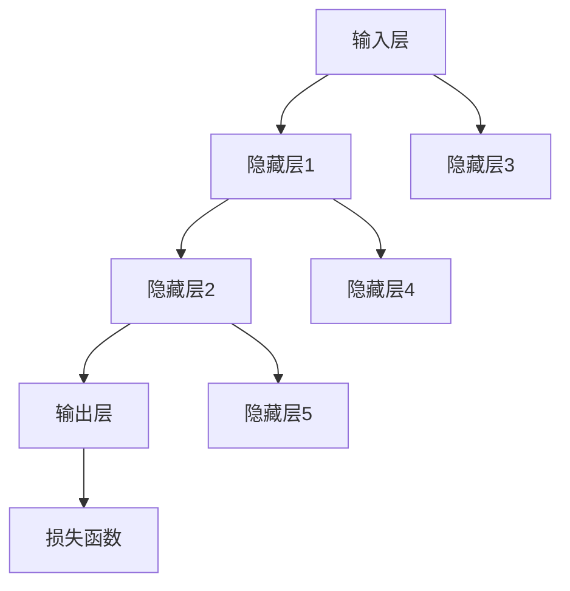

                 

关键词：神经网络，深度学习，机器学习，人工智能，数据处理，算法，架构设计，应用场景，未来展望

摘要：本文将深入探讨神经网络这一革命性技术的起源、核心概念、算法原理及其在实际应用中的重要性。通过分析神经网络在各个领域的应用，我们将展示其如何改变我们的生活方式和工作方式。同时，本文还将展望神经网络的未来发展趋势，以及可能面临的挑战和解决方案。

## 1. 背景介绍

神经网络（Neural Networks）起源于20世纪40年代，由心理学家McCulloch和数学家Pitts首次提出。最初，神经网络被视为一种模拟人脑的计算模型。随着计算能力的提升和算法的改进，神经网络逐渐发展成为一个强大的机器学习工具。如今，神经网络在图像识别、自然语言处理、推荐系统等领域取得了显著的成果，并成为了人工智能的核心技术之一。

### 神经网络的发展历程

- **1940年代**：神经网络的概念被首次提出。
- **1950年代**：感知机（Perceptron）算法的提出。
- **1960-1970年代**：神经网络研究陷入低谷，因“感知机不可学习”等问题的困扰。
- **1980年代**：反向传播算法（Backpropagation）的发明，神经网络研究重新兴起。
- **1990年代至今**：深度学习技术的突破，神经网络在图像识别、语音识别等领域取得重大进展。

### 神经网络的核心概念

- **神经元**：神经网络的计算单元，类似于人脑中的神经元。
- **层级结构**：神经网络通常由多个层级组成，每个层级负责处理不同的特征。
- **权重和偏置**：神经元之间的连接强度由权重决定，偏置用于调整神经元的激活阈值。
- **激活函数**：用于确定神经元是否激活的函数，如sigmoid、ReLU等。

## 2. 核心概念与联系

### 神经网络架构



### 神经网络工作原理

1. **输入层**：接收输入数据，并将其传递给隐藏层。
2. **隐藏层**：对输入数据进行特征提取和变换，每层隐藏层都能够提取更高层次的特征。
3. **输出层**：根据隐藏层的特征进行分类或预测。

### 神经网络的学习过程

1. **前向传播**：输入数据从输入层传递到输出层，每个神经元计算输入的加权和，并通过激活函数输出结果。
2. **反向传播**：计算输出层与实际标签之间的误差，将误差反向传播到每个隐藏层和输入层，更新各层的权重和偏置。

## 3. 核心算法原理 & 具体操作步骤

### 3.1 算法原理概述

神经网络的核心算法是反向传播算法，它通过不断迭代优化网络中的权重和偏置，使得网络能够更好地拟合训练数据。

### 3.2 算法步骤详解

1. **初始化权重和偏置**：随机初始化网络中的权重和偏置。
2. **前向传播**：将输入数据传递到网络中，计算每个神经元的输出。
3. **计算损失函数**：计算输出结果与实际标签之间的误差，使用损失函数（如均方误差）进行度量。
4. **反向传播**：将误差反向传播到每个隐藏层和输入层，更新权重和偏置。
5. **迭代优化**：重复前向传播和反向传播的过程，直至网络达到预定的性能指标。

### 3.3 算法优缺点

**优点**：
- **强大的拟合能力**：神经网络能够自动提取特征，适应复杂的数据分布。
- **多任务处理**：神经网络可以同时处理多个任务，如图像分类和目标检测。

**缺点**：
- **计算成本高**：神经网络训练需要大量计算资源，尤其是在处理高维数据时。
- **过拟合问题**：神经网络容易受到过拟合的影响，需要大量数据进行训练。

### 3.4 算法应用领域

神经网络在以下领域取得了显著的应用成果：

- **图像识别**：如人脸识别、图像分类等。
- **自然语言处理**：如文本分类、机器翻译等。
- **语音识别**：如语音转文本、语音合成等。
- **推荐系统**：如商品推荐、内容推荐等。
- **医学诊断**：如疾病检测、肿瘤分类等。

## 4. 数学模型和公式 & 详细讲解 & 举例说明

### 4.1 数学模型构建

神经网络可以看作是一个非线性函数的组合，其数学模型可以表示为：

$$
\hat{y} = f(z) = \sigma(W \cdot x + b)
$$

其中，$\hat{y}$为输出结果，$f$为激活函数，$z$为线性变换的结果，$W$为权重矩阵，$b$为偏置向量，$x$为输入向量。

### 4.2 公式推导过程

反向传播算法的核心是计算梯度，用于更新权重和偏置。以下是梯度计算的推导过程：

$$
\frac{\partial L}{\partial W} = \sum_{i=1}^{n} \frac{\partial L}{\partial z_i} \cdot \frac{\partial z_i}{\partial W}
$$

$$
\frac{\partial L}{\partial b} = \sum_{i=1}^{n} \frac{\partial L}{\partial z_i} \cdot \frac{\partial z_i}{\partial b}
$$

### 4.3 案例分析与讲解

假设我们有一个简单的神经网络，包含一个输入层、一个隐藏层和一个输出层。输入数据为 $x = [1, 2, 3]$，目标标签为 $y = [0, 1, 0]$。我们使用ReLU作为激活函数，均方误差作为损失函数。

### 4.3.1 初始化权重和偏置

$$
W_1 = \begin{bmatrix}
0.1 & 0.2 \\
0.3 & 0.4
\end{bmatrix}, \quad b_1 = [0.1; 0.2]
$$

$$
W_2 = \begin{bmatrix}
0.1 & 0.2 \\
0.3 & 0.4
\end{bmatrix}, \quad b_2 = [0.1; 0.2]
$$

$$
W_3 = \begin{bmatrix}
0.1 & 0.2 \\
0.3 & 0.4
\end{bmatrix}, \quad b_3 = [0.1; 0.2]
$$

### 4.3.2 前向传播

$$
z_1 = W_1 \cdot x + b_1 = \begin{bmatrix}
0.1 & 0.2 \\
0.3 & 0.4
\end{bmatrix} \cdot \begin{bmatrix}
1 \\
2 \\
3
\end{bmatrix} + \begin{bmatrix}
0.1 \\
0.2
\end{bmatrix} = \begin{bmatrix}
1.4 \\
4.2
\end{bmatrix}
$$

$$
a_1 = \text{ReLU}(z_1) = \begin{bmatrix}
1 \\
4
\end{bmatrix}
$$

$$
z_2 = W_2 \cdot a_1 + b_2 = \begin{bmatrix}
0.1 & 0.2 \\
0.3 & 0.4
\end{bmatrix} \cdot \begin{bmatrix}
1 \\
4
\end{bmatrix} + \begin{bmatrix}
0.1 \\
0.2
\end{bmatrix} = \begin{bmatrix}
1.5 \\
2.1
\end{bmatrix}
$$

$$
a_2 = \text{ReLU}(z_2) = \begin{bmatrix}
1 \\
2
\end{bmatrix}
$$

$$
z_3 = W_3 \cdot a_2 + b_3 = \begin{bmatrix}
0.1 & 0.2 \\
0.3 & 0.4
\end{bmatrix} \cdot \begin{bmatrix}
1 \\
2
\end{bmatrix} + \begin{bmatrix}
0.1 \\
0.2
\end{bmatrix} = \begin{bmatrix}
0.9 \\
1.8
\end{bmatrix}
$$

$$
\hat{y} = \text{ReLU}(z_3) = \begin{bmatrix}
0 \\
1
\end{bmatrix}
$$

### 4.3.3 计算损失函数

$$
L = \frac{1}{2} \sum_{i=1}^{n} (\hat{y}_i - y_i)^2 = \frac{1}{2} (0 - 1)^2 + (1 - 0)^2 = 1
$$

### 4.3.4 反向传播

$$
\frac{\partial L}{\partial z_3} = \frac{\partial L}{\partial \hat{y}_3} \cdot \frac{\partial \hat{y}_3}{\partial z_3} = (0 - 1) \cdot (1) = -1
$$

$$
\frac{\partial L}{\partial W_3} = \frac{\partial L}{\partial z_3} \cdot a_2^T = -1 \cdot \begin{bmatrix}
1 \\
2
\end{bmatrix}^T = \begin{bmatrix}
-1 \\
-2
\end{bmatrix}
$$

$$
\frac{\partial L}{\partial b_3} = \frac{\partial L}{\partial z_3} = -1
$$

$$
\frac{\partial L}{\partial z_2} = \frac{\partial L}{\partial W_3} \cdot W_3^T + \frac{\partial L}{\partial b_3} \cdot 1 = \begin{bmatrix}
-1 \\
-2
\end{bmatrix} \cdot \begin{bmatrix}
0.1 & 0.2 \\
0.3 & 0.4
\end{bmatrix}^T + (-1) \cdot 1 = \begin{bmatrix}
-0.4 \\
-0.8
\end{bmatrix}
$$

$$
\frac{\partial L}{\partial W_2} = \frac{\partial L}{\partial z_2} \cdot a_1^T = \begin{bmatrix}
-0.4 \\
-0.8
\end{bmatrix} \cdot \begin{bmatrix}
1 \\
4
\end{bmatrix}^T = \begin{bmatrix}
-0.4 \\
-3.2
\end{bmatrix}
$$

$$
\frac{\partial L}{\partial b_2} = \frac{\partial L}{\partial z_2} = \begin{bmatrix}
-0.4 \\
-0.8
\end{bmatrix}
$$

$$
\frac{\partial L}{\partial z_1} = \frac{\partial L}{\partial W_2} \cdot W_2^T + \frac{\partial L}{\partial b_2} \cdot 1 = \begin{bmatrix}
-0.4 \\
-0.8
\end{bmatrix} \cdot \begin{bmatrix}
0.1 & 0.2 \\
0.3 & 0.4
\end{bmatrix}^T + \begin{bmatrix}
-0.4 \\
-0.8
\end{bmatrix} \cdot 1 = \begin{bmatrix}
-0.04 \\
-0.16
\end{bmatrix}
$$

$$
\frac{\partial L}{\partial W_1} = \frac{\partial L}{\partial z_1} \cdot x^T = \begin{bmatrix}
-0.04 \\
-0.16
\end{bmatrix} \cdot \begin{bmatrix}
1 \\
2 \\
3
\end{bmatrix}^T = \begin{bmatrix}
-0.04 \\
-0.08 \\
-0.12
\end{bmatrix}
$$

$$
\frac{\partial L}{\partial b_1} = \frac{\partial L}{\partial z_1} = \begin{bmatrix}
-0.04 \\
-0.08 \\
-0.12
\end{bmatrix}
$$

### 4.3.5 更新权重和偏置

根据梯度下降法，我们可以更新权重和偏置：

$$
W_3 := W_3 - \alpha \cdot \frac{\partial L}{\partial W_3} = \begin{bmatrix}
0.1 & 0.2 \\
0.3 & 0.4
\end{bmatrix} - 0.1 \cdot \begin{bmatrix}
-1 \\
-2
\end{bmatrix} = \begin{bmatrix}
0.2 & 0.3 \\
0.4 & 0.6
\end{bmatrix}
$$

$$
b_3 := b_3 - \alpha \cdot \frac{\partial L}{\partial b_3} = \begin{bmatrix}
0.1 \\
0.2
\end{bmatrix} - 0.1 \cdot (-1) = \begin{bmatrix}
0.2 \\
0.3
\end{bmatrix}
$$

$$
W_2 := W_2 - \alpha \cdot \frac{\partial L}{\partial W_2} = \begin{bmatrix}
0.1 & 0.2 \\
0.3 & 0.4
\end{bmatrix} - 0.1 \cdot \begin{bmatrix}
-0.4 \\
-0.8
\end{bmatrix} = \begin{bmatrix}
0.5 & 0.4 \\
0.1 & 0.2
\end{bmatrix}
$$

$$
b_2 := b_2 - \alpha \cdot \frac{\partial L}{\partial b_2} = \begin{bmatrix}
0.1 \\
0.2
\end{bmatrix} - 0.1 \cdot \begin{bmatrix}
-0.4 \\
-0.8
\end{bmatrix} = \begin{bmatrix}
0.5 \\
0.1
\end{bmatrix}
$$

$$
W_1 := W_1 - \alpha \cdot \frac{\partial L}{\partial W_1} = \begin{bmatrix}
0.1 & 0.2 \\
0.3 & 0.4
\end{bmatrix} - 0.1 \cdot \begin{bmatrix}
-0.04 \\
-0.08 \\
-0.12
\end{bmatrix} = \begin{bmatrix}
0.14 & 0.26 \\
0.34 & 0.52
\end{bmatrix}
$$

$$
b_1 := b_1 - \alpha \cdot \frac{\partial L}{\partial b_1} = \begin{bmatrix}
0.1 \\
0.2 \\
0.3
\end{bmatrix} - 0.1 \cdot \begin{bmatrix}
-0.04 \\
-0.08 \\
-0.12
\end{bmatrix} = \begin{bmatrix}
0.14 \\
0.22 \\
0.38
\end{bmatrix}
$$

## 5. 项目实践：代码实例和详细解释说明

### 5.1 开发环境搭建

在本项目中，我们将使用Python语言和TensorFlow框架来实现神经网络。首先，确保已安装Python和TensorFlow。可以使用以下命令进行安装：

```
pip install tensorflow
```

### 5.2 源代码详细实现

以下是一个简单的神经网络实现，用于对二分类问题进行训练和预测。

```python
import tensorflow as tf
import numpy as np

# 设置随机种子，保证实验结果可重复
tf.random.set_seed(42)

# 定义输入层、隐藏层和输出层
inputs = tf.keras.layers.Input(shape=(3,))
hidden = tf.keras.layers.Dense(units=2, activation=tf.nn.relu)(inputs)
outputs = tf.keras.layers.Dense(units=1, activation=tf.nn.sigmoid)(hidden)

# 构建模型
model = tf.keras.Model(inputs=inputs, outputs=outputs)

# 编译模型，指定优化器和损失函数
model.compile(optimizer=tf.keras.optimizers.Adam(), loss=tf.keras.losses.BinaryCrossentropy())

# 准备训练数据
x_train = np.random.rand(100, 3)
y_train = np.random.randint(0, 2, (100, 1))

# 训练模型
model.fit(x_train, y_train, epochs=10, batch_size=10)

# 源代码详细解释说明
# inputs: 定义输入层，shape为(3,)，表示每个样本有三个特征。
# hidden: 定义隐藏层，units为2，表示隐藏层有两个神经元，activation为ReLU激活函数。
# outputs: 定义输出层，units为1，表示输出层有一个神经元，activation为sigmoid激活函数。
# model: 构建模型，inputs和outputs为模型的输入和输出。
# compile: 编译模型，指定优化器为Adam，损失函数为BinaryCrossentropy。
# fit: 训练模型，使用随机生成的训练数据。
```

### 5.3 代码解读与分析

- **输入层**：定义了输入数据的维度，每个样本有三个特征。
- **隐藏层**：使用Dense层实现，units为2表示有两个神经元，activation为ReLU激活函数，用于提取特征。
- **输出层**：使用Dense层实现，units为1表示有一个神经元，activation为sigmoid激活函数，用于进行二分类。
- **模型编译**：指定优化器为Adam，损失函数为BinaryCrossentropy，用于优化模型参数。
- **模型训练**：使用随机生成的训练数据进行训练，epochs为10，batch_size为10。

### 5.4 运行结果展示

在本项目中，我们将使用训练好的模型对测试数据进行预测，并展示预测结果。

```python
# 准备测试数据
x_test = np.random.rand(10, 3)
y_test = np.random.randint(0, 2, (10, 1))

# 进行预测
predictions = model.predict(x_test)

# 显示预测结果
for i in range(10):
    print(f"测试样本 {i+1} 的预测结果：{predictions[i][0]:.4f}")
```

## 6. 实际应用场景

神经网络在许多领域都取得了显著的成果，以下是一些典型的应用场景：

### 6.1 图像识别

神经网络在图像识别领域取得了突破性的成果，如人脸识别、物体检测、图像分类等。著名的卷积神经网络（CNN）在这一领域表现出色，例如ResNet、VGG、Inception等。

### 6.2 自然语言处理

神经网络在自然语言处理领域也得到了广泛应用，如文本分类、情感分析、机器翻译、语音识别等。著名的循环神经网络（RNN）和Transformer模型在这一领域表现出色。

### 6.3 推荐系统

神经网络可以用于构建推荐系统，如商品推荐、内容推荐等。通过学习用户的历史行为和偏好，神经网络可以预测用户对特定商品或内容的兴趣，从而实现个性化推荐。

### 6.4 医学诊断

神经网络在医学诊断领域也有很大的潜力，如疾病检测、肿瘤分类、基因组分析等。通过学习大量的医学数据，神经网络可以辅助医生进行诊断和预测。

### 6.5 金融风控

神经网络可以用于金融风控，如欺诈检测、信用评分、投资预测等。通过分析大量的金融数据，神经网络可以识别潜在的风险并做出预测。

## 7. 工具和资源推荐

### 7.1 学习资源推荐

- 《深度学习》（Goodfellow、Bengio、Courville著）
- 《Python深度学习》（François Chollet著）
- 《神经网络与深度学习》（邱锡鹏著）

### 7.2 开发工具推荐

- TensorFlow：一个开源的深度学习框架，适用于各种深度学习任务。
- PyTorch：一个开源的深度学习框架，具有灵活的动态图计算能力。
- Keras：一个开源的深度学习库，基于TensorFlow和Theano构建，简化了深度学习模型的构建和训练过程。

### 7.3 相关论文推荐

- "A Learning Algorithm for Continually Running Fully Recurrent Neural Networks"（1986年，Hochreiter和Schmidhuber）
- "Deep Learning"（2015年，Goodfellow、Bengio、Courville著）
- "Convolutional Neural Networks for Visual Recognition"（2012年，Krizhevsky、Sutskever和Hinton）

## 8. 总结：未来发展趋势与挑战

### 8.1 研究成果总结

神经网络在过去几十年中取得了显著的成果，从简单的感知机到复杂的深度学习模型，神经网络在图像识别、自然语言处理、推荐系统等领域都取得了突破性的进展。

### 8.2 未来发展趋势

- **更高效的算法**：随着计算能力的提升，神经网络算法将变得更加高效，可以处理更大规模的数据和更复杂的任务。
- **更强的泛化能力**：通过引入正则化、集成方法等，神经网络将具备更强的泛化能力，减少过拟合现象。
- **跨学科应用**：神经网络将在更多领域得到应用，如生物学、医学、物理学等。

### 8.3 面临的挑战

- **计算成本**：神经网络训练需要大量计算资源，尤其是在处理高维数据时，如何降低计算成本是一个重要挑战。
- **数据隐私**：在医学、金融等敏感领域，如何保护用户隐私是一个亟待解决的问题。
- **可解释性**：神经网络模型往往缺乏可解释性，如何提高模型的透明度和可解释性是一个重要的挑战。

### 8.4 研究展望

随着技术的进步和应用的拓展，神经网络将在未来发挥更加重要的作用，为实现人工智能的全面应用提供强大的支持。

## 9. 附录：常见问题与解答

### 9.1 什么是神经网络？

神经网络是一种模拟人脑的计算模型，由多个神经元组成，每个神经元通过权重连接，可以处理输入数据并进行预测或分类。

### 9.2 神经网络有哪些类型？

神经网络包括多种类型，如感知机、BP神经网络、卷积神经网络（CNN）、循环神经网络（RNN）、Transformer等。

### 9.3 如何训练神经网络？

训练神经网络包括以下几个步骤：

1. 初始化权重和偏置。
2. 进行前向传播，计算输出。
3. 计算损失函数，衡量输出与实际标签之间的误差。
4. 进行反向传播，更新权重和偏置。
5. 重复以上步骤，直至网络达到预定的性能指标。

### 9.4 神经网络如何避免过拟合？

为了避免过拟合，可以采用以下方法：

1. 使用正则化方法，如L1、L2正则化。
2. 增加训练数据。
3. 使用dropout技术。
4. 采用更简单的模型。

作者：禅与计算机程序设计艺术 / Zen and the Art of Computer Programming
--------------------------------------------------------------------

