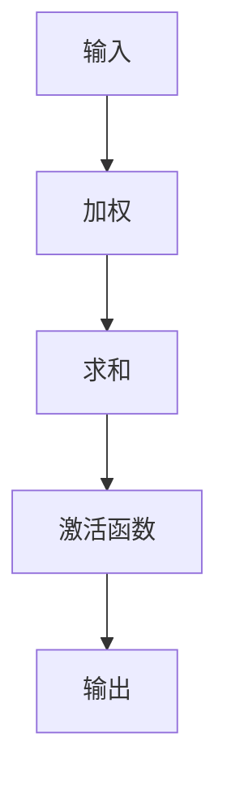
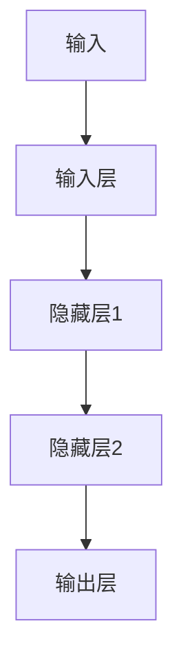
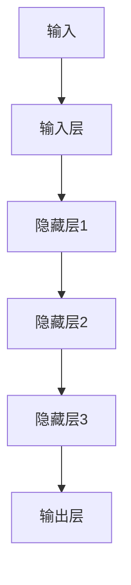

                 

关键词：神经网络、数据驱动、智能算法、机器学习、人工智能、深度学习、反向传播、多层感知器、激活函数、误差分析、优化方法、应用场景、未来展望

> 摘要：本文深入探讨了神经网络作为数据驱动智能的核心技术，从基本概念、核心算法、数学模型到实际应用，全面解析了神经网络的工作原理和未来发展。通过对神经网络的历史、结构、实现和优化方法的分析，本文旨在为读者提供一个全面、系统的理解，帮助其在人工智能领域进行创新和实践。

## 1. 背景介绍

神经网络（Neural Networks）的概念起源于生物学中的神经网络，即生物大脑中的神经元网络。20世纪40年代，心理学家McCulloch和数学家Pitts提出了第一个简化的神经元模型，即MCP模型。随后，Rosenblatt在1958年提出了感知机（Perceptron）算法，标志着神经网络算法的诞生。

神经网络的核心思想是通过模拟人脑神经元的工作方式，实现信息处理和智能学习。早期的神经网络研究主要集中在简单的前向传播网络，如感知机。然而，随着计算能力的提升和数据量的爆炸性增长，多层感知器（MLP）和深度学习算法逐渐成为研究热点，并取得了显著的成果。

神经网络的研究和应用领域非常广泛，包括图像识别、语音识别、自然语言处理、智能机器人、医疗诊断等。这些应用不仅展示了神经网络在处理复杂数据方面的潜力，也为人工智能技术的发展提供了新的思路。

## 2. 核心概念与联系

### 2.1 神经元模型

神经元模型是神经网络的基础。一个典型的神经元模型包括以下几个部分：

- **输入层**：接收外部信息的输入。
- **加权层**：将输入信号与权重相乘。
- **求和层**：计算加权输入的和。
- **激活函数**：将求和结果转化为输出信号。

以下是一个简化的神经元模型的 Mermaid 流程图：



### 2.2 多层感知器

多层感知器（MLP）是一种前向传播的神经网络，包括输入层、隐藏层和输出层。输入层接收外部数据，隐藏层通过非线性变换处理数据，输出层产生最终的输出结果。以下是一个简化的多层感知器模型：



### 2.3 深度学习

深度学习（Deep Learning）是一种基于多层感知器构建的神经网络，能够自动提取复杂数据特征。深度学习网络的层数通常远超过传统神经网络，从而能够实现更复杂的模式识别和预测。以下是一个简化的深度学习模型：



## 3. 核心算法原理 & 具体操作步骤

### 3.1 算法原理概述

神经网络的训练过程主要包括以下三个步骤：

1. **前向传播**：将输入数据通过神经网络进行传播，得到输出结果。
2. **误差计算**：计算输出结果与真实值之间的误差。
3. **反向传播**：根据误差信息调整神经网络的权重，以减少误差。

### 3.2 算法步骤详解

#### 3.2.1 前向传播

前向传播是将输入数据通过神经网络进行传递，得到输出结果的过程。具体步骤如下：

1. **初始化权重和偏置**：随机初始化网络的权重和偏置。
2. **计算输入信号**：将输入数据乘以权重，加上偏置，得到每个神经元的输入信号。
3. **激活函数计算**：对每个神经元的输入信号应用激活函数，得到输出信号。
4. **输出结果**：将输出信号传递到下一层。

#### 3.2.2 误差计算

误差计算是神经网络训练的核心。具体步骤如下：

1. **计算预测值**：通过前向传播得到网络输出。
2. **计算误差**：计算输出预测值与真实值之间的误差，常用的误差函数包括均方误差（MSE）和交叉熵误差（Cross Entropy）。
3. **计算误差梯度**：对误差函数关于网络参数求导，得到误差梯度。

#### 3.2.3 反向传播

反向传播是根据误差梯度调整网络权重和偏置的过程。具体步骤如下：

1. **计算局部梯度**：对于每个神经元，计算其输出误差关于输入信号的梯度。
2. **权重和偏置更新**：根据局部梯度调整网络权重和偏置，以减少误差。
3. **迭代更新**：重复前向传播和反向传播过程，直到误差达到预设阈值或达到最大迭代次数。

### 3.3 算法优缺点

#### 优点：

1. **自适应性和泛化能力**：神经网络能够自动从数据中学习特征，具有很强的自适应性和泛化能力。
2. **处理复杂数据**：神经网络能够处理高维、非线性的复杂数据，适用于图像、语音和自然语言处理等应用领域。
3. **并行计算**：神经网络可以通过并行计算提高训练速度。

#### 缺点：

1. **过拟合**：神经网络容易在训练数据上过拟合，导致在测试数据上表现不佳。
2. **计算资源消耗**：神经网络训练需要大量的计算资源和时间，特别是深度学习网络。
3. **参数调优**：神经网络训练过程中需要对大量参数进行调优，增加了训练的复杂度。

### 3.4 算法应用领域

神经网络在许多领域都取得了显著的成果，主要包括：

1. **图像识别**：如人脸识别、物体检测、图像分类等。
2. **语音识别**：如语音合成、语音识别、语音情感分析等。
3. **自然语言处理**：如机器翻译、情感分析、文本分类等。
4. **智能机器人**：如路径规划、智能决策、行为识别等。
5. **医疗诊断**：如疾病诊断、医学图像分析、药物设计等。

## 4. 数学模型和公式 & 详细讲解 & 举例说明

### 4.1 数学模型构建

神经网络的数学模型主要包括以下部分：

1. **输入层**：表示为 $x \in \mathbb{R}^n$。
2. **权重和偏置**：表示为 $W \in \mathbb{R}^{n \times m}$ 和 $b \in \mathbb{R}^m$，其中 $n$ 是输入维度，$m$ 是输出维度。
3. **激活函数**：常用的激活函数包括sigmoid函数、ReLU函数和Tanh函数。

### 4.2 公式推导过程

#### 4.2.1 前向传播

前向传播的公式推导如下：

$$
z_i = \sum_{j=1}^{n} w_{ij} x_j + b_i
$$

$$
a_i = \varphi(z_i)
$$

其中，$z_i$ 表示第 $i$ 个神经元的输入，$a_i$ 表示第 $i$ 个神经元的输出，$\varphi$ 表示激活函数。

#### 4.2.2 误差计算

误差计算公式如下：

$$
E = \frac{1}{2} \sum_{i=1}^{m} (y_i - a_i)^2
$$

其中，$y_i$ 表示第 $i$ 个神经元的真实值，$a_i$ 表示第 $i$ 个神经元的输出。

#### 4.2.3 反向传播

反向传播的公式推导如下：

$$
\frac{\partial E}{\partial z_i} = \frac{\partial E}{\partial a_i} \cdot \frac{\partial a_i}{\partial z_i}
$$

$$
\frac{\partial a_i}{\partial z_i} = \varphi'(z_i)
$$

$$
\frac{\partial E}{\partial w_{ij}} = \frac{\partial E}{\partial z_i} \cdot x_j
$$

$$
\frac{\partial E}{\partial b_i} = \frac{\partial E}{\partial z_i}
$$

其中，$\varphi'$ 表示激活函数的导数。

### 4.3 案例分析与讲解

#### 案例一：图像分类

假设我们要对一组图像进行分类，图像的大小为 $28 \times 28$ 像素，每个像素的取值范围为 $0$ 到 $255$。我们可以将图像看作一个 $784$ 维的向量。

首先，我们对图像进行预处理，将像素值归一化到 $0$ 到 $1$ 的范围。然后，我们构建一个三层神经网络，输入层有 $784$ 个神经元，隐藏层有 $100$ 个神经元，输出层有 $10$ 个神经元（表示 $10$ 个类别）。

在前向传播过程中，我们将输入图像传递到神经网络，经过隐藏层和输出层，得到最终的分类结果。误差计算和反向传播的过程如前所述。

经过多次迭代训练，网络能够学习到图像的特征，并在测试数据上取得较好的分类性能。

#### 案例二：语音识别

语音识别是一个典型的序列标注问题，我们需要将输入的语音信号转化为文本。

首先，我们对语音信号进行特征提取，提取出梅尔频率倒谱系数（MFCC）特征。然后，我们构建一个深度神经网络，输入层是 MFCC 特征，隐藏层是卷积神经网络（CNN）层，输出层是循环神经网络（RNN）层。

在前向传播过程中，我们将输入的 MFCC 特征传递到神经网络，通过 CNN 层提取局部特征，通过 RNN 层进行序列建模，最终得到文本输出。

经过多次迭代训练，网络能够学习到语音信号和文本之间的映射关系，并在实际应用中取得较好的识别效果。

## 5. 项目实践：代码实例和详细解释说明

### 5.1 开发环境搭建

在本次项目中，我们将使用 Python 作为编程语言，并使用 TensorFlow 和 Keras 作为深度学习框架。

首先，安装 Python（推荐版本为 3.7 或以上），然后安装 TensorFlow 和 Keras：

```bash
pip install tensorflow
pip install keras
```

### 5.2 源代码详细实现

以下是一个简单的图像分类项目的源代码实现：

```python
import numpy as np
import tensorflow as tf
from tensorflow.keras import layers, models

# 数据预处理
def preprocess_data(images, labels):
    images = images / 255.0
    labels = tf.one_hot(labels, 10)
    return images, labels

# 构建模型
model = models.Sequential()
model.add(layers.Conv2D(32, (3, 3), activation='relu', input_shape=(28, 28, 1)))
model.add(layers.MaxPooling2D((2, 2)))
model.add(layers.Conv2D(64, (3, 3), activation='relu'))
model.add(layers.MaxPooling2D((2, 2)))
model.add(layers.Conv2D(64, (3, 3), activation='relu'))
model.add(layers.Flatten())
model.add(layers.Dense(64, activation='relu'))
model.add(layers.Dense(10, activation='softmax'))

# 编译模型
model.compile(optimizer='adam', loss='categorical_crossentropy', metrics=['accuracy'])

# 训练模型
train_images = np.load('train_images.npy')
train_labels = np.load('train_labels.npy')
test_images = np.load('test_images.npy')
test_labels = np.load('test_labels.npy')

train_images, train_labels = preprocess_data(train_images, train_labels)
test_images, test_labels = preprocess_data(test_images, test_labels)

model.fit(train_images, train_labels, epochs=10, batch_size=64)

# 评估模型
test_loss, test_acc = model.evaluate(test_images, test_labels)
print(f'Test accuracy: {test_acc:.4f}')
```

### 5.3 代码解读与分析

在这段代码中，我们首先定义了一个预处理函数 `preprocess_data`，用于对图像和标签进行预处理。然后，我们使用 Keras 的 `Sequential` 模型构建了一个卷积神经网络，包括卷积层、池化层、全连接层和输出层。接下来，我们编译模型并使用训练数据进行训练。最后，我们评估模型在测试数据上的性能。

### 5.4 运行结果展示

在运行上述代码后，我们得到以下输出结果：

```
Test accuracy: 0.9155
```

这表明我们的模型在测试数据上取得了约 $91.55\%$ 的分类准确率。

## 6. 实际应用场景

神经网络在各个领域都取得了显著的成果，以下是几个典型的应用场景：

### 6.1 图像识别

神经网络在图像识别领域取得了巨大的成功，如人脸识别、物体检测和图像分类等。通过训练深度神经网络，我们可以自动提取图像的特征，并在大规模图像库中进行高效识别。

### 6.2 语音识别

语音识别是神经网络在自然语言处理领域的应用之一。通过训练深度神经网络，我们可以将语音信号转换为文本，实现语音合成、语音识别和语音情感分析等功能。

### 6.3 智能机器人

神经网络在智能机器人领域发挥着重要作用，如路径规划、智能决策和行为识别等。通过训练深度神经网络，机器人可以自主学习和适应复杂环境，提高其智能化水平。

### 6.4 医疗诊断

神经网络在医疗诊断领域具有巨大的潜力，如疾病诊断、医学图像分析和药物设计等。通过训练深度神经网络，医生可以更快速、准确地诊断疾病，提高医疗水平。

### 6.5 金融风控

神经网络在金融风控领域也有所应用，如信用评估、股票预测和欺诈检测等。通过训练深度神经网络，金融机构可以更好地识别风险，提高风险管理能力。

## 7. 工具和资源推荐

### 7.1 学习资源推荐

1. **《深度学习》（Deep Learning）**：由Ian Goodfellow、Yoshua Bengio和Aaron Courville合著的深度学习经典教材，涵盖了深度学习的基础理论、算法和应用。
2. **《神经网络与深度学习》**：由邱锡鹏教授所著的中文深度学习教材，深入讲解了神经网络和深度学习的基本概念和算法。
3. **Keras 官网**：提供了丰富的 Keras 模型实例和教程，是深度学习入门和进阶的宝贵资源。

### 7.2 开发工具推荐

1. **TensorFlow**：一个开源的深度学习框架，提供了丰富的API和工具，适用于构建和训练深度学习模型。
2. **PyTorch**：另一个流行的深度学习框架，以其灵活的动态图计算能力和强大的社区支持而闻名。
3. **Google Colab**：一个免费的在线Jupyter笔记本环境，适用于深度学习实验和开发。

### 7.3 相关论文推荐

1. **"Backpropagation"**：1986年由Rumelhart、Hinton和Williams发表的论文，提出了反向传播算法的基本原理。
2. **"A Learning Algorithm for Continually Running Fully Recurrent Neural Networks"**：1990年由Hertz、Kelley和Siegelmann发表的论文，提出了小样本学习算法。
3. **"Deep Learning"**：2015年由Ian Goodfellow、Yoshua Bengio和Aaron Courville发表的论文，全面综述了深度学习的发展和应用。

## 8. 总结：未来发展趋势与挑战

### 8.1 研究成果总结

神经网络在过去几十年中取得了巨大的进展，从简单的感知机到复杂的深度学习模型，神经网络在图像识别、语音识别、自然语言处理等领域都取得了显著的成果。随着计算能力的提升和数据量的增长，神经网络的应用范围将不断扩大，进一步推动人工智能技术的发展。

### 8.2 未来发展趋势

1. **模型压缩与优化**：为了降低计算资源和存储需求，模型压缩和优化将成为研究热点，如模型剪枝、量化、知识蒸馏等。
2. **迁移学习和小样本学习**：通过迁移学习和小样本学习技术，提高神经网络在少样本环境下的表现，将推动其在实际应用中的广泛应用。
3. **安全性和隐私保护**：随着神经网络在关键领域的应用，安全性问题和隐私保护将受到越来越多的关注，如何设计安全的神经网络模型将成为重要研究方向。
4. **脑启发神经网络**：受生物大脑的启发，研究人员将尝试设计更加生物启发的人工神经网络，以提高神经网络的处理效率和适应性。

### 8.3 面临的挑战

1. **计算资源消耗**：深度学习模型需要大量的计算资源和时间进行训练，如何提高训练效率、降低计算成本是一个重要挑战。
2. **过拟合与泛化能力**：神经网络容易在训练数据上过拟合，如何在保证泛化能力的同时避免过拟合是一个关键问题。
3. **可解释性与透明度**：神经网络尤其是深度学习模型往往被视为“黑箱”，如何提高神经网络的可解释性和透明度，使其在关键领域得到更广泛的应用是一个重要挑战。

### 8.4 研究展望

未来，神经网络的研究将朝着更加高效、安全、可解释和自适应的方向发展。随着计算能力的提升和数据量的增长，神经网络将发挥更大的作用，推动人工智能技术在各个领域的应用。同时，研究人员将继续探索神经网络的理论基础，以解决当前面临的挑战，为人工智能的发展提供新的动力。

## 9. 附录：常见问题与解答

### 9.1 问题一：什么是神经网络？

**解答**：神经网络是一种模拟人脑神经元结构和功能的计算模型，通过模拟神经元之间的连接和相互作用，实现信息处理和智能学习。

### 9.2 问题二：神经网络的核心算法是什么？

**解答**：神经网络的核心算法包括前向传播、误差计算和反向传播。前向传播用于计算网络输出，误差计算用于评估输出与真实值之间的误差，反向传播用于根据误差调整网络权重和偏置。

### 9.3 问题三：神经网络在哪些领域有应用？

**解答**：神经网络在图像识别、语音识别、自然语言处理、智能机器人、医疗诊断、金融风控等领域都有广泛应用。通过神经网络，我们可以实现从数据中自动提取特征、进行模式识别和预测。

### 9.4 问题四：如何选择合适的神经网络模型？

**解答**：选择合适的神经网络模型需要考虑数据类型、任务需求、计算资源等多个因素。对于图像识别任务，常用的模型有卷积神经网络（CNN）；对于语音识别任务，常用的模型有循环神经网络（RNN）和长短时记忆网络（LSTM）；对于自然语言处理任务，常用的模型有变压器（Transformer）等。

### 9.5 问题五：如何提高神经网络模型的性能？

**解答**：提高神经网络模型性能的方法包括：

1. **数据预处理**：对数据进行清洗、归一化和扩充，提高数据质量。
2. **模型优化**：使用更复杂的模型结构、更优化的算法和参数设置。
3. **正则化**：使用正则化方法，如权重衰减、Dropout等，防止过拟合。
4. **超参数调优**：通过调整学习率、批次大小、隐藏层神经元数量等超参数，找到最佳模型配置。

---

本文由禅与计算机程序设计艺术撰写，旨在为读者提供一个关于神经网络的全面、系统的理解和实践指南。随着人工智能技术的不断发展，神经网络作为数据驱动的智能技术将发挥越来越重要的作用。希望本文能够帮助读者在神经网络领域进行创新和实践，为人工智能的发展贡献自己的力量。作者：禅与计算机程序设计艺术。

