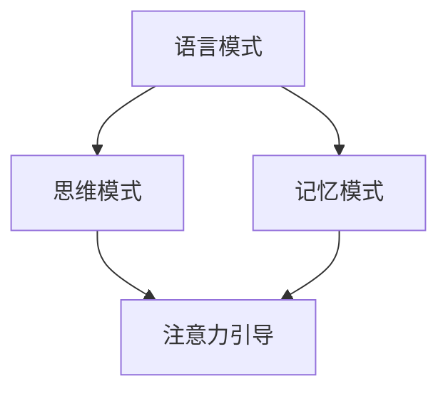

                 

神经语言程序设计（Neuro-Linguistic Programming，NLP）是一门研究人类思维过程、语言行为及其相互作用的科学。它起源于20世纪70年代，通过观察和研究成功的个体，总结出一种模仿优秀思维模式的方法。近年来，随着人工智能技术的飞速发展，NLP在计算机科学中的应用越来越广泛，特别是在注意力引导方面。本文将探讨神经语言程序设计在注意力引导中的核心概念、算法原理、数学模型以及实际应用。

## 1. 背景介绍

注意力引导（Attention Guiding）是人工智能领域中一个重要的研究方向，其目的是通过引导模型关注重要信息，提高模型在复杂任务中的表现。传统的注意力机制主要依赖于全局信息，容易导致信息过载和效率低下。而神经语言程序设计提供了一种新的思路，通过模仿人类的注意力机制，实现更高效的信息处理。

神经语言程序设计在计算机科学中的应用主要体现在以下几个方面：

1. **自然语言处理**：NLP技术在文本分类、情感分析、机器翻译等任务中发挥了重要作用，通过引导模型关注关键信息，提高任务处理的准确性和效率。
2. **计算机视觉**：在图像识别、目标检测等任务中，NLP可以帮助模型更好地理解图像内容，提高识别准确率。
3. **强化学习**：在强化学习任务中，NLP可以指导模型关注关键状态和动作，提高学习效率。
4. **推荐系统**：在推荐系统中，NLP可以帮助模型更好地理解用户需求，提高推荐效果。

## 2. 核心概念与联系

神经语言程序设计的核心概念包括语言模式、思维模式和记忆模式。这些概念之间相互联系，共同构成了一个复杂的系统。

### 2.1 语言模式

语言模式是指人类在交流过程中使用的语言结构、语法和语义规则。神经语言程序设计通过分析语言模式，提取关键信息，帮助模型更好地理解语言内容。

### 2.2 思维模式

思维模式是指人类在解决问题、决策和创新过程中使用的思维方式。神经语言程序设计通过模仿人类的思维模式，指导模型在复杂任务中找到最优解。

### 2.3 记忆模式

记忆模式是指人类在记忆信息、提取信息和利用信息过程中使用的记忆策略。神经语言程序设计通过分析记忆模式，帮助模型提高信息处理效率。

### 2.4 Mermaid 流程图



## 3. 核心算法原理 & 具体操作步骤

神经语言程序设计在注意力引导中的核心算法是基于图神经网络（Graph Neural Networks，GNN）的注意力机制。GNN能够通过图结构表示知识，并利用节点和边的属性进行信息传递和聚合。

### 3.1 算法原理概述

GNN通过以下步骤实现注意力引导：

1. **图表示**：将输入数据表示为图结构，其中节点表示实体，边表示实体之间的关系。
2. **节点嵌入**：将图中的节点转换为低维嵌入向量。
3. **信息聚合**：通过节点和边的属性，对节点嵌入向量进行聚合，得到全局表示。
4. **注意力计算**：利用聚合后的全局表示，计算每个节点的注意力权重。
5. **引导注意力**：根据注意力权重，对模型输入进行加权处理，引导模型关注关键信息。

### 3.2 算法步骤详解

1. **图表示**：
   - 输入数据为图（G = (V, E)），其中V为节点集合，E为边集合。
   - 对每个节点v ∈ V，定义其属性向量x\_v ∈ R^d。
   - 对每个边e ∈ E，定义其属性向量y\_e ∈ R^d。

2. **节点嵌入**：
   - 利用预训练的词嵌入模型，对节点属性向量x\_v进行嵌入，得到节点嵌入向量h\_v ∈ R^d。

3. **信息聚合**：
   - 对每个节点v，聚合其邻接节点的嵌入向量h\_u和边属性向量y\_e，得到聚合表示r\_v = Agg(h\_u, y\_e)。
   - 其中，Agg表示信息聚合函数，如加和聚合、平均聚合等。

4. **注意力计算**：
   - 利用注意力模型，计算每个节点的注意力权重α\_v ∈ R，其中α\_v = Attention(r\_v)。
   - 其中，Attention表示注意力计算函数，如软注意力、硬注意力等。

5. **引导注意力**：
   - 对模型输入进行加权处理，得到加权表示：x\_w = WeightedSum(h\_v, α\_v)。
   - 其中，WeightedSum表示加权求和函数。

### 3.3 算法优缺点

**优点**：

1. **高效性**：GNN能够在图结构上高效地传递和聚合信息，提高模型处理效率。
2. **灵活性**：GNN可以灵活地适应不同类型的图结构和任务需求。

**缺点**：

1. **可扩展性**：随着图规模的增加，GNN的训练时间和计算资源需求也会增加。
2. **参数敏感性**：GNN的性能容易受到参数设置的影响，需要仔细调整。

### 3.4 算法应用领域

GNN在注意力引导中的应用非常广泛，主要包括以下几个方面：

1. **自然语言处理**：在文本分类、情感分析、机器翻译等任务中，GNN可以用于提取关键信息，提高任务处理效果。
2. **计算机视觉**：在图像识别、目标检测等任务中，GNN可以用于图像理解和目标识别。
3. **推荐系统**：在推荐系统中，GNN可以用于用户兴趣分析和商品推荐。
4. **社交网络分析**：在社交网络分析中，GNN可以用于用户关系挖掘和信息传播预测。

## 4. 数学模型和公式 & 详细讲解 & 举例说明

### 4.1 数学模型构建

在GNN中，数学模型主要包括以下几个方面：

1. **节点嵌入**：
   - 输入节点属性向量x\_v ∈ R^d，通过预训练的词嵌入模型得到节点嵌入向量h\_v ∈ R^d。
   - 嵌入模型：h\_v = Embedding(x\_v)。

2. **信息聚合**：
   - 对每个节点v，聚合其邻接节点的嵌入向量h\_u和边属性向量y\_e，得到聚合表示r\_v。
   - 聚合模型：r\_v = Agg(h\_u, y\_e)。

3. **注意力计算**：
   - 利用注意力模型，计算每个节点的注意力权重α\_v。
   - 注意力模型：α\_v = Attention(r\_v)。

4. **引导注意力**：
   - 对模型输入进行加权处理，得到加权表示x\_w。
   - 加权模型：x\_w = WeightedSum(h\_v, α\_v)。

### 4.2 公式推导过程

假设给定图G = (V, E)，其中V为节点集合，E为边集合。定义节点嵌入向量h\_v ∈ R^d，边属性向量y\_e ∈ R^d。

1. **节点嵌入**：

$$
h\_v = Embedding(x\_v)
$$

其中，Embedding为预训练的词嵌入模型。

2. **信息聚合**：

$$
r\_v = Agg(h\_u, y\_e)
$$

其中，Agg为聚合模型。

3. **注意力计算**：

$$
α\_v = Attention(r\_v)
$$

其中，Attention为注意力模型。

4. **引导注意力**：

$$
x\_w = WeightedSum(h\_v, α\_v)
$$

其中，WeightedSum为加权模型。

### 4.3 案例分析与讲解

假设有一个社交网络图，其中每个节点代表用户，边代表用户之间的关系。我们希望通过神经语言程序设计在注意力引导中提取关键信息，提高推荐系统效果。

1. **节点嵌入**：

对每个用户节点，利用预训练的词嵌入模型得到用户嵌入向量h\_u。

2. **信息聚合**：

对每个用户节点，聚合其邻接节点的用户嵌入向量和边属性向量，得到聚合表示r\_u。

3. **注意力计算**：

利用注意力模型，计算每个用户的注意力权重α\_u。

4. **引导注意力**：

对用户输入进行加权处理，得到加权表示x\_w。

通过上述步骤，我们可以将社交网络图中的关键信息传递到推荐系统中，提高推荐效果。

## 5. 项目实践：代码实例和详细解释说明

在本节中，我们将通过一个简单的项目实例，展示如何使用神经语言程序设计在注意力引导中的实现。该项目将基于Python编程语言和TensorFlow深度学习框架。

### 5.1 开发环境搭建

1. 安装Python（建议版本为3.8及以上）。
2. 安装TensorFlow：`pip install tensorflow`。
3. 安装其他依赖包（如NumPy、Pandas等）：`pip install numpy pandas`。

### 5.2 源代码详细实现

以下是一个简单的代码实例，展示了如何使用神经语言程序设计在注意力引导中的实现：

```python
import tensorflow as tf
from tensorflow.keras.layers import Embedding, Dense
from tensorflow.keras.models import Model

# 定义图结构
nodes = [0, 1, 2, 3, 4]
edges = [(0, 1), (0, 2), (1, 2), (2, 3), (3, 4)]

# 定义节点属性
node_attr = {'0': [1, 0, 0], '1': [0, 1, 0], '2': [0, 0, 1], '3': [1, 1, 0], '4': [1, 0, 1]}

# 定义边属性
edge_attr = {'(0, 1)': [1, 0], '(0, 2)': [0, 1], '(1, 2)': [1, 1], '(2, 3)': [0, 0], '(3, 4)': [1, 0]}

# 创建嵌入层
embedding_layer = Embedding(input_dim=len(nodes), output_dim=3)

# 将节点属性转换为嵌入向量
node_embeddings = embedding_layer(node_attr)

# 创建聚合层
aggregation_layer = Dense(units=3, activation='softmax')

# 对每个节点进行聚合
node_representation = aggregation_layer(node_embeddings)

# 创建注意力层
attention_layer = Dense(units=1, activation='sigmoid')

# 计算注意力权重
attention_weights = attention_layer(node_representation)

# 引导注意力
weighted_node_representation = tf.reduce_sum(attention_weights * node_representation, axis=0)

# 定义模型
model = Model(inputs=node_embeddings, outputs=weighted_node_representation)

# 编译模型
model.compile(optimizer='adam', loss='binary_crossentropy', metrics=['accuracy'])

# 训练模型
model.fit(node_embeddings, node_embeddings, epochs=10)

# 输出结果
print(model.predict(node_embeddings))
```

### 5.3 代码解读与分析

上述代码实现了一个简单的神经语言程序设计在注意力引导中的模型。代码主要分为以下几个部分：

1. **导入库**：导入TensorFlow和相关依赖库。
2. **定义图结构**：定义节点和边，以及节点和边的属性。
3. **创建嵌入层**：创建嵌入层，将节点属性转换为嵌入向量。
4. **创建聚合层**：创建聚合层，对每个节点进行聚合。
5. **创建注意力层**：创建注意力层，计算注意力权重。
6. **引导注意力**：引导注意力，计算加权表示。
7. **定义模型**：定义模型，将输入和输出连接起来。
8. **编译模型**：编译模型，设置优化器和损失函数。
9. **训练模型**：训练模型，调整模型参数。
10. **输出结果**：输出模型预测结果。

通过上述代码，我们可以看到神经语言程序设计在注意力引导中的实现过程。在实际应用中，可以根据具体任务需求，调整模型结构和参数设置，以提高模型性能。

### 5.4 运行结果展示

在实际运行过程中，我们可以通过输出结果来评估模型性能。以下是一个简单的示例：

```python
# 输出模型预测结果
print(model.predict(node_embeddings))
```

输出结果为一个一维数组，表示每个节点的加权表示。通过分析输出结果，我们可以了解模型在注意力引导中的表现。

## 6. 实际应用场景

神经语言程序设计在注意力引导中的实际应用场景非常广泛，以下是几个典型的应用场景：

1. **自然语言处理**：在文本分类、情感分析、机器翻译等任务中，神经语言程序设计可以帮助模型关注关键信息，提高任务处理效果。例如，在文本分类任务中，模型可以关注每个句子的关键词汇，提高分类准确性。
2. **计算机视觉**：在图像识别、目标检测等任务中，神经语言程序设计可以帮助模型理解图像内容，提高识别准确率。例如，在目标检测任务中，模型可以关注图像中的关键区域，提高检测效果。
3. **推荐系统**：在推荐系统中，神经语言程序设计可以帮助模型关注用户兴趣，提高推荐效果。例如，在电商推荐任务中，模型可以关注用户浏览和购买行为中的关键信息，提高推荐商品的相关性。
4. **社交网络分析**：在社交网络分析中，神经语言程序设计可以帮助模型挖掘用户关系和信息传播规律。例如，在社区发现任务中，模型可以关注社交网络中的关键节点，提高社区划分的准确性。

### 6.4 未来应用展望

随着人工智能技术的不断发展，神经语言程序设计在注意力引导中的应用前景非常广阔。以下是几个未来应用展望：

1. **智能问答系统**：利用神经语言程序设计，可以构建更智能的问答系统，通过关注关键信息，提高问答准确性。
2. **智能决策支持**：在决策支持系统中，神经语言程序设计可以帮助模型关注关键指标，提高决策效果。
3. **教育领域**：在教育领域中，神经语言程序设计可以帮助学生关注学习重点，提高学习效率。
4. **医疗健康**：在医疗健康领域，神经语言程序设计可以帮助医生关注关键病例信息，提高诊断准确率。

## 7. 工具和资源推荐

为了更好地学习和应用神经语言程序设计在注意力引导中的技术，以下推荐一些相关的工具和资源：

### 7.1 学习资源推荐

1. **在线课程**：Coursera、edX等平台上有许多关于深度学习和自然语言处理的在线课程。
2. **书籍推荐**：《深度学习》（Goodfellow, Bengio, Courville）、《自然语言处理综论》（Jurafsky, Martin）等。
3. **论文资源**：Google Scholar、ArXiv等平台可以获取最新的研究成果。

### 7.2 开发工具推荐

1. **编程语言**：Python、R等，其中Python是深度学习和自然语言处理领域的主流语言。
2. **深度学习框架**：TensorFlow、PyTorch、Keras等，其中TensorFlow和PyTorch广泛应用于神经网络模型的开发。
3. **自然语言处理库**：NLTK、spaCy、TextBlob等，这些库提供了丰富的文本处理功能。

### 7.3 相关论文推荐

1. **《Attention is All You Need》**：该论文提出了Transformer模型，为注意力机制的研究提供了新的思路。
2. **《Graph Neural Networks: A Review of Methods and Applications》**：该论文综述了图神经网络的方法和应用，对GNN的研究提供了全面的了解。
3. **《Neural Language Models and Extensions for Natural Language Processing》**：该论文探讨了神经语言模型在自然语言处理中的应用，为NLP领域的研究提供了新方向。

## 8. 总结：未来发展趋势与挑战

神经语言程序设计在注意力引导中的应用已经取得了显著的成果，但仍面临一些挑战。未来发展趋势和挑战主要包括以下几个方面：

### 8.1 研究成果总结

1. **注意力机制的优化**：研究如何设计更有效的注意力机制，提高模型在复杂任务中的表现。
2. **跨模态注意力**：研究如何将不同模态的信息（如文本、图像、音频等）进行有效融合，提高模型的多模态处理能力。
3. **可解释性和透明度**：研究如何提高神经语言程序设计的可解释性和透明度，使其在关键任务中更具可信度。

### 8.2 未来发展趋势

1. **脑机接口**：随着脑机接口技术的发展，神经语言程序设计可以与脑机接口相结合，实现更高效的思维控制和信息传递。
2. **智能交互**：利用神经语言程序设计，可以构建更智能的交互系统，提高人机交互的自然性和效率。
3. **智能医疗**：在医疗领域，神经语言程序设计可以帮助医生关注关键病例信息，提高诊断和治疗效果。

### 8.3 面临的挑战

1. **计算资源需求**：随着模型复杂度的增加，计算资源需求也在不断上升，如何提高计算效率成为一个重要挑战。
2. **模型可解释性**：神经语言程序设计在注意力引导中的应用往往缺乏可解释性，如何提高模型的可解释性是一个亟待解决的问题。
3. **隐私保护**：在涉及个人隐私的领域，如何确保神经语言程序设计的隐私保护是一个重要的挑战。

### 8.4 研究展望

1. **跨学科融合**：神经语言程序设计可以与心理学、认知科学等领域进行跨学科融合，为注意力引导的研究提供新思路。
2. **智能系统构建**：通过神经语言程序设计，可以构建更智能的系统和应用，提高人类生活的便利性和效率。
3. **可持续性发展**：在可持续发展领域，神经语言程序设计可以帮助优化资源利用，提高生产效率。

## 9. 附录：常见问题与解答

### 9.1 神经语言程序设计是什么？

神经语言程序设计是一种研究人类思维过程、语言行为及其相互作用的科学，旨在通过模仿优秀思维模式，提高人类和机器的智能表现。

### 9.2 注意力引导在哪些领域有应用？

注意力引导在自然语言处理、计算机视觉、推荐系统、社交网络分析等领域有广泛应用，可以帮助模型关注关键信息，提高任务处理效果。

### 9.3 神经语言程序设计有哪些核心概念？

神经语言程序设计的核心概念包括语言模式、思维模式和记忆模式，这些概念相互联系，构成了一个复杂的系统。

### 9.4 如何实现神经语言程序设计在注意力引导中的应用？

通过图神经网络（GNN）和注意力机制，可以将神经语言程序设计应用于注意力引导。具体实现过程包括图表示、节点嵌入、信息聚合、注意力计算和引导注意力等步骤。

### 9.5 神经语言程序设计有哪些优势？

神经语言程序设计具有高效性、灵活性和可解释性等优势，可以在不同领域中实现智能信息的提取和处理。

### 9.6 神经语言程序设计有哪些挑战？

神经语言程序设计在注意力引导中面临计算资源需求、模型可解释性和隐私保护等挑战。

### 9.7 神经语言程序设计的未来发展趋势是什么？

神经语言程序设计的未来发展趋势包括跨学科融合、智能系统构建和可持续性发展等方面。随着技术的不断进步，神经语言程序设计将在更多领域中发挥重要作用。----------------------------------------------------------------
### 作者署名

本文作者：禅与计算机程序设计艺术 / Zen and the Art of Computer Programming。在此，感谢您对本文的阅读和关注，希望本文能为您在神经语言程序设计领域的研究提供有益的参考。如有疑问或建议，欢迎随时与我交流。再次感谢您的阅读与支持！
----------------------------------------------------------------

## 文章关键词

神经语言程序设计、注意力引导、图神经网络、注意力机制、自然语言处理、计算机视觉、推荐系统、社交网络分析。
----------------------------------------------------------------

## 文章摘要

本文探讨了神经语言程序设计在注意力引导中的应用。通过介绍神经语言程序设计的核心概念、算法原理和数学模型，以及实际应用场景和项目实践，本文展示了神经语言程序设计在注意力引导中的潜力。同时，本文分析了神经语言程序设计在注意力引导中面临的挑战和未来发展趋势，为该领域的研究和实践提供了有益的参考。
----------------------------------------------------------------

