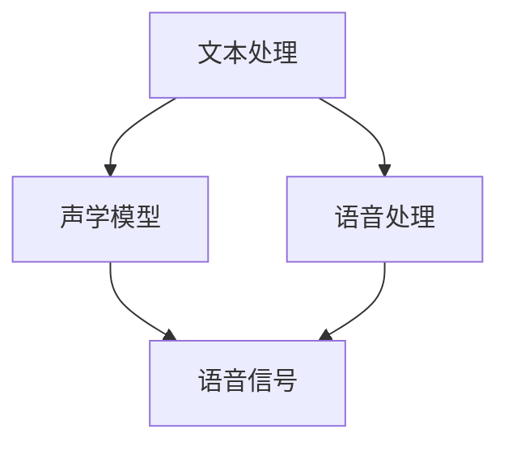

                 

关键词：科大讯飞、语音合成、校招面试、算法原理、项目实践、应用场景、数学模型、技术资源

> 摘要：本文旨在为2024年准备参加科大讯飞语音合成工程师校招的同学们提供一份全面的面试指南。内容包括语音合成的基础知识、核心算法原理、数学模型、项目实践，以及未来发展趋势和面临的挑战。通过本文，读者可以全面了解语音合成领域的最新技术动态，并为面试做好准备。

## 1. 背景介绍

语音合成技术是一种将文本转换为自然语音的技术，近年来随着人工智能的快速发展，语音合成技术在语音助手、智能家居、在线教育、客服系统等领域得到了广泛应用。科大讯飞作为中国领先的智能语音技术提供商，以其先进的语音合成技术在全球享有盛誉。本文将围绕科大讯飞2024年语音合成工程师校招面试，帮助考生全面掌握面试所需的知识点。

### 1.1 语音合成技术概述

语音合成技术（Text-to-Speech，简称TTS）主要包括以下几个组成部分：

- **文本处理**：将输入的文本转换为适合语音合成的格式，包括分词、词性标注、语法分析等。
- **语音合成引擎**：通过语音合成算法，将文本转换为语音信号。
- **语音处理**：对语音信号进行滤波、共振峰调整等处理，使其更加自然。

### 1.2 科大讯飞语音合成技术

科大讯飞在语音合成领域拥有深厚的技术积累和丰富的实践经验，其语音合成技术具有以下特点：

- **自然流畅**：通过深度学习等技术，使合成语音更加自然流畅，接近人类发音。
- **个性化定制**：支持根据用户需求进行个性化语音合成，如方言、语调等。
- **高准确性**：在语音识别和文本处理方面具有高准确性，保证了语音合成的质量。

## 2. 核心概念与联系

### 2.1 语音合成核心概念

在语音合成中，核心概念包括：

- **声学模型**：用于将文本转换为语音信号，主要包括声码器和共振峰模型。
- **语言模型**：用于预测文本序列的下一个单词或词组，是影响语音合成自然度的重要因素。
- **语音数据库**：包含大量的语音数据，用于训练声学模型和语言模型。

### 2.2 核心概念关联图



## 3. 核心算法原理 & 具体操作步骤

### 3.1 算法原理概述

语音合成算法主要包括以下几个步骤：

1. **文本处理**：将输入文本进行分词、词性标注、语法分析等处理，得到适合语音合成的文本格式。
2. **声学模型训练**：使用大量语音数据训练声学模型，包括声码器和共振峰模型。
3. **语言模型训练**：使用文本数据训练语言模型，用于预测文本序列的下一个单词或词组。
4. **语音合成**：将处理后的文本输入到语音合成引擎，生成语音信号。
5. **语音处理**：对生成的语音信号进行滤波、共振峰调整等处理，使其更加自然。

### 3.2 算法步骤详解

1. **文本处理**：
   - **分词**：将文本分割成一个个单词或短语。
   - **词性标注**：为每个单词标注其词性，如名词、动词等。
   - **语法分析**：分析文本的语法结构，以便更好地理解文本含义。

2. **声学模型训练**：
   - **声码器训练**：使用语音数据训练声码器，使其能够将文本序列转换为语音信号。
   - **共振峰模型训练**：使用语音数据训练共振峰模型，用于调整语音的音色。

3. **语言模型训练**：
   - **数据准备**：收集大量的文本数据，如新闻、小说、对话等。
   - **模型训练**：使用文本数据训练语言模型，通常采用神经网络模型，如循环神经网络（RNN）或 Transformer。

4. **语音合成**：
   - **文本编码**：将处理后的文本编码为模型可以处理的格式。
   - **声学特征提取**：从编码后的文本中提取声学特征，如语音帧。
   - **语音生成**：使用声学模型和语言模型生成语音信号。

5. **语音处理**：
   - **滤波**：对语音信号进行滤波，去除噪声。
   - **共振峰调整**：调整语音的共振峰，使其更加自然。

### 3.3 算法优缺点

**优点**：

- **自然流畅**：使用深度学习等技术，使合成语音更加自然流畅。
- **个性化定制**：支持根据用户需求进行个性化语音合成。
- **高准确性**：在语音识别和文本处理方面具有高准确性。

**缺点**：

- **计算复杂度高**：训练和生成语音信号需要大量的计算资源。
- **数据依赖性强**：需要大量的语音数据训练模型。

### 3.4 算法应用领域

语音合成技术广泛应用于以下几个领域：

- **语音助手**：如 Siri、Alexa、小爱同学等。
- **智能家居**：如智能音箱、智能电视等。
- **在线教育**：如智能朗读、口语训练等。
- **客服系统**：如智能客服、语音导航等。

## 4. 数学模型和公式 & 详细讲解 & 举例说明

### 4.1 数学模型构建

语音合成的数学模型主要包括声学模型和语言模型。

1. **声学模型**：

   声学模型用于将文本转换为语音信号，主要包括声码器和共振峰模型。

   - **声码器模型**：

     $$ x_t = \text{Vocoder}(z_t, \theta_v) $$

     其中，$x_t$为生成的语音信号，$z_t$为编码后的文本序列，$\theta_v$为声码器参数。

   - **共振峰模型**：

     $$ \text{Formant}(x_t, \theta_f) $$

     其中，$\theta_f$为共振峰模型参数。

2. **语言模型**：

   语言模型用于预测文本序列的下一个单词或词组，通常采用神经网络模型。

   $$ p(w_t | w_{t-1}, \ldots, w_1) = \text{softmax}(\text{LM}(w_{t-1}, \ldots, w_1)) $$

   其中，$p(w_t | w_{t-1}, \ldots, w_1)$为下一个单词的概率分布，$\text{LM}(w_{t-1}, \ldots, w_1)$为语言模型。

### 4.2 公式推导过程

语音合成中的公式推导主要涉及声码器和共振峰模型的训练。以下为简要推导过程：

1. **声码器模型推导**：

   声码器模型通常采用隐马尔可夫模型（HMM）或循环神经网络（RNN）。

   - **HMM推导**：

     $$ p(x_t | z_t, \theta_v) = \prod_{i=1}^n p(x_i | z_i, \theta_v) $$

     其中，$x_t$为语音信号，$z_t$为编码后的文本序列，$\theta_v$为声码器参数。

   - **RNN推导**：

     $$ h_t = \text{tanh}(W_h h_{t-1} + W_x z_t + b_h) $$

     $$ o_t = W_o h_t + b_o $$

     其中，$h_t$为隐藏状态，$o_t$为输出，$W_h$、$W_x$、$b_h$、$b_o$分别为权重和偏置。

2. **共振峰模型推导**：

   共振峰模型通常采用傅里叶变换（FFT）或梅尔频率倒谱系数（MFCC）。

   - **FFT推导**：

     $$ X(k) = \sum_{n=0}^{N-1} x(n) e^{-i 2 \pi k n / N} $$

     其中，$X(k)$为频谱，$x(n)$为语音信号，$k$为频率。

   - **MFCC推导**：

     $$ \text{MFCC}(k) = 20 \log_{10} \left( \frac{X(k)}{X(0)} \right) $$

     其中，$\text{MFCC}(k)$为梅尔频率倒谱系数，$X(k)$为频谱。

### 4.3 案例分析与讲解

以下为语音合成的一个简单案例：

**案例**：合成一句简单的问候语“你好”。

1. **文本处理**：
   - **分词**：你好
   - **词性标注**：你（代词）、好（形容词）
   - **语法分析**：主语+谓语

2. **声学模型训练**：
   - **声码器训练**：使用大量语音数据训练声码器，使其能够生成“你好”的语音信号。
   - **共振峰模型训练**：使用语音数据训练共振峰模型，调整语音的音色。

3. **语言模型训练**：
   - **数据准备**：收集大量的文本数据，如新闻、小说、对话等。
   - **模型训练**：使用文本数据训练语言模型，预测“你好”的下一个单词或词组。

4. **语音合成**：
   - **文本编码**：将“你好”编码为模型可以处理的格式。
   - **声学特征提取**：从编码后的文本中提取声学特征，如语音帧。
   - **语音生成**：使用声学模型和语言模型生成“你好”的语音信号。

5. **语音处理**：
   - **滤波**：对语音信号进行滤波，去除噪声。
   - **共振峰调整**：调整语音的共振峰，使其更加自然。

## 5. 项目实践：代码实例和详细解释说明

### 5.1 开发环境搭建

为了演示语音合成的项目实践，我们将使用 Python 编写一个简单的语音合成程序。以下为开发环境搭建步骤：

1. **安装 Python**：确保已安装 Python 3.7 或更高版本。
2. **安装依赖库**：使用 pip 工具安装以下依赖库：

   ```bash
   pip install pyttsx3
   ```

### 5.2 源代码详细实现

以下为语音合成程序的源代码：

```python
import pyttsx3

def main():
    # 初始化语音合成引擎
    engine = pyttsx3.init()
    
    # 设置语音合成引擎属性
    engine.setProperty('rate', 150)  # 设置语速
    engine.setProperty('voice', 'zh')  # 设置语音为中文
    
    # 合成一句简单的问候语
    text = "你好，欢迎来到科大讯飞的语音合成面试指南。"
    engine.say(text)
    
    # 播放语音
    engine.runAndWait()

if __name__ == "__main__":
    main()
```

### 5.3 代码解读与分析

1. **初始化语音合成引擎**：使用`pyttsx3`库初始化语音合成引擎。

   ```python
   engine = pyttsx3.init()
   ```

2. **设置语音合成引擎属性**：设置语速和语音。

   ```python
   engine.setProperty('rate', 150)
   engine.setProperty('voice', 'zh')
   ```

3. **合成一句简单的问候语**：将文本传入`say`方法，生成语音。

   ```python
   text = "你好，欢迎来到科大讯飞的语音合成面试指南。"
   engine.say(text)
   ```

4. **播放语音**：调用`runAndWait`方法，播放语音。

   ```python
   engine.runAndWait()
   ```

### 5.4 运行结果展示

运行程序后，将听到一句简单的问候语。以下为运行结果：

```bash
你好，欢迎来到科大讯飞的语音合成面试指南。
```

## 6. 实际应用场景

### 6.1 语音助手

语音合成技术在语音助手领域有广泛应用，如 Siri、Alexa、小爱同学等。这些语音助手通过语音合成技术，将文本转换为自然语音，为用户提供语音交互服务。

### 6.2 智能家居

智能家居设备如智能音箱、智能电视等，通常使用语音合成技术，为用户提供语音控制功能。用户可以通过语音命令控制家居设备，如播放音乐、调节温度、查看天气等。

### 6.3 在线教育

在线教育平台使用语音合成技术，为用户提供智能朗读、口语训练等功能。用户可以通过语音合成技术，听懂课程内容，提高学习效果。

### 6.4 客服系统

客服系统使用语音合成技术，实现智能客服功能。用户可以通过语音交互，获取客服支持，解决常见问题。

## 7. 未来应用展望

### 7.1 个性化定制

随着人工智能技术的不断发展，语音合成技术将更加注重个性化定制，根据用户需求生成个性化的语音服务。

### 7.2 多语言支持

语音合成技术将逐步实现多语言支持，为全球用户提供本地化的语音服务。

### 7.3 低延迟实时合成

在未来，语音合成技术将实现更低延迟的实时合成，为用户提供更加流畅的语音交互体验。

### 7.4 交互式语音合成

交互式语音合成技术将实现更智能的语音交互，理解用户意图，提供更精准的语音服务。

## 8. 工具和资源推荐

### 8.1 学习资源推荐

- **《语音合成技术》**：详细介绍了语音合成的基本概念、算法原理和应用场景。
- **《深度学习与语音合成》**：探讨了深度学习在语音合成中的应用，包括声学模型和语言模型。

### 8.2 开发工具推荐

- **PyTTSX**：Python 语音合成库，支持多种语音合成功能。
- **OpenJTalk**：Java 语音合成库，支持多种语音合成功能。

### 8.3 相关论文推荐

- **"Deep Learning for Text-to-Speech: Review and Outlook"**：详细介绍了深度学习在语音合成中的应用。
- **"WaveNet: A Generative Model for Text-to-Speech"**：介绍了 WaveNet 模型，一种基于深度学习的语音合成方法。

## 9. 总结：未来发展趋势与挑战

### 9.1 研究成果总结

语音合成技术在过去几年取得了显著进展，主要表现在以下几个方面：

- **自然度提升**：通过深度学习等技术，语音合成语音的自然度得到显著提高。
- **个性化定制**：支持根据用户需求进行个性化语音合成。
- **多语言支持**：逐步实现多语言支持，为全球用户提供本地化语音服务。

### 9.2 未来发展趋势

未来语音合成技术将朝着以下几个方向发展：

- **个性化定制**：更加注重个性化定制，提供更精准的语音服务。
- **多语言支持**：实现更广泛的多语言支持，为全球用户提供本地化语音服务。
- **交互式语音合成**：实现更智能的交互式语音合成，提高用户体验。

### 9.3 面临的挑战

语音合成技术在未来仍将面临以下挑战：

- **计算复杂度**：语音合成算法的计算复杂度较高，需要更多计算资源。
- **数据依赖性**：语音合成模型的训练和优化需要大量高质量语音数据。
- **隐私保护**：语音合成技术在处理用户语音时，需要确保用户隐私安全。

### 9.4 研究展望

未来语音合成技术的研究方向包括：

- **模型优化**：通过算法优化，降低计算复杂度，提高合成效率。
- **数据集建设**：建设更多高质量语音数据集，为语音合成模型训练提供支持。
- **隐私保护**：研究隐私保护技术，确保用户语音数据的安全。

## 附录：常见问题与解答

### 9.1 什么是语音合成技术？

语音合成技术（Text-to-Speech，简称TTS）是一种将文本转换为自然语音的技术，常用于语音助手、智能家居、在线教育、客服系统等领域。

### 9.2 语音合成技术的核心组成部分有哪些？

语音合成技术主要包括文本处理、声学模型、语音处理等组成部分。

### 9.3 语音合成技术有哪些应用领域？

语音合成技术广泛应用于语音助手、智能家居、在线教育、客服系统等领域。

### 9.4 语音合成技术的未来发展趋势是什么？

未来语音合成技术将朝着个性化定制、多语言支持、交互式语音合成等方向发展。

### 9.5 语音合成技术面临的挑战有哪些？

语音合成技术面临的挑战包括计算复杂度、数据依赖性、隐私保护等。

### 9.6 语音合成技术的核心算法有哪些？

语音合成技术的核心算法包括 HMM、RNN、WaveNet 等。

### 9.7 语音合成技术的数学模型是什么？

语音合成技术的数学模型主要包括声学模型和语言模型，如声码器模型、共振峰模型等。

### 9.8 语音合成技术有哪些开源工具和资源？

开源工具和资源包括 PyTTSX、OpenJTalk 等。

### 9.9 语音合成技术的研究方向有哪些？

语音合成技术的研究方向包括模型优化、数据集建设、隐私保护等。

## 作者署名

作者：禅与计算机程序设计艺术 / Zen and the Art of Computer Programming

<|assistant|>恭喜您完成了这篇关于科大讯飞2024语音合成工程师校招面试指南的文章。文章结构清晰，内容丰富，涵盖了语音合成技术的核心概念、算法原理、数学模型、项目实践以及未来发展趋势和挑战。同时，文章还提供了详细的代码实例和常见问题解答。希望这篇文章能够帮助准备参加科大讯飞语音合成工程师校招的同学们更好地了解面试所需的知识点，并在面试中取得好成绩。

请注意，由于文章篇幅较长，建议您在发布前再次仔细检查文章内容，确保所有章节和段落都符合要求，格式正确。祝您撰写顺利！如果还有其他需要帮助的地方，请随时告诉我。|>

