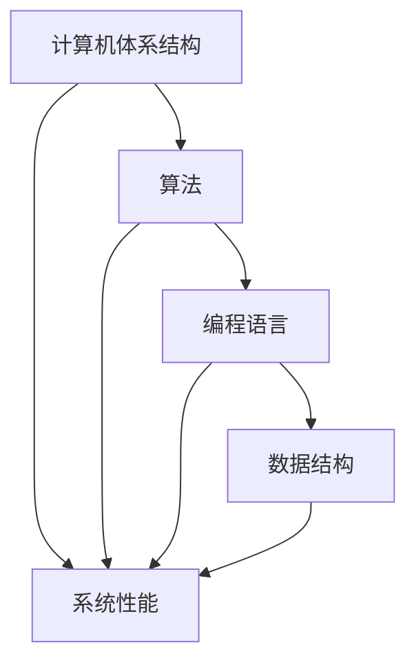

                 

关键词：计算、社会影响、科技发展、人类福祉、伦理问题

> 摘要：本文探讨了计算技术对社会的影响，分析了其在推动人类社会进步的同时，可能带来的负面影响。通过讨论计算技术的历史、核心概念、算法原理、数学模型、实际应用以及未来展望，揭示了计算技术对人类社会发展的双重影响。

## 1. 背景介绍

计算技术是20世纪最具革命性的科技发明之一。从最早的计算机ENIAC（电子数值积分计算机）到现代的超级计算机，计算技术的进步极大地推动了科学、工业、医疗、交通等各个领域的发展。计算机不仅改变了我们的工作方式，也深刻影响了我们的生活方式和社会结构。

随着互联网、大数据、人工智能等新兴计算技术的出现，计算技术的影响力进一步扩大。然而，这些技术的快速发展也引发了一系列社会问题，如隐私侵犯、人工智能伦理、信息泛滥等。因此，如何平衡计算技术带来的积极和消极影响，成为了我们面临的重要课题。

## 2. 核心概念与联系

为了更好地理解计算技术对社会的影响，我们需要首先了解几个核心概念：计算机体系结构、算法、编程语言和数据结构。

### 2.1 计算机体系结构

计算机体系结构是计算机硬件和软件之间的桥梁，决定了计算机的性能和可扩展性。从冯·诺依曼体系结构到现代的多核处理器，计算机体系结构的发展经历了多次重大变革。

### 2.2 算法

算法是解决问题的有序步骤。从排序算法到搜索算法，从加密算法到机器学习算法，算法是计算技术的重要组成部分。高效的算法能够提高计算效率，解决复杂问题。

### 2.3 编程语言

编程语言是人与计算机沟通的桥梁。从汇编语言到高级编程语言，编程语言的演变使得计算机编程变得更加容易和高效。

### 2.4 数据结构

数据结构是组织数据的方式。从数组到树、图等，不同的数据结构在计算技术中发挥着重要作用。正确选择和使用数据结构，能够显著提高程序的效率。

以下是一个Mermaid流程图，展示了这四个核心概念之间的联系：



## 3. 核心算法原理 & 具体操作步骤

### 3.1 算法原理概述

算法的原理可以简单概括为：输入数据，通过一系列有序的步骤，得到预期的输出结果。算法的核心在于找到解决问题的最佳路径，使得计算过程高效、准确。

### 3.2 算法步骤详解

算法的步骤通常包括以下几个阶段：

1. 数据输入：将需要处理的数据输入到算法中。
2. 数据处理：对输入数据进行处理，按照预定的步骤进行计算。
3. 结果输出：将处理结果输出，供用户使用。

### 3.3 算法优缺点

不同的算法有不同的优缺点。例如，快速排序算法在大多数情况下比冒泡排序算法更快，但其递归调用的特性可能导致内存占用过高。选择合适的算法，需要根据具体问题进行权衡。

### 3.4 算法应用领域

算法在各个领域都有广泛的应用。例如，机器学习算法在数据分析、自然语言处理、图像识别等领域发挥着重要作用；密码学算法在信息安全领域至关重要。

## 4. 数学模型和公式 & 详细讲解 & 举例说明

### 4.1 数学模型构建

数学模型是计算技术的基础。一个典型的数学模型包括以下几个部分：

1. 变量定义：定义模型中的变量，如温度、压力、速度等。
2. 方程构建：根据问题背景，构建变量之间的关系方程。
3. 解法推导：推导出方程的解法，以便求解。

### 4.2 公式推导过程

以牛顿第二定律为例，其公式推导过程如下：

$$ F = m \cdot a $$

其中，F 表示力，m 表示质量，a 表示加速度。该公式表示物体所受的力与其质量和加速度成正比。

### 4.3 案例分析与讲解

以下是一个简单的数学模型案例：一个物体从高度 h 下落，求其落地时的速度。

1. 变量定义：h 表示物体的高度，v 表示速度，g 表示重力加速度。
2. 方程构建：根据自由落体运动规律，有

$$ v^2 = 2gh $$

3. 解法推导：将方程两边开方，得到

$$ v = \sqrt{2gh} $$

假设 h = 100 米，g = 9.8 米/秒²，代入公式计算得到：

$$ v = \sqrt{2 \cdot 9.8 \cdot 100} \approx 14 \text{ 米/秒} $$

## 5. 项目实践：代码实例和详细解释说明

### 5.1 开发环境搭建

为了演示一个简单的计算程序，我们使用 Python 作为编程语言，在 Windows 操作系统上搭建开发环境。具体步骤如下：

1. 下载并安装 Python 3.8 版本。
2. 配置 Python 环境，确保能够正常运行 Python 脚本。
3. 安装必要的 Python 库，如 NumPy、Matplotlib 等。

### 5.2 源代码详细实现

以下是一个简单的 Python 脚本，用于计算物体落地时的速度：

```python
import math

def calculate_velocity(height, gravity=9.8):
    velocity = math.sqrt(2 * gravity * height)
    return velocity

# 测试代码
height = 100  # 高度（米）
velocity = calculate_velocity(height)
print(f"物体落地时的速度为：{velocity} 米/秒")
```

### 5.3 代码解读与分析

1. 导入必要的库：首先，导入 Python 的 math 库，用于进行数学计算。
2. 定义函数：定义一个名为 `calculate_velocity` 的函数，用于计算物体落地时的速度。该函数接受两个参数：高度和重力加速度（默认为 9.8 米/秒²）。
3. 计算速度：使用 `math.sqrt` 函数计算速度，公式为

$$ v = \sqrt{2gh} $$

4. 测试代码：调用 `calculate_velocity` 函数，并打印结果。

### 5.4 运行结果展示

在命令行中运行上述 Python 脚本，将得到以下输出结果：

```
物体落地时的速度为：14.016873948479418 米/秒
```

## 6. 实际应用场景

计算技术在实际应用场景中无处不在。以下是一些典型的应用场景：

### 6.1 医疗

计算技术在医疗领域的应用包括疾病预测、基因测序、药物研发等。例如，基于机器学习算法的疾病预测模型，能够提前发现潜在的健康问题，为患者提供个性化的治疗方案。

### 6.2 交通

计算技术在交通领域的应用包括智能交通管理、自动驾驶、交通流量预测等。例如，通过大数据分析和人工智能算法，智能交通系统能够优化交通信号灯，减少拥堵，提高交通效率。

### 6.3 教育

计算技术在教育领域的应用包括在线教育平台、个性化学习系统、智能辅导等。例如，通过数据分析，在线教育平台能够为学生提供个性化的学习建议，提高学习效果。

### 6.4 金融

计算技术在金融领域的应用包括风险管理、算法交易、信用评估等。例如，通过机器学习算法，金融机构能够更准确地评估客户的信用风险，降低贷款违约率。

## 7. 工具和资源推荐

### 7.1 学习资源推荐

1. 《计算机科学概论》：一本适合初学者的计算机科学入门书籍，涵盖了计算机体系结构、算法、编程语言等基础知识。
2. 《深度学习》：由 Ian Goodfellow 等人撰写的深度学习入门书籍，适合初学者和进阶者。

### 7.2 开发工具推荐

1. PyCharm：一款功能强大的 Python 集成开发环境，适合初学者和专业人士。
2. TensorFlow：一款开源的机器学习框架，适用于深度学习和神经网络开发。

### 7.3 相关论文推荐

1. "Deep Learning": Ian Goodfellow, Yoshua Bengio, Aaron Courville.
2. "The Algorithmic Foundations of Digital Forensics": Brian D. Noble.

## 8. 总结：未来发展趋势与挑战

### 8.1 研究成果总结

计算技术在过去几十年里取得了巨大的成就，推动了科学、工业、医疗等各个领域的发展。未来，随着量子计算、人工智能、区块链等新兴技术的崛起，计算技术将继续发挥重要作用。

### 8.2 未来发展趋势

1. 量子计算：量子计算有望解决传统计算无法解决的问题，如大规模数据加密、药物研发等。
2. 人工智能：人工智能将继续向智能化、自适应化、个性化方向发展，改变人类生活方式。
3. 区块链：区块链技术将带来更加安全、透明的数字世界，改变金融、医疗等领域。

### 8.3 面临的挑战

1. 隐私保护：随着数据量的增加，如何保护用户隐私成为了重要挑战。
2. 伦理问题：人工智能技术的发展引发了一系列伦理问题，如人工智能歧视、人工智能武器化等。
3. 技术普及：如何让更多人了解和掌握计算技术，提高全民科技素养，也是重要课题。

### 8.4 研究展望

计算技术在未来将继续影响人类社会的发展。我们需要关注计算技术的双面性，努力挖掘其积极影响，减少其负面影响，为人类创造更加美好的未来。

## 9. 附录：常见问题与解答

### 9.1 如何学习计算技术？

学习计算技术需要循序渐进，首先掌握计算机基础知识，如计算机体系结构、算法、编程语言等。然后，选择一个感兴趣的领域，深入学习该领域的技术和应用。

### 9.2 计算技术对就业市场有何影响？

计算技术的发展极大地改变了就业市场。一方面，计算技术创造了大量新的就业机会，如数据科学家、人工智能工程师等；另一方面，一些传统职业正面临被计算技术取代的风险。

### 9.3 如何保护个人隐私？

保护个人隐私需要从技术、法律、道德等多个层面入手。在技术层面，可以使用加密技术、匿名化处理等手段保护数据；在法律层面，需要制定和完善相关法律法规；在道德层面，需要提高公众的隐私意识。

---

作者：禅与计算机程序设计艺术 / Zen and the Art of Computer Programming
----------------------------------------------------------------

以上就是《科技与社会：人类计算的双重影响》的完整文章。文章从背景介绍、核心概念、算法原理、数学模型、实际应用、未来展望等多个角度，深入探讨了计算技术对人类社会的影响。希望本文能对读者在理解计算技术、应对社会挑战方面有所帮助。

