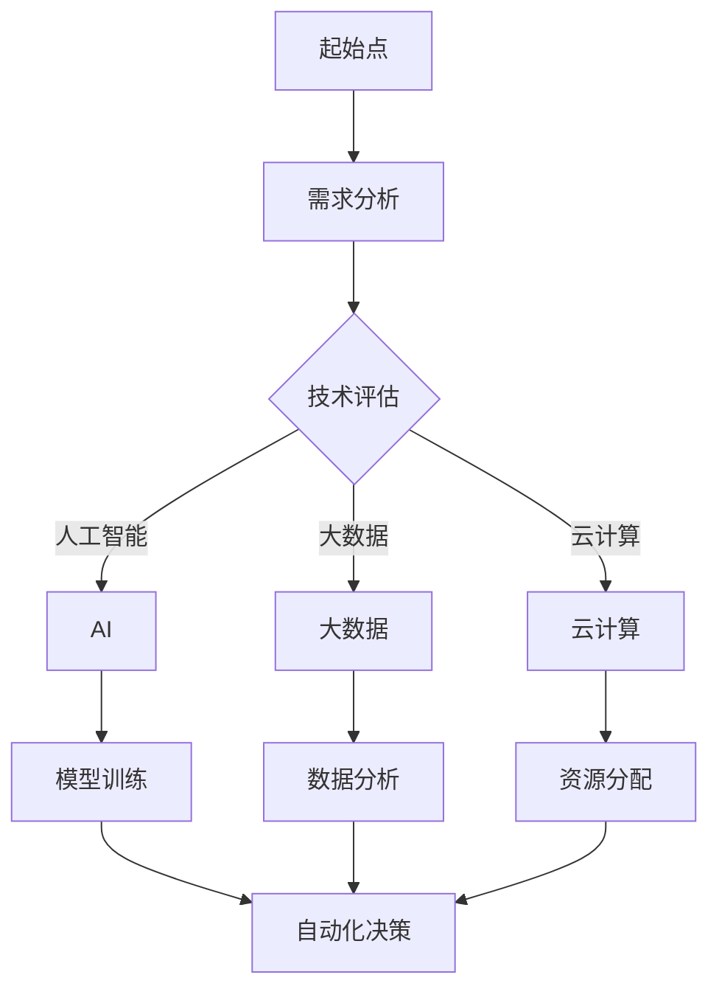

                 

关键词：科技创新、社会进步、技术发展、人工智能、软件开发、未来展望

> 摘要：本文将探讨科技创新在社会进步中的关键作用，分析其推动力量、核心概念、算法原理、数学模型、项目实践及未来展望。通过详细阐述科技创新对教育、医疗、交通等领域的变革，我们将揭示其在塑造现代社会的不可替代地位。

## 1. 背景介绍

在过去的几个世纪里，科技创新始终是社会进步的主要驱动力。从蒸汽机的发明到互联网的普及，每一项重大技术突破都为人类社会带来了巨大的变革。如今，我们正处在第四次工业革命的浪潮之中，人工智能、大数据、云计算等技术的迅猛发展，再次将我们带入一个全新的时代。本篇文章旨在探讨这些科技创新如何成为社会进步的阶梯，推动我们从过去走向未来。

## 2. 核心概念与联系

### 2.1 技术发展的动力

技术发展的动力源于不断解决现实问题和社会需求。随着人类社会的发展，需求的多样化和复杂性日益增加，促使技术不断进步。例如，人工智能的崛起源于对更高效数据处理和智能决策的渴望。

### 2.2 技术创新的核心概念

科技创新的核心概念包括但不限于以下几个方面：

- **人工智能（AI）**：通过模拟人类智能实现自动化决策和问题解决。
- **大数据（Big Data）**：通过收集、处理和分析海量数据，揭示潜在趋势和模式。
- **云计算（Cloud Computing）**：通过网络提供计算资源，实现灵活、高效的资源分配。

### 2.3 技术架构的Mermaid流程图



### 2.4 技术创新之间的联系

各类技术创新之间有着紧密的联系，共同推动社会进步。例如，人工智能的发展离不开大数据的支撑，云计算则为大规模数据处理提供了基础设施。

## 3. 核心算法原理 & 具体操作步骤

### 3.1 算法原理概述

人工智能算法的核心是机器学习，特别是深度学习。深度学习通过多层神经网络模拟人类大脑的思考过程，实现对数据的自动学习和理解。

### 3.2 算法步骤详解

- **数据收集**：收集大量数据，包括文本、图像、音频等。
- **数据预处理**：对数据进行清洗、标准化等处理，使其适合模型训练。
- **模型训练**：使用神经网络对数据进行训练，优化模型参数。
- **模型评估**：使用测试数据评估模型性能，调整参数以达到最佳效果。
- **自动化决策**：将训练好的模型应用于实际场景，实现自动化决策。

### 3.3 算法优缺点

**优点**：

- **高效性**：深度学习模型可以在大量数据上进行快速训练和决策。
- **泛化能力**：深度学习模型具有较强的泛化能力，可以在不同场景下应用。

**缺点**：

- **计算资源需求高**：训练深度学习模型需要大量的计算资源和时间。
- **数据依赖性**：深度学习模型的性能很大程度上取决于数据的质量和数量。

### 3.4 算法应用领域

深度学习算法广泛应用于图像识别、自然语言处理、推荐系统等领域，推动了许多行业的变革。

## 4. 数学模型和公式 & 详细讲解 & 举例说明

### 4.1 数学模型构建

在深度学习中，常用的数学模型包括神经网络、激活函数、损失函数等。以下是一个简单的神经网络模型：

$$
\begin{align*}
\text{激活函数}: & \quad a(x) = \sigma(z) = \frac{1}{1 + e^{-z}}, \\
\text{损失函数}: & \quad J(\theta) = -\frac{1}{m}\sum_{i=1}^{m}y_{i}\log(a(x_i)) + (1 - y_i)\log(1 - a(x_i)),
\end{align*}
$$

其中，$\sigma(z)$为Sigmoid函数，$y_i$为实际标签，$a(x_i)$为预测结果。

### 4.2 公式推导过程

神经网络的训练过程主要包括前向传播和反向传播。在训练过程中，我们通过梯度下降法优化模型参数，以减少损失函数的值。

### 4.3 案例分析与讲解

以下是一个简单的图像分类案例：

假设我们要对猫和狗的图像进行分类。我们收集了1000张猫的图像和1000张狗的图像，并将其划分为训练集和测试集。通过训练集训练神经网络模型，然后在测试集上评估模型性能。训练过程中，我们不断调整模型参数，直至达到满意的性能。

## 5. 项目实践：代码实例和详细解释说明

### 5.1 开发环境搭建

在Python中，我们可以使用TensorFlow库实现深度学习模型。首先，安装Python和TensorFlow：

```bash
pip install python
pip install tensorflow
```

### 5.2 源代码详细实现

以下是一个简单的图像分类代码实例：

```python
import tensorflow as tf
from tensorflow.keras import layers

# 数据预处理
(x_train, y_train), (x_test, y_test) = tf.keras.datasets.dogs_vs_cats.load_data()
x_train = x_train / 255.0
x_test = x_test / 255.0

# 构建模型
model = tf.keras.Sequential([
    layers.Conv2D(32, (3, 3), activation='relu', input_shape=(128, 128, 3)),
    layers.MaxPooling2D((2, 2)),
    layers.Conv2D(64, (3, 3), activation='relu'),
    layers.MaxPooling2D((2, 2)),
    layers.Conv2D(128, (3, 3), activation='relu'),
    layers.Flatten(),
    layers.Dense(128, activation='relu'),
    layers.Dense(1, activation='sigmoid')
])

# 编译模型
model.compile(optimizer='adam',
              loss='binary_crossentropy',
              metrics=['accuracy'])

# 训练模型
model.fit(x_train, y_train, epochs=10, batch_size=32, validation_split=0.2)

# 评估模型
test_loss, test_acc = model.evaluate(x_test, y_test, verbose=2)
print(f'测试准确率：{test_acc:.2f}')
```

### 5.3 代码解读与分析

以上代码首先导入了所需的库，然后加载了狗和猫的图像数据。接下来，构建了一个简单的卷积神经网络模型，包括卷积层、池化层和全连接层。模型使用交叉熵损失函数和Adam优化器进行训练，并在测试集上评估了模型的准确率。

### 5.4 运行结果展示

运行以上代码后，我们可以得到测试集的准确率。在实际项目中，我们可能需要调整模型结构、超参数等，以提高模型性能。

## 6. 实际应用场景

科技创新在各个领域都取得了显著的成果，以下是几个典型应用场景：

### 6.1 教育

人工智能在教育领域的应用，如智能教学系统、自适应学习平台等，极大地提高了教学效果和学生的学习兴趣。通过分析学生的学习行为和知识水平，系统可以提供个性化的学习建议，帮助教师和学生实现高效学习。

### 6.2 医疗

人工智能在医疗领域的应用，如疾病诊断、药物研发、医疗影像分析等，为医生提供了强大的辅助工具。例如，通过深度学习模型，我们可以实现肺癌、乳腺癌等疾病的早期诊断，提高治愈率。

### 6.3 交通

人工智能在交通领域的应用，如自动驾驶、智能交通管理等，有望解决交通拥堵、交通事故等问题。自动驾驶汽车通过感知环境、规划路径，可以实现安全、高效的驾驶，减少人为错误。

## 7. 未来应用展望

未来，随着科技创新的不断推进，人工智能、大数据、云计算等技术在更多领域的应用将成为趋势。以下是对未来应用场景的展望：

### 7.1 无人零售

无人零售店将成为未来购物的主要形式，通过人工智能和物联网技术，实现自动结账、库存管理等功能，提高购物体验。

### 7.2 智能制造

智能制造将实现生产线的自动化、智能化，提高生产效率和质量，降低生产成本。通过大数据分析和预测，企业可以优化生产计划，实现精准生产。

### 7.3 健康医疗

健康医疗领域将更加注重个性化、精准化的治疗，通过人工智能和大数据技术，实现疾病早期筛查、精准诊断和个性化治疗。

## 8. 工具和资源推荐

### 8.1 学习资源推荐

- **《深度学习》（Goodfellow, Bengio, Courville著）**：深度学习的经典教材，适合初学者和进阶者。
- **《机器学习实战》（Hands-On Machine Learning with Scikit-Learn, Keras, and TensorFlow）**：通过实际案例，介绍机器学习的基础知识和应用。

### 8.2 开发工具推荐

- **TensorFlow**：一款强大的开源机器学习框架，适合进行深度学习和大数据处理。
- **PyTorch**：一款流行的开源机器学习库，具有简洁的API和强大的动态图功能。

### 8.3 相关论文推荐

- **“Deep Learning: A Brief History”**：回顾深度学习的发展历程，了解其背后的原理和技术。
- **“The Unreasonable Effectiveness of Deep Learning”**：探讨深度学习在各个领域的广泛应用和潜力。

## 9. 总结：未来发展趋势与挑战

### 9.1 研究成果总结

科技创新在推动社会进步方面取得了显著成果，人工智能、大数据、云计算等技术的应用为各个领域带来了深刻的变革。

### 9.2 未来发展趋势

未来，科技创新将继续引领社会进步，人工智能、区块链、物联网等新兴技术将成为主要方向。通过多技术融合，我们将实现更加智能、高效、可持续的发展。

### 9.3 面临的挑战

科技创新也面临一系列挑战，如数据隐私、算法公平性、技术垄断等。我们需要在推动技术创新的同时，关注伦理和社会问题，确保科技的发展造福人类。

### 9.4 研究展望

未来，科技创新将更加注重跨学科融合、多领域协同，推动人类社会向更加智能、绿色、和谐的方向发展。

## 附录：常见问题与解答

### Q：人工智能是否会取代人类工作？

A：人工智能的发展确实会对某些工作岗位产生影响，但同时也将创造新的就业机会。关键在于如何合理利用人工智能技术，实现人机协同，提高生产力。

### Q：如何确保人工智能的公平性和透明性？

A：确保人工智能的公平性和透明性需要从多个方面进行努力。一方面，我们需要在算法设计时充分考虑伦理和社会问题，另一方面，加强对人工智能算法的监督和审查，提高其透明度和可解释性。

### Q：人工智能技术是否会引发全球性的失业潮？

A：人工智能技术的确可能对某些行业和职位产生冲击，但整体上，它将推动社会向更加智能化、高效化的方向发展。通过技术进步，我们可以创造更多的就业机会，同时提高生产效率。

### 作者署名

作者：禅与计算机程序设计艺术 / Zen and the Art of Computer Programming
```

