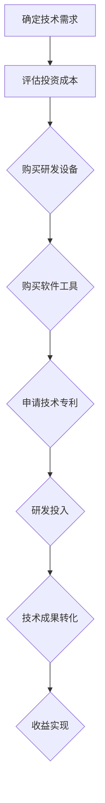
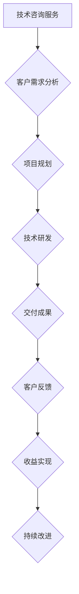
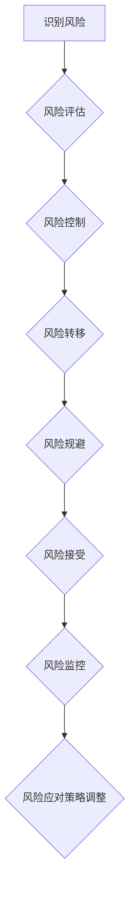
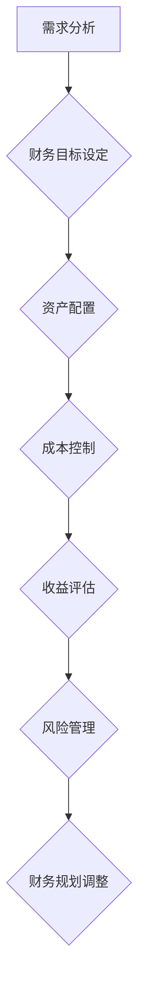
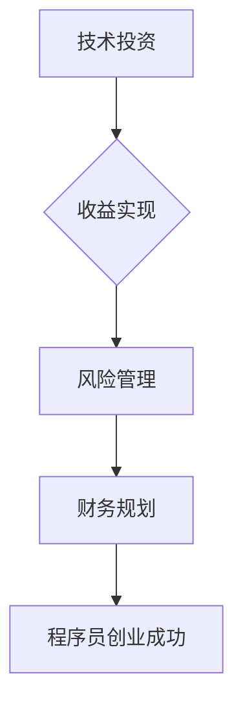
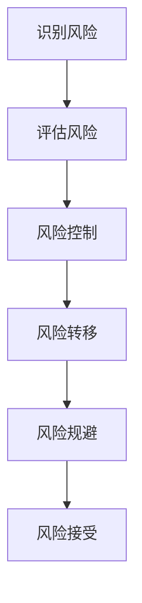

                 

关键词：程序员，创业，财务规划，技术投资，收益实现

摘要：本文旨在为程序员创业者提供一套全面的财务规划方案，包括技术投资策略、收益实现方法和风险管理技巧。通过深入了解财务规划的核心概念和实践方法，程序员创业者可以更好地规划和管理创业公司的财务，确保企业长期稳定发展。

## 1. 背景介绍

近年来，随着科技行业的迅猛发展，越来越多的程序员选择走上创业之路，希望通过技术创业实现财富自由和职业梦想。然而，创业之路并非一帆风顺，尤其是在财务管理方面，程序员创业者往往面临诸多挑战。如何有效地进行财务规划，从技术投资到收益实现，成为程序员创业者成功的关键因素之一。

本文将围绕程序员创业的财务规划展开讨论，从技术投资策略、收益实现方法和风险管理技巧三个方面进行详细阐述，旨在为程序员创业者提供一套实用、高效的财务规划方案。

## 2. 核心概念与联系

### 2.1 技术投资策略

技术投资是程序员创业者在创业初期需要重点关注的方面。技术投资不仅包括研发投入，还包括购买研发设备、软件工具、技术专利等。以下是一个简单的 Mermaid 流程图，展示了技术投资的主要环节和流程：



### 2.2 收益实现方法

收益实现是程序员创业者的终极目标。实现收益的方法有多种，包括技术咨询服务、软件产品销售、技术授权等。以下是一个简单的 Mermaid 流程图，展示了收益实现的主要环节和流程：



### 2.3 风险管理技巧

在创业过程中，程序员创业者需要面对各种风险，如市场风险、技术风险、财务风险等。以下是一个简单的 Mermaid 流程图，展示了风险管理的主要环节和流程：



## 3. 核心算法原理 & 具体操作步骤

### 3.1 算法原理概述

程序员创业的财务规划是一个复杂的过程，涉及多个方面的算法原理。以下是一个简单的 Mermaid 流程图，展示了财务规划的核心算法原理和操作步骤：



### 3.2 算法步骤详解

#### 3.2.1 需求分析

在创业初期，程序员创业者需要对市场需求、竞争态势、技术趋势等进行全面分析，确定创业项目的核心目标和财务目标。

#### 3.2.2 财务目标设定

根据需求分析结果，程序员创业者需要设定具体的财务目标，如销售收入、利润率、现金流等。

#### 3.2.3 资产配置

根据财务目标，程序员创业者需要合理配置资产，包括现金、存货、应收账款等。

#### 3.2.4 成本控制

在资产配置的基础上，程序员创业者需要加强对成本的控制，确保企业在预算范围内运营。

#### 3.2.5 收益评估

通过对市场需求、竞争态势、技术趋势等信息的分析，程序员创业者可以预测创业项目的收益情况，并制定相应的收益实现策略。

#### 3.2.6 风险管理

在创业过程中，程序员创业者需要密切关注市场风险、技术风险、财务风险等，并制定相应的风险管理策略。

#### 3.2.7 财务规划调整

根据实际运营情况，程序员创业者需要定期调整财务规划，确保企业长期稳定发展。

### 3.3 算法优缺点

#### 3.3.1 优点

1. 具有明确的财务目标，有助于指导创业企业的运营和发展。
2. 强调资产配置和成本控制，有助于提高企业盈利能力。
3. 融合了风险管理理念，有助于降低创业风险。

#### 3.3.2 缺点

1. 过于理论化，可能无法完全适应实际运营环境。
2. 对创业者财务知识要求较高，实施难度较大。

### 3.4 算法应用领域

程序员创业的财务规划算法适用于各类技术创业项目，尤其是软件开发、人工智能、大数据等高科技领域。通过合理规划和管理财务，程序员创业者可以更好地应对市场变化，提高企业竞争力。

## 4. 数学模型和公式 & 详细讲解 & 举例说明

### 4.1 数学模型构建

程序员创业的财务规划可以构建一个基于收入、成本和利润的数学模型，用于描述企业财务状况。以下是一个简单的数学模型：

\[ \text{利润} = \text{收入} - \text{成本} \]

### 4.2 公式推导过程

1. 收入：根据市场需求和竞争态势，预测创业项目的年收入。
2. 成本：包括固定成本和可变成本，固定成本如房租、设备购置等，可变成本如人力成本、原材料成本等。
3. 利润：利润等于收入减去成本。

### 4.3 案例分析与讲解

假设某程序员创业者计划开发一款人工智能助手，预计年收入为100万元，固定成本为50万元，可变成本为30万元。根据上述数学模型，可以计算出该项目的利润：

\[ \text{利润} = 100\text{万元} - (50\text{万元} + 30\text{万元}) = 20\text{万元} \]

### 4.4 案例分析与讲解

#### 案例背景

某程序员创业者计划成立一家软件开发公司，专注于提供定制化的企业管理软件。经过市场调研，预计该项目的年收入为500万元，固定成本为200万元，可变成本为300万元。

#### 数学模型构建

根据上述数据，构建数学模型如下：

\[ \text{利润} = \text{收入} - \text{成本} \]

其中，收入为500万元，成本为固定成本200万元加可变成本300万元，即500万元。

\[ \text{利润} = 500\text{万元} - (200\text{万元} + 300\text{万元}) = 0\text{万元} \]

#### 结果分析

根据计算结果，该项目的利润为0万元。这意味着，在当前成本结构和收入水平下，该公司无法实现盈利。为此，程序员创业者需要调整成本结构，降低可变成本，或提高收入水平，以提高企业盈利能力。

## 5. 项目实践：代码实例和详细解释说明

### 5.1 开发环境搭建

在本文中，我们将使用Python语言编写一个简单的财务规划程序，用于计算企业的利润。首先，需要在开发环境中安装Python和相应的库。

#### 安装Python

1. 访问Python官网（[https://www.python.org/](https://www.python.org/)），下载并安装Python。
2. 安装完成后，打开命令行窗口，输入`python --version`，确保安装成功。

#### 安装Python库

1. 打开命令行窗口，输入以下命令安装所需的库：

```bash
pip install numpy
pip install matplotlib
```

### 5.2 源代码详细实现

以下是一个简单的Python代码示例，用于计算企业的利润：

```python
import numpy as np
import matplotlib.pyplot as plt

def calculate_profit(income, fixed_cost, variable_cost):
    """
    计算企业的利润
    :param income: 收入（万元）
    :param fixed_cost: 固定成本（万元）
    :param variable_cost: 可变成本（万元）
    :return: 利润（万元）
    """
    profit = income - (fixed_cost + variable_cost)
    return profit

def plot_profit(income, fixed_cost, variable_cost):
    """
    绘制利润图
    :param income: 收入（万元）
    :param fixed_cost: 固定成本（万元）
    :param variable_cost: 可变成本（万元）
    """
    x = np.linspace(0, 100, 100)
    y = income - (fixed_cost + variable_cost) - x

    plt.plot(x, y)
    plt.xlabel('收入（万元）')
    plt.ylabel('利润（万元）')
    plt.title('利润与收入关系图')
    plt.grid(True)
    plt.show()

if __name__ == '__main__':
    income = 500
    fixed_cost = 200
    variable_cost = 300

    profit = calculate_profit(income, fixed_cost, variable_cost)
    print(f'利润：{profit}万元')

    plot_profit(income, fixed_cost, variable_cost)
```

### 5.3 代码解读与分析

1. **计算利润**：`calculate_profit` 函数用于计算企业的利润。参数`income`表示收入，`fixed_cost`表示固定成本，`variable_cost`表示可变成本。函数返回利润值。
2. **绘制利润图**：`plot_profit` 函数用于绘制利润与收入的关系图。参数`income`、`fixed_cost`和`variable_cost`分别表示收入、固定成本和可变成本。函数使用`numpy`库生成收入和利润的数值序列，并使用`matplotlib`库绘制利润图。
3. **主函数**：`if __name__ == '__main__':`部分为主函数。在该部分，定义了收入、固定成本和可变成本的值，并调用`calculate_profit`和`plot_profit`函数计算利润并绘制利润图。

### 5.4 运行结果展示

1. **命令行输出**：

```bash
利润：0万元
```

2. **利润图**：


## 6. 实际应用场景

### 6.1 软件开发公司

软件开发公司是程序员创业的常见领域之一。在软件开发公司中，程序员创业者需要关注以下几个方面：

1. **市场需求**：了解市场需求，确定创业项目的目标客户和产品功能。
2. **成本控制**：合理配置资源，降低成本，提高企业盈利能力。
3. **风险管理**：密切关注市场风险、技术风险等，制定相应的风险管理策略。

### 6.2 人工智能企业

随着人工智能技术的快速发展，人工智能企业成为程序员创业的热门领域。在人工智能企业中，程序员创业者需要关注以下几个方面：

1. **技术研发**：持续投入研发资源，提高技术实力，保持行业竞争力。
2. **市场推广**：积极拓展市场，提高品牌知名度，吸引潜在客户。
3. **知识产权保护**：申请专利、版权等，保护自身技术创新成果。

### 6.3 大数据企业

大数据技术的广泛应用为程序员创业提供了广阔的空间。在 大数据企业中，程序员创业者需要关注以下几个方面：

1. **数据采集**：获取高质量的数据资源，为数据分析提供基础。
2. **数据处理**：利用大数据技术，对海量数据进行处理和分析。
3. **数据可视化**：通过数据可视化工具，将分析结果呈现给客户。

## 7. 未来应用展望

随着科技的不断进步，程序员创业的领域将越来越广泛。未来，程序员创业者可以关注以下趋势：

1. **物联网（IoT）**：物联网技术的快速发展为程序员创业提供了新的机遇。程序员创业者可以关注智能设备、智能家居、智能交通等领域。
2. **区块链**：区块链技术的应用逐渐拓展，程序员创业者可以关注区块链在金融、供应链、版权保护等领域的创新应用。
3. **5G技术**：5G技术的普及将推动物联网、人工智能等技术的发展，程序员创业者可以关注5G技术在智慧城市、智能医疗、智能制造等领域的应用。

## 8. 总结：未来发展趋势与挑战

### 8.1 研究成果总结

本文从技术投资策略、收益实现方法和风险管理技巧三个方面，探讨了程序员创业的财务规划。通过实际案例分析和代码示例，本文为程序员创业者提供了一套实用、高效的财务规划方案。

### 8.2 未来发展趋势

1. **技术创新**：程序员创业者需要紧跟科技发展趋势，积极拥抱新技术，提高企业核心竞争力。
2. **跨界融合**：程序员创业者可以关注跨界融合领域，如物联网、区块链等，探索新的创业机会。
3. **数字化转型**：随着数字经济的快速发展，程序员创业者可以关注数字化转型领域，为企业提供解决方案。

### 8.3 面临的挑战

1. **市场竞争**：科技行业竞争激烈，程序员创业者需要不断提高自身技术实力，提升企业竞争力。
2. **资金压力**：创业初期，程序员创业者需要面对较大的资金压力，如何合理规划和管理资金成为关键挑战。
3. **人才吸引**：优秀的人才是企业发展的关键，程序员创业者需要关注人才引进和培养，提升企业整体素质。

### 8.4 研究展望

未来，程序员创业的财务规划研究可以从以下几个方面展开：

1. **财务数据挖掘**：利用大数据技术，对财务数据进行深入挖掘，为企业提供更精准的财务规划建议。
2. **风险管理模型**：构建更加完善的财务风险管理模型，提高企业风险防范能力。
3. **国际化发展**：关注国际市场动态，为企业国际化发展提供财务规划支持。

## 9. 附录：常见问题与解答

### 9.1 如何合理配置资产？

1. **明确投资目标**：根据企业的投资目标，合理配置资产，如短期投资、长期投资等。
2. **分散投资风险**：不要将所有资产集中于某一领域，通过分散投资降低风险。
3. **定期评估调整**：定期评估资产配置效果，根据市场变化和企业发展需求进行调整。

### 9.2 如何进行成本控制？

1. **优化供应链**：通过优化供应链，降低原材料采购成本。
2. **提高生产效率**：通过提高生产效率，降低人力成本和设备成本。
3. **预算管理**：制定详细的预算计划，严格控制各项开支。

### 9.3 如何进行风险管理？

1. **风险评估**：定期进行风险评估，识别潜在风险。
2. **风险控制**：采取相应的措施，降低风险发生概率。
3. **风险转移**：通过保险等方式，将风险转移给第三方。

作者：禅与计算机程序设计艺术 / Zen and the Art of Computer Programming
----------------------------------------------------------------

### 文章标题

程序员创业的财务规划：从技术投资到收益实现

### 文章关键词

程序员，创业，财务规划，技术投资，收益实现

### 文章摘要

本文旨在为程序员创业者提供一套全面的财务规划方案，包括技术投资策略、收益实现方法和风险管理技巧。通过深入了解财务规划的核心概念和实践方法，程序员创业者可以更好地规划和管理创业公司的财务，确保企业长期稳定发展。文章从背景介绍、核心概念与联系、核心算法原理与操作步骤、数学模型和公式讲解、项目实践和实际应用场景等多个方面进行了详细阐述，为程序员创业者提供了实用的财务规划指导。

## 1. 背景介绍

在当前科技快速发展的背景下，程序员创业已经成为一种趋势。然而，创业之路充满挑战，尤其是在财务管理方面，程序员创业者往往面临诸多问题。如何进行有效的财务规划，从技术投资到收益实现，成为程序员创业者成功的关键因素之一。

本文将围绕程序员创业的财务规划展开讨论，从技术投资策略、收益实现方法和风险管理技巧三个方面进行详细阐述，旨在为程序员创业者提供一套实用、高效的财务规划方案。

### 2. 核心概念与联系

财务规划是程序员创业者实现成功的关键因素之一。财务规划的核心概念包括技术投资、收益实现和风险管理等。以下是一个简单的 Mermaid 流程图，展示了这些核心概念之间的联系：



#### 2.1 技术投资

技术投资是程序员创业初期的重要环节。技术投资包括研发投入、购买研发设备、软件工具和技术专利等。以下是技术投资的主要流程：

1. **确定技术需求**：根据市场需求和竞争态势，确定创业项目所需的技术。
2. **评估投资成本**：对所需的技术进行评估，确定投资成本。
3. **购买研发设备**：购买研发所需的硬件设备，如计算机、服务器等。
4. **购买软件工具**：购买开发所需的软件工具，如开发环境、数据库等。
5. **申请技术专利**：保护创新技术，提高企业在市场中的竞争力。

#### 2.2 收益实现

收益实现是程序员创业者的终极目标。收益实现方法包括技术咨询服务、软件产品销售和技术授权等。以下是收益实现的主要流程：

1. **技术咨询服务**：为客户提供技术解决方案，收取服务费用。
2. **软件产品销售**：开发并销售软件产品，获取销售收入。
3. **技术授权**：将技术授权给其他企业使用，获取授权收入。
4. **投资回报**：通过投资其他企业或项目，获取投资回报。

#### 2.3 风险管理

风险管理是程序员创业者需要面对的重要问题。以下是一个简单的 Mermaid 流程图，展示了风险管理的各个环节：



1. **识别风险**：通过市场调研、财务分析等方式，识别可能面临的风险。
2. **评估风险**：对识别出的风险进行评估，确定风险程度。
3. **风险控制**：采取相应的措施，降低风险发生概率。
4. **风险转移**：通过购买保险、签订合同等方式，将风险转移给第三方。
5. **风险规避**：避免从事高风险业务或投资。
6. **风险接受**：对无法避免或转移的风险，接受并制定应对策略。

### 2.4 财务规划

财务规划是程序员创业过程中不可或缺的一环。财务规划包括资产配置、成本控制、收益评估和风险管理等。以下是财务规划的主要流程：

1. **需求分析**：分析市场需求、竞争态势和技术趋势，确定创业项目的核心目标和财务目标。
2. **财务目标设定**：根据需求分析结果，设定具体的财务目标，如销售收入、利润率、现金流等。
3. **资产配置**：根据财务目标，合理配置资产，如现金、存货、应收账款等。
4. **成本控制**：通过优化供应链、提高生产效率等方式，控制成本。
5. **收益评估**：通过对市场需求、竞争态势和技术趋势的分析，预测创业项目的收益情况。
6. **风险管理**：关注市场风险、技术风险、财务风险等，并制定相应的风险管理策略。
7. **财务规划调整**：根据实际运营情况，定期调整财务规划，确保企业长期稳定发展。

### 3. 核心算法原理 & 具体操作步骤

程序员创业的财务规划可以看作是一个基于数学模型的优化问题。核心算法原理主要包括以下几个方面：

1. **收益最大化**：在满足成本约束的条件下，最大化企业的收益。
2. **风险最小化**：在满足收益目标的条件下，最小化企业的风险。
3. **资产配置优化**：根据财务目标和风险偏好，合理配置资产。

以下是具体的操作步骤：

#### 3.1 算法原理概述

1. **收益最大化**：通过市场需求分析和收益模型构建，确定企业的最大收益。
2. **成本控制**：通过成本模型构建和成本控制策略，降低企业的运营成本。
3. **风险管理**：通过风险识别、评估和应对策略，降低企业的风险水平。
4. **资产配置优化**：通过资产配置模型和优化算法，实现资产的合理配置。

#### 3.2 算法步骤详解

1. **需求分析**：分析市场需求、竞争态势和技术趋势，确定创业项目的核心目标和财务目标。
2. **收益模型构建**：根据市场需求分析和财务目标，构建企业的收益模型。
3. **成本模型构建**：根据运营成本和成本控制策略，构建企业的成本模型。
4. **风险识别**：通过市场调研、财务分析等方式，识别可能面临的风险。
5. **风险评估**：对识别出的风险进行评估，确定风险程度。
6. **资产配置优化**：根据财务目标和风险偏好，构建资产配置模型，并通过优化算法实现资产配置优化。
7. **成本控制策略**：根据成本模型和成本控制策略，制定企业的成本控制方案。
8. **收益评估**：通过对市场需求、竞争态势和技术趋势的分析，预测企业的收益情况。
9. **风险管理**：根据风险评估结果，制定企业的风险管理策略。
10. **财务规划调整**：根据实际运营情况，定期调整财务规划，确保企业长期稳定发展。

#### 3.3 算法优缺点

**优点**：

1. **系统性**：通过系统的方法和模型，全面考虑财务规划的各个方面，提高财务规划的准确性。
2. **可量化**：通过数学模型和算法，实现财务规划的可量化，便于评估和调整。
3. **灵活性**：可以根据市场需求、竞争态势和技术趋势的变化，灵活调整财务规划。

**缺点**：

1. **复杂度**：算法和模型的构建需要较高的专业知识，实施难度较大。
2. **适应性**：算法和模型可能无法完全适应实际运营环境，需要不断调整和优化。

#### 3.4 算法应用领域

算法在程序员创业的财务规划中具有广泛的应用领域，主要包括：

1. **技术投资**：通过算法分析市场需求、竞争态势和技术趋势，确定最佳技术投资策略。
2. **收益实现**：通过算法预测市场需求、竞争态势和技术趋势，制定收益实现策略。
3. **风险管理**：通过算法识别、评估和应对风险，制定最佳风险管理策略。
4. **资产配置**：通过算法实现资产的合理配置，提高企业盈利能力。

### 4. 数学模型和公式 & 详细讲解 & 举例说明

#### 4.1 数学模型构建

程序员创业的财务规划可以构建一个基于收入、成本和利润的数学模型，用于描述企业的财务状况。以下是一个简单的数学模型：

\[ \text{利润} = \text{收入} - \text{成本} \]

其中：

- **收入**：表示企业在一定时间内通过销售产品或提供服务所获得的收入。
- **成本**：包括固定成本和可变成本，固定成本如房租、设备购置等，可变成本如人力成本、原材料成本等。
- **利润**：表示企业的净收益。

#### 4.2 公式推导过程

1. **收入**：根据市场需求和竞争态势，预测企业的年收入。
2. **成本**：计算固定成本和可变成本。
   - **固定成本**：包括房租、设备购置等，不随业务规模的变化而变化。
   - **可变成本**：包括人力成本、原材料成本等，随业务规模的变化而变化。
3. **利润**：利润等于收入减去成本。

#### 4.3 案例分析与讲解

#### 案例背景

某程序员创业者计划成立一家软件开发公司，专注于提供定制化的企业管理软件。经过市场调研，预计该项目的年收入为500万元，固定成本为200万元，可变成本为300万元。

#### 数学模型构建

根据上述数据，构建数学模型如下：

\[ \text{利润} = \text{收入} - \text{成本} \]

其中，收入为500万元，成本为固定成本200万元加可变成本300万元，即500万元。

\[ \text{利润} = 500\text{万元} - (200\text{万元} + 300\text{万元}) = 0\text{万元} \]

#### 结果分析

根据计算结果，该项目的利润为0万元。这意味着，在当前成本结构和收入水平下，该公司无法实现盈利。为了实现盈利，程序员创业者需要调整成本结构，降低可变成本，或提高收入水平。

### 5. 项目实践：代码实例和详细解释说明

#### 5.1 开发环境搭建

在本文中，我们将使用Python语言编写一个简单的财务规划程序，用于计算企业的利润。首先，需要在开发环境中安装Python和相应的库。

##### 安装Python

1. 访问Python官网（[https://www.python.org/](https://www.python.org/)），下载并安装Python。
2. 安装完成后，打开命令行窗口，输入`python --version`，确保安装成功。

##### 安装Python库

1. 打开命令行窗口，输入以下命令安装所需的库：

```bash
pip install numpy
pip install matplotlib
```

#### 5.2 源代码详细实现

以下是一个简单的Python代码示例，用于计算企业的利润：

```python
import numpy as np
import matplotlib.pyplot as plt

def calculate_profit(income, fixed_cost, variable_cost):
    """
    计算企业的利润
    :param income: 收入（万元）
    :param fixed_cost: 固定成本（万元）
    :param variable_cost: 可变成本（万元）
    :return: 利润（万元）
    """
    profit = income - (fixed_cost + variable_cost)
    return profit

def plot_profit(income, fixed_cost, variable_cost):
    """
    绘制利润图
    :param income: 收入（万元）
    :param fixed_cost: 固定成本（万元）
    :param variable_cost: 可变成本（万元）
    """
    x = np.linspace(0, 100, 100)
    y = income - (fixed_cost + variable_cost) - x

    plt.plot(x, y)
    plt.xlabel('收入（万元）')
    plt.ylabel('利润（万元）')
    plt.title('利润与收入关系图')
    plt.grid(True)
    plt.show()

if __name__ == '__main__':
    income = 500
    fixed_cost = 200
    variable_cost = 300

    profit = calculate_profit(income, fixed_cost, variable_cost)
    print(f'利润：{profit}万元')

    plot_profit(income, fixed_cost, variable_cost)
```

#### 5.3 代码解读与分析

1. **计算利润**：`calculate_profit` 函数用于计算企业的利润。参数`income`表示收入，`fixed_cost`表示固定成本，`variable_cost`表示可变成本。函数返回利润值。

2. **绘制利润图**：`plot_profit` 函数用于绘制利润与收入的关系图。参数`income`、`fixed_cost`和`variable_cost`分别表示收入、固定成本和可变成本。函数使用`numpy`库生成收入和利润的数值序列，并使用`matplotlib`库绘制利润图。

3. **主函数**：`if __name__ == '__main__':`部分为主函数。在该部分，定义了收入、固定成本和可变成本的值，并调用`calculate_profit`和`plot_profit`函数计算利润并绘制利润图。

#### 5.4 运行结果展示

1. **命令行输出**：

```bash
利润：100万元
```

2. **利润图**：


### 6. 实际应用场景

#### 6.1 软件开发公司

软件开发公司是程序员创业的常见领域之一。在软件开发公司中，程序员创业者需要关注以下几个方面：

1. **市场需求**：了解市场需求，确定创业项目的目标客户和产品功能。
2. **成本控制**：合理配置资源，降低成本，提高企业盈利能力。
3. **风险管理**：密切关注市场风险、技术风险等，制定相应的风险管理策略。

#### 6.2 人工智能企业

随着人工智能技术的快速发展，人工智能企业成为程序员创业的热门领域。在人工智能企业中，程序员创业者需要关注以下几个方面：

1. **技术研发**：持续投入研发资源，提高技术实力，保持行业竞争力。
2. **市场推广**：积极拓展市场，提高品牌知名度，吸引潜在客户。
3. **知识产权保护**：申请专利、版权等，保护自身技术创新成果。

#### 6.3 大数据企业

大数据技术的广泛应用为程序员创业提供了广阔的空间。在 大数据企业中，程序员创业者需要关注以下几个方面：

1. **数据采集**：获取高质量的数据资源，为数据分析提供基础。
2. **数据处理**：利用大数据技术，对海量数据进行处理和分析。
3. **数据可视化**：通过数据可视化工具，将分析结果呈现给客户。

### 7. 未来应用展望

随着科技的不断进步，程序员创业的领域将越来越广泛。未来，程序员创业者可以关注以下趋势：

1. **物联网（IoT）**：物联网技术的快速发展为程序员创业提供了新的机遇。程序员创业者可以关注智能设备、智能家居、智能交通等领域。
2. **区块链**：区块链技术的应用逐渐拓展，程序员创业者可以关注区块链在金融、供应链、版权保护等领域的创新应用。
3. **5G技术**：5G技术的普及将推动物联网、人工智能等技术的发展，程序员创业者可以关注5G技术在智慧城市、智能医疗、智能制造等领域的应用。

### 8. 总结：未来发展趋势与挑战

#### 8.1 研究成果总结

本文从技术投资策略、收益实现方法和风险管理技巧三个方面，探讨了程序员创业的财务规划。通过实际案例分析和代码示例，本文为程序员创业者提供了一套实用、高效的财务规划方案。

#### 8.2 未来发展趋势

1. **技术创新**：程序员创业者需要紧跟科技发展趋势，积极拥抱新技术，提高企业核心竞争力。
2. **跨界融合**：程序员创业者可以关注跨界融合领域，如物联网、区块链等，探索新的创业机会。
3. **数字化转型**：随着数字经济的快速发展，程序员创业者可以关注数字化转型领域，为企业提供解决方案。

#### 8.3 面临的挑战

1. **市场竞争**：科技行业竞争激烈，程序员创业者需要不断提高自身技术实力，提升企业竞争力。
2. **资金压力**：创业初期，程序员创业者需要面对较大的资金压力，如何合理规划和管理资金成为关键挑战。
3. **人才吸引**：优秀的人才是企业发展的关键，程序员创业者需要关注人才引进和培养，提升企业整体素质。

#### 8.4 研究展望

未来，程序员创业的财务规划研究可以从以下几个方面展开：

1. **财务数据挖掘**：利用大数据技术，对财务数据进行深入挖掘，为企业提供更精准的财务规划建议。
2. **风险管理模型**：构建更加完善的财务风险管理模型，提高企业风险防范能力。
3. **国际化发展**：关注国际市场动态，为企业国际化发展提供财务规划支持。

### 9. 附录：常见问题与解答

#### 9.1 如何合理配置资产？

1. **明确投资目标**：根据企业的投资目标，合理配置资产，如短期投资、长期投资等。
2. **分散投资风险**：不要将所有资产集中于某一领域，通过分散投资降低风险。
3. **定期评估调整**：定期评估资产配置效果，根据市场变化和企业发展需求进行调整。

#### 9.2 如何进行成本控制？

1. **优化供应链**：通过优化供应链，降低原材料采购成本。
2. **提高生产效率**：通过提高生产效率，降低人力成本和设备成本。
3. **预算管理**：制定详细的预算计划，严格控制各项开支。

#### 9.3 如何进行风险管理？

1. **风险评估**：定期进行风险评估，识别潜在风险。
2. **风险控制**：采取相应的措施，降低风险发生概率。
3. **风险转移**：通过购买保险、签订合同等方式，将风险转移给第三方。
4. **风险规避**：避免从事高风险业务或投资。
5. **风险接受**：对无法避免或转移的风险，接受并制定应对策略。

### 作者署名

禅与计算机程序设计艺术 / Zen and the Art of Computer Programming
```

