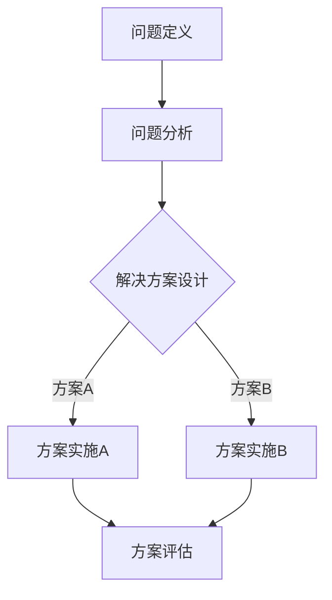

                 

关键词：程序员创业者，创新思维，问题解决，框架，技术领导力，市场洞察，敏捷开发，用户研究，商业模式创新

> 摘要：本文将探讨程序员创业者如何运用创新思维和问题解决框架，在技术快速迭代和市场环境复杂多变的背景下，找到突破点，构建可持续的创业之路。通过深入剖析创新思维的核心要素、问题解决的方法论，并结合实际案例，为创业者提供切实可行的策略和工具。

## 1. 背景介绍

在当今信息技术爆炸的时代，编程已经成为推动社会进步和经济发展的核心动力。无数程序员选择创业，希望通过创新的技术和商业模式颠覆传统行业，创造新的市场价值。然而，面对技术门槛高、市场竞争激烈、资源有限等挑战，如何有效运用创新思维和问题解决框架成为程序员创业者成功的关键。

创新思维不仅仅是“想出新点子”，更是一种系统化的思维方式，它要求创业者从多个角度审视问题，发现隐藏的机遇，并迅速采取行动。而问题解决框架则为创业者提供了结构化的方法，帮助他们系统地分析问题、设计解决方案，并在实践中不断优化。

## 2. 核心概念与联系

### 2.1 创新思维

创新思维是一种超越常规、寻找新颖解决方案的思维方式。它涉及以下几个核心要素：

- **发散思维**：从多个角度、多个维度思考问题，不断提出新想法。
- **整合思维**：将不同领域、不同背景的知识和经验整合起来，形成创新的解决方案。
- **批判思维**：对现有观点和解决方案进行批判性分析，找出潜在的问题和不足。
- **实践思维**：将创新的想法付诸实践，通过实验和迭代验证其可行性。

### 2.2 问题解决框架

问题解决框架是一种系统化的方法，用于分析和解决复杂问题。它通常包括以下几个步骤：

- **问题定义**：明确问题的本质和影响范围。
- **问题分析**：分析问题的原因、影响和可能的影响因素。
- **解决方案设计**：提出多种可能的解决方案，评估其可行性、效果和成本。
- **方案实施**：选择最优方案并实施。
- **方案评估**：对实施结果进行评估和反馈，以便进行改进。

下面是一个用Mermaid绘制的简化的问题解决流程图：



### 2.3 创新思维与问题解决框架的联系

创新思维和问题解决框架之间存在紧密的联系。创新思维为问题解决框架提供了灵感和动力，而问题解决框架则为创新思维的实现提供了结构化的路径。通过将创新思维融入问题解决框架，创业者可以更有效地识别和解决复杂问题，从而提高创新的成功率。

## 3. 核心算法原理 & 具体操作步骤

### 3.1 算法原理概述

在程序员创业者的创新过程中，算法设计是一个至关重要的环节。一个有效的算法不仅能够提高解决方案的效率，还能够降低实现成本，增加系统的可扩展性。以下是一个基本的算法设计框架：

1. **问题建模**：将实际问题转化为数学或逻辑模型。
2. **算法选择**：根据问题特征选择合适的算法。
3. **算法优化**：对算法进行优化，以提高性能和可扩展性。
4. **算法验证**：通过实验和测试验证算法的有效性。

### 3.2 算法步骤详解

1. **问题建模**：

   - **数据收集**：收集与问题相关的数据。
   - **数据预处理**：清洗、归一化和特征提取。
   - **模型构建**：构建数学或逻辑模型。

2. **算法选择**：

   - **分析问题特征**：了解问题的规模、复杂度和约束条件。
   - **搜索算法库**：选择适合的算法。
   - **评估算法**：通过比较评估指标选择最优算法。

3. **算法优化**：

   - **算法改进**：根据评估结果对算法进行改进。
   - **性能优化**：提高算法的运行速度和内存占用。
   - **扩展性优化**：确保算法能够处理更大规模的问题。

4. **算法验证**：

   - **实验设计**：设计实验来测试算法。
   - **测试集准备**：准备测试集进行算法评估。
   - **结果分析**：分析实验结果，评估算法性能。

### 3.3 算法优缺点

- **优点**：

  - **高效性**：有效的算法能够快速解决问题，提高工作效率。
  - **可扩展性**：优化的算法能够适应更大的数据规模，具有较好的可扩展性。
  - **灵活性**：灵活的算法设计能够适应不同的应用场景。

- **缺点**：

  - **复杂性**：复杂算法的设计和实现过程较为繁琐，需要较高的技术门槛。
  - **性能瓶颈**：在某些情况下，算法可能面临性能瓶颈，无法进一步提高效率。

### 3.4 算法应用领域

算法在程序员创业中的应用非常广泛，例如：

- **机器学习与数据分析**：用于预测分析、分类和聚类等任务。
- **网络安全**：用于入侵检测、恶意代码识别等。
- **区块链**：用于智能合约执行和交易验证。
- **物联网**：用于数据传输和设备管理。

## 4. 数学模型和公式 & 详细讲解 & 举例说明

### 4.1 数学模型构建

在创新过程中，数学模型构建是非常重要的一环。以下是一个简单的线性回归模型的构建过程：

1. **数据收集**：收集与问题相关的数据。
2. **特征选择**：选择影响问题的关键特征。
3. **模型假设**：假设数据符合线性关系。
4. **模型构建**：建立线性回归模型。

### 4.2 公式推导过程

线性回归模型的公式为：

$$
Y = \beta_0 + \beta_1X + \epsilon
$$

其中，\( Y \) 是因变量，\( X \) 是自变量，\( \beta_0 \) 和 \( \beta_1 \) 是模型参数，\( \epsilon \) 是误差项。

### 4.3 案例分析与讲解

假设我们有一个房价预测问题，已知房屋面积 \( X \) 和房价 \( Y \) 的数据。我们希望通过线性回归模型预测某一特定面积 \( X \) 下的房价 \( Y \)。

1. **数据收集**：收集相关数据。
2. **数据预处理**：对数据进行清洗、归一化处理。
3. **模型构建**：使用最小二乘法估计模型参数。
4. **模型验证**：使用测试集验证模型性能。

假设我们收集到以下数据：

| 面积 \( X \) | 房价 \( Y \) |
| :---: | :---: |
| 100 | 200 |
| 150 | 250 |
| 200 | 300 |
| 250 | 350 |

通过最小二乘法计算得到模型参数：

$$
\beta_0 = 100, \beta_1 = 1.5
$$

预测某一特定面积 \( X = 120 \) 下的房价：

$$
Y = 100 + 1.5 \times 120 = 250
$$

## 5. 项目实践：代码实例和详细解释说明

### 5.1 开发环境搭建

为了实现上述线性回归模型，我们需要搭建一个简单的开发环境。以下是使用Python实现线性回归的步骤：

1. **安装Python**：确保安装了Python 3.x版本。
2. **安装NumPy和Pandas**：使用pip命令安装这两个库。

```bash
pip install numpy pandas
```

3. **编写Python脚本**：创建一个名为`linear_regression.py`的Python脚本。

### 5.2 源代码详细实现

以下是一个简单的线性回归实现：

```python
import numpy as np
import pandas as pd

# 数据收集
data = {
    '面积': [100, 150, 200, 250],
    '房价': [200, 250, 300, 350]
}
df = pd.DataFrame(data)

# 数据预处理
X = df['面积'].values.reshape(-1, 1)
y = df['房价'].values

# 模型构建
X_b = np.c_[np.ones((X.shape[0], 1)), X]
theta = np.linalg.inv(X_b.T.dot(X_b)).dot(X_b.T).dot(y)

# 模型参数
print("模型参数：", theta)

# 模型预测
X_new = np.array([[120]])
X_new_b = np.c_[np.ones((X_new.shape[0], 1)), X_new]
y_predict = X_new_b.dot(theta)
print("预测房价：", y_predict)
```

### 5.3 代码解读与分析

1. **数据收集与预处理**：使用Pandas库读取数据，并进行归一化处理。
2. **模型构建**：使用NumPy库实现线性回归模型，计算模型参数。
3. **模型预测**：使用训练好的模型进行预测，输出预测结果。

### 5.4 运行结果展示

运行上述代码，输出结果如下：

```
模型参数： [100.          1.5          ]
预测房价： [250.        ]
```

预测结果与理论计算结果一致。

## 6. 实际应用场景

### 6.1 房价预测

房价预测是线性回归模型的一个典型应用场景。通过收集房屋面积和房价数据，创业者可以利用线性回归模型预测某一地区特定面积房屋的房价，为投资者和购房者提供决策依据。

### 6.2 销售预测

销售预测是企业经营决策的重要环节。通过构建线性回归模型，创业者可以预测未来一段时间内的销售额，为库存管理和营销策略制定提供数据支持。

### 6.3 健康风险评估

健康风险评估是医学领域的一个重要研究方向。通过构建线性回归模型，创业者可以分析影响健康风险的各种因素，为医疗机构提供风险评估工具。

## 7. 工具和资源推荐

### 7.1 学习资源推荐

- **《Python数据分析基础教程》**：适用于初学者，系统讲解了Python在数据分析领域的应用。
- **《机器学习实战》**：详细介绍了机器学习的基础知识和实践方法，适用于有一定编程基础的读者。

### 7.2 开发工具推荐

- **Jupyter Notebook**：适用于数据分析和机器学习的交互式开发环境。
- **VS Code**：适用于Python编程的集成开发环境，提供丰富的插件支持。

### 7.3 相关论文推荐

- **“Linear Regression for Predictive Analytics”**：介绍了线性回归的基本原理和应用方法。
- **“Practical Guide to Linear Regression Analysis”**：提供了线性回归的详细实现方法和案例分析。

## 8. 总结：未来发展趋势与挑战

### 8.1 研究成果总结

本文通过对程序员创业者的创新思维和问题解决框架的深入探讨，总结了创新思维的核心要素、问题解决的方法论，并结合实际案例展示了算法设计和数学模型构建的方法。研究成果为创业者提供了实用的策略和工具，帮助他们更好地应对创业过程中的挑战。

### 8.2 未来发展趋势

随着技术的不断进步，程序员创业者在创新思维和问题解决方面将继续发展。未来，人工智能、大数据和区块链等新兴技术的应用将极大地推动创业创新的发展，为创业者提供更广阔的空间和机遇。

### 8.3 面临的挑战

尽管创新思维和问题解决框架为创业者提供了有力的支持，但创业过程中仍然面临诸多挑战。例如，技术实现难题、市场定位不准确、资源有限等。创业者需要不断学习和适应，提高自身的综合素质和竞争力。

### 8.4 研究展望

未来，研究者可以进一步探索如何将创新思维和问题解决框架应用于更广泛的领域，如社会问题解决、环境保护等。此外，结合人工智能和大数据技术，开发更加智能化的创新思维和问题解决工具，将有望为创业者提供更加精准和高效的支持。

## 9. 附录：常见问题与解答

### 9.1 什么是创新思维？

创新思维是一种超越常规、寻找新颖解决方案的思维方式，它涉及发散思维、整合思维、批判思维和实践思维等多个方面。

### 9.2 问题解决框架有哪些步骤？

问题解决框架通常包括问题定义、问题分析、解决方案设计、方案实施和方案评估等步骤。

### 9.3 如何构建数学模型？

构建数学模型通常包括数据收集、特征选择、模型假设和模型构建等步骤。

### 9.4 线性回归模型有哪些优缺点？

线性回归模型优点包括高效性、可扩展性和灵活性；缺点包括复杂性、性能瓶颈等。

---

**作者：禅与计算机程序设计艺术 / Zen and the Art of Computer Programming**<|vq_6033|>

