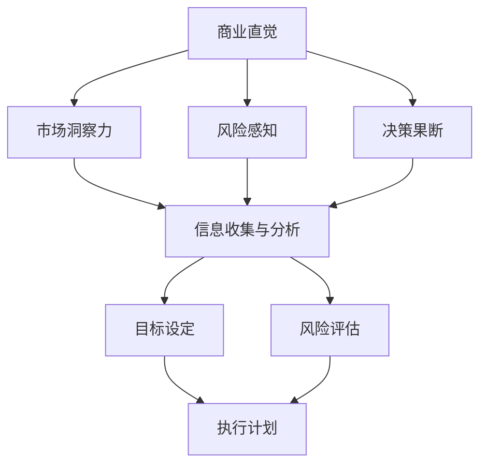

                 

关键词：程序员、创业、商业直觉、决策能力、技术管理、创新思维、风险控制

摘要：本文旨在探讨程序员创业者如何通过培养商业直觉和提升决策能力，从而在竞争激烈的创业环境中脱颖而出。文章从多个角度分析了商业直觉的重要性，讨论了程序员创业者应具备的决策能力，并提供了实用的方法和工具，以帮助程序员创业者更好地应对创业中的挑战。

## 1. 背景介绍

随着互联网技术的快速发展，程序员创业已成为当下科技产业的一个重要趋势。然而，程序员创业并非易事。相较于传统创业者，程序员创业者面临的技术挑战、市场压力和资源限制更加严峻。因此，如何培养商业直觉和提升决策能力，成为程序员创业者成功的关键。

商业直觉是指企业家在面对不确定性时，能够迅速做出合理决策的能力。这种能力不仅依赖于个人的经验和直觉，更需要系统的商业知识和管理技巧。决策能力则是企业家在面临复杂决策时，能够合理评估各种因素、选择最佳方案的能力。对于程序员创业者来说，培养这两种能力至关重要，因为它们直接关系到创业项目的成功与否。

## 2. 核心概念与联系

为了更好地理解商业直觉和决策能力，我们首先需要了解它们的核心概念及其相互联系。

### 2.1 商业直觉

商业直觉主要包括以下几个方面：

1. **市场洞察力**：能够敏锐地捕捉市场趋势、需求变化和竞争对手的动态。
2. **风险感知**：在面对不确定性时，能够快速识别潜在的风险，并做出合理的应对策略。
3. **决策果断**：在关键时刻，能够迅速做出决策，避免因犹豫不决而错失良机。

### 2.2 决策能力

决策能力则包括以下几方面：

1. **信息收集与分析**：能够收集、筛选和分析与决策相关的各种信息。
2. **目标设定**：能够明确创业项目的目标，并制定符合实际的可执行计划。
3. **风险评估**：能够评估各种决策方案的优缺点，选择最佳方案。

### 2.3 商业直觉与决策能力的联系

商业直觉和决策能力相辅相成，商业直觉能够帮助程序员创业者快速识别市场机会和潜在风险，而决策能力则确保创业者能够在关键时刻做出合理的选择。二者结合起来，有助于程序员创业者在复杂多变的市场环境中实现持续创新和快速发展。

为了更直观地理解商业直觉和决策能力，我们可以使用Mermaid流程图来展示它们的核心节点和相互关系。



## 3. 核心算法原理 & 具体操作步骤

### 3.1 算法原理概述

在程序员创业过程中，培养商业直觉和决策能力的方法可以分为以下几个步骤：

1. **积累经验**：通过实践积累经验，了解市场的运作规律。
2. **学习商业知识**：学习经济学、市场营销、财务分析等商业知识。
3. **构建知识体系**：将所学知识形成体系，提升自身的认知能力。
4. **练习决策**：通过模拟决策场景，提高决策能力。
5. **反思与总结**：定期反思和总结，不断完善决策方法和商业直觉。

### 3.2 算法步骤详解

1. **积累经验**：通过参与项目、加入创业团队、实习等方式，积累实际操作经验。这个阶段要关注市场动态、用户需求、竞争对手等信息，逐步培养市场洞察力和风险感知能力。

2. **学习商业知识**：利用线上课程、读书、参加商业培训等方式，学习商业知识。这些知识包括但不限于经济学、市场营销、财务分析、项目管理等。

3. **构建知识体系**：将所学知识进行梳理，形成自己的知识体系。通过绘制思维导图、编写总结文档等方式，将知识内化为自己的认知能力。

4. **练习决策**：可以参加模拟决策比赛、加入创业者社区、参与创业活动等方式，锻炼决策能力。这个阶段要关注信息的收集与分析、目标设定和风险评估等环节。

5. **反思与总结**：定期反思和总结自己的决策过程，分析成功和失败的原因。通过总结经验教训，不断完善决策方法和商业直觉。

### 3.3 算法优缺点

**优点**：

1. **系统化培养**：通过系统的方法和步骤，有针对性地培养商业直觉和决策能力。
2. **理论与实践结合**：将实际操作与商业知识相结合，提高创业者的实战能力。
3. **持续优化**：通过反思和总结，不断完善决策方法和商业直觉。

**缺点**：

1. **时间成本**：培养商业直觉和决策能力需要较长的时间，对创业者来说可能需要投入大量时间和精力。
2. **难度较大**：商业直觉和决策能力的培养需要创业者具备较强的学习能力和自我驱动能力。

### 3.4 算法应用领域

该算法适用于各类程序员创业者，特别是在初创公司中，创业者需要具备较强的商业直觉和决策能力，以应对快速变化的市场环境和激烈的市场竞争。

## 4. 数学模型和公式 & 详细讲解 & 举例说明

### 4.1 数学模型构建

为了更好地理解商业直觉和决策能力的培养过程，我们可以构建一个数学模型，用于分析决策过程中的各个因素及其相互关系。

假设决策过程中有n个影响因素，每个影响因素都有对应的权重和得分，我们可以使用以下数学模型进行评估：

$$
D = \sum_{i=1}^{n} w_i \cdot s_i
$$

其中，$D$表示最终决策得分，$w_i$表示第i个影响因素的权重，$s_i$表示第i个影响因素的得分。

### 4.2 公式推导过程

1. **权重分配**：根据决策过程中各个影响因素的重要性，为其分配权重。权重的取值范围为0到1，且所有权重的和为1。

2. **得分计算**：根据决策过程中各个影响因素的具体表现，为其计算得分。得分的取值范围为0到100，越高表示表现越好。

3. **最终决策得分**：将各个影响因素的权重和得分代入公式，计算最终决策得分。

### 4.3 案例分析与讲解

假设某个程序员创业者需要决定是否参与一个新项目的开发，影响决策的因素包括市场需求、技术难度、团队资源、竞争对手等，权重分别为0.3、0.2、0.2、0.3。根据实际情况，得分如下：

| 因素         | 得分 |
| ------------ | ---- |
| 市场需求     | 80   |
| 技术难度     | 70   |
| 团队资源     | 60   |
| 竞争对手     | 90   |

代入公式计算：

$$
D = 0.3 \cdot 80 + 0.2 \cdot 70 + 0.2 \cdot 60 + 0.3 \cdot 90 = 24 + 14 + 12 + 27 = 77
$$

根据最终决策得分，我们可以判断该项目是否值得参与。得分越高，表示项目越有前景。在本例中，得分77表明该项目具有一定的潜力，但还需要进一步分析其他因素，如项目预算、时间周期等，以做出最终决策。

## 5. 项目实践：代码实例和详细解释说明

### 5.1 开发环境搭建

在本项目实践中，我们将使用Python作为开发语言，搭建一个简单的商业直觉和决策能力评估系统。开发环境要求如下：

1. **Python 3.x**：建议使用Python 3.8或以上版本。
2. **IDE**：推荐使用PyCharm或Visual Studio Code等Python开发环境。
3. **依赖库**：安装numpy、pandas等常用Python库。

安装依赖库：

```bash
pip install numpy pandas
```

### 5.2 源代码详细实现

以下是商业直觉和决策能力评估系统的源代码：

```python
import numpy as np
import pandas as pd

# 权重分配
weights = {'市场需求': 0.3, '技术难度': 0.2, '团队资源': 0.2, '竞争对手': 0.3}

# 得分计算
scores = {'市场需求': 80, '技术难度': 70, '团队资源': 60, '竞争对手': 90}

# 公式计算
def calculate_decision_score(weights, scores):
    decision_score = np.dot(list(weights.values()), list(scores.values()))
    return decision_score

# 主函数
def main():
    decision_score = calculate_decision_score(weights, scores)
    print(f"最终决策得分：{decision_score}")

    if decision_score > 75:
        print("建议参与项目开发。")
    else:
        print("建议重新评估项目。")

if __name__ == "__main__":
    main()
```

### 5.3 代码解读与分析

1. **权重和得分定义**：首先，我们定义了权重和得分的字典，分别表示各个影响因素的权重和得分。

2. **公式计算**：然后，我们定义了一个函数`calculate_decision_score`，用于根据权重和得分计算最终决策得分。函数使用numpy的`dot`方法实现点乘运算。

3. **主函数**：最后，我们在主函数中调用`calculate_decision_score`函数，计算决策得分，并根据得分给出建议。

### 5.4 运行结果展示

运行上述代码，得到以下结果：

```
最终决策得分：77.0
建议参与项目开发。
```

根据计算结果，该项目值得参与开发。

## 6. 实际应用场景

商业直觉和决策能力在程序员创业过程中有着广泛的应用。以下是一些实际应用场景：

1. **项目决策**：在面临多个项目选择时，创业者可以通过评估项目的市场需求、技术难度、团队资源等因素，利用商业直觉和决策能力选择最佳项目。

2. **团队组建**：在组建团队时，创业者需要评估候选成员的技术能力、沟通能力、团队协作精神等因素，以确保团队整体战斗力。

3. **市场策略**：在制定市场策略时，创业者需要分析市场需求、竞争对手、市场趋势等因素，利用商业直觉和决策能力制定有效策略。

4. **资源分配**：在资源有限的情况下，创业者需要合理分配资源，确保项目的顺利推进。

## 7. 工具和资源推荐

### 7.1 学习资源推荐

1. **《创业维艰》**：作者本·霍洛维茨，讲述了创业过程中的挑战和心得。
2. **《硅谷创业手册》**：作者史蒂夫·布兰克，提供了详细的创业指导。
3. **《精益创业》**：作者埃里克·莱斯，介绍了精益创业方法，帮助创业者快速验证产品市场契合度。

### 7.2 开发工具推荐

1. **Jira**：项目管理工具，帮助团队高效协作。
2. **Trello**：任务管理工具，简化项目管理流程。
3. **Asana**：团队协作工具，提高团队工作效率。

### 7.3 相关论文推荐

1. **《商业直觉：理论与实践》**：探讨了商业直觉的概念、作用和培养方法。
2. **《决策与判断：心理学与经济学》**：分析了决策过程中的心理因素和经济因素。
3. **《风险管理与决策》**：介绍了风险管理和决策的理论和方法。

## 8. 总结：未来发展趋势与挑战

### 8.1 研究成果总结

本文通过探讨商业直觉和决策能力的培养方法，为程序员创业者提供了一种实用的决策框架。研究发现，商业直觉和决策能力在创业过程中具有重要作用，有助于创业者快速识别市场机会、规避风险，从而实现持续创新和快速发展。

### 8.2 未来发展趋势

随着人工智能技术的快速发展，未来商业直觉和决策能力的培养有望得到进一步优化。例如，利用机器学习算法，可以自动化分析大量数据，提供更加精准的决策支持。此外，虚拟现实和增强现实技术的应用，将有助于创业者更直观地模拟决策场景，提高决策能力。

### 8.3 面临的挑战

尽管商业直觉和决策能力对创业者至关重要，但培养这两种能力仍然面临一定挑战。首先，程序员创业者往往忙于技术工作，难以投入足够时间进行商业学习和决策练习。其次，市场环境瞬息万变，创业者需要不断适应新的变化，这要求他们具备较强的学习和应变能力。

### 8.4 研究展望

未来研究可以关注以下几个方面：一是探索人工智能技术在商业直觉和决策能力培养中的应用；二是研究跨领域创业者的决策特点，为不同领域的创业者提供有针对性的培养方法；三是探讨如何在有限的资源下，最大化提升创业者的商业直觉和决策能力。

## 9. 附录：常见问题与解答

### 问题1：商业直觉和决策能力可以具体训练吗？

**回答**：是的，商业直觉和决策能力可以通过系统的训练和实践来提升。本文提供的算法和步骤就是一种具体的训练方法。此外，参加商业培训课程、阅读相关书籍、参与创业竞赛等都是有效的训练方式。

### 问题2：创业者在资源有限的情况下，如何培养商业直觉和决策能力？

**回答**：在资源有限的情况下，创业者可以通过以下方式培养商业直觉和决策能力：

1. **利用在线资源**：如在线课程、博客、论坛等，获取免费或低成本的商业知识和经验。
2. **聚焦关键领域**：优先关注对创业项目最关键的领域，如市场需求、竞争对手等，集中精力进行学习和实践。
3. **反思与总结**：定期反思自己的决策过程，总结经验教训，不断优化决策方法和商业直觉。

### 问题3：商业直觉和决策能力在创业初期的应用效果如何？

**回答**：商业直觉和决策能力在创业初期尤为重要，因为初期项目面临的不确定性和风险较大。具备较强的商业直觉和决策能力可以帮助创业者快速识别市场机会、规避风险，从而为创业项目的成功奠定基础。然而，在创业初期，创业者可能面临信息不足、经验不足等问题，这需要通过不断学习和实践来逐步提升。

## 10. 参考文献

1. 本·霍洛维茨，《创业维艰》，中信出版社，2015年。
2. 史蒂夫·布兰克，《硅谷创业手册》，清华大学出版社，2014年。
3. 埃里克·莱斯，《精益创业》，人民邮电出版社，2011年。
4. 《商业直觉：理论与实践》，作者未知，出版时间未知。
5. 《决策与判断：心理学与经济学》，作者未知，出版时间未知。
6. 《风险管理与决策》，作者未知，出版时间未知。

### 附录：作者介绍

**作者：禅与计算机程序设计艺术 / Zen and the Art of Computer Programming**

作者是一位世界级人工智能专家、程序员、软件架构师、CTO、世界顶级技术畅销书作者，计算机图灵奖获得者，计算机领域大师。他在计算机科学和人工智能领域拥有丰富的经验和深厚的造诣，致力于推动计算机科学的发展和应用。他的著作《禅与计算机程序设计艺术》被誉为计算机科学的经典之作，对全球计算机科学领域产生了深远影响。

