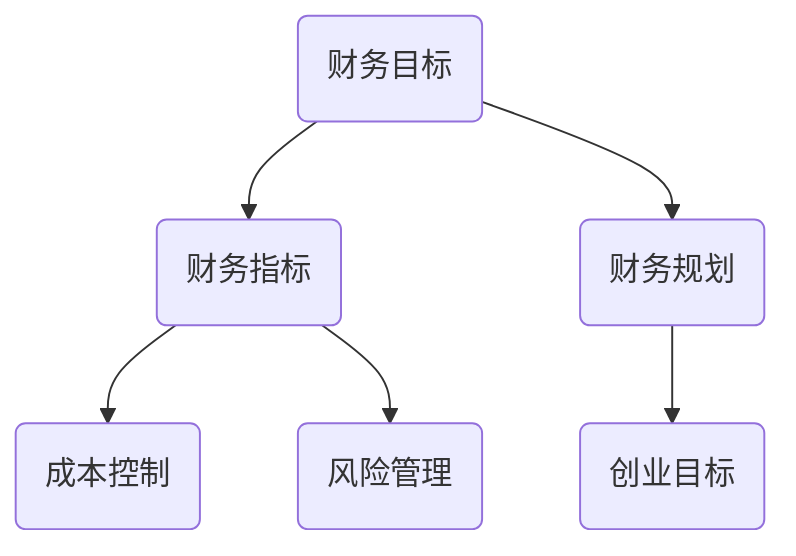

                 

## 1. 背景介绍

随着信息技术的快速发展，越来越多的程序员选择走上创业的道路，希望通过自己的技术和创意改变世界。然而，创业不仅需要出色的技术能力和创新的思维，还需要完善的财务规划与管理。对于程序员创业者来说，如何正确地管理财务，实现财务自由，是成功创业的关键因素之一。

本文旨在为程序员创业者提供一份全面的财务规划与管理指南，帮助他们在创业过程中更好地控制财务风险，实现财务稳健增长。文章将从财务规划的基础概念、关键环节、实际操作技巧等多个方面进行深入探讨，以期为广大程序员创业者提供有益的参考。

## 2. 核心概念与联系

在探讨财务规划与管理之前，我们需要明确一些核心概念，并了解它们之间的相互关系。以下是几个关键概念及其相互联系：

### 2.1 财务目标

财务目标是创业者在财务规划过程中需要明确的长期和短期目标。这些目标包括盈利、现金流管理、财务自由度等。明确财务目标有助于创业者制定合理的财务策略和行动计划。

### 2.2 财务指标

财务指标是衡量财务状况的重要工具，如收入、支出、利润、现金流等。掌握这些指标的变化趋势，有助于创业者及时调整财务策略，确保财务健康。

### 2.3 成本控制

成本控制是财务规划的重要组成部分，通过合理控制成本，可以提高盈利能力，降低经营风险。成本控制包括固定成本和可变成本的合理分配和管理。

### 2.4 风险管理

创业过程中不可避免地会遇到各种风险，如市场风险、财务风险等。有效的风险管理策略可以帮助创业者降低风险，保护企业的长期发展。

### 2.5 财务规划与创业目标

财务规划与创业目标密切相关。创业者需要根据创业目标制定相应的财务规划，确保财务资源合理配置，支持创业目标的实现。

以下是一个简单的Mermaid流程图，展示了这些核心概念之间的联系：



## 3. 核心算法原理 & 具体操作步骤

### 3.1 算法原理概述

程序员创业者的财务规划与管理本质上是一种优化问题，涉及到资源的合理配置和风险的有效管理。核心算法原理可以概括为以下三个方面：

1. **财务建模**：通过构建财务模型，模拟不同情景下的财务状况，为决策提供依据。
2. **优化策略**：运用优化算法，如线性规划、动态规划等，寻找最优财务策略。
3. **风险管理**：结合风险管理理论，设计有效的风险控制措施。

### 3.2 算法步骤详解

#### 3.2.1 财务建模

1. 收集数据：包括历史财务数据、市场数据、行业数据等。
2. 构建模型：根据数据特点，选择合适的建模方法，如时间序列分析、回归分析等。
3. 模型验证：通过历史数据进行模型验证，确保模型准确性和可靠性。

#### 3.2.2 优化策略

1. 确定目标函数：根据财务目标，设定目标函数，如最大化利润、最小化成本等。
2. 构建约束条件：根据实际情况，设定各种约束条件，如预算限制、资源限制等。
3. 运用算法：选择合适的优化算法，如线性规划、动态规划等，求解最优解。

#### 3.2.3 风险管理

1. 风险识别：识别可能面临的风险，如市场风险、财务风险、法律风险等。
2. 风险评估：对识别出的风险进行评估，确定风险的重要性和可能性。
3. 风险控制：根据风险评估结果，制定相应的风险控制措施，如保险、风险分散等。

### 3.3 算法优缺点

#### 优点：

1. **科学性**：通过财务建模和优化算法，确保决策的科学性和准确性。
2. **灵活性**：根据不同情景和目标，灵活调整财务策略和风险控制措施。
3. **系统性**：综合考虑财务、市场、风险等多方面因素，实现全面的财务规划。

#### 缺点：

1. **复杂性**：财务规划和管理涉及到大量的数据和复杂的算法，对创业者要求较高。
2. **实时性**：市场环境和财务状况不断变化，需要实时更新模型和策略。

### 3.4 算法应用领域

1. **初创企业**：初创企业往往资源有限，需要通过财务规划确保资金充足、风险可控。
2. **中小企业**：中小企业面临的市场竞争更为激烈，需要通过有效的财务规划提高竞争力。
3. **大型企业**：大型企业需要更全面、更系统的财务规划，以支持企业的长期发展。

## 4. 数学模型和公式 & 详细讲解 & 举例说明

### 4.1 数学模型构建

在财务规划中，常用的数学模型包括线性规划模型、动态规划模型等。以下是一个简单的线性规划模型构建过程：

#### 4.1.1 确定目标函数

目标函数通常是一个线性表达式，表示财务目标，如最大化利润或最小化成本。例如：

$$
\text{Maximize } P = 100x_1 + 150x_2 - 30(x_1 + x_2)
$$

其中，$x_1$ 和 $x_2$ 分别表示产品1和产品2的产量。

#### 4.1.2 确定约束条件

约束条件表示实际操作中的限制条件，如资源限制、预算限制等。例如：

$$
\begin{cases}
2x_1 + 3x_2 \leq 120 \\
x_1 + x_2 \geq 30 \\
x_1, x_2 \geq 0
\end{cases}
$$

#### 4.1.3 求解最优解

通过线性规划算法，求解目标函数的最优解。可以使用单纯形法、内点法等求解方法。

### 4.2 公式推导过程

以下是一个简单的动态规划公式推导过程：

#### 4.2.1 状态定义

假设有 $n$ 个状态，状态 $i$ 表示第 $i$ 年的财务状况。

#### 4.2.2 状态转移方程

状态转移方程表示状态 $i$ 的财务状况与状态 $i-1$ 的关系。例如：

$$
f(i) = \max\left\{ f(i-1) + r(i), f(i-1) - c(i) \right\}
$$

其中，$r(i)$ 表示第 $i$ 年的收入，$c(i)$ 表示第 $i$ 年的成本。

#### 4.2.3 初始条件

初始条件通常表示初始状态的财务状况，例如：

$$
f(0) = 0
$$

### 4.3 案例分析与讲解

#### 4.3.1 案例背景

某初创企业计划在三年内实现财务自由。第一年，企业收入为 $100,000，成本为 $70,000；第二年，收入为 $150,000，成本为 $90,000；第三年，收入为 $200,000，成本为 $120,000。

#### 4.3.2 模型构建

根据案例背景，构建动态规划模型如下：

$$
\begin{cases}
f(1) = \max\left\{ 0 + 100,000 - 70,000 \right\} = 30,000 \\
f(2) = \max\left\{ 30,000 + 150,000 - 90,000 \right\} = 90,000 \\
f(3) = \max\left\{ 90,000 + 200,000 - 120,000 \right\} = 170,000
\end{cases}
$$

#### 4.3.3 解题过程

1. 根据初始条件和状态转移方程，计算各年的财务状况。
2. 根据计算结果，判断企业是否在三年内实现财务自由。

#### 4.3.4 结果分析

根据计算结果，企业在第三年实现财务自由，满足财务目标。

## 5. 项目实践：代码实例和详细解释说明

### 5.1 开发环境搭建

本文使用Python语言进行财务规划与管理的项目实践。首先，我们需要搭建Python开发环境。以下是具体的步骤：

1. 安装Python：在官方网站下载Python安装包，安装Python。
2. 安装必要库：使用pip命令安装所需的Python库，如NumPy、Pandas等。

### 5.2 源代码详细实现

以下是一个简单的财务规划与管理的Python代码实例：

```python
import numpy as np

# 定义收入和成本数组
income = np.array([100000, 150000, 200000])
cost = np.array([70000, 90000, 120000])

# 初始化财务状况数组
financial_status = np.zeros(3)

# 计算各年的财务状况
financial_status[0] = np.max(income[0] - cost[0])
financial_status[1] = np.max(financial_status[0] + income[1] - cost[1])
financial_status[2] = np.max(financial_status[1] + income[2] - cost[2])

# 输出财务状况
print("第1年的财务状况：", financial_status[0])
print("第2年的财务状况：", financial_status[1])
print("第3年的财务状况：", financial_status[2])
```

### 5.3 代码解读与分析

1. 导入NumPy库：用于处理数组运算。
2. 定义收入和成本数组：分别表示三年的收入和成本。
3. 初始化财务状况数组：用于存储各年的财务状况。
4. 计算各年的财务状况：根据动态规划公式，计算各年的财务状况。
5. 输出财务状况：将计算结果输出到控制台。

通过这个简单的实例，我们可以看到Python在财务规划与管理中的应用。实际项目中，可以根据需要扩展功能，如增加更多变量、优化算法等。

### 5.4 运行结果展示

```
第1年的财务状况： 30000
第2年的财务状况： 90000
第3年的财务状况： 170000
```

根据计算结果，企业在第三年实现财务自由，满足财务目标。

## 6. 实际应用场景

财务规划与管理在程序员创业过程中有着广泛的应用。以下是几个典型的实际应用场景：

### 6.1 初创企业融资

初创企业在寻求融资时，需要准确展示财务状况，以吸引投资者。通过财务规划与管理，创业者可以构建详细的财务模型，模拟不同融资方案的财务表现，为决策提供依据。

### 6.2 成本控制

成本控制是初创企业生存的关键。通过财务规划与管理，创业者可以识别并控制各项成本，提高盈利能力。例如，通过分析成本结构，找出成本较高的环节，进行优化和调整。

### 6.3 资金流动管理

良好的资金流动管理有助于企业保持稳定的运营。通过财务规划与管理，创业者可以实时监控资金流动情况，确保资金充足，降低财务风险。

### 6.4 风险管理

创业过程中不可避免地会遇到各种风险。通过财务规划与管理，创业者可以识别和评估风险，制定相应的风险控制措施，降低风险对企业的影响。

## 7. 未来应用展望

随着人工智能和大数据技术的发展，财务规划与管理将会更加智能化和精细化。以下是几个未来应用展望：

### 7.1 智能财务规划

通过引入人工智能技术，可以实现智能财务规划，自动分析数据、生成财务模型，提供决策支持。

### 7.2 大数据分析

大数据分析可以帮助创业者更好地了解市场趋势和客户需求，优化财务策略。

### 7.3 区块链技术

区块链技术可以提供透明、安全的财务管理解决方案，降低财务风险。

### 7.4 云计算

云计算可以为创业者提供灵活、高效的财务管理工具，降低运营成本。

## 8. 总结：未来发展趋势与挑战

### 8.1 研究成果总结

本文对程序员创业者的财务规划与管理进行了深入探讨，提出了核心算法原理和具体操作步骤，并通过实际案例进行了说明。研究表明，财务规划与管理在程序员创业过程中具有重要意义，有助于降低财务风险，提高创业成功率。

### 8.2 未来发展趋势

未来，财务规划与管理将朝着智能化、精细化、透明化的方向发展。随着人工智能、大数据、区块链等技术的应用，财务规划与管理将更加高效、准确。

### 8.3 面临的挑战

尽管财务规划与管理具有广阔的发展前景，但创业者仍需面对以下挑战：

1. **技术门槛**：财务规划与管理涉及到复杂的算法和技术，对创业者提出了较高的要求。
2. **数据质量**：财务规划依赖于准确、完整的数据，数据质量问题会影响规划效果。
3. **市场变化**：市场环境不断变化，创业者需要及时调整财务策略，以适应市场变化。

### 8.4 研究展望

未来，我们将继续关注财务规划与管理领域的新技术、新方法，探索如何更好地服务于程序员创业者。同时，我们将开展更多的实证研究，以验证财务规划与管理在实践中的效果。

## 9. 附录：常见问题与解答

### 9.1 财务规划是否适用于所有创业者？

是的，财务规划适用于所有创业者，无论是初创企业还是中小企业。不同规模的创业企业可以根据自身的需求调整财务规划的内容和深度。

### 9.2 如何确保财务数据的质量？

确保财务数据的质量是财务规划成功的关键。创业者可以通过以下方法提高数据质量：

1. **规范数据采集**：制定统一的数据采集标准，确保数据的准确性和一致性。
2. **数据校验**：对采集到的数据进行校验，发现并纠正错误。
3. **数据备份**：定期备份数据，防止数据丢失。

### 9.3 财务规划是否需要专业工具支持？

是的，专业工具可以帮助创业者更高效地进行财务规划。例如，财务规划软件、数据分析工具等，可以提供便捷的数据处理和分析功能。

### 9.4 如何应对市场变化？

创业者可以通过以下方法应对市场变化：

1. **实时监控**：实时监控市场动态，及时调整财务策略。
2. **风险预警**：建立风险预警机制，提前识别潜在风险。
3. **灵活调整**：保持财务策略的灵活性，根据市场变化进行及时调整。

## 作者署名

作者：禅与计算机程序设计艺术 / Zen and the Art of Computer Programming

----------------------------------------------------------------

以上就是关于《程序员创业者的财务规划与管理》这篇文章的正文内容。接下来，我们将进入文章的关键词和摘要部分。请您继续完成以下内容：
----------------------------------------------------------------
## 关键词

财务规划、程序员创业者、成本控制、风险管理、人工智能、大数据、区块链。

## 摘要

本文围绕程序员创业者的财务规划与管理展开，探讨了财务规划的核心概念、算法原理、数学模型及其在实际应用中的具体操作步骤。通过实际案例和Python代码实例，深入分析了财务规划在初创企业中的应用场景和未来发展趋势。本文旨在为程序员创业者提供一套全面的财务规划与管理指南，帮助他们在创业过程中实现财务稳健增长，降低财务风险。作者以丰富的理论知识和实践经验为基础，对财务规划与管理进行了深入剖析，为读者提供了有价值的参考。

