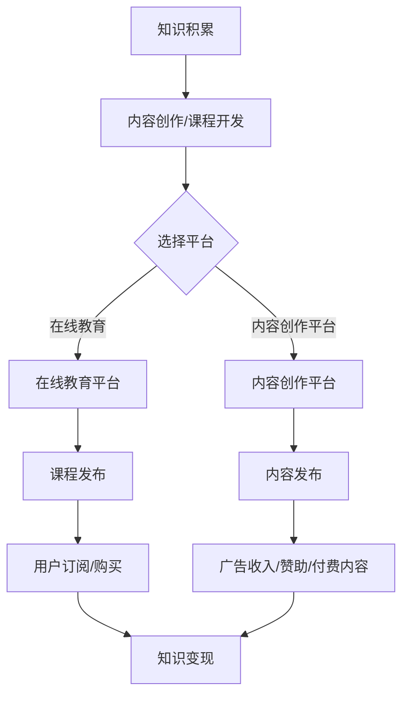

                 

### 关键词 Keywords
- **知识付费**
- **财富自由**
- **程序员**
- **知识变现**
- **在线教育**
- **人工智能技术**
- **内容创作**

<|assistant|>### 摘要 Abstract
本文旨在探讨程序员如何通过知识付费实现财富自由。我们将分析当前知识付费市场的现状，探讨程序员可以利用的多种知识变现途径，包括在线教育、内容创作和人工智能技术。通过具体案例和实操步骤，我们将帮助读者理解如何通过知识付费实现财务目标，并展望这一领域的未来发展趋势和挑战。

## 1. 背景介绍

知识付费是指用户为获取特定知识或服务而支付的费用，这一现象在近年来随着互联网和信息技术的发展愈发普遍。对于程序员来说，他们的专业技能和知识储备是市场上的稀缺资源，这使得知识付费成为他们实现财富自由的重要途径之一。

### 1.1 程序员的知识价值

程序员具有独特的专业技能，包括编程语言、软件开发、算法设计、数据库管理等。这些技能不仅是他们职业生涯的基石，也是市场上供不应求的资源。随着信息时代的到来，企业对于技术人才的需求不断增加，这使得程序员能够通过知识付费获得可观的收入。

### 1.2 知识付费市场的机遇

知识付费市场具有巨大的潜力。一方面，随着在线教育的兴起，人们对于高质量技术课程的需求不断增加；另一方面，内容创作平台的崛起为程序员提供了展示才华和变现的舞台。此外，人工智能技术的发展为知识付费市场带来了新的工具和机会。

## 2. 核心概念与联系

### 2.1 知识付费的概念

知识付费是指用户为获取特定知识或服务而支付的费用。这种模式的核心在于将知识作为商品进行交易，用户通过付费来购买所需的知识。

### 2.2 在线教育与知识付费的联系

在线教育平台是知识付费的重要载体。程序员可以通过在线教育平台发布自己的技术课程，例如编程语言教学、软件项目实战等。平台为程序员提供了一个展示自己技能和知识的机会，同时通过订阅和销售课程实现知识变现。

### 2.3 内容创作与知识变现

内容创作是程序员知识变现的另一种方式。通过撰写技术博客、发布视频教程、制作电子书等，程序员可以吸引读者和观众，进而通过广告收入、赞助、付费内容等方式实现收益。

### 2.4 人工智能技术在知识付费中的应用

人工智能技术为知识付费带来了新的可能。通过智能推荐算法，平台可以更好地满足用户需求，提高课程点击率和订阅量。此外，AI技术还可以用于课程内容的自动生成和个性化推荐，提高知识付费的效率和用户体验。

### 2.5 Mermaid 流程图

下面是一个简单的 Mermaid 流程图，展示程序员通过知识付费实现财富自由的基本流程：



## 3. 核心算法原理 & 具体操作步骤

### 3.1 算法原理概述

在知识付费领域，算法主要应用于用户行为分析、内容推荐和收益优化等方面。以下是一些核心算法原理的概述：

- **用户行为分析**：通过分析用户的浏览、搜索、订阅等行为，了解用户需求和兴趣。
- **内容推荐算法**：利用协同过滤、基于内容的推荐等方法，为用户推荐符合其兴趣的课程或内容。
- **收益优化算法**：通过动态定价、折扣策略等手段，最大化知识付费的收益。

### 3.2 算法步骤详解

以下是程序员利用知识付费实现财富自由的具体操作步骤：

1. **知识积累**：程序员需要不断积累和提升自己的技能和知识，确保课程或内容具有高价值。
2. **内容创作/课程开发**：根据市场需求和个人特长，创作或开发适合的知识产品。
3. **选择平台**：选择合适的在线教育平台或内容创作平台，确保产品的传播和销售。
4. **课程发布**：在线教育平台上发布课程，设置课程价格和订阅方式。
5. **内容发布**：在内容创作平台上发布文章、视频、电子书等，通过广告、赞助、付费内容等方式实现收益。
6. **用户订阅/购买**：通过平台的数据分析和推荐算法，吸引更多用户订阅或购买知识产品。
7. **收益优化**：根据用户反馈和市场变化，调整课程价格、推广策略等，以实现最大化的知识变现。

### 3.3 算法优缺点

**用户行为分析**：
- **优点**：可以深入了解用户需求，提高课程或内容的匹配度。
- **缺点**：数据收集和处理可能涉及隐私问题。

**内容推荐算法**：
- **优点**：提高用户满意度和留存率，增加知识产品的销售量。
- **缺点**：可能引发信息茧房效应，限制用户的视野。

**收益优化算法**：
- **优点**：提高知识付费的收益，增加知识变现的机会。
- **缺点**：可能影响用户体验，降低用户忠诚度。

### 3.4 算法应用领域

算法在知识付费领域的应用广泛，主要包括以下方面：

- **在线教育平台**：通过用户行为分析和内容推荐算法，提高课程的销售量和用户满意度。
- **内容创作平台**：通过广告收入和付费内容，为创作者提供收益来源。
- **人工智能助手**：为用户提供个性化的学习建议和课程推荐，提高知识付费的效率。

## 4. 数学模型和公式 & 详细讲解 & 举例说明

### 4.1 数学模型构建

在知识付费领域，一个基本的数学模型可以用于估算知识产品的收益。以下是一个简单的收益估算模型：

$$
R = p \times s
$$

其中，$R$ 表示总收益，$p$ 表示单个知识产品的价格，$s$ 表示销售量。

### 4.2 公式推导过程

为了推导上述公式，我们需要考虑两个关键因素：单个知识产品的价格和销售量。

- **单个知识产品的价格**：假设每个知识产品的价格为 $p$，这个价格可以基于成本、市场需求和竞争情况来确定。
- **销售量**：销售量 $s$ 可以通过市场调研和数据分析来预测。

### 4.3 案例分析与讲解

假设一个程序员开发了一门Python编程课程，课程定价为200元，根据市场调研，预计每月可以售出100份。那么，该课程的月收益可以计算如下：

$$
R = 200 \times 100 = 20,000
$$

### 4.4 案例分析与讲解

如果我们考虑课程定价和销售量的动态调整，收益公式可以扩展为：

$$
R = p \times s \times e^{\alpha t}
$$

其中，$t$ 表示时间，$\alpha$ 表示时间对收益的影响系数，$e$ 是自然对数的底数。

例如，如果课程定价每月增加5%，销售量每月增加10%，则收益公式可以表示为：

$$
R = 200 \times 1.05^t \times 100 \times 1.1^t
$$

这个公式可以用来预测课程在不同时间段的总收益。

## 5. 项目实践：代码实例和详细解释说明

### 5.1 开发环境搭建

为了演示如何通过知识付费实现财富自由，我们将使用Python编写一个简单的课程销售系统。首先，我们需要搭建一个开发环境。

1. 安装Python 3.x版本。
2. 安装必要的库，例如`Flask`（用于Web开发）、`SQLAlchemy`（用于数据库操作）和`Flask-Migrate`（用于数据库迁移）。

```bash
pip install flask sqlalchemy flask-migrate
```

### 5.2 源代码详细实现

以下是一个简单的课程销售系统的源代码实现：

```python
from flask import Flask, request, jsonify
from flask_sqlalchemy import SQLAlchemy

app = Flask(__name__)
app.config['SQLALCHEMY_DATABASE_URI'] = 'sqlite:///courses.db'
db = SQLAlchemy(app)

class Course(db.Model):
    id = db.Column(db.Integer, primary_key=True)
    name = db.Column(db.String(50), nullable=False)
    price = db.Column(db.Float, nullable=False)
    sales = db.Column(db.Integer, nullable=False)

@app.route('/courses', methods=['GET', 'POST'])
def courses():
    if request.method == 'POST':
        data = request.get_json()
        course = Course(name=data['name'], price=data['price'], sales=0)
        db.session.add(course)
        db.session.commit()
        return jsonify({'message': 'Course added successfully.'}), 201
    courses = Course.query.all()
    return jsonify({'courses': courses})

@app.route('/courses/<int:course_id>/sales', methods=['POST'])
def update_sales(course_id):
    course = Course.query.get_or_404(course_id)
    course.sales += 1
    db.session.commit()
    return jsonify({'message': 'Sales updated successfully.'}), 200

if __name__ == '__main__':
    db.create_all()
    app.run(debug=True)
```

### 5.3 代码解读与分析

这个简单的课程销售系统包括两个主要部分：课程的增删改查（CRUD）和销售记录的更新。

- **Course 模型**：定义了课程的基本信息，包括课程ID、名称、价格和销售量。
- **/courses 路由**：处理课程的增删改查操作。
  - `POST`请求：创建新课程。
  - `GET`请求：获取所有课程。
- **/courses/<course_id>/sales 路由**：更新课程的销售记录。

### 5.4 运行结果展示

运行上述代码后，我们可以使用API来管理课程和销售记录。

- **创建课程**：

```bash
curl -X POST -H "Content-Type: application/json" -d '{"name": "Python基础教程", "price": 200}' http://127.0.0.1:5000/courses
```

- **获取所有课程**：

```bash
curl http://127.0.0.1:5000/courses
```

- **更新课程销售记录**：

```bash
curl -X POST -H "Content-Type: application/json" -d '{"id": 1}' http://127.0.0.1:5000/courses/1/sales
```

## 6. 实际应用场景

### 6.1 在线教育平台

在线教育平台是程序员通过知识付费实现财富自由的主要途径之一。例如，Coursera、Udemy和EdX等平台为程序员提供了发布和销售课程的机会。这些平台提供了完善的教学资源和用户管理系统，使得程序员可以专注于课程内容的创作和教学。

### 6.2 内容创作平台

内容创作平台如GitHub、Medium和YouTube等为程序员提供了展示才华和变现的空间。程序员可以通过撰写技术博客、发布视频教程或创建电子书来吸引读者和观众。通过广告收入、赞助和付费内容，程序员可以实现知识变现。

### 6.3 人工智能技术

人工智能技术在知识付费中的应用日益广泛。例如，智能推荐算法可以根据用户行为和兴趣为其推荐相关课程，提高课程点击率和订阅量。此外，AI技术还可以用于课程内容的自动生成和个性化推荐，提高知识付费的效率和用户体验。

## 7. 未来应用展望

### 7.1 研究成果总结

近年来，知识付费市场取得了显著成果。在线教育平台和内容创作平台的兴起为程序员提供了丰富的知识变现途径。人工智能技术的应用进一步提高了知识付费的效率和用户体验。

### 7.2 未来发展趋势

随着互联网和信息技术的发展，知识付费市场将继续增长。未来，智能推荐、个性化学习、虚拟现实和增强现实等技术将进一步提高知识付费的效率和质量。

### 7.3 面临的挑战

知识付费领域面临着版权保护、用户隐私和数据安全等挑战。此外，市场竞争加剧也可能导致利润率的下降。

### 7.4 研究展望

未来的研究可以关注以下方面：如何提高知识付费的透明度和公平性，如何更好地保护用户隐私和数据安全，以及如何利用新兴技术提高知识付费的效率。

## 8. 总结

知识付费为程序员实现财富自由提供了多种途径。通过在线教育平台、内容创作平台和人工智能技术，程序员可以创作和销售高质量的课程和内容，实现知识变现。面对未来，程序员应继续提升自身技能和知识，积极应对市场变化，把握知识付费带来的机遇。

### 附录：常见问题与解答

1. **如何选择合适的知识付费平台？**
   - 应根据课程内容、受众群体和平台规则进行选择。例如，Udemy适合专业课程，GitHub适合技术博客和代码托管。

2. **如何确保知识产品的质量和吸引力？**
   - 精心设计课程结构，确保内容具有实际应用价值。同时，积极与用户互动，收集反馈并不断优化课程。

3. **知识付费的收入是否稳定？**
   - 收入稳定性受多种因素影响，如市场状况、课程质量和营销策略。通过不断调整和优化，可以提高收入稳定性。

4. **如何应对市场竞争？**
   - 保持技能更新，提供高质量的知识产品。同时，通过差异化策略、创新内容和优质服务来吸引和保留用户。

### 作者署名

作者：禅与计算机程序设计艺术 / Zen and the Art of Computer Programming

