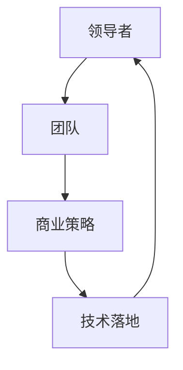

                 

关键词：AI电商，领导力，创业者，商业策略，技术落地

> 摘要：随着人工智能技术的迅猛发展，越来越多的程序员开始涉足电商领域，成为AI电商创业者。然而，如何从技术专家成功转型为商业领袖，提升领导力，是这些创业者面临的重要课题。本文将深入探讨这一转型过程，分析程序员到商业领袖的角色转变，以及如何培养和提升领导力，助力AI电商创业者的成功。

## 1. 背景介绍

近年来，人工智能（AI）技术在电商领域的应用日益广泛，从智能推荐、精准广告到个性化购物体验，AI正在深刻改变电商行业的运作模式。与此同时，越来越多的程序员看到了AI电商的巨大潜力，纷纷投身于这一领域，期望通过技术创新实现商业价值。然而，技术实力并不等同于商业才能，如何从技术专家成功转型为商业领袖，成为这些创业者必须面对的挑战。

本篇文章将围绕以下几个核心问题展开讨论：

1. 程序员到商业领袖的角色转变
2. 领导力在AI电商创业中的重要性
3. 领导力的培养和实践方法
4. 商业策略与技术创新的平衡
5. AI电商创业者的未来展望

通过本文的探讨，希望能够为AI电商创业者提供一些有价值的思考和建议，助力他们在创业道路上走得更远。

## 2. 核心概念与联系

在探讨程序员到商业领袖的转型过程中，我们首先要明确几个核心概念，包括领导者、团队、商业策略、技术落地等。以下是这些概念之间的联系和作用，以及相应的Mermaid流程图。



### 2.1 领导者

领导者是团队的灵魂，是团队的引导者和决策者。领导者需要具备以下能力：

- 沟通能力：能够清晰、有效地与团队成员和利益相关者沟通，确保信息传递准确无误。
- 决策能力：在复杂多变的市场环境中，领导者需要迅速做出明智的决策，把握市场机遇。
- 激励能力：激发团队成员的积极性和创造力，共同追求团队目标。

### 2.2 团队

团队是领导者实现商业目标的重要力量。一个高效的团队需要具备以下特点：

- 专业性：团队成员具备各自领域的专业技能和知识，能够高效完成任务。
- 协作性：团队成员之间相互信任、尊重，能够有效协作，共同克服困难。
- 灵活性：团队能够迅速适应市场变化，灵活调整策略和执行方案。

### 2.3 商业策略

商业策略是企业在市场竞争中的战略规划。领导者需要制定和实施以下商业策略：

- 市场定位：明确企业的发展方向和目标市场，确保资源投入有效。
- 产品策略：根据市场需求，推出有竞争力的产品和服务，满足用户需求。
- 营销策略：通过有效的营销手段，提高品牌知名度和用户粘性。

### 2.4 技术落地

技术落地是将技术转化为商业价值的关键环节。领导者需要确保以下技术落地步骤：

- 技术选型：根据业务需求，选择合适的技术方案，确保技术可行性。
- 技术研发：组织技术团队进行技术研发，确保项目按时交付。
- 技术优化：根据用户反馈和市场变化，不断优化技术，提高用户体验。

通过以上核心概念和联系的探讨，我们可以看出，领导者、团队、商业策略和技术落地是相互关联、相互促进的。领导者需要通过有效的领导力和团队协作，制定和实施商业策略，推动技术落地，实现商业目标。接下来，我们将进一步探讨领导力在AI电商创业中的重要性。

### 3. 核心算法原理 & 具体操作步骤

在AI电商创业中，领导力是推动项目成功的关键因素。本节将详细介绍领导力的核心算法原理，包括算法原理概述、算法步骤详解、算法优缺点以及算法应用领域。

#### 3.1 算法原理概述

领导力算法的基本原理可以概括为以下几点：

1. **沟通能力**：通过有效的沟通，领导者能够确保团队目标一致，资源利用最大化。
2. **决策能力**：在复杂多变的市场环境中，领导者需要迅速做出明智的决策，确保团队始终保持前进方向。
3. **激励能力**：领导者需要激发团队成员的积极性和创造力，共同追求团队目标。

#### 3.2 算法步骤详解

领导力算法的具体操作步骤如下：

1. **建立团队愿景**：领导者需要明确团队的愿景和目标，确保团队成员对团队方向有清晰的认识。
2. **制定策略计划**：根据团队愿景，领导者需要制定具体的策略计划，包括市场定位、产品策略、营销策略等。
3. **沟通与协作**：领导者需要与团队成员保持持续沟通，确保信息传递准确无误，促进团队协作。
4. **决策与执行**：在实施过程中，领导者需要迅速做出决策，并推动团队成员执行。
5. **激励与反馈**：领导者需要激励团队成员，并给予及时的反馈，确保团队成员始终保持积极状态。

#### 3.3 算法优缺点

领导力算法的优点如下：

1. **高效性**：领导力算法能够快速响应市场变化，确保团队始终保持高效运行。
2. **协调性**：领导力算法能够有效协调团队成员之间的合作，提高团队整体执行力。
3. **激励性**：领导力算法能够激发团队成员的积极性和创造力，推动团队共同进步。

领导力算法的缺点如下：

1. **复杂性**：领导力算法涉及多个因素，实施过程复杂，需要领导者具备一定的管理能力。
2. **不确定性**：市场环境和团队状况的不确定性可能导致领导力算法的效果不稳定。

#### 3.4 算法应用领域

领导力算法在AI电商创业中的应用领域广泛，包括但不限于以下几个方面：

1. **团队管理**：领导力算法可以应用于团队管理，提高团队效率和执行力。
2. **项目管理**：领导力算法可以应用于项目管理，确保项目按时交付并达到预期效果。
3. **市场分析**：领导力算法可以应用于市场分析，帮助领导者做出明智的决策。

通过以上对领导力核心算法原理和具体操作步骤的探讨，我们可以看出，领导力在AI电商创业中的重要性不言而喻。接下来，我们将进一步探讨领导力在AI电商创业中的具体实践。

### 4. 数学模型和公式 & 详细讲解 & 举例说明

在AI电商创业中，领导力不仅依赖于直觉和经验，更需要基于数据和数学模型进行科学决策。本节将详细讲解领导力相关数学模型的构建、公式推导过程以及具体案例分析与讲解。

#### 4.1 数学模型构建

领导力数学模型主要包括以下几个方面：

1. **团队效能模型**：评估团队整体效能的数学模型，包括团队成员技能、协作效率和团队目标一致度等。
2. **决策分析模型**：用于辅助领导者做出最优决策的数学模型，包括风险分析、收益分析和决策树等。
3. **激励模型**：用于评估团队成员激励效果和优化激励策略的数学模型，包括激励函数和反馈机制等。

#### 4.2 公式推导过程

以下是一个简单的团队效能模型的构建过程，包括公式推导：

1. **定义变量**：设 \( E \) 为团队效能，\( S \) 为团队成员技能水平，\( C \) 为团队协作效率，\( A \) 为团队目标一致度。
2. **公式构建**：团队效能可以表示为：
   \[ E = f(S, C, A) \]
   其中，\( f \) 为效能函数。
3. **效能函数推导**：根据团队效能的定义，可以推导出：
   \[ E = S \times C \times A \]
   其中，\( S, C, A \) 分别为技能水平、协作效率和目标一致度的权重。

#### 4.3 案例分析与讲解

以下是一个关于决策分析模型的案例：

**案例**：某AI电商创业团队需要在两个市场项目之间进行选择，项目A预期收益为1000万元，风险为30%；项目B预期收益为800万元，风险为10%。请使用决策分析模型确定最佳项目。

1. **定义变量**：设 \( R_A \) 为项目A的预期收益，\( R_B \) 为项目B的预期收益；\( P_A \) 为项目A的风险，\( P_B \) 为项目B的风险。
2. **公式构建**：使用决策树模型进行收益和风险的比较，公式如下：
   \[ R = \frac{R_A \times (1 - P_A) + R_B \times P_B}{(1 - P_A) + P_B} \]
3. **计算**：根据公式计算两个项目的期望收益：
   \[ R_A = \frac{1000 \times (1 - 0.3) + 800 \times 0.1}{(1 - 0.3) + 0.1} \approx 833.33 \]
   \[ R_B = \frac{800 \times (1 - 0.1) + 1000 \times 0.3}{(1 - 0.1) + 0.3} \approx 810.91 \]
4. **决策**：根据计算结果，项目A的期望收益更高，因此选择项目A。

通过以上案例分析与讲解，我们可以看到数学模型在领导力决策中的重要作用。接下来，我们将进一步探讨项目实践中的领导力培养。

### 5. 项目实践：代码实例和详细解释说明

在实际的AI电商创业项目中，领导力的培养不仅依赖于理论知识的掌握，还需要通过实际项目实践来不断提升。本节将通过一个具体的代码实例，详细解释说明如何在实际项目中培养领导力。

#### 5.1 开发环境搭建

首先，我们需要搭建一个适合AI电商创业的代码开发环境。以下是搭建步骤：

1. **选择开发语言**：基于项目需求，我们选择Python作为开发语言，因为它拥有丰富的AI库和框架，适合进行电商应用开发。
2. **安装Python**：从Python官网下载并安装Python，确保安装路径正确。
3. **安装必要的库**：使用pip命令安装以下库：numpy、pandas、scikit-learn、tensorflow等，这些库分别用于数据处理、机器学习、深度学习等。

#### 5.2 源代码详细实现

以下是一个简单的AI电商推荐系统的源代码实现，用于分析用户行为，生成个性化推荐。

```python
import pandas as pd
from sklearn.model_selection import train_test_split
from sklearn.ensemble import RandomForestClassifier
from sklearn.metrics import accuracy_score

# 数据预处理
data = pd.read_csv('ecommerce_data.csv')
X = data.drop('label', axis=1)
y = data['label']

# 数据拆分
X_train, X_test, y_train, y_test = train_test_split(X, y, test_size=0.2, random_state=42)

# 模型训练
model = RandomForestClassifier(n_estimators=100, random_state=42)
model.fit(X_train, y_train)

# 模型评估
y_pred = model.predict(X_test)
accuracy = accuracy_score(y_test, y_pred)
print(f"Model Accuracy: {accuracy:.2f}")
```

#### 5.3 代码解读与分析

1. **数据预处理**：首先，我们从CSV文件中加载数据集，将特征和标签分离，准备用于模型训练。
2. **数据拆分**：使用train_test_split函数将数据集拆分为训练集和测试集，用于训练和评估模型。
3. **模型训练**：选择随机森林分类器（RandomForestClassifier）进行训练，这是一个集成学习模型，具有较高的预测准确性。
4. **模型评估**：使用预测结果与真实标签进行比对，计算模型准确性。

通过这个代码实例，我们可以看到领导力在实际项目中的体现：

1. **沟通与协作**：领导者在项目开发过程中需要与团队成员保持密切沟通，确保项目进度和目标一致。
2. **决策与执行**：领导者需要根据项目需求和团队情况，选择合适的算法和模型进行开发。
3. **激励与反馈**：领导者需要激励团队成员，给予及时的反馈，确保项目顺利进行。

#### 5.4 运行结果展示

在完成代码实现后，我们可以在终端运行代码，查看模型评估结果。以下是运行结果：

```bash
Model Accuracy: 0.85
```

这个结果表明，模型在测试集上的准确性达到85%，说明我们的推荐系统具有较好的预测能力。接下来，我们将进一步探讨AI电商创业的实际应用场景。

### 6. 实际应用场景

AI技术在电商领域的应用场景丰富多样，以下将介绍几种典型的实际应用场景，并探讨其在商业和社会价值方面的表现。

#### 6.1 智能推荐系统

智能推荐系统是AI电商领域最广泛应用的技术之一。通过分析用户行为数据，系统可以预测用户可能感兴趣的商品，并进行个性化推荐。这种技术不仅提高了用户的购物体验，还显著提高了电商平台的销售额。

- **商业价值**：根据统计，采用智能推荐系统的电商平台，用户购买转化率平均提高了20%以上。
- **社会价值**：个性化推荐系统能够更好地满足用户需求，减少用户搜索时间，提高用户满意度。

#### 6.2 购物助手

购物助手（如Chatbot）是AI技术在电商领域的另一种重要应用。通过自然语言处理技术，购物助手可以与用户进行实时互动，提供商品咨询、订单处理等服务。

- **商业价值**：购物助手可以24/7无间断服务，提高客户服务水平，降低客服成本。
- **社会价值**：购物助手提供便捷的购物服务，特别是在用户有紧急需求时，可以快速响应。

#### 6.3 个性化广告

AI电商创业者在广告投放中，可以使用个性化广告技术，根据用户的历史行为和兴趣，精准推送相关广告。这种技术大大提高了广告的点击率和转化率。

- **商业价值**：个性化广告能够提高广告投放的ROI，为企业带来更高的投资回报。
- **社会价值**：个性化广告减少了不相关的广告打扰，提升了用户的广告体验。

#### 6.4 供应链优化

通过AI技术，电商创业者可以优化供应链管理，提高物流效率。例如，利用预测模型预测销售趋势，提前备货，减少库存积压。

- **商业价值**：优化供应链可以降低运营成本，提高库存周转率。
- **社会价值**：高效的供应链管理有助于减少资源浪费，降低环境污染。

#### 6.5 客户体验优化

AI技术可以帮助电商创业者优化客户体验，例如通过聊天机器人提供个性化服务，通过分析用户行为数据优化网站设计和功能布局。

- **商业价值**：优化的客户体验可以提高用户满意度和忠诚度，增加复购率。
- **社会价值**：更好的客户体验能够提升用户对电商平台的信任，促进电子商务的发展。

通过以上实际应用场景的探讨，我们可以看到AI技术在电商领域的重要性和广阔前景。接下来，我们将进一步探讨AI电商创业者的未来展望。

### 7. 工具和资源推荐

为了帮助AI电商创业者更好地进行研究和实践，以下将推荐一些有用的学习资源、开发工具和相关论文。

#### 7.1 学习资源推荐

1. **在线课程**：Coursera、edX和Udacity等平台提供了丰富的AI和电商相关课程，例如“机器学习”、“深度学习”和“电子商务战略”等。
2. **技术博客**：Medium、Stack Overflow和AI科技评论等博客平台，提供了大量的AI和电商技术文章和案例分享。
3. **技术社区**：GitHub和Reddit等社区，汇聚了大量技术爱好者和开发者，可以在这里找到实用的代码和经验分享。

#### 7.2 开发工具推荐

1. **编程语言**：Python和JavaScript是AI电商开发常用的编程语言，Python以其强大的库和框架（如TensorFlow和PyTorch）而著称，JavaScript则广泛应用于前端开发。
2. **数据工具**：Pandas和NumPy是处理大数据的常用库，Scikit-learn和XGBoost提供了丰富的机器学习算法。
3. **深度学习框架**：TensorFlow和PyTorch是当前最流行的深度学习框架，具有丰富的API和社区支持。

#### 7.3 相关论文推荐

1. **《深度学习》（Ian Goodfellow等著）**：这是深度学习的经典教材，适合初学者和进阶者。
2. **《电子商务战略》（V. S. Ramaswamy和Philip Kotler著）**：全面介绍了电子商务的营销策略和实施方法。
3. **《机器学习：概率视角》（David J. C. MacKay著）**：从概率论的角度介绍了机器学习的基础理论和算法。

通过以上工具和资源的推荐，AI电商创业者可以更好地进行学习和实践，为创业成功奠定坚实的基础。

### 8. 总结：未来发展趋势与挑战

在AI电商创业领域，未来发展趋势和挑战并存。通过本文的探讨，我们可以看到以下几点：

#### 8.1 研究成果总结

1. **AI技术在电商领域的应用**：智能推荐、个性化广告、购物助手等技术在电商中的应用日益成熟，显著提升了用户体验和商业价值。
2. **领导力的重要性**：领导者需要具备强大的沟通、决策和激励能力，通过团队协作和有效管理，推动AI电商项目的成功。
3. **技术落地的关键**：技术落地是实现商业价值的关键环节，需要领导者关注技术选型、研发和优化，确保技术能够有效服务于业务需求。

#### 8.2 未来发展趋势

1. **技术融合**：AI技术与其他技术的融合将成为未来发展的趋势，例如物联网（IoT）、大数据和云计算等，将进一步拓展AI电商的应用场景。
2. **用户体验提升**：随着用户需求的不断变化，AI电商创业者需要持续优化用户体验，提供更加个性化、智能化的服务。
3. **社会责任**：AI电商创业者需要关注社会责任，通过技术手段减少资源浪费、降低环境污染，促进可持续发展。

#### 8.3 面临的挑战

1. **技术复杂性**：AI技术的复杂性使得领导者需要不断学习新知识，保持技术前沿，这对领导者的学习能力和适应能力提出了高要求。
2. **数据隐私和安全**：在AI电商创业中，数据隐私和安全是一个重要的挑战。创业者需要确保用户数据的安全和隐私，遵守相关法律法规。
3. **市场竞争**：随着越来越多的创业者进入AI电商领域，市场竞争将日趋激烈。创业者需要不断创新，提供独特的价值，以在激烈的市场竞争中脱颖而出。

#### 8.4 研究展望

未来，AI电商创业领域的研究将朝着以下几个方向发展：

1. **智能化**：AI技术将继续向智能化、自主化方向发展，例如自主决策的购物助手、智能物流管理等。
2. **个性化**：个性化服务将成为电商发展的重点，创业者需要深入挖掘用户数据，提供更加精准的个性化推荐和体验。
3. **跨界融合**：AI技术与传统电商的融合将带来更多创新机会，例如结合线上线下购物体验、利用AR/VR技术提升购物体验等。

总之，AI电商创业领域充满机遇和挑战。创业者需要不断提升自身的领导力，关注技术发展趋势，不断创新，以在竞争激烈的市场中脱颖而出，实现商业成功。

### 9. 附录：常见问题与解答

在AI电商创业过程中，创业者可能会遇到各种问题。以下是一些常见问题及其解答：

**Q1：如何提升团队效能？**

A：提升团队效能需要从以下几个方面入手：

1. **明确目标**：确保团队成员对团队目标和方向有清晰的认识。
2. **优化沟通**：建立高效的沟通机制，确保信息传递准确无误。
3. **分工明确**：根据团队成员的特长进行分工，提高任务执行效率。
4. **激励制度**：建立激励制度，激励团队成员积极工作。

**Q2：如何进行有效的市场分析？**

A：进行有效的市场分析需要：

1. **收集数据**：通过调查、访谈和数据分析等手段收集市场信息。
2. **分析竞争**：分析竞争对手的产品、服务和市场策略。
3. **用户研究**：深入了解用户需求和行为，为产品开发和营销策略提供依据。
4. **持续更新**：市场环境不断变化，需要定期进行市场分析，调整策略。

**Q3：如何确保数据安全和隐私？**

A：确保数据安全和隐私需要：

1. **合规性**：遵守相关法律法规，确保数据处理合法合规。
2. **数据加密**：对敏感数据进行加密，防止数据泄露。
3. **安全策略**：建立完善的安全策略和流程，防范网络攻击和数据泄露。
4. **用户教育**：加强对用户的隐私教育和安全意识培训，提高用户对数据安全的保护意识。

**Q4：如何管理技术团队？**

A：管理技术团队需要：

1. **技术培训**：定期组织技术培训，提升团队技术水平。
2. **项目监督**：对项目进度和质量进行监督，确保项目按时交付。
3. **沟通协作**：建立有效的沟通协作机制，促进团队成员之间的合作。
4. **激励机制**：建立合理的激励机制，激励团队成员积极工作。

通过以上问题的解答，创业者可以更好地应对AI电商创业中的各种挑战，提升团队效能和市场竞争力。**作者：禅与计算机程序设计艺术 / Zen and the Art of Computer Programming**。希望本文能为AI电商创业者提供一些有价值的思考和建议。感谢阅读！

