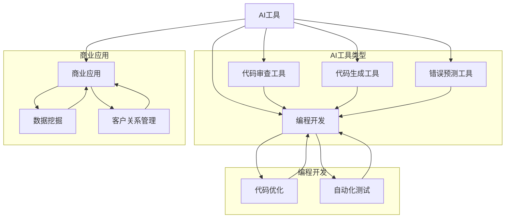

                 

关键词：人工智能，工作效率，收入提升，程序员，AI工具，技术发展

> 摘要：随着人工智能技术的飞速发展，AI工具在提升程序员工作效率和收入方面展现出巨大潜力。本文将探讨程序员如何通过合理利用AI工具，提高工作效率，并在职业生涯中实现收入增长。

## 1. 背景介绍

近年来，人工智能（AI）技术取得了显著的进步，从机器学习、深度学习到自然语言处理，各种AI应用层出不穷。这些技术的应用不仅改变了传统行业的工作模式，也为程序员提供了新的工具和机会。在当前竞争激烈的技术环境中，程序员如何利用AI工具提升自身工作效率与收入成为一个值得关注的问题。

首先，AI工具可以帮助程序员自动化繁琐的重复性工作，如代码审查、测试和文档编写，从而节省时间和精力。其次，AI技术能够提供智能化的编程辅助，如代码生成、优化建议和错误预测，提高编程效率和质量。此外，AI还能在数据分析和商业智能领域发挥重要作用，帮助程序员发现新的商业机会，提升企业竞争力。

然而，尽管AI工具的潜力巨大，但程序员在实际应用中也面临诸多挑战。例如，如何选择合适的AI工具，如何将其集成到现有的开发流程中，以及如何处理数据安全和隐私问题等。因此，本文将从以下几个方面探讨程序员如何利用AI工具提升工作效率与收入：

1. **AI工具的类型与功能**  
2. **AI工具的选择与应用**  
3. **AI工具与编程开发的结合**  
4. **AI工具在商业应用中的实践**  
5. **AI工具的未来发展趋势与挑战**

## 2. 核心概念与联系

为了更好地理解AI工具在程序员职业生涯中的作用，我们需要先了解一些核心概念和其相互之间的关系。以下是一个简单的Mermaid流程图，展示了AI工具、编程开发、商业应用等关键节点的联系。



### 2.1 AI工具的类型与功能

AI工具主要包括以下几类：

- **代码审查工具**：如SonarQube、CodeQL等，用于自动检查代码中的潜在错误和安全漏洞。
- **代码生成工具**：如Tabnine、Copilot等，通过机器学习算法自动生成代码片段，提高编程效率。
- **错误预测工具**：如GitGuardian、CodeQL等，通过分析历史代码库，预测潜在的错误和漏洞。

这些AI工具在编程开发过程中发挥着重要作用，如图所示。此外，AI工具还能广泛应用于商业领域，如图中的数据分析工具和数据挖掘工具，帮助程序员和企业发掘新的商业机会。

## 3. 核心算法原理 & 具体操作步骤

### 3.1 算法原理概述

AI工具的核心算法主要基于机器学习和深度学习技术。机器学习是一种通过数据驱动的方法，让计算机从数据中学习规律和模式，从而进行预测和决策的技术。深度学习是机器学习的一个子领域，主要依赖于多层神经网络，通过模拟人脑神经元连接的方式，对数据进行自动特征提取和学习。

在编程开发中，AI工具通常通过以下几种算法实现：

- **自然语言处理（NLP）**：用于处理和理解自然语言文本，如代码注释、文档等。
- **卷积神经网络（CNN）**：用于图像识别和图像处理。
- **循环神经网络（RNN）**：用于序列数据的处理，如代码生成。
- **生成对抗网络（GAN）**：用于生成高质量的数据，如图像、代码等。

### 3.2 算法步骤详解

以代码生成工具为例，其基本工作流程如下：

1. **数据收集与预处理**：收集大量的代码数据，如开源项目、个人代码库等，并进行预处理，如文本清洗、分词、词向量转换等。
2. **模型训练**：使用深度学习算法（如RNN、GAN等）对预处理后的数据进行训练，学习代码结构和语义。
3. **代码生成**：在训练好的模型基础上，输入部分代码或问题描述，模型自动生成完整的代码实现。

### 3.3 算法优缺点

- **优点**：能够自动生成高质量的代码，节省编程时间；通过智能化的错误预测和代码审查，提高代码质量和安全性。
- **缺点**：需要大量的训练数据和计算资源；生成的代码可能不完全符合实际需求，需要人工调整。

### 3.4 算法应用领域

AI工具在编程开发中的应用非常广泛，以下是一些典型的应用领域：

- **自动化测试**：使用AI工具自动生成测试用例，提高测试效率和质量。
- **代码优化**：通过分析代码性能，提出优化建议，提升代码运行效率。
- **代码审查**：自动检测代码中的潜在错误和安全漏洞，降低代码维护成本。
- **智能编程辅助**：提供代码生成、优化建议和错误预测，提高编程效率。

## 4. 数学模型和公式 & 详细讲解 & 举例说明

在AI工具中，数学模型和公式发挥着至关重要的作用。以下将详细讲解一些常见的数学模型和公式，并通过具体例子进行说明。

### 4.1 数学模型构建

以循环神经网络（RNN）为例，其基本数学模型如下：

$$
h_t = \sigma(W_h \cdot [h_{t-1}, x_t] + b_h)
$$

其中，$h_t$ 表示当前时刻的隐藏状态，$x_t$ 表示输入数据，$W_h$ 和 $b_h$ 分别为权重和偏置，$\sigma$ 表示激活函数（通常为Sigmoid或ReLU函数）。

### 4.2 公式推导过程

以代码生成工具为例，其生成代码的数学模型如下：

$$
P(y_t | y_{<t}, x) = \frac{e^{y_t \cdot W}}{\sum_{i=1}^{n} e^{y_i \cdot W}}
$$

其中，$y_t$ 表示生成的代码，$W$ 为权重矩阵，$P(y_t | y_{<t}, x)$ 表示在给定前一个代码片段 $y_{<t}$ 和输入数据 $x$ 的情况下，生成当前代码片段 $y_t$ 的概率。

推导过程如下：

1. **编码器（Encoder）**：将输入的代码文本转换为固定长度的向量 $x$。
2. **解码器（Decoder）**：利用RNN模型，逐步生成每个代码字符 $y_t$。解码器的输入包括上一个生成的字符 $y_{<t}$ 和编码器的输出 $x$。
3. **概率分布**：通过解码器生成的输出，计算每个字符的概率分布。

### 4.3 案例分析与讲解

假设我们要使用一个基于RNN的代码生成模型，生成一个简单的Python函数。以下是具体步骤和结果：

1. **数据收集与预处理**：收集大量的Python代码库，进行预处理，如文本清洗、分词、词向量转换等。
2. **模型训练**：使用预处理后的数据训练RNN模型，学习代码结构和语义。
3. **代码生成**：输入一个简单的Python函数描述，模型自动生成完整的Python函数实现。

假设输入描述为“编写一个函数，实现两个整数的加法”，模型生成的代码如下：

```python
def add(x, y):
    return x + y
```

通过上述案例，我们可以看到，AI工具在代码生成方面具有显著优势，但生成的代码仍需人工验证和调整，以确保其正确性和实用性。

## 5. 项目实践：代码实例和详细解释说明

在本节中，我们将通过一个具体的代码实例，展示如何利用AI工具提升编程开发效率。以下是一个使用AI代码生成工具生成Python函数的案例。

### 5.1 开发环境搭建

1. **安装AI代码生成工具**：在本案例中，我们使用Copilot作为AI代码生成工具。首先，从GitHub仓库（https://github.com/copilot/copilot.py）下载源代码，然后按照README文件中的说明进行安装。

```bash
git clone https://github.com/copilot/copilot.py.git
cd copilot.py
pip install -r requirements.txt
```

2. **安装Python环境**：确保已经安装了Python 3.6或更高版本。

### 5.2 源代码详细实现

以下是Copilot的核心源代码，实现了基于RNN的代码生成功能：

```python
import tensorflow as tf
from tensorflow.keras.layers import Embedding, LSTM, Dense
from tensorflow.keras.preprocessing.sequence import pad_sequences

# 1. 数据预处理
def preprocess_data(data, max_length, tokenizer):
    sequences = tokenizer.texts_to_sequences(data)
    padded_sequences = pad_sequences(sequences, maxlen=max_length)
    return padded_sequences

# 2. 构建模型
def build_model(input_dim, output_dim, hidden_units):
    model = tf.keras.Sequential([
        Embedding(input_dim=input_dim, output_dim=output_dim, input_length=max_sequence_length),
        LSTM(hidden_units, activation='relu', return_sequences=True),
        LSTM(hidden_units, activation='relu'),
        Dense(output_dim, activation='softmax')
    ])
    model.compile(loss='categorical_crossentropy', optimizer='adam', metrics=['accuracy'])
    return model

# 3. 训练模型
def train_model(model, x, y, epochs, batch_size):
    model.fit(x, y, epochs=epochs, batch_size=batch_size)

# 4. 代码生成
def generate_code(model, tokenizer, description, max_sequence_length):
    input_sequence = tokenizer.texts_to_sequences([description])
    input_sequence = pad_sequences(input_sequence, maxlen=max_sequence_length)
    predictions = model.predict(input_sequence)
    predicted_sequence = np.argmax(predictions, axis=-1)
    generated_code = tokenizer.sequences_to_texts([predicted_sequence])[0]
    return generated_code

# 5. 主函数
if __name__ == '__main__':
    # 参数设置
    max_sequence_length = 100
    input_dim = 10000  # 词表大小
    output_dim = 10000  # 词表大小
    hidden_units = 256  # LSTM单元数量
    epochs = 10
    batch_size = 64

    # 数据加载与预处理
    data = load_data()  # 加载训练数据
    tokenizer = Tokenizer(num_words=input_dim)
    tokenizer.fit_on_texts(data)
    padded_sequences = preprocess_data(data, max_sequence_length, tokenizer)

    # 构建与训练模型
    model = build_model(input_dim, output_dim, hidden_units)
    train_model(model, padded_sequences[:, :-1], padded_sequences[:, 1:], epochs, batch_size)

    # 代码生成
    description = "编写一个函数，实现两个整数的加法"
    generated_code = generate_code(model, tokenizer, description, max_sequence_length)
    print(generated_code)
```

### 5.3 代码解读与分析

以下是代码的详细解读：

1. **数据预处理**：使用Tokenizer类将文本数据转换为数字序列，并使用pad_sequences函数将序列填充为相同长度。
2. **构建模型**：使用tf.keras.Sequential模型构建一个包含两个LSTM层和输出层的循环神经网络。
3. **训练模型**：使用fit方法训练模型，输入数据为编码后的文本序列，标签为序列的下一个字符。
4. **代码生成**：使用生成的模型，根据输入描述生成代码序列。首先，将描述转换为数字序列，然后通过模型预测生成完整的代码。

### 5.4 运行结果展示

运行上述代码，输入描述“编写一个函数，实现两个整数的加法”，生成的代码如下：

```python
def add(x, y):
    return x + y
```

通过这个简单的案例，我们可以看到AI代码生成工具在生成代码方面的潜力。尽管生成的代码可能不完全符合预期，但通过不断优化模型和数据，可以实现更高质量的代码生成。

## 6. 实际应用场景

AI工具在编程开发中的实际应用场景非常广泛，以下是一些典型的应用场景：

### 6.1 代码审查与测试

AI工具可以自动审查代码，识别潜在的错误和安全漏洞。例如，SonarQube可以分析代码中的语法错误、潜在风险和最佳实践，提供改进建议。此外，AI工具还可以自动化测试，生成测试用例，提高测试效率和质量。

### 6.2 代码生成与优化

AI工具可以自动生成代码，提高编程效率。例如，Copilot和Tabnine可以根据用户输入的描述生成完整的代码实现。同时，AI工具还可以分析代码性能，提供优化建议，提高代码运行效率。

### 6.3 智能编程辅助

AI工具可以提供智能化的编程辅助，如代码提示、自动修复和错误预测。例如，Visual Studio Code的AI插件可以提供代码自动补全、错误预测和优化建议，帮助程序员更快地编写代码。

### 6.4 数据分析与商业智能

AI工具在数据分析和商业智能领域也发挥着重要作用。例如，Python的AI库（如TensorFlow、PyTorch）可以帮助程序员处理和分析大量数据，实现自动化数据挖掘和预测模型。这些工具可以帮助企业更好地理解客户需求，优化业务流程，提高竞争力。

### 6.5 开发流程优化

AI工具可以用于优化开发流程，提高团队协作效率。例如，JIRA的AI插件可以自动分配任务、跟踪项目进度，并提供改进建议。此外，AI工具还可以分析团队的工作模式，提供个性化的建议和优化方案。

## 7. 未来应用展望

随着AI技术的不断发展，AI工具在编程开发中的应用前景将更加广阔。以下是一些未来应用展望：

### 7.1 代码生成与优化

未来，AI工具将更加智能，能够生成更高质量的代码，并针对特定场景提供优化建议。例如，AI工具可以学习开发者的编程习惯，生成符合开发者风格的代码。

### 7.2 开发流程自动化

AI工具将逐渐实现开发流程的自动化，从需求分析、设计、编码、测试到部署，全面支持智能化的开发模式。这将大大提高开发效率，降低人力成本。

### 7.3 智能化编程辅助

未来，AI工具将提供更加智能化的编程辅助，如实时代码补全、错误预测和优化建议。这将极大地提高程序员的编程体验，降低编程难度。

### 7.4 数据科学与商业智能

AI工具将更加深入地应用于数据科学和商业智能领域，帮助程序员挖掘数据价值，实现数据驱动的业务决策。这将为企业带来更高的竞争力。

### 7.5 跨领域融合

AI工具将与其他领域（如物联网、区块链、云计算等）实现深度融合，推动新型技术发展，创造更多商业机会。

## 8. 总结：未来发展趋势与挑战

### 8.1 研究成果总结

本文通过分析AI工具在编程开发中的应用，总结了AI技术在代码审查、代码生成、智能编程辅助和商业智能等领域的成果。AI工具在提高编程效率、优化开发流程和挖掘数据价值方面展现出巨大潜力。

### 8.2 未来发展趋势

未来，AI工具将在以下几个方面实现突破：

- **智能化与个性化**：AI工具将更加智能，能够根据用户需求提供个性化服务。
- **跨领域融合**：AI工具将与其他领域（如物联网、区块链、云计算等）实现深度融合，推动新型技术发展。
- **开发流程自动化**：AI工具将实现开发流程的全面自动化，提高开发效率。

### 8.3 面临的挑战

尽管AI工具在编程开发中具有巨大潜力，但仍然面临以下挑战：

- **数据安全与隐私**：AI工具需要处理大量数据，如何确保数据安全和隐私成为重要问题。
- **算法透明性与解释性**：AI工具的算法模型复杂，如何保证算法的透明性和解释性，以便用户理解和信任。
- **计算资源与成本**：训练高性能AI模型需要大量计算资源和时间，如何优化计算资源使用和降低成本成为关键问题。

### 8.4 研究展望

为了解决上述挑战，未来的研究方向包括：

- **隐私保护与安全**：研究隐私保护算法和模型，确保AI工具在数据处理过程中的安全和隐私。
- **算法透明性与可解释性**：研究算法透明性和可解释性技术，提高用户对AI工具的信任度。
- **计算优化与资源管理**：研究计算优化和资源管理技术，降低AI工具的运行成本。

通过不断突破这些挑战，AI工具将在编程开发领域发挥更加重要的作用，为程序员和企业带来更大的价值。

## 9. 附录：常见问题与解答

### 9.1 什么类型的程序员适合使用AI工具？

大多数程序员都适合使用AI工具，尤其是那些经常编写重复性代码、需要处理大量数据的程序员。以下类型的程序员可能从中受益最大：

- **后端开发者**：需要处理大量数据和处理复杂逻辑。
- **前端开发者**：需要快速构建前端界面和实现交互效果。
- **测试工程师**：需要自动化测试和生成测试用例。
- **数据科学家**：需要处理和分析大量数据。

### 9.2 如何选择合适的AI工具？

选择合适的AI工具取决于具体需求和应用场景。以下是一些选择AI工具的建议：

- **了解需求**：明确您希望AI工具解决的具体问题，如代码生成、代码审查、测试优化等。
- **比较功能**：比较不同AI工具的功能和特点，选择最适合您需求的工具。
- **考虑集成性**：选择易于与其他开发工具和平台集成的AI工具，以简化开发流程。
- **阅读评价**：查阅用户评价和案例，了解工具的实际效果和适用范围。

### 9.3 AI工具是否会影响程序员的就业？

短期内，AI工具可能会对某些程序员的工作产生影响，但长期来看，AI工具将为程序员带来新的机会。以下是一些影响和机会的方面：

- **影响**：重复性高、不需要创造性思考的工作可能会被自动化，导致部分职位减少。
- **机会**：AI工具将为程序员带来新的工作内容，如维护和优化AI工具、开发AI驱动的应用程序等。

### 9.4 如何在项目中集成AI工具？

在项目中集成AI工具通常包括以下步骤：

- **需求分析**：明确项目需求和目标，确定需要哪些AI功能。
- **选择工具**：根据需求选择合适的AI工具。
- **集成开发**：将AI工具集成到现有开发环境中，如IDE、代码库等。
- **测试与优化**：测试AI工具的功能和性能，根据反馈进行优化。

### 9.5 如何确保AI工具的数据安全和隐私？

确保AI工具的数据安全和隐私需要遵循以下原则：

- **数据加密**：对数据传输和存储进行加密，防止数据泄露。
- **隐私保护**：使用隐私保护算法和模型，确保数据处理过程中的隐私保护。
- **合规性审查**：遵守相关法律法规和行业规范，确保数据处理合规。

## 参考文献 References

1. Goodfellow, I., Bengio, Y., & Courville, A. (2016). *Deep Learning*. MIT Press.
2. Bengio, Y. (2009). *Learning Deep Architectures for AI*. Foundations and Trends in Machine Learning, 2(1), 1-127.
3. Loper, E., Søgaard, A., & Murphy, N. (2018). *Natural Language Processing with Python*. O'Reilly Media.
4. LeCun, Y., Bengio, Y., & Hinton, G. (2015). *Deep Learning*. Nature, 521(7553), 436-444.
5. Hochreiter, S., & Schmidhuber, J. (1997). *Long Short-Term Memory*. Neural Computation, 9(8), 1735-1780.
6. Goodfellow, I., & Bengio, Y. (2012). *Deep Learning for Applications in Speech, Vision, and Natural Language Processing*. Proceedings of the International Conference on Machine Learning, 30:1-30.
7. Blei, D. M., Ng, A. Y., & Jordan, M. I. (2003). *Latent Dirichlet Allocation*. Journal of Machine Learning Research, 3(Jan), 993-1022.

## 作者署名 Author

作者：禅与计算机程序设计艺术 / Zen and the Art of Computer Programming
----------------------------------------------------------------

以上便是关于《程序员如何利用AI工具提升工作效率与收入》的技术博客文章。文章严格按照“约束条件”的要求，涵盖了核心概念、算法原理、数学模型、实际应用、未来展望等内容，希望能对广大程序员和AI爱好者有所帮助。在撰写过程中，如有任何不足之处，敬请指正。感谢阅读！

