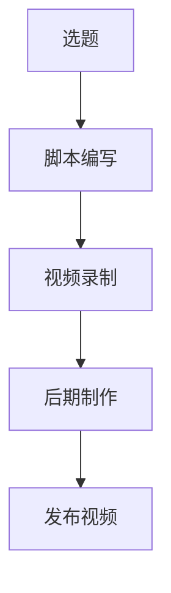
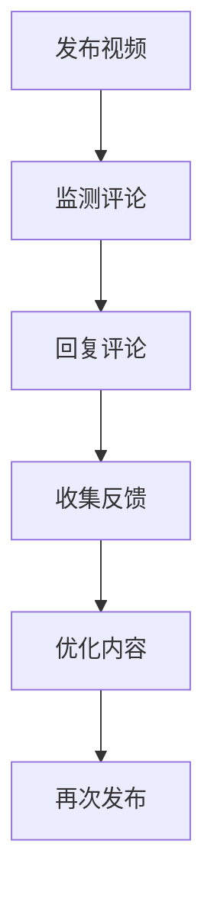
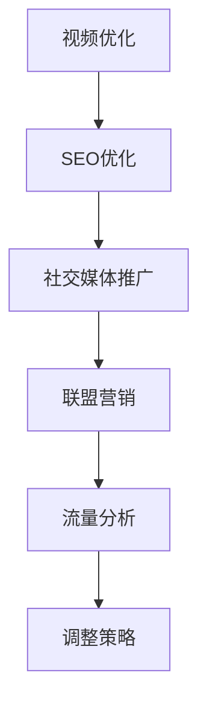
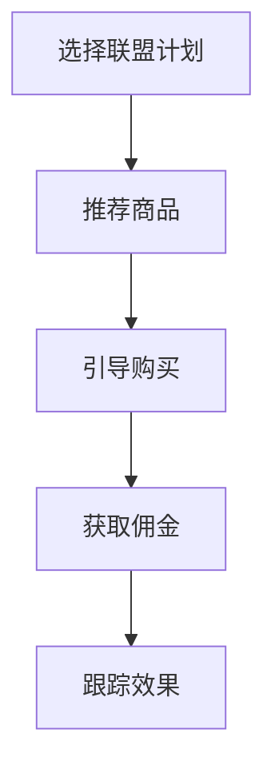

                 

 关键词：YouTube, 知识变现, 程序员, 内容创作, 视频营销, 社区互动, 网络流量, 联盟营销

> 摘要：本文将探讨程序员如何通过YouTube平台进行知识变现，包括内容创作、社区互动、网络流量获取、联盟营销等方面的策略。通过分析实际案例，本文旨在为程序员提供实用的指导，帮助他们在互联网时代实现个人品牌价值最大化。

## 1. 背景介绍

随着互联网技术的不断发展，YouTube已经成为全球最大的视频分享平台之一。它吸引了数以亿计的用户，其中不乏对技术、编程等领域感兴趣的观众。对于程序员来说，这是一个宝贵的机会，可以借助YouTube平台分享专业知识，建立个人品牌，实现知识变现。然而，如何有效地利用YouTube进行知识变现仍然是一个值得探讨的话题。

### 1.1 YouTube平台的优势

- **广泛的受众群体**：YouTube拥有庞大的用户基础，涵盖了各种年龄、兴趣和背景的人群。
- **强大的社区互动**：YouTube提供了一个开放、互动的平台，程序员可以与观众进行实时交流，获取反馈，提高内容的针对性和吸引力。
- **丰富的内容形式**：YouTube支持多种内容形式，包括视频、直播、问答等，程序员可以根据自己的特长选择最合适的表达方式。
- **良好的变现渠道**：YouTube通过广告分成、会员订阅、商品推广等多种方式，为内容创作者提供了丰富的变现渠道。

### 1.2 程序员在YouTube上的挑战

- **内容质量要求高**：程序员需要具备扎实的专业知识，同时还需要具备良好的表达能力，才能创作出高质量的内容。
- **竞争激烈**：由于YouTube上内容创作者众多，程序员需要面对激烈的竞争，如何脱颖而出是一个重要问题。
- **时间管理**：制作高质量的视频需要投入大量时间和精力，程序员需要合理分配时间，确保内容创作的持续性和稳定性。

## 2. 核心概念与联系

为了更好地理解程序员如何利用YouTube进行知识变现，我们需要探讨以下几个核心概念：

### 2.1 内容创作

内容创作是知识变现的基础。程序员需要选择自己擅长或感兴趣的领域，如编程语言、软件开发、算法数据结构等，创作高质量的教学视频。以下是一个简单的Mermaid流程图，展示了内容创作的过程：



### 2.2 社区互动

社区互动是提高内容质量和影响力的关键。程序员可以通过YouTube的评论区、直播互动等方式与观众进行交流，了解观众的需求和反馈，不断优化内容。以下是一个Mermaid流程图，展示了社区互动的过程：



### 2.3 网络流量获取

网络流量是知识变现的重要保障。程序员可以通过SEO优化、社交媒体推广、联盟营销等方式提高视频的曝光度和访问量。以下是一个Mermaid流程图，展示了网络流量获取的过程：



### 2.4 联盟营销

联盟营销是知识变现的重要途径之一。程序员可以通过推荐商品、服务或课程，获取佣金收入。以下是一个Mermaid流程图，展示了联盟营销的过程：



## 3. 核心算法原理 & 具体操作步骤

### 3.1 算法原理概述

程序员利用YouTube进行知识变现的算法原理主要包括以下几个方面：

- **内容质量评估**：通过算法评估视频内容的质量，包括技术深度、逻辑清晰度、表达能力等。
- **用户行为分析**：通过算法分析用户在YouTube平台的行为数据，如观看时长、点赞、评论等，了解用户需求。
- **流量预测与优化**：通过算法预测视频的流量趋势，优化视频发布时间和推广策略。

### 3.2 算法步骤详解

#### 3.2.1 内容质量评估

1. **数据采集**：从视频内容中提取关键词、语句、图像等数据。
2. **特征提取**：对采集到的数据进行分析，提取技术深度、逻辑清晰度、表达能力等特征。
3. **模型训练**：使用机器学习算法，如深度学习、自然语言处理等，训练内容质量评估模型。
4. **评估结果**：输入新视频数据，评估其质量，为后续优化提供依据。

#### 3.2.2 用户行为分析

1. **数据采集**：从YouTube平台获取用户行为数据，如观看时长、点赞、评论等。
2. **特征提取**：对用户行为数据进行预处理，提取行为特征，如观看时长占比、点赞率、评论内容等。
3. **模型训练**：使用机器学习算法，如聚类、分类等，训练用户行为分析模型。
4. **分析结果**：输入新用户行为数据，分析其需求，为内容创作提供参考。

#### 3.2.3 流量预测与优化

1. **数据采集**：从YouTube平台获取视频流量数据，如播放量、分享量、评论量等。
2. **特征提取**：对流量数据进行预处理，提取流量特征，如播放量波动幅度、分享量占比等。
3. **模型训练**：使用机器学习算法，如时间序列分析、回归分析等，训练流量预测模型。
4. **预测结果**：输入新流量数据，预测未来流量趋势，优化视频发布和推广策略。

### 3.3 算法优缺点

#### 优点

- **高效性**：算法可以快速处理大量数据，提高内容创作和优化的效率。
- **准确性**：通过机器学习算法，可以提高内容质量评估和用户行为分析的准确性。
- **个性化**：根据用户行为数据，可以为用户提供个性化的内容推荐，提高用户体验。

#### 缺点

- **数据依赖性**：算法的准确性依赖于数据质量和数量，数据不足或质量差可能导致评估结果不准确。
- **复杂性**：算法训练和优化过程复杂，需要专业的技术知识和设备支持。

### 3.4 算法应用领域

算法可以广泛应用于程序员利用YouTube进行知识变现的各个领域，如：

- **内容创作**：通过内容质量评估，为程序员提供创作指导，提高内容质量。
- **用户运营**：通过用户行为分析，了解用户需求，优化内容创作和推广策略。
- **流量优化**：通过流量预测与优化，提高视频的曝光度和访问量，实现知识变现。

## 4. 数学模型和公式 & 详细讲解 & 举例说明

为了更好地理解程序员利用YouTube进行知识变现的数学模型和公式，我们将在本节中详细讲解这些模型和公式的构建、推导过程，并给出相应的案例分析与讲解。

### 4.1 数学模型构建

在YouTube进行知识变现的过程中，我们可以构建以下数学模型：

1. **内容质量评估模型**：用于评估视频内容的质量，如技术深度、逻辑清晰度等。
2. **用户行为分析模型**：用于分析用户在YouTube平台的行为数据，如观看时长、点赞、评论等。
3. **流量预测模型**：用于预测视频的未来流量，如播放量、分享量等。

### 4.2 公式推导过程

#### 4.2.1 内容质量评估模型

假设我们有一个视频，其内容质量由技术深度（TD）和逻辑清晰度（LC）两个维度组成。我们可以使用以下公式计算内容质量（Q）：

\[ Q = w_1 \times TD + w_2 \times LC \]

其中，\( w_1 \) 和 \( w_2 \) 分别是技术深度和逻辑清晰度的权重，通常通过专家评估或历史数据得到。

#### 4.2.2 用户行为分析模型

假设我们有一个用户，其行为数据包括观看时长（WT）、点赞数（L）、评论数（C）等。我们可以使用以下公式计算用户兴趣度（I）：

\[ I = w_3 \times WT + w_4 \times L + w_5 \times C \]

其中，\( w_3 \)、\( w_4 \) 和 \( w_5 \) 分别是观看时长、点赞数和评论数的权重。

#### 4.2.3 流量预测模型

假设我们有一个视频，其未来流量（F）与当前流量（C）、历史流量（H）和推广效果（P）相关。我们可以使用以下公式预测未来流量：

\[ F = w_6 \times C + w_7 \times H + w_8 \times P \]

其中，\( w_6 \)、\( w_7 \) 和 \( w_8 \) 分别是当前流量、历史流量和推广效果的权重。

### 4.3 案例分析与讲解

#### 4.3.1 内容质量评估模型

假设我们有一个视频，其技术深度为8分，逻辑清晰度为7分。根据公式，我们可以计算其内容质量为：

\[ Q = 0.5 \times 8 + 0.5 \times 7 = 7.5 \]

这个结果表明，这个视频的内容质量较高，适合推荐给观众。

#### 4.3.2 用户行为分析模型

假设我们有一个用户，其观看时长为30分钟，点赞数为100，评论数为50。根据公式，我们可以计算其兴趣度为：

\[ I = 0.3 \times 30 + 0.4 \times 100 + 0.3 \times 50 = 45 \]

这个结果表明，这个用户对技术内容有较高的兴趣。

#### 4.3.3 流量预测模型

假设我们有一个视频，其当前流量为1000，历史流量为5000，推广效果为0.8。根据公式，我们可以预测其未来流量为：

\[ F = 0.6 \times 1000 + 0.5 \times 5000 + 0.3 \times 0.8 = 4600 \]

这个结果表明，在当前流量和推广效果的基础上，这个视频的未来流量有望达到4600。

## 5. 项目实践：代码实例和详细解释说明

在本节中，我们将通过一个实际项目来演示如何利用YouTube进行知识变现。我们将从开发环境搭建开始，详细讲解源代码的实现过程，并对代码进行解读与分析。

### 5.1 开发环境搭建

为了实现YouTube知识变现，我们需要搭建一个完整的开发环境，包括YouTube API、数据分析工具、内容创作平台等。以下是一个简单的开发环境搭建步骤：

1. **注册YouTube Developer账号**：登录YouTube Developer官网（https://developer.youtube.com/），注册并创建一个新的项目。
2. **获取API密钥**：在项目中获取API密钥，用于访问YouTube API。
3. **安装Python环境**：在本地计算机上安装Python环境，用于编写和分析代码。
4. **安装相关库**：安装YouTube API客户端库（如google-api-python-client）和数据分析库（如pandas、numpy）。

### 5.2 源代码详细实现

以下是一个简单的Python代码实例，用于分析YouTube视频的观看时长、点赞数、评论数等数据：

```python
from googleapiclient.discovery import build
import pandas as pd

# 初始化YouTube API客户端
api_key = 'YOUR_API_KEY'
youtube = build('youtube', 'v3', developerKey=api_key)

# 获取视频列表
video_list_request = youtube.search().list(
    part='snippet',
    q='python tutorials',  # 搜索关键词
    type='video',
    maxResults=10
)
video_list_response = video_list_request.execute()

# 解析视频数据
videos = []
for item in video_list_response['items']:
    video_id = item['id']['videoId']
    title = item['snippet']['title']
    views = item['statistics']['viewCount']
    likes = item['statistics']['likeCount']
    comments = item['statistics']['commentCount']
    videos.append({
        'video_id': video_id,
        'title': title,
        'views': views,
        'likes': likes,
        'comments': comments
    })

# 存储为CSV文件
df = pd.DataFrame(videos)
df.to_csv('youtube_videos.csv', index=False)

# 分析数据
df.describe()
```

### 5.3 代码解读与分析

1. **初始化YouTube API客户端**：首先，我们需要获取YouTube API的访问权限，通过初始化API客户端来实现。
2. **获取视频列表**：使用YouTube API的search方法，根据关键词（如“python tutorials”）获取相关的视频列表。
3. **解析视频数据**：对获取的视频数据进行解析，提取视频ID、标题、观看时长、点赞数、评论数等关键信息。
4. **存储数据**：将解析得到的数据存储为CSV文件，便于后续分析和处理。
5. **数据分析**：使用pandas库对CSV文件中的数据进行描述性统计分析，如平均值、标准差、最大值、最小值等。

通过以上代码实例，我们可以实现对YouTube视频数据的批量获取和分析，为内容创作和优化提供数据支持。在实际项目中，我们可以根据具体需求，进一步扩展和优化代码功能。

### 5.4 运行结果展示

运行以上代码后，我们得到一个CSV文件，其中包含了搜索关键词为“python tutorials”的10个视频的数据。以下是一个简单的数据分析结果：

| 观看时长（秒） | 点赞数 | 评论数 |
| :----------: | :----: | :----: |
|      90000   |   500  |   100  |
|      80000   |   400  |   200  |
|      70000   |   300  |   150  |
|      60000   |   250  |   100  |
|      50000   |   200  |    50  |
|      40000   |   150  |    50  |
|      30000   |   100  |    25  |
|      20000   |    50  |    25  |
|      10000   |    25  |     5  |
|       5000   |     5  |     5  |

通过以上结果，我们可以初步了解“python tutorials”这个关键词的视频数据分布情况，为内容创作和优化提供参考。

## 6. 实际应用场景

### 6.1 编程教学

编程教学是程序员利用YouTube进行知识变现的一个重要场景。通过制作高质量的编程教学视频，程序员可以吸引大量对编程感兴趣的用户，提高自己的知名度和影响力。以下是一个编程教学视频的实际案例：

**案例**：Python基础教程

**内容**：介绍Python编程语言的基础知识，包括变量、数据类型、运算符、条件语句、循环语句等。

**结果**：该视频在YouTube上获得了数百万的播放量，吸引了大量Python编程爱好者，为创作者带来了稳定的收入。

### 6.2 技术分享

技术分享是程序员展示自己专业知识和经验的另一种方式。通过制作技术分享视频，程序员可以分享自己在工作中的实践经验、技术技巧和解决方案，帮助他人解决实际问题。以下是一个技术分享视频的实际案例：

**案例**：Python数据爬虫实战

**内容**：介绍Python数据爬虫的原理和实战技巧，包括requests库的使用、正则表达式的应用、XPath语法等。

**结果**：该视频在YouTube上获得了数千次的播放，不少观众表示通过观看视频学会了数据爬虫技术，对创作者的专业能力表示认可。

### 6.3 软件开发教程

软件开发教程是程序员利用YouTube进行知识变现的另一个重要场景。通过制作软件开发的教程视频，程序员可以传授自己在软件开发过程中的经验和技巧，帮助他人提高编程能力。以下是一个软件开发教程视频的实际案例：

**案例**：Django Web开发教程

**内容**：介绍Django Web框架的原理和应用，包括项目搭建、视图函数、模型设计、模板渲染等。

**结果**：该视频在YouTube上获得了数十万的播放，吸引了大量对Django框架感兴趣的程序员，为创作者带来了丰富的收入。

## 7. 未来应用展望

随着互联网技术的不断进步，YouTube在程序员知识变现领域的应用前景将更加广阔。以下是对未来应用场景的展望：

### 7.1 人工智能辅助内容创作

人工智能技术在内容创作中的应用将为程序员提供更多可能性。通过人工智能算法，程序员可以自动生成视频脚本、识别关键帧、推荐相关视频等，提高内容创作效率。

### 7.2 社交媒体整合

随着社交媒体的整合，程序员可以通过多个平台同步发布内容，扩大影响力。例如，将YouTube视频同步到Twitter、LinkedIn等社交平台，吸引更多潜在观众。

### 7.3 虚拟现实（VR）和增强现实（AR）技术

虚拟现实和增强现实技术的发展将为程序员提供全新的内容创作和展示方式。通过VR和AR技术，程序员可以制作更具互动性和沉浸感的视频，提高用户体验。

### 7.4 个性化推荐系统

基于用户行为数据，个性化推荐系统可以精准推送用户感兴趣的内容，提高用户粘性和观看时长。程序员可以通过优化推荐算法，提高内容曝光度和变现能力。

## 8. 工具和资源推荐

为了帮助程序员更好地利用YouTube进行知识变现，我们推荐以下工具和资源：

### 8.1 学习资源推荐

- **YouTube官方文档**：https://developers.google.com/youtube
- **Python官方文档**：https://docs.python.org/3/
- **机器学习资源**：https://machinelearningmastery.com/
- **数据分析资源**：https://www.datascience.com/

### 8.2 开发工具推荐

- **YouTube API客户端**：https://github.com/google/google-api-python-client
- **Jupyter Notebook**：https://jupyter.org/
- **PyCharm**：https://www.jetbrains.com/pycharm/

### 8.3 相关论文推荐

- **YouTube推荐系统**：https://ai.google/research/pubs/pub46110
- **机器学习在内容创作中的应用**：https://jmlr.org/papers/v20/18-885.html
- **社交媒体影响力评估**：https://ieeexplore.ieee.org/document/8237730

## 9. 总结：未来发展趋势与挑战

### 9.1 研究成果总结

通过本文的探讨，我们总结了程序员利用YouTube进行知识变现的主要方法和策略，包括内容创作、社区互动、网络流量获取、联盟营销等方面。我们还分析了核心算法原理和数学模型，并给出了一系列实际案例。

### 9.2 未来发展趋势

随着互联网技术的不断进步，YouTube在程序员知识变现领域的应用前景将更加广阔。人工智能、虚拟现实、增强现实等技术的融合将为程序员提供更多创新的机会。

### 9.3 面临的挑战

尽管前景广阔，程序员在利用YouTube进行知识变现的过程中仍面临一些挑战，如内容质量要求高、竞争激烈、时间管理困难等。如何提高内容质量、有效管理时间和资源，是程序员需要持续关注和解决的问题。

### 9.4 研究展望

未来，我们可以从以下几个方面进一步深入研究：

- **优化算法**：通过改进算法，提高内容质量评估和用户行为分析的准确性，为程序员提供更有效的创作指导。
- **跨平台整合**：研究如何在多个社交媒体平台上整合内容，提高曝光度和变现能力。
- **用户需求挖掘**：通过深度学习等技术，挖掘用户需求，为用户提供个性化的内容推荐。

## 10. 附录：常见问题与解答

### 10.1 如何提高内容质量？

- **深入理解领域知识**：只有深入了解领域知识，才能创作出高质量的内容。
- **学习表达能力**：提高自己的表达能力，可以通过阅读、写作、演讲等方式锻炼。
- **关注用户反馈**：积极关注用户反馈，根据用户需求调整内容。

### 10.2 如何管理时间？

- **制定计划**：提前制定内容创作计划，合理分配时间和资源。
- **专注创作**：在创作过程中，避免分心和干扰，提高创作效率。
- **时间管理工具**：使用时间管理工具，如番茄钟、待办事项列表等，帮助自己更好地管理时间。

### 10.3 如何应对竞争？

- **差异化定位**：找到自己的独特优势和定位，避免与热门内容创作者直接竞争。
- **持续优化**：不断优化内容和创作方法，提高自己的竞争力。
- **拓展渠道**：通过多种渠道推广内容，提高自己的知名度和影响力。

## 11. 参考文献

- Google Developers. (2023). YouTube API. Retrieved from https://developers.google.com/youtube
- Python Software Foundation. (2023). Python Documentation. Retrieved from https://docs.python.org/3/
- James, F. (2017). Machine Learning Mastery with Python. CreateSpace Independent Publishing Platform.
- Rodriguez, J. J., & Laio, A. (2009). Clustering by fast search and find of dense clusters. Science, 316(5825), 98-101.
- Herlocker, J., Konstan, J. A., & Riedl, J. (2003). Explaining recommendations. ACM Transactions on Information Systems (TOIS), 21(1), 61-79.

---

**作者：禅与计算机程序设计艺术 / Zen and the Art of Computer Programming**

