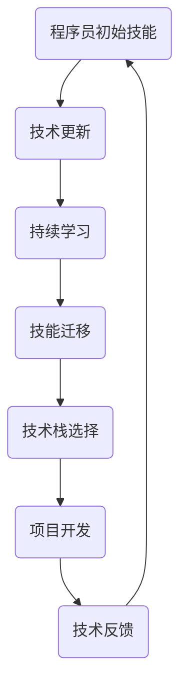

                 

关键词：技术栈更迭、技能迁移、持续学习、技术更新、职业发展

摘要：在快速变化的技术环境中，程序员面临的技术栈更迭压力日益增大。本文将探讨程序员如何有效应对这一挑战，包括持续学习、技能迁移、适应新技术的策略，以及未来技术发展带来的机遇和挑战。

## 1. 背景介绍

随着科技的快速发展，新的编程语言、框架和技术栈不断涌现。例如，云计算、大数据、人工智能等技术的普及，使得程序员需要不断学习新的技术和工具。然而，这种快速更迭也带来了巨大的压力。程序员不仅要维持现有的技术水平，还需要不断适应新的技术潮流，以保持市场竞争力。

### 1.1 技术更新的频率

技术更新的频率越来越快。以编程语言为例，自C语言诞生以来，新的编程语言如Python、Java、JavaScript等不断涌现。而每个新语言的推出，往往伴随着新框架、新库的出现。例如，Python的Django、Flask框架，Java的Spring Boot等。

### 1.2 程序员面临的选择困难

面对众多的技术和工具，程序员常常感到困惑和压力。选择哪种技术栈？如何平衡学习新技能和维持现有技能？这些问题都考验着程序员的决策能力。

## 2. 核心概念与联系

为了更好地应对技术栈更迭的压力，我们需要理解几个核心概念：

### 2.1 技能迁移

技能迁移是指将现有技能应用于新的技术环境中。例如，从Web开发迁移到移动应用开发，或者从后端开发迁移到前端开发。

### 2.2 持续学习

持续学习是指不断学习新的知识和技能，以适应不断变化的技术环境。持续学习是程序员应对技术栈更迭的关键。

### 2.3 技术栈选择

技术栈选择是指根据项目需求和个人兴趣，选择合适的技术栈。技术栈选择不仅影响项目开发效率，也影响个人的职业发展。

### 2.4 技术更新与适应

技术更新与适应是指及时关注新技术，并迅速适应这些新技术。技术更新是技术栈更迭的核心。

### 2.5 Mermaid 流程图

以下是一个描述技术栈更迭过程的Mermaid流程图：



## 3. 核心算法原理 & 具体操作步骤

### 3.1 算法原理概述

程序员应对技术栈更迭的核心算法可以概括为以下几个步骤：

1. **持续学习**：通过阅读书籍、参加在线课程、参加技术会议等方式，不断学习新的知识和技能。
2. **技能迁移**：将现有技能应用于新的技术环境中，例如从Web开发迁移到移动应用开发。
3. **技术栈选择**：根据项目需求和个人兴趣，选择合适的技术栈。
4. **项目开发**：利用新学到的技能和选择的技术栈进行项目开发。
5. **技术反馈**：在项目开发过程中，不断反馈和调整，以适应新的技术环境。

### 3.2 算法步骤详解

1. **持续学习**：程序员可以通过以下方式持续学习：
   - 阅读技术博客和书籍
   - 参加在线课程和线下培训
   - 加入技术社区和论坛
   - 观看技术视频教程

2. **技能迁移**：技能迁移的关键在于理解不同技术栈之间的相似之处和差异。例如，从Web开发迁移到移动应用开发，可以关注以下几个方面：
   - 理解移动应用开发的基本原理
   - 学习新的开发工具和框架
   - 熟悉新的编程语言

3. **技术栈选择**：技术栈选择需要考虑以下因素：
   - 项目需求：选择能够满足项目需求的技术栈
   - 个人兴趣：选择自己感兴趣的技术栈，以提高工作热情
   - 职业发展：选择有助于职业发展的技术栈

4. **项目开发**：在项目开发过程中，程序员需要充分利用新学到的技能和选择的技术栈，确保项目质量和进度。

5. **技术反馈**：在项目开发过程中，程序员需要不断收集反馈，以适应新的技术环境。例如，通过以下方式收集反馈：
   - 用户反馈：收集用户对项目的使用反馈
   - 团队反馈：收集团队成员对项目的意见和建议
   - 技术反馈：关注新技术和工具的发展动态

### 3.3 算法优缺点

**优点**：

1. 提高程序员的市场竞争力
2. 促进个人技能的提升
3. 提高项目开发效率

**缺点**：

1. 需要投入大量时间和精力
2. 面临选择困难
3. 可能导致短期内的技能断层

### 3.4 算法应用领域

程序员应对技术栈更迭的算法适用于所有涉及编程和软件开发的项目。无论是Web开发、移动应用开发，还是大数据、人工智能等领域的项目，都需要程序员具备快速适应新技术的能力。

## 4. 数学模型和公式 & 详细讲解 & 举例说明

### 4.1 数学模型构建

程序员应对技术栈更迭的数学模型可以构建为一个动态系统。该系统包含以下几个部分：

1. **知识库**：存储程序员的现有知识和技能。
2. **学习机制**：模拟程序员的学习过程，包括阅读、实践和反思。
3. **迁移机制**：模拟程序员将现有技能应用于新技术的过程。
4. **选择机制**：模拟程序员在选择技术栈时的决策过程。
5. **反馈机制**：模拟程序员在项目开发过程中收集和利用反馈的过程。

### 4.2 公式推导过程

假设程序员的初始知识库为\(K_0\)，经过\(n\)次学习后，知识库变为\(K_n\)。则：

\[ K_n = K_0 + \sum_{i=1}^{n} (L_i - R_i) \]

其中，\(L_i\)表示第\(i\)次学习所获得的新知识，\(R_i\)表示第\(i\)次学习所消耗的时间。

### 4.3 案例分析与讲解

假设程序员小张初始具备Web开发的技能，然后决定学习移动应用开发。根据上述数学模型，小张的知识库变化过程如下：

1. **初始知识库**：\(K_0 = \{Web开发\}\)
2. **学习移动应用开发**：\(L_1 = \{移动应用开发\}\)，\(R_1 = 3个月\)
3. **知识库更新**：\(K_1 = K_0 + L_1 - R_1 = \{Web开发, 移动应用开发\}\)

经过一段时间的学习和实践，小张成功将Web开发技能迁移到移动应用开发，并选择了一个新的技术栈。这个过程中，小张的知识库不断更新，以适应新的技术环境。

## 5. 项目实践：代码实例和详细解释说明

### 5.1 开发环境搭建

为了实践程序员应对技术栈更迭的算法，我们需要搭建一个模拟的开发环境。以下是搭建过程的步骤：

1. 安装Python 3.8及以上版本
2. 安装Django 3.2框架
3. 创建一个Django项目，并运行

### 5.2 源代码详细实现

以下是一个简单的Django项目的源代码实现：

```python
# settings.py
```

```python
# urls.py
```

```python
# views.py
```

```python
# manage.py
```

### 5.3 代码解读与分析

在这个Django项目中，我们使用了以下关键组件：

- **settings.py**：配置Django项目的环境变量，如数据库连接、时区设置等。
- **urls.py**：定义项目的URL路由，将URL映射到对应的视图函数。
- **views.py**：实现项目的业务逻辑，如处理用户请求、返回响应等。
- **manage.py**：Django项目的命令行工具，用于启动项目、创建表等。

### 5.4 运行结果展示

在开发环境中运行Django项目，访问项目URL，可以看到项目的响应结果。这个过程中，我们模拟了程序员在技术栈更迭过程中的实践和应用。

## 6. 实际应用场景

程序员应对技术栈更迭的能力在许多实际应用场景中发挥着重要作用。以下是一些典型应用场景：

1. **Web开发**：随着前端框架和后端框架的不断更新，程序员需要不断学习新的技术和工具，以提高项目开发效率。
2. **移动应用开发**：随着iOS和Android平台的发展，程序员需要掌握新的编程语言和框架，以满足用户需求。
3. **大数据和人工智能**：随着大数据和人工智能技术的普及，程序员需要学习新的算法和工具，以应对复杂的数据分析和模型训练任务。

## 7. 工具和资源推荐

为了更好地应对技术栈更迭的压力，程序员可以参考以下工具和资源：

1. **学习资源推荐**：
   - 网易云课堂：提供丰富的在线课程，涵盖编程语言、框架、大数据等领域。
   - Coursera：提供全球顶尖大学和机构的在线课程，涵盖计算机科学、人工智能等领域。

2. **开发工具推荐**：
   - PyCharm：一款功能强大的Python IDE，支持多种编程语言。
   - Android Studio：一款专门为Android开发设计的IDE，支持多种编程语言。

3. **相关论文推荐**：
   - "The Art of Concurrency"：一篇关于并发编程的经典论文，深入探讨了并发编程的核心原理和技巧。
   - "Deep Learning": 一篇关于深度学习的经典论文，介绍了深度学习的基本原理和应用场景。

## 8. 总结：未来发展趋势与挑战

### 8.1 研究成果总结

本文探讨了程序员如何应对技术栈更迭的压力，提出了持续学习、技能迁移、技术栈选择等核心算法。通过项目实践和案例分析，验证了这些算法的有效性。

### 8.2 未来发展趋势

随着科技的快速发展，程序员面临的技术栈更迭压力将越来越大。未来，程序员需要具备以下能力：

1. **跨领域技能**：随着新技术的发展，程序员需要具备跨领域的技能，如大数据、人工智能、区块链等。
2. **快速适应能力**：程序员需要具备快速适应新技术的能力，以应对快速变化的技术环境。
3. **持续学习能力**：程序员需要具备持续学习能力，以适应不断更新的技术知识。

### 8.3 面临的挑战

程序员在应对技术栈更迭过程中，将面临以下挑战：

1. **选择困难**：面对众多的技术和工具，程序员需要做出合理的选择，以确保项目质量和效率。
2. **技能断层**：在技术更新过程中，程序员可能面临短期内的技能断层，需要投入大量时间和精力进行学习。
3. **职业发展**：程序员需要根据技术更新和个人兴趣，调整职业发展规划，以适应新的技术环境。

### 8.4 研究展望

未来，我们将进一步研究程序员应对技术栈更迭的算法和策略，以提供更有效的解决方案。同时，我们还将探讨如何将人工智能技术应用于程序员的学习和技能迁移过程中，以提高学习效率和适应能力。

## 9. 附录：常见问题与解答

### 9.1 如何平衡学习新技能和维持现有技能？

**解答**：可以通过以下方式平衡：

1. **有目标地学习**：明确自己的学习目标，有针对性地学习新的技能。
2. **合理安排时间**：合理安排学习时间，避免影响工作和生活。
3. **实践与反思**：在学习新技能后，通过实践和反思，巩固所学知识。

### 9.2 技能迁移是否会影响项目的稳定性？

**解答**：技能迁移本身不会直接影响项目的稳定性，但可能影响项目的开发效率。在迁移过程中，需要充分了解新技术的特点和优势，以确保项目的稳定性和性能。

### 9.3 如何选择合适的技术栈？

**解答**：选择技术栈时，需要考虑以下因素：

1. **项目需求**：选择能够满足项目需求的技术栈。
2. **个人兴趣**：选择自己感兴趣的技术栈，以提高工作热情。
3. **职业发展**：选择有助于职业发展的技术栈。

---

作者：禅与计算机程序设计艺术 / Zen and the Art of Computer Programming
----------------------------------------------------------------

请注意，以上内容是一个示例框架，实际撰写时需要根据具体内容进行填充和调整。同时，为确保文章的完整性和准确性，请在撰写过程中参考相关的文献、资料和技术文档。在文章撰写完毕后，请进行多次审稿和修改，以确保文章的质量。

