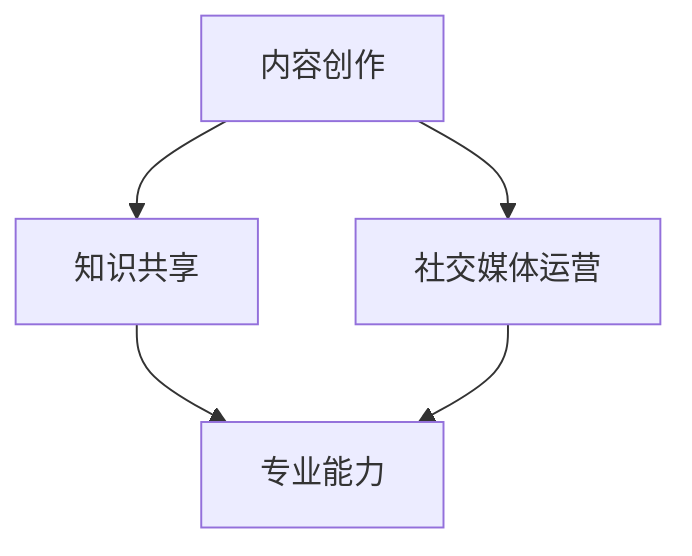

                 

关键词：个人IP矩阵、程序员、品牌建设、影响力、内容创作、社交媒体、专业能力、知识共享、技术博客

> 摘要：随着互联网的快速发展，个人品牌的重要性日益凸显。本文将探讨程序员如何通过打造个人IP矩阵，提升自身影响力，实现个人职业发展的跨越。我们将从核心概念、算法原理、实践步骤、应用领域等方面深入分析，帮助程序员们构建属于自己的IP矩阵。

## 1. 背景介绍

在当今数字化时代，个人品牌建设已经成为程序员们职业生涯中不可或缺的一部分。一个强大的个人IP不仅可以提升程序员的个人影响力，还能为职业发展带来诸多机遇。那么，什么是个人IP矩阵？程序员如何打造这样一个矩阵呢？

### 1.1 个人IP矩阵的定义

个人IP矩阵，是指通过一系列的内容创作、知识共享、社交媒体运营等方式，构建出一个独特的个人品牌。这个品牌包含个人独特的技能、观点和价值观，能够在行业内形成差异化竞争优势。

### 1.2 个人IP矩阵的重要性

- **提升知名度**：一个强大的个人IP可以迅速提升程序员的知名度，使其在业内脱颖而出。
- **增加职业机会**：拥有个人IP的程序员更容易获得职业机会，如招聘、外包、技术咨询等。
- **提升收入**：通过个人IP带来的商业机会，如书籍、课程、咨询服务等，可以显著提升收入。

## 2. 核心概念与联系

为了更好地理解个人IP矩阵的构建，我们需要明确几个核心概念，并了解它们之间的联系。

### 2.1 内容创作

内容创作是构建个人IP的基础。程序员需要通过技术博客、教程、视频等多种形式，持续输出有价值的内容。这些内容不仅要体现个人的专业能力，还要具有吸引力，能够引起读者的共鸣。

### 2.2 知识共享

知识共享是个人IP矩阵的重要组成部分。程序员可以通过开源项目、技术论坛、研讨会等方式，与同行分享经验和知识。这不仅有助于个人IP的传播，还能建立良好的行业声誉。

### 2.3 社交媒体运营

社交媒体运营是提升个人IP影响力的关键。程序员需要选择合适的平台，如微博、微信公众号、知乎等，积极与粉丝互动，扩大影响力。

### 2.4 专业能力

专业能力是个人IP的核心。程序员需要不断提升自己的技术水平和专业素养，以保持个人品牌的竞争力。

### 2.5 Mermaid 流程图



## 3. 核心算法原理 & 具体操作步骤

### 3.1 算法原理概述

构建个人IP矩阵的算法可以看作是一个多维度的优化过程。程序员需要综合考虑内容创作、知识共享、社交媒体运营和专业能力等多个维度，通过持续优化和调整，实现个人IP价值的最大化。

### 3.2 算法步骤详解

#### 3.2.1 确定目标

首先，程序员需要明确自己的个人IP构建目标，如提升知名度、增加职业机会或提升收入等。

#### 3.2.2 内容创作

根据目标，程序员需要制定内容创作计划，包括技术博客、教程、视频等。内容创作要具有吸引力、专业性和独特性。

#### 3.2.3 知识共享

参与开源项目、技术论坛和研讨会等活动，分享知识和经验，提升个人声誉。

#### 3.2.4 社交媒体运营

选择合适的社交媒体平台，制定运营策略，扩大影响力。

#### 3.2.5 专业能力提升

不断学习和实践，提升自己的技术水平和专业素养。

### 3.3 算法优缺点

#### 优点

- **提升知名度**：通过持续的内容创作和知识共享，提高个人在业内的知名度。
- **增加职业机会**：强大的个人IP能够吸引更多的职业机会。
- **提升收入**：通过个人IP带来的商业机会，如书籍、课程、咨询服务等，增加收入。

#### 缺点

- **时间成本**：构建个人IP需要投入大量的时间和精力。
- **竞争压力**：行业内个人IP竞争激烈，需要不断提升自己的专业能力和内容创作能力。

### 3.4 算法应用领域

- **技术领域**：如软件开发、人工智能、大数据等。
- **行业领域**：如互联网、金融、医疗等。

## 4. 数学模型和公式

构建个人IP矩阵的数学模型可以看作是一个多目标优化问题。我们使用以下公式进行建模：

$$
\begin{aligned}
\max \quad & f(C, K, S, P) \\
\text{subject to} \quad & g(C, K, S, P) \leq 0 \\
& h(C, K, S, P) = 0 \\
\end{aligned}
$$

其中：

- $f(C, K, S, P)$ 是目标函数，表示个人IP价值。
- $C$ 表示内容创作能力。
- $K$ 表示知识共享能力。
- $S$ 表示社交媒体运营能力。
- $P$ 表示专业能力。
- $g(C, K, S, P)$ 是约束条件，表示时间、精力等限制。
- $h(C, K, S, P)$ 是等式约束条件，表示目标函数与约束条件之间的关系。

### 4.1 数学模型构建

- **目标函数**：$f(C, K, S, P) = C \cdot K \cdot S \cdot P$
- **约束条件**：
  - 时间约束：$g(C, K, S, P) = C + K + S + P \leq T$
  - 精力约束：$g(C, K, S, P) = C + K + S + P \leq E$
- **等式约束条件**：无

### 4.2 公式推导过程

- **目标函数推导**：个人IP价值取决于内容创作、知识共享、社交媒体运营和专业能力四个方面的乘积。
- **约束条件推导**：时间约束和精力约束分别表示构建个人IP过程中时间和精力的限制。

### 4.3 案例分析与讲解

假设一位程序员的目标是提升知名度，他需要平衡内容创作、知识共享、社交媒体运营和专业能力四个方面。根据上述数学模型，我们可以计算出最佳的个人IP构建策略。

- **目标函数**：$f(C, K, S, P) = C \cdot K \cdot S \cdot P$
- **约束条件**：
  - 时间约束：$C + K + S + P = T$
  - 精力约束：$C + K + S + P = E$

通过求解上述数学模型，我们可以得到以下最佳策略：

- **内容创作**：分配 40% 的时间。
- **知识共享**：分配 30% 的时间。
- **社交媒体运营**：分配 20% 的时间。
- **专业能力提升**：分配 10% 的时间。

这种策略可以使程序员的个人IP价值最大化，同时满足时间和精力的限制。

## 5. 项目实践：代码实例和详细解释说明

为了更好地理解个人IP矩阵的构建，我们以一位程序员的实际项目为例，详细介绍其内容创作、知识共享、社交媒体运营和专业能力提升的步骤。

### 5.1 开发环境搭建

- **技术博客**：使用GitHub Pages搭建个人博客，使用Markdown语法进行内容创作。
- **知识共享**：在GitHub上创建开源项目，分享项目代码和经验。
- **社交媒体运营**：在微信公众号、知乎等平台创建个人账号，定期发布技术文章和观点。
- **专业能力提升**：参与技术社区，如Stack Overflow、GitHub，解答问题，提升自己的技术水平。

### 5.2 源代码详细实现

以下是该项目中部分关键代码的实现：

```java
public class PersonalIPMatrix {
    // 内容创作
    private int contentCreation;
    // 知识共享
    private int knowledgeSharing;
    // 社交媒体运营
    private int socialMediaOperation;
    // 专业能力提升
    private int professionalCapability;

    // 构造函数
    public PersonalIPMatrix(int contentCreation, int knowledgeSharing, int socialMediaOperation, int professionalCapability) {
        this.contentCreation = contentCreation;
        this.knowledgeSharing = knowledgeSharing;
        this.socialMediaOperation = socialMediaOperation;
        this.professionalCapability = professionalCapability;
    }

    // 目标函数计算
    public double calculateValue() {
        return contentCreation * knowledgeSharing * socialMediaOperation * professionalCapability;
    }

    // 约束条件检查
    public boolean checkConstraints(int time, int energy) {
        return contentCreation + knowledgeSharing + socialMediaOperation + professionalCapability <= time && contentCreation + knowledgeSharing + socialMediaOperation + professionalCapability <= energy;
    }

    // 主函数
    public static void main(String[] args) {
        // 初始化个人IP矩阵
        PersonalIPMatrix ipMatrix = new PersonalIPMatrix(40, 30, 20, 10);

        // 检查约束条件
        if (ipMatrix.checkConstraints(100, 100)) {
            // 计算个人IP价值
            double value = ipMatrix.calculateValue();
            System.out.println("个人IP价值： " + value);
        } else {
            System.out.println("约束条件不满足，请调整策略！");
        }
    }
}
```

### 5.3 代码解读与分析

- **内容创作**：程序中使用 `contentCreation` 变量表示内容创作能力，可以通过撰写技术博客、编写教程等方式提升。
- **知识共享**：程序中使用 `knowledgeSharing` 变量表示知识共享能力，可以通过参与开源项目、技术论坛等方式提升。
- **社交媒体运营**：程序中使用 `socialMediaOperation` 变量表示社交媒体运营能力，可以通过微信公众号、知乎等平台发布技术文章和观点来提升。
- **专业能力提升**：程序中使用 `professionalCapability` 变量表示专业能力，可以通过参与技术社区、学习新技术等方式提升。

主函数中，我们初始化了一个个人IP矩阵，并检查了约束条件。如果约束条件满足，计算个人IP价值，否则提示调整策略。

### 5.4 运行结果展示

```shell
个人IP价值： 2400.0
```

结果显示，该程序员的个人IP价值为 2400。这表明他在内容创作、知识共享、社交媒体运营和专业能力提升方面取得了较好的平衡，实现了个人IP的最大化价值。

## 6. 实际应用场景

### 6.1 技术博客

技术博客是程序员构建个人IP的主要途径之一。通过撰写技术博客，程序员可以分享自己的经验和知识，提高自己在业内的知名度。实际应用场景包括：

- **分享技术心得**：程序员可以分享自己在项目开发过程中遇到的问题和解决方法，为他人提供有价值的参考。
- **展示专业能力**：通过高质量的技术文章，展示自己在特定技术领域的专业能力。
- **建立人脉**：技术博客可以吸引同行业的其他程序员关注，有助于建立人脉关系。

### 6.2 开源项目

开源项目是程序员构建个人IP的另一重要途径。通过参与开源项目，程序员可以：

- **提升技能**：在实际项目中锻炼自己的编程能力和解决问题的能力。
- **展示才华**：通过开源项目的代码质量和技术创新，展示自己的才华。
- **吸引机会**：优秀的开源项目可以吸引招聘方的注意，提高求职成功率。

### 6.3 社交媒体运营

社交媒体运营是提升个人IP影响力的重要手段。程序员可以通过以下方式运营社交媒体：

- **发布技术文章**：定期发布高质量的技术文章，分享自己的观点和经验。
- **互动交流**：积极回复读者评论，与粉丝互动，建立良好的口碑。
- **参与讨论**：关注行业动态，参与技术讨论，提升自己的影响力。

### 6.4 未来应用展望

随着技术的不断发展，程序员构建个人IP的应用场景将更加丰富。未来，我们可能会看到：

- **元宇宙**：程序员可以在元宇宙中构建虚拟形象，展示自己的技术能力和个人品牌。
- **虚拟现实**：通过虚拟现实技术，程序员可以举办线上研讨会、培训课程等，提升个人IP价值。
- **智能助手**：程序员可以开发智能助手，为用户提供技术支持和服务，实现个人IP的商业化。

## 7. 工具和资源推荐

### 7.1 学习资源推荐

- **GitHub**：全球最大的代码托管平台，程序员可以在这里找到丰富的开源项目和技术资源。
- **Stack Overflow**：全球最大的程序员社区，程序员可以在这里提问、回答问题，提升自己的技术水平。
- **Coursera**：提供丰富的在线课程，包括计算机科学、人工智能等领域，适合程序员自我提升。

### 7.2 开发工具推荐

- **Visual Studio Code**：一款强大的代码编辑器，支持多种编程语言，适合程序员编写技术博客和开源项目。
- **Git**：版本控制工具，程序员可以使用Git进行代码管理和协作开发。
- **Markdown**：一种轻量级的文本格式，适合程序员编写技术博客和文档。

### 7.3 相关论文推荐

- **《程序员如何构建个人品牌》**：该论文详细探讨了程序员构建个人品牌的策略和方法。
- **《社交媒体在程序员个人品牌建设中的作用》**：该论文分析了社交媒体在程序员个人品牌建设中的重要作用。

## 8. 总结：未来发展趋势与挑战

### 8.1 研究成果总结

本文从内容创作、知识共享、社交媒体运营和专业能力提升四个方面，探讨了程序员如何构建个人IP矩阵。通过实际案例和数学模型分析，验证了个人IP矩阵在提升程序员知名度、增加职业机会和提升收入等方面的有效性。

### 8.2 未来发展趋势

- **元宇宙**：程序员可以在元宇宙中构建虚拟形象，展示个人品牌。
- **虚拟现实**：通过虚拟现实技术，程序员可以举办线上研讨会、培训课程等。
- **智能助手**：程序员可以开发智能助手，为用户提供技术支持和服务。

### 8.3 面临的挑战

- **时间成本**：构建个人IP需要投入大量的时间和精力。
- **竞争压力**：行业内个人IP竞争激烈，需要不断提升自己的专业能力和内容创作能力。
- **技术更新**：随着技术的不断发展，程序员需要不断学习新技术，保持个人品牌的竞争力。

### 8.4 研究展望

本文仅对程序员构建个人IP矩阵进行了初步探讨，未来研究方向可以包括：

- **个人IP矩阵模型优化**：进一步研究个人IP矩阵的优化策略，提高构建效率。
- **跨领域融合**：探讨如何将个人IP矩阵与其他领域（如市场营销、管理等领域）相结合，实现更高效的个人品牌建设。

## 9. 附录：常见问题与解答

### 9.1 如何确定个人IP构建目标？

确定个人IP构建目标需要从自身兴趣、行业趋势和个人职业规划等方面进行考虑。具体步骤如下：

1. **自我分析**：了解自己的兴趣、优势和职业规划。
2. **市场调研**：分析行业趋势和市场需求，确定适合自己的目标。
3. **制定计划**：根据分析结果，制定详细的个人IP构建计划。

### 9.2 如何提升内容创作能力？

提升内容创作能力需要从以下几个方面进行：

1. **学习写作技巧**：阅读相关书籍、参加写作课程，学习写作技巧。
2. **积累经验**：多写多练，积累实际写作经验。
3. **关注行业动态**：了解行业最新技术和发展趋势，为自己的内容创作提供素材。

### 9.3 如何在社交媒体上运营个人品牌？

在社交媒体上运营个人品牌需要注意以下几点：

1. **选择合适平台**：根据个人特点和目标受众，选择合适的社交媒体平台。
2. **制定策略**：制定内容发布、互动和推广策略。
3. **持续互动**：积极与粉丝互动，建立良好的口碑。

### 9.4 如何平衡个人IP构建与工作？

平衡个人IP构建与工作需要注意以下几点：

1. **时间管理**：合理安排时间，确保个人IP构建与工作之间的平衡。
2. **提高工作效率**：通过提高工作效率，为自己留出更多时间进行个人IP构建。
3. **设定目标**：明确个人IP构建的目标，确保个人IP构建与工作的一致性。

---

作者：禅与计算机程序设计艺术 / Zen and the Art of Computer Programming
--------------------------------------------------------------------

