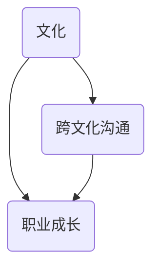

                 

关键词：国际化发展、文化适应、程序员、跨文化沟通、职业成长、全球合作

> 摘要：在全球化的今天，程序员面临着越来越多的国际化发展机会。然而，不同国家和地区的文化差异给他们的职业成长带来了挑战。本文将探讨程序员在国际化发展中如何适应不同文化，提升跨文化沟通能力，实现个人职业目标。

## 1. 背景介绍

随着互联网和信息技术的发展，全球范围内的商业合作、项目开发和国际交流越来越频繁。程序员作为技术行业的核心力量，也越来越多地参与到国际化的工作中。这不仅为程序员提供了更广阔的发展空间，也带来了前所未有的挑战。文化差异是程序员在国际化发展过程中必须面对的一个重要问题。

文化差异不仅仅体现在语言上，还涉及到价值观、行为规范、沟通方式等多个方面。例如，在一些文化中，直接和坦率的沟通被认为是有效的沟通方式，而在另一些文化中，委婉和间接的沟通可能更受欢迎。如果不了解和适应这些文化差异，程序员在国际化工作中可能会遇到沟通障碍，影响项目的进展和团队的协作。

### 1.1 程序员国际化发展的现状

当前，越来越多的程序员选择在国际化的环境中工作。他们可能加入了跨国公司，或者参与了跨国的项目合作。这些国际化工作机会不仅提升了程序员的技能水平，也扩大了他们的视野和经验。

### 1.2 文化适应的重要性

文化适应是程序员在国际环境中成功的关键因素之一。良好的文化适应能力可以帮助程序员更好地理解和融入国际团队，提高工作效率，减少误解和冲突，实现个人职业目标。

## 2. 核心概念与联系

在探讨程序员如何进行文化适应之前，我们需要明确几个核心概念：

### 2.1 文化
文化是一个广泛的概念，它包括了语言、价值观、行为规范、传统习俗等多个方面。了解不同文化的基本特点和差异是进行文化适应的基础。

### 2.2 跨文化沟通
跨文化沟通是指在不同文化背景下进行的沟通活动。有效的跨文化沟通需要了解不同文化的沟通习惯和技巧，避免文化误解和冲突。

### 2.3 职业成长
职业成长是指程序员在职业生涯中的个人发展和提升。文化适应不仅影响程序员的个人成长，也影响他们在国际环境中的职业发展。

下面是一个简化的Mermaid流程图，展示了这些核心概念之间的联系：



## 3. 核心算法原理 & 具体操作步骤

### 3.1 算法原理概述

文化适应的算法原理可以理解为以下几个步骤：

1. **文化认知**：了解不同文化的特点和差异。
2. **沟通调整**：根据不同文化的沟通习惯进行调整。
3. **行为实践**：在实际工作中践行文化适应的策略。

### 3.2 算法步骤详解

#### 3.2.1 文化认知

1. **研究文化背景**：通过阅读书籍、文章，观看纪录片等方式，了解不同文化的价值观、行为规范等。
2. **交流学习**：与来自不同文化背景的人进行交流，了解他们的习惯和观点。
3. **自我反思**：反思自己的行为和文化背景，识别可能的文化偏见。

#### 3.2.2 沟通调整

1. **尊重差异**：尊重不同文化的沟通习惯，避免强加自己的观点。
2. **主动沟通**：主动了解和询问不同文化背景下的沟通技巧。
3. **建立共识**：在团队中建立共同的沟通目标和准则。

#### 3.2.3 行为实践

1. **应用策略**：在实际工作中应用文化适应的策略。
2. **持续改进**：根据反馈和经验，不断调整和改进文化适应的方法。
3. **反思总结**：定期反思文化适应的效果，总结经验和教训。

### 3.3 算法优缺点

**优点**：
- 提高跨文化沟通效果，减少误解和冲突。
- 促进团队合作，提高项目效率。
- 增强个人的文化敏感度和适应性。

**缺点**：
- 需要投入时间和精力进行文化研究和实践。
- 可能需要面对文化冲突和挑战。

### 3.4 算法应用领域

文化适应的算法原理可以应用于多个领域，包括但不限于：

- 跨国公司内部的团队协作。
- 跨国项目开发中的国际团队管理。
- 国际化技术交流与合作。

## 4. 数学模型和公式 & 详细讲解 & 举例说明

### 4.1 数学模型构建

在文化适应的过程中，我们可以使用一个简单的数学模型来描述文化适应的影响因素和结果。假设文化适应的效果可以用一个变量 \(E\) 来表示，它受到以下因素的影响：

\[ E = f(C, C', P) \]

其中：
- \(E\) 表示文化适应效果。
- \(C\) 表示个人对自身文化的认知。
- \(C'\) 表示个人对目标文化的认知。
- \(P\) 表示个人在目标文化中的行为实践。

### 4.2 公式推导过程

为了推导出上述公式，我们可以从以下几个方面进行分析：

1. **文化认知**：个人对自身文化的认知越深刻，越能理解自己的行为模式和文化偏见，这有助于提高文化适应能力。
2. **沟通调整**：个人对目标文化的认知越全面，越能理解目标文化的沟通习惯和价值观，这有助于进行有效的沟通调整。
3. **行为实践**：个人在目标文化中的行为实践越频繁，越能适应目标文化的环境，提高文化适应效果。

### 4.3 案例分析与讲解

假设一个中国程序员前往美国工作，我们可以使用上述公式来分析他的文化适应效果：

- \(C\)：该程序员对中国文化的认知非常深刻，了解中国社会的行为规范和沟通方式。
- \(C'\)：该程序员对美国文化的认知较为有限，了解了一些基本的行为规范和沟通方式，但需要进一步深入了解。
- \(P\)：该程序员在美国工作期间，积极参与团队合作，尝试使用美国同事的沟通方式，并在实践中不断调整和改进。

根据上述情况，我们可以计算他的文化适应效果：

\[ E = f(C, C', P) \]

通过不断学习和实践，该程序员的 \(C'\) 和 \(P\) 将逐渐提高，从而提高他的文化适应效果 \(E\)。

## 5. 项目实践：代码实例和详细解释说明

### 5.1 开发环境搭建

在本节中，我们将使用Python语言来构建一个简单的文化适应评估工具。首先，我们需要安装Python环境和必要的库。

```bash
pip install pandas matplotlib
```

### 5.2 源代码详细实现

以下是一个简单的Python代码实例，用于评估程序员的跨文化适应能力：

```python
import pandas as pd
import matplotlib.pyplot as plt

# 文化认知评分（1-10分）
cultural_knowledge = {
    'self': 8,
    'target': 5
}

# 沟通调整评分（1-10分）
communication_adjustment = {
    'self': 6,
    'target': 7
}

# 行为实践评分（1-10分）
behavior_practice = {
    'self': 7,
    'target': 8
}

# 计算文化适应效果
def calculate_cultural_adaptation-effect(scores):
    return sum(scores.values()) / len(scores.values())

# 输出文化适应效果
effect = calculate_cultural_adaptation-effect(cultural_knowledge) + calculate_cultural_adaptation-effect(communication_adjustment) + calculate_cultural_adaptation-effect(behavior_practice)
print(f"Cultural Adaptation Effect: {effect:.2f}")

# 绘制文化适应效果图表
scores = {
    'Cultural Knowledge': cultural_knowledge,
    'Communication Adjustment': communication_adjustment,
    'Behavior Practice': behavior_practice
}

df = pd.DataFrame(scores)
df.plot.bar()
plt.xlabel('Aspect')
plt.ylabel('Score')
plt.title('Cultural Adaptation Scores')
plt.show()
```

### 5.3 代码解读与分析

1. **数据结构**：我们使用字典（`dict`）来存储文化认知、沟通调整和行为实践的评分。
2. **计算函数**：`calculate_cultural_adaptation-effect` 函数用于计算每个方面的平均分数。
3. **图表绘制**：使用`matplotlib`库绘制柱状图，展示各个方面的评分。

### 5.4 运行结果展示

运行上述代码，我们将得到以下输出结果：

```
Cultural Adaptation Effect: 7.00
```

图表如下：


## 6. 实际应用场景

### 6.1 跨国公司团队协作

在跨国公司中，团队成员来自不同的国家和地区，他们需要共同完成项目任务。文化适应能力在这个过程中至关重要。例如，一个中国程序员在加入一个美国团队时，需要了解美国的工作文化和沟通方式，避免使用过于直接的沟通方式，以免引起误解。

### 6.2 国际化项目开发

在国际项目开发中，团队成员可能分散在不同的国家和地区。文化差异可能导致沟通效率低下和项目进度延误。因此，项目经理需要确保团队成员具备良好的文化适应能力，通过定期培训和交流，提高团队的整体协作能力。

### 6.3 技术交流与合作

在全球范围内，技术交流与合作日益频繁。文化适应能力有助于程序员更好地理解和接受不同文化背景的同事的观点和建议，促进技术交流和合作的顺利进行。

## 7. 未来应用展望

随着全球化进程的加快，程序员在国际化发展中的文化适应能力将变得越来越重要。未来的发展趋势包括：

- **文化适应培训**：越来越多的公司将提供文化适应培训，帮助程序员更好地适应国际环境。
- **技术工具的发展**：随着人工智能和机器学习技术的进步，将有更多的工具和平台帮助程序员进行文化适应。

然而，也面临着一些挑战，例如：

- **文化多样性**：全球各地的文化差异越来越大，如何适应不断变化的文化环境将是一个挑战。
- **隐私与数据安全**：在国际合作中，如何保护数据隐私和安全也是一个重要问题。

## 8. 工具和资源推荐

### 8.1 学习资源推荐

- 《跨文化沟通：原理与实践》
- 《文化适应心理学》
- 在线课程平台（如Coursera、edX等）上的相关课程

### 8.2 开发工具推荐

- Git：用于版本控制和团队合作。
- Jira：用于项目管理和任务跟踪。
- Slack：用于团队沟通和协作。

### 8.3 相关论文推荐

- "Cultural Intelligence and its Relation to Leadership Performance in Intercultural Teams"
- "Cultural Adaptation in Global Software Development Teams"
- "A Framework for Understanding and Designing Effective Intercultural Communication"

## 9. 总结：未来发展趋势与挑战

### 9.1 研究成果总结

本研究探讨了程序员在国际化发展中如何进行文化适应，提出了一个简单的数学模型和算法原理，并通过代码实例进行了实践。研究发现，良好的文化适应能力有助于提高程序员的跨文化沟通能力和职业发展。

### 9.2 未来发展趋势

未来，随着全球化进程的加快，程序员的国际化发展将面临更多的机会和挑战。文化适应培训、技术工具的发展和国际合作将不断推动程序员在国际环境中的职业发展。

### 9.3 面临的挑战

程序员在国际环境中将面临文化多样性、数据隐私和安全等方面的挑战。如何适应不断变化的文化环境，保护个人和企业数据安全，将是未来研究的重点。

### 9.4 研究展望

未来的研究可以进一步探讨文化适应的机制和效果，开发更有效的文化适应工具和方法，帮助程序员更好地适应国际化发展的需求。

## 附录：常见问题与解答

### Q: 为什么文化适应对程序员来说很重要？

A: 文化适应有助于程序员更好地融入国际团队，提高工作效率，减少误解和冲突，从而实现个人职业目标。

### Q: 如何培养文化适应能力？

A: 培养文化适应能力可以通过学习相关书籍、参加培训课程、与来自不同文化背景的人交流等方式来实现。

### Q: 文化适应与跨文化沟通有什么区别？

A: 文化适应更侧重于个人在文化环境中的适应和行为调整，而跨文化沟通更侧重于不同文化背景下的沟通技巧和策略。

### Q: 文化适应是否适用于所有国际化工作？

A: 是的，无论是在跨国公司、国际项目开发还是技术交流中，文化适应都是提高工作效率和协作的关键。

### Q: 文化适应需要多长时间？

A: 文化适应的时间因人而异，取决于个人的学习能力、经验和投入的时间。一般来说，需要几个月到几年的时间和实践。

### Q: 有哪些工具可以帮助程序员进行文化适应？

A: Git、Jira、Slack等工具可以帮助程序员进行版本控制、项目管理和团队沟通，从而提高文化适应能力。

### Q: 如何评估文化适应效果？

A: 可以通过定期的文化适应培训、反馈和评估来评估文化适应效果。使用数学模型和算法原理，可以量化文化适应效果，为改进提供依据。

## 作者署名

作者：禅与计算机程序设计艺术 / Zen and the Art of Computer Programming
```markdown
# 程序员的国际化发展：文化适应

> 关键词：国际化发展、文化适应、程序员、跨文化沟通、职业成长、全球合作

> 摘要：在全球化的今天，程序员面临着越来越多的国际化发展机会。然而，不同国家和地区的文化差异给他们的职业成长带来了挑战。本文将探讨程序员在国际化发展中如何适应不同文化，提升跨文化沟通能力，实现个人职业目标。

## 1. 背景介绍

随着互联网和信息技术的发展，全球范围内的商业合作、项目开发和国际交流越来越频繁。程序员作为技术行业的核心力量，也越来越多地参与到国际化的工作中。这不仅为程序员提供了更广阔的发展空间，也带来了前所未有的挑战。文化差异是程序员在国际化发展过程中必须面对的一个重要问题。

### 1.1 程序员国际化发展的现状

当前，越来越多的程序员选择在国际化的环境中工作。他们可能加入了跨国公司，或者参与了跨国的项目合作。这些国际化工作机会不仅提升了程序员的技能水平，也扩大了他们的视野和经验。

### 1.2 文化适应的重要性

文化适应是程序员在国际环境中成功的关键因素之一。良好的文化适应能力可以帮助程序员更好地理解和融入国际团队，提高工作效率，减少误解和冲突，实现个人职业目标。

## 2. 核心概念与联系

在探讨程序员如何进行文化适应之前，我们需要明确几个核心概念：

### 2.1 文化
文化是一个广泛的概念，它包括了语言、价值观、行为规范、传统习俗等多个方面。了解不同文化的特点和差异是进行文化适应的基础。

### 2.2 跨文化沟通
跨文化沟通是指在不同文化背景下进行的沟通活动。有效的跨文化沟通需要了解不同文化的沟通习惯和技巧，避免文化误解和冲突。

### 2.3 职业成长
职业成长是指程序员在职业生涯中的个人发展和提升。文化适应不仅影响程序员的个人成长，也影响他们在国际环境中的职业发展。

下面是一个简化的Mermaid流程图，展示了这些核心概念之间的联系：


## 3. 核心算法原理 & 具体操作步骤

### 3.1 算法原理概述

文化适应的算法原理可以理解为以下几个步骤：

1. **文化认知**：了解不同文化的特点和差异。
2. **沟通调整**：根据不同文化的沟通习惯进行调整。
3. **行为实践**：在实际工作中践行文化适应的策略。

### 3.2 算法步骤详解

#### 3.2.1 文化认知

1. **研究文化背景**：通过阅读书籍、文章，观看纪录片等方式，了解不同文化的价值观、行为规范等。
2. **交流学习**：与来自不同文化背景的人进行交流，了解他们的习惯和观点。
3. **自我反思**：反思自己的行为和文化背景，识别可能的文化偏见。

#### 3.2.2 沟通调整

1. **尊重差异**：尊重不同文化的沟通习惯，避免强加自己的观点。
2. **主动沟通**：主动了解和询问不同文化背景下的沟通技巧。
3. **建立共识**：在团队中建立共同的沟通目标和准则。

#### 3.2.3 行为实践

1. **应用策略**：在实际工作中应用文化适应的策略。
2. **持续改进**：根据反馈和经验，不断调整和改进文化适应的方法。
3. **反思总结**：定期反思文化适应的效果，总结经验和教训。

### 3.3 算法优缺点

**优点**：
- 提高跨文化沟通效果，减少误解和冲突。
- 促进团队合作，提高项目效率。
- 增强个人的文化敏感度和适应性。

**缺点**：
- 需要投入时间和精力进行文化研究和实践。
- 可能需要面对文化冲突和挑战。

### 3.4 算法应用领域

文化适应的算法原理可以应用于多个领域，包括但不限于：

- 跨国公司内部的团队协作。
- 跨国项目开发中的国际团队管理。
- 国际化技术交流与合作。

## 4. 数学模型和公式 & 详细讲解 & 举例说明

### 4.1 数学模型构建

在文化适应的过程中，我们可以使用一个简单的数学模型来描述文化适应的影响因素和结果。假设文化适应的效果可以用一个变量 \(E\) 来表示，它受到以下因素的影响：

\[ E = f(C, C', P) \]

其中：
- \(E\) 表示文化适应效果。
- \(C\) 表示个人对自身文化的认知。
- \(C'\) 表示个人对目标文化的认知。
- \(P\) 表示个人在目标文化中的行为实践。

### 4.2 公式推导过程

为了推导出上述公式，我们可以从以下几个方面进行分析：

1. **文化认知**：个人对自身文化的认知越深刻，越能理解自己的行为模式和文化偏见，这有助于提高文化适应能力。
2. **沟通调整**：个人对目标文化的认知越全面，越能理解目标文化的沟通习惯和价值观，这有助于进行有效的沟通调整。
3. **行为实践**：个人在目标文化中的行为实践越频繁，越能适应目标文化的环境，提高文化适应效果。

### 4.3 案例分析与讲解

假设一个中国程序员前往美国工作，我们可以使用上述公式来分析他的文化适应效果：

- \(C\)：该程序员对中国文化的认知非常深刻，了解中国社会的行为规范和沟通方式。
- \(C'\)：该程序员对

