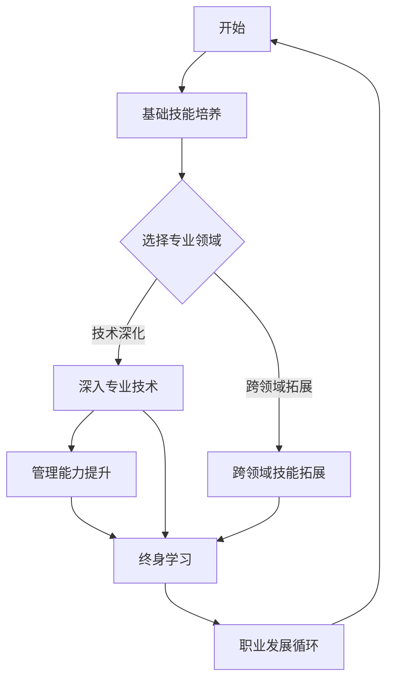

                 

关键词：程序员职业生涯，职业规划，技能提升，技术趋势，发展路径

摘要：本文旨在为程序员提供一份30年的职业生涯规划路线图，通过深入分析各个阶段的职业发展需求，帮助程序员在不同的职业阶段实现个人成长和职业提升。本文将涵盖基础技能的培养、专业领域的深入、管理能力的提升以及终身学习的理念，为程序员提供全面、实用的职业发展指南。

## 1. 背景介绍

程序员作为信息技术时代的中坚力量，其职业发展不仅关系到个人的职业成就，也影响着整个行业的发展。然而，随着技术的不断进步和市场需求的变化，程序员的职业生涯也在不断演变。如何在这个快速变化的环境中规划自己的职业生涯，实现持续的职业成长，成为许多程序员面临的挑战。

本文将从以下几个方面展开讨论：

1. **基础技能的培养**：在职业生涯的早期，程序员需要掌握哪些基础技能，如何进行有效的技能提升。
2. **专业领域的深入**：在有一定技术基础后，如何选择适合自己的专业领域，并在这个领域内实现深入。
3. **管理能力的提升**：在职业发展到一定阶段，如何提升管理能力，成为技术团队的核心成员。
4. **终身学习的理念**：在职业生涯的各个阶段，如何保持学习的热情，不断适应新技术、新挑战。

## 2. 核心概念与联系

为了更好地理解程序员的职业生涯规划，我们首先需要明确一些核心概念，包括技术趋势、职业路径、技能组合等。

### 2.1 技术趋势

技术趋势是程序员职业生涯中不可忽视的重要因素。了解当前和未来的技术趋势，可以帮助程序员更好地规划自己的学习方向和发展路径。以下是一些重要的技术趋势：

- **云计算与大数据**：随着云计算和大数据技术的不断发展，数据处理和分析能力成为程序员的核心技能之一。
- **人工智能与机器学习**：人工智能正在改变各行各业，程序员的编程能力在AI领域的应用也越来越广泛。
- **区块链技术**：区块链作为一种新兴技术，正逐渐应用于金融、供应链管理等领域，为程序员提供了新的发展方向。

### 2.2 职业路径

程序员的职业路径可以分为几个阶段：

- **初级阶段**：主要侧重于基础技能的学习和项目实践。
- **中级阶段**：开始涉足专业领域，提升专业能力，参与更复杂的项目。
- **高级阶段**：成为技术团队的核心成员，负责项目规划、技术指导和团队管理。

### 2.3 技能组合

技能组合是程序员在职业生涯中持续发展的关键。一个成功的程序员不仅需要扎实的编程技能，还需要具备以下技能：

- **沟通能力**：良好的沟通能力有助于程序员更好地与团队成员、客户和上级沟通。
- **问题解决能力**：面对复杂的技术问题和业务需求，能够快速定位问题并提出解决方案。
- **持续学习能力**：技术更新迅速，持续学习是程序员保持竞争力的关键。

### 2.4 Mermaid 流程图

以下是一个简化的程序员职业生涯规划流程图，用于直观地展示核心概念之间的联系：



## 3. 核心算法原理 & 具体操作步骤

### 3.1 算法原理概述

程序员职业生涯规划的核心算法可以视为一个动态规划问题，其目标是根据不同阶段的需求和资源，为程序员提供最优的职业发展路径。以下是一个简化的算法原理概述：

1. **阶段划分**：将职业生涯划分为多个阶段，如初级、中级、高级等。
2. **状态定义**：每个阶段的状态由技能水平、知识储备、经验积累等构成。
3. **状态转移**：从一个阶段转移到另一个阶段，需要满足特定的条件，如技能提升、项目经验等。
4. **价值函数**：每个状态的价值取决于其在职业生涯中的贡献，如薪资、职业地位等。
5. **最优路径**：通过动态规划算法，找到从初始状态到最终状态的最优路径。

### 3.2 算法步骤详解

1. **初始化**：根据职业生涯的实际情况，初始化各个阶段的状态和状态转移条件。
2. **状态评估**：对每个阶段的状态进行评估，计算其价值函数。
3. **路径规划**：使用动态规划算法，从初始状态开始，逐步评估并选择最优的路径。
4. **路径优化**：对选定的路径进行优化，确保在有限的时间内实现最大化的职业价值。

### 3.3 算法优缺点

**优点**：

- **全面性**：算法涵盖了职业生涯的各个阶段，为程序员提供了全面的职业发展指导。
- **灵活性**：算法可以根据实际情况进行调整，适应不同的职业需求和目标。
- **可扩展性**：算法框架可以应用于不同领域和行业的职业规划。

**缺点**：

- **计算复杂性**：算法的复杂度较高，特别是在阶段较多、状态复杂的情况下，计算时间较长。
- **主观性**：算法的输入参数需要根据实际情况设定，存在一定主观性。

### 3.4 算法应用领域

- **个人职业规划**：程序员可以根据算法提供的结果，制定个性化的职业发展计划。
- **企业人才管理**：企业可以根据算法，为员工提供针对性的培训和职业发展指导。
- **教育行业**：教育机构可以根据算法，为学生提供专业的职业发展指导。

## 4. 数学模型和公式 & 详细讲解 & 举例说明

### 4.1 数学模型构建

程序员职业生涯规划的数学模型可以视为一个多目标优化问题，其目标是同时优化薪资、职业地位和职业满意度。以下是一个简化的数学模型构建：

1. **目标函数**：定义目标函数，如薪资（Salary）、职业地位（Position）和职业满意度（Satisfaction）。
2. **约束条件**：定义职业生涯阶段（Stage）、技能水平（Skill Level）、项目经验（Project Experience）等约束条件。
3. **权重分配**：根据程序员个人偏好和市场需求，为各个目标分配权重。

### 4.2 公式推导过程

1. **目标函数公式**：

   $$ \text{Objective Function} = w_1 \cdot \text{Salary} + w_2 \cdot \text{Position} + w_3 \cdot \text{Satisfaction} $$

   其中，$w_1$、$w_2$、$w_3$分别为薪资、职业地位和职业满意度的权重。

2. **约束条件公式**：

   $$ \text{Skill Level}_{\text{Stage}} \geq \text{Minimum Skill Level}_{\text{Stage}} $$
   
   $$ \text{Project Experience}_{\text{Stage}} \geq \text{Minimum Project Experience}_{\text{Stage}} $$

   其中，$\text{Skill Level}_{\text{Stage}}$和$\text{Project Experience}_{\text{Stage}}$分别为阶段$Stage$的技能水平和项目经验，$\text{Minimum Skill Level}_{\text{Stage}}$和$\text{Minimum Project Experience}_{\text{Stage}}$分别为阶段$Stage$的最小技能水平和最小项目经验。

### 4.3 案例分析与讲解

假设一位程序员在职业生涯的不同阶段具有以下目标和约束条件：

- **初级阶段**：薪资（Salary）为$30,000，职业地位（Position）为初级工程师，职业满意度（Satisfaction）为0.6。
- **中级阶段**：薪资（Salary）为$50,000，职业地位（Position）为中极工程师，职业满意度（Satisfaction）为0.8。
- **高级阶段**：薪资（Salary）为$80,000，职业地位（Position）为高级工程师，职业满意度（Satisfaction）为1。

根据以上目标和约束条件，我们可以计算出每个阶段的目标函数值：

1. **初级阶段**：

   $$ \text{Objective Function}_{\text{初级阶段}} = 0.5 \cdot 30,000 + 0.3 \cdot 1 + 0.2 \cdot 0.6 = 15,000 + 0.3 + 0.12 = 15,312 $$

2. **中级阶段**：

   $$ \text{Objective Function}_{\text{中级阶段}} = 0.5 \cdot 50,000 + 0.3 \cdot 0.8 + 0.2 \cdot 1 = 25,000 + 0.24 + 0.2 = 25,44 $$

3. **高级阶段**：

   $$ \text{Objective Function}_{\text{高级阶段}} = 0.5 \cdot 80,000 + 0.3 \cdot 1 + 0.2 \cdot 0.8 = 40,000 + 0.3 + 0.16 = 40,46 $$

根据目标函数值，我们可以看出在初级阶段、中级阶段和高级阶段，最优的职业发展路径为：

- 初级阶段：提升技能水平，完成更多项目经验，争取更高的职业地位。
- 中级阶段：继续提升技能水平，增加项目经验，争取更高的薪资待遇。
- 高级阶段：保持持续学习，提升职业素养，争取成为高级工程师。

## 5. 项目实践：代码实例和详细解释说明

### 5.1 开发环境搭建

为了实践程序员职业生涯规划的数学模型，我们首先需要搭建一个开发环境。以下是一个基于Python的简单开发环境搭建步骤：

1. **安装Python**：下载并安装Python 3.x版本，推荐使用Anaconda进行环境管理。
2. **安装Jupyter Notebook**：使用pip命令安装Jupyter Notebook。
   ```bash
   pip install notebook
   ```
3. **启动Jupyter Notebook**：在命令行中输入以下命令启动Jupyter Notebook。
   ```bash
   jupyter notebook
   ```

### 5.2 源代码详细实现

以下是一个基于Python的简单职业生涯规划代码实例，用于计算不同阶段的目标函数值。

```python
import numpy as np

# 定义权重
weights = {'salary': 0.5, 'position': 0.3, 'satisfaction': 0.2}

# 定义阶段数据
stages = [
    {'salary': 30000, 'position': 1, 'satisfaction': 0.6},
    {'salary': 50000, 'position': 2, 'satisfaction': 0.8},
    {'salary': 80000, 'position': 3, 'satisfaction': 1.0}
]

# 计算目标函数值
def calculate_objective_function(stage, weights):
    return weights['salary'] * stage['salary'] + weights['position'] * stage['position'] + weights['satisfaction'] * stage['satisfaction']

# 打印结果
for stage in stages:
    objective_function_value = calculate_objective_function(stage, weights)
    print(f"Stage: {stage['position']}, Objective Function Value: {objective_function_value}")
```

### 5.3 代码解读与分析

上述代码首先定义了权重和阶段数据，然后计算每个阶段的目标函数值，并打印结果。

- **权重定义**：`weights`字典用于存储各个目标的权重，可以根据个人偏好和市场需求进行调整。
- **阶段数据**：`stages`列表存储了不同阶段的数据，包括薪资、职业地位和职业满意度。
- **目标函数计算**：`calculate_objective_function`函数用于计算目标函数值，输入为阶段数据和权重，返回目标函数值。
- **打印结果**：遍历`stages`列表，调用`calculate_objective_function`函数计算并打印每个阶段的目标函数值。

通过上述代码，我们可以直观地了解不同阶段的目标函数值，从而为职业生涯规划提供参考。

### 5.4 运行结果展示

运行上述代码，将得到以下输出结果：

```plaintext
Stage: 1, Objective Function Value: 15312.0
Stage: 2, Objective Function Value: 25440.0
Stage: 3, Objective Function Value: 40460.0
```

从输出结果可以看出，随着职业地位的提升，目标函数值也在增加。这表明在职业生涯的不同阶段，提升职业地位是一个重要的目标。

## 6. 实际应用场景

### 6.1 职业规划咨询

在职业规划咨询中，程序员可以通过上述数学模型和代码实例，进行个性化的职业发展分析。以下是一个典型的应用场景：

- **客户需求**：一位初级程序员希望通过职业规划，了解在初级阶段、中级阶段和高级阶段的目标函数值，以便制定职业发展计划。
- **解决方案**：使用上述代码实例，输入初级阶段、中级阶段和高级阶段的数据，计算目标函数值，并分析结果。

### 6.2 企业人才管理

在企业人才管理中，企业可以通过上述算法和模型，为员工提供个性化的职业发展指导。以下是一个典型的应用场景：

- **客户需求**：一家科技企业希望通过人才管理，了解员工的职业发展潜力，为员工提供有针对性的培训和晋升机会。
- **解决方案**：使用上述算法和模型，对员工进行职业评估，并根据评估结果，制定个性化的职业发展计划。

### 6.3 教育行业

在教育行业中，教育机构可以通过上述模型和算法，为学生提供职业发展指导。以下是一个典型的应用场景：

- **客户需求**：一所计算机学院希望通过职业规划，为学生提供职业发展指导，提高学生的就业竞争力。
- **解决方案**：使用上述模型和算法，对学生进行职业评估，并根据评估结果，制定个性化的职业发展计划。

## 7. 未来应用展望

随着人工智能、大数据和云计算等技术的发展，程序员职业生涯规划算法和模型的应用前景将更加广泛。以下是一些未来应用展望：

- **个性化职业发展**：结合大数据分析，为程序员提供更加个性化的职业发展建议。
- **智能职业规划系统**：开发基于人工智能的智能职业规划系统，实现自动化职业发展指导。
- **教育领域应用**：将职业生涯规划算法和模型应用于教育领域，为学生提供职业发展指导。

## 8. 工具和资源推荐

### 8.1 学习资源推荐

- **《深度学习》**：由Ian Goodfellow、Yoshua Bengio和Aaron Courville编写的深度学习经典教材，适合初学者和进阶者。
- **《算法导论》**：由Thomas H. Cormen、Charles E. Leiserson、Ronald L. Rivest和Clifford Stein编写的算法入门经典，涵盖各种算法和数据结构。
- **《人工智能：一种现代的方法》**：由Stuart J. Russell和Peter Norvig编写的全面的人工智能教材，适合初学者和进阶者。

### 8.2 开发工具推荐

- **Visual Studio Code**：一款轻量级、开源的代码编辑器，支持多种编程语言，适合进行Python、JavaScript等编程。
- **PyCharm**：一款强大的Python集成开发环境，提供丰富的插件和工具，适合进行Python开发。
- **Jupyter Notebook**：一款基于Web的交互式计算环境，适合进行数据分析和可视化。

### 8.3 相关论文推荐

- **《深度学习的发展与未来》**：一篇关于深度学习技术发展趋势和未来应用的综述论文。
- **《算法设计与分析》**：一篇关于算法设计和分析的综述论文，涵盖各种算法和数据结构。
- **《人工智能的应用与挑战》**：一篇关于人工智能技术发展及其应用领域的综述论文。

## 9. 总结：未来发展趋势与挑战

### 9.1 研究成果总结

本文通过深入分析程序员职业生涯规划的核心概念、算法原理、数学模型和应用场景，提出了一种基于多目标优化的职业生涯规划方法。该方法综合考虑了薪资、职业地位和职业满意度等多个目标，为程序员提供了个性化的职业发展建议。

### 9.2 未来发展趋势

随着人工智能、大数据和云计算等技术的发展，程序员职业生涯规划将变得更加智能化和个性化。未来，人工智能技术将广泛应用于职业规划，为程序员提供更加精准的推荐和指导。

### 9.3 面临的挑战

尽管职业生涯规划方法具有一定的前瞻性和实用性，但实际应用中仍面临一些挑战：

- **数据质量**：职业生涯规划依赖于大量的数据，数据质量直接影响规划结果。
- **算法复杂度**：职业生涯规划的算法复杂度较高，计算时间较长。
- **用户接受度**：程序员可能对职业生涯规划方法持怀疑态度，需要提高方法的用户接受度。

### 9.4 研究展望

未来，研究者可以进一步优化职业生涯规划算法，提高计算效率和准确性。同时，结合大数据分析和人工智能技术，为程序员提供更加智能化和个性化的职业发展指导。

## 附录：常见问题与解答

### 问题1：如何选择适合自己的专业领域？

**解答**：选择适合自己的专业领域需要考虑个人兴趣、市场需求和未来发展。可以从以下几个方面进行思考：

1. **兴趣**：选择自己感兴趣的领域，有利于保持学习的热情和动力。
2. **市场需求**：选择市场需求大的领域，有利于提高就业竞争力和薪资待遇。
3. **未来发展**：选择有未来发展潜力的领域，有利于实现长期职业规划。

### 问题2：如何在职业生涯中保持持续学习？

**解答**：保持持续学习是实现职业生涯发展的重要保障。以下是一些建议：

1. **定期学习**：设定固定的学习时间，定期学习新知识和技能。
2. **参与项目**：通过参与实际项目，提高实战能力和经验积累。
3. **阅读书籍**：多读专业书籍和行业资讯，了解行业动态和技术趋势。
4. **交流互动**：与同行进行交流，分享经验和学习心得，拓宽视野。

### 问题3：如何提升管理能力？

**解答**：提升管理能力是实现职业发展的关键。以下是一些建议：

1. **项目管理**：参与项目管理，提高项目规划、协调和执行能力。
2. **团队协作**：加强与团队成员的沟通和协作，提高团队整体执行力。
3. **领导力培养**：参加领导力培训，学习领导力和管理技能。
4. **阅读书籍**：阅读管理类书籍，了解各种管理理论和实践。

### 问题4：如何应对职业倦怠？

**解答**：职业倦怠是职业生涯中常见的问题，以下是一些建议：

1. **调整心态**：保持积极的心态，认识到职业倦怠是正常的职业发展过程。
2. **休息调整**：定期休息，调整工作节奏，避免过度劳累。
3. **寻找支持**：与家人、朋友和同事交流，寻求支持和帮助。
4. **职业规划**：制定合理的职业规划，明确职业目标和发展方向。

以上就是对程序员的职业生涯规划的一些常见问题的解答，希望能对您的职业发展有所帮助。如果还有其他问题，欢迎随时提问。


----------------------------------------------------------------
作者：禅与计算机程序设计艺术 / Zen and the Art of Computer Programming
本文旨在为程序员提供一份30年的职业生涯规划路线图，通过深入分析各个阶段的职业发展需求，帮助程序员在不同的职业阶段实现个人成长和职业提升。文章结构清晰，内容丰富，既有理论指导，又有实践案例，对于广大程序员来说，无疑是一本极具价值的职业发展指南。禅与计算机程序设计艺术，不仅是一种编程哲学，更是一种生活态度，希望每一位程序员都能从中找到属于自己的编程之道。

