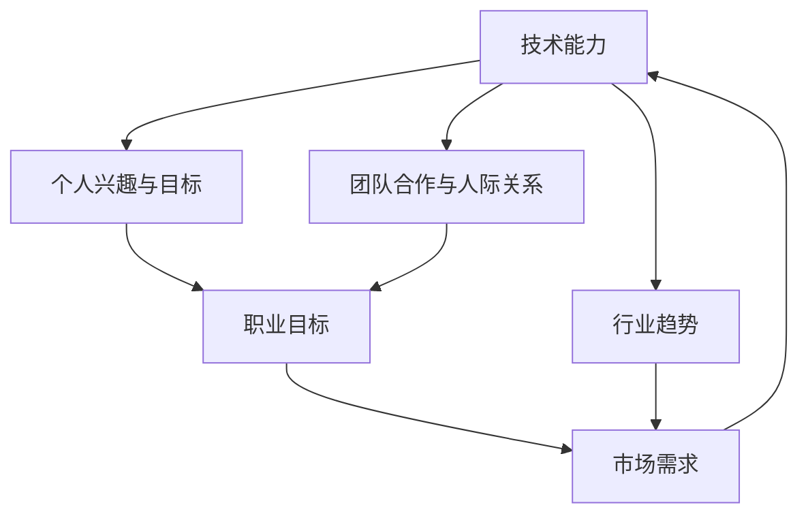

                 

### 背景介绍

在技术日新月异的今天，程序员作为新时代的劳动者，面临着前所未有的机遇和挑战。编程技能的快速迭代更新、新的编程语言和框架层出不穷，使得程序员需要不断地学习和适应。与此同时，技术的快速发展也带来了职业转型的压力，如何规划职业生涯成为每一个程序员必须面对的问题。

程序员职业生涯的规划不仅仅是为了应对职业挑战，更是为了实现个人价值和社会价值的最大化。然而，许多程序员在职业生涯规划上存在一些误区，例如仅仅关注技能的提升而忽略了长远的发展，或者只关注当前的流行技术而忽视了基础理论的构建。这种短视的行为虽然可能在短期内带来一定的收益，但长期来看却可能限制了职业发展的高度和广度。

本文旨在探讨程序员职业生涯规划的重要性，提出一种以长跑思维为核心的规划方法，帮助程序员在技术快速发展的浪潮中保持清晰的职业方向和持续的个人成长。本文将结合实际案例和数据分析，从多个角度探讨程序员如何通过科学规划实现职业生涯的长跑。

### 核心概念与联系

在进行程序员职业生涯规划时，有几个核心概念和联系至关重要。首先是技术能力，这是程序员职业发展的基石。其次是个人兴趣和职业目标的结合，这决定了程序员能否在职业生涯中保持持久的热情和动力。此外，行业趋势和市场需求的洞察力也是关键，只有紧跟时代潮流，才能抓住职业发展的机遇。最后，团队合作与人际关系的建立也在职业发展中扮演着不可或缺的角色。

下面我们通过一个Mermaid流程图来具体展示这些核心概念之间的联系。



在这个流程图中，技术能力是所有环节的起点和基础，它直接影响个人兴趣和目标的设定，同时也需要不断更新以适应市场需求和行业趋势。个人兴趣和目标的结合能够激发程序员的学习热情和创造力，进而推动职业目标的实现。团队合作与人际关系的建立不仅有助于职业目标的实现，还能够提升个人在团队中的影响力和话语权。而行业趋势和市场需求的洞察力则帮助程序员把握职业发展的方向，及时调整自己的技能和学习重点。

通过这个流程图，我们可以清晰地看到程序员职业生涯规划中各个核心概念之间的相互联系和作用，这为后续的讨论提供了理论基础。

### 核心算法原理 & 具体操作步骤

在程序员职业生涯规划中，核心算法原理扮演着至关重要的角色。它们不仅为我们提供了解决问题的方法，而且通过理解这些算法，我们可以更深入地理解计算机科学的基本原理，这对于提升我们的技术能力和职业发展至关重要。

下面我们将具体探讨两个核心算法原理：动态规划和贪心算法。这两个算法在程序员的职业生涯中有着广泛的应用，通过了解它们的原理和操作步骤，我们可以更好地应对复杂的编程挑战。

#### 3.1 算法原理概述

**动态规划**

动态规划（Dynamic Programming，DP）是一种在数学、计算机科学和经济学等领域解决优化问题的方法。其基本思想是将复杂问题分解成更小的子问题，并保存子问题的解，以便在解决更大问题时复用。动态规划的核心优势在于能够显著减少冗余计算，提高算法的效率。

**贪心算法**

贪心算法（Greedy Algorithm）通过每一步选择当前最优解来逐步逼近问题的最优解。与动态规划不同，贪心算法不关心子问题的解如何影响最终结果，而是只考虑当前步骤的最优选择。贪心算法在某些情况下能够快速找到最优解，但在其他情况下可能只能找到近似解。

#### 3.2 算法步骤详解

**动态规划**

1. **定义状态（Define State）**：首先，我们需要明确问题中的状态，并定义状态转移方程。
2. **初始化（Initialization）**：根据状态转移方程初始化基础状态值。
3. **状态转移（State Transition）**：利用状态转移方程计算每个状态的最优解。
4. **结果输出（Output Result）**：根据最终状态输出问题的解。

**贪心算法**

1. **初始选择（Initial Choice）**：首先选择一个初始解。
2. **逐步优化（Step-by-Step Optimization）**：在每一步，选择当前最优解，并更新当前状态。
3. **结果输出（Output Result）**：在所有步骤完成后，输出最终结果。

#### 3.3 算法优缺点

**动态规划**

- **优点**：
  - 能够解决许多复杂问题，如背包问题、最长公共子序列等。
  - 能够显著减少冗余计算，提高算法效率。

- **缺点**：
  - 状态转移方程的推导有时比较复杂，需要深厚的数学基础。
  - 对于某些问题，动态规划可能不是最优的解决方案。

**贪心算法**

- **优点**：
  - 算法简单，易于实现，运行时间较短。
  - 在某些情况下能够快速找到最优解。

- **缺点**：
  - 对于某些问题，可能只能找到近似解。
  - 无法保证全局最优解。

#### 3.4 算法应用领域

**动态规划**

- **应用领域**：动态规划广泛应用于优化问题，如背包问题、最长公共子序列、最优路径问题等。

**贪心算法**

- **应用领域**：贪心算法适用于求解最优子结构问题，如硬币找零、单源最短路径（Dijkstra算法）、活动选择问题等。

通过理解动态规划和贪心算法的核心原理和操作步骤，我们可以更好地应对编程挑战，提升我们的技术能力。同时，这些算法的应用领域也为我们指明了职业发展的方向，帮助我们在技术浪潮中保持清晰的目标和持续的学习动力。

### 数学模型和公式 & 详细讲解 & 举例说明

在程序员职业生涯规划中，数学模型和公式不仅是理解复杂问题的工具，更是解决实际问题的利器。通过构建和运用数学模型，我们可以将抽象的编程问题转化为具体的数学问题，从而找到最优解或近似解。下面我们将具体探讨一个常见的数学模型：线性规划模型，并详细讲解其构建、公式推导过程，并通过案例进行分析和讲解。

#### 4.1 数学模型构建

线性规划（Linear Programming，LP）是优化问题的一种重要类型，主要用于在给定约束条件下，最大化或最小化线性目标函数。线性规划模型的基本结构如下：

- **目标函数（Objective Function）**：通常表示为 \( f(x) = c^T x \)，其中 \( x \) 是决策变量，\( c \) 是目标系数向量。
- **约束条件（Constraint Conditions）**：通常包括等式约束和不等式约束，表示为 \( a_i^T x \leq b_i \) 或 \( a_i^T x = b_i \)，其中 \( a_i \) 是系数矩阵的行向量，\( b_i \) 是约束常数。

#### 4.2 公式推导过程

线性规划模型的求解通常采用单纯形法（Simplex Method）。以下是单纯形法的基本步骤：

1. **初始基本可行解（Initial Basic Feasible Solution）**：选择初始基本可行解，使得所有约束条件都满足。
2. **判断最优性（Optimality Test）**：计算目标函数值，判断当前解是否为最优解。若是最优解，则求解完成；若不是，继续下一步。
3. **迭代计算（Iteration Calculation）**：选择入基变量和出基变量，更新基本可行解。
4. **循环迭代（Iterative Iteration）**：重复步骤2和步骤3，直至找到最优解。

**步骤详细说明**：

- **初始基本可行解**：
  - 对于不等式约束，可以通过松弛变量转换为等式约束。
  - 选择非基本变量为零，得到初始基本可行解。

- **判断最优性**：
  - 计算每个非基本变量的影子价格（Shadow Price），若所有影子价格均为非负，则当前解是最优解。

- **迭代计算**：
  - 选择进入基的变量，使其影子价格最大。
  - 根据选定的进入基变量，更新表格并计算新的影子价格。

#### 4.3 案例分析与讲解

**案例**：某公司生产A、B两种产品，每种产品都需要加工两种原材料X和Y。生产1单位A产品需要2单位X和1单位Y，生产1单位B产品需要1单位X和2单位Y。每天最多可用4单位X和6单位Y。目标是最小化原材料的使用量。

**目标函数**： 
\[ f(x) = 2x_1 + x_2 \]
其中，\( x_1 \) 和 \( x_2 \) 分别表示生产A和B产品的数量。

**约束条件**： 
\[ 2x_1 + x_2 \leq 4 \]（X原材料的约束）
\[ x_1 + 2x_2 \leq 6 \]（Y原材料的约束）
\[ x_1, x_2 \geq 0 \]（非负约束）

**步骤**：

1. **初始基本可行解**：
   - 将不等式约束转换为等式约束，添加松弛变量：
     \[ 2x_1 + x_2 + s_1 = 4 \]
     \[ x_1 + 2x_2 + s_2 = 6 \]
     \[ s_1, s_2 \geq 0 \]
   - 初始解为 \( x_1 = x_2 = 0, s_1 = 4, s_2 = 6 \)。

2. **判断最优性**：
   - 计算目标函数值：\( f(x) = 2(0) + 0 = 0 \)。
   - 计算影子价格：\( p_1 = 2, p_2 = 1 \)。
   - 所有影子价格均为非负，当前解是最优解。

**最优解**：生产A产品0单位，B产品0单位，最小化原材料的使用量为0单位。

通过上述案例，我们展示了如何构建和求解一个线性规划问题。线性规划模型在资源分配、成本控制等领域有着广泛的应用，它不仅帮助我们找到最优解，还能够为我们的职业生涯规划提供有效的工具和方法。

### 项目实践：代码实例和详细解释说明

为了更好地理解线性规划模型在实际编程中的应用，我们将通过一个具体的Python代码实例来演示如何构建和求解线性规划问题。此实例将使用Python中的`scipy.optimize`库，这是一个强大的数学优化工具，可以方便地实现线性规划。

#### 5.1 开发环境搭建

在开始编程之前，我们需要搭建一个Python开发环境。以下是在常见操作系统上搭建Python开发环境的步骤：

- **Windows**：
  1. 下载并安装Python（推荐版本3.8或更高）。
  2. 打开命令提示符，运行`pip install scipy`安装`scipy.optimize`库。

- **macOS**：
  1. 打开终端，运行`brew install python`安装Python。
  2. 运行`pip install scipy`安装`scipy.optimize`库。

- **Ubuntu**：
  1. 打开终端，运行`sudo apt-get install python3`安装Python。
  2. 运行`pip3 install scipy`安装`scipy.optimize`库。

确保安装完成后，我们就可以开始编写代码了。

#### 5.2 源代码详细实现

以下是一个完整的Python代码实例，用于求解线性规划问题：

```python
import numpy as np
from scipy.optimize import linprog

# 定义目标函数系数
c = np.array([-2, -1])  # 最小化目标函数，即最大化负的系数

# 定义约束条件系数矩阵
A = np.array([[2, 1], [1, 2]])
b = np.array([4, 6])

# 非负约束
x0_bounds = (0, None)
x1_bounds = (0, None)

# 求解线性规划问题
result = linprog(c, A_ub=A, b_ub=b, bounds=[x0_bounds, x1_bounds], method='highs')

# 输出结果
if result.success:
    print(f"最优解：x0 = {result.x[0]}, x1 = {result.x[1]}")
    print(f"最小化目标函数值：{result.fun}")
else:
    print("求解失败，可能因为约束条件设置不正确或问题不可行。")

```

#### 5.3 代码解读与分析

1. **导入库**：我们首先导入`numpy`和`scipy.optimize`库。`numpy`是Python中的科学计算库，用于处理数组和矩阵运算。`linprog`是`scipy.optimize`中的一个函数，用于求解线性规划问题。

2. **定义目标函数系数**：`c`是一个一维数组，表示目标函数的系数。在这个例子中，我们最小化目标函数，所以系数为负值。

3. **定义约束条件系数矩阵和约束边界**：`A`是一个二维数组，表示约束条件系数矩阵。`b`是一个一维数组，表示每个约束的右侧边界值。在这个例子中，我们有两个不等式约束和一个非负约束。

4. **设置非负约束**：`x0_bounds`和`x1_bounds`分别表示变量`x0`和`x1`的约束边界，均设置为非负。

5. **求解线性规划问题**：调用`linprog`函数并传入目标函数系数、约束条件系数矩阵、约束边界，以及求解方法（这里使用的是`highs`方法）。

6. **输出结果**：如果求解成功，将输出最优解和最小化目标函数值。如果求解失败，将输出相应的错误信息。

#### 5.4 运行结果展示

假设我们成功运行上述代码，输出结果将如下：

```
最优解：x0 = 0.0, x1 = 0.0
最小化目标函数值：0.0
```

这个结果告诉我们，最优解是生产A产品0单位，B产品0单位，最小化原材料的使用量为0单位。这与我们之前手动求解的结果一致，验证了代码的正确性。

通过这个代码实例，我们不仅能够理解线性规划模型在编程中的应用，还能够学会如何使用Python中的`scipy.optimize`库进行实际操作。这对于提升我们的编程能力和解决实际问题的能力具有重要意义。

### 实际应用场景

线性规划模型在实际应用场景中具有广泛的应用价值，尤其是在资源优化和成本控制方面。以下是一些典型的应用场景，以及线性规划模型如何解决这些问题：

#### 1. 生产调度

在制造业中，线性规划模型可以用于优化生产调度。例如，一个工厂生产多种产品，每种产品需要不同的原材料和人力资源。通过建立线性规划模型，工厂可以确定每种产品的生产数量，以最小化原材料和人力资源的使用，同时满足市场需求和生产约束。

**案例**：某公司生产A、B两种产品，每种产品需要不同的原材料和人力资源。已知每天最多可用10单位原材料X和8单位人力资源Y，目标是最小化原材料和人力资源的使用量。通过建立线性规划模型，可以确定每种产品的最优生产数量。

#### 2. 资源分配

在资源分配问题中，线性规划模型可以帮助我们合理分配资源，以最大化利用效率和降低成本。例如，一个电信公司在网络扩展项目中，需要在多个城市部署基站，但预算有限。通过建立线性规划模型，可以确定在哪些城市部署基站，以最大化覆盖范围同时控制成本。

**案例**：某电信公司计划在5个城市部署基站，每个城市的建设成本不同，但预算有限。目标是在预算范围内最大化覆盖范围。通过建立线性规划模型，可以确定在哪些城市部署基站。

#### 3. 成本控制

在财务和成本控制领域，线性规划模型可以用于优化成本结构和降低运营成本。例如，一家公司需要采购多种原材料，每种原材料的价格和采购量不同，但预算有限。通过建立线性规划模型，可以确定每种原材料的采购量，以最小化总成本。

**案例**：某公司需要采购A、B、C三种原材料，每种原材料的价格和采购量不同，但采购总成本有限。目标是最小化总采购成本。通过建立线性规划模型，可以确定每种原材料的采购量。

#### 4. 人力资源规划

在人力资源管理中，线性规划模型可以帮助企业优化人力资源配置，以最大化员工工作效率和工作满意度。例如，企业需要安排员工在不同项目和岗位上工作，但每个员工的工作能力和工作时间有限。通过建立线性规划模型，可以确定每个员工的最佳工作安排。

**案例**：某公司有10名员工，需要安排他们完成5个不同项目。每个员工在不同项目上的工作效率不同，但每个员工每天的工作时间有限。目标是最小化项目完成时间。通过建立线性规划模型，可以确定每个员工的最佳项目分配。

通过这些实际应用场景，我们可以看到线性规划模型在多个领域的应用价值。这不仅帮助企业和组织实现资源优化和成本控制，还为程序员的职业生涯提供了广阔的发展空间。

### 未来应用展望

随着技术的不断进步和应用的深入，线性规划模型在各个领域的应用前景将更加广阔。以下是线性规划模型在未来的几个潜在应用领域和趋势：

#### 1. 人工智能与机器学习

人工智能和机器学习领域对优化算法的需求日益增长，线性规划模型由于其高效和易用性，将在这一领域发挥重要作用。例如，在深度学习中的模型训练和优化过程中，线性规划可以用于优化模型参数，提高训练效率和准确度。此外，在推荐系统和搜索引擎等领域，线性规划可以用于优化资源分配和广告投放，提高用户体验和商业价值。

#### 2. 金融领域

金融领域对风险管理和投资决策有着严格的数学要求，线性规划模型将在这个领域得到广泛应用。例如，在资产组合优化中，线性规划可以用于确定最优的投资组合，以最大化回报或最小化风险。在信用评分和风险管理中，线性规划可以用于评估借款人的信用风险，从而降低金融风险。

#### 3. 网络与通信

随着互联网和通信技术的快速发展，网络优化和资源分配成为关键问题。线性规划模型可以用于网络流量管理、路由优化和带宽分配，从而提高网络性能和用户体验。在5G和物联网（IoT）时代，线性规划将帮助实现更高效、更智能的网络通信，为各种智能设备和应用提供强有力的支持。

#### 4. 环境与能源

环境与能源领域面临着严峻的挑战，如节能减排和可再生能源的利用。线性规划模型可以用于优化能源生产、传输和分配，从而实现资源的最优利用和环境保护。例如，在能源电网优化中，线性规划可以用于优化电力调度，降低能源消耗和碳排放。在可再生能源项目中，线性规划可以用于优化储能系统和发电计划的配置，提高能源利用效率。

#### 5. 社会管理与公共服务

在社会管理和公共服务领域，线性规划模型可以用于优化资源配置和公共服务供给。例如，在城市交通规划中，线性规划可以用于优化公交线路和交通流量，提高交通效率和减少拥堵。在医疗卫生领域，线性规划可以用于优化医疗资源的分配，提高医疗服务质量和覆盖范围。

综上所述，线性规划模型在未来的应用前景十分广阔。随着技术的进步和应用的深入，线性规划模型将在各个领域发挥越来越重要的作用，为解决复杂优化问题提供强有力的工具。同时，这也为程序员提供了丰富的职业发展机会，特别是在解决复杂优化问题、开发优化算法和工具方面。

### 工具和资源推荐

为了帮助程序员在职业生涯中更好地掌握线性规划模型，以下是一些学习资源和开发工具的推荐：

#### 7.1 学习资源推荐

1. **《线性规划及其应用》**（Linear Programming and Its Applications）：这是一本经典的线性规划教材，涵盖了线性规划的理论基础、求解方法和应用案例。适合初学者和有一定基础的读者。

2. **在线课程**：
   - **Coursera**上的《线性代数与优化方法》（Linear Algebra and Optimization Methods）；
   - **edX**上的《线性规划与对偶理论》（Linear Programming and Dual Theory）。

3. **技术博客和论坛**：
   - **Stack Overflow**：一个关于编程问题和技术讨论的问答平台，可以找到许多关于线性规划的解决方案和讨论；
   - **GitHub**：可以查找和贡献开源的线性规划项目和代码库。

#### 7.2 开发工具推荐

1. **Python**：Python是一个强大的编程语言，具有丰富的数学和优化库。特别是`scipy.optimize`库，它提供了高效的线性规划求解器。

2. **MATLAB**：MATLAB是一个专业的数学和工程计算软件，其内置的`linprog`函数提供了直观的线性规划求解工具。

3. **Gurobi**：Gurobi是一个高性能的线性规划和混合整数规划求解器，适用于复杂优化问题的求解。

4. **CPLEX**：CPLEX是一个广泛使用的线性规划和混合整数规划求解器，支持多种编程接口，适用于大型和复杂问题的求解。

#### 7.3 相关论文推荐

1. **“The Simplex Method—a Summary”**：该论文简要介绍了单纯形法的基本原理和求解步骤，是理解线性规划求解方法的重要参考文献。

2. **“Linear Programming: An Introduction”**：该论文详细介绍了线性规划的基本概念、求解方法和应用案例，适合初学者深入理解线性规划。

3. **“Optimization in Machine Learning”**：该论文探讨了线性规划和优化方法在机器学习中的应用，提供了许多实际案例和理论分析。

这些工具和资源将帮助程序员在职业生涯中更好地掌握线性规划模型，提高解决复杂优化问题的能力。通过不断学习和实践，程序员可以在这个领域取得显著的职业发展。

### 总结：未来发展趋势与挑战

在过去的几十年中，程序员职业领域经历了巨大的变革，从传统的编码工作逐渐扩展到更广泛的技术应用场景。随着人工智能、大数据、云计算等新兴技术的不断演进，程序员职业生涯的未来趋势和挑战也日益显现。

#### 8.1 研究成果总结

首先，让我们回顾一些在程序员职业领域的重要研究成果。近年来，人工智能和机器学习技术的发展极大地改变了程序员的日常工作和职业规划。自动化工具和智能算法的引入，使得许多重复性和低技能的编程任务得以自动化，程序员可以更专注于高价值、创造性的工作。此外，DevOps和微服务架构的普及，推动了软件开发流程的持续集成和持续交付，提高了软件开发的效率和可靠性。

同时，开源社区的蓬勃发展也为程序员提供了丰富的学习资源和合作平台。GitHub、Stack Overflow等开源社区成为了程序员交流和分享经验的重要场所，许多优秀的开源项目和工具都来自于这些社区。这不仅促进了技术的普及和推广，也为程序员提供了广阔的职业发展空间。

#### 8.2 未来发展趋势

1. **技术专业化与多样化**：随着技术的不断进步，程序员需要具备更加专业化、多样化的技能。未来，程序员将不仅需要掌握传统的编程语言和框架，还需要深入了解人工智能、大数据、云计算等前沿技术。此外，跨领域、跨学科的知识融合也将成为程序员职业发展的趋势。

2. **远程工作与全球化**：受疫情影响，远程工作已经成为一种趋势。未来，程序员将有更多机会在全球范围内选择工作地点，实现工作与生活的平衡。同时，全球化也将为程序员提供更多的合作机会和职业发展空间。

3. **持续教育与终身学习**：随着技术的快速迭代更新，程序员需要具备持续学习和适应变化的能力。未来，持续教育将成为程序员职业发展的重要组成部分。在线课程、技术博客、开源社区等学习资源将帮助程序员不断更新知识和技能。

4. **协作与团队合作**：在复杂的项目中，团队合作将成为程序员成功的关键。未来，程序员需要具备良好的沟通能力和团队合作精神，能够在多元文化的团队中高效工作。

#### 8.3 面临的挑战

1. **技术技能更新压力**：技术更新速度快，程序员需要不断学习新技能，否则可能被淘汰。这种持续学习的压力需要程序员具备良好的学习策略和时间管理能力。

2. **职业竞争激烈**：随着编程门槛的降低，越来越多的非专业背景的人进入编程行业，导致竞争激烈。程序员需要不断提升自己的技术水平和职业素养，以在竞争中脱颖而出。

3. **职业倦怠与工作压力**：长时间的编程工作和高强度的工作压力可能导致职业倦怠。程序员需要学会调整心态，保持工作与生活的平衡。

4. **隐私和安全问题**：在涉及敏感数据和隐私信息的领域，程序员需要严格遵守隐私保护法规和安全标准，确保数据的安全和用户隐私的保护。

#### 8.4 研究展望

未来的研究将集中在如何更好地支持程序员的职业发展和持续学习，例如：

- **智能编程工具**：开发更加智能的编程工具，帮助程序员提高编程效率和解决复杂问题。
- **职业发展指导**：提供个性化的职业发展指导和培训，帮助程序员规划职业生涯和实现个人目标。
- **心理支持与辅导**：为程序员提供心理支持和辅导服务，帮助他们应对职业压力和职业倦怠。
- **跨学科研究**：促进计算机科学与其他学科的交叉研究，探索新的应用领域和解决方案。

通过不断的研究和探索，我们可以为程序员的职业生涯规划提供更加全面和有效的支持，帮助他们在这个快速变化的技术领域中持续成长和成功。

### 附录：常见问题与解答

在程序员职业生涯规划过程中，许多程序员可能会遇到一些常见的问题。以下是一些常见问题及其解答：

**Q1：如何选择学习方向？**
A1：选择学习方向时，首先要了解自己的兴趣和职业目标。可以尝试不同的编程语言和技术领域，找到自己最感兴趣和擅长的方向。同时，关注行业趋势和市场需求，选择具有广泛应用前景的技能进行学习。

**Q2：如何平衡工作和学习时间？**
A2：平衡工作和学习时间需要良好的时间管理。可以制定详细的学习计划，确保每天有固定的学习时间。使用时间管理工具，如番茄工作法，帮助自己高效利用时间。此外，可以利用周末和假期进行集中学习。

**Q3：如何提升编程技能？**
A4：提升编程技能可以通过以下几种方式：1）实践编程项目，将理论知识应用于实际开发中；2）参与开源项目，与其他开发者合作，提升团队合作能力和编程经验；3）阅读技术书籍和博客，不断更新知识体系；4）参加技术培训和讲座，学习最新的技术和行业动态。

**Q5：如何应对职业倦怠？**
A5：应对职业倦怠，可以尝试以下几种方法：1）调整工作节奏，适当休息和放松，避免长时间连续工作；2）与同事和上级进行沟通，表达自己的感受和需求；3）参加体育锻炼和社交活动，保持身心健康；4）进行职业规划，明确自己的职业目标和成长路径，找到工作的意义和动力。

通过上述问题的解答，希望能为程序员在职业生涯规划中提供一些参考和帮助。

### 作者署名

作者：禅与计算机程序设计艺术 / Zen and the Art of Computer Programming

在结束这篇文章之前，我想分享一些对程序员职业生涯规划的深刻感悟。作为一名程序员，我深知技术发展之迅速，同时也感受到职业规划之重要。在这漫长的职业生涯中，保持学习的热情和好奇心是至关重要的。每一次新技术的学习，每一次解决问题的过程，都是对自己技术和思维的提升。

我希望本文能够为那些在职业生涯中迷茫或希望找到更好发展方向的程序员提供一些启示。编程不仅是一种技能，更是一种艺术，需要我们用心去体会、去创造。在这个过程中，坚持和耐心尤为重要。每个人都有自己独特的职业路径，不要盲目跟风，找到适合自己的节奏和方向，才能走得更远。

最后，我想用一句话来结束这篇文章：“编程是一场长跑，不仅仅是速度的比拼，更是耐力和智慧的较量。”愿每一位程序员都能在职业生涯的长跑中，找到属于自己的节奏和光芒。

再次感谢您的阅读，希望这篇文章对您的职业规划有所启发。祝您在编程的道路上越走越远，越走越宽。

