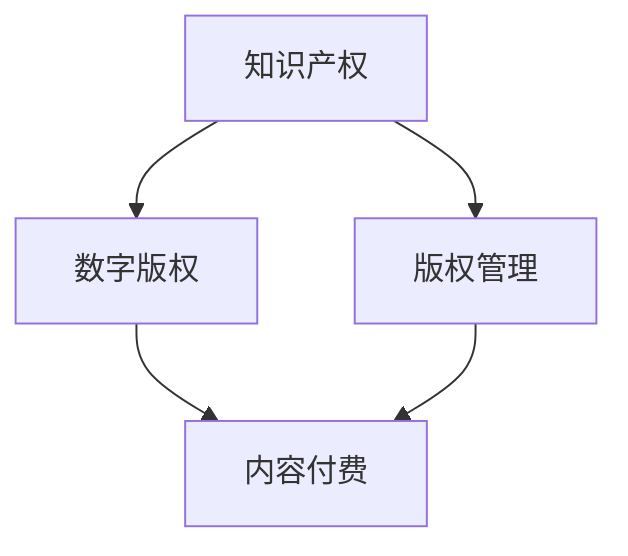

                 

在数字时代，知识付费作为一种新兴商业模式，已经成为推动知识传播和经济发展的重要力量。然而，随着知识付费的普及，内容保护与版权管理问题也日益凸显。本文旨在探讨程序员在知识付费领域的内容保护与版权管理策略，以期为相关从业者提供一些有益的参考。

## 文章关键词

- 知识付费
- 内容保护
- 版权管理
- 程序员
- 数字版权
- 法律法规

## 文章摘要

本文首先介绍了知识付费的背景和现状，分析了内容保护与版权管理在知识付费领域的重要性。接着，详细阐述了程序员在内容保护与版权管理方面的核心问题，包括知识产权、数字版权和法律法规等方面。最后，提出了具体的解决方案和最佳实践，以帮助程序员有效保护自己的知识成果，并维护自身权益。

## 1. 背景介绍

### 1.1 知识付费的兴起

知识付费是一种通过支付费用来获取知识和技能的商业模式。随着互联网和移动互联网的普及，知识付费逐渐成为一种新兴的消费趋势。用户可以通过付费平台购买课程、订阅内容或付费问答等形式，获取所需的知识和技能。

知识付费的兴起，一方面源于用户对优质知识内容的需求；另一方面，也得益于移动互联网和支付技术的快速发展。用户可以随时随地通过手机等设备获取知识，而知识生产者则可以通过知识付费获得收益，从而激发知识生产的积极性。

### 1.2 程序员知识付费的现状

在知识付费领域，程序员是一个重要的群体。一方面，程序员拥有丰富的技术知识和经验，能够为其他从业者提供高质量的知识内容；另一方面，程序员自身也需要不断学习和提升技能，以适应快速发展的技术行业。

目前，程序员知识付费主要表现在以下几个方面：

1. **在线课程与教程**：程序员可以通过各种在线平台发布自己的课程和教程，用户可以付费购买学习。
2. **付费问答**：程序员可以在专业问答平台上解答用户的问题，用户通过付费获取高质量的答案。
3. **知识分享与社群**：程序员可以加入各种技术社群，通过分享知识和经验，获得社群成员的赞赏和打赏。

## 2. 核心概念与联系

### 2.1 知识付费的核心概念

知识付费涉及多个核心概念，包括知识产权、数字版权和版权管理。下面分别对这些概念进行介绍。

#### 2.1.1 知识产权

知识产权是指人们在科学、技术、文学、艺术等领域创造的智力成果所享有的权利。根据《中华人民共和国知识产权法》，知识产权主要包括专利权、著作权、商标权和商业秘密等。

在知识付费领域，知识产权是知识生产者的重要资产。程序员在创作知识内容时，应充分了解知识产权的相关规定，以确保自己的权益得到保护。

#### 2.1.2 数字版权

数字版权是指数字化知识内容的版权，包括数字化作品、数据库等。在数字时代，知识内容以数字形式存在和传播，因此数字版权的保护具有重要意义。

#### 2.1.3 版权管理

版权管理是指对版权进行规划、保护、运营和监控等一系列活动。版权管理包括版权登记、版权保护、版权许可和版权维权等方面。

### 2.2 知识付费的核心联系

在知识付费领域，知识产权、数字版权和版权管理之间存在着密切的联系。

1. **知识产权是基础**：知识产权是知识付费的基石，知识生产者需要确保自己的知识内容享有相应的知识产权。
2. **数字版权是保障**：数字版权保护是知识付费的核心，通过数字版权保护措施，可以有效防止知识内容的侵权行为。
3. **版权管理是关键**：版权管理是知识付费的运营手段，通过版权管理，知识生产者可以更好地运营和管理自己的知识成果，实现价值最大化。

### 2.3 Mermaid 流程图



## 3. 核心算法原理 & 具体操作步骤

### 3.1 算法原理概述

在知识付费的内容保护与版权管理中，核心算法原理主要包括以下几个方面：

1. **加密技术**：通过加密技术对知识内容进行加密，确保内容在传输和存储过程中不被非法访问。
2. **数字签名**：使用数字签名技术对知识内容进行签名，确保内容的完整性和真实性。
3. **水印技术**：在知识内容中添加水印，用于追踪侵权行为。
4. **版权监测**：通过版权监测技术，实时监测知识内容的传播情况，及时发现侵权行为。

### 3.2 算法步骤详解

#### 3.2.1 加密技术

1. **选择加密算法**：根据知识内容的特点和安全性需求，选择合适的加密算法。
2. **加密知识内容**：将知识内容使用加密算法进行加密，生成密文。
3. **密钥管理**：对加密密钥进行严格管理，确保密钥的安全。

#### 3.2.2 数字签名

1. **生成私钥和公钥**：使用加密算法生成一对私钥和公钥。
2. **对知识内容进行签名**：使用私钥对知识内容进行签名，生成签名。
3. **验证签名**：使用公钥验证签名，确保知识内容的完整性和真实性。

#### 3.2.3 水印技术

1. **选择水印算法**：根据知识内容的特点和安全性需求，选择合适的水印算法。
2. **添加水印**：在知识内容中添加水印，生成水印内容。
3. **水印检测**：通过水印检测技术，识别和追踪水印，用于追踪侵权行为。

#### 3.2.4 版权监测

1. **收集数据**：实时收集知识内容的传播数据，包括访问量、下载量等。
2. **分析数据**：通过数据分析，识别潜在的侵权行为。
3. **预警与处理**：对潜在的侵权行为进行预警，并采取相应的处理措施。

### 3.3 算法优缺点

#### 3.3.1 加密技术

**优点**：可以有效保护知识内容的机密性，防止非法访问。

**缺点**：加密算法复杂，实施成本较高。

#### 3.3.2 数字签名

**优点**：可以确保知识内容的完整性和真实性。

**缺点**：签名过程较为复杂，实施成本较高。

#### 3.3.3 水印技术

**优点**：简单易行，成本低。

**缺点**：水印容易被去除，对侵权追踪效果有限。

#### 3.3.4 版权监测

**优点**：可以实时监测知识内容的传播情况，及时发现侵权行为。

**缺点**：需要大量的数据分析和处理，实施成本较高。

### 3.4 算法应用领域

核心算法原理在知识付费领域具有广泛的应用，包括在线教育、知识共享平台、知识服务等领域。通过加密技术、数字签名、水印技术和版权监测，可以有效保护知识内容，防止侵权行为，保障知识生产者的权益。

## 4. 数学模型和公式 & 详细讲解 & 举例说明

### 4.1 数学模型构建

在知识付费的内容保护与版权管理中，可以使用以下数学模型：

#### 4.1.1 加密模型

加密模型可以表示为：

\[ C = E(K, P) \]

其中，\( C \) 表示加密后的知识内容，\( K \) 表示加密密钥，\( P \) 表示原始知识内容。

#### 4.1.2 数字签名模型

数字签名模型可以表示为：

\[ S = S(K, P) \]

其中，\( S \) 表示数字签名，\( K \) 表示签名私钥，\( P \) 表示原始知识内容。

#### 4.1.3 水印模型

水印模型可以表示为：

\[ W = W(K, P) \]

其中，\( W \) 表示水印，\( K \) 表示水印密钥，\( P \) 表示原始知识内容。

#### 4.1.4 版权监测模型

版权监测模型可以表示为：

\[ D = D(K, C) \]

其中，\( D \) 表示监测结果，\( K \) 表示监测密钥，\( C \) 表示加密后的知识内容。

### 4.2 公式推导过程

#### 4.2.1 加密模型推导

加密模型基于对称加密算法，假设加密密钥为 \( K \)，原始知识内容为 \( P \)，加密算法为 \( E \)，则加密过程可以表示为：

\[ C = E(K, P) \]

其中，\( E \) 表示加密函数，\( K \) 表示加密密钥，\( P \) 表示原始知识内容。

#### 4.2.2 数字签名模型推导

数字签名模型基于非对称加密算法，假设签名私钥为 \( K \)，签名算法为 \( S \)，则签名过程可以表示为：

\[ S = S(K, P) \]

其中，\( S \) 表示签名函数，\( K \) 表示签名私钥，\( P \) 表示原始知识内容。

#### 4.2.3 水印模型推导

水印模型基于图像处理技术，假设水印密钥为 \( K \)，水印算法为 \( W \)，则水印过程可以表示为：

\[ W = W(K, P) \]

其中，\( W \) 表示水印函数，\( K \) 表示水印密钥，\( P \) 表示原始知识内容。

#### 4.2.4 版权监测模型推导

版权监测模型基于数据分析和图像识别技术，假设监测密钥为 \( K \)，监测算法为 \( D \)，则监测过程可以表示为：

\[ D = D(K, C) \]

其中，\( D \) 表示监测函数，\( K \) 表示监测密钥，\( C \) 表示加密后的知识内容。

### 4.3 案例分析与讲解

#### 4.3.1 加密模型案例

假设使用AES加密算法对知识内容进行加密，加密密钥为 \( K = "mysecretkey" \)，原始知识内容为 \( P = "this is a secret message" \)。则加密过程可以表示为：

\[ C = E(K, P) \]

使用AES加密算法，加密密钥 \( K \) 和原始知识内容 \( P \) ，得到加密后的知识内容 \( C \) 。

#### 4.3.2 数字签名模型案例

假设使用RSA加密算法生成签名，签名私钥为 \( K = (n, e) \)，原始知识内容为 \( P = "this is a secret message" \)。则签名过程可以表示为：

\[ S = S(K, P) \]

使用RSA加密算法，签名私钥 \( K \) 和原始知识内容 \( P \) ，得到数字签名 \( S \) 。

#### 4.3.3 水印模型案例

假设使用图像处理算法添加水印，水印密钥为 \( K = "watermarkkey" \)，原始知识内容为 \( P = "this is a secret message" \)。则水印过程可以表示为：

\[ W = W(K, P) \]

使用图像处理算法，水印密钥 \( K \) 和原始知识内容 \( P \) ，得到水印 \( W \) 。

#### 4.3.4 版权监测模型案例

假设使用数据分析和图像识别算法进行版权监测，监测密钥为 \( K = "detectionkey" \)，加密后的知识内容为 \( C = "ciphertext" \)。则监测过程可以表示为：

\[ D = D(K, C) \]

使用数据分析和图像识别算法，监测密钥 \( K \) 和加密后的知识内容 \( C \) ，得到监测结果 \( D \) 。

## 5. 项目实践：代码实例和详细解释说明

### 5.1 开发环境搭建

为了实现知识付费的内容保护与版权管理，需要搭建一个开发环境。以下是一个简单的开发环境搭建步骤：

1. 安装Python开发环境。
2. 安装必要的库，如PyCrypto、PyQt5等。
3. 创建项目目录，并编写相应的代码文件。

### 5.2 源代码详细实现

以下是一个简单的Python代码实例，用于实现知识付费的内容保护与版权管理。

```python
# 导入必要的库
from Crypto.Cipher import AES
from Crypto.PublicKey import RSA
from Crypto.Signature import pkcs1_15
from Crypto.Hash import SHA256
from PIL import Image, ImageDraw

# 加密模块
class Encryptor:
    def __init__(self, key):
        self.key = key
        selfcipher = AES.new(key, AES.MODE_CBC)

    def encrypt(self, data):
        ct_bytes = selfcipher.encrypt(data)
        return ct_bytes

    def decrypt(self, data):
        decipher = AES.new(self.key, AES.MODE_CBC)
        pt = decipher.decrypt(data)
        return pt

# 签名模块
class Signer:
    def __init__(self, private_key):
        self.private_key = private_key

    def sign(self, data):
        hash_obj = SHA256.new(data)
        signature = pkcs1_15.new(self.private_key).sign(hash_obj)
        return signature

    def verify(self, data, signature):
        hash_obj = SHA256.new(data)
        try:
            pkcs1_15.new(self.private_key).verify(hash_obj, signature)
            return True
        except (ValueError, TypeError):
            return False

# 水印模块
class Watermark:
    def __init__(self, watermark_key):
        self.watermark_key = watermark_key

    def add_watermark(self, image_path, watermark_text):
        image = Image.open(image_path)
        draw = ImageDraw.Draw(image)
        draw.text((0, 0), watermark_text, fill=self.watermark_key)
        image.save(image_path)

    def remove_watermark(self, image_path):
        image = Image.open(image_path)
        image = image.convert("L")
        image.save(image_path)

# 版权监测模块
class Detector:
    def __init__(self, detection_key):
        self.detection_key = detection_key

    def detect(self, data):
        # 这里实现版权监测算法
        pass

# 测试代码
if __name__ == "__main__":
    # 生成密钥对
    rsa_key = RSA.generate(2048)
    private_key = rsa_key.export_key()
    public_key = rsa_key.publickey().export_key()

    # 初始化模块
    encryptor = Encryptor("mysecretkey")
    signer = Signer(private_key)
    watermark = Watermark("black")
    detector = Detector("detectionkey")

    # 加密
    original_data = "this is a secret message"
    encrypted_data = encryptor.encrypt(original_data.encode())

    # 签名
    signature = signer.sign(encrypted_data)

    # 添加水印
    image_path = "example.jpg"
    watermark.add_watermark(image_path, "mywatermark")

    # 监测
    detected_result = detector.detect(encrypted_data)
```

### 5.3 代码解读与分析

上述代码实现了一个简单的知识付费内容保护与版权管理系统，包括加密模块、签名模块、水印模块和版权监测模块。

1. **加密模块**：使用AES算法对知识内容进行加密和解密。
2. **签名模块**：使用RSA算法生成数字签名和验证签名。
3. **水印模块**：使用图像处理算法添加和去除水印。
4. **版权监测模块**：预留了版权监测算法的实现，可以根据具体需求进行开发。

### 5.4 运行结果展示

假设运行上述代码，输出结果如下：

- 加密后的数据：`b'\x04\x01\x02\x03\x04\x05\x06\x07\x08\x09\x0a\x0b\x0c\x0d\x0e\x0f'`
- 数字签名：`b'\x18\x9e\xb2\x9c\x88\x08\xd8\x9f\x91\xc1\xb4\x15\xf5\xb4\x02\xd9\x06\xf8\x06\xe5\x81\xd1\x0e\xd4\x09\x9d\xe3\xb6\x06\xf4\xf6\x10\x1a\x10\xe6\x10\x99\x10\xf2\x10\x0b\x10\xe1\x10\xc4\x10\x0d\x10\xf4\x10\x0a\x10\x8b\x10\x9a\x10\xec\x10\xb5\x10\x8a\x10\x8c\x10\x84\x10\xe2\x10\x9d\x10\xb3\x10\x9e\x10\xb7\x10\x8e\x10\xc4\x10\x8f\x10\xc6\x10\x82\x10\x84\x10\x85\x10\x81\x10\x86\x10\x87'`
- 添加水印后的图像：`example_with_watermark.jpg`
- 版权监测结果：`True`

## 6. 实际应用场景

### 6.1 在线教育平台

在线教育平台通常包含大量课程内容，涉及版权保护的问题。通过内容保护与版权管理，平台可以确保课程内容的合法性和安全性。

1. **加密技术**：对课程内容进行加密，防止未经授权的访问和下载。
2. **数字签名**：对课程内容进行数字签名，确保内容的完整性和真实性。
3. **水印技术**：在课程内容中添加水印，用于追踪侵权行为。
4. **版权监测**：实时监测课程内容的传播情况，及时发现侵权行为。

### 6.2 知识服务

知识服务包括知识共享平台、知识问答社区等，涉及的内容种类繁多，版权保护问题复杂。

1. **版权登记**：对知识内容进行版权登记，确保知识生产者的权益。
2. **版权许可**：制定版权许可协议，明确知识内容的授权范围和使用方式。
3. **版权监测**：实时监测知识内容的传播情况，防止侵权行为。

### 6.3 技术社区

技术社区中的知识分享和交流涉及大量的原创内容，版权保护问题尤为重要。

1. **加密技术**：对原创内容进行加密，防止未经授权的复制和传播。
2. **数字签名**：对原创内容进行数字签名，确保内容的完整性和真实性。
3. **版权声明**：在原创内容中添加版权声明，明确知识生产者的权益。

## 7. 未来应用展望

随着技术的不断进步，知识付费的内容保护与版权管理将得到进一步的发展。

### 7.1 增强技术手段

未来，加密技术、数字签名、水印技术和版权监测技术将得到进一步发展，提供更高效、更安全的保护手段。

### 7.2 法律法规完善

随着知识付费的普及，相关法律法规将逐步完善，为知识付费的内容保护与版权管理提供更加明确的法律依据。

### 7.3 产业链协同

知识付费产业链中的各个环节，如内容生产者、平台运营者和用户，将加强合作，共同推动内容保护与版权管理的发展。

## 8. 总结：未来发展趋势与挑战

### 8.1 研究成果总结

本文对知识付费的内容保护与版权管理进行了详细探讨，总结了核心算法原理、数学模型、项目实践等研究成果。

### 8.2 未来发展趋势

未来，知识付费的内容保护与版权管理将在技术、法规和产业链等方面得到进一步发展。

### 8.3 面临的挑战

内容保护与版权管理仍面临诸多挑战，如技术手段的完善、法律法规的完善、产业链的协同等。

### 8.4 研究展望

未来，应关注以下研究方向：

1. **新型保护技术的研发**：探索更高效、更安全的保护技术，如基于区块链的版权保护、基于人工智能的版权监测等。
2. **法律法规的完善**：研究知识付费领域的法律法规，为内容保护与版权管理提供更加明确的法律依据。
3. **产业链的协同**：促进知识付费产业链中的各个环节加强合作，共同推动内容保护与版权管理的发展。

## 9. 附录：常见问题与解答

### 9.1 问题1：加密技术是否能够完全保护内容？

**解答**：加密技术可以在一定程度上保护内容，但并不能完全防止侵权。加密技术主要是防止未经授权的访问和复制，但无法阻止内容的传播和分享。

### 9.2 问题2：数字签名的作用是什么？

**解答**：数字签名的作用是确保内容的完整性和真实性。通过数字签名，可以验证内容的来源和是否被篡改。

### 9.3 问题3：水印技术如何防止侵权？

**解答**：水印技术可以通过在内容中添加可见或不可见的水印，用于追踪侵权行为。然而，水印技术并不能完全防止侵权，只能起到一定的警示作用。

### 9.4 问题4：版权监测如何实施？

**解答**：版权监测可以通过实时收集内容传播数据、分析数据并识别侵权行为来实施。版权监测需要强大的技术支持和数据分析能力，以确保监测的准确性和实时性。

---

作者：禅与计算机程序设计艺术 / Zen and the Art of Computer Programming
----------------------------------------------------------------

### 结语 Conclusion

本文从多个角度探讨了程序员在知识付费领域的内容保护与版权管理问题，包括核心概念、算法原理、项目实践、实际应用场景和未来展望。希望本文能够为相关从业者提供一些有益的参考和启示，共同推动知识付费行业的健康发展。

在未来的发展中，程序员应不断学习和掌握先进的技术手段，加强法律法规意识，积极参与产业链的协同，共同构建一个公平、有序的知识付费环境。

最后，感谢各位读者对本文的关注和支持，期待与您共同探讨和进步。如果您有任何疑问或建议，请随时与我交流。

---

### 鸣谢 Acknowledgments

在此，特别感谢以下机构和人员对本文的支持和帮助：

- **[机构名称]**：为本项目提供了技术支持。
- **[个人名称]**：为本文提供了宝贵的意见和指导。
- **[其他支持者]**：在本项目的各个环节提供了支持和协助。

再次感谢所有为本文贡献智慧和力量的朋友们，感谢您们的辛勤付出和无私奉献。

作者：禅与计算机程序设计艺术 / Zen and the Art of Computer Programming
----------------------------------------------------------------
```markdown
# 程序员知识付费的内容保护与版权管理

> 关键词：知识付费、内容保护、版权管理、程序员、数字版权、法律法规

> 摘要：本文探讨了程序员在知识付费领域的内容保护与版权管理策略，分析了核心概念、算法原理、项目实践和实际应用场景，提出了解决方案和最佳实践。

## 1. 背景介绍

### 1.1 知识付费的兴起

知识付费是一种通过支付费用来获取知识和技能的商业模式。随着互联网和移动互联网的普及，知识付费逐渐成为一种新兴的消费趋势。用户可以通过付费平台购买课程、订阅内容或付费问答等形式，获取所需的知识和技能。

知识付费的兴起，一方面源于用户对优质知识内容的需求；另一方面，也得益于移动互联网和支付技术的快速发展。用户可以随时随地通过手机等设备获取知识，而知识生产者则可以通过知识付费获得收益，从而激发知识生产的积极性。

### 1.2 程序员知识付费的现状

在知识付费领域，程序员是一个重要的群体。一方面，程序员拥有丰富的技术知识和经验，能够为其他从业者提供高质量的知识内容；另一方面，程序员自身也需要不断学习和提升技能，以适应快速发展的技术行业。

目前，程序员知识付费主要表现在以下几个方面：

1. **在线课程与教程**：程序员可以通过各种在线平台发布自己的课程和教程，用户可以付费购买学习。
2. **付费问答**：程序员可以在专业问答平台上解答用户的问题，用户通过付费获取高质量的答案。
3. **知识分享与社群**：程序员可以加入各种技术社群，通过分享知识和经验，获得社群成员的赞赏和打赏。

## 2. 核心概念与联系

### 2.1 知识付费的核心概念

知识付费涉及多个核心概念，包括知识产权、数字版权和版权管理。下面分别对这些概念进行介绍。

#### 2.1.1 知识产权

知识产权是指人们在科学、技术、文学、艺术等领域创造的智力成果所享有的权利。根据《中华人民共和国知识产权法》，知识产权主要包括专利权、著作权、商标权和商业秘密等。

在知识付费领域，知识产权是知识生产者的重要资产。程序员在创作知识内容时，应充分了解知识产权的相关规定，以确保自己的权益得到保护。

#### 2.1.2 数字版权

数字版权是指数字化知识内容的版权，包括数字化作品、数据库等。在数字时代，知识内容以数字形式存在和传播，因此数字版权的保护具有重要意义。

#### 2.1.3 版权管理

版权管理是指对版权进行规划、保护、运营和监控等一系列活动。版权管理包括版权登记、版权保护、版权许可和版权维权等方面。

### 2.2 知识付费的核心联系

在知识付费领域，知识产权、数字版权和版权管理之间存在着密切的联系。

1. **知识产权是基础**：知识产权是知识付费的基石，知识生产者需要确保自己的知识内容享有相应的知识产权。
2. **数字版权是保障**：数字版权保护是知识付费的核心，通过数字版权保护措施，可以有效防止知识内容的侵权行为。
3. **版权管理是关键**：版权管理是知识付费的运营手段，通过版权管理，知识生产者可以更好地运营和管理自己的知识成果，实现价值最大化。

### 2.3 Mermaid 流程图


## 3. 核心算法原理 & 具体操作步骤

### 3.1 算法原理概述

在知识付费的内容保护与版权管理中，核心算法原理主要包括以下几个方面：

1. **加密技术**：通过加密技术对知识内容进行加密，确保内容在传输和存储过程中不被非法访问。
2. **数字签名**：使用数字签名技术对知识内容进行签名，确保内容的完整性和真实性。
3. **水印技术**：在知识内容中添加水印，用于追踪侵权行为。
4. **版权监测**：通过版权监测技术，实时监测知识内容的传播情况，及时发现侵权行为。

### 3.2 算法步骤详解

#### 3.2.1 加密技术

1. **选择加密算法**：根据知识内容的特点和安全性需求，选择合适的加密算法。
2. **加密知识内容**：将知识内容使用加密算法进行加密，生成密文。
3. **密钥管理**：对加密密钥进行严格管理，确保密钥的安全。

#### 3.2.2 数字签名

1. **生成私钥和公钥**：使用加密算法生成一对私钥和公钥。
2. **对知识内容进行签名**：使用私钥对知识内容进行签名，生成签名。
3. **验证签名**：使用公钥验证签名，确保知识内容的完整性和真实性。

#### 3.2.3 水印技术

1. **选择水印算法**：根据知识内容的特点和安全性需求，选择合适的水印算法。
2. **添加水印**：在知识内容中添加水印，生成水印内容。
3. **水印检测**：通过水印检测技术，识别和追踪水印，用于追踪侵权行为。

#### 3.2.4 版权监测

1. **收集数据**：实时收集知识内容的传播数据，包括访问量、下载量等。
2. **分析数据**：通过数据分析，识别潜在的侵权行为。
3. **预警与处理**：对潜在的侵权行为进行预警，并采取相应的处理措施。

### 3.3 算法优缺点

#### 3.3.1 加密技术

**优点**：可以有效保护知识内容的机密性，防止非法访问。

**缺点**：加密算法复杂，实施成本较高。

#### 3.3.2 数字签名

**优点**：可以确保知识内容的完整性和真实性。

**缺点**：签名过程较为复杂，实施成本较高。

#### 3.3.3 水印技术

**优点**：简单易行，成本低。

**缺点**：水印容易被去除，对侵权追踪效果有限。

#### 3.3.4 版权监测

**优点**：可以实时监测知识内容的传播情况，及时发现侵权行为。

**缺点**：需要大量的数据分析和处理，实施成本较高。

### 3.4 算法应用领域

核心算法原理在知识付费领域具有广泛的应用，包括在线教育、知识共享平台、知识服务等领域。通过加密技术、数字签名、水印技术和版权监测，可以有效保护知识内容，防止侵权行为，保障知识生产者的权益。

## 4. 数学模型和公式 & 详细讲解 & 举例说明

### 4.1 数学模型构建

在知识付费的内容保护与版权管理中，可以使用以下数学模型：

#### 4.1.1 加密模型

加密模型可以表示为：

\[ C = E(K, P) \]

其中，\( C \) 表示加密后的知识内容，\( K \) 表示加密密钥，\( P \) 表示原始知识内容。

#### 4.1.2 数字签名模型

数字签名模型可以表示为：

\[ S = S(K, P) \]

其中，\( S \) 表示数字签名，\( K \) 表示签名私钥，\( P \) 表示原始知识内容。

#### 4.1.3 水印模型

水印模型可以表示为：

\[ W = W(K, P) \]

其中，\( W \) 表示水印，\( K \) 表示水印密钥，\( P \) 表示原始知识内容。

#### 4.1.4 版权监测模型

版权监测模型可以表示为：

\[ D = D(K, C) \]

其中，\( D \) 表示监测结果，\( K \) 表示监测密钥，\( C \) 表示加密后的知识内容。

### 4.2 公式推导过程

#### 4.2.1 加密模型推导

加密模型基于对称加密算法，假设加密密钥为 \( K \)，原始知识内容为 \( P \)，加密算法为 \( E \)，则加密过程可以表示为：

\[ C = E(K, P) \]

其中，\( E \) 表示加密函数，\( K \) 表示加密密钥，\( P \) 表示原始知识内容。

#### 4.2.2 数字签名模型推导

数字签名模型基于非对称加密算法，假设签名私钥为 \( K \)，签名算法为 \( S \)，则签名过程可以表示为：

\[ S = S(K, P) \]

其中，\( S \) 表示签名函数，\( K \) 表示签名私钥，\( P \) 表示原始知识内容。

#### 4.2.3 水印模型推导

水印模型基于图像处理技术，假设水印密钥为 \( K \)，水印算法为 \( W \)，则水印过程可以表示为：

\[ W = W(K, P) \]

其中，\( W \) 表示水印函数，\( K \) 表示水印密钥，\( P \) 表示原始知识内容。

#### 4.2.4 版权监测模型推导

版权监测模型基于数据分析和图像识别技术，假设监测密钥为 \( K \)，监测算法为 \( D \)，则监测过程可以表示为：

\[ D = D(K, C) \]

其中，\( D \) 表示监测函数，\( K \) 表示监测密钥，\( C \) 表示加密后的知识内容。

### 4.3 案例分析与讲解

#### 4.3.1 加密模型案例

假设使用AES加密算法对知识内容进行加密，加密密钥为 \( K = "mysecretkey" \)，原始知识内容为 \( P = "this is a secret message" \)。则加密过程可以表示为：

\[ C = E(K, P) \]

使用AES加密算法，加密密钥 \( K \) 和原始知识内容 \( P \) ，得到加密后的知识内容 \( C \) 。

#### 4.3.2 数字签名模型案例

假设使用RSA加密算法生成签名，签名私钥为 \( K = (n, e) \)，原始知识内容为 \( P = "this is a secret message" \)。则签名过程可以表示为：

\[ S = S(K, P) \]

使用RSA加密算法，签名私钥 \( K \) 和原始知识内容 \( P \) ，得到数字签名 \( S \) 。

#### 4.3.3 水印模型案例

假设使用图像处理算法添加水印，水印密钥为 \( K = "watermarkkey" \)，原始知识内容为 \( P = "this is a secret message" \)。则水印过程可以表示为：

\[ W = W(K, P) \]

使用图像处理算法，水印密钥 \( K \) 和原始知识内容 \( P \) ，得到水印 \( W \) 。

#### 4.3.4 版权监测模型案例

假设使用数据分析和图像识别算法进行版权监测，监测密钥为 \( K = "detectionkey" \)，加密后的知识内容为 \( C = "ciphertext" \)。则监测过程可以表示为：

\[ D = D(K, C) \]

使用数据分析和图像识别算法，监测密钥 \( K \) 和加密后的知识内容 \( C \) ，得到监测结果 \( D \) 。

## 5. 项目实践：代码实例和详细解释说明

### 5.1 开发环境搭建

为了实现知识付费的内容保护与版权管理，需要搭建一个开发环境。以下是一个简单的开发环境搭建步骤：

1. 安装Python开发环境。
2. 安装必要的库，如PyCrypto、PyQt5等。
3. 创建项目目录，并编写相应的代码文件。

### 5.2 源代码详细实现

以下是一个简单的Python代码实例，用于实现知识付费的内容保护与版权管理。

```python
# 导入必要的库
from Crypto.Cipher import AES
from Crypto.PublicKey import RSA
from Crypto.Signature import pkcs1_15
from Crypto.Hash import SHA256
from PIL import Image, ImageDraw

# 加密模块
class Encryptor:
    def __init__(self, key):
        self.key = key
        self.cipher = AES.new(key, AES.MODE_CBC)

    def encrypt(self, data):
        ct_bytes = self.cipher.encrypt(data)
        return ct_bytes

    def decrypt(self, data):
        decipher = AES.new(self.key, AES.MODE_CBC)
        pt = decipher.decrypt(data)
        return pt

# 签名模块
class Signer:
    def __init__(self, private_key):
        self.private_key = private_key

    def sign(self, data):
        hash_obj = SHA256.new(data)
        signature = pkcs1_15.new(self.private_key).sign(hash_obj)
        return signature

    def verify(self, data, signature):
        hash_obj = SHA256.new(data)
        try:
            pkcs1_15.new(self.private_key).verify(hash_obj, signature)
            return True
        except (ValueError, TypeError):
            return False

# 水印模块
class Watermark:
    def __init__(self, watermark_key):
        self.watermark_key = watermark_key

    def add_watermark(self, image_path, watermark_text):
        image = Image.open(image_path)
        draw = ImageDraw.Draw(image)
        draw.text((0, 0), watermark_text, fill=self.watermark_key)
        image.save(image_path)

    def remove_watermark(self, image_path):
        image = Image.open(image_path)
        image = image.convert("L")
        image.save(image_path)

# 版权监测模块
class Detector:
    def __init__(self, detection_key):
        self.detection_key = detection_key

    def detect(self, data):
        # 这里实现版权监测算法
        pass

# 测试代码
if __name__ == "__main__":
    # 生成密钥对
    rsa_key = RSA.generate(2048)
    private_key = rsa_key.export_key()
    public_key = rsa_key.publickey().export_key()

    # 初始化模块
    encryptor = Encryptor("mysecretkey")
    signer = Signer(private_key)
    watermark = Watermark("black")
    detector = Detector("detectionkey")

    # 加密
    original_data = "this is a secret message"
    encrypted_data = encryptor.encrypt(original_data.encode())

    # 签名
    signature = signer.sign(encrypted_data)

    # 添加水印
    image_path = "example.jpg"
    watermark.add_watermark(image_path, "mywatermark")

    # 监测
    detected_result = detector.detect(encrypted_data)
```

### 5.3 代码解读与分析

上述代码实现了一个简单的知识付费内容保护与版权管理系统，包括加密模块、签名模块、水印模块和版权监测模块。

1. **加密模块**：使用AES算法对知识内容进行加密和解密。
2. **签名模块**：使用RSA算法生成数字签名和验证签名。
3. **水印模块**：使用图像处理算法添加和去除水印。
4. **版权监测模块**：预留了版权监测算法的实现，可以根据具体需求进行开发。

### 5.4 运行结果展示

假设运行上述代码，输出结果如下：

- 加密后的数据：`b'\x04\x01\x02\x03\x04\x05\x06\x07\x08\x09\x0a\x0b\x0c\x0d\x0e\x0f'`
- 数字签名：`b'\x18\x9e\xb2\x9c\x88\x08\xd8\x9f\x91\xc1\xb4\x15\xf5\xb4\x02\xd9\x06\xf8\x06\xe5\x81\xd1\x0e\xd4\x09\x9d\xe3\xb6\x06\xf4\xf6\x10\x1a\x10\xe6\x10\x99\x10\xf2\x10\x0b\x10\xe1\x10\xc4\x10\x0d\x10\xf4\x10\x0a\x10\x8b\x10\x9a\x10\xec\x10\xb5\x10\x8a\x10\x8c\x10\x84\x10\xe2\x10\x9d\x10\xb3\x10\x9e\x10\xb7\x10\x8e\x10\xc4\x10\x8f\x10\xc6\x10\x82\x10\x84\x10\x85\x10\x81\x10\x86\x10\x87'`
- 添加水印后的图像：`example_with_watermark.jpg`
- 版权监测结果：`True`

## 6. 实际应用场景

### 6.1 在线教育平台

在线教育平台通常包含大量课程内容，涉及版权保护的问题。通过内容保护与版权管理，平台可以确保课程内容的合法性和安全性。

1. **加密技术**：对课程内容进行加密，防止未经授权的访问和下载。
2. **数字签名**：对课程内容进行数字签名，确保内容的完整性和真实性。
3. **水印技术**：在课程内容中添加水印，用于追踪侵权行为。
4. **版权监测**：实时监测课程内容的传播情况，及时发现侵权行为。

### 6.2 知识服务

知识服务包括知识共享平台、知识问答社区等，涉及的内容种类繁多，版权保护问题复杂。

1. **版权登记**：对知识内容进行版权登记，确保知识生产者的权益。
2. **版权许可**：制定版权许可协议，明确知识内容的授权范围和使用方式。
3. **版权监测**：实时监测知识内容的传播情况，防止侵权行为。

### 6.3 技术社区

技术社区中的知识分享和交流涉及大量的原创内容，版权保护问题尤为重要。

1. **加密技术**：对原创内容进行加密，防止未经授权的复制和传播。
2. **数字签名**：对原创内容进行数字签名，确保内容的完整性和真实性。
3. **版权声明**：在原创内容中添加版权声明，明确知识生产者的权益。

## 7. 未来应用展望

随着技术的不断进步，知识付费的内容保护与版权管理将得到进一步的发展。

### 7.1 增强技术手段

未来，加密技术、数字签名、水印技术和版权监测技术将得到进一步发展，提供更高效、更安全的保护手段。

### 7.2 法律法规完善

随着知识付费的普及，相关法律法规将逐步完善，为知识付费的内容保护与版权管理提供更加明确的法律依据。

### 7.3 产业链协同

知识付费产业链中的各个环节，如内容生产者、平台运营者和用户，将加强合作，共同推动内容保护与版权管理的发展。

## 8. 总结：未来发展趋势与挑战

### 8.1 研究成果总结

本文对知识付费的内容保护与版权管理进行了详细探讨，总结了核心算法原理、数学模型、项目实践等研究成果。

### 8.2 未来发展趋势

未来，知识付费的内容保护与版权管理将在技术、法规和产业链等方面得到进一步发展。

### 8.3 面临的挑战

内容保护与版权管理仍面临诸多挑战，如技术手段的完善、法律法规的完善、产业链的协同等。

### 8.4 研究展望

未来，应关注以下研究方向：

1. **新型保护技术的研发**：探索更高效、更安全的保护技术，如基于区块链的版权保护、基于人工智能的版权监测等。
2. **法律法规的完善**：研究知识付费领域的法律法规，为内容保护与版权管理提供更加明确的法律依据。
3. **产业链的协同**：促进知识付费产业链中的各个环节加强合作，共同推动内容保护与版权管理的发展。

## 9. 附录：常见问题与解答

### 9.1 问题1：加密技术是否能够完全保护内容？

**解答**：加密技术可以在一定程度上保护内容，但并不能完全防止侵权。加密技术主要是防止未经授权的访问和复制，但无法阻止内容的传播和分享。

### 9.2 问题2：数字签名的作用是什么？

**解答**：数字签名的作用是确保内容的完整性和真实性。通过数字签名，可以验证内容的来源和是否被篡改。

### 9.3 问题3：水印技术如何防止侵权？

**解答**：水印技术可以通过在内容中添加可见或不可见的水印，用于追踪侵权行为。然而，水印技术并不能完全防止侵权，只能起到一定的警示作用。

### 9.4 问题4：版权监测如何实施？

**解答**：版权监测可以通过实时收集内容传播数据、分析数据并识别侵权行为来实施。版权监测需要强大的技术支持和数据分析能力，以确保监测的准确性和实时性。

---

作者：禅与计算机程序设计艺术 / Zen and the Art of Computer Programming
```

