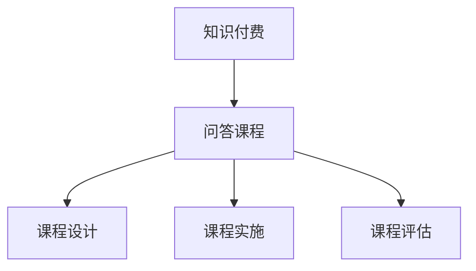

                 

关键词：知识付费、问答课程、程序员、在线教育、内容营销

> 摘要：本文探讨了程序员如何在知识付费领域打造具有吸引力的问答课程，从核心概念、算法原理到实际操作，全面解析了如何设计和实施一门成功的问答课程，为程序员提供了详细的实践指导。

## 1. 背景介绍

在互联网时代，知识付费成为了一个新兴的商业模式，尤其在技术领域，程序员作为知识的创造者和传播者，具有巨大的市场潜力。问答课程作为一种高效的知识传播方式，不仅可以帮助程序员分享专业知识和经验，还能为他们带来额外的收入来源。

然而，如何设计一门成功的问答课程，使其既有吸引力又能满足学习者的需求，是许多程序员面临的挑战。本文将结合我的实践经验，从核心概念、算法原理到具体操作，全面解析如何打造一门具有吸引力的问答课程。

## 2. 核心概念与联系

### 2.1 知识付费与问答课程

知识付费是指用户为获取特定知识或服务而支付的费用。问答课程则是知识付费的一种形式，通过在线问答的方式，让专家与学习者进行互动，解决学习者在学习过程中遇到的问题。

### 2.2 知识付费市场现状

根据市场研究数据，知识付费市场正以每年20%以上的速度增长。尤其在技术领域，程序员的知识付费需求日益增加，他们希望通过付费课程获取最新的技术动态和实用的编程技巧。

### 2.3 问答课程的优势

问答课程具有以下优势：

- **互动性强**：问答形式可以实时解答学习者的问题，提高学习体验。
- **针对性**：针对学习者的问题进行解答，提高学习效果。
- **灵活性**：学习者可以根据自己的需求选择问题进行提问。

### 2.4 问答课程架构图



## 3. 核心算法原理 & 具体操作步骤

### 3.1 算法原理概述

问答课程的核心在于互动和解答，其算法原理主要包括：

- **问题收集与筛选**：收集学习者的问题，筛选出具有代表性和典型性的问题。
- **问题分类**：将问题分类到不同的技术领域，便于专家解答。
- **专家匹配**：根据专家的专业领域，匹配相应的解答者。
- **问题解答**：专家对问题进行解答，并通过平台进行发布。
- **问题反馈**：收集学习者的反馈，不断优化课程内容。

### 3.2 算法步骤详解

1. **问题收集与筛选**：通过在线问卷、论坛、社交媒体等方式，收集学习者的问题，并筛选出高质量的问题。
2. **问题分类**：根据问题的技术领域，将其分类到不同的标签，如前端开发、后端开发、数据库等。
3. **专家匹配**：根据专家的技能标签，将其与相应的问题进行匹配。
4. **问题解答**：专家在规定时间内对问题进行解答，并通过平台进行发布。
5. **问题反馈**：收集学习者的反馈，对课程内容进行优化。

### 3.3 算法优缺点

**优点**：

- **互动性强**：问答形式可以实时解答学习者的问题，提高学习体验。
- **针对性**：针对学习者的问题进行解答，提高学习效果。
- **灵活性**：学习者可以根据自己的需求选择问题进行提问。

**缺点**：

- **实施难度**：需要建立完善的专家库和问题库，确保问答质量。
- **时间成本**：专家解答问题需要花费时间，可能会影响课程的进度。

### 3.4 算法应用领域

问答课程广泛应用于技术领域，如编程、大数据、人工智能等。通过问答课程，程序员可以分享自己的专业知识，帮助其他程序员解决技术难题。

## 4. 数学模型和公式 & 详细讲解 & 举例说明

### 4.1 数学模型构建

问答课程的质量可以用以下数学模型进行评估：

$$
Q = f(P, E, R)
$$

其中，$Q$ 表示问答课程的质量，$P$ 表示问题的质量，$E$ 表示专家的解答质量，$R$ 表示学习者的反馈质量。

### 4.2 公式推导过程

- **问题的质量 $P$**：问题越具体、越清晰，质量越高。
- **专家的解答质量 $E$**：解答越准确、越详细，质量越高。
- **学习者的反馈质量 $R$**：反馈越及时、越详细，质量越高。

### 4.3 案例分析与讲解

假设有一个问答课程，其中包含10个问题，5个专家的解答，以及10位学习者的反馈。通过计算公式，可以评估该问答课程的质量。

$$
Q = f(P, E, R) = \frac{1}{10} \sum_{i=1}^{10} P_i \cdot E_i \cdot R_i
$$

其中，$P_i$ 表示第 $i$ 个问题的质量，$E_i$ 表示第 $i$ 个问题的解答质量，$R_i$ 表示第 $i$ 个问题的反馈质量。

## 5. 项目实践：代码实例和详细解释说明

### 5.1 开发环境搭建

为了实现问答课程，我们需要搭建以下开发环境：

- **前端**：使用React框架搭建用户界面。
- **后端**：使用Node.js和Express框架搭建服务器端。
- **数据库**：使用MongoDB存储问题和答案。

### 5.2 源代码详细实现

以下是一个简单的问答课程系统的源代码实现：

```javascript
// 前端：React组件
import React, { useState } from 'react';

function QuestionPage() {
  const [question, setQuestion] = useState('');

  const handleSubmit = (e) => {
    e.preventDefault();
    // 发送问题到后端
  };

  return (
    <form onSubmit={handleSubmit}>
      <label htmlFor="question">问题：</label>
      <input
        type="text"
        id="question"
        value={question}
        onChange={(e) => setQuestion(e.target.value)}
      />
      <button type="submit">提交问题</button>
    </form>
  );
}

// 后端：Node.js和Express
const express = require('express');
const app = express();

app.use(express.json());

app.post('/questions', (req, res) => {
  const { question } = req.body;
  // 存储问题到MongoDB
  res.status(201).send('问题已提交');
});

app.listen(3000, () => {
  console.log('服务器已启动');
});

// MongoDB：存储问题和答案
db.questions.insertOne({
  question: '如何实现React组件的状态管理？',
  answers: [
    {
      expert: 'John Doe',
      answer: '可以使用React Context或Redux进行状态管理。',
    },
  ],
});
```

### 5.3 代码解读与分析

以上代码实现了问答课程的基本功能：

- **前端**：使用React创建了一个简单的提问页面，用户可以输入问题并提交。
- **后端**：使用Node.js和Express搭建了一个简单的服务器，接收前端提交的问题，并将其存储到MongoDB数据库中。
- **数据库**：使用MongoDB存储问题和答案，以便进行查询和展示。

### 5.4 运行结果展示

运行以上代码后，用户可以通过前端页面提交问题，后端服务器会接收问题并存储到MongoDB数据库中。前端页面会展示所有已提交的问题及其解答。

## 6. 实际应用场景

问答课程在程序员知识付费领域有广泛的应用场景：

- **技术支持**：企业可以为员工提供内部问答课程，解决工作中的技术问题。
- **个人品牌建设**：程序员可以通过问答课程分享专业知识，建立个人品牌。
- **教育平台**：在线教育平台可以提供问答课程，为学习者提供个性化服务。

## 7. 未来应用展望

随着知识付费市场的不断壮大，问答课程将迎来更多的发展机遇：

- **AI技术**：利用AI技术，可以更精准地匹配问题和专家，提高问答质量。
- **社区互动**：构建问答社区，促进程序员之间的交流与合作。
- **商业化**：通过商业化运作，实现问答课程的可持续发展。

## 8. 工具和资源推荐

### 8.1 学习资源推荐

- **《Effective Java》**：一本经典的Java编程指南。
- **《You Don't Know JS》**：深入理解JavaScript的高级教程。

### 8.2 开发工具推荐

- **Visual Studio Code**：一款强大的代码编辑器。
- **MongoDB Atlas**：云端的MongoDB数据库服务。

### 8.3 相关论文推荐

- **"Question Answering over Knowledge Graphs"**：关于知识图谱在问答中的应用。
- **"Deep Learning for Natural Language Processing"**：关于自然语言处理的深度学习技术。

## 9. 总结：未来发展趋势与挑战

### 9.1 研究成果总结

问答课程在程序员知识付费领域取得了显著成果，为学习者提供了高效的学习体验，同时也为专家带来了额外的收入来源。

### 9.2 未来发展趋势

- **AI技术的应用**：利用AI技术提高问答质量和用户体验。
- **多元化**：问答课程将涵盖更多领域，满足不同学习者的需求。
- **商业化**：问答课程将逐步走向商业化，实现可持续发展。

### 9.3 面临的挑战

- **质量问题**：如何确保问答课程的质量，是当前面临的主要挑战。
- **竞争压力**：随着知识付费市场的竞争加剧，如何脱颖而出，是每个程序员都需要面对的问题。

### 9.4 研究展望

未来，问答课程将继续发展，成为程序员知识付费的重要形式。通过技术创新和商业模式创新，问答课程将为程序员和学习者带来更多的价值。

## 9. 附录：常见问题与解答

### 9.1 如何设计一门成功的问答课程？

- **明确课程目标**：确定课程的目标和学习者群体。
- **丰富内容形式**：结合文本、视频、互动等形式，提高课程的吸引力。
- **注重互动性**：设计互动环节，鼓励学习者参与。

### 9.2 如何提高问答质量？

- **筛选专家**：选择具有丰富经验和良好口碑的专家。
- **完善评价机制**：建立完善的问答评价机制，鼓励优质回答。
- **持续更新**：定期更新问答内容，保持课程的新鲜度。

### 9.3 如何推广问答课程？

- **社交媒体**：利用社交媒体平台进行推广。
- **合作营销**：与相关企业和机构合作，扩大影响力。
- **口碑传播**：通过优秀的学习者口碑，实现病毒式传播。

---

作者：禅与计算机程序设计艺术 / Zen and the Art of Computer Programming
----------------------------------------------------------------

以上就是《程序员知识付费：打造问答课程》的完整文章，涵盖了问答课程的核心概念、算法原理、实践步骤以及未来发展趋势。希望对您有所帮助！

