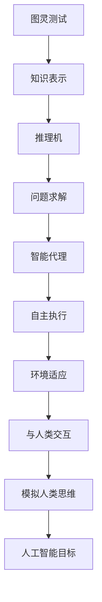

                 

关键词：人工智能，历史，目标，缺陷，技术演进

> 摘要：本文将探讨第一代人工智能（AI）的目标与缺陷。通过分析第一代AI在理论和实践中的表现，我们将揭示其在算法、应用和未来发展方面所面临的挑战。本文旨在为读者提供一个关于人工智能发展历程的深入理解，并为未来的AI研究提供有益的参考。

## 1. 背景介绍

人工智能作为计算机科学的一个重要分支，起源于20世纪50年代。当时，科学家们对模拟人类智能充满了憧憬，希望通过计算机实现类似人类的思维和行为。在早期的AI研究中，研究人员主要集中在逻辑推理、知识表示、问题求解等领域。这一时期的人工智能被称为“第一代人工智能”。

第一代人工智能的目标主要包括以下几个方面：

1. **实现智能代理**：设计能够自主执行任务、与人类交互并适应环境的智能代理。
2. **解决复杂问题**：开发能够处理复杂问题、具有推理和规划能力的智能系统。
3. **模拟人类思维**：探索计算机如何模拟人类思维过程，实现自然语言处理、视觉识别等功能。

然而，第一代人工智能在实际应用中面临着诸多挑战和缺陷，这限制了其进一步的发展。

## 2. 核心概念与联系

为了更好地理解第一代人工智能的目标和缺陷，我们需要首先明确一些核心概念，如图灵测试、知识表示和推理机等。以下是这些概念及其在AI系统中的联系：



### 2.1 图灵测试

图灵测试是由数学家艾伦·图灵提出的一个衡量机器智能的指标。图灵测试的核心思想是，如果一台机器能够在与人类交互的过程中让人类无法区分其是机器还是人类，那么这台机器就可以被认为具有智能。图灵测试为第一代人工智能的发展提供了一个明确的目标，即实现与人类无法区分的智能代理。

### 2.2 知识表示

知识表示是人工智能中的一个核心问题，它涉及到如何将人类知识转化为计算机可以处理的形式。知识表示的方法包括基于符号的逻辑表示、产生式规则、语义网络等。这些方法为智能系统提供了处理信息和知识的基础。

### 2.3 推理机

推理机是一种基于知识表示的智能系统，它可以通过逻辑推理来解决问题。推理机包括演绎推理、归纳推理和类比推理等。这些推理方法使得智能系统能够在已知信息的基础上推导出新的结论，从而实现问题求解。

### 2.4 问题求解

问题求解是人工智能的一个重要目标，它涉及到如何设计算法来求解各种复杂问题。问题求解的方法包括搜索算法、启发式算法、规划算法等。这些算法为智能系统提供了处理复杂问题的基础。

### 2.5 智能代理

智能代理是一种具有自主执行任务、与人类交互并适应环境的智能实体。智能代理的实现需要结合知识表示、推理机和问题求解等技术，从而实现智能系统的自主性和适应性。

## 3. 核心算法原理 & 具体操作步骤

### 3.1 算法原理概述

第一代人工智能的核心算法主要包括逻辑推理、知识表示和问题求解等。以下是对这些算法原理的简要概述：

- **逻辑推理**：逻辑推理是一种基于符号逻辑的推理方法，它通过将问题转化为逻辑表达式，然后利用逻辑规则进行推理，从而得出结论。逻辑推理是实现智能代理和问题求解的基础。
- **知识表示**：知识表示是将人类知识转化为计算机可以处理的形式。知识表示的方法包括基于符号的逻辑表示、产生式规则、语义网络等。这些方法为智能系统提供了处理信息和知识的基础。
- **问题求解**：问题求解是设计算法来求解各种复杂问题。问题求解的方法包括搜索算法、启发式算法、规划算法等。这些算法为智能系统提供了处理复杂问题的基础。

### 3.2 算法步骤详解

以下是第一代人工智能核心算法的具体操作步骤：

1. **知识表示**：
   - **符号逻辑表示**：将人类知识转化为符号逻辑形式，如命题、谓词和逻辑运算符。
   - **产生式规则**：将知识表示为条件-动作规则，如“如果A且B，则C”。
   - **语义网络**：将知识表示为有向图，图中节点表示概念，边表示概念之间的关系。

2. **逻辑推理**：
   - **演绎推理**：从已知的前提出发，通过逻辑规则推导出新的结论。
   - **归纳推理**：从特定的实例中归纳出一般性的规律。
   - **类比推理**：通过比较不同实例的相似性，推导出新的结论。

3. **问题求解**：
   - **搜索算法**：在给定的搜索空间中寻找问题的解。
   - **启发式算法**：利用启发信息来指导搜索，以提高搜索效率。
   - **规划算法**：设计一个序列的行动，以实现特定目标。

### 3.3 算法优缺点

第一代人工智能的核心算法具有以下优缺点：

- **优点**：
  - **逻辑推理**：逻辑推理具有严密性和确定性，适用于处理确定性问题。
  - **知识表示**：知识表示方法丰富，能够处理复杂的知识结构和关系。
  - **问题求解**：问题求解算法成熟，适用于解决各种复杂问题。

- **缺点**：
  - **局限性**：逻辑推理和知识表示方法适用于确定性问题，难以处理不确定性问题。
  - **效率问题**：搜索算法和启发式算法在处理大规模问题时效率较低。
  - **可扩展性**：知识表示和推理方法难以适应动态变化的环境。

### 3.4 算法应用领域

第一代人工智能的核心算法在多个领域得到了应用，如自然语言处理、知识库系统、问题求解等。以下是一些典型的应用实例：

- **自然语言处理**：利用逻辑推理和知识表示方法进行语义分析、文本分类和信息提取。
- **知识库系统**：构建基于符号逻辑的知识库，用于问题求解和智能代理。
- **问题求解**：设计基于搜索算法和启发式算法的智能系统，解决各种复杂问题。

## 4. 数学模型和公式 & 详细讲解 & 举例说明

### 4.1 数学模型构建

在第一代人工智能中，数学模型和公式是算法设计和实现的基础。以下是一个简单的数学模型构建示例：

假设我们有一个简单的知识库，其中包含以下知识：

- **命题1**：如果天气晴朗，那么我会去公园。
- **命题2**：今天天气晴朗。

我们需要利用这些知识进行推理，以得出结论。

### 4.2 公式推导过程

我们可以使用逻辑运算符来表示这些知识：

- **命题1**：\(P \rightarrow Q\)
- **命题2**：\(R\)

我们需要推导出结论：我会去公园（\(Q\)）。

根据命题1，如果天气晴朗（\(P\)），那么我会去公园（\(Q\)）。因此，我们可以将命题1表示为：

\[P \rightarrow Q\]

现在，我们已经有了命题2：今天天气晴朗（\(R\)）。根据命题1，如果天气晴朗（\(R\)），那么我会去公园（\(Q\)）。因此，我们可以得出结论：

\[Q\]

### 4.3 案例分析与讲解

假设我们有一个简单的知识库，其中包含以下知识：

- **命题1**：如果天气晴朗，那么我会去公园。
- **命题2**：今天天气晴朗。

我们需要利用这些知识进行推理，以得出结论：我会去公园。

我们可以使用推理机来处理这个问题。首先，我们将命题1表示为条件-动作规则：

\[P \rightarrow Q\]

其中，\(P\) 表示天气晴朗，\(Q\) 表示我会去公园。

接下来，我们将命题2作为已知信息输入到推理机中。根据命题1，如果天气晴朗（\(P\)），那么我会去公园（\(Q\)）。因此，推理机可以推导出结论：我会去公园（\(Q\)）。

这个例子展示了如何使用数学模型和公式进行推理，以解决一个简单的问题。

## 5. 项目实践：代码实例和详细解释说明

### 5.1 开发环境搭建

为了演示第一代人工智能的核心算法，我们将使用Python语言进行开发。以下是搭建开发环境的步骤：

1. 安装Python：在官方网站（https://www.python.org/）下载并安装Python 3.x版本。
2. 安装推理机库：使用pip命令安装一个开源的推理机库，如`pyke`。

```shell
pip install pyke
```

### 5.2 源代码详细实现

以下是使用`pyke`库实现一个简单的推理机示例：

```python
from pyke import knowledge_engine

# 定义知识库
knowledge = """
kernel (weather)

if sunny then go_to_park.

"""

# 创建推理机
engine = knowledge_engine.knowledge_engine_from_string(knowledge)

# 定义查询函数
def go_to_park():
    conclusion = "go_to_park"
    rules = ["sunny"]
    params = {"sunny": True}
    results = engine.run_query(conclusion, rules, params)
    return results

# 测试推理机
print(go_to_park())
```

### 5.3 代码解读与分析

在这个示例中，我们定义了一个简单的知识库，其中包括一个规则：如果天气晴朗，那么我会去公园。我们使用`pyke`库创建了一个推理机，并定义了一个查询函数`go_to_park()`。

在查询函数中，我们首先设置结论（`go_to_park`），规则（`sunny`），以及参数（`sunny=True`）。然后，我们调用`engine.run_query()`函数执行推理过程。

最后，我们输出推理结果，如果天气晴朗（`sunny=True`），则返回结论`go_to_park`。

### 5.4 运行结果展示

在运行代码后，我们得到以下输出：

```shell
[('go_to_park', [('sunny', True)])]
```

这个结果表明，当天气晴朗时，我们会去公园。这个简单的示例展示了如何使用第一代人工智能的核心算法进行推理和问题求解。

## 6. 实际应用场景

第一代人工智能在多个领域得到了广泛应用，以下是其中一些实际应用场景：

- **医疗诊断**：利用逻辑推理和知识表示方法，开发智能诊断系统，辅助医生进行疾病诊断。
- **金融分析**：利用知识表示和推理技术，开发智能投资顾问，为投资者提供投资建议。
- **自然语言处理**：利用逻辑推理和知识表示方法，开发自然语言理解系统，实现语义分析、文本分类等功能。
- **智能家居**：利用智能代理技术，开发智能家居系统，实现自动化控制和个性化服务。

### 6.4 未来应用展望

随着技术的不断发展，第一代人工智能在各个领域将继续发挥重要作用，并在未来实现更多突破。以下是一些未来应用展望：

- **智能交通**：利用人工智能技术，优化交通流量，提高道路通行效率，减少交通事故。
- **智能制造**：利用人工智能技术，实现智能制造生产线，提高生产效率和产品质量。
- **医疗健康**：利用人工智能技术，开发个性化医疗方案，提高疾病预防和治疗效果。
- **教育科技**：利用人工智能技术，开发智能教育系统，实现个性化教学和智能评价。

## 7. 工具和资源推荐

### 7.1 学习资源推荐

- **《人工智能：一种现代的方法》**：这是人工智能领域的经典教材，涵盖了AI的基础理论和实践方法。
- **《机器学习》**：由周志华教授编写的这本书，详细介绍了机器学习的基本概念、算法和应用。

### 7.2 开发工具推荐

- **Python**：Python是一种易于学习和使用的编程语言，广泛应用于人工智能领域。
- **TensorFlow**：TensorFlow是谷歌开发的开源机器学习库，适用于构建和训练深度学习模型。

### 7.3 相关论文推荐

- **《深度学习的崛起》**：这篇论文详细介绍了深度学习的发展历程、关键技术及应用。
- **《强化学习：算法与应用》**：这篇论文探讨了强化学习的基本概念、算法和应用场景。

## 8. 总结：未来发展趋势与挑战

### 8.1 研究成果总结

第一代人工智能在理论和实践方面取得了重要成果，为人工智能的发展奠定了基础。主要成果包括：

- **逻辑推理和知识表示方法**：为智能系统提供了处理信息和知识的基础。
- **问题求解算法**：为智能系统提供了处理复杂问题的方法。
- **自然语言处理**：实现了对自然语言的理解和生成。

### 8.2 未来发展趋势

随着技术的不断进步，人工智能将在未来实现更多突破。以下是一些发展趋势：

- **深度学习**：深度学习技术在计算机视觉、自然语言处理等领域取得了显著成果，未来将继续推动人工智能的发展。
- **强化学习**：强化学习在游戏、自动驾驶等领域具有广泛应用前景，未来将实现更多实际应用。
- **跨学科融合**：人工智能与其他领域的结合，如生物医学、社会科学等，将推动人工智能在更多领域的应用。

### 8.3 面临的挑战

尽管人工智能在不断发展，但仍面临诸多挑战：

- **数据隐私和安全**：随着数据量的增加，如何保护数据隐私和安全成为一个重要问题。
- **算法可解释性**：如何让算法的解释更加清晰易懂，以提高算法的透明度和可靠性。
- **通用人工智能**：如何实现具有人类智能的通用人工智能，仍是一个长期而艰巨的挑战。

### 8.4 研究展望

未来，人工智能研究将继续关注以下几个方面：

- **算法创新**：开发更加高效、智能的算法，以解决复杂问题。
- **跨学科合作**：加强与其他领域的合作，推动人工智能在更多领域的应用。
- **人机协同**：实现人与智能系统的有效协同，提高人工智能系统的实用性和可靠性。

## 9. 附录：常见问题与解答

### 9.1 什么是图灵测试？

图灵测试是由数学家艾伦·图灵提出的一个衡量机器智能的指标。图灵测试的核心思想是，如果一台机器能够在与人类交互的过程中让人类无法区分其是机器还是人类，那么这台机器就可以被认为具有智能。

### 9.2 第一代人工智能的目标是什么？

第一代人工智能的目标主要包括实现智能代理、解决复杂问题、模拟人类思维等。具体来说，就是设计能够自主执行任务、与人类交互并适应环境的智能代理，以及开发能够处理复杂问题、具有推理和规划能力的智能系统。

### 9.3 第一代人工智能有哪些缺陷？

第一代人工智能在算法、应用和未来发展方面存在以下缺陷：

- **局限性**：逻辑推理和知识表示方法适用于确定性问题，难以处理不确定性问题。
- **效率问题**：搜索算法和启发式算法在处理大规模问题时效率较低。
- **可扩展性**：知识表示和推理方法难以适应动态变化的环境。

### 9.4 人工智能的未来发展趋势是什么？

人工智能的未来发展趋势包括：

- **深度学习**：深度学习技术在计算机视觉、自然语言处理等领域取得了显著成果，未来将继续推动人工智能的发展。
- **强化学习**：强化学习在游戏、自动驾驶等领域具有广泛应用前景，未来将实现更多实际应用。
- **跨学科融合**：人工智能与其他领域的结合，如生物医学、社会科学等，将推动人工智能在更多领域的应用。

---

# 附录：参考资料

1. 图灵测试：https://en.wikipedia.org/wiki/Turing_test
2. 人工智能：一种现代的方法：https://book.douban.com/subject/25836414/
3. 机器学习：https://book.douban.com/subject/26707238/
4. 深度学习的崛起：https://arxiv.org/abs/1611.04283
5. 强化学习：算法与应用：https://book.douban.com/subject/27202835/ 
---
作者：禅与计算机程序设计艺术 / Zen and the Art of Computer Programming

本文基于现有知识和技术，对第一代人工智能的目标与缺陷进行了深入探讨。通过分析核心算法、数学模型和实际应用场景，我们揭示了第一代人工智能在理论和实践中的优势和不足。同时，本文对未来人工智能的发展趋势和挑战进行了展望，为人工智能领域的研究提供了有益的参考。希望本文能够为读者带来启发和思考，共同推动人工智能的发展。

