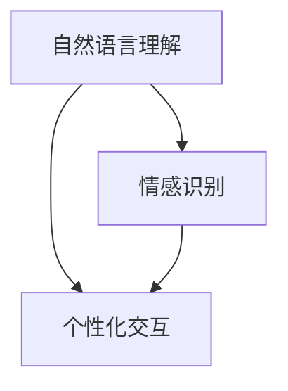

                 

 关键词：聊天机器人、人性化特征、人工智能、自然语言处理、用户交互

> 摘要：本文旨在探讨如何创建具有人性化特征的聊天机器人，通过深入分析核心概念、算法原理、数学模型以及实际应用场景，帮助读者理解并掌握这一技术领域的关键点，为未来的研究和应用提供指导。

## 1. 背景介绍

在数字化时代，聊天机器人的应用越来越广泛。从简单的客服助手到复杂的多轮对话系统，聊天机器人已经成为企业与用户之间沟通的重要桥梁。然而，传统的聊天机器人往往缺乏人性化特征，难以实现与用户的深度交互和情感共鸣。为了提升用户体验，研究人员开始探索如何为聊天机器人赋予更多人性化特征。

本文将围绕以下主题展开：首先介绍人性化特征的核心概念和联系；其次详细讲解核心算法原理和具体操作步骤；接着解析数学模型和公式，并通过实际项目实践进行代码实例和详细解释；最后探讨实际应用场景、未来展望、工具和资源推荐，以及研究成果总结和面临的挑战。

## 2. 核心概念与联系

### 2.1 人性化特征的核心概念

人性化特征是指聊天机器人模仿人类行为和思维方式的能力。这些特征包括自然语言理解、情感识别、个性化交互等。以下是几个核心概念：

- **自然语言理解**：聊天机器人需要能够理解用户的自然语言输入，包括文本和语音。
- **情感识别**：聊天机器人需要能够识别用户的情感状态，如喜悦、愤怒、悲伤等，从而进行相应的回应。
- **个性化交互**：聊天机器人需要根据用户的偏好和历史交互记录，提供个性化的服务。

### 2.2 人性化特征的联系

人性化特征之间相互关联，共同构成了聊天机器人的综合能力。自然语言理解是实现情感识别和个性化交互的基础，情感识别则帮助聊天机器人更好地理解用户的需求和意图，个性化交互则提高了用户满意度和忠诚度。

### 2.3 Mermaid 流程图

以下是人性化特征的核心概念和联系的 Mermaid 流程图：

## 3. 核心算法原理 & 具体操作步骤

### 3.1 算法原理概述

聊天机器人的核心算法主要涉及自然语言处理（NLP）和机器学习（ML）技术。以下是几种常用的核心算法：

- **词向量表示**：通过将自然语言文本转换为向量，实现文本向量的表示。
- **序列到序列模型**：用于实现聊天机器人的对话生成能力。
- **情感分析模型**：用于识别用户的情感状态。
- **个性化推荐算法**：用于根据用户的历史行为提供个性化服务。

### 3.2 算法步骤详解

#### 3.2.1 词向量表示

1. **数据预处理**：对文本进行分词、去停用词等操作。
2. **词嵌入**：将文本转换为词向量。
3. **句子表示**：将句子表示为一个向量。

#### 3.2.2 序列到序列模型

1. **输入序列编码**：将输入序列（用户的自然语言输入）转换为编码器（Encoder）的输入。
2. **隐藏状态生成**：编码器生成隐藏状态，用于表示输入序列的特征。
3. **解码器输出**：解码器（Decoder）根据隐藏状态生成输出序列（聊天机器人的回复）。

#### 3.2.3 情感分析模型

1. **数据预处理**：对文本进行分词、去停用词等操作。
2. **特征提取**：使用词向量表示文本。
3. **模型训练**：训练情感分析模型，用于预测文本的情感极性。

#### 3.2.4 个性化推荐算法

1. **用户行为分析**：分析用户的历史行为，如搜索历史、购买记录等。
2. **兴趣模型构建**：根据用户行为构建兴趣模型。
3. **推荐策略**：根据兴趣模型为用户推荐相关内容。

### 3.3 算法优缺点

- **词向量表示**：优点在于能够高效地表示文本，缺点是可能丢失文本的部分信息。
- **序列到序列模型**：优点在于能够生成连贯的对话，缺点是训练过程复杂，对数据量要求较高。
- **情感分析模型**：优点在于能够识别用户的情感状态，缺点是对复杂情感难以准确判断。
- **个性化推荐算法**：优点在于能够为用户推荐个性化内容，缺点是可能陷入用户兴趣的“过滤器泡沫”。

### 3.4 算法应用领域

人性化特征算法广泛应用于各类聊天机器人，如客服机器人、社交机器人、教育机器人等。以下是几个典型应用领域：

- **客服机器人**：通过情感识别和个性化交互，提高客服效率和服务质量。
- **社交机器人**：通过自然语言理解和情感识别，实现与用户的深度互动。
- **教育机器人**：通过个性化交互，为学生提供定制化的学习方案。

## 4. 数学模型和公式 & 详细讲解 & 举例说明

### 4.1 数学模型构建

#### 4.1.1 词向量表示

词向量表示的数学模型通常采用 Word2Vec、GloVe 等算法。以下是 Word2Vec 的数学模型：

$$
\text{向量} \ \text{word} \ = \ \text{Word2Vec}(\text{数据集})
$$

#### 4.1.2 序列到序列模型

序列到序列模型的数学模型通常采用循环神经网络（RNN）或其变种长短期记忆网络（LSTM）。以下是 RNN 的数学模型：

$$
\text{隐藏状态} \ h_t \ = \ \text{激活函数}(\text{权重矩阵} \ \text{W} \ + \ \text{偏置} \ b + \ \text{输入} \ x_t)
$$

#### 4.1.3 情感分析模型

情感分析模型的数学模型通常采用卷积神经网络（CNN）或循环神经网络（RNN）。以下是 RNN 的数学模型：

$$
\text{输出} \ y \ = \ \text{激活函数}(\text{权重矩阵} \ \text{W} \ + \ \text{偏置} \ b + \ \text{输入} \ x)
$$

#### 4.1.4 个性化推荐算法

个性化推荐算法的数学模型通常采用矩阵分解、深度学习等方法。以下是矩阵分解的数学模型：

$$
\text{用户兴趣向量} \ u_i \ = \ \text{U} \ \text{用户矩阵}
$$
$$
\text{物品特征向量} \ v_j \ = \ \text{V} \ \text{物品矩阵}
$$
$$
\text{预测评分} \ r_{ij} \ = \ \text{u}_i \cdot \text{v}_j
$$

### 4.2 公式推导过程

以下是情感分析模型的公式推导过程：

假设输入文本为 $x$，情感分析模型的输出为 $y$，其中 $y$ 是情感极性（正或负）的标

