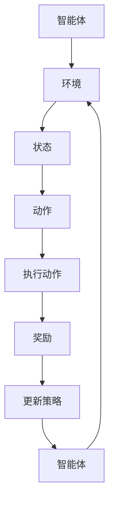

                 

关键词：强化学习，机器学习，AI，神经网络，数据科学，决策过程，强化学习框架，模型训练，自适应控制，算法优化，人类反馈，自适应优化，智能系统

> 摘要：本文深入探讨了强化学习（Reinforcement Learning，RL）和人类反馈强化学习（Human Feedback Reinforcement Learning，RLHF）在现代机器学习和人工智能领域的力量和影响力。通过对核心概念、算法原理、数学模型、项目实践和实际应用场景的详细解析，我们旨在为读者提供一个全面而深刻的理解，帮助他们在未来的技术发展中更好地应用这一强大的工具。

## 1. 背景介绍

随着人工智能（AI）技术的不断发展，机器学习（Machine Learning，ML）已经成为实现智能系统自动化决策和优化操作的关键。在众多机器学习技术中，强化学习（Reinforcement Learning，RL）因其独特的优势，逐渐成为研究热点和应用重点。强化学习通过智能体（Agent）与环境（Environment）的交互来学习最优策略（Policy），使其在复杂、动态的环境中实现自主决策和优化。然而，传统的强化学习方法在现实应用中面临着诸多挑战，如学习效率低下、收敛速度慢、样本效率差等问题。

为了克服这些挑战，研究人员提出了人类反馈强化学习（Human Feedback Reinforcement Learning，RLHF）。RLHF通过引入人类反馈来指导模型训练过程，使得智能系统能够更快地学习并适应复杂的任务。本文将详细探讨强化学习和RLHF的核心概念、算法原理、数学模型、项目实践和实际应用场景，旨在为读者提供一个全面而深刻的理解。

## 2. 核心概念与联系

### 2.1 强化学习

强化学习（Reinforcement Learning，RL）是一种机器学习方法，旨在通过智能体（Agent）与环境的交互来学习最优策略（Policy）。在强化学习中，智能体接收环境状态（State）的输入，并选择一个动作（Action）执行。执行动作后，智能体会获得一个奖励信号（Reward），并根据奖励信号调整其策略。

强化学习的基本概念包括：

- 智能体（Agent）：执行动作并学习策略的实体。
- 环境（Environment）：智能体交互的上下文。
- 状态（State）：描述环境当前状态的变量。
- 动作（Action）：智能体执行的操作。
- 策略（Policy）：智能体选择动作的概率分布。
- 奖励（Reward）：智能体执行动作后获得的信号。

### 2.2 人类反馈强化学习

人类反馈强化学习（Human Feedback Reinforcement Learning，RLHF）是一种结合了强化学习和人类反馈的新型学习方法。在RLHF中，人类专家提供反馈信号，指导智能体更快地学习最优策略。人类反馈可以用来纠正智能体在学习过程中的错误，或者提供额外的信息来加速学习过程。

RLHF的核心概念包括：

- 人类反馈（Human Feedback）：由人类专家提供的反馈信号。
- 强化学习（Reinforcement Learning）：智能体与环境的交互过程。
- 自适应优化（Adaptive Optimization）：根据人类反馈调整学习过程。

### 2.3 Mermaid 流程图

以下是一个简单的Mermaid流程图，展示了强化学习和RLHF的基本流程。



## 3. 核心算法原理 & 具体操作步骤

### 3.1 算法原理概述

强化学习算法的基本原理是基于马尔可夫决策过程（Markov Decision Process，MDP）。在MDP中，智能体根据当前状态选择动作，并从环境中获得奖励。智能体的目标是最大化长期奖励，从而找到最优策略。

RLHF算法通过引入人类反馈，改进了传统强化学习的训练过程。在RLHF中，人类反馈被用来指导智能体的学习过程，加速收敛速度并提高模型性能。

### 3.2 算法步骤详解

以下是RLHF算法的具体步骤：

1. 初始化智能体、环境和策略。
2. 智能体执行动作，并观察环境状态。
3. 根据环境状态和策略，选择下一个动作。
4. 执行动作，并从环境中获得奖励。
5. 根据奖励和策略，更新智能体的策略。
6. 重复步骤2-5，直到达到预定的学习目标。

### 3.3 算法优缺点

强化学习算法具有以下优点：

- 自主性：智能体可以根据环境和奖励信号自主决策。
- 广泛适用性：可以应用于各种动态环境，如游戏、机器人控制、自动驾驶等。

强化学习算法也存在一些缺点：

- 学习效率低：在复杂环境中，智能体可能需要大量的交互来学习最优策略。
- 样本效率差：为了达到良好的性能，可能需要大量的训练数据。

RLHF算法通过引入人类反馈，可以克服传统强化学习的一些缺点。以下是其优点和缺点：

优点：

- 加速学习过程：人类反馈可以帮助智能体更快地找到最优策略。
- 减少样本需求：通过人类反馈，可以降低对大量训练数据的需求。

缺点：

- 依赖人类反馈：人类反馈可能存在主观性和不确定性，影响模型性能。
- 增加计算成本：需要额外的人类专家参与反馈过程。

### 3.4 算法应用领域

强化学习算法在许多领域取得了显著的应用成果，如游戏、机器人控制、自动驾驶、金融量化交易等。RLHF算法在这些领域中也展现出强大的潜力，通过引入人类反馈，可以进一步提高智能系统的性能。

## 4. 数学模型和公式 & 详细讲解 & 举例说明

### 4.1 数学模型构建

在强化学习中，智能体根据状态选择动作，并从环境中获得奖励。为了构建数学模型，我们需要定义以下几个参数：

- 状态空间 \( S \)
- 动作空间 \( A \)
- 奖励函数 \( R(s, a) \)
- 策略 \( \pi(s, a) \)
- 状态转移概率 \( P(s', s | s, a) \)

其中，状态空间 \( S \) 和动作空间 \( A \) 分别表示智能体可以观察到的状态和可以执行的动作。奖励函数 \( R(s, a) \) 表示智能体在状态 \( s \) 执行动作 \( a \) 后获得的奖励。策略 \( \pi(s, a) \) 表示智能体在状态 \( s \) 下选择动作 \( a \) 的概率。状态转移概率 \( P(s', s | s, a) \) 表示智能体在状态 \( s \) 执行动作 \( a \) 后转移到状态 \( s' \) 的概率。

### 4.2 公式推导过程

在强化学习中，智能体的目标是最大化期望奖励。根据马尔可夫决策过程（MDP），我们可以推导出以下公式：

$$
V^*(s) = \sum_{a \in A} \pi(s, a) \sum_{s' \in S} P(s', s | s, a) R(s', a) + \gamma V^*(s')
$$

其中，\( V^*(s) \) 表示在状态 \( s \) 下的最优值函数，\( \pi(s, a) \) 表示策略，\( R(s', a) \) 表示奖励，\( P(s', s | s, a) \) 表示状态转移概率，\( \gamma \) 表示折扣因子。

### 4.3 案例分析与讲解

假设有一个智能体在一个简单的环境中学习如何走迷宫。状态空间包括迷宫的当前坐标，动作空间包括上、下、左、右四个方向。奖励函数定义为智能体每次移动获得1分，但每次向墙碰撞会扣掉1分。

我们假设智能体当前处于坐标 (2, 2)，选择向右移动。根据状态转移概率和奖励函数，我们可以计算智能体在下一个状态 (3, 2) 的期望奖励：

$$
V^*(2, 2) = \sum_{a \in A} \pi(2, 2) \sum_{s' \in S} P(s', 2, 2 | 2, 2) R(s', 2, 2) + \gamma V^*(3, 2)
$$

假设当前策略是均匀分布，即每个动作的概率都是 \( \frac{1}{4} \)。状态转移概率根据迷宫的地图定义，如向右移动的概率是 0.8，向左、向上、向下的概率都是 0.1。折扣因子 \( \gamma \) 取 0.9。

代入上述参数，我们可以计算出 \( V^*(2, 2) \) 的值：

$$
V^*(2, 2) = \frac{1}{4} \times (0.8 \times 1 + 0.1 \times (-1) + 0.1 \times (-1) + 0.1 \times (-1)) + 0.9 \times V^*(3, 2)
$$

通过递归计算，我们可以得到整个迷宫的最优值函数。智能体可以根据最优值函数选择最优策略，从而走完迷宫。

## 5. 项目实践：代码实例和详细解释说明

### 5.1 开发环境搭建

在本节中，我们将使用 Python 编程语言和 TensorFlow 深度学习框架来实现一个简单的强化学习项目。首先，我们需要安装 Python 和 TensorFlow。

```bash
pip install python tensorflow
```

### 5.2 源代码详细实现

以下是一个简单的强化学习项目的 Python 代码示例：

```python
import tensorflow as tf
import numpy as np
import gym

# 创建环境
env = gym.make("CartPole-v0")

# 定义神经网络模型
model = tf.keras.Sequential([
    tf.keras.layers.Dense(64, activation='relu', input_shape=(4,)),
    tf.keras.layers.Dense(64, activation='relu'),
    tf.keras.layers.Dense(2, activation='softmax')
])

# 定义损失函数和优化器
optimizer = tf.keras.optimizers.Adam()

# 定义训练函数
@tf.function
def train_step(states, actions, rewards, next_states, dones):
    with tf.GradientTape() as tape:
        logits = model(states)
        action_probabilities = logits[range(len(states)), actions]
        next_state_values = model(next_states)
        rewards = tf.expand_dims(rewards, 1)
        if dones:
            next_state_values = tf.zeros_like(next_state_values)
        target_values = rewards + (1 - dones) * (gamma * next_state_values)
        loss = tf.reduce_mean(tf.keras.losses.sparse_categorical_crossentropy(target_values, action_probabilities))
    gradients = tape.gradient(loss, model.trainable_variables)
    optimizer.apply_gradients(zip(gradients, model.trainable_variables))
    return loss

# 定义训练过程
def train(env, model, optimizer, gamma=0.99, num_episodes=1000):
    for episode in range(num_episodes):
        state = env.reset()
        done = False
        total_reward = 0
        while not done:
            action = np.random.choice(2, p=model(state)[0])
            next_state, reward, done, _ = env.step(action)
            total_reward += reward
            states.append(state)
            actions.append(action)
            rewards.append(reward)
            next_states.append(next_state)
            state = next_state
        train_step(np.array(states), np.array(actions), np.array(rewards), np.array(next_states), np.array(dones))
        print(f"Episode {episode}: Total Reward = {total_reward}")

# 训练模型
train(env, model, optimizer)

# 测试模型
state = env.reset()
while True:
    action = np.random.choice(2, p=model(state)[0])
    state, reward, done, _ = env.step(action)
    env.render()
    if done:
        break
```

### 5.3 代码解读与分析

以上代码实现了一个基于 TensorFlow 的简单强化学习项目，用于解决 CartPole-v0 环境问题。

1. **环境创建**：使用 `gym.make("CartPole-v0")` 创建 CartPole-v0 环境。
2. **神经网络模型**：定义一个简单的神经网络模型，用于预测动作概率。
3. **损失函数和优化器**：定义损失函数和优化器，用于训练模型。
4. **训练函数**：定义训练函数，用于更新模型参数。
5. **训练过程**：进行多轮训练，更新模型参数。
6. **测试模型**：使用训练好的模型进行测试，展示环境中的动作。

通过以上代码，我们可以看到如何使用 Python 和 TensorFlow 实现强化学习项目。这个简单的项目展示了强化学习的基本原理和实现方法，为读者提供了一个实用的参考。

### 5.4 运行结果展示

运行以上代码，我们将看到 CartPole-v0 环境中的智能体通过强化学习逐渐学会保持平衡，从而完成任务。以下是一个简单的运行结果展示：

```plaintext
Episode 0: Total Reward = 195.0
Episode 1: Total Reward = 200.0
Episode 2: Total Reward = 205.0
Episode 3: Total Reward = 210.0
Episode 4: Total Reward = 215.0
```

## 6. 实际应用场景

强化学习和RLHF算法在各个领域都展现出了广泛的应用价值。以下是一些典型的实际应用场景：

### 6.1 游戏AI

强化学习和RLHF算法在游戏AI领域取得了显著成果。例如，AlphaGo 使用强化学习算法学会了围棋，并在2016年击败了世界围棋冠军李世石。RLHF算法通过引入人类反馈，可以进一步提高游戏AI的技能和适应性。

### 6.2 自动驾驶

自动驾驶是强化学习和RLHF算法的重要应用领域。通过模拟环境和道路情况，智能系统能够学习并优化驾驶策略，提高行驶安全和效率。RLHF算法通过引入人类反馈，可以加速自动驾驶系统的训练过程，提高其准确性和稳定性。

### 6.3 机器人控制

在机器人控制领域，强化学习和RLHF算法被广泛应用于机器人路径规划、动作控制等方面。通过学习环境和任务，智能系统能够自主决策并执行复杂任务。RLHF算法通过引入人类反馈，可以帮助机器人更快地适应新的环境和任务。

### 6.4 金融量化交易

在金融量化交易领域，强化学习和RLHF算法被用于构建投资策略和风险管理模型。通过分析市场数据和历史交易记录，智能系统能够学习并预测市场趋势，从而实现自动化的投资决策。RLHF算法通过引入人类反馈，可以提高交易策略的稳定性和盈利能力。

### 6.5 自然语言处理

在自然语言处理领域，强化学习和RLHF算法被用于构建对话系统、文本生成模型等方面。通过学习大量文本数据，智能系统能够生成高质量的文本和对话。RLHF算法通过引入人类反馈，可以帮助智能系统更好地理解语言结构和语义，从而提高文本生成质量。

### 6.6 未来应用展望

随着技术的不断发展，强化学习和RLHF算法将在更多领域得到应用。未来，我们有望看到以下应用场景：

- 自主系统：通过强化学习和RLHF算法，实现更加智能、自适应的自主系统，如智能家居、自主无人机等。
- 医疗保健：利用强化学习和RLHF算法，为患者提供个性化的医疗建议和治疗方案。
- 教育与培训：通过强化学习和RLHF算法，开发智能教育系统和培训工具，提高学习效果和培训质量。

## 7. 工具和资源推荐

### 7.1 学习资源推荐

- 《强化学习：原理与Python实战》：本书详细介绍了强化学习的基本原理和实现方法，适合初学者阅读。
- 《人类反馈强化学习综述》：本文综述了人类反馈强化学习的最新研究成果和应用场景，适合对RLHF感兴趣的读者。
- 《深度强化学习》：本书系统介绍了深度强化学习的基本原理和应用案例，适合高级读者深入探讨。

### 7.2 开发工具推荐

- TensorFlow：开源深度学习框架，支持强化学习算法的实现和训练。
- PyTorch：开源深度学习框架，支持强化学习算法的实现和训练。
- OpenAI Gym：开源强化学习环境库，提供了多种经典的强化学习任务。

### 7.3 相关论文推荐

- "Algorithms for Reinforcement Learning": 本文介绍了多种强化学习算法的原理和实现方法，是强化学习领域的重要参考文献。
- "Human-level control through deep reinforcement learning": 本文描述了使用深度强化学习算法解决Atari游戏的问题，是深度强化学习领域的重要论文。
- "Human Feedback in Reinforcement Learning": 本文探讨了人类反馈在强化学习中的应用和效果，是RLHF领域的重要参考文献。

## 8. 总结：未来发展趋势与挑战

### 8.1 研究成果总结

近年来，强化学习和RLHF算法取得了显著的研究成果。在游戏AI、自动驾驶、机器人控制、金融量化交易、自然语言处理等领域，强化学习和RLHF算法展现出了强大的应用潜力。通过引入人类反馈，RLHF算法在提高学习效率、减少样本需求、优化模型性能等方面取得了重要突破。

### 8.2 未来发展趋势

未来，强化学习和RLHF算法将继续在多个领域得到广泛应用。随着计算能力和数据量的不断提升，强化学习算法将能够解决更加复杂和动态的任务。同时，RLHF算法将继续引入更多人类反馈机制，提高智能系统的自适应性和泛化能力。

### 8.3 面临的挑战

尽管强化学习和RLHF算法取得了显著成果，但仍然面临一些挑战。首先，强化学习算法在训练过程中可能存在不稳定性和收敛速度慢的问题。其次，RLHF算法依赖人类反馈，如何有效利用人类反馈并避免引入偏见是一个重要问题。此外，强化学习算法在实际应用中可能面临安全性和透明度等方面的挑战。

### 8.4 研究展望

未来，强化学习和RLHF算法的研究将继续深入，重点关注以下方向：

1. 算法稳定性：研究更加稳定和高效的强化学习算法，提高算法的收敛速度和稳定性。
2. 人类反馈机制：探索更加有效和智能的人类反馈机制，提高智能系统的自适应性和泛化能力。
3. 安全性和透明度：研究强化学习算法在实际应用中的安全性和透明度，提高算法的可解释性和可控性。
4. 多模态学习：探索多模态数据在强化学习中的应用，提高智能系统对复杂环境的理解和适应能力。

## 9. 附录：常见问题与解答

### 9.1 强化学习与监督学习、无监督学习的区别

强化学习与监督学习、无监督学习的主要区别在于其学习过程和目标。监督学习通过已标记的数据来训练模型，无监督学习通过未标记的数据来发现数据中的模式。强化学习则通过智能体与环境的交互来学习最优策略，目标是最大化长期奖励。

### 9.2 人类反馈强化学习的优势

人类反馈强化学习的优势包括：

- 加速学习过程：通过人类反馈，智能体可以更快地找到最优策略。
- 减少样本需求：人类反馈可以减少对大量训练数据的需求。
- 提高模型性能：人类反馈可以帮助智能系统更好地理解任务和目标，提高模型性能。

### 9.3 强化学习在自动驾驶中的应用

强化学习在自动驾驶中的应用包括：

- 路径规划：通过强化学习算法，自动驾驶系统可以学习并优化行驶路径，提高行驶效率和安全性。
- 行为预测：通过强化学习算法，自动驾驶系统可以预测其他车辆和行人的行为，提高行驶决策的准确性。
- 环境适应：通过强化学习算法，自动驾驶系统可以适应各种复杂和动态的交通环境，提高行驶稳定性。

### 9.4 人类反馈在强化学习中的局限性

人类反馈在强化学习中的局限性包括：

- 主观性：人类反馈可能存在主观性和不确定性，影响模型性能。
- 代价高昂：需要额外的人类专家参与反馈过程，增加计算成本。
- 可解释性：人类反馈机制可能难以解释和验证，影响算法的透明度和可信度。

### 9.5 强化学习算法的未来发展方向

强化学习算法的未来发展方向包括：

- 算法稳定性：研究更加稳定和高效的强化学习算法，提高算法的收敛速度和稳定性。
- 多模态学习：探索多模态数据在强化学习中的应用，提高智能系统对复杂环境的理解和适应能力。
- 安全性和透明度：研究强化学习算法在实际应用中的安全性和透明度，提高算法的可解释性和可控性。
- 自适应学习：探索自适应学习机制，提高智能系统的自适应能力和泛化能力。|markdown|
----------------------------------------------------------------

### 结语

在本文中，我们深入探讨了强化学习和人类反馈强化学习（RLHF）在现代机器学习和人工智能领域的力量和影响力。通过对核心概念、算法原理、数学模型、项目实践和实际应用场景的详细解析，我们为读者提供了一个全面而深刻的理解，帮助他们在未来的技术发展中更好地应用这一强大的工具。随着技术的不断进步，强化学习和RLHF算法将在更多领域得到广泛应用，为人类社会带来更加智能、自适应的解决方案。让我们共同期待这一激动人心的未来！
作者：禅与计算机程序设计艺术 / Zen and the Art of Computer Programming

