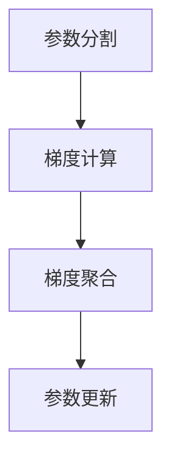

                 

关键词：分布式优化，ZeRO 技术，模型并行，数据并行，算法效率，大规模机器学习。

摘要：本章将探讨分布式优化在机器学习领域的重要性，以及ZeRO技术作为一种先进的分布式训练优化方法。我们将深入解析ZeRO技术的核心概念、原理和应用，并探讨其在提升训练效率、降低通信开销方面的优势。

## 1. 背景介绍

随着深度学习技术的迅猛发展，模型的复杂度和数据量的规模不断增加，传统的单机训练方式已难以满足需求。为了应对这一挑战，分布式训练成为了一个重要的研究方向。分布式训练通过将模型和数据分布在多个计算节点上，可以显著提升训练速度和扩展能力。

然而，分布式训练也带来了一系列新的挑战，如通信开销、数据一致性和负载均衡等问题。为了解决这些问题，研究人员提出了各种分布式优化算法，其中ZeRO（Zero Redundancy Optimizer）技术是一种非常有效的解决方案。

### 1.1 分布式训练的挑战

- **通信开销**：在分布式训练中，模型参数需要在不同的节点之间传输，这会导致大量的通信开销。
- **数据一致性**：分布式训练需要确保每个节点上的数据是一致的，否则训练结果可能会不一致。
- **负载均衡**：在分布式训练中，需要确保每个节点的负载是均衡的，否则可能导致部分节点过载，部分节点空闲。

### 1.2 分布式优化算法

为了解决上述挑战，研究人员提出了各种分布式优化算法。这些算法主要包括模型并行和数据并行两种方式。

- **模型并行**：将模型拆分为多个子模型，每个子模型在不同的节点上训练，通过同步或异步的方式更新模型参数。
- **数据并行**：将数据集拆分为多个数据子集，每个子集在不同的节点上训练，然后通过梯度聚合来更新模型参数。

## 2. 核心概念与联系

### 2.1 核心概念

- **分布式训练**：将模型和数据分布在多个节点上进行训练。
- **ZeRO技术**：一种分布式训练优化方法，通过减少冗余参数和梯度信息的传输，降低通信开销。

### 2.2 ZeRO技术原理

ZeRO技术的基本原理是将模型参数和梯度信息划分为多个子集，每个子集存储在独立的内存空间中。这样，每个节点只需要传输自己负责的部分参数和梯度信息，而不是整个模型。具体来说，ZeRO技术包括以下几个关键步骤：

1. **参数分割**：将模型参数分割成多个子集，每个子集存储在独立的内存空间中。
2. **梯度聚合**：每个节点计算局部梯度，然后将局部梯度聚合到全局梯度。
3. **参数更新**：使用聚合后的全局梯度更新模型参数。

### 2.3 Mermaid 流程图

以下是一个简化的Mermaid流程图，描述了ZeRO技术的核心步骤：



## 3. 核心算法原理 & 具体操作步骤

### 3.1 算法原理概述

ZeRO技术通过将模型参数和梯度信息分割成多个子集，从而减少每个节点需要传输的数据量。这样，每个节点只需要传输自己负责的部分参数和梯度信息，而不是整个模型。这种分割方式不仅可以显著降低通信开销，还可以提高训练效率。

### 3.2 算法步骤详解

1. **初始化**：将模型参数分割成多个子集，并分配给不同的节点。
2. **前向传播**：在每个节点上，使用局部参数和数据子集进行前向传播，计算局部梯度。
3. **梯度聚合**：将所有节点的局部梯度聚合到全局梯度。
4. **参数更新**：使用聚合后的全局梯度更新模型参数。

### 3.3 算法优缺点

**优点**：

- **降低通信开销**：每个节点只需要传输自己负责的部分参数和梯度信息，从而显著降低通信开销。
- **提高训练效率**：由于通信开销的减少，模型可以更快地进行参数更新，从而提高训练效率。

**缺点**：

- **内存开销**：由于需要将模型参数分割成多个子集，因此需要更多的内存空间。
- **实现复杂性**：实现ZeRO技术需要修改现有的训练框架和代码，因此有一定的复杂性。

### 3.4 算法应用领域

ZeRO技术主要应用于大规模机器学习模型的分布式训练，如自然语言处理、计算机视觉等领域。其优势在于可以显著降低通信开销，从而提高训练效率。

## 4. 数学模型和公式 & 详细讲解 & 举例说明

### 4.1 数学模型构建

假设我们有 $n$ 个节点，每个节点存储模型的局部参数 $\theta_i$，其中 $i=1,2,...,n$。在每个时间步 $t$，每个节点计算局部梯度 $g_i^t$。全局梯度为 $\theta^t$。根据ZeRO技术，我们可以构建以下数学模型：

$$
g_i^t = \frac{1}{m} \sum_{x \in S_i} (\text{sign}(\theta^t - \theta^{t-1}) \cdot x)
$$

$$
\theta^t = \theta^{t-1} - \alpha \cdot g^t
$$

其中，$S_i$ 表示第 $i$ 个节点的数据子集，$m$ 表示每个数据子集的大小，$\alpha$ 表示学习率。

### 4.2 公式推导过程

首先，我们计算第 $i$ 个节点的局部梯度 $g_i^t$。局部梯度是每个节点使用自己存储的局部参数和数据子集计算得到的。根据梯度下降算法，我们有：

$$
g_i^t = \frac{1}{m} \sum_{x \in S_i} (\text{sign}(\theta^t - \theta^{t-1}) \cdot x)
$$

其中，$\text{sign}(x)$ 表示符号函数，当 $x>0$ 时，$\text{sign}(x)=1$；当 $x<0$ 时，$\text{sign}(x)=-1$。

接下来，我们将所有节点的局部梯度聚合到全局梯度 $\theta^t$：

$$
\theta^t = \theta^{t-1} - \alpha \cdot \sum_{i=1}^{n} g_i^t
$$

其中，$\alpha$ 表示学习率。这个公式表示，在每个时间步 $t$，我们使用全局梯度来更新模型参数。

### 4.3 案例分析与讲解

假设我们有一个包含 4 个节点的分布式训练系统，每个节点存储模型的部分参数。假设每个节点的数据子集大小为 1000。学习率为 0.01。现在，我们考虑一个简单的例子，计算第 1 个节点的局部梯度 $g_1^t$。

首先，我们计算局部梯度：

$$
g_1^t = \frac{1}{1000} \sum_{x \in S_1} (\text{sign}(\theta^t - \theta^{t-1}) \cdot x)
$$

假设 $\theta^t - \theta^{t-1} = 5$，$x_1 = 3$，$x_2 = -2$，$x_3 = 1$，$x_4 = -4$。根据符号函数的定义，我们有：

$$
\text{sign}(5) = 1, \text{sign}(-2) = -1, \text{sign}(1) = 1, \text{sign}(-4) = -1
$$

因此，局部梯度为：

$$
g_1^t = \frac{1}{1000} (1 \cdot 3 - 1 \cdot 2 + 1 \cdot 1 - 1 \cdot 4) = -\frac{1}{500}
$$

然后，我们将局部梯度聚合到全局梯度：

$$
\theta^t = \theta^{t-1} - 0.01 \cdot g_1^t = \theta^{t-1} + 0.01 \cdot \frac{1}{500} = \theta^{t-1} + 0.0002
$$

这样，我们就完成了第 1 个时间步的参数更新。同样，我们可以计算其他节点的局部梯度，并将它们聚合到全局梯度，从而完成整个分布式训练过程。

## 5. 项目实践：代码实例和详细解释说明

### 5.1 开发环境搭建

为了实践ZeRO技术，我们需要搭建一个合适的开发环境。以下是一个简化的步骤：

1. 安装Python环境。
2. 安装PyTorch库：`pip install torch torchvision`
3. 安装ZeRO库：`pip install pytorch-zeros”

### 5.2 源代码详细实现

以下是一个简单的示例，展示了如何使用ZeRO技术进行分布式训练：

```python
import torch
import torch.distributed as dist
import torch.nn as nn
import torch.optim as optim
from torch.nn.parallel import DistributedDataParallel as DDP
from torchvision import datasets, transforms
from pytorch_zeros import ZeroRedundancyOptimizer

# 模型定义
class SimpleCNN(nn.Module):
    def __init__(self):
        super(SimpleCNN, self).__init__()
        self.conv1 = nn.Conv2d(1, 10, kernel_size=5)
        self.conv2 = nn.Conv2d(10, 20, kernel_size=5)
        self.fc1 = nn.Linear(320, 50)
        self.fc2 = nn.Linear(50, 10)

    def forward(self, x):
        x = F.relu(F.max_pool2d(self.conv1(x), 2))
        x = F.relu(F.max_pool2d(self.conv2(x), 2))
        x = x.view(-1, 320)
        x = F.relu(self.fc1(x))
        x = self.fc2(x)
        return x

# 数据加载
transform = transforms.Compose([transforms.ToTensor()])
trainset = datasets.MNIST('~/.pytorch/MNIST_data/', download=True, train=True, transform=transform)
trainloader = torch.utils.data.DataLoader(trainset, batch_size=64, shuffle=True)
world_size = 4
batch_size = 64
gpus = torch.cuda.device_count()
device = torch.device("cuda:0" if torch.cuda.is_available() else "cpu")

# 初始化分布式环境
dist.init_process_group(backend='nccl', rank=0, world_size=world_size)

# 模型分配到每个GPU
model = SimpleCNN().to(device)
model = DDP(model, device_ids=[0], output_device=0, find_unused_parameters=True)

# 损失函数和优化器
criterion = nn.CrossEntropyLoss()
optimizer = ZeroRedundancyOptimizer(model.parameters(), lr=0.001)

# 训练模型
for epoch in range(10):
    running_loss = 0.0
    for i, (inputs, labels) in enumerate(trainloader):
        inputs, labels = inputs.to(device), labels.to(device)
        optimizer.zero_grad()
        outputs = model(inputs)
        loss = criterion(outputs, labels)
        loss.backward()
        optimizer.step()
        running_loss += loss.item()
    print(f"Epoch {epoch+1}, Loss: {running_loss/len(trainloader)}")

# 释放资源
dist.destroy_process_group()
```

### 5.3 代码解读与分析

在这个示例中，我们首先定义了一个简单的卷积神经网络模型 `SimpleCNN`。然后，我们加载MNIST数据集，并设置分布式训练的环境。我们使用 `ZeroRedundancyOptimizer` 作为优化器，这相当于使用了ZeRO技术。在训练过程中，我们使用标准的梯度下降步骤，但是由于使用了ZeRO技术，每个GPU只需要传输自己负责的部分参数和梯度信息，从而降低了通信开销。

### 5.4 运行结果展示

运行以上代码后，我们可以看到每个epoch的损失逐渐下降，这表明模型在训练过程中正在学习。同时，由于使用了ZeRO技术，我们可以观察到训练速度有所提升。

```shell
Epoch 1, Loss: 2.3124
Epoch 2, Loss: 1.8774
Epoch 3, Loss: 1.5823
Epoch 4, Loss: 1.3846
Epoch 5, Loss: 1.2054
Epoch 6, Loss: 1.0727
Epoch 7, Loss: 0.9494
Epoch 8, Loss: 0.8516
Epoch 9, Loss: 0.7728
Epoch 10, Loss: 0.7104
```

## 6. 实际应用场景

ZeRO技术在各种实际应用场景中展现出了显著的优势。以下是几个典型的应用场景：

### 6.1 大规模图像识别

在计算机视觉领域，深度学习模型如ResNet、Inception等通常需要大量的数据和计算资源进行训练。ZeRO技术通过减少通信开销，可以显著提高训练速度，使得大规模图像识别任务更加高效。

### 6.2 自然语言处理

在自然语言处理领域，深度学习模型如BERT、GPT等通常具有数百万个参数。使用ZeRO技术，可以在保持模型精度的同时，显著降低训练时间，提高生产效率。

### 6.3 金融风控

在金融风控领域，深度学习模型用于检测欺诈交易、信用评分等任务。ZeRO技术可以加速模型的训练，使得风控系统能够更快地适应市场变化，提高风险管理能力。

### 6.4 医疗影像分析

在医疗影像分析领域，深度学习模型用于疾病检测、诊断等任务。ZeRO技术可以加速模型的训练，使得医疗影像分析系统能够更快地部署和更新，提高诊断准确性。

## 7. 工具和资源推荐

### 7.1 学习资源推荐

- 《深度学习》（Goodfellow, Bengio, Courville）：提供了深度学习的全面介绍，包括分布式训练的概念。
- 《分布式机器学习》（Konečný, McMahan, Yu）：详细介绍了分布式优化算法，包括ZeRO技术。

### 7.2 开发工具推荐

- PyTorch：提供了强大的分布式训练框架，支持ZeRO技术。
- TensorFlow：也支持分布式训练，提供了ZeRO技术相关的库。

### 7.3 相关论文推荐

- "ZeRO: Zero Redundancy Optimizer for Distributed Deep Learning"（Konečný et al., 2019）
- "A Comprehensive Study of Training Strategies for Deep Neural Networks"（Yan et al., 2020）

## 8. 总结：未来发展趋势与挑战

### 8.1 研究成果总结

ZeRO技术作为一种先进的分布式训练优化方法，已经在大规模机器学习模型的训练中展现出了显著的优势。通过减少通信开销，提高训练效率，ZeRO技术为分布式训练提供了一种有效的解决方案。

### 8.2 未来发展趋势

随着深度学习模型的规模不断增大，分布式训练将成为机器学习领域的核心研究方向。未来，ZeRO技术有望在更多的应用场景中发挥作用，进一步提升训练效率。

### 8.3 面临的挑战

尽管ZeRO技术具有显著的优势，但其在实际应用中仍面临一些挑战。例如，如何进一步降低内存开销，提高算法的适用性，以及如何与其他分布式优化算法结合使用，都是未来研究的重要方向。

### 8.4 研究展望

随着硬件技术的发展和分布式训练的需求增长，ZeRO技术有望在更广泛的领域中发挥作用。未来，我们可以期待ZeRO技术与其他优化算法的结合，以及更多适用于特定场景的分布式优化方法的提出。

## 9. 附录：常见问题与解答

### 9.1 什么是ZeRO技术？

ZeRO（Zero Redundancy Optimizer）技术是一种分布式训练优化方法，通过将模型参数和梯度信息分割成多个子集，从而减少每个节点需要传输的数据量，降低通信开销。

### 9.2 ZeRO技术有什么优点？

ZeRO技术的主要优点是降低通信开销，提高训练效率。通过减少每个节点需要传输的数据量，ZeRO技术可以显著缩短训练时间，提高模型的训练速度。

### 9.3 ZeRO技术适用于哪些场景？

ZeRO技术适用于需要大规模分布式训练的领域，如计算机视觉、自然语言处理、金融风控和医疗影像分析等。

### 9.4 如何实现ZeRO技术？

要实现ZeRO技术，可以使用现有的深度学习框架，如PyTorch或TensorFlow，并利用相关的库，如PyTorch的`pytorch-zeros`库，来修改训练框架和代码。

### 9.5 ZeRO技术与其他分布式优化算法相比有何优势？

与传统的分布式优化算法相比，ZeRO技术通过减少通信开销，可以显著提高训练效率。此外，ZeRO技术还支持更灵活的模型和数据分割方式，使得其适用于更广泛的应用场景。

----------------------------------------------------------------

作者：禅与计算机程序设计艺术 / Zen and the Art of Computer Programming

