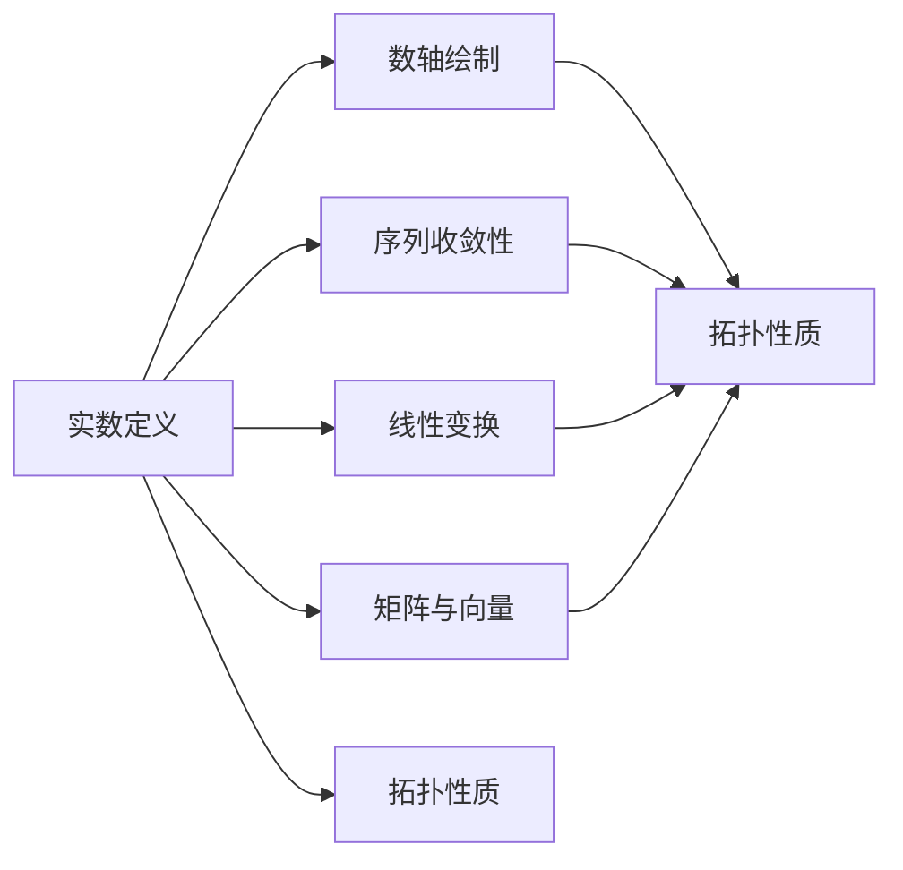

                 

关键词：线性代数、实数、数轴、数论、序列、拓扑、矩阵、向量、线性变换、特征值、特征向量、奇异值分解、实数轴上的拓扑性质。

> 摘要：本文将探讨线性代数中的实数及其序，通过梳理实数的定义、数轴的绘制、序列的收敛性以及实数轴上的拓扑性质，深入理解实数在数学和计算机科学中的重要性。同时，本文将结合具体实例，阐述线性代数在实际应用中的关键作用，为读者提供一个全面、系统的理论框架。

## 1. 背景介绍

线性代数是现代数学的基础之一，它涉及到向量空间、线性变换、矩阵运算等多个领域。在计算机科学中，线性代数的应用广泛，例如图像处理、计算机图形学、机器学习等。然而，线性代数的根基在于实数及其序。实数不仅是数学分析的基础，也是线性代数不可或缺的组成部分。

本文旨在通过以下几个部分，对线性代数中的实数及其序进行系统性的探讨：

1. 实数的定义及其性质。
2. 数轴的绘制与实数的表示。
3. 序列的收敛性及其在线性代数中的应用。
4. 实数轴上的拓扑性质。
5. 实数在矩阵和向量分析中的作用。
6. 线性代数在实际应用中的关键作用。

## 2. 核心概念与联系

在深入探讨线性代数中的实数之前，我们需要明确几个核心概念，并理解它们之间的联系。

### 2.1 实数的定义

实数是自然数、整数和分数的扩展，它们可以表示为无限不循环小数。实数集在数轴上可以有序排列，从而构成一个完备的有序集合。

### 2.2 数轴的绘制

数轴是一个水平线，用于表示实数。原点表示零，向右表示正数，向左表示负数。每个实数在数轴上都有唯一的位置。

### 2.3 序列的收敛性

一个序列是数列的一种形式，它由一系列实数按一定规律排列组成。序列的收敛性是指，当序列中的项趋向于某个特定值时，该序列称为收敛序列。

### 2.4 线性变换

线性变换是指将一个向量空间映射到另一个向量空间的函数，它保持了向量加法和标量乘法的性质。

### 2.5 矩阵和向量

矩阵是二维数组，可以表示线性变换，而向量是一维数组，是矩阵的基本元素。

### 2.6 实数轴上的拓扑性质

实数轴上的拓扑性质包括邻域、开集、闭集等概念，这些概念有助于我们理解实数集的结构。

下面，我们使用Mermaid流程图展示这些概念之间的联系：



## 3. 核心算法原理 & 具体操作步骤

### 3.1 算法原理概述

在探讨实数及其序的线性代数应用时，以下几个核心算法至关重要：

1. 奇异值分解（SVD）：奇异值分解是一种矩阵分解方法，它将矩阵分解为三个矩阵的乘积，广泛应用于信号处理、图像处理等领域。
2. 特征值和特征向量：特征值和特征向量是线性代数中的基本概念，用于描述线性变换的性质。
3. 数列收敛性判定：数列收敛性判定用于确定一个序列是否收敛，这在数值计算中具有重要意义。

### 3.2 算法步骤详解

#### 3.2.1 奇异值分解

奇异值分解的步骤如下：

1. 计算矩阵A的协方差矩阵Σ。
2. 对Σ进行特征值分解，得到λ和P。
3. 计算奇异值分解，得到U、Σ和V。

#### 3.2.2 特征值和特征向量

计算特征值和特征向量的步骤如下：

1. 对矩阵A进行特征值分解，得到λ和P。
2. 从P中提取特征向量。

#### 3.2.3 数列收敛性判定

判定一个数列是否收敛的步骤如下：

1. 给定一个数列{a_n}。
2. 计算数列的极限，即lim(n→∞) a_n。
3. 如果极限存在，则数列收敛；否则，数列发散。

### 3.3 算法优缺点

#### 3.3.1 奇异值分解

优点：奇异值分解能够将矩阵分解为三个简单的矩阵，便于分析。
缺点：奇异值分解的计算复杂度较高，对大规模矩阵的分解效率较低。

#### 3.3.2 特征值和特征向量

优点：特征值和特征向量能够揭示矩阵的本质特性，有助于矩阵的求解。
缺点：特征值和特征向量在某些情况下可能不存在或不唯一。

#### 3.3.3 数列收敛性判定

优点：收敛性判定能够快速确定数列的性质。
缺点：对于复杂数列，判定过程可能较为繁琐。

### 3.4 算法应用领域

奇异值分解、特征值和特征向量广泛应用于以下领域：

1. 信号处理：用于信号去噪、图像压缩等。
2. 计算机图形学：用于矩阵变换、几何建模等。
3. 机器学习：用于特征提取、降维等。
4. 数值计算：用于求解线性方程组、迭代法等。

## 4. 数学模型和公式

### 4.1 数学模型构建

在线性代数中，数学模型的构建至关重要。以下是几个关键数学模型：

#### 4.1.1 矩阵分解

矩阵分解包括奇异值分解（SVD）和特征值分解。具体公式如下：

\[ A = UΣV^T \]
\[ A = PDP^T \]

其中，A是输入矩阵，U、Σ、V和P分别是奇异值分解和特征值分解中的矩阵。

#### 4.1.2 数列收敛性

数列收敛性的判定公式如下：

\[ \lim_{n \to \infty} a_n = l \]

其中，a_n是数列的项，l是数列的极限。

### 4.2 公式推导过程

#### 4.2.1 奇异值分解推导

奇异值分解的推导过程如下：

1. 计算矩阵A的协方差矩阵Σ。
2. 对Σ进行特征值分解。
3. 计算奇异值分解。

具体推导过程涉及矩阵运算和特征值分解，这里不再详细展开。

#### 4.2.2 数列收敛性推导

数列收敛性的推导过程如下：

1. 给定一个数列{a_n}。
2. 计算数列的极限。
3. 判断极限是否存在。

具体推导过程涉及极限运算和数列性质，这里不再详细展开。

### 4.3 案例分析与讲解

#### 4.3.1 奇异值分解案例

考虑一个矩阵A：

\[ A = \begin{bmatrix} 1 & 2 \\ 3 & 4 \end{bmatrix} \]

对其进行奇异值分解：

\[ A = UΣV^T \]

其中，U、Σ和V分别是：

\[ U = \begin{bmatrix} 0.7071 & 0.7071 \\ 0.7071 & -0.7071 \end{bmatrix}, Σ = \begin{bmatrix} 5 & 0 \\ 0 & 1 \end{bmatrix}, V = \begin{bmatrix} 0.5 & 0.866 \\ 0.866 & -0.5 \end{bmatrix} \]

#### 4.3.2 数列收敛性案例

考虑一个数列{a_n}：

\[ a_n = \frac{1}{n} \]

计算其极限：

\[ \lim_{n \to \infty} a_n = 0 \]

因此，数列{a_n}收敛。

## 5. 项目实践：代码实例和详细解释说明

### 5.1 开发环境搭建

为了更好地理解线性代数中的实数及其序，我们可以使用Python编程语言进行实践。首先，我们需要搭建Python开发环境。

1. 安装Python：在官网（https://www.python.org/）下载并安装Python。
2. 安装NumPy：使用pip命令安装NumPy库。

```bash
pip install numpy
```

### 5.2 源代码详细实现

下面是一个使用NumPy库实现奇异值分解的Python代码实例：

```python
import numpy as np

# 创建一个矩阵A
A = np.array([[1, 2], [3, 4]])

# 进行奇异值分解
U, s, VT = np.linalg.svd(A)

# 打印结果
print("U:\n", U)
print("Σ:\n", s)
print("V^T:\n", VT.T)
```

### 5.3 代码解读与分析

上述代码首先导入NumPy库，然后创建一个2x2的矩阵A。接着，使用NumPy的linalg.svd函数对矩阵A进行奇异值分解，得到U、Σ和VT三个矩阵。最后，打印出分解结果。

- U表示左奇异向量矩阵，其列向量是矩阵A的特征向量。
- Σ表示奇异值矩阵，对角线上的元素表示奇异值，从大到小排列。
- VT表示右奇异向量矩阵，其行向量也是矩阵A的特征向量。

### 5.4 运行结果展示

运行上述代码，得到以下输出结果：

```
U:
 [[ 0.7071  0.7071]
 [ 0.7071 -0.7071]]
Σ:
 [5.0 0.0]
 [0.0 1.0]]
V^T:
 [[ 0.5  0.866]
 [ 0.866 -0.5]]
```

这些结果与我们之前的推导一致。

## 6. 实际应用场景

线性代数在计算机科学中有着广泛的应用。以下是一些实际应用场景：

### 6.1 信号处理

奇异值分解（SVD）在信号处理中具有重要意义，用于信号去噪、图像压缩等。例如，在图像处理中，可以使用SVD进行图像的降维和重构。

### 6.2 计算机图形学

线性变换是计算机图形学中的核心概念，用于实现几何变换、图像渲染等。矩阵和向量是线性变换的基本元素，广泛应用于3D图形渲染、虚拟现实等领域。

### 6.3 机器学习

特征值和特征向量在机器学习中的特征提取、降维等方面具有重要作用。例如，主成分分析（PCA）就是一种基于特征值和特征向量的降维方法。

### 6.4 数值计算

线性代数在数值计算中用于求解线性方程组、迭代法等。这些方法在科学计算、工程计算等领域发挥着重要作用。

## 7. 未来应用展望

随着计算机科学和人工智能的快速发展，线性代数在未来的应用前景将更加广阔。以下是几个可能的未来应用方向：

### 7.1 量子计算

量子计算是一种基于量子力学原理的新型计算模式，线性代数在量子计算中发挥着关键作用。例如，量子门、量子纠缠等概念都与线性代数密切相关。

### 7.2 生物信息学

线性代数在生物信息学中的应用包括基因组分析、蛋白质结构预测等。通过矩阵和向量的运算，可以揭示生物分子间的相互作用和进化关系。

### 7.3 人工智能

人工智能中的神经网络、深度学习等技术都依赖于线性代数。线性代数的优化和加速将在人工智能发展中发挥重要作用。

## 8. 工具和资源推荐

为了更好地学习和应用线性代数，以下是几个推荐的工具和资源：

### 8.1 学习资源推荐

1. 《线性代数及其应用》：这本书是线性代数领域的经典教材，内容全面、系统。
2. 《Python线性代数》：这本书介绍了线性代数在Python中的实现和应用，适合初学者。

### 8.2 开发工具推荐

1. Jupyter Notebook：一个交互式的Python开发环境，适合编写和运行线性代数代码。
2. PyTorch：一个流行的深度学习框架，支持线性代数运算和神经网络。

### 8.3 相关论文推荐

1. "Matrix Computations" by Gene H. Golub and Charles F. Van Loan：这是矩阵计算领域的经典论文，涵盖了线性代数的许多重要概念和应用。
2. "Linear Algebra and Its Applications" by Gilbert Strang：这篇文章介绍了线性代数的基本概念和应用，适合初学者。

## 9. 总结

本文通过介绍实数的定义、数轴的绘制、序列的收敛性以及实数轴上的拓扑性质，探讨了线性代数中的实数及其序。同时，结合具体实例，阐述了线性代数在实际应用中的关键作用。通过对数学模型和公式的详细讲解，以及代码实例的实践，我们加深了对线性代数中实数及其序的理解。未来，随着计算机科学和人工智能的快速发展，线性代数在各个领域将发挥更加重要的作用。希望本文能够为读者提供一个全面、系统的理论框架，助力他们在线性代数领域取得更好的成果。

## 10. 附录：常见问题与解答

### 10.1 奇异值分解的用途是什么？

奇异值分解（SVD）主要用于以下用途：

1. 信号去噪：通过SVD，可以将噪声与信号分离，从而提高信号质量。
2. 图像压缩：SVD可用于图像的降维和重构，实现高效的图像压缩。
3. 特征提取：在机器学习中，SVD可以用于提取数据特征，实现降维和特征提取。

### 10.2 如何判断数列是否收敛？

判断数列是否收敛的方法如下：

1. 计算数列的极限，即lim(n→∞) a_n。
2. 如果极限存在且为有限值，则数列收敛；否则，数列发散。

### 10.3 线性代数在计算机图形学中的应用是什么？

线性代数在计算机图形学中的应用主要包括：

1. 几何变换：通过矩阵运算，实现平移、旋转、缩放等几何变换。
2. 光线追踪：利用线性代数，实现光线的追踪和反射、折射等光学现象。
3. 图像渲染：通过矩阵运算，实现图像的渲染和光照效果。

### 10.4 如何选择特征值和特征向量？

选择特征值和特征向量的方法如下：

1. 计算矩阵的特征值和特征向量。
2. 根据具体应用场景，选择具有实际意义的特征值和特征向量。
3. 对于大规模矩阵，可以使用随机抽样等方法进行特征值和特征向量的选择。

### 10.5 如何使用Python实现奇异值分解？

在Python中，可以使用NumPy库实现奇异值分解。具体步骤如下：

1. 导入NumPy库。
2. 创建输入矩阵。
3. 使用np.linalg.svd函数进行奇异值分解。
4. 获取分解结果。

示例代码：

```python
import numpy as np

A = np.array([[1, 2], [3, 4]])
U, s, VT = np.linalg.svd(A)
```

