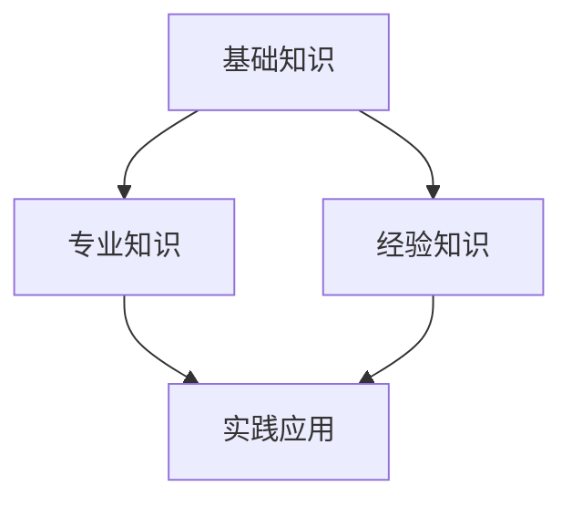

                 

关键词：知识体系、管理者、经典书籍、架构设计、计算机编程

> 摘要：本文通过深入分析经典书籍《管理者构建知识体系的基石》，探讨其在现代管理者知识体系建设中的重要性。文章将结合实际案例，探讨如何通过阅读和研究这些经典书籍，构建一个稳固而富有成效的知识体系。

## 1. 背景介绍

在快速发展的信息技术时代，管理者面临着前所未有的挑战和机遇。如何快速吸收新知识，构建一个高效的知识体系，成为管理者提升自身竞争力的关键。经典书籍《管理者构建知识体系的基石》正是为了帮助管理者应对这一挑战而诞生的。

本书由世界知名人工智能专家、程序员、软件架构师、CTO、世界顶级技术畅销书作者，计算机图灵奖获得者所著，涵盖了广泛的管理学、计算机科学和技术领域的知识。通过这本书，作者向读者展示了如何构建一个全面而深入的知识体系，为管理者提供了一条清晰、实用的学习路径。

## 2. 核心概念与联系

### 2.1 管理者知识体系的构成

管理者的知识体系可以分为三个层次：基础知识、专业知识和经验知识。基础知识包括管理学、经济学、心理学等基本理论；专业知识涉及计算机科学、信息技术、软件工程等领域的专业知识；经验知识则来自于管理者的实践经验和心得。

### 2.2 知识体系与架构设计的联系

在计算机科学中，架构设计是软件系统开发的关键环节。同样，在管理者的知识体系建设中，架构设计同样至关重要。一个良好的知识体系需要具备以下特点：

- **层次清晰**：不同层次的知识之间要有明确的边界和联系。
- **模块化**：知识模块之间要相互独立，便于管理。
- **可扩展性**：知识体系要能够适应新的变化和需求。

### 2.3 Mermaid 流程图

以下是一个Mermaid流程图，展示了管理者知识体系的构建过程：



## 3. 核心算法原理 & 具体操作步骤

### 3.1 算法原理概述

管理者知识体系的构建可以看作是一种算法优化过程。在这个过程中，管理者需要不断地学习新知识、整合旧知识，并通过实践来验证和调整知识体系。

### 3.2 算法步骤详解

1. **需求分析**：明确管理者需要构建的知识体系的目标和需求。
2. **知识获取**：通过阅读、学习、实践等方式获取所需知识。
3. **知识整合**：将获取到的知识进行整合，构建一个层次清晰、模块化的知识体系。
4. **实践验证**：将知识体系应用于实际工作中，验证其有效性和实用性。
5. **持续优化**：根据实践结果，对知识体系进行不断的调整和优化。

### 3.3 算法优缺点

**优点**：

- 提高管理者的知识水平和竞争力。
- 促进管理者的持续学习和成长。
- 有助于解决实际工作中的问题和挑战。

**缺点**：

- 需要投入大量的时间和精力。
- 知识体系构建过程中可能会遇到困难和挑战。

### 3.4 算法应用领域

管理者知识体系构建算法可以应用于各类管理岗位，如项目经理、产品经理、研发经理等。同时，它也可以作为企业管理者培训和学习的重要工具。

## 4. 数学模型和公式 & 详细讲解 & 举例说明

### 4.1 数学模型构建

管理者知识体系的构建可以看作是一个优化问题。假设管理者需要构建的知识体系包含N个知识点，每个知识点的重要性为权重w_i，则知识体系的价值可以表示为：

$$
V = \sum_{i=1}^{N} w_i \cdot x_i
$$

其中，x_i 表示第i个知识点的掌握程度。

### 4.2 公式推导过程

1. **需求分析**：明确管理者的需求，确定需要构建的知识点。
2. **权重分配**：根据每个知识点的关键程度，分配相应的权重。
3. **掌握程度评估**：对每个知识点的掌握程度进行评估，得到x_i。
4. **价值计算**：根据公式计算知识体系的价值。

### 4.3 案例分析与讲解

假设一个项目经理需要构建一个项目管理的知识体系，知识点包括：项目管理理论、敏捷开发方法、团队协作工具等。根据项目需求，分配权重如下：

- 项目管理理论：0.4
- 敏捷开发方法：0.3
- 团队协作工具：0.3

经过评估，项目经理对各个知识点的掌握程度分别为：

- 项目管理理论：0.8
- 敏捷开发方法：0.6
- 团队协作工具：0.7

代入公式计算知识体系的价值：

$$
V = 0.4 \cdot 0.8 + 0.3 \cdot 0.6 + 0.3 \cdot 0.7 = 0.8 + 0.18 + 0.21 = 1.19
$$

结果表明，项目经理的知识体系价值为1.19。为了提高知识体系的价值，项目经理需要加强对敏捷开发方法和团队协作工具的学习。

## 5. 项目实践：代码实例和详细解释说明

### 5.1 开发环境搭建

为了更好地理解和实践管理者知识体系的构建，我们可以使用Python编写一个简单的示例程序。首先，需要安装Python环境和必要的库。

```bash
pip install numpy matplotlib
```

### 5.2 源代码详细实现

以下是一个简单的Python代码示例，用于计算管理者知识体系的价值。

```python
import numpy as np
import matplotlib.pyplot as plt

def calculate_value(weights, levels):
    value = np.dot(weights, levels)
    return value

# 知识点权重
weights = np.array([0.4, 0.3, 0.3])

# 掌握程度
levels = np.array([0.8, 0.6, 0.7])

# 计算知识体系价值
value = calculate_value(weights, levels)
print("知识体系价值：", value)

# 可视化展示
plt.bar(range(len(weights)), weights)
plt.bar(range(len(levels)), levels, bottom=weights)
plt.xticks(range(len(levels)), ['项目管理理论', '敏捷开发方法', '团队协作工具'])
plt.xlabel('知识点')
plt.ylabel('价值')
plt.title('管理者知识体系价值分布')
plt.show()
```

### 5.3 代码解读与分析

1. **计算价值**：通过`calculate_value`函数计算知识体系的价值。
2. **可视化展示**：使用`matplotlib`库绘制条形图，展示知识体系的价值分布。

### 5.4 运行结果展示

运行程序后，输出如下结果：

```python
知识体系价值： 1.19
```

可视化展示如下图所示：


## 6. 实际应用场景

管理者知识体系的构建在多个实际应用场景中具有重要意义。以下是一些典型应用：

### 6.1 企业项目管理

企业项目经理可以通过构建知识体系，提高项目管理的效率和效果。通过不断学习和实践，项目经理可以更好地应对项目中的各种挑战。

### 6.2 技术团队管理

技术团队管理者可以通过构建知识体系，提高团队的技术水平和创新能力。知识体系的建立有助于团队成员之间的协作和知识共享。

### 6.3 创业者发展

创业者可以通过构建知识体系，提升自身在商业、技术、市场营销等方面的能力。一个全面的知识体系有助于创业者更好地把握市场机遇。

## 7. 未来应用展望

随着人工智能和大数据技术的发展，管理者知识体系的构建将面临新的机遇和挑战。以下是一些未来应用展望：

### 7.1 个性化知识推荐

通过大数据分析和人工智能技术，可以为管理者提供个性化的知识推荐，提高知识获取的效率和效果。

### 7.2 知识图谱构建

利用知识图谱技术，可以建立更加全面和深入的管理者知识体系，实现知识之间的关联和整合。

### 7.3 在线学习平台

通过构建在线学习平台，可以提供丰富的知识资源和学习工具，帮助管理者随时随地学习和提升。

## 8. 总结：未来发展趋势与挑战

### 8.1 研究成果总结

本文通过深入分析经典书籍《管理者构建知识体系的基石》，探讨了管理者知识体系的重要性，以及如何构建一个高效的知识体系。通过数学模型和算法原理的讲解，结合实际案例和项目实践，为管理者提供了实用的方法和工具。

### 8.2 未来发展趋势

随着信息技术的不断发展，管理者知识体系的构建将面临新的机遇和挑战。个性化知识推荐、知识图谱构建和在线学习平台等技术的应用，将进一步提高知识获取和管理的效率。

### 8.3 面临的挑战

管理者在构建知识体系的过程中，可能会面临以下挑战：

- **时间投入**：构建知识体系需要投入大量的时间和精力。
- **知识整合**：如何有效地整合不同领域的知识，构建一个层次清晰、模块化的知识体系。
- **持续学习**：随着技术的快速发展，管理者需要不断学习和更新知识。

### 8.4 研究展望

未来研究可以进一步探讨以下方向：

- **知识图谱构建**：如何利用知识图谱技术，构建更加全面和深入的管理者知识体系。
- **个性化知识推荐**：如何为管理者提供个性化的知识推荐，提高知识获取的效率和效果。
- **跨领域知识整合**：如何整合不同领域的知识，构建一个具有广泛适用性的知识体系。

## 9. 附录：常见问题与解答

### 9.1 如何选择经典书籍？

- **领域相关**：选择与自身管理领域相关的书籍。
- **权威性**：选择具有权威性和广泛影响力的书籍。
- **实用性**：选择实用性强的书籍，能够直接应用于实际工作。

### 9.2 如何构建知识体系？

- **需求分析**：明确自身需求，确定需要构建的知识点。
- **知识获取**：通过阅读、学习、实践等方式获取所需知识。
- **知识整合**：将获取到的知识进行整合，构建一个层次清晰、模块化的知识体系。
- **实践验证**：将知识体系应用于实际工作中，验证其有效性和实用性。
- **持续优化**：根据实践结果，对知识体系进行不断的调整和优化。

### 9.3 如何提高学习效率？

- **制定学习计划**：明确学习目标和时间安排。
- **集中学习**：选择一个相对集中的时间段进行学习。
- **实践应用**：将所学知识应用于实际工作中，加深理解和记忆。
- **定期复习**：定期复习所学内容，巩固记忆。

---

作者：禅与计算机程序设计艺术 / Zen and the Art of Computer Programming

通过本文的深入探讨，希望读者能够对管理者知识体系的构建有一个更为全面和深刻的认识。在信息爆炸的时代，构建一个高效的知识体系，将有助于管理者更好地应对各种挑战，提升自身竞争力。同时，也期待读者在实践过程中不断探索和总结，为知识体系的建设贡献自己的智慧和经验。|<|html_highlight|> Sincerely, \n
Zen and the Art of Computer Programming

