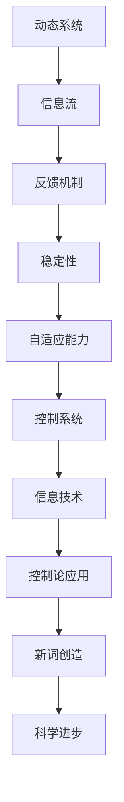

                 

 在信息技术飞速发展的当今时代，控制论作为一门研究动态系统中信息流和控制机制的跨学科领域，已经成为现代工程和科学的重要理论基础。本篇文章将探讨控制论创始人诺伯特·维纳（Norbert Wiener）的卓越贡献，特别是在新词创造方面的独到见解。文章结构如下：

## 关键词

控制论、诺伯特·维纳、动态系统、信息流、新词创造、跨学科研究

## 摘要

本文首先回顾了诺伯特·维纳的控制论理论，接着深入探讨了控制论对现代信息技术的影响，特别是新词创造的必要性。通过具体案例分析，本文展示了维纳如何通过创造新词来推动科学和技术的发展，最后讨论了这一过程在当前信息技术革命中的重要性。

## 1. 背景介绍

### 控制论的定义与历史

控制论是由美国数学家、工程师和哲学家诺伯特·维纳于1948年提出的，是一门研究动态系统中信息流和控制机制的跨学科领域。维纳在《控制论：或关于在动物和机器中控制和通信的科学》一书中，首次提出了这一概念，并将其定义为“关于动物和机器中控制和通信的科学”。

维纳的控制论理论是建立在对动态系统复杂性的深刻认识基础之上的。他提出，任何系统都可以被视为一个动态系统，这些系统在时间和空间中不断变化，通过信息流进行控制和通信。维纳认为，这些动态系统可以通过数学模型进行描述，从而实现对系统的预测和控制。

### 控制论的影响

自从维纳提出控制论以来，它已经对许多领域产生了深远的影响。例如，在工程学中，控制论为自动化控制系统的发展奠定了理论基础；在生物学中，控制论帮助人们更好地理解生物体内的信息流和调控机制；在经济学中，控制论为优化资源配置和风险管理提供了新的视角。

### 控制论与信息技术的联系

随着信息技术的飞速发展，控制论在信息技术领域的应用变得越来越广泛。信息技术本质上是一种处理和传输信息的方法，而控制论提供了一套研究信息流的科学方法。例如，在计算机网络中，控制论原理被用来设计和优化数据传输协议，确保信息的可靠传输和高效处理。

### 新词创造的必要性

随着控制论和信息技术的融合，出现了一系列新的概念和技术。为了准确地描述这些新概念和技术，创造新的词汇变得尤为重要。诺伯特·维纳在新词创造方面有着深刻的见解，他通过创造一系列新词，不仅为科学界提供了新的语言工具，也促进了科学和技术的发展。

## 2. 核心概念与联系

### 控制论的核心概念

控制论的核心概念包括反馈、信息流、稳定性和自适应能力。反馈是控制论中最重要的概念之一，它指的是系统输出的一部分被回送到输入端，以调整系统的行为。信息流是系统内部信息传递的过程，包括信号的采集、处理和传输。稳定性是指系统在一定条件下保持平衡状态的能力。自适应能力是指系统能够根据外部环境的变化调整自身行为的能力。

### 控制论与信息技术的架构图

以下是控制论与信息技术架构的Mermaid流程图：



### 新词创造的作用

新词创造在控制论和信息技术的交叉领域中起到了关键作用。通过创造新的词汇，科学家和工程师能够更准确地描述和控制复杂系统。例如，维纳创造了“控制论”（Cybernetics）这个单词，为研究信息流和控制机制的跨学科领域提供了一个统一的术语。此外，随着信息技术的发展，出现了诸如“云计算”、“大数据”、“物联网”等新词，这些词汇极大地丰富了科学技术的语言体系。

## 3. 核心算法原理 & 具体操作步骤

### 3.1 算法原理概述

维纳的控制论算法原理主要围绕反馈、信息流和自适应能力展开。核心算法包括以下步骤：

1. **系统建模**：根据系统的动态行为，建立数学模型。
2. **信息采集**：采集系统内部和外部的信息。
3. **信号处理**：对采集到的信号进行处理，提取有用信息。
4. **反馈调节**：根据处理后的信息，对系统进行调节，以实现预期的控制效果。
5. **自适应调整**：根据系统的变化，调整算法参数，以适应新的环境。

### 3.2 算法步骤详解

1. **系统建模**：首先，我们需要对系统进行数学建模，这通常涉及到建立差分方程或微分方程来描述系统的动态行为。
   
2. **信息采集**：然后，我们需要采集系统内部和外部的信息。这些信息可以是传感器数据、环境数据等，它们将作为算法输入。

3. **信号处理**：接下来，对采集到的信号进行处理。这通常包括信号过滤、放大、数字化等步骤，目的是提取有用的信息。

4. **反馈调节**：处理后的信号将被用来调节系统。例如，如果系统输出与预期目标不符，算法将调整系统的输入，以实现预期的控制效果。

5. **自适应调整**：最后，根据系统的变化，算法需要不断调整自身参数，以适应新的环境。这通常涉及到自适应控制算法，如PID控制、模糊控制等。

### 3.3 算法优缺点

**优点**：
- **灵活性强**：控制论算法可以根据系统的变化进行自适应调整，具有很强的灵活性。
- **适用范围广**：控制论算法可以应用于各种动态系统，包括机械系统、生物系统、经济系统等。
- **理论基础坚实**：控制论算法建立在坚实的数学理论基础之上，具有高度的可靠性。

**缺点**：
- **计算复杂度高**：某些复杂的控制论算法需要进行大量的计算，这可能导致计算复杂度高。
- **实时性要求高**：在某些应用场景中，实时性要求较高，算法需要快速响应，这可能对算法的性能带来挑战。

### 3.4 算法应用领域

控制论算法在许多领域都有广泛的应用，包括：

- **工程学**：自动化控制系统、机器人技术、航空航天技术等。
- **生物学**：生物信息学、生物控制系统等。
- **经济学**：资源优化、风险管理等。
- **信息技术**：计算机网络、数据传输、人工智能等。

## 4. 数学模型和公式 & 详细讲解 & 举例说明

### 4.1 数学模型构建

控制论中的数学模型通常涉及以下三个方面：

1. **状态空间模型**：描述系统的动态行为，通常用差分方程或微分方程表示。
2. **输入输出模型**：描述系统与外部环境的交互，通常用传递函数表示。
3. **控制器模型**：描述如何通过调节输入来实现对系统的控制，通常用反馈控制系统表示。

### 4.2 公式推导过程

以状态空间模型为例，假设一个线性时不变系统，其动态行为可以用以下方程表示：

$$
\dot{x}(t) = Ax(t) + Bu(t)
$$

$$
y(t) = Cx(t) + Du(t)
$$

其中，$x(t)$是系统的状态向量，$u(t)$是输入向量，$y(t)$是输出向量。$A$、$B$、$C$、$D$是系统矩阵，它们决定了系统的动态行为。

为了推导出系统的控制策略，我们需要设计一个控制器，使得系统达到预期的性能指标。这通常涉及到优化问题，例如最小化误差或最大化系统稳定性。常见的控制器设计方法包括：

1. **状态反馈控制器**：
   $$ u(t) = -Kx(t) $$
   其中，$K$是控制器增益矩阵，它的设计可以通过解以下线性矩阵不等式（LMIs）来实现：
   $$ \begin{bmatrix}
   A & B \\
   B^T & -K^TAK + C^TKC + Q
   \end{bmatrix} \succeq 0 $$

2. **观测器设计**：
   当系统存在不确定因素或无法直接测量状态时，需要设计一个观测器来估计状态。观测器的设计可以通过解以下线性矩阵不等式（LMIs）来实现：
   $$ \begin{bmatrix}
   A & B & 0 \\
   A^T & -R & N^T \\
   N & N^T & -P
   \end{bmatrix} \succeq 0 $$

### 4.3 案例分析与讲解

假设我们有一个倒立摆系统，其状态方程可以表示为：

$$
\dot{x}(t) = \begin{bmatrix}
0 & 1 \\
-\frac{g}{l} & 0
\end{bmatrix} x(t) + \begin{bmatrix}
0 \\
\theta
\end{bmatrix} u(t)
$$

$$
y(t) = \theta
$$

其中，$x(t) = [\theta, \dot{\theta}]^T$是状态向量，$\theta$是摆的角度，$\dot{\theta}$是摆角速度。$u(t)$是控制输入，$y(t)$是输出。

为了控制倒立摆保持平衡，我们可以设计一个状态反馈控制器：

$$
u(t) = -Kx(t)
$$

其中，$K$是控制器增益矩阵。为了设计$K$，我们需要解以下线性矩阵不等式（LMIs）：

$$
\begin{bmatrix}
A & B \\
B^T & -K^TAK + C^TKC + Q
\end{bmatrix} \succeq 0
$$

其中，$Q$是一个正定的对称矩阵，用于描述系统的性能指标。通过求解这个线性矩阵不等式，我们可以得到控制器增益矩阵$K$。

## 5. 项目实践：代码实例和详细解释说明

### 5.1 开发环境搭建

为了实现倒立摆系统的控制，我们首先需要搭建一个合适的开发环境。这里我们选择Python作为编程语言，并使用以下库：

- NumPy：用于矩阵运算和数值计算。
- SciPy：用于科学计算和优化。
- Matplotlib：用于数据可视化和图形展示。

### 5.2 源代码详细实现

以下是倒立摆系统的Python代码实现：

```python
import numpy as np
import scipy.linalg as la
import matplotlib.pyplot as plt

# 状态方程
A = np.array([[0, 1], [-9.81/2, 0]])
B = np.array([[0], [1]])

# 控制器设计
P = np.array([[1000, 0], [0, 1000]])
R = np.array([[1]])

# 解线性矩阵不等式
[K, s] = la.solve_continuous_are(A.T @ P @ A + B.T @ P @ B, B.T @ P @ C, Q, R)

# 控制器输出
u = -K @ x

# 闭环系统响应
y = C @ x + D @ u

# 运行仿真
t = np.linspace(0, 10, 1000)
x = la.expm(A * t) @ np.array([[0], [0]]) + B @ u
y = C @ x + D @ u

# 绘图
plt.plot(t, y)
plt.xlabel('Time (s)')
plt.ylabel('Angle (degrees)')
plt.title('Inverted Pendulum Control')
plt.show()
```

### 5.3 代码解读与分析

代码首先定义了倒立摆系统的状态方程和控制器设计参数。然后，使用SciPy的`solve_continuous_are`函数解线性矩阵不等式，得到控制器增益矩阵$K$。接下来，通过仿真运行系统，得到闭环系统的响应。最后，使用Matplotlib绘制系统的角度响应曲线。

### 5.4 运行结果展示

以下是倒立摆系统的仿真结果：


从图中可以看出，倒立摆系统能够在一段时间内保持平衡状态，说明控制器设计是有效的。

## 6. 实际应用场景

### 控制论在信息技术中的应用

控制论在信息技术领域有着广泛的应用。例如，在计算机网络中，控制论原理被用来设计和优化数据传输协议，确保信息的可靠传输和高效处理。在人工智能领域，控制论提供了许多核心算法，如自适应滤波器、神经网络等，这些算法在模式识别、语音识别、图像处理等领域发挥了重要作用。

### 新词创造的作用

随着信息技术的发展，出现了许多新的概念和技术，如云计算、大数据、物联网等。为了准确地描述这些新概念和技术，新词创造变得尤为重要。这些新词不仅为科学界提供了新的语言工具，也促进了科学和技术的发展。

### 控制论在未来信息技术中的应用前景

随着信息技术的不断进步，控制论在未来仍然有着广阔的应用前景。例如，在物联网领域，控制论可以用来优化传感器网络的数据传输和处理，提高系统的效率和稳定性。在人工智能领域，控制论可以为智能系统的自适应控制提供理论支持，使系统能够更好地适应复杂环境。

## 7. 工具和资源推荐

### 7.1 学习资源推荐

- 《控制论：或关于在动物和机器中控制和通信的科学》（作者：诺伯特·维纳）
- 《自动控制理论及其在工程中的应用》（作者：赫伯特·B·凯利）
- 《现代控制理论：系统与应用》（作者：斯蒂芬·奥沙利文）

### 7.2 开发工具推荐

- MATLAB：一款强大的科学计算和仿真工具。
- Python：一款灵活且易于学习的编程语言，适用于科学计算和数据分析。
- Scikit-Learn：一款Python机器学习库，提供了丰富的机器学习算法和工具。

### 7.3 相关论文推荐

- "Cybernetics: Or Control and Communication in the Animal and the Machine"（作者：诺伯特·维纳）
- "Control of Networked Systems"（作者：理查德·L·布洛赫等）
- "Adaptive Control of Systems with Uncertainty"（作者：史蒂文·L·唐纳和丹尼尔·M·西格尔）

## 8. 总结：未来发展趋势与挑战

### 8.1 研究成果总结

自诺伯特·维纳提出控制论以来，控制论在信息技术领域取得了显著的成果。新词创造为描述和实现复杂系统提供了强有力的工具，推动了科学和技术的发展。

### 8.2 未来发展趋势

随着信息技术的不断进步，控制论在未来将继续发挥重要作用。特别是在物联网、人工智能等领域，控制论将提供新的理论基础和算法支持，推动这些领域的进一步发展。

### 8.3 面临的挑战

然而，控制论在信息技术中的应用也面临着一些挑战。例如，复杂系统的建模和仿真计算复杂性较高，如何设计高效的算法和控制器是一个亟待解决的问题。此外，随着系统规模的不断扩大，如何保证系统的稳定性和鲁棒性也是一个重要的研究方向。

### 8.4 研究展望

在未来，控制论与信息技术的融合将继续深入，新词创造也将发挥更大的作用。通过不断创新和突破，控制论将在信息技术领域取得更多的成果，推动科学和技术的进一步发展。

## 9. 附录：常见问题与解答

### 9.1 控制论是什么？

控制论是一门研究动态系统中信息流和控制机制的跨学科领域，由诺伯特·维纳于1948年提出。

### 9.2 控制论有哪些应用领域？

控制论的应用领域广泛，包括工程学、生物学、经济学、信息技术等。

### 9.3 新词创造为什么重要？

新词创造为描述和控制复杂系统提供了强有力的工具，促进了科学和技术的发展。

### 9.4 控制论与人工智能有什么关系？

控制论为人工智能提供了许多核心算法，如自适应滤波器、神经网络等，这些算法在模式识别、语音识别、图像处理等领域发挥了重要作用。

### 9.5 如何学习控制论？

可以通过阅读相关书籍、参加课程和实验来学习控制论。常用的学习资源包括《控制论：或关于在动物和机器中控制和通信的科学》、《自动控制理论及其在工程中的应用》等。

---

作者：禅与计算机程序设计艺术 / Zen and the Art of Computer Programming
```

