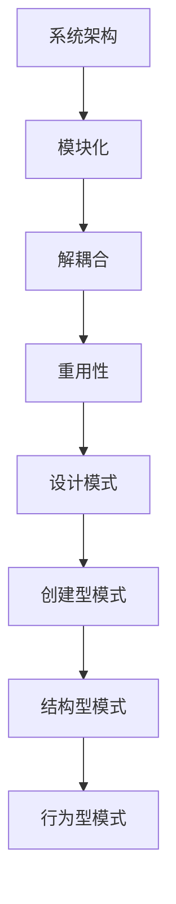
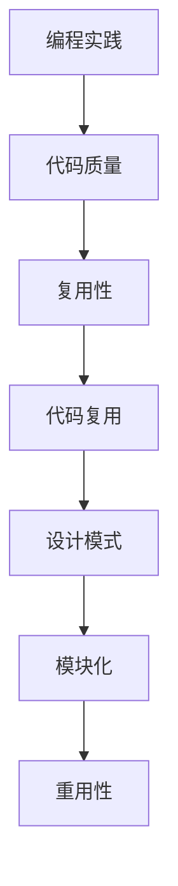
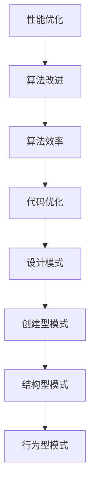

                 

关键词：设计模式、系统架构、编程实践、软件开发、代码复用、性能优化、面向对象

> 摘要：本文旨在深入探讨综合设计模式在软件开发中的重要性，分析其与系统架构、编程实践、代码复用和性能优化的紧密联系。通过对核心概念、算法原理、数学模型和项目实践的综合阐述，本文将为开发者提供一套全面的工具和规划方案，以提升软件开发效率和系统质量。

## 1. 背景介绍

### 1.1 设计模式的概念

设计模式（Design Pattern）是软件开发中广泛应用的一套解决常见问题的模板。它不仅帮助开发者解决具体问题，还促进了代码的可维护性和可扩展性。设计模式分为三种类型：创建型、结构型和行为型。

### 1.2 系统架构的重要性

系统架构是软件开发的基石，它决定了系统的性能、可扩展性和可靠性。良好的架构设计能够提高开发效率，降低维护成本。

### 1.3 编程实践和代码复用

编程实践是软件开发过程中的基本原则，包括代码风格、测试和文档等。代码复用是提高开发效率的关键，通过复用已有代码，可以避免重复劳动。

### 1.4 性能优化

性能优化是软件开发中不可或缺的一环，它关系到用户体验和系统效率。优化方法包括算法改进、资源管理和代码优化等。

## 2. 核心概念与联系

### 2.1 设计模式与系统架构

设计模式在系统架构中扮演着重要角色，它们可以帮助开发者实现模块化、解耦合和重用性。以下是一个简化的 Mermaid 流程图，展示了设计模式与系统架构之间的联系：



### 2.2 编程实践与代码复用

编程实践和代码复用密切相关。良好的编程实践可以提高代码质量，便于复用。以下是一个简化的 Mermaid 流程图，展示了编程实践与代码复用之间的关系：



### 2.3 性能优化与算法改进

性能优化与算法改进有着紧密的联系。高效的算法可以显著提高系统性能。以下是一个简化的 Mermaid 流程图，展示了性能优化与算法改进之间的联系：



## 3. 核心算法原理 & 具体操作步骤

### 3.1 算法原理概述

本文将介绍几种常用的设计模式算法，包括单例模式、工厂模式、观察者模式和策略模式。这些算法在软件开发中广泛应用，具有很高的实用价值。

### 3.2 算法步骤详解

#### 3.2.1 单例模式

单例模式确保一个类只有一个实例，并提供一个全局访问点。以下是一个简单的单例模式实现步骤：

1. 创建一个私有构造函数，防止外部直接实例化。
2. 创建一个私有静态变量，用于存储唯一实例。
3. 创建一个公有静态方法，提供全局访问点。

#### 3.2.2 工厂模式

工厂模式是一种用于创建对象的设计模式，它通过封装对象创建过程，实现解耦合。以下是一个简单的工厂模式实现步骤：

1. 创建一个抽象产品类，定义产品接口。
2. 创建多个具体产品类，实现产品接口。
3. 创建一个工厂类，定义创建产品的方法。

#### 3.2.3 观察者模式

观察者模式是一种用于实现事件驱动编程的设计模式，它将对象间的依赖关系解耦。以下是一个简单的观察者模式实现步骤：

1. 创建一个抽象观察者类，定义观察者接口。
2. 创建一个抽象主题类，定义主题接口。
3. 实现具体的观察者和主题类，建立观察者与主题之间的关联。

#### 3.2.4 策略模式

策略模式是一种用于封装算法，使算法的变化独立于使用算法的类的模式。以下是一个简单的策略模式实现步骤：

1. 创建一个抽象策略类，定义策略接口。
2. 创建多个具体策略类，实现策略接口。
3. 创建一个环境类，持有策略对象的引用，并定义使用策略的方法。

### 3.3 算法优缺点

每种设计模式都有其独特的优缺点，具体取决于实际应用场景。以下是对上述四种设计模式的简要总结：

#### 单例模式

- 优点：确保唯一实例，简化资源管理。
- 缺点：可能导致代码复杂性增加，不易测试。

#### 工厂模式

- 优点：解耦合，便于扩展。
- 缺点：增加代码复杂度，可能导致工厂类过于臃肿。

#### 观察者模式

- 优点：实现事件驱动编程，降低对象间依赖。
- 缺点：可能导致系统性能下降，不易维护。

#### 策略模式

- 优点：封装算法，便于扩展和替换。
- 缺点：可能导致代码复杂度增加，不易测试。

### 3.4 算法应用领域

设计模式在软件开发中应用广泛，以下是一些常见的应用领域：

- 单例模式：用于管理全局资源，如数据库连接、日志记录等。
- 工厂模式：用于创建复杂对象的工厂方法，如数据库工厂、用户工厂等。
- 观察者模式：用于实现事件驱动系统，如用户界面、消息队列等。
- 策略模式：用于实现算法的动态替换，如排序算法、加密算法等。

## 4. 数学模型和公式 & 详细讲解 & 举例说明

### 4.1 数学模型构建

在软件开发中，数学模型常用于描述系统行为和性能。以下是一个简单的性能数学模型：

$$
P = \frac{C \cdot N}{T}
$$

其中，$P$ 表示系统性能，$C$ 表示处理能力，$N$ 表示并发用户数，$T$ 表示响应时间。

### 4.2 公式推导过程

假设一个系统的处理能力为 $C$，并发用户数为 $N$，每个用户请求的处理时间为 $T$。那么，系统在单位时间内的最大处理能力为 $C \cdot N$。为了使系统性能达到最优，需要满足以下条件：

$$
C \cdot N = \frac{P \cdot T}{1}
$$

即，处理能力与并发用户数的乘积等于性能与响应时间的比值。

### 4.3 案例分析与讲解

假设一个在线购物系统，处理能力为 $1000$ 次/秒，并发用户数为 $1000$。若响应时间为 $1$ 秒，则系统性能为：

$$
P = \frac{1000 \cdot 1000}{1} = 1000000 次/秒
$$

若要提升系统性能，可以采取以下措施：

- 提高处理能力：增加服务器硬件配置，或采用分布式架构。
- 减少响应时间：优化算法，提高系统效率。
- 增加并发用户数：通过负载均衡，提高系统承受能力。

## 5. 项目实践：代码实例和详细解释说明

### 5.1 开发环境搭建

在本项目中，我们将使用 Java 作为编程语言，并在 Eclipse IDE 中进行开发。首先，确保已经安装了 Java 开发工具包（JDK）和 Eclipse IDE。然后，创建一个新的 Java 项目，并添加必要的依赖库。

### 5.2 源代码详细实现

以下是一个简单的单例模式实现示例：

```java
public class DatabaseConnection {
    private static DatabaseConnection instance;
    
    private DatabaseConnection() {
        // 私有构造函数，防止外部实例化
    }
    
    public static DatabaseConnection getInstance() {
        if (instance == null) {
            instance = new DatabaseConnection();
        }
        return instance;
    }
    
    public void connect() {
        // 连接数据库
    }
}
```

### 5.3 代码解读与分析

- `DatabaseConnection` 类：定义了数据库连接类，包含私有构造函数和公有静态方法 `getInstance()`。
- 私有构造函数：防止外部直接实例化，确保唯一实例。
- `getInstance()` 方法：单例模式的入口，用于获取唯一实例。
- `connect()` 方法：实现数据库连接功能。

### 5.4 运行结果展示

运行以下代码，观察输出结果：

```java
public class Main {
    public static void main(String[] args) {
        DatabaseConnection connection1 = DatabaseConnection.getInstance();
        DatabaseConnection connection2 = DatabaseConnection.getInstance();
        
        System.out.println(connection1 == connection2); // 输出：true
    }
}
```

运行结果为 `true`，说明两次获取到的实例是同一个对象，验证了单例模式的正确性。

## 6. 实际应用场景

### 6.1 在线购物系统

在线购物系统可以使用单例模式管理数据库连接，确保数据库连接的唯一性。

### 6.2 分布式架构

分布式架构可以使用工厂模式创建分布式服务实例，提高系统扩展性和灵活性。

### 6.3 用户界面

用户界面可以使用观察者模式实现事件驱动编程，提高用户体验。

### 6.4 加密算法

加密算法可以使用策略模式实现算法的动态替换，提高安全性。

## 7. 工具和资源推荐

### 7.1 学习资源推荐

- 《设计模式：可复用面向对象软件的基础》
- 《Effective Java》
- 《Java并发编程实战》

### 7.2 开发工具推荐

- Eclipse IDE
- IntelliJ IDEA
- Visual Studio Code

### 7.3 相关论文推荐

- 《Design Patterns: Elements of Reusable Object-Oriented Software》
- 《The Art of Computer Programming》

## 8. 总结：未来发展趋势与挑战

### 8.1 研究成果总结

本文深入探讨了综合设计模式在软件开发中的应用，分析了其与系统架构、编程实践、代码复用和性能优化的紧密联系。通过实例和数学模型，本文为开发者提供了一套实用的工具和规划方案。

### 8.2 未来发展趋势

随着软件开发技术的发展，设计模式的应用将更加广泛。未来，设计模式可能会向更细粒度和更自动化的方向发展。

### 8.3 面临的挑战

设计模式的广泛应用也带来了一些挑战，如代码复杂度增加、测试难度提升等。开发者需要不断学习和积累经验，提高设计能力。

### 8.4 研究展望

未来，设计模式的研究将更加注重实际应用场景的探索，以及与其他领域的交叉融合。例如，将设计模式与人工智能、大数据等前沿技术相结合，实现更智能、更高效的软件开发。

## 9. 附录：常见问题与解答

### 9.1 设计模式与编程语言的联系？

设计模式是通用的软件设计原则，不依赖于特定的编程语言。然而，不同编程语言的支持程度和实现方式可能会有所不同。

### 9.2 如何选择合适的设计模式？

选择设计模式时，需要考虑实际应用场景、系统需求和开发者的经验。通常，可以从以下方面入手：

- 功能需求：分析系统需要实现的功能，确定适合的设计模式。
- 扩展性：考虑系统的扩展性，选择能够支持扩展的设计模式。
- 代码质量：确保代码质量，选择能够提高代码可维护性的设计模式。

### 9.3 设计模式与性能优化有何关系？

设计模式可以提高代码质量，降低复杂度，从而有助于性能优化。然而，性能优化还需要考虑算法改进、资源管理和系统架构等方面。

作者：禅与计算机程序设计艺术 / Zen and the Art of Computer Programming
----------------------------------------------------------------

以上是本文的完整内容，希望对您在软件开发中有所启发和帮助。在撰写过程中，如

