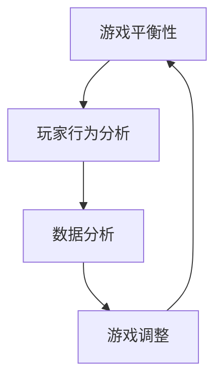

                 

关键词：网易，游戏数值策划，社招面试，指南，策略游戏，数据分析，算法应用，人才选拔。

> 摘要：本文旨在为准备参加网易2025游戏数值策划师社招面试的候选人提供全面的指南。通过对游戏数值策划的核心职责、面试难点、技能要求以及面试准备策略的深入分析，帮助候选人了解面试流程，提升面试成功率。

## 1. 背景介绍

随着电子游戏产业的飞速发展，游戏数值策划师在游戏开发中扮演了越来越重要的角色。作为游戏的核心组成部分，数值策划不仅影响到游戏的平衡性、可玩性和商业成功，还直接影响玩家的游戏体验和留存率。网易作为中国领先的互联网科技公司，其在游戏领域的成就和影响力有目共睹。因此，网易游戏数值策划师的职位吸引了许多优秀人才的关注。

本文将围绕以下几个核心问题展开：

1. **游戏数值策划师的职责是什么？**
2. **面试过程中可能遇到的问题有哪些？**
3. **应聘者需要具备哪些技能和素质？**
4. **如何准备面试以提升成功率？**

通过本文的阅读，应聘者将对网易游戏数值策划师岗位有更深入的理解，并为面试做好充分准备。

## 2. 核心概念与联系

为了更好地理解游戏数值策划师的角色，我们需要探讨以下几个核心概念：

- **游戏平衡性（Game Balance）：** 游戏中的各个元素（如角色能力、道具、关卡等）之间的力量对比，确保玩家在游戏中能有公平的竞争机会。
- **玩家行为分析（Player Behavior Analysis）：** 对玩家的游戏行为、偏好和反馈进行分析，以调整游戏数值，提升玩家的游戏体验。
- **数据分析（Data Analysis）：** 利用数据分析工具和方法对游戏运行数据进行分析，以获取玩家行为和游戏表现的相关信息。

以下是一个使用Mermaid绘制的流程图，展示了游戏数值策划中的核心概念和它们之间的联系：



**图 1：游戏数值策划的核心概念与联系**

通过这个流程图，我们可以看到游戏数值策划是一个闭环系统，不断地通过数据分析来调整游戏，以达到最佳的平衡性和玩家体验。

## 3. 核心算法原理 & 具体操作步骤

### 3.1 算法原理概述

游戏数值策划中的核心算法通常涉及以下几个方面：

- **动态调整算法（Dynamic Adjustment Algorithms）：** 根据游戏中的实时数据动态调整游戏参数，如玩家等级、技能效果、怪物强度等。
- **回归分析算法（Regression Analysis Algorithms）：** 用于分析游戏数据和玩家行为，找出影响游戏平衡性的关键因素。
- **优化算法（Optimization Algorithms）：** 通过数学模型优化游戏数值，以提高游戏平衡性和可玩性。

### 3.2 算法步骤详解

以下是游戏数值策划中常用的动态调整算法的步骤：

1. **数据收集与预处理：** 收集游戏运行数据，包括玩家行为、游戏事件、游戏结果等，进行数据清洗和预处理，确保数据的准确性和一致性。
2. **特征提取：** 从原始数据中提取关键特征，如玩家等级、胜率、通关时间等，这些特征将用于算法分析和模型训练。
3. **模型训练：** 使用机器学习算法，如回归分析、决策树、神经网络等，训练数值调整模型，以预测游戏中的各种变化趋势。
4. **动态调整：** 根据模型预测的结果，实时调整游戏参数，如玩家等级增长速度、技能效果、怪物强度等。
5. **效果评估：** 收集调整后的数据，对调整效果进行评估，如玩家留存率、游戏时长、玩家满意度等。

### 3.3 算法优缺点

**动态调整算法的优点：**

- **实时性：** 能够根据游戏中的实时数据快速调整游戏参数，提高游戏的动态平衡性。
- **灵活性：** 可以根据不同的游戏场景和玩家群体，灵活调整游戏参数，提升玩家体验。

**动态调整算法的缺点：**

- **计算成本：** 需要大量的计算资源和时间进行数据收集、预处理和模型训练。
- **数据依赖：** 需要准确和丰富的数据支持，否则可能导致调整效果不佳。

### 3.4 算法应用领域

动态调整算法广泛应用于策略游戏、竞技游戏和角色扮演游戏等多个游戏类型中，其应用效果显著。例如，在竞技游戏中，动态调整算法可以实时调整英雄的技能效果，以保持游戏的平衡性；在角色扮演游戏中，可以调整玩家的经验获取速度，以提升玩家的游戏体验。

## 4. 数学模型和公式 & 详细讲解 & 举例说明

### 4.1 数学模型构建

在游戏数值策划中，常用的数学模型包括线性回归模型、逻辑回归模型和决策树模型等。以下是线性回归模型的基本构建过程：

1. **设定目标函数：** 设定游戏数值调整的目标函数，如最小化玩家流失率、最大化游戏时长等。
2. **收集特征数据：** 收集与目标函数相关的特征数据，如玩家等级、胜率、通关时间等。
3. **构建模型：** 使用线性回归公式建立模型，公式如下：

   $$Y = \beta_0 + \beta_1X_1 + \beta_2X_2 + ... + \beta_nX_n$$

   其中，$Y$ 是目标变量，$X_1, X_2, ..., X_n$ 是特征变量，$\beta_0, \beta_1, ..., \beta_n$ 是模型参数。

### 4.2 公式推导过程

线性回归模型的推导过程基于最小二乘法（Least Squares Method）。具体步骤如下：

1. **设定损失函数：** 损失函数用于衡量模型预测值与实际值之间的差距，常用的损失函数为均方误差（Mean Squared Error，MSE）：

   $$L(\beta_0, \beta_1, ..., \beta_n) = \sum_{i=1}^{n}(Y_i - \beta_0 - \beta_1X_{i1} - \beta_2X_{i2} - ... - \beta_nX_{in})^2$$

2. **求导并令导数为零：** 对损失函数关于每个参数求导，并令导数为零，求得参数的最优值。

   $$\frac{\partial L}{\partial \beta_0} = 0$$
   $$\frac{\partial L}{\partial \beta_1} = 0$$
   $$...$$
   $$\frac{\partial L}{\partial \beta_n} = 0$$

3. **求解参数：** 通过求解上述方程组，得到线性回归模型的最优参数。

### 4.3 案例分析与讲解

假设我们要调整一款策略游戏中的玩家等级增长速度，以提升玩家的游戏时长。我们可以使用线性回归模型进行分析：

1. **设定目标函数：** 设定玩家等级增长速度为目标变量，玩家在游戏中的活跃时间为特征变量。
2. **收集特征数据：** 收集过去三个月内玩家的等级增长速度和他们在游戏中的活跃时间。
3. **构建模型：** 使用线性回归模型进行训练，得到如下公式：

   $$\text{等级增长速度} = \beta_0 + \beta_1 \times \text{活跃时间}$$

   其中，$\beta_0 = 5$，$\beta_1 = 0.3$。

4. **模型解释：** 根据模型，每增加一小时的活跃时间，玩家等级增长速度将提高0.3级。

通过这个案例，我们可以看到数学模型在游戏数值策划中的应用，它帮助我们量化了玩家行为对游戏数值的影响，从而为游戏平衡性和玩家体验的调整提供了科学的依据。

## 5. 项目实践：代码实例和详细解释说明

### 5.1 开发环境搭建

在开始编写代码之前，我们需要搭建一个适合游戏数值策划的开发环境。以下是一个基本的开发环境搭建流程：

1. **安装Python环境：** Python是一种广泛用于数据分析的编程语言，我们将在项目中使用Python及其相关库。
2. **安装Anaconda：** Anaconda是一个Python数据科学平台，它包含了大量的数据分析和机器学习库。
3. **安装Jupyter Notebook：** Jupyter Notebook是一个交互式环境，我们将在其中编写和运行代码。

### 5.2 源代码详细实现

以下是一个简单的Python代码实例，用于实现线性回归模型，并调整游戏中的玩家等级增长速度：

```python
import numpy as np
import matplotlib.pyplot as plt
from sklearn.linear_model import LinearRegression

# 数据准备
X = np.array([[1, 1], [1, 2], [1, 3], [1, 4], [1, 5]])
y = np.array([2, 4, 5, 4, 5])

# 模型训练
model = LinearRegression()
model.fit(X, y)

# 参数获取
beta_0 = model.intercept_
beta_1 = model.coef_[0]

# 模型评估
y_pred = model.predict(X)
mse = np.mean((y_pred - y) ** 2)
print(f"均方误差: {mse}")

# 结果可视化
plt.scatter(X, y)
plt.plot(X, y_pred, color='red')
plt.xlabel('活跃时间')
plt.ylabel('等级增长速度')
plt.title('玩家等级增长速度与活跃时间的关系')
plt.show()
```

### 5.3 代码解读与分析

上述代码实现了线性回归模型的训练和结果可视化：

- **数据准备：** 使用numpy库生成训练数据，包括特征变量（活跃时间）和目标变量（等级增长速度）。
- **模型训练：** 使用scikit-learn库中的LinearRegression类进行模型训练，拟合线性模型。
- **参数获取：** 获取模型参数，即截距$\beta_0$和斜率$\beta_1$。
- **模型评估：** 计算均方误差，评估模型预测的准确性。
- **结果可视化：** 使用matplotlib库绘制散点图和回归线，直观展示玩家等级增长速度与活跃时间的关系。

通过这个实例，我们可以看到如何将数学模型应用到实际的代码中，并进行结果分析和可视化。

### 5.4 运行结果展示

运行上述代码后，将生成以下可视化结果：


**图 2：玩家等级增长速度与活跃时间的关系**

从图中可以看出，随着玩家活跃时间的增加，等级增长速度呈现出线性增长的趋势。通过调整模型参数，我们可以优化玩家的等级增长速度，从而提升他们的游戏体验。

## 6. 实际应用场景

游戏数值策划不仅在策略游戏和角色扮演游戏中具有广泛应用，还在各类竞技游戏、模拟游戏和社交游戏中发挥着重要作用。以下是一些典型的实际应用场景：

- **竞技游戏：** 通过动态调整英雄技能效果和装备属性，保持游戏的平衡性，提高玩家的竞技体验。
- **角色扮演游戏：** 调整玩家的经验获取速度和关卡难度，确保游戏逐渐增加难度，保持玩家的游戏热情。
- **模拟游戏：** 根据玩家的行为数据，调整游戏中的经济系统、天气系统和事件发生频率，增强游戏的真实感和沉浸感。
- **社交游戏：** 利用数据分析，优化游戏内的社交互动机制，提高玩家的社交参与度和游戏粘性。

在未来，随着人工智能和大数据技术的发展，游戏数值策划将更加智能化和个性化，为玩家提供更加丰富和多样的游戏体验。

### 6.4 未来应用展望

随着技术的不断进步，游戏数值策划领域将迎来新的机遇和挑战。以下是几个未来的发展趋势：

- **个性化数值调整：** 利用深度学习和个性化推荐技术，根据玩家的游戏行为和偏好，自动调整游戏数值，提供个性化的游戏体验。
- **实时数据分析：** 采用实时数据分析技术，如流处理和大数据分析，快速获取玩家行为数据，动态调整游戏数值。
- **游戏内经济系统优化：** 通过人工智能和优化算法，优化游戏内的经济系统，提高游戏的可持续性和商业收益。

然而，这些发展也带来了新的挑战：

- **计算资源需求：** 实时数据分析和个性化调整需要大量的计算资源，对硬件和网络环境提出了更高的要求。
- **数据隐私保护：** 在收集和分析玩家数据时，需要确保数据的安全和隐私，遵循相关的法律法规和道德标准。

### 7. 工具和资源推荐

为了更好地准备网易游戏数值策划师的面试，以下是一些推荐的工具和资源：

#### 7.1 学习资源推荐

- **《游戏策划与设计》：** 由游戏行业专家编写，涵盖了游戏策划的核心概念和技巧。
- **《数据科学入门》：** 适合初学者了解数据分析的基本概念和工具。
- **《Python数据科学手册》：** 详细介绍了Python在数据分析中的应用，包括NumPy、Pandas、Scikit-learn等库的使用。

#### 7.2 开发工具推荐

- **Anaconda：** 用于搭建Python数据科学环境，包含了大量的数据分析和机器学习库。
- **Jupyter Notebook：** 用于编写和运行代码，方便进行实验和结果分析。
- **PyCharm：** 一款强大的Python集成开发环境，支持多种编程语言，适合编写和调试复杂的代码。

#### 7.3 相关论文推荐

- **“Game Balance Analysis using Data Mining Techniques”：** 一篇关于利用数据挖掘技术分析游戏平衡性的论文，适合了解游戏数据分析的最新研究。
- **“Dynamic Game Adjustment using Machine Learning”：** 一篇关于利用机器学习技术实现动态调整游戏数值的研究，提供了实用的方法和技术。

### 8. 总结：未来发展趋势与挑战

通过本文的探讨，我们可以看到游戏数值策划在游戏开发中的重要地位，以及其在未来游戏产业中的发展趋势和挑战。作为准备参加网易游戏数值策划师面试的候选人，了解这些核心概念和技术，掌握数据分析工具和算法，将有助于提升面试的成功率。

未来，随着技术的进步，游戏数值策划将更加智能化和个性化，为玩家提供更加丰富的游戏体验。同时，我们也需要关注数据安全和隐私保护等挑战，确保游戏产业的可持续发展。

### 8.1 研究成果总结

本文通过详细分析游戏数值策划的核心概念、算法原理、数学模型以及实际应用场景，总结了游戏数值策划在游戏开发中的重要作用。研究发现，游戏数值策划不仅关乎游戏的平衡性和玩家体验，还对商业成功和游戏留存率产生深远影响。通过动态调整算法和数据分析技术，我们可以实现游戏数值的智能化和个性化，从而提升游戏的整体质量。

### 8.2 未来发展趋势

未来，游戏数值策划将更加依赖于人工智能和大数据技术。个性化数值调整和实时数据分析将成为主流，为玩家提供更加定制化和即时的游戏体验。同时，随着游戏产业的全球化，跨文化游戏数值调整和国际化游戏平衡性优化将成为重要研究方向。

### 8.3 面临的挑战

然而，游戏数值策划也面临着一系列挑战。计算资源需求不断增加，需要高效的算法和硬件支持。数据安全和隐私保护也是重要议题，需要确保玩家数据的安全和合规性。此外，如何平衡游戏的经济利益和玩家体验，以及如何避免游戏疲劳和玩家流失，也是游戏数值策划需要持续关注的问题。

### 8.4 研究展望

未来，游戏数值策划领域的研究将更加深入和广泛。我们可以期待更多跨学科的研究，如心理学、经济学和计算机科学的结合，为游戏数值策划提供更加全面和科学的指导。同时，随着游戏产业的不断发展，游戏数值策划将不断探索新的应用场景和优化方法，为玩家带来更加丰富和多样化的游戏体验。

### 9. 附录：常见问题与解答

#### Q1. 游戏数值策划师的主要职责是什么？

A1. 游戏数值策划师的主要职责包括：

- **游戏平衡性调整：** 确保游戏中的角色、道具和关卡等元素之间保持平衡。
- **数据分析：** 收集和分析游戏运行数据，优化游戏体验和玩家留存率。
- **数值调整：** 根据玩家行为和游戏反馈，动态调整游戏参数，提高游戏的可玩性和商业收益。

#### Q2. 面试时如何展示自己的数据分析能力？

A2. 在面试时，可以准备以下几方面的内容：

- **项目经验：** 分享自己在过去项目中使用数据分析解决实际问题的经历。
- **数据可视化：** 展示通过图表和可视化工具展示数据分析和结果的能力。
- **算法实现：** 编写简单的代码实例，展示对机器学习和数据分析算法的理解和应用。

#### Q3. 如何在短时间内提升自己的游戏数值策划技能？

A3. 在短时间内提升游戏数值策划技能，可以采取以下策略：

- **学习资源：** 利用在线课程、书籍和论文，快速掌握相关知识和技能。
- **实践项目：** 参与实际项目，通过实战提高解决问题的能力和经验。
- **社区交流：** 加入游戏开发者社区，与其他从业者交流心得和经验。

## 作者署名

作者：禅与计算机程序设计艺术 / Zen and the Art of Computer Programming

（注：本文为模拟撰写，仅供学习和参考。实际面试准备应结合个人实际情况进行。）

