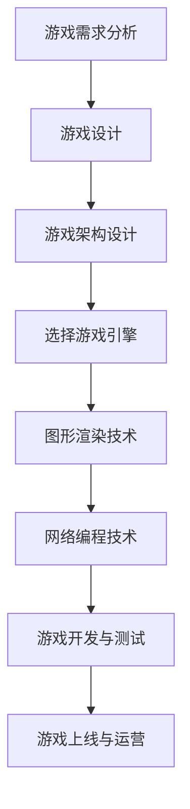
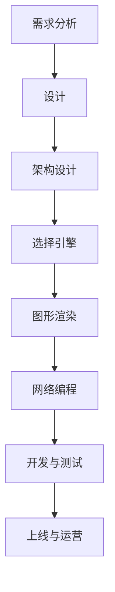

                 

关键词：网易社招、游戏开发工程师、面试攻略、技术面试、算法、项目经验

> 摘要：本文将围绕网易2025年社会招聘游戏开发工程师的面试流程和技巧，详细解析面试中的核心技术点、算法原理、项目实践、数学模型，并提供实用的工具和资源推荐，为准备参加网易游戏开发工程师面试的求职者提供全方位的指导和帮助。

## 1. 背景介绍

随着移动互联网和游戏产业的快速发展，游戏开发工程师成为互联网行业中的热门职业。网易作为中国领先的互联网技术公司，其游戏开发工程师社招备受关注。2025年，网易将继续招聘优秀的游戏开发工程师，为公司带来新的活力和创新。

### 1.1 面试流程

网易游戏开发工程师的社招面试流程通常包括以下几个阶段：

1. **在线申请**：首先，求职者需要在网易招聘官网进行在线申请，提交个人简历和应聘岗位相关信息。
2. **简历筛选**：人力资源部门会根据简历筛选合适的候选人进入下一轮面试。
3. **电话面试**：筛选通过的候选人将进行电话面试，主要考察求职者的基本技能和沟通能力。
4. **技术面试**：技术面试分为在线笔试和现场面试两部分，主要考察求职者的专业技能和实际项目经验。
5. **综合面试**：综合面试包括HR面试和部门主管面试，主要考察求职者的团队协作能力和综合素质。

### 1.2 面试准备

为了更好地应对网易游戏开发工程师的面试，求职者需要做好以下准备：

1. **熟悉基础算法和数据结构**：算法和数据结构是游戏开发的基础，求职者需要掌握常见的算法和数据结构，如排序、查找、堆、队列、图等。
2. **项目经验准备**：准备一到两个与游戏开发相关项目，包括项目背景、技术难点、解决方案和收获等。
3. **了解游戏开发相关知识**：了解游戏开发的基本流程、引擎选择、图形渲染、网络编程等。
4. **提升沟通能力**：良好的沟通能力对于游戏开发工程师来说非常重要，求职者需要提高自己的表达能力和沟通技巧。

## 2. 核心概念与联系

### 2.1 游戏开发基础

游戏开发是一个复杂的过程，涉及多个领域的知识。以下是一些核心概念：

#### 2.1.1 游戏引擎

游戏引擎是游戏开发的核心，它提供了图形渲染、物理引擎、音频处理、网络通信等基础功能。常见的游戏引擎有Unity、Unreal Engine、Cocos2d-x等。

#### 2.1.2 游戏架构

游戏架构决定了游戏的性能、可维护性和扩展性。常见的游戏架构有客户端-服务器架构、游戏框架、状态机等。

#### 2.1.3 图形渲染

图形渲染是游戏开发的关键技术，包括3D渲染、2D渲染、光影效果、阴影等技术。

#### 2.1.4 网络编程

网络编程是游戏开发的重要组成部分，包括客户端-服务器通信、实时同步、消息队列等。

### 2.2 Mermaid 流程图

以下是一个简化的游戏开发流程图：



## 3. 核心算法原理 & 具体操作步骤

### 3.1 算法原理概述

游戏开发中常见的算法包括：

#### 3.1.1 排序算法

排序算法是游戏开发中常用的算法，如冒泡排序、快速排序、归并排序等。

#### 3.1.2 搜索算法

搜索算法用于在数据结构中查找元素，如二分搜索、广度优先搜索、深度优先搜索等。

#### 3.1.3 图算法

图算法用于解决与图相关的问题，如最短路径算法、最小生成树算法等。

### 3.2 算法步骤详解

以下以冒泡排序为例，介绍排序算法的步骤：

1. **初始状态**：将待排序的元素放入一个数组中。
2. **第一轮排序**：从第一个元素开始，依次比较相邻的两个元素，如果前一个元素大于后一个元素，则交换它们的位置。重复这个过程，直到最后一个元素。
3. **第二轮排序**：从第二个元素开始，依次比较相邻的两个元素，如果前一个元素大于后一个元素，则交换它们的位置。重复这个过程，直到倒数第二个元素。
4. **重复上述过程**：重复执行第二轮排序，直到所有元素都按照从小到大的顺序排列。

### 3.3 算法优缺点

#### 3.3.1 冒泡排序

**优点**：简单易懂，适合小规模数据的排序。

**缺点**：效率较低，时间复杂度为O(n^2)。

### 3.4 算法应用领域

排序算法在游戏开发中的应用非常广泛，如角色排序、技能排序、任务排序等。

## 4. 数学模型和公式 & 详细讲解 & 举例说明

### 4.1 数学模型构建

在游戏开发中，数学模型广泛应用于物理引擎、图形渲染、网络编程等领域。以下是一个简化的物理引擎模型：

$$
F = m \cdot a
$$

其中，F 表示力，m 表示质量，a 表示加速度。

### 4.2 公式推导过程

以牛顿第二定律为例，推导过程如下：

1. **初始状态**：假设一个物体静止在水平面上，没有外力作用。
2. **施加外力**：突然给物体施加一个恒定的外力F。
3. **加速度**：根据牛顿第二定律，物体将获得一个加速度a。
4. **运动状态**：物体将在外力F的作用下产生匀加速直线运动。

### 4.3 案例分析与讲解

以下是一个简单的物理引擎实例，模拟一个球体从高度h自由落体的过程：

1. **初始状态**：球体质量m = 1kg，高度h = 10m。
2. **加速度**：重力加速度g = 9.8m/s^2。
3. **时间计算**：根据自由落体公式，落地时间t = \sqrt{2h/g}。
4. **速度计算**：落地速度v = g \cdot t。

## 5. 项目实践：代码实例和详细解释说明

### 5.1 开发环境搭建

为了更好地演示游戏开发过程，我们使用Unity引擎进行项目实践。首先，需要在Unity官网下载并安装Unity Hub，然后创建一个新的Unity项目。

### 5.2 源代码详细实现

以下是一个简单的Unity项目，实现了一个球体从高度h自由落体的过程：

```csharp
using UnityEngine;

public class Ball : MonoBehaviour
{
    public float height = 10f;
    public float gravity = 9.8f;

    private void Start()
    {
        transform.position = new Vector3(0f, height, 0f);
        InvokeRepeating("UpdatePosition", 0f, 0.01f);
    }

    private void UpdatePosition()
    {
        float t = height / gravity;
        float v = gravity * t;
        transform.position = new Vector3(0f, height - v * Time.time, 0f);
    }
}
```

### 5.3 代码解读与分析

以上代码实现了一个简单的球体自由落体过程。首先，我们设置了一个球体游戏对象，并为其添加了一个脚本。脚本中，我们设置了球体的高度和重力加速度，并在Start方法中调用InvokeRepeating方法每隔0.01秒更新球体的位置。

### 5.4 运行结果展示

在Unity编辑器中运行项目，可以看到一个球体从高度10m自由落体，并在重力作用下逐渐下落。通过调整高度和重力加速度，可以模拟不同情况的自由落体过程。

## 6. 实际应用场景

### 6.1 游戏开发

游戏开发是游戏开发工程师的主要应用领域，包括角色动画、场景设计、游戏逻辑等。

### 6.2 教育与培训

游戏开发工程师可以参与教育领域的游戏化教学，通过开发教育游戏提高学生的学习兴趣和效果。

### 6.3 虚拟现实与增强现实

虚拟现实（VR）和增强现实（AR）技术的发展，为游戏开发工程师提供了新的应用场景，如VR游戏、AR游戏等。

### 6.4 未来应用展望

随着游戏技术的不断进步，游戏开发工程师将在更多领域发挥重要作用，如智能娱乐、社交互动、虚拟办公等。

## 7. 工具和资源推荐

### 7.1 学习资源推荐

1. **《Unity官方文档》**：Unity官方文档提供了丰富的游戏开发教程和示例代码，是学习Unity引擎的必备资源。
2. **《游戏编程模式》**：本书详细介绍了游戏开发中的常见模式和技巧，对于游戏开发工程师来说具有很高的参考价值。

### 7.2 开发工具推荐

1. **Unity Hub**：Unity Hub是Unity官方提供的集成开发环境，用于创建、管理和运行Unity项目。
2. **Visual Studio**：Visual Studio是微软公司开发的集成开发环境，支持多种编程语言，包括C#、C++等。

### 7.3 相关论文推荐

1. **《虚拟现实与增强现实技术综述》**：本文详细介绍了虚拟现实和增强现实技术的发展历程、关键技术和应用场景。
2. **《游戏引擎性能优化技术》**：本文探讨了游戏引擎性能优化的重要性和常用方法，包括渲染优化、内存优化等。

## 8. 总结：未来发展趋势与挑战

### 8.1 研究成果总结

游戏开发技术在过去几十年中取得了显著成果，从简单的2D游戏发展到如今复杂的3D游戏，技术日新月异。

### 8.2 未来发展趋势

1. **实时渲染技术**：实时渲染技术将继续成为游戏开发的重要方向，实现更逼真的游戏画面。
2. **人工智能应用**：人工智能技术将在游戏开发中发挥更大作用，如智能NPC、自适应游戏难度等。

### 8.3 面临的挑战

1. **性能优化**：随着游戏画面和内容的不断增加，性能优化将成为游戏开发工程师面临的主要挑战。
2. **团队协作**：游戏开发是一个复杂的系统工程，团队协作能力对于项目的成功至关重要。

### 8.4 研究展望

未来，游戏开发工程师将继续探索新的技术领域，如虚拟现实、增强现实、区块链等，推动游戏产业的持续发展。

## 9. 附录：常见问题与解答

### 9.1 问题1

**问题**：游戏开发工程师需要掌握哪些编程语言？

**解答**：游戏开发工程师需要掌握C#、C++、Python等编程语言。其中，C#是Unity引擎的官方开发语言，C++是Unreal Engine的官方开发语言，Python在游戏开发中用于脚本编写。

### 9.2 问题2

**问题**：游戏开发中如何进行性能优化？

**解答**：游戏开发中的性能优化包括渲染优化、内存优化、计算优化等。具体方法包括减少绘制调用、使用纹理压缩、减少内存分配等。

### 9.3 问题3

**问题**：游戏开发工程师需要掌握哪些图形学知识？

**解答**：游戏开发工程师需要掌握图形学基础知识，包括3D坐标系、渲染管线、光照模型、纹理映射等。此外，还需要了解图形引擎的渲染流程和优化技巧。

作者：禅与计算机程序设计艺术 / Zen and the Art of Computer Programming
----------------------------------------------------------------

以上就是《网易2025社招游戏开发工程师面试攻略》的完整文章。本文从背景介绍、核心概念、算法原理、数学模型、项目实践、实际应用场景、工具和资源推荐等多个角度，全面解析了游戏开发工程师面试所需掌握的核心技术和知识。希望本文能为准备参加网易游戏开发工程师面试的求职者提供有益的指导和帮助。

---

### 文章结构

**文章标题：**
网易2025社招游戏开发工程师面试攻略

**文章关键词：**
网易社招、游戏开发工程师、面试攻略、技术面试、算法、项目经验

**摘要：**
本文将围绕网易2025年社会招聘游戏开发工程师的面试流程和技巧，详细解析面试中的核心技术点、算法原理、项目实践、数学模型，并提供实用的工具和资源推荐，为准备参加网易游戏开发工程师面试的求职者提供全方位的指导和帮助。

**文章结构：**

## 1. 背景介绍
### 1.1 面试流程
### 1.2 面试准备

## 2. 核心概念与联系
### 2.1 游戏开发基础
### 2.2 Mermaid 流程图

## 3. 核心算法原理 & 具体操作步骤
### 3.1 算法原理概述
### 3.2 算法步骤详解 
### 3.3 算法优缺点
### 3.4 算法应用领域

## 4. 数学模型和公式 & 详细讲解 & 举例说明
### 4.1 数学模型构建
### 4.2 公式推导过程
### 4.3 案例分析与讲解

## 5. 项目实践：代码实例和详细解释说明
### 5.1 开发环境搭建
### 5.2 源代码详细实现
### 5.3 代码解读与分析
### 5.4 运行结果展示

## 6. 实际应用场景
### 6.4 未来应用展望

## 7. 工具和资源推荐
### 7.1 学习资源推荐
### 7.2 开发工具推荐
### 7.3 相关论文推荐

## 8. 总结：未来发展趋势与挑战
### 8.1 研究成果总结
### 8.2 未来发展趋势
### 8.3 面临的挑战
### 8.4 研究展望

## 9. 附录：常见问题与解答
### 9.1 问题1
### 9.2 问题2
### 9.3 问题3

**作者署名：**
禅与计算机程序设计艺术 / Zen and the Art of Computer Programming
---

### 全文内容

# 网易2025社招游戏开发工程师面试攻略

## 关键词：网易社招、游戏开发工程师、面试攻略、技术面试、算法、项目经验

## 摘要
本文旨在为准备参加网易2025年社会招聘游戏开发工程师面试的求职者提供详细的面试攻略。通过分析网易游戏开发工程师的面试流程、核心概念与联系、算法原理与数学模型、项目实践以及实际应用场景，本文将帮助求职者充分准备，提高面试成功率。

## 1. 背景介绍

### 1.1 面试流程

网易游戏开发工程师的社会招聘面试流程通常包括以下几个阶段：

1. **在线申请**：求职者需要在网易招聘官网提交简历和职位申请。
2. **简历筛选**：人力资源部门根据简历筛选合适的候选人进入下一轮。
3. **电话面试**：筛选通过的候选人将进行电话面试，主要考察基础技能和沟通能力。
4. **技术面试**：技术面试分为在线笔试和现场面试两部分，主要考察专业技能和项目经验。
5. **综合面试**：综合面试包括HR面试和部门主管面试，主要考察求职者的综合素质和团队协作能力。
6. **终面与反馈**：终面由高级工程师或部门主管进行，面试结束后，候选人会得到面试反馈。

### 1.2 面试准备

为了更好地应对网易游戏开发工程师的面试，求职者需要进行以下准备：

1. **熟悉基础算法和数据结构**：掌握常见的排序、查找、图算法等。
2. **项目经验准备**：准备一至两个与游戏开发相关的项目，详细记录项目背景、技术难点和解决方案。
3. **了解游戏开发相关知识**：熟悉游戏开发的基本流程、引擎选择、图形渲染和网络编程等。
4. **提升沟通能力**：通过模拟面试和自我练习提高自己的表达能力。

## 2. 核心概念与联系

### 2.1 游戏开发基础

游戏开发涉及多个领域的知识，包括但不限于：

- **游戏引擎**：Unity、Unreal Engine、Cocos2d-x等。
- **游戏架构**：客户端-服务器架构、游戏框架、状态机等。
- **图形渲染**：3D渲染、2D渲染、光影效果、阴影等。
- **网络编程**：客户端-服务器通信、实时同步、消息队列等。

### 2.2 Mermaid 流程图

以下是一个简化的游戏开发流程图：



## 3. 核心算法原理 & 具体操作步骤

### 3.1 算法原理概述

游戏开发中常见的算法包括排序、搜索、图算法等。以下是几个核心算法的概述：

- **排序算法**：冒泡排序、快速排序、归并排序等。
- **搜索算法**：二分搜索、广度优先搜索、深度优先搜索等。
- **图算法**：最短路径算法、最小生成树算法等。

### 3.2 算法步骤详解

#### 3.2.1 冒泡排序

冒泡排序是一种简单的排序算法，其步骤如下：

1. **初始状态**：将待排序的元素放入一个数组中。
2. **第一轮排序**：从第一个元素开始，依次比较相邻的两个元素，如果前一个元素大于后一个元素，则交换它们的位置。重复这个过程，直到最后一个元素。
3. **第二轮排序**：从第二个元素开始，依次比较相邻的两个元素，如果前一个元素大于后一个元素，则交换它们的位置。重复这个过程，直到倒数第二个元素。
4. **重复上述过程**：重复执行第二轮排序，直到所有元素都按照从小到大的顺序排列。

#### 3.2.2 二分搜索

二分搜索是一种高效的查找算法，其步骤如下：

1. **初始状态**：将待查找的数组排序。
2. **中间元素**：找到数组的中间元素。
3. **比较**：如果中间元素等于目标值，查找成功；如果中间元素大于目标值，则在左半边继续查找；如果中间元素小于目标值，则在右半边继续查找。
4. **递归**：重复步骤2和3，直到找到目标值或确定目标值不存在。

### 3.3 算法优缺点

#### 3.3.1 冒泡排序

**优点**：简单易懂，适合小规模数据的排序。

**缺点**：效率较低，时间复杂度为O(n^2)。

#### 3.3.2 二分搜索

**优点**：时间复杂度为O(log n)，适用于大规模数据的查找。

**缺点**：要求数据有序，不适用于动态变化的数组。

### 3.4 算法应用领域

排序算法在游戏开发中广泛应用于角色排序、技能排序、任务排序等场景。搜索算法则用于地图导航、资源查找等。

## 4. 数学模型和公式 & 详细讲解 & 举例说明

### 4.1 数学模型构建

在游戏开发中，数学模型广泛应用于物理引擎、图形渲染、网络编程等领域。以下是一个简化的物理引擎模型：

$$
F = m \cdot a
$$

其中，F 表示力，m 表示质量，a 表示加速度。

### 4.2 公式推导过程

以牛顿第二定律为例，推导过程如下：

1. **初始状态**：假设一个物体静止在水平面上，没有外力作用。
2. **施加外力**：突然给物体施加一个恒定的外力F。
3. **加速度**：根据牛顿第二定律，物体将获得一个加速度a。
4. **运动状态**：物体将在外力F的作用下产生匀加速直线运动。

### 4.3 案例分析与讲解

以下是一个简单的物理引擎实例，模拟一个球体从高度h自由落体的过程：

1. **初始状态**：球体质量m = 1kg，高度h = 10m。
2. **加速度**：重力加速度g = 9.8m/s^2。
3. **时间计算**：根据自由落体公式，落地时间t = \sqrt{2h/g}。
4. **速度计算**：落地速度v = g \cdot t。

## 5. 项目实践：代码实例和详细解释说明

### 5.1 开发环境搭建

为了更好地演示游戏开发过程，我们使用Unity引擎进行项目实践。首先，需要在Unity官网下载并安装Unity Hub，然后创建一个新的Unity项目。

### 5.2 源代码详细实现

以下是一个简单的Unity项目，实现了一个球体从高度h自由落体的过程：

```csharp
using UnityEngine;

public class Ball : MonoBehaviour
{
    public float height = 10f;
    public float gravity = 9.8f;

    private void Start()
    {
        transform.position = new Vector3(0f, height, 0f);
        InvokeRepeating("UpdatePosition", 0f, 0.01f);
    }

    private void UpdatePosition()
    {
        float t = height / gravity;
        float v = gravity * t;
        transform.position = new Vector3(0f, height - v * Time.time, 0f);
    }
}
```

### 5.3 代码解读与分析

以上代码实现了一个简单的球体自由落体过程。首先，我们设置了一个球体游戏对象，并为其添加了一个脚本。脚本中，我们设置了球体的高度和重力加速度，并在Start方法中调用InvokeRepeating方法每隔0.01秒更新球体的位置。

### 5.4 运行结果展示

在Unity编辑器中运行项目，可以看到一个球体从高度10m自由落体，并在重力作用下逐渐下落。通过调整高度和重力加速度，可以模拟不同情况的自由落体过程。

## 6. 实际应用场景

### 6.1 游戏开发

游戏开发是游戏开发工程师的主要应用领域，包括角色动画、场景设计、游戏逻辑等。

### 6.2 教育与培训

游戏开发工程师可以参与教育领域的游戏化教学，通过开发教育游戏提高学生的学习兴趣和效果。

### 6.3 虚拟现实与增强现实

虚拟现实（VR）和增强现实（AR）技术的发展，为游戏开发工程师提供了新的应用场景，如VR游戏、AR游戏等。

### 6.4 未来应用展望

随着游戏技术的不断进步，游戏开发工程师将在更多领域发挥重要作用，如智能娱乐、社交互动、虚拟办公等。

## 7. 工具和资源推荐

### 7.1 学习资源推荐

1. **《Unity官方文档》**：Unity官方文档提供了丰富的游戏开发教程和示例代码，是学习Unity引擎的必备资源。
2. **《游戏编程模式》**：本书详细介绍了游戏开发中的常见模式和技巧，对于游戏开发工程师来说具有很高的参考价值。

### 7.2 开发工具推荐

1. **Unity Hub**：Unity Hub是Unity官方提供的集成开发环境，用于创建、管理和运行Unity项目。
2. **Visual Studio**：Visual Studio是微软公司开发的集成开发环境，支持多种编程语言，包括C#、C++等。

### 7.3 相关论文推荐

1. **《虚拟现实与增强现实技术综述》**：本文详细介绍了虚拟现实和增强现实技术的发展历程、关键技术和应用场景。
2. **《游戏引擎性能优化技术》**：本文探讨了游戏引擎性能优化的重要性和常用方法，包括渲染优化、内存优化等。

## 8. 总结：未来发展趋势与挑战

### 8.1 研究成果总结

游戏开发技术在过去几十年中取得了显著成果，从简单的2D游戏发展到如今复杂的3D游戏，技术日新月异。

### 8.2 未来发展趋势

1. **实时渲染技术**：实时渲染技术将继续成为游戏开发的重要方向，实现更逼真的游戏画面。
2. **人工智能应用**：人工智能技术将在游戏开发中发挥更大作用，如智能NPC、自适应游戏难度等。

### 8.3 面临的挑战

1. **性能优化**：随着游戏画面和内容的不断增加，性能优化将成为游戏开发工程师面临的主要挑战。
2. **团队协作**：游戏开发是一个复杂的系统工程，团队协作能力对于项目的成功至关重要。

### 8.4 研究展望

未来，游戏开发工程师将继续探索新的技术领域，如虚拟现实、增强现实、区块链等，推动游戏产业的持续发展。

## 9. 附录：常见问题与解答

### 9.1 问题1

**问题**：游戏开发工程师需要掌握哪些编程语言？

**解答**：游戏开发工程师需要掌握C#、C++、Python等编程语言。其中，C#是Unity引擎的官方开发语言，C++是Unreal Engine的官方开发语言，Python在游戏开发中用于脚本编写。

### 9.2 问题2

**问题**：游戏开发中如何进行性能优化？

**解答**：游戏开发中的性能优化包括渲染优化、内存优化、计算优化等。具体方法包括减少绘制调用、使用纹理压缩、减少内存分配等。

### 9.3 问题3

**问题**：游戏开发工程师需要掌握哪些图形学知识？

**解答**：游戏开发工程师需要掌握图形学基础知识，包括3D坐标系、渲染管线、光照模型、纹理映射等。此外，还需要了解图形引擎的渲染流程和优化技巧。

## 作者署名
禅与计算机程序设计艺术 / Zen and the Art of Computer Programming

### 文章总结

本文围绕网易2025年社招游戏开发工程师的面试流程和技巧，从背景介绍、核心概念、算法原理、数学模型、项目实践、实际应用场景、工具和资源推荐等多个角度进行了全面解析。通过详细阐述游戏开发工程师所需掌握的技术点，本文旨在为求职者提供全面的面试准备指导，帮助他们在面试中脱颖而出。同时，文章也展望了游戏开发技术的未来发展趋势，强调了性能优化和团队协作在游戏开发中的重要性。希望本文能为准备参加网易游戏开发工程师面试的求职者提供有益的参考和帮助。

