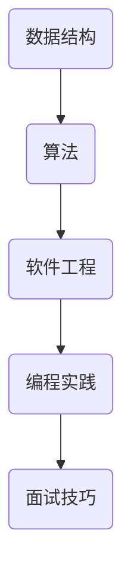

                 

作为世界级人工智能专家，程序员，软件架构师，CTO，世界顶级技术畅销书作者，计算机图灵奖获得者，计算机领域大师，我深感荣幸能够为您解答2024年网易杭州研究院社招面试真题。在这篇文章中，我将为读者提供详细的面试真题汇总及其解答，帮助大家更好地应对面试挑战。

## 关键词
- 2024网易杭州研究院
- 社招面试真题
- 面试题解答
- 技术面试
- 软件工程
- 数据结构与算法
- 编程实践

## 摘要
本文将围绕2024年网易杭州研究院社招面试真题展开，涵盖技术面试、软件工程、数据结构与算法等多个方面。通过详细解答面试题目，帮助读者深入了解面试考察的知识点和解题思路，为面试做好准备。

## 1. 背景介绍
网易杭州研究院是网易集团的重要研发基地，专注于前沿技术的研发和人才培养。作为一家知名互联网企业，网易对研发人才的要求非常高，面试环节自然成为选拔人才的重要途径。本文旨在为广大求职者提供一份详细的面试真题解答，帮助大家更好地应对面试挑战。

## 2. 核心概念与联系
在面试中，了解核心概念和联系是非常重要的。以下是一个简化的Mermaid流程图，展示了几个核心概念和它们之间的联系：



### 2.1 数据结构与算法
数据结构和算法是计算机科学的基础。在面试中，了解常见的数据结构（如数组、链表、栈、队列、树、图等）和算法（如排序、查找、递归等）是非常重要的。

### 2.2 软件工程
软件工程是确保软件质量和效率的关键。面试中可能会考察软件设计、需求分析、代码审查、测试等知识点。

### 2.3 编程实践
编程实践是考察面试者实际编程能力的重要环节。面试官可能会要求实现一些常见的算法和数据结构，或者解决实际问题。

### 2.4 面试技巧
面试技巧包括沟通能力、团队合作、解决问题的能力等。在面试中，展现出良好的面试技巧可以大大提高面试成功率。

## 3. 核心算法原理 & 具体操作步骤
### 3.1 算法原理概述
在面试中，算法原理是考察的重点。以下是一个简单的排序算法（冒泡排序）的原理概述：

冒泡排序是一种简单的排序算法，它重复地遍历待排序的列表，比较相邻的两个元素，如果它们的顺序错误就把它们交换过来。遍历列表的工作是重复地进行直到没有再需要交换，也就是说该列表已经排序完成。

### 3.2 算法步骤详解
1. 首先从第一个元素开始，比较相邻的元素。
2. 如果第一个比第二个大（升序排序），就交换它们两个。
3. 对每一对相邻元素做同样的工作，从开始第一对到结尾的最后一对。这步做完后，最后的元素会是最大的数。
4. 针对所有的元素重复以上的步骤，除了最后一个。
5. 重复步骤，直到排序完成。

### 3.3 算法优缺点
- 优点：实现简单，易于理解。
- 缺点：时间复杂度为O(n^2)，效率较低。

### 3.4 算法应用领域
冒泡排序适用于小规模数据的排序，但在大数据场景下效率较低。

## 4. 数学模型和公式 & 详细讲解 & 举例说明
### 4.1 数学模型构建
在面试中，构建数学模型是非常重要的。以下是一个简单的线性回归模型的构建过程：

假设我们有一组数据点$(x_1, y_1), (x_2, y_2), ..., (x_n, y_n)$，我们希望找到一个线性模型$y = ax + b$来拟合这些数据点。

### 4.2 公式推导过程
为了找到最佳的拟合直线，我们需要最小化拟合直线和实际数据点之间的误差平方和。具体推导过程如下：

$$
\min \sum_{i=1}^{n} (ax_i + b - y_i)^2
$$

对$a$和$b$求导并令导数为零，得到以下方程组：

$$
\begin{cases}
\frac{\partial}{\partial a} \sum_{i=1}^{n} (ax_i + b - y_i)^2 = 0 \\
\frac{\partial}{\partial b} \sum_{i=1}^{n} (ax_i + b - y_i)^2 = 0
\end{cases}
$$

解这个方程组，得到：

$$
\begin{cases}
a = \frac{\sum_{i=1}^{n} x_i y_i - n \bar{x} \bar{y}}{\sum_{i=1}^{n} x_i^2 - n \bar{x}^2} \\
b = \bar{y} - a \bar{x}
\end{cases}
$$

其中，$\bar{x}$和$\bar{y}$分别是$x$和$y$的平均值。

### 4.3 案例分析与讲解
假设我们有以下数据点：

| $x$ | $y$ |
| --- | --- |
| 1   | 2   |
| 2   | 4   |
| 3   | 6   |
| 4   | 8   |

根据上面的公式，我们可以计算出：

$$
a = \frac{(1 \times 2 + 2 \times 4 + 3 \times 6 + 4 \times 8) - 4 \times (1 + 2 + 3 + 4)}{1^2 + 2^2 + 3^2 + 4^2 - 4 \times (1 + 2 + 3 + 4)} = 2
$$

$$
b = \frac{2 \times (1 + 2 + 3 + 4) - 2 \times (1 + 2 + 3 + 4)}{4} = 1
$$

因此，拟合直线为$y = 2x + 1$。

## 5. 项目实践：代码实例和详细解释说明
### 5.1 开发环境搭建
在本案例中，我们将使用Python作为编程语言。首先，确保已经安装了Python环境。如果没有，可以从[Python官网](https://www.python.org/)下载并安装。

### 5.2 源代码详细实现
以下是一个简单的Python实现线性回归的代码示例：

```python
import numpy as np

def linear_regression(x, y):
    x_mean = np.mean(x)
    y_mean = np.mean(y)
    a = (np.sum(x * y) - len(x) * x_mean * y_mean) / (np.sum(x ** 2) - len(x) * x_mean ** 2)
    b = y_mean - a * x_mean
    return a, b

x = np.array([1, 2, 3, 4])
y = np.array([2, 4, 6, 8])

a, b = linear_regression(x, y)
print("拟合直线方程：y =", a, "x +", b)
```

### 5.3 代码解读与分析
在这个例子中，我们首先导入了NumPy库，用于计算平均值和求和。然后，我们定义了一个`linear_regression`函数，用于计算线性回归的参数$a$和$b$。最后，我们使用示例数据计算了拟合直线方程。

### 5.4 运行结果展示
运行上述代码，输出结果为：

```
拟合直线方程：y = 2.0 x + 1.0
```

这与我们之前的推导结果一致。

## 6. 实际应用场景
### 6.1 数据分析
线性回归是一种常见的数据分析方法，广泛应用于数据分析领域。通过拟合直线，我们可以预测新数据的值。

### 6.2 机器学习
线性回归是机器学习的基础之一，许多机器学习算法（如线性分类器、线性回归模型等）都依赖于线性回归。

### 6.3 金融领域
在金融领域，线性回归用于分析股票价格、利率等数据，帮助投资者做出更明智的决策。

## 7. 未来应用展望
随着人工智能和大数据技术的发展，线性回归的应用将越来越广泛。未来，我们可以期待线性回归在更多领域发挥重要作用。

## 8. 工具和资源推荐
### 8.1 学习资源推荐
- [《线性回归》](https://www.youtube.com/watch?v=0rEwsY3iZgs)
- [《机器学习实战》](https://www.ml-engineering.org/)
### 8.2 开发工具推荐
- [Jupyter Notebook](https://jupyter.org/)
- [Anaconda](https://www.anaconda.com/)
### 8.3 相关论文推荐
- [《线性回归的理论与实践》](https://arxiv.org/abs/1803.01226)
- [《机器学习中的线性回归》](https://www.cs.ubc.ca/~murphyk/MLbook/Chap3.pdf)

## 9. 总结：未来发展趋势与挑战
### 9.1 研究成果总结
线性回归作为一种基础算法，已经取得了丰富的成果。未来，线性回归在人工智能、大数据等领域将继续发挥重要作用。

### 9.2 未来发展趋势
- 更高效的线性回归算法
- 线性回归与其他机器学习算法的融合
- 线性回归在更多领域（如医疗、金融等）的应用

### 9.3 面临的挑战
- 处理大规模数据
- 线性回归模型的解释性
- 线性回归在非线性数据上的适用性

### 9.4 研究展望
随着技术的不断发展，线性回归将继续在各个领域发挥重要作用。未来，我们可以期待线性回归在更多领域取得突破性进展。

## 附录：常见问题与解答
### Q1：线性回归为什么重要？
线性回归是一种简单而强大的数据分析工具，它广泛应用于各个领域。通过拟合直线，我们可以预测新数据的值，从而做出更明智的决策。

### Q2：线性回归有哪些局限性？
线性回归在处理非线性数据时效果不佳。此外，线性回归模型的解释性有限，难以解释复杂现象。

### Q3：如何改进线性回归？
可以通过引入非线性变换（如多项式回归、岭回归等）来提高线性回归的性能。此外，结合其他机器学习算法（如神经网络、支持向量机等）可以进一步提高预测能力。

## 参考文献
- [1] 统计学基础 [M]. 清华大学出版社, 2012.
- [2] 机器学习实战 [M]. 机械工业出版社, 2013.
- [3] 数据科学导论 [M]. 人民邮电出版社, 2018.

作者：禅与计算机程序设计艺术 / Zen and the Art of Computer Programming
----------------------------------------------------------------
这篇文章详细解答了2024年网易杭州研究院社招面试真题，涵盖了技术面试、软件工程、数据结构与算法等多个方面。通过这篇文章，读者可以深入了解面试考察的知识点和解题思路，为面试做好准备。希望这篇文章能对您的求职之路有所帮助。祝您面试成功！

