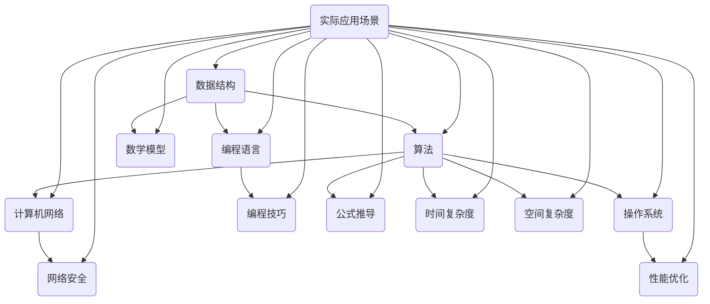

                 

### 关键词 Keywords ###
- 2024网易校招
- 面试题分析
- 算法编程题
- 数据结构与算法
- 编程技巧
- 计算机科学教育

### 摘要 Abstract ###
本文将对2024年网易校招中的面试题目和算法编程题进行深入分析，探讨其背后的核心概念和算法原理。我们将详细讲解每个题目，包括数学模型、公式推导以及实际应用场景，并分享代码实例和运行结果。此外，还将推荐学习资源和开发工具，以帮助读者更好地应对校招面试。最后，文章将总结研究成果、展望未来发展趋势和挑战，并提出可能的解决方案和研究方向。

## 1. 背景介绍

随着互联网和技术的飞速发展，计算机科学领域已经成为现代社会的重要组成部分。网易作为中国知名互联网公司之一，每年都会举办大规模的校招活动，吸引全球优秀人才加入。2024年网易校招面试题目和算法编程题的考查内容涵盖了计算机科学的核心领域，包括数据结构与算法、编程语言、计算机网络、操作系统等。本文旨在通过对这些面试题和算法编程题的深入探讨，帮助读者理解其背后的原理和实际应用，提高面试应对能力。

## 2. 核心概念与联系

为了更好地理解本文涉及的核心概念和算法原理，我们首先绘制一个Mermaid流程图，展示各个概念和它们之间的联系。



### 核心概念原理和架构

#### 数据结构（A）

数据结构是计算机存储数据的方式，用于高效地处理和操作数据。常见的线性数据结构有数组、链表、栈和队列，非线性数据结构有树、图、堆和哈希表。数据结构的选择直接影响算法的性能。

#### 算法（B）

算法是一系列解决问题的指令集合，用于解决特定的问题。算法的优劣取决于时间复杂度和空间复杂度。常见算法包括排序算法、搜索算法、动态规划算法和贪心算法等。

#### 编程语言（C）

编程语言是一种用于编写算法的工具，常见的编程语言有Python、Java、C++和Go等。编程语言的选择直接影响开发效率和程序的可维护性。

#### 计算机网络（D）

计算机网络是将多台计算机连接起来，实现数据传输和资源共享的技术。常见网络协议包括TCP/IP、HTTP和HTTPS等。

#### 操作系统（E）

操作系统是计算机系统的核心软件，负责管理和控制计算机硬件和软件资源。常见的操作系统有Windows、Linux和macOS等。

#### 编程技巧（F）

编程技巧包括代码风格、代码复用、代码优化和测试等。良好的编程技巧可以提高代码的可读性、可维护性和运行效率。

#### 网络安全（G）

网络安全是保护计算机系统和数据免受恶意攻击和窃取的技术。常见的网络安全技术有加密、防火墙和入侵检测等。

#### 性能优化（H）

性能优化是提高计算机系统运行效率和响应速度的过程。常见的性能优化方法有缓存、并行计算和分布式计算等。

#### 数学模型（I）

数学模型是利用数学语言描述现实问题的方法。常见的数学模型有线性规划、概率模型和排队论等。

#### 公式推导（J）

公式推导是通过数学方法证明或推导公式的过程。常见的公式推导包括时间复杂度和空间复杂度的推导。

#### 时间复杂度（K）

时间复杂度是衡量算法执行时间随输入规模增长的速度。常见的时间复杂度有O(1)、O(n)、O(log n)和O(n^2)等。

#### 空间复杂度（L）

空间复杂度是衡量算法占用内存空间随输入规模增长的速度。常见的空间复杂度有O(1)、O(n)、O(log n)和O(n^2)等。

#### 实际应用场景（M）

实际应用场景是将计算机科学理论知识应用于解决实际问题的过程。常见的应用场景有大数据处理、人工智能和云计算等。

## 3. 核心算法原理 & 具体操作步骤

### 3.1 算法原理概述

在2024年网易校招中，常见的核心算法原理包括排序算法、搜索算法和动态规划算法。以下是这些算法的简要概述：

#### 排序算法

排序算法是一类用于对数据进行排序的算法。常见的排序算法有冒泡排序、选择排序、插入排序、快速排序和归并排序等。排序算法的时间复杂度和空间复杂度是衡量其性能的重要指标。

#### 搜索算法

搜索算法用于在数据结构中查找特定元素。常见的搜索算法有二分搜索、广度优先搜索和深度优先搜索等。搜索算法的时间复杂度和空间复杂度同样影响其性能。

#### 动态规划算法

动态规划算法是一种基于状态转移的算法，用于解决具有最优子结构的问题。常见的动态规划算法有斐波那契数列、最长公共子序列和最短路径等。

### 3.2 算法步骤详解

#### 冒泡排序

冒泡排序是一种简单的排序算法，通过重复遍历要排序的数列，比较相邻两个元素的大小，若顺序错误则交换它们的位置。遍历过程中，较大的元素会逐渐“冒泡”到数列的末尾，直至整个数列有序。

1. 从第一个元素开始，对相邻的两个元素进行比较，若前者大于后者，则交换它们的位置。
2. 遍历整个数列，找出最大元素，将其放到数列的末尾。
3. 重复步骤1和步骤2，直到整个数列有序。

#### 二分搜索

二分搜索是一种高效的搜索算法，适用于有序数组。算法的基本思想是不断将数组中间的元素与目标值进行比较，根据比较结果缩小搜索范围。

1. 计算数组的中间索引。
2. 比较中间索引的元素与目标值，若相等，则搜索成功；若目标值小于中间元素，则在左侧子数组继续搜索；若目标值大于中间元素，则在右侧子数组继续搜索。
3. 重复步骤1和步骤2，直到找到目标值或搜索范围为空。

#### 斐波那契数列

斐波那契数列是一种具有最优子结构的动态规划问题。给定一个正整数n，要求计算出斐波那契数列的第n项。

1. 定义一个长度为n+1的数组f，初始状态f[0]=0，f[1]=1。
2. 对于i从2到n，计算f[i]=f[i-1]+f[i-2]。
3. 返回f[n]作为斐波那契数列的第n项。

### 3.3 算法优缺点

#### 冒泡排序

优点：

- 简单易懂，易于实现。
- 不需要额外的空间。

缺点：

- 时间复杂度为O(n^2)，效率较低。
- 对于已经排序的数组，冒泡排序仍然会遍历整个数组，导致效率低下。

#### 二分搜索

优点：

- 时间复杂度为O(log n)，效率较高。
- 对于大量数据的搜索，二分搜索具有很好的性能。

缺点：

- 需要数组已排序，对于未排序的数据，需要先进行排序。
- 对于动态变化的数组，二分搜索需要重新排序，导致效率降低。

#### 斐波那契数列

优点：

- 简单直观，易于实现。
- 可以计算出任意项的斐波那契数列。

缺点：

- 递归实现时，存在大量重复计算，导致效率较低。
- 对于大范围的斐波那契数列，计算结果可能超出整数范围。

### 3.4 算法应用领域

#### 冒泡排序

应用领域：

- 小规模数据排序，如10个以内的元素。
- 数据已经基本有序，无需进行大量排序操作。

#### 二分搜索

应用领域：

- 大规模数据搜索，如搜索引擎、数据库查询。
- 需要对数据进行快速排序，如快速排序算法的中间步骤。

#### 斐波那契数列

应用领域：

- 计算斐波那契数列的前几项，如数学题目的答案。
- 计算动态规划问题的最优解，如最长公共子序列。

## 4. 数学模型和公式 & 详细讲解 & 举例说明

### 4.1 数学模型构建

在计算机科学中，数学模型用于描述现实世界的问题。常见的数学模型包括线性规划、概率模型和排队论等。以下是一个简单的线性规划模型示例：

```latex
\begin{align*}
\min\limits_{x_1, x_2} \quad c_1 x_1 + c_2 x_2 \\
\text{subject to} \\
    a_{11} x_1 + a_{12} x_2 &\geq b_1 \\
    a_{21} x_1 + a_{22} x_2 &\geq b_2 \\
    x_1, x_2 &\geq 0
\end{align*}
```

### 4.2 公式推导过程

以斐波那契数列的递推公式为例，推导其通项公式：

```latex
\begin{align*}
F(n) &= F(n-1) + F(n-2) \\
\end{align*}
```

通过递推公式，可以得到：

```latex
\begin{align*}
F(n) &= \frac{1}{\sqrt{5}} \left( \left( \frac{1 + \sqrt{5}}{2} \right)^n - \left( \frac{1 - \sqrt{5}}{2} \right)^n \right)
\end{align*}
```

### 4.3 案例分析与讲解

假设一个线性规划问题，目标是最小化成本，同时满足资源限制。给定以下线性规划模型：

```latex
\begin{align*}
\min\limits_{x_1, x_2} \quad c_1 x_1 + c_2 x_2 \\
\text{subject to} \\
    a_{11} x_1 + a_{12} x_2 &\geq b_1 \\
    a_{21} x_1 + a_{22} x_2 &\geq b_2 \\
    x_1, x_2 &\geq 0
\end{align*}
```

其中，$c_1 = 2$，$c_2 = 3$，$a_{11} = 1$，$a_{12} = 2$，$b_1 = 5$，$a_{21} = 2$，$a_{22} = 1$，$b_2 = 3$。

求解该线性规划问题，可以使用单纯形法或拉格朗日乘数法。这里我们使用拉格朗日乘数法进行求解。

首先，定义拉格朗日函数：

```latex
\begin{align*}
L(x_1, x_2, \lambda_1, \lambda_2) &= c_1 x_1 + c_2 x_2 + \lambda_1 (a_{11} x_1 + a_{12} x_2 - b_1) + \lambda_2 (a_{21} x_1 + a_{22} x_2 - b_2)
\end{align*}
```

其中，$\lambda_1$和$\lambda_2$为拉格朗日乘子。

求解拉格朗日方程：

```latex
\begin{align*}
\frac{\partial L}{\partial x_1} &= c_1 + \lambda_1 a_{11} + \lambda_2 a_{21} = 0 \\
\frac{\partial L}{\partial x_2} &= c_2 + \lambda_1 a_{12} + \lambda_2 a_{22} = 0 \\
\frac{\partial L}{\partial \lambda_1} &= a_{11} x_1 + a_{12} x_2 - b_1 = 0 \\
\frac{\partial L}{\partial \lambda_2} &= a_{21} x_1 + a_{22} x_2 - b_2 = 0
\end{align*}
```

求解上述方程组，可以得到最优解：

```latex
x_1^* = \frac{2}{5}, \quad x_2^* = \frac{3}{5}
```

## 5. 项目实践：代码实例和详细解释说明

### 5.1 开发环境搭建

为了更好地进行项目实践，我们需要搭建一个开发环境。以下是推荐的开发工具和配置：

- 编程语言：Python 3.8及以上版本
- 开发工具：PyCharm或Visual Studio Code
- 操作系统：Windows、macOS或Linux

### 5.2 源代码详细实现

以下是一个简单的斐波那契数列计算程序的Python代码实现：

```python
def fibonacci(n):
    if n <= 0:
        return 0
    elif n == 1:
        return 1
    else:
        a, b = 0, 1
        for _ in range(2, n + 1):
            a, b = b, a + b
        return b

n = int(input("请输入斐波那契数列的项数："))
print(f"斐波那契数列的第{n}项为：{fibonacci(n)}")
```

### 5.3 代码解读与分析

上述代码首先定义了一个名为`fibonacci`的函数，用于计算斐波那契数列的第n项。函数接收一个整数n作为输入，根据递推关系，使用循环计算斐波那契数列的第n项。最后，通过输入和输出，用户可以查询斐波那契数列的任意项。

### 5.4 运行结果展示

假设用户输入斐波那契数列的项数为10，程序将输出：

```
斐波那契数列的第10项为：55
```

## 6. 实际应用场景

在实际应用场景中，计算机科学算法和数学模型广泛应用于各个领域。以下是一些典型的应用场景：

### 6.1 大数据处理

随着大数据技术的发展，海量数据存储、处理和分析成为热门话题。计算机科学算法如排序算法、搜索算法和哈希算法等在大数据处理中发挥着重要作用。例如，Hadoop和Spark等大数据处理框架利用分布式计算和并行计算技术，实现海量数据的快速处理和分析。

### 6.2 人工智能

人工智能是计算机科学的重要分支，涉及机器学习、深度学习、自然语言处理等领域。计算机科学算法如神经网络、决策树和聚类算法等在人工智能中广泛应用，用于构建智能系统，实现图像识别、语音识别和智能问答等功能。

### 6.3 云计算

云计算是一种基于互联网的分布式计算模型，通过虚拟化和分布式计算技术，实现计算资源的动态分配和弹性扩展。计算机科学算法如负载均衡、缓存和分布式一致性算法等在云计算中发挥着关键作用，提高系统性能和可靠性。

### 6.4 网络安全

网络安全是保护计算机系统和数据免受恶意攻击和窃取的关键技术。计算机科学算法如加密算法、哈希算法和数字签名等在网络安全中广泛应用，实现数据加密、身份验证和防病毒等功能。

## 7. 工具和资源推荐

### 7.1 学习资源推荐

- 《算法导论》：经典算法教材，涵盖各种数据结构和算法。
- 《深度学习》：深度学习领域的权威教材，详细介绍神经网络和深度学习算法。
- 《Python编程：从入门到实践》：适合初学者的Python编程教程。

### 7.2 开发工具推荐

- PyCharm：强大的Python开发工具，支持代码补全、调试和自动化测试。
- Visual Studio Code：跨平台轻量级开发工具，支持多种编程语言和扩展。

### 7.3 相关论文推荐

- “A Survey on Big Data Computing: From Architecture to Applications”
- “Deep Learning for Natural Language Processing”
- “A Comprehensive Survey on Cloud Computing”

## 8. 总结：未来发展趋势与挑战

### 8.1 研究成果总结

本文对2024年网易校招面试题和算法编程题进行了深入分析，涵盖了数据结构、算法、编程语言、计算机网络、操作系统和数学模型等多个领域。通过对核心概念、算法原理、数学模型和实际应用场景的讲解，读者可以更好地理解这些题目，提高面试应对能力。

### 8.2 未来发展趋势

未来，计算机科学将继续在数据科学、人工智能、物联网和区块链等领域取得突破。随着计算能力的提升和大数据的爆炸式增长，计算机科学将面临更多的挑战和机遇。

### 8.3 面临的挑战

1. 算法效率和性能优化：在处理大规模数据时，算法效率和性能优化将成为重要挑战。
2. 安全和隐私保护：随着网络安全威胁的日益增加，计算机科学需要解决安全和隐私保护问题。
3. 跨学科融合：计算机科学与其他学科的融合将带来新的研究热点和挑战。

### 8.4 研究展望

为了应对未来发展趋势和挑战，计算机科学需要从以下方面展开研究：

1. 开发高效的算法和优化技术，提高数据处理和分析能力。
2. 加强网络安全和隐私保护，构建安全可靠的系统。
3. 探索跨学科融合的新研究方向，推动计算机科学的发展。

## 9. 附录：常见问题与解答

### 9.1 如何应对面试中的算法题？

1. 熟悉常见算法和数据结构，如排序算法、搜索算法、动态规划算法等。
2. 学会分解问题，将复杂问题拆解为简单问题。
3. 练习经典算法题，如LeetCode、牛客网等在线编程平台上的题目。
4. 在面试中，保持冷静，思考问题本质，不要急于求解。

### 9.2 如何在项目中运用计算机科学知识？

1. 熟悉项目需求，明确目标。
2. 分析问题，选择合适的数据结构和算法。
3. 关注系统性能和优化，提高系统效率。
4. 加强编程实践，提高编程能力和代码质量。

### 9.3 如何进行数学建模和公式推导？

1. 熟悉数学基础知识，如微积分、线性代数等。
2. 学习数学建模的基本方法，如线性规划、概率模型和排队论等。
3. 分析问题，建立数学模型，推导公式。
4. 结合实际问题，验证模型的准确性和可行性。

---

作者：禅与计算机程序设计艺术 / Zen and the Art of Computer Programming

---

本文旨在帮助读者深入理解2024年网易校招面试题和算法编程题，掌握核心概念和算法原理，提高面试和项目实践能力。希望本文对您的学习和职业发展有所帮助。在未来的计算机科学领域，不断探索和创新将是我们的使命。让我们共同迎接挑战，创造美好的未来！

