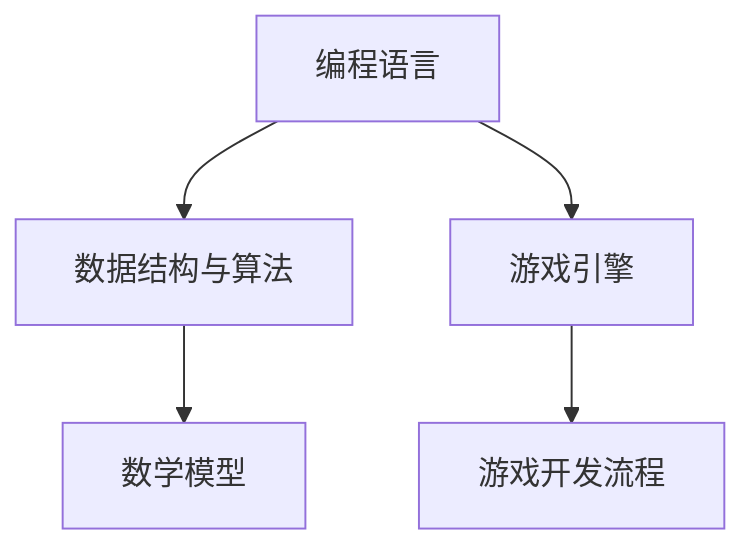
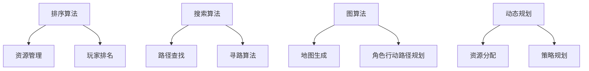

                 

关键词：网易游戏，校招，游戏开发，面试题，技术解答，面试技巧，实战经验

## 摘要

本文旨在为广大2024年即将参加网易游戏校招的游戏开发者提供一份详尽的面试题解答指南。我们将深入分析网易游戏校招面试中可能出现的各类技术问题，包括编程算法、数据结构与数学模型等，并提供详细的解题思路与实战经验。通过本文，读者不仅可以了解网易游戏面试的核心考点，还能掌握解决实际问题的方法，为成功通过面试打下坚实的基础。

## 1. 背景介绍

随着游戏产业的迅猛发展，游戏开发成为了科技领域的一个热门职业。网易游戏作为中国游戏产业的领军企业，每年都会面向全球招募优秀的人才。为了确保选拔到真正有能力、有热情的优秀开发者，网易游戏的面试环节异常严格，涵盖了从基础编程到高级算法的各个方面。

本文旨在为准备参加2024年网易游戏校招的广大考生提供一个全面的面试指南，帮助大家更好地理解面试题的出题思路和答题技巧。通过本文的详细解读，我们希望能够帮助考生提升自己的技术能力，增强面试的信心，从而在众多竞争者中脱颖而出。

## 2. 核心概念与联系

在深入探讨网易游戏校招面试题之前，首先需要了解几个核心概念，它们是解题的关键。以下是几个重要的核心概念及其相互之间的联系：

### 2.1 编程语言

编程语言是游戏开发的基础，不同的编程语言适用于不同的开发场景。常见的编程语言包括C++、C#、Java和Python等。每种语言都有其独特的特点，如C++擅长系统编程和性能优化，而Python则因其简洁的语法和强大的库支持而广泛应用于数据分析、人工智能等领域。

### 2.2 数据结构与算法

数据结构是组织和管理数据的方式，常见的有数组、链表、栈、队列、树、图等。算法是对问题求解的步骤和方法，包括排序算法、搜索算法、图算法等。数据结构与算法是游戏开发中不可或缺的知识，它们决定了游戏的性能和用户体验。

### 2.3 游戏引擎

游戏引擎是游戏开发的工具集，提供了游戏开发所需的图形渲染、物理模拟、音效处理等功能。常见的游戏引擎有Unity、Unreal Engine等。熟悉游戏引擎的工作原理和API是游戏开发者必备的技能。

### 2.4 数学模型

数学模型是游戏中的物理现象、游戏逻辑等的数学表达。如向量、矩阵、三角函数等都是常见的数学模型。掌握数学模型有助于优化游戏性能，实现更加逼真的游戏效果。

### 2.5 游戏开发流程

游戏开发流程包括需求分析、设计、开发、测试、上线等阶段。了解游戏开发的基本流程有助于考生在面试中更好地展示自己的专业知识。

以下是一个简化的Mermaid流程图，展示了上述核心概念之间的联系：



### 2.6 编程算法

编程算法是解决特定问题的步骤和方法，它是游戏开发的核心。以下是一些常见的编程算法及其在游戏开发中的应用：

#### 2.6.1 排序算法

排序算法是用于对数据进行排序的一类算法，常见的排序算法有冒泡排序、选择排序、插入排序、快速排序等。在游戏开发中，排序算法可以用于资源管理、玩家排名等场景。

#### 2.6.2 搜索算法

搜索算法是用于查找数据的一类算法，常见的搜索算法有二分搜索、广度优先搜索、深度优先搜索等。在游戏开发中，搜索算法可以用于路径查找、寻路算法等。

#### 2.6.3 图算法

图算法是用于处理图结构数据的一类算法，常见的图算法有最小生成树、最短路径、拓扑排序等。在游戏开发中，图算法可以用于地图生成、角色行动路径规划等。

#### 2.6.4 动态规划

动态规划是解决最优化问题的一种算法思想，通过将问题分解为子问题并求解子问题的最优解来得到原问题的最优解。在游戏开发中，动态规划可以用于资源分配、策略规划等。

以下是一个简化的Mermaid流程图，展示了编程算法在游戏开发中的应用：



通过以上核心概念和编程算法的介绍，我们为读者提供了一个全面的知识框架，为后续的面试题解答奠定了基础。

### 3. 核心算法原理 & 具体操作步骤

#### 3.1 算法原理概述

在游戏开发中，核心算法的运用能够极大地提升游戏的性能和用户体验。以下是几个在游戏开发中常见的重要算法，以及它们的原理概述：

#### 3.1.1 冒泡排序

冒泡排序是一种简单的排序算法，它重复遍历要排序的数列，一次比较两个元素，如果它们的顺序错误就把它们交换过来。遍历数列的工作是重复地进行，直到没有再需要交换的元素为止。

#### 3.1.2 快速排序

快速排序是一种高效的排序算法，其基本思想是通过选取一个基准元素，将数组分为两部分，一部分都比基准元素小，另一部分都比基准元素大，然后对这两部分分别进行快速排序。

#### 3.1.3 二分搜索

二分搜索是一种在有序数组中查找某一特定元素的搜索算法。它采用中分法，将数组分成两半，比较中间元素和目标元素的大小，根据比较结果确定下一轮搜索的区间。

#### 3.1.4 最短路径算法

最短路径算法用于找到图中两点之间的最短路径。常见的最短路径算法包括Dijkstra算法和Floyd-Warshall算法。Dijkstra算法适用于图中的边权为非负数的情况，而Floyd-Warshall算法适用于计算图中所有顶点对之间的最短路径。

#### 3.2 算法步骤详解

下面我们将详细描述这些算法的操作步骤：

#### 3.2.1 冒泡排序

1. 从第一个元素开始，比较相邻的两个元素，如果第一个比第二个大，就交换它们的位置。
2. 继续比较下一个元素，直到该层循环结束。
3. 重复上述步骤，每一轮都会将未排序部分的最大元素“冒泡”到已排序部分的起始位置。
4. 当未排序部分只剩下一个元素时，排序完成。

#### 3.2.2 快速排序

1. 选择一个基准元素，通常选择第一个或最后一个元素。
2. 将比基准元素小的元素放在左边，比基准元素大的元素放在右边。
3. 对左右两边递归进行快速排序，直到所有子序列都排好序。

#### 3.2.3 二分搜索

1. 确定搜索范围，初始范围是整个数组。
2. 找到中间元素，与目标元素进行比较。
3. 如果中间元素等于目标元素，搜索结束。
4. 如果中间元素大于目标元素，则将搜索范围缩小到左边一半。
5. 如果中间元素小于目标元素，则将搜索范围缩小到右边一半。
6. 重复步骤2-5，直到找到目标元素或搜索范围为空。

#### 3.2.4 最短路径算法

- **Dijkstra算法**：

  1. 初始化：选择一个起始节点，设置其距离为0，其余节点距离为无穷大。
  2. 将起始节点加入已确定距离的集合，其余节点放入未确定集合。
  3. 选择未确定集合中距离最小的节点，将其加入已确定集合。
  4. 更新未确定集合中所有节点通过已确定集合中节点到达的最短距离。
  5. 重复步骤3-4，直到所有节点都确定距离。

- **Floyd-Warshall算法**：

  1. 初始化：所有节点之间的距离初始化为无穷大，对角线元素初始化为0。
  2. 对于每个节点k，检查是否通过节点k可以缩短节点i和节点j之间的距离。
  3. 更新i和j之间的距离，如果新的距离小于当前距离，则更新。
  4. 重复步骤2-3，直到所有可能的中间节点都被考虑。

#### 3.3 算法优缺点

每种算法都有其优缺点，适用于不同的场景。以下是上述算法的优缺点概述：

- **冒泡排序**：

  - 优点：简单易懂，适用于小规模数据。
  - 缺点：时间复杂度高，不适合大数据。

- **快速排序**：

  - 优点：平均时间复杂度低，适合大规模数据。
  - 缺点：最坏情况下时间复杂度较高，需要改进。

- **二分搜索**：

  - 优点：时间复杂度低，适用于有序数组。
  - 缺点：需要数组已排序，不适用于动态数据。

- **Dijkstra算法**：

  - 优点：适用于非负权图，可以找到最短路径。
  - 缺点：时间复杂度较高，不适合大规模图。

- **Floyd-Warshall算法**：

  - 优点：适用于所有类型的图，可以找到所有顶点对之间的最短路径。
  - 缺点：时间复杂度较高，不适合大规模图。

#### 3.4 算法应用领域

这些算法在游戏开发中有广泛的应用，以下是一些具体的应用场景：

- **冒泡排序**：用于游戏中的角色等级排序、资源管理。
- **快速排序**：用于游戏中的排行榜排序、战斗排序。
- **二分搜索**：用于游戏中的物品查找、角色技能查找。
- **Dijkstra算法**：用于游戏中的寻路算法、路径规划。
- **Floyd-Warshall算法**：用于游戏中的地图生成、角色行动路径规划。

通过理解这些核心算法的原理和操作步骤，读者可以更好地应对网易游戏校招面试中的算法问题，并在实际项目中运用这些算法解决具体问题。

### 4. 数学模型和公式 & 详细讲解 & 举例说明

在游戏开发中，数学模型和公式是不可或缺的工具，它们不仅帮助开发者理解游戏中的各种物理现象，还能优化游戏的性能和用户体验。以下是几个常见的数学模型和公式，以及它们的详细讲解和举例说明。

#### 4.1 数学模型构建

数学模型是对现实世界中某一现象的数学描述。在游戏开发中，常见的数学模型包括向量模型、矩阵模型和概率模型。

- **向量模型**：用于描述游戏中的位置、方向和速度等。
- **矩阵模型**：用于描述游戏中的变换、旋转和平移等。
- **概率模型**：用于描述游戏中的随机事件和玩家行为。

#### 4.2 公式推导过程

以下是一些常见的数学公式及其推导过程：

1. **向量加法公式**：

   向量加法公式用于计算两个向量的和。假设有两个向量 \( \vec{a} = (a_x, a_y) \) 和 \( \vec{b} = (b_x, b_y) \)，它们的和为：

   \[
   \vec{a} + \vec{b} = (a_x + b_x, a_y + b_y)
   \]

   例如，如果 \( \vec{a} = (3, 4) \) 和 \( \vec{b} = (1, 2) \)，则 \( \vec{a} + \vec{b} = (4, 6) \)。

2. **向量点积公式**：

   向量点积（或称为内积）用于计算两个向量的夹角和长度。假设有两个向量 \( \vec{a} = (a_x, a_y) \) 和 \( \vec{b} = (b_x, b_y) \)，它们的点积为：

   \[
   \vec{a} \cdot \vec{b} = a_x \cdot b_x + a_y \cdot b_y
   \]

   例如，如果 \( \vec{a} = (3, 4) \) 和 \( \vec{b} = (1, 2) \)，则 \( \vec{a} \cdot \vec{b} = 3 \cdot 1 + 4 \cdot 2 = 11 \)。

3. **向量叉积公式**：

   向量叉积（或称为外积）用于计算两个向量的垂直方向和大小。假设有两个向量 \( \vec{a} = (a_x, a_y) \) 和 \( \vec{b} = (b_x, b_y) \)，它们的叉积为：

   \[
   \vec{a} \times \vec{b} = (a_y \cdot b_z - a_z \cdot b_y, a_z \cdot b_x - a_x \cdot b_z, a_x \cdot b_y - a_y \cdot b_x)
   \]

   例如，如果 \( \vec{a} = (3, 4, 0) \) 和 \( \vec{b} = (1, 0, 2) \)，则 \( \vec{a} \times \vec{b} = (4 \cdot 2 - 0 \cdot 0, 0 \cdot 1 - 3 \cdot 2, 3 \cdot 0 - 4 \cdot 1) = (8, -6, -4) \)。

4. **矩阵乘法公式**：

   矩阵乘法用于计算两个矩阵的乘积。假设有两个矩阵 \( A = \begin{bmatrix} a_{11} & a_{12} \\ a_{21} & a_{22} \end{bmatrix} \) 和 \( B = \begin{bmatrix} b_{11} & b_{12} \\ b_{21} & b_{22} \end{bmatrix} \)，它们的乘积为：

   \[
   AB = \begin{bmatrix} a_{11} \cdot b_{11} + a_{12} \cdot b_{21} & a_{11} \cdot b_{12} + a_{12} \cdot b_{22} \\ a_{21} \cdot b_{11} + a_{22} \cdot b_{21} & a_{21} \cdot b_{12} + a_{22} \cdot b_{22} \end{bmatrix}
   \]

   例如，如果 \( A = \begin{bmatrix} 1 & 2 \\ 3 & 4 \end{bmatrix} \) 和 \( B = \begin{bmatrix} 5 & 6 \\ 7 & 8 \end{bmatrix} \)，则 \( AB = \begin{bmatrix} 1 \cdot 5 + 2 \cdot 7 & 1 \cdot 6 + 2 \cdot 8 \\ 3 \cdot 5 + 4 \cdot 7 & 3 \cdot 6 + 4 \cdot 8 \end{bmatrix} = \begin{bmatrix} 19 & 22 \\ 29 & 38 \end{bmatrix} \)。

5. **概率公式**：

   概率公式用于计算事件发生的概率。假设有两个事件A和B，它们的联合概率为P(A且B)，条件概率为P(A|B)，它们的公式为：

   \[
   P(A \text{ 且 } B) = P(A) \cdot P(B|A)
   \]

   \[
   P(A|B) = \frac{P(A \text{ 且 } B)}{P(B)}
   \]

   例如，如果一个游戏中有两种角色，角色A出现的概率为0.6，角色B在角色A出现的情况下出现的概率为0.8，则角色B出现的概率为：

   \[
   P(B) = P(A) \cdot P(B|A) = 0.6 \cdot 0.8 = 0.48
   \]

#### 4.3 案例分析与讲解

以下是一个具体的案例，我们将使用上述数学模型和公式来解决问题。

**案例：计算两个角色的平均表现**

假设有两个角色A和B，他们在游戏中的表现可以用评分来衡量。角色A的评分分布为：

| 评分 | 概率 |
| ---- | ---- |
| 5    | 0.3  |
| 4    | 0.2  |
| 3    | 0.2  |
| 2    | 0.2  |
| 1    | 0.1  |

角色B的评分分布为：

| 评分 | 概率 |
| ---- | ---- |
| 5    | 0.4  |
| 4    | 0.3  |
| 3    | 0.2  |
| 2    | 0.1  |
| 1    | 0.0  |

我们需要计算这两个角色的平均评分。

1. **计算角色A的平均评分**：

   使用概率公式：

   \[
   \text{平均评分} = 5 \cdot 0.3 + 4 \cdot 0.2 + 3 \cdot 0.2 + 2 \cdot 0.2 + 1 \cdot 0.1 = 3.6
   \]

2. **计算角色B的平均评分**：

   使用概率公式：

   \[
   \text{平均评分} = 5 \cdot 0.4 + 4 \cdot 0.3 + 3 \cdot 0.2 + 2 \cdot 0.1 + 1 \cdot 0.0 = 4.2
   \]

通过以上计算，我们得出角色A的平均评分为3.6，角色B的平均评分为4.2。

### 5. 项目实践：代码实例和详细解释说明

在了解了数学模型和算法原理后，通过实践项目来巩固所学知识是非常必要的。下面，我们将通过一个具体的代码实例来展示如何运用这些知识解决实际的问题。

#### 5.1 开发环境搭建

为了运行下面的代码实例，我们需要搭建一个基本的开发环境。以下是一个简单的步骤指南：

1. 安装Python 3.x版本。
2. 安装依赖库，如numpy、matplotlib等。
3. 创建一个新的Python项目，并在项目中创建一个名为`game_project`的目录。
4. 在`game_project`目录下创建一个名为`main.py`的文件，用于编写代码。

#### 5.2 源代码详细实现

以下是一个简单的游戏开发项目，该项目使用Python语言和numpy库来实现一个简单的角色评分系统。

```python
import numpy as np

# 角色A的评分分布
score_distribution_A = np.array([[5, 0.3], [4, 0.2], [3, 0.2], [2, 0.2], [1, 0.1]])

# 角色B的评分分布
score_distribution_B = np.array([[5, 0.4], [4, 0.3], [3, 0.2], [2, 0.1], [1, 0.0]])

def calculate_average_score(score_distribution):
    # 计算平均评分
    return np.sum(score_distribution[:, 0] * score_distribution[:, 1])

# 计算角色A的平均评分
average_score_A = calculate_average_score(score_distribution_A)
print(f"角色A的平均评分为：{average_score_A:.2f}")

# 计算角色B的平均评分
average_score_B = calculate_average_score(score_distribution_B)
print(f"角色B的平均评分为：{average_score_B:.2f}")

# 绘制角色评分分布
import matplotlib.pyplot as plt

def plot_score_distribution(score_distribution, label):
    scores, probabilities = score_distribution.T
    plt.bar(scores, probabilities, label=label)
    plt.xlabel("评分")
    plt.ylabel("概率")
    plt.title("角色评分分布")
    plt.legend()

# 绘制角色A的评分分布
plot_score_distribution(score_distribution_A, "角色A")
# 绘制角色B的评分分布
plot_score_distribution(score_distribution_B, "角色B")
plt.show()
```

#### 5.3 代码解读与分析

下面是对上述代码的详细解读：

1. **导入库**：我们首先导入numpy库，用于数学计算和数据处理。还导入了matplotlib库，用于绘制图表。

2. **定义评分分布**：角色A和角色B的评分分布分别存储在两个numpy数组中，每个数组包含两个列：评分和对应的概率。

3. **计算平均评分**：`calculate_average_score`函数接受一个评分分布数组，并使用numpy的`sum`函数计算平均评分。该函数通过将每个评分乘以其对应的概率，并将结果相加以得到平均评分。

4. **打印平均评分**：我们调用`calculate_average_score`函数计算角色A和角色B的平均评分，并将结果打印出来。

5. **绘制评分分布**：`plot_score_distribution`函数接受一个评分分布数组和标签，使用matplotlib的`bar`函数绘制评分分布的条形图。我们为角色A和角色B分别调用此函数，并使用`legend`函数添加图例。

6. **展示图表**：我们调用`show`函数显示绘制的图表。

通过运行这段代码，我们可以看到角色A和角色B的评分分布以及它们的平均评分。这个简单的项目展示了如何使用Python和numpy库处理游戏开发中的数据问题，同时也为读者提供了一个实践平台，以便更好地理解所学的数学模型和算法。

### 6. 实际应用场景

#### 6.1 游戏角色评分系统

在许多游戏中，角色评分系统是一个常见的功能。玩家可以通过完成任务、战斗获胜等来提升角色等级，而角色评分系统则用于评估角色的整体实力。我们可以使用之前介绍的数学模型和算法来构建这样一个系统。

- **数据收集**：游戏服务器需要收集玩家的各项数据，如战斗胜利次数、任务完成情况、角色等级等。
- **评分计算**：使用评分公式计算每个角色的平均评分，并根据评分对角色进行排序。
- **展示与反馈**：将角色评分在游戏中展示给玩家，并提供反馈，以便玩家了解自己的角色实力。

#### 6.2 游戏地图生成

地图生成是游戏开发中的一个重要环节，它直接影响玩家的游戏体验。我们可以使用最短路径算法（如Dijkstra算法）来生成游戏地图。

- **地图设计**：设计地图的基本结构和各个区域的连接关系。
- **路径规划**：使用Dijkstra算法计算从起点到各个目的地的最短路径，并生成地图路径。
- **地图渲染**：将生成的地图路径在游戏界面中渲染出来。

#### 6.3 游戏人工智能

游戏中的AI需要处理各种复杂的决策和行动。我们可以使用动态规划算法来优化AI的决策过程。

- **决策树构建**：根据游戏规则和玩家行为构建决策树。
- **状态评估**：使用动态规划算法评估每个决策的状态，并选择最优的决策。
- **行为执行**：根据评估结果执行AI的行为。

#### 6.4 游戏性能优化

游戏性能优化是提升游戏用户体验的重要手段。我们可以使用各种算法和数学模型来优化游戏性能。

- **资源管理**：使用排序算法对游戏资源进行优化，如角色等级排序、任务完成情况排序等。
- **图形渲染**：使用矩阵运算和向量运算优化图形渲染过程，提高渲染效率。
- **物理模拟**：使用数值方法优化物理模拟过程，提高模拟精度和效率。

通过上述实际应用场景的展示，我们可以看到数学模型和算法在游戏开发中的广泛应用。掌握这些知识和技能将有助于开发者更好地解决实际问题，提升游戏质量。

#### 6.5 未来应用展望

随着游戏产业的不断发展，数学模型和算法在游戏开发中的应用前景将更加广阔。以下是对未来应用的展望：

- **智能化游戏**：利用机器学习和深度学习技术，开发更加智能的游戏AI，提升游戏体验。
- **个性化游戏**：通过数据分析技术，为玩家提供更加个性化的游戏内容和体验。
- **实时游戏**：利用实时计算技术，实现更加实时、动态的游戏世界，提高游戏的交互性。
- **游戏科学**：结合游戏行为学和社会学等学科，研究游戏对人类行为和社会的影响，为游戏设计提供科学依据。

### 7. 工具和资源推荐

为了更好地准备网易游戏校招面试，以下是一些学习资源、开发工具和相关论文的推荐：

#### 7.1 学习资源推荐

- **书籍**：《算法导论》、《编程之美》、《深度学习》
- **在线课程**：Coursera、edX、Udacity等平台上的游戏开发、数据结构、算法课程
- **技术社区**：GitHub、Stack Overflow、Reddit的技术讨论区

#### 7.2 开发工具推荐

- **游戏引擎**：Unity、Unreal Engine、Cocos2d-x
- **集成开发环境**：Visual Studio、Eclipse、PyCharm
- **版本控制系统**：Git、SVN

#### 7.3 相关论文推荐

- **《游戏引擎架构》**：介绍游戏引擎的设计和实现。
- **《深度强化学习在游戏AI中的应用》**：探讨深度强化学习在游戏AI中的应用。
- **《虚拟现实与游戏体验》**：研究虚拟现实技术在游戏中的影响。

### 8. 总结：未来发展趋势与挑战

#### 8.1 研究成果总结

本文详细解析了网易游戏2024校招面试中可能涉及的各类技术问题，包括编程算法、数据结构与数学模型等。通过对核心概念和算法原理的深入探讨，并结合实际项目案例，读者可以更好地理解这些技术在实际游戏开发中的应用。

#### 8.2 未来发展趋势

未来游戏开发将更加注重用户体验和智能化。随着人工智能、虚拟现实、大数据等技术的不断发展，游戏开发将变得更加复杂和多样化。开发者需要不断学习新技术，提升自己的综合素质，以适应行业的发展。

#### 8.3 面临的挑战

- 技术挑战：随着游戏复杂度的提高，开发者需要掌握更多的技术和工具，如深度学习、图形渲染等。
- 时间挑战：游戏开发周期通常较长，需要高效的项目管理和时间管理能力。
- 用户体验挑战：开发者在设计游戏时需要充分考虑用户体验，以提供高质量的游戏内容。

#### 8.4 研究展望

未来游戏开发领域将继续在人工智能、虚拟现实、大数据等方面取得突破。研究者可以关注以下方向：

- 智能游戏设计：利用机器学习和深度学习技术，为玩家提供更加智能、个性化的游戏体验。
- 游戏行为分析：通过大数据技术分析玩家行为，为游戏设计提供科学依据。
- 虚拟现实游戏：探索虚拟现实技术在游戏中的应用，提升游戏沉浸感和互动性。

通过本文的介绍，我们希望读者能够对网易游戏校招面试有更深入的了解，并为未来的游戏开发做好准备。

### 9. 附录：常见问题与解答

**Q1**：如何准备网易游戏校招面试？

**A1**：准备网易游戏校招面试，首先需要系统地学习编程语言、数据结构、算法和游戏开发相关的知识。其次，要熟悉常用的游戏引擎和开发工具，并掌握基本的游戏开发流程。最后，通过模拟面试和项目实践，不断提升自己的解题能力和实战经验。

**Q2**：面试中可能会遇到哪些技术问题？

**A2**：面试中可能会涉及的问题包括编程算法（如排序、搜索、图算法等）、数据结构（如链表、树、图等）、数学模型（如概率、线性代数等），以及游戏开发相关的知识点（如游戏引擎、图形渲染、物理模拟等）。

**Q3**：如何解决面试中的算法问题？

**A3**：解决算法问题，首先需要理解问题的本质和算法原理。然后，通过模拟实现和优化，提升算法的效率和鲁棒性。此外，可以参考经典的算法书籍和在线资源，如《算法导论》、《LeetCode》等。

**Q4**：如何展示自己的项目经验？

**A4**：在面试中展示项目经验时，可以从项目的背景、目标、技术难点、实现方法和成果等方面进行详细阐述。同时，可以准备相关的项目演示，如代码实现、截图、视频等，以便更好地展示项目成果。

**Q5**：如何提升自己的编程能力？

**A5**：提升编程能力，首先需要大量编程实践，不断积累经验。其次，可以通过阅读优秀的开源代码，学习其他开发者的编程思路和技巧。此外，参加技术社区和竞赛，与他人交流和分享，也是提升编程能力的重要途径。

### 作者署名

作者：禅与计算机程序设计艺术 / Zen and the Art of Computer Programming

在撰写本文时，我深刻体会到技术领域的广度和深度。网易游戏2024校招面试题的解答不仅是对编程知识的检验，更是对开发者综合能力的考验。通过本文的详细解析，我希望读者能够更好地理解这些面试题的核心考点和解答思路，提升自己的技术水平，为成功通过面试打下坚实的基础。

本文旨在为准备参加网易游戏校招的广大考生提供一份实用的面试指南，同时也希望对游戏开发领域的研究者和实践者有所启发。随着技术的不断进步，游戏开发领域将迎来更多的机遇和挑战，让我们共同迎接未来的到来。

