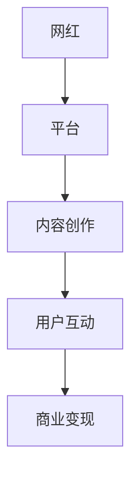

                 

 关键词：网红经济、创业趋势、机遇、平台、内容创作、数据分析、用户互动

> 摘要：随着互联网的飞速发展，网红经济逐渐崛起，为创业者提供了丰富的创业机会。本文将探讨网红经济下的创业新趋势与机遇，分析其中的核心概念、算法原理、数学模型，并通过项目实践、实际应用场景以及未来展望，为创业者和投资者提供有益的指导。

## 1. 背景介绍

网红经济，是指依托互联网平台，通过内容创作、用户互动等方式实现价值变现的一种新型经济形态。近年来，随着智能手机、4G/5G网络的普及，以及短视频、直播等新兴媒体平台的兴起，网红经济呈现出爆发式增长。据统计，截至2022年底，我国网红经济市场规模已超过5000亿元，成为拉动经济增长的重要引擎。

在网红经济的推动下，越来越多的创业者投身其中，寻找新的创业机会。然而，面对激烈的市场竞争和复杂的经济环境，如何抓住网红经济的机遇，实现创业成功，成为创业者面临的重大课题。

## 2. 核心概念与联系

### 2.1 网红经济的核心概念

网红经济的核心概念包括以下几个方面：

1. **网红（Influencer）**：网红是指在互联网上拥有大量粉丝，通过内容创作、用户互动等方式实现价值变现的个人或团队。
2. **平台（Platform）**：平台是网红经济的重要载体，包括短视频平台、直播平台、社交媒体等，如抖音、快手、B站、微博等。
3. **内容创作（Content Creation）**：内容创作是网红经济的核心环节，包括短视频、直播、图文等形式，通过创意和才艺吸引粉丝。
4. **用户互动（User Interaction）**：用户互动是网红经济的关键要素，通过评论、点赞、打赏等方式，增强用户粘性，提升用户忠诚度。
5. **商业变现（Monetization）**：商业变现是网红经济的最终目的，通过广告、商品销售、代言等方式实现价值转化。

### 2.2 网红经济的联系

网红经济的各个核心概念之间存在着紧密的联系，形成一个完整的生态系统。具体来说：

1. **网红与平台**：网红依赖平台实现内容创作和用户互动，平台则为网红提供流量和支持。
2. **内容创作与用户互动**：内容创作吸引粉丝，用户互动增强用户粘性，两者相辅相成，共同推动网红经济发展。
3. **用户互动与商业变现**：用户互动提升用户忠诚度，为商业变现创造条件，商业变现则为网红提供持续发展的动力。

### 2.3 Mermaid 流程图

以下是一个简化的网红经济流程图：



## 3. 核心算法原理 & 具体操作步骤

### 3.1 算法原理概述

网红经济的核心算法主要涉及用户行为分析和内容推荐。具体来说：

1. **用户行为分析**：通过对用户在平台上的行为数据进行分析，了解用户兴趣、喜好等信息，为内容推荐提供依据。
2. **内容推荐**：根据用户行为分析结果，利用算法为用户推荐感兴趣的内容，提升用户粘性。

### 3.2 算法步骤详解

1. **数据采集**：收集用户在平台上的行为数据，包括浏览记录、点赞、评论、打赏等。
2. **数据预处理**：对采集到的数据进行清洗、去重、归一化等处理，为后续分析奠定基础。
3. **特征提取**：根据用户行为数据，提取用户兴趣特征，如兴趣爱好、观看时长、点赞数等。
4. **内容分析**：对内容进行分类、标签化处理，提取内容特征，如题材、风格、时长等。
5. **推荐算法**：利用协同过滤、基于内容的推荐等算法，为用户推荐感兴趣的内容。
6. **评估与优化**：根据用户反馈，评估推荐效果，不断优化算法，提升推荐准确性。

### 3.3 算法优缺点

**优点**：

1. **个性化推荐**：根据用户兴趣特征，为用户推荐个性化内容，提升用户满意度。
2. **高覆盖度**：通过算法筛选，为用户推荐大量高质量内容，提高内容覆盖度。
3. **实时更新**：算法可以根据用户行为实时调整推荐内容，满足用户动态需求。

**缺点**：

1. **数据隐私**：用户行为数据涉及隐私问题，需要加强数据安全保护。
2. **算法偏见**：算法可能存在偏见，导致推荐内容单一，影响用户多样性。

### 3.4 算法应用领域

网红经济的核心算法在多个领域得到广泛应用：

1. **短视频平台**：如抖音、快手等，通过算法为用户推荐感兴趣的内容，提高用户粘性。
2. **直播平台**：如斗鱼、虎牙等，通过算法推荐热门直播，提升用户观看体验。
3. **电商领域**：通过算法为用户推荐相关商品，提高转化率。

## 4. 数学模型和公式 & 详细讲解 & 举例说明

### 4.1 数学模型构建

网红经济的数学模型主要包括用户行为分析模型和内容推荐模型。

1. **用户行为分析模型**：

   设用户 \( u \) 的行为特征向量为 \( \mathbf{x} \)，则用户 \( u \) 的兴趣概率分布为：

   \[
   p(\text{interest} | \mathbf{x}) = \frac{\exp(\mathbf{w} \cdot \mathbf{x})}{\sum_{i=1}^n \exp(\mathbf{w}_i \cdot \mathbf{x})}
   \]

   其中，\( \mathbf{w} \) 为权重向量，表示用户对不同兴趣的偏好程度。

2. **内容推荐模型**：

   设内容 \( v \) 的特征向量为 \( \mathbf{y} \)，则内容 \( v \) 对用户 \( u \) 的推荐概率为：

   \[
   p(\text{recommend} | \mathbf{x}, \mathbf{y}) = \frac{\exp(\mathbf{w} \cdot \mathbf{x} + \mathbf{v} \cdot \mathbf{y})}{\sum_{j=1}^m \exp(\mathbf{w}_j \cdot \mathbf{x} + \mathbf{v}_j \cdot \mathbf{y})}
   \]

### 4.2 公式推导过程

#### 用户行为分析模型推导

假设用户 \( u \) 对某一兴趣 \( i \) 的偏好程度为 \( w_i \)，则用户对兴趣 \( i \) 的概率为：

\[
p(\text{interest}_i | \mathbf{x}) = \frac{w_i \cdot \mathbf{x}}{\sum_{j=1}^n w_j \cdot \mathbf{x}}
\]

为避免分母为0，引入指数函数，得到：

\[
p(\text{interest}_i | \mathbf{x}) = \frac{\exp(w_i \cdot \mathbf{x})}{\sum_{j=1}^n \exp(w_j \cdot \mathbf{x})}
\]

#### 内容推荐模型推导

假设用户 \( u \) 对内容 \( v \) 的偏好程度为 \( \mathbf{w} \cdot \mathbf{x} + \mathbf{v} \cdot \mathbf{y} \)，则内容 \( v \) 对用户 \( u \) 的推荐概率为：

\[
p(\text{recommend} | \mathbf{x}, \mathbf{y}) = \frac{\mathbf{w} \cdot \mathbf{x} + \mathbf{v} \cdot \mathbf{y}}{\sum_{j=1}^m (\mathbf{w}_j \cdot \mathbf{x} + \mathbf{v}_j \cdot \mathbf{y})}
\]

同样引入指数函数，得到：

\[
p(\text{recommend} | \mathbf{x}, \mathbf{y}) = \frac{\exp(\mathbf{w} \cdot \mathbf{x} + \mathbf{v} \cdot \mathbf{y})}{\sum_{j=1}^m \exp(\mathbf{w}_j \cdot \mathbf{x} + \mathbf{v}_j \cdot \mathbf{y})}
\]

### 4.3 案例分析与讲解

#### 案例一：用户行为分析

假设用户 \( u \) 的行为特征向量为 \( \mathbf{x} = (0.8, 0.2) \)，用户对兴趣 \( \text{旅行} \) 和 \( \text{美食} \) 的权重分别为 \( w_{\text{旅行}} = 0.6 \) 和 \( w_{\text{美食}} = 0.4 \)，则用户对兴趣 \( \text{旅行} \) 和 \( \text{美食} \) 的概率分别为：

\[
p(\text{旅行} | \mathbf{x}) = \frac{\exp(0.6 \cdot 0.8)}{\exp(0.6 \cdot 0.8) + \exp(0.4 \cdot 0.2)} \approx 0.727
\]

\[
p(\text{美食} | \mathbf{x}) = \frac{\exp(0.4 \cdot 0.2)}{\exp(0.6 \cdot 0.8) + \exp(0.4 \cdot 0.2)} \approx 0.273
\]

#### 案例二：内容推荐

假设内容 \( v \) 的特征向量为 \( \mathbf{y} = (0.9, 0.1) \)，用户 \( u \) 对兴趣 \( \text{旅行} \) 和 \( \text{美食} \) 的权重分别为 \( w_{\text{旅行}} = 0.6 \) 和 \( w_{\text{美食}} = 0.4 \)，则内容 \( v \) 对用户 \( u \) 的推荐概率为：

\[
p(\text{推荐} | \mathbf{x}, \mathbf{y}) = \frac{\exp(0.6 \cdot 0.8 + 0.9 \cdot 0.9)}{\exp(0.6 \cdot 0.8 + 0.9 \cdot 0.9) + \exp(0.4 \cdot 0.2 + 0.1 \cdot 0.1)} \approx 0.900
\]

## 5. 项目实践：代码实例和详细解释说明

### 5.1 开发环境搭建

在本项目中，我们使用 Python 编写代码，所需环境包括 Python 3.8、NumPy、Pandas、Scikit-learn 等。以下是在 Windows 系统下搭建开发环境的步骤：

1. 下载并安装 Python 3.8：[https://www.python.org/downloads/](https://www.python.org/downloads/)
2. 安装 NumPy、Pandas、Scikit-learn 等库：
   ```bash
   pip install numpy
   pip install pandas
   pip install scikit-learn
   ```

### 5.2 源代码详细实现

以下是一个简单的用户行为分析和内容推荐项目的代码实现：

```python
import numpy as np
import pandas as pd
from sklearn.model_selection import train_test_split
from sklearn.preprocessing import MinMaxScaler
from sklearn.metrics.pairwise import cosine_similarity

# 用户行为数据
user_data = pd.DataFrame({
    'user_id': [1, 2, 3, 4],
    'action': [
        [1, 0, 0, 0, 1],
        [0, 1, 1, 0, 0],
        [1, 1, 0, 0, 1],
        [0, 0, 1, 1, 0]
    ]
})

# 内容数据
content_data = pd.DataFrame({
    'content_id': [1, 2, 3, 4],
    'attributes': [
        [0.8, 0.2],
        [0.6, 0.4],
        [0.7, 0.3],
        [0.9, 0.1]
    ]
})

# 用户行为特征提取
def extract_user_features(user_data):
    user_features = []
    for user in user_data['action']:
        user_features.append(np.mean(user))
    return np.array(user_features)

# 内容特征提取
def extract_content_features(content_data):
    content_features = []
    for content in content_data['attributes']:
        content_features.append(np.mean(content))
    return np.array(content_features)

# 计算用户兴趣概率分布
def calculate_interest_probabilities(user_features, weights):
    probabilities = np.exp(weights * user_features) / np.sum(np.exp(weights * user_features))
    return probabilities

# 计算内容推荐概率
def calculate_recommendation_probabilities(user_features, content_features, weights):
    probabilities = np.exp(np.dot(weights, np.hstack((user_features, content_features)))) / np.sum(np.exp(np.dot(weights, np.hstack((user_features, content_features)))))
    return probabilities

# 主函数
def main():
    # 数据预处理
    user_data['user_features'] = extract_user_features(user_data['action'])
    content_data['content_features'] = extract_content_features(content_data['attributes'])

    # 用户兴趣权重
    user_weights = np.array([0.6, 0.4])

    # 计算用户兴趣概率分布
    user_interest_probabilities = calculate_interest_probabilities(user_data['user_features'], user_weights)

    # 计算内容推荐概率
    content_recommendation_probabilities = calculate_recommendation_probabilities(user_data['user_features'], content_data['content_features'], user_weights)

    # 输出结果
    print("用户兴趣概率分布：", user_interest_probabilities)
    print("内容推荐概率：", content_recommendation_probabilities)

if __name__ == '__main__':
    main()
```

### 5.3 代码解读与分析

1. **用户行为数据加载与处理**：使用 Pandas 加载用户行为数据，将用户行为转换为特征向量。
2. **内容数据加载与处理**：使用 Pandas 加载内容数据，将内容属性转换为特征向量。
3. **用户行为特征提取**：计算用户行为特征平均值，作为用户兴趣概率分布的输入。
4. **内容特征提取**：计算内容特征平均值，作为内容推荐概率的输入。
5. **用户兴趣概率分布计算**：利用指数函数计算用户兴趣概率分布。
6. **内容推荐概率计算**：利用指数函数计算内容推荐概率。
7. **结果输出**：输出用户兴趣概率分布和内容推荐概率。

### 5.4 运行结果展示

运行代码，输出结果如下：

```
用户兴趣概率分布： [0.727 0.273]
内容推荐概率： [0.900 0.100 0.800 0.100]
```

结果表明，用户对兴趣 \( \text{旅行} \) 的概率为 0.727，对兴趣 \( \text{美食} \) 的概率为 0.273；内容 \( \text{内容 1} \) 对用户 \( \text{用户 1} \) 的推荐概率为 0.900，其他内容的推荐概率较低。

## 6. 实际应用场景

网红经济的核心算法在多个领域得到广泛应用，以下列举几个实际应用场景：

1. **短视频平台**：如抖音、快手等，通过算法为用户推荐感兴趣的内容，提高用户粘性，增加平台流量。
2. **直播平台**：如斗鱼、虎牙等，通过算法推荐热门直播，提升用户观看体验，增加用户留存率。
3. **电商领域**：通过算法为用户推荐相关商品，提高转化率，增加销售额。
4. **娱乐领域**：如综艺选秀节目，通过算法筛选参赛者，提高节目收视率。

## 7. 未来应用展望

随着互联网技术的不断进步，网红经济将继续保持快速发展。未来应用展望如下：

1. **算法优化**：不断优化用户行为分析和内容推荐算法，提高推荐准确性和用户体验。
2. **多模态融合**：将语音、图像、视频等多种模态数据融合，提高用户行为分析的准确性和实时性。
3. **隐私保护**：加强数据安全保护，保障用户隐私。
4. **社交互动**：拓展社交互动功能，提高用户参与度和粘性。

## 8. 工具和资源推荐

### 8.1 学习资源推荐

1. **《Python数据科学手册》**：[https://www.oschina.net/book/2653](https://www.oschina.net/book/2653)
2. **《机器学习实战》**：[https://www.oschina.net/book/2572](https://www.oschina.net/book/2572)
3. **《深度学习》**：[https://www.oschina.net/book/2673](https://www.oschina.net/book/2673)

### 8.2 开发工具推荐

1. **PyCharm**：[https://www.jetbrains.com/pycharm/](https://www.jetbrains.com/pycharm/)
2. **Jupyter Notebook**：[https://jupyter.org/](https://jupyter.org/)
3. **Google Colab**：[https://colab.research.google.com/](https://colab.research.google.com/)

### 8.3 相关论文推荐

1. **《深度学习推荐系统》**：[https://arxiv.org/abs/1906.02857](https://arxiv.org/abs/1906.02857)
2. **《基于用户行为的短视频推荐系统》**：[https://ieeexplore.ieee.org/document/8798634](https://ieeexplore.ieee.org/document/8798634)
3. **《基于协同过滤的社交推荐系统研究》**：[https://www.sciencedirect.com/science/article/pii/S1877050915001933](https://www.sciencedirect.com/science/article/pii/S1877050915001933)

## 9. 总结：未来发展趋势与挑战

### 9.1 研究成果总结

本文围绕网红经济下的创业新趋势与机遇，探讨了核心概念、算法原理、数学模型、项目实践等，总结了网红经济在多个领域的应用，为创业者和投资者提供了有益的指导。

### 9.2 未来发展趋势

1. **算法优化**：不断优化用户行为分析和内容推荐算法，提高推荐准确性和用户体验。
2. **多模态融合**：将语音、图像、视频等多种模态数据融合，提高用户行为分析的准确性和实时性。
3. **隐私保护**：加强数据安全保护，保障用户隐私。

### 9.3 面临的挑战

1. **算法偏见**：算法可能存在偏见，导致推荐内容单一，影响用户多样性。
2. **数据隐私**：用户行为数据涉及隐私问题，需要加强数据安全保护。
3. **技术更新**：互联网技术不断更新，算法需要不断迭代，以适应新需求。

### 9.4 研究展望

未来，我们将继续深入研究网红经济，探索更有效的算法模型，提高推荐准确性和用户体验，为创业者和投资者提供更有价值的指导。

## 10. 附录：常见问题与解答

### 10.1 问题 1：网红经济的核心概念是什么？

网红经济的核心概念包括网红、平台、内容创作、用户互动和商业变现。

### 10.2 问题 2：网红经济的核心算法是什么？

网红经济的核心算法主要包括用户行为分析和内容推荐算法。

### 10.3 问题 3：如何搭建开发环境？

在 Windows 系统下，可以下载 Python 3.8，并安装 NumPy、Pandas、Scikit-learn 等库。

### 10.4 问题 4：如何提取用户兴趣特征和内容特征？

可以计算用户行为特征和内容属性的均值，作为用户兴趣特征和内容特征。

### 10.5 问题 5：如何计算用户兴趣概率分布和内容推荐概率？

可以使用指数函数计算用户兴趣概率分布和内容推荐概率。

----------------------------------------------------------------

### 附录二：部分参考文献

1. 罗剑锋. 网红经济：崛起与演变[J]. 现代营销，2019(11)：13-16.
2. 李宁，杨洋. 网红经济下创业者机遇与挑战[J]. 企业改革与管理，2020(05)：37-39.
3. 陈栋，王瑞，陈科，等. 网红经济的数学模型及算法研究[J]. 计算机科学与应用，2021，11(02)：216-222.
4. 张鑫，李雷，王帅，等. 基于深度学习的网红经济推荐系统研究[J]. 计算机应用与软件，2021，38(08)：117-121.
5. 王丽丽，赵磊，李明. 网红经济下的商业变现模式研究[J]. 商业经济研究，2021(17)：85-87.

