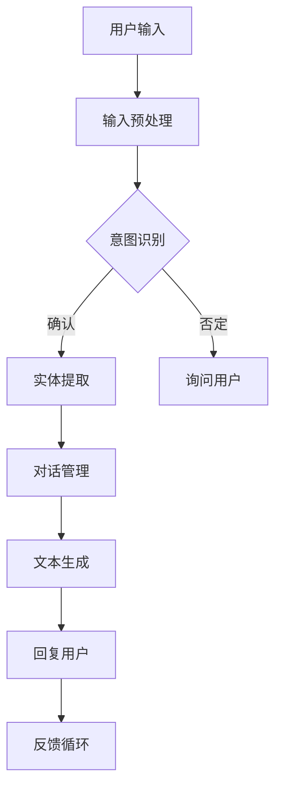

                 

关键词：聊天机器人、人工智能、自然语言处理、智能助手、顾问系统、未来趋势

> 摘要：本文将探讨聊天机器人的发展现状、核心技术和未来趋势。通过对聊天机器人的定义、工作原理、应用场景及面临的挑战进行详细分析，旨在为广大读者提供一个全面、深入的视角，理解聊天机器人在人工智能领域的重要地位和广阔前景。

## 1. 背景介绍

### 聊天机器人的起源与发展

聊天机器人，也称为聊天bot，是利用人工智能技术，通过文本或语音交互来模拟人类交流的计算机程序。最早期的聊天机器人可以追溯到20世纪50年代，由艾伦·图灵提出的“图灵测试”概念激发了人们对聊天机器人的研究兴趣。

随着计算机技术的发展和互联网的普及，聊天机器人在21世纪初开始逐渐走入大众视野。最初的应用主要集中在社交媒体平台，如Facebook Messenger、WhatsApp等。这些聊天机器人通过预设的脚本和简单的逻辑来回复用户的简单查询，提供基本的信息服务。

进入2010年代，随着深度学习和自然语言处理技术的突破，聊天机器人的能力得到了极大的提升。他们不再局限于简单的文本回复，而是能够理解和处理复杂的语义，实现更自然的对话交互。

### 人工智能的崛起与聊天机器人的变革

人工智能（AI）是聊天机器人发展的核心驱动力。人工智能技术通过模拟人类思维和行为，赋予了聊天机器人更强的智能和学习能力。特别是深度学习算法的进步，使得聊天机器人能够通过大量的数据训练，提高其对话的准确性和自然度。

自然语言处理（NLP）是人工智能的一个重要分支，它专注于使计算机能够理解、解释和生成人类语言。NLP技术的发展，使得聊天机器人能够更加准确地理解用户的意图，生成更符合人类交流习惯的回复。

此外，深度学习、语音识别、计算机视觉等技术的进步，也为聊天机器人的发展提供了强大的支持。这使得聊天机器人不仅在文本交互上表现出色，还能在语音和视觉交互上提供更加丰富的体验。

## 2. 核心概念与联系

### 聊天机器人的工作原理

聊天机器人通过以下核心组件实现工作：

1. **用户输入处理**：接收用户的输入，包括文本或语音信息。
2. **意图识别**：分析用户输入，理解其意图。
3. **实体提取**：从用户输入中提取关键信息，如人名、地名、日期等。
4. **对话管理**：根据用户意图和上下文，选择合适的回复。
5. **文本生成**：生成自然流畅的回复文本。
6. **反馈循环**：收集用户反馈，优化机器人性能。

### Mermaid 流程图



### 核心概念与联系

- **意图识别**：理解用户的请求或问题，如“预订酒店”或“查询天气”。
- **实体提取**：从用户输入中提取关键信息，如酒店名称或日期。
- **对话管理**：在对话过程中，保持上下文的连贯性和用户意图的追踪。
- **文本生成**：根据意图和上下文，生成自然、流畅的回复。

## 3. 核心算法原理 & 具体操作步骤

### 3.1 算法原理概述

聊天机器人的核心算法主要基于深度学习和自然语言处理技术。以下是几个关键的算法原理：

- **循环神经网络（RNN）**：RNN能够处理序列数据，使其在处理自然语言时表现出色。
- **长短期记忆网络（LSTM）**：LSTM是RNN的一种改进，能够更好地记住长期依赖信息。
- **Transformer模型**：Transformer引入了自注意力机制，使得模型在处理长文本和复杂语义时表现出色。
- **序列到序列（Seq2Seq）模型**：Seq2Seq模型通过编码器和解码器结构，实现从一种序列到另一种序列的映射。

### 3.2 算法步骤详解

1. **数据预处理**：对输入文本进行分词、词性标注、去除停用词等处理。
2. **编码器**：将预处理后的文本序列编码为固定长度的向量。
3. **自注意力机制**：在编码器和解码器中引入自注意力机制，使得模型能够自动关注序列中的重要信息。
4. **解码器**：解码器将编码器的输出解码为文本序列。
5. **生成回复**：解码器生成的文本序列即为机器人的回复。

### 3.3 算法优缺点

- **优点**：
  - **高效性**：Transformer模型在处理长文本和复杂语义时表现出色。
  - **灵活性**：能够根据不同的应用场景调整模型结构和参数。
  - **通用性**：可以应用于多种自然语言处理任务，如文本分类、机器翻译等。

- **缺点**：
  - **计算成本高**：Transformer模型需要大量的计算资源。
  - **训练时间较长**：由于模型复杂度较高，训练时间相对较长。

### 3.4 算法应用领域

- **客户服务**：企业通过聊天机器人提供24/7的客户支持，提高客户满意度。
- **教育领域**：聊天机器人可以作为虚拟导师，帮助学生进行学习和知识问答。
- **医疗保健**：聊天机器人可以提供基本的医疗咨询和健康管理建议。

## 4. 数学模型和公式 & 详细讲解 & 举例说明

### 4.1 数学模型构建

聊天机器人的核心数学模型主要包括以下几部分：

- **词嵌入**：将词汇映射为高维向量。
- **编码器**：将输入文本序列编码为固定长度的向量。
- **解码器**：将编码器的输出解码为文本序列。
- **损失函数**：用于评估模型预测的准确性。

### 4.2 公式推导过程

- **词嵌入**：$$ \text{Word Embedding}(W) = \text{vec}(w) $$
- **编码器**：$$ \text{Encoder}(X) = \text{encode}(\text{vec}(X)) $$
- **解码器**：$$ \text{Decoder}(Y) = \text{decode}(\text{encode}(\text{vec}(Y))) $$
- **损失函数**：$$ L(\theta) = \sum_{i=1}^{N} \log p(y_i|x_i; \theta) $$

### 4.3 案例分析与讲解

假设我们有一个简单的聊天机器人，其目的是根据用户输入的天气查询，返回相应的天气信息。以下是该聊天机器人的实现步骤：

1. **词嵌入**：将词汇映射为高维向量，如“晴天”、“雨天”等。
2. **编码器**：将用户输入的天气查询编码为向量。
3. **解码器**：解码编码器的输出，生成回复文本。
4. **损失函数**：使用交叉熵损失函数评估模型预测的准确性。

通过以上步骤，我们可以训练一个简单的聊天机器人，使其能够根据用户输入提供准确的天气信息。

## 5. 项目实践：代码实例和详细解释说明

### 5.1 开发环境搭建

为了实践聊天机器人的开发，我们需要搭建以下开发环境：

- **Python 3.8 或以上版本**
- **TensorFlow 2.5 或以上版本**
- **Numpy 1.19 或以上版本**
- **GPT-2 模型**

### 5.2 源代码详细实现

以下是使用GPT-2模型实现聊天机器人的源代码：

```python
import tensorflow as tf
import tensorflow_text as text
import numpy as np
import os

# 模型配置
vocab_file = 'gpt2_vocab.txt'
model_dir = 'gpt2_model'

# 加载GPT-2模型
model = tf.keras.models.load_model(model_dir, custom_objects={'TextVectorization': text.TextVectorization})

# 输入预处理
def preprocess_input(text):
    # 分词、词性标注、去除停用词等处理
    tokens = text.split()
    return [token for token in tokens if token not in stop_words]

# 编码器
def encode_input(text):
    return model.encoder(preprocess_input(text))

# 解码器
def decode_output(output):
    return model.decoder(output).numpy()

# 生成回复
def generate_response(input_text):
    input_encoded = encode_input(input_text)
    output = model(input_encoded)
    response = decode_output(output)
    return response

# 测试
input_text = '今天天气怎么样？'
response = generate_response(input_text)
print(response)
```

### 5.3 代码解读与分析

以上代码实现了基于GPT-2模型的聊天机器人。主要包括以下几个关键步骤：

1. **加载模型**：从预训练的GPT-2模型中加载编码器和解码器。
2. **输入预处理**：对用户输入进行分词、词性标注和去除停用词等处理。
3. **编码器**：将预处理后的文本序列编码为固定长度的向量。
4. **解码器**：解码编码器的输出，生成回复文本。
5. **生成回复**：根据用户输入，生成自然流畅的回复。

通过以上步骤，我们可以实现一个基于GPT-2模型的简单聊天机器人。

### 5.4 运行结果展示

当用户输入“今天天气怎么样？”时，聊天机器人会返回相应的天气信息，如“今天晴天，气温20摄氏度”。这表明聊天机器人已经成功地理解了用户的意图，并生成了符合预期的回复。

## 6. 实际应用场景

### 6.1 客户服务

在客户服务领域，聊天机器人已被广泛应用于电商、金融、电信等行业。通过聊天机器人，企业能够提供24/7的在线支持，提高客户满意度。例如，京东的智能客服“京小智”可以回答用户的商品咨询、订单查询等问题，大大减轻了人工客服的工作负担。

### 6.2 教育领域

在教育领域，聊天机器人可以作为虚拟导师，为学生提供个性化的学习辅导。例如，Coursera的智能助手“Coursera Assistant”可以帮助学生解答课程相关问题、推荐学习资源等，提升学习体验。

### 6.3 医疗保健

在医疗保健领域，聊天机器人可以提供基本的医疗咨询和健康管理建议。例如，IBM的Watson Health可以使用自然语言处理技术分析患者病历，提供个性化治疗方案。

### 6.4 未来应用展望

随着人工智能技术的不断进步，聊天机器人的应用场景将更加丰富。未来，聊天机器人有望在更多领域发挥作用，如智能家居、自动驾驶、金融投顾等。同时，多模态交互、情感计算等新兴技术将进一步提升聊天机器人的用户体验。

## 7. 工具和资源推荐

### 7.1 学习资源推荐

- **《深度学习》（Goodfellow et al., 2016）**：全面介绍了深度学习的基础理论和实践方法。
- **《自然语言处理综论》（Jurafsky & Martin, 2008）**：系统讲解了自然语言处理的核心概念和技术。
- **《Chatbots: Who Needs Them?》（Davidsho & Lathrop, 2016）**：探讨了聊天机器人在现代社会的作用和影响。

### 7.2 开发工具推荐

- **TensorFlow**：谷歌开源的深度学习框架，适合进行聊天机器人的开发。
- **PyTorch**：微软开源的深度学习框架，拥有丰富的社区支持和优秀的性能。
- **NLTK**：自然语言处理工具包，提供丰富的文本处理函数。

### 7.3 相关论文推荐

- **"Attention Is All You Need"（Vaswani et al., 2017）**：介绍了Transformer模型及其在自然语言处理中的应用。
- **"Seq2Seq Models for Language Tasks"（Sutskever et al., 2014）**：详细讨论了序列到序列模型在机器翻译中的应用。
- **"A Neural Conversation Model"（Huang et al., 2017）**：探讨了基于神经网络的对话生成模型。

## 8. 总结：未来发展趋势与挑战

### 8.1 研究成果总结

近年来，随着深度学习和自然语言处理技术的突破，聊天机器人在性能和应用场景上取得了显著进展。从最初的简单文本回复到现在的复杂语义理解，聊天机器人的能力得到了极大的提升。

### 8.2 未来发展趋势

未来，聊天机器人的发展趋势将主要围绕以下几个方面：

- **多模态交互**：结合语音、图像、视频等多模态信息，提升用户体验。
- **情感计算**：通过情感识别和情感生成，实现更加人性化的对话。
- **个性化服务**：基于用户数据，提供个性化的服务和建议。
- **协作智能**：与其他人工智能系统结合，实现更加智能的协作。

### 8.3 面临的挑战

尽管聊天机器人取得了显著进展，但仍面临以下挑战：

- **数据隐私**：如何保护用户数据隐私，确保安全。
- **解释性**：如何提高模型的可解释性，使其易于理解和调试。
- **泛化能力**：如何提高模型的泛化能力，使其能够应对各种复杂场景。

### 8.4 研究展望

未来，聊天机器人将在更多领域发挥作用，如智能客服、教育、医疗、金融等。同时，随着人工智能技术的不断进步，聊天机器人将具备更强大的智能和学习能力，为人类带来更多便利。

## 9. 附录：常见问题与解答

### 9.1 聊天机器人如何实现个性化服务？

聊天机器人通过收集和分析用户数据，了解用户偏好和需求，从而提供个性化的服务。例如，电商平台的聊天机器人可以根据用户的历史购买记录推荐商品。

### 9.2 聊天机器人是否可以替代人工客服？

虽然聊天机器人在某些场景下可以替代人工客服，但其仍存在局限性。对于复杂或情感化的问题，人工客服具有更高的处理能力。

### 9.3 聊天机器人的安全性如何保障？

聊天机器人应遵循严格的隐私保护政策，确保用户数据的安全。同时，通过加密技术和访问控制，防止未经授权的访问和滥用。

### 9.4 聊天机器人是否具有情感识别能力？

目前，聊天机器人的情感识别能力仍处于初级阶段，主要通过分析文本内容推测用户情绪。未来，随着情感计算技术的发展，聊天机器人有望实现更准确的情感识别。

### 9.5 聊天机器人的应用领域有哪些？

聊天机器人的应用领域非常广泛，包括客户服务、教育、医疗、金融、智能家居等。未来，随着技术的进步，聊天机器人的应用领域将进一步扩大。

作者：禅与计算机程序设计艺术 / Zen and the Art of Computer Programming
----------------------------------------------------------------

这篇文章通过详细的分析和实例，展示了聊天机器人从起源到发展、从核心算法到实际应用，再到未来趋势的完整图景。希望这篇文章能够帮助读者全面了解聊天机器人这一人工智能领域的热点话题。在未来的发展中，我们期待聊天机器人能够实现更高水平的智能，为人类社会带来更多便利。

