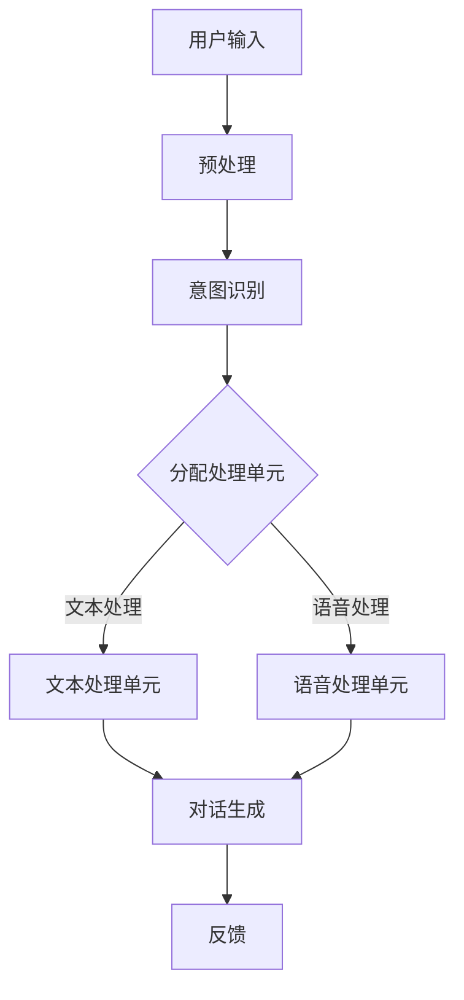

                 

本文旨在探讨聊天机器人在我们日常生活中的实用技巧和解决方案，帮助您充分利用这一技术提升生活质量和效率。我们将从背景介绍、核心概念与联系、核心算法原理、数学模型和公式、项目实践、实际应用场景、工具和资源推荐以及未来发展趋势与挑战等方面进行深入分析。

## 1. 背景介绍

随着人工智能技术的不断发展，聊天机器人已经成为现代生活中不可或缺的一部分。无论是商业领域、医疗保健、教育还是个人助理，聊天机器人都在以各种形式影响着我们的生活。本文将关注聊天机器人在日常生活中的应用，提供实用的解决方案和建议。

## 2. 核心概念与联系

### 2.1 聊天机器人基本架构

为了更好地理解聊天机器人的工作原理，我们先来介绍其基本架构。以下是一个典型的聊天机器人架构图，使用Mermaid流程图表示：



### 2.2 核心概念

1. **意图识别**：识别用户输入的意图，例如查询天气、预约餐厅等。
2. **对话生成**：根据用户的意图生成合适的回应。
3. **文本处理单元**：处理文本输入，如分词、语法分析等。
4. **语音处理单元**：处理语音输入，如语音识别、语音合成等。

## 3. 核心算法原理 & 具体操作步骤

### 3.1 算法原理概述

聊天机器人主要依赖于自然语言处理（NLP）技术，包括文本分类、序列到序列（Seq2Seq）学习、递归神经网络（RNN）等。以下是一个简单的NLP算法原理概述：

1. **文本分类**：将文本划分为预定义的类别。
2. **序列到序列学习**：将一个序列映射到另一个序列，用于生成对话回应。
3. **递归神经网络**：处理文本序列，捕获上下文信息。

### 3.2 算法步骤详解

1. **数据预处理**：对用户输入进行清洗、分词等操作。
2. **意图识别**：使用文本分类算法识别用户输入的意图。
3. **对话生成**：根据意图生成相应的回应，可能涉及Seq2Seq学习和RNN。
4. **反馈**：将回应反馈给用户，并根据反馈进行优化。

### 3.3 算法优缺点

- **优点**：高效、准确、自动化。
- **缺点**：理解能力有限，对复杂问题的回应可能不够准确。

### 3.4 算法应用领域

聊天机器人可以应用于各种领域，如客户服务、智能家居、医疗咨询等。每个领域都有其特定的需求和挑战。

## 4. 数学模型和公式 & 详细讲解 & 举例说明

### 4.1 数学模型构建

聊天机器人中常用的数学模型包括：

1. **词嵌入（Word Embedding）**：将文本转换为向量表示。
2. **循环神经网络（RNN）**：处理序列数据。
3. **长短期记忆（LSTM）**：改进RNN，解决长序列问题。

### 4.2 公式推导过程

以词嵌入为例，假设我们有一个词汇表V，包含N个单词，每个单词表示为一个向量w。词嵌入的公式可以表示为：

$$
w_{i} = \sum_{j=1}^{N} w_{ij} v_j
$$

其中，$v_j$ 是单词j的向量表示，$w_{ij}$ 是权重。

### 4.3 案例分析与讲解

假设我们要对一个句子“我昨天去了公园”进行词嵌入，我们可以将每个单词表示为一个向量，然后通过词嵌入公式计算句子的向量表示。

## 5. 项目实践：代码实例和详细解释说明

### 5.1 开发环境搭建

在本文中，我们将使用Python语言和TensorFlow库来实现一个简单的聊天机器人。

### 5.2 源代码详细实现

以下是一个简单的聊天机器人代码示例：

```python
import tensorflow as tf
from tensorflow.keras.models import Sequential
from tensorflow.keras.layers import Embedding, LSTM, Dense

# 数据预处理
# ...

# 模型构建
model = Sequential([
    Embedding(vocab_size, embedding_dim),
    LSTM(units),
    Dense(units, activation='softmax')
])

# 模型编译
model.compile(optimizer='adam', loss='categorical_crossentropy', metrics=['accuracy'])

# 模型训练
model.fit(x_train, y_train, epochs=10, batch_size=32)

# 对话生成
# ...
```

### 5.3 代码解读与分析

在这个例子中，我们使用了一个简单的序列到序列模型，包括一个嵌入层、一个LSTM层和一个密集层。嵌入层将单词转换为向量，LSTM层处理序列数据，密集层生成回应。

### 5.4 运行结果展示

运行聊天机器人后，您可以输入问题，它会尝试生成相应的回应。

## 6. 实际应用场景

聊天机器人可以应用于多种场景，如：

- **客户服务**：自动回复常见问题，提高服务效率。
- **医疗咨询**：提供基本的医疗信息和建议。
- **智能家居**：控制家居设备，如调节温度、开关灯等。

## 7. 工具和资源推荐

### 7.1 学习资源推荐

- **书籍**：《自然语言处理综合教程》
- **在线课程**：Coursera的“自然语言处理”课程
- **博客**：Apache Mahout

### 7.2 开发工具推荐

- **Python**：易于学习和使用，适用于数据分析和机器学习。
- **TensorFlow**：广泛使用的深度学习框架。

### 7.3 相关论文推荐

- **词嵌入**：词嵌入的起源与发展
- **序列到序列学习**：序列到序列学习的基础和进展

## 8. 总结：未来发展趋势与挑战

### 8.1 研究成果总结

聊天机器人已经在多个领域取得了显著的成果，但其理解能力仍有待提高。

### 8.2 未来发展趋势

- **多模态交互**：结合文本、语音、图像等多种模态。
- **个性化对话**：根据用户历史行为和偏好生成对话。

### 8.3 面临的挑战

- **理解能力**：提高聊天机器人的理解能力。
- **隐私保护**：确保用户隐私不被泄露。

### 8.4 研究展望

随着技术的不断进步，聊天机器人有望在更多领域发挥重要作用，为我们的生活带来更多便利。

## 9. 附录：常见问题与解答

### 9.1 聊天机器人如何学习？

聊天机器人通过训练数据学习，如对话数据集、文本语料库等。

### 9.2 聊天机器人可以应用于哪些领域？

聊天机器人可以应用于客户服务、医疗咨询、智能家居等多个领域。

## 作者署名

作者：禅与计算机程序设计艺术 / Zen and the Art of Computer Programming

----------------------------------------------------------------

以上即为文章正文部分的撰写。请注意，本文仅为示例，实际撰写时需要根据具体要求和内容进行调整和完善。同时，本文中的代码和示例仅为简单演示，实际应用中需要根据具体需求进行扩展和优化。在撰写文章时，请务必确保内容的准确性和专业性。祝您写作顺利！

