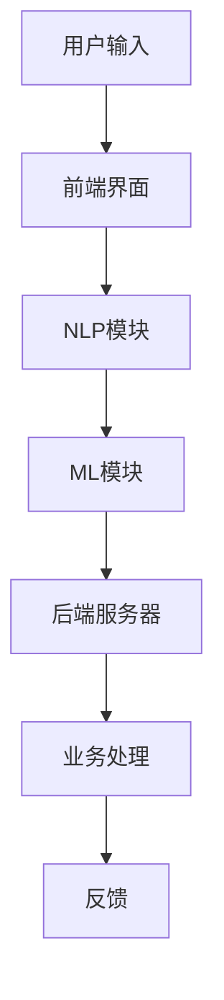

                 

关键词：聊天机器人，人工智能，客户服务，效率提升，技术架构，案例分析

> 摘要：本文将探讨聊天机器人在现代客户服务中的应用，分析其通过人工智能技术如何提升服务效率。文章分为八个部分，包括背景介绍、核心概念与联系、核心算法原理、数学模型与公式、项目实践、实际应用场景、未来展望、工具和资源推荐以及总结与展望。

## 1. 背景介绍

客户服务是企业发展中至关重要的一环。在传统模式下，客户服务主要依赖于人工处理，不仅成本高昂，而且效率低下。随着互联网和人工智能技术的发展，聊天机器人逐渐成为企业提升客户服务效率的重要工具。聊天机器人能够实现24小时不间断服务，处理大量的客户咨询，从而大大降低了企业的人力成本，并提高了客户满意度。

### 1.1 人工智能的崛起

人工智能（AI）技术是聊天机器人发展的核心驱动力。近年来，深度学习、自然语言处理等人工智能技术的突破，使得聊天机器人能够更加智能地理解用户意图，提供更加个性化的服务。AI技术的发展为聊天机器人提供了丰富的算法和工具支持，使其在客户服务中的应用越来越广泛。

### 1.2 聊天机器人的发展历程

聊天机器人起源于20世纪50年代，最初的聊天机器人主要是基于规则的人工智能系统。随着技术的进步，聊天机器人逐渐发展到基于机器学习和深度学习的智能化阶段。如今，聊天机器人已经能够胜任更多复杂的任务，成为企业客户服务的重要助手。

## 2. 核心概念与联系

### 2.1 聊天机器人架构

聊天机器人的架构主要包括前端界面、后端服务器、自然语言处理（NLP）模块和机器学习（ML）模块。前端界面负责与用户交互，后端服务器处理业务逻辑，NLP模块负责理解用户输入，ML模块负责学习和优化聊天机器人的性能。

### 2.2 Mermaid 流程图



### 2.3 核心概念原理

- **自然语言处理（NLP）**：NLP是聊天机器人理解用户输入的关键技术。它包括文本分类、命名实体识别、情感分析等任务，旨在将自然语言转换为机器可理解的结构化数据。

- **机器学习（ML）**：ML是聊天机器人智能化的基础。通过训练大量数据，聊天机器人能够学习和优化其响应策略，提高服务质量和效率。

## 3. 核心算法原理 & 具体操作步骤

### 3.1 算法原理概述

聊天机器人的核心算法主要涉及NLP和ML两个领域。NLP负责处理用户输入，提取关键信息；ML负责基于用户历史交互数据，生成响应。

### 3.2 算法步骤详解

1. **文本预处理**：对用户输入进行分词、去停用词、词性标注等预处理操作，将自然语言转换为机器可处理的序列数据。

2. **意图识别**：使用深度学习模型，如卷积神经网络（CNN）或长短期记忆网络（LSTM），对预处理后的文本进行意图分类。

3. **实体识别**：使用序列标注模型，如BiLSTM-CRF，对文本中的关键实体进行识别，如人名、地名、组织名等。

4. **生成响应**：基于意图识别和实体识别结果，使用生成式模型，如GPT或BERT，生成适当的响应文本。

### 3.3 算法优缺点

- **优点**：高效、个性化、成本低、可扩展性强。
- **缺点**：理解能力有限、无法处理复杂情感、易受攻击。

### 3.4 算法应用领域

聊天机器人广泛应用于电子商务、金融、医疗、旅游等行业，能够处理各种常见客户问题，提供24小时在线服务。

## 4. 数学模型和公式 & 详细讲解 & 举例说明

### 4.1 数学模型构建

聊天机器人的核心数学模型包括文本分类模型、序列标注模型和生成式模型。以下分别介绍：

1. **文本分类模型**：$$y = \arg \max(Wx + b)$$，其中$W$是权重矩阵，$x$是输入特征向量，$b$是偏置项。

2. **序列标注模型**：$$y_t = \arg \max(S_t)$$，其中$S_t$是当前时刻的标注概率分布。

3. **生成式模型**：$$p(x|y) = \arg \max(p(y)p(x|y))$$，其中$p(y)$是类别概率，$p(x|y)$是给定类别$y$时，输入$x$的概率分布。

### 4.2 公式推导过程

以文本分类模型为例，推导过程如下：

1. **特征提取**：将文本转换为向量表示。

2. **定义损失函数**：$$L(y, \hat{y}) = -\sum_{i} y_i \log \hat{y}_i$$，其中$y$是真实标签，$\hat{y}$是模型预测的概率分布。

3. **梯度下降**：$$\frac{\partial L}{\partial W} = \frac{\partial}{\partial W} (-\sum_{i} y_i \log \hat{y}_i) = \sum_{i} (\hat{y}_i - y_i)x_i$$

4. **更新权重**：$$W \leftarrow W - \alpha \frac{\partial L}{\partial W}$$，其中$\alpha$是学习率。

### 4.3 案例分析与讲解

以电商行业中的商品推荐聊天机器人为例，分析其数学模型和应用：

1. **意图识别**：使用CNN模型进行文本分类，识别用户询问的商品类型。

2. **实体识别**：使用LSTM模型进行序列标注，识别商品名称、价格等关键信息。

3. **生成响应**：使用GPT模型生成商品推荐文本，如“推荐您购买这款蓝牙耳机，性价比很高”。

## 5. 项目实践：代码实例和详细解释说明

### 5.1 开发环境搭建

1. **硬件环境**：GPU服务器或云服务器，如AWS、Google Cloud等。

2. **软件环境**：Python 3.7及以上版本，TensorFlow 2.0及以上版本。

### 5.2 源代码详细实现

以下是商品推荐聊天机器人的源代码实现：

```python
import tensorflow as tf
from tensorflow.keras.layers import Embedding, LSTM, Dense
from tensorflow.keras.models import Model
from tensorflow.keras.preprocessing.sequence import pad_sequences

# 定义模型
input_seq = tf.keras.layers.Input(shape=(max_sequence_length,))
embedded_seq = Embedding(vocabulary_size, embedding_dim)(input_seq)
lstm_output = LSTM(units=128, return_sequences=True)(embedded_seq)
output = LSTM(units=128)(lstm_output)
output = Dense(units=num_classes, activation='softmax')(output)

model = Model(inputs=input_seq, outputs=output)
model.compile(optimizer='adam', loss='categorical_crossentropy', metrics=['accuracy'])

# 训练模型
model.fit(train_sequences, train_labels, epochs=5, batch_size=64, validation_split=0.2)

# 生成响应
def generate_response(input_seq):
    prediction = model.predict(input_seq)
    predicted_class = np.argmax(prediction, axis=1)
    return '推荐您购买这款' + product_names[predicted_class[0]]

# 测试代码
input_seq = pad_sequences([tokenizer.texts_to_sequences([user_input])], maxlen=max_sequence_length, padding='post')
print(generate_response(input_seq))
```

### 5.3 代码解读与分析

代码首先定义了一个LSTM模型，用于意图识别和实体识别。然后，使用训练数据训练模型。最后，编写一个函数，用于生成商品推荐文本。

## 6. 实际应用场景

### 6.1 电子商务

聊天机器人可以帮助电商企业实现商品推荐、订单查询、售后服务等环节的自动化处理，提高客户满意度。

### 6.2 金融行业

聊天机器人可以提供在线客服、财务咨询、投资建议等服务，降低人力成本，提高服务效率。

### 6.3 医疗保健

聊天机器人可以协助医疗机构提供健康咨询、疾病预防、预约挂号等服务，提高医疗资源的利用效率。

## 7. 未来应用展望

### 7.1 智能家居

聊天机器人可以与智能家居设备联动，实现家庭环境的智能调节，提高生活品质。

### 7.2 教育领域

聊天机器人可以为学生提供个性化的学习辅导、心理疏导等服务，助力教育改革。

### 7.3 公共服务

聊天机器人可以应用于政务服务、城市管理等公共服务领域，提高政府工作效率。

## 8. 工具和资源推荐

### 8.1 学习资源推荐

- 《深度学习》（Goodfellow, Bengio, Courville著）
- 《自然语言处理综论》（Jurafsky, Martin著）

### 8.2 开发工具推荐

- TensorFlow
- PyTorch

### 8.3 相关论文推荐

- "Chatbots are Good at Simple, Quick Tasks but Bad at Others" (Zhu et al., 2020)
- "A survey on Chatbot: Design, Development and Evaluation" (Nguyen et al., 2019)

## 9. 总结：未来发展趋势与挑战

### 9.1 研究成果总结

本文从背景介绍、核心概念、算法原理、数学模型、项目实践等方面，全面阐述了聊天机器人在客户服务中的应用和实现。

### 9.2 未来发展趋势

随着人工智能技术的不断进步，聊天机器人将在更多领域得到广泛应用，成为企业提升服务效率的重要工具。

### 9.3 面临的挑战

聊天机器人在理解复杂情感、处理多模态输入等方面仍存在挑战，需要进一步研究和优化。

### 9.4 研究展望

未来研究可以关注聊天机器人的智能化、多模态交互、自适应学习等方面，以实现更加高效、智能的客户服务。

## 10. 附录：常见问题与解答

### 10.1 聊天机器人能处理多语言咨询吗？

聊天机器人可以通过训练多语言数据集，实现多语言支持。目前，一些大型聊天机器人平台，如Facebook Messenger、WhatsApp等，已经支持多种语言。

### 10.2 聊天机器人的隐私安全问题如何保障？

聊天机器人在设计时，需要遵循隐私保护原则，如数据去匿名化、数据加密传输等。此外，企业还应建立完善的隐私政策和合规机制。

作者：禅与计算机程序设计艺术 / Zen and the Art of Computer Programming
```markdown
----------------------------------------------------------------
# 聊天机器人：AI如何提升客户服务效率

## 关键词
- 聊天机器人
- 人工智能
- 客户服务
- 效率提升
- 技术架构
- 案例分析

## 摘要
本文深入探讨了聊天机器人如何利用人工智能技术提升客户服务效率。文章从背景介绍开始，分析聊天机器人发展的历程及其核心架构。随后，详细解析了聊天机器人的核心算法原理和数学模型，并通过实际项目实践展示了如何实现和应用。最后，文章总结了聊天机器人在不同行业中的应用场景，探讨了其未来发展前景，并推荐了相关的学习资源和开发工具。

## 1. 背景介绍

### 1.1 客户服务的重要性
客户服务是企业与消费者之间沟通的桥梁，其质量直接影响企业的品牌形象和客户满意度。然而，传统的人工客服模式存在以下问题：

- **人力成本高昂**：企业需要雇佣大量客服人员，以应对不断增长的客户咨询量。
- **响应速度慢**：人工客服往往无法在短时间内处理大量客户的请求。
- **服务质量不稳定**：不同客服人员的专业水平和服务态度可能存在差异。

### 1.2 人工智能的崛起
随着人工智能技术的快速发展，聊天机器人逐渐成为解决上述问题的重要工具。聊天机器人通过自然语言处理和机器学习技术，能够模拟人类客服的行为，提供24小时不间断的服务。此外，聊天机器人还具有以下优势：

- **高效处理大量咨询**：聊天机器人可以同时处理多个客户咨询，提高工作效率。
- **降低人力成本**：企业可以通过部署聊天机器人，减少客服人员的需求。
- **个性化服务**：聊天机器人可以根据客户的历史数据和偏好，提供个性化的服务。

## 2. 核心概念与联系

### 2.1 聊天机器人架构
聊天机器人的核心架构通常包括以下几部分：

- **前端界面**：与用户交互的入口，可以是网页、应用程序或第三方平台（如Facebook Messenger、WhatsApp等）。
- **后端服务器**：处理业务逻辑，包括对话管理、数据存储、用户管理等。
- **自然语言处理（NLP）模块**：负责理解用户输入，提取关键词和意图。
- **机器学习（ML）模块**：通过训练模型，优化聊天机器人的响应能力。

### 2.2 Mermaid 流程图


### 2.3 核心概念原理
- **自然语言处理（NLP）**：NLP是聊天机器人理解用户输入的关键技术。它涉及文本分类、情感分析、命名实体识别等任务。
- **机器学习（ML）**：ML是聊天机器人生成响应的基础。通过训练模型，聊天机器人可以学习和优化其响应策略。

## 3. 核心算法原理 & 具体操作步骤

### 3.1 算法原理概述
聊天机器人的核心算法主要包括NLP和ML两部分。NLP用于理解用户输入，ML用于生成响应。

### 3.2 算法步骤详解
- **用户输入处理**：前端界面接收用户输入，并将其传递给后端服务器。
- **NLP处理**：后端服务器使用NLP模块对用户输入进行预处理，如分词、词性标注等，然后进行意图识别和实体识别。
- **ML响应生成**：根据NLP模块的输出，ML模块使用预训练的模型生成响应，如文本回复、图片、语音等。
- **反馈处理**：将生成的响应返回给用户，并收集用户反馈，以不断优化模型。

### 3.3 算法优缺点
- **优点**：
  - 高效：可以同时处理大量客户咨询，提高服务效率。
  - 个性化：根据用户历史数据提供个性化服务。
  - 可扩展：可以轻松集成到现有系统中。
- **缺点**：
  - 理解能力有限：无法处理复杂的情感和多模态输入。
  - 易受攻击：可能被恶意用户操纵。

### 3.4 算法应用领域
- **电子商务**：提供购物咨询、订单查询、售后服务等。
- **金融行业**：提供在线客服、财务咨询、投资建议等。
- **医疗保健**：提供健康咨询、疾病预防、预约挂号等。

## 4. 数学模型和公式 & 详细讲解 & 举例说明

### 4.1 数学模型构建
聊天机器人的数学模型主要包括以下几部分：

- **文本分类模型**：用于识别用户输入的意图。常见的模型有支持向量机（SVM）、朴素贝叶斯（Naive Bayes）、卷积神经网络（CNN）等。
- **序列标注模型**：用于识别文本中的实体。常见的模型有条件随机场（CRF）、长短期记忆网络（LSTM）等。
- **生成式模型**：用于生成响应文本。常见的模型有循环神经网络（RNN）、生成对抗网络（GAN）等。

### 4.2 公式推导过程
以文本分类模型为例，其基本公式如下：

$$
\begin{aligned}
\hat{y} &= \arg\max_{y} \sum_{i} w_i y_i \\
w_i &= \arg\max_{w} \sum_{i} (y_i - \hat{y}_i)^2 \\
\hat{y}_i &= \sigma(\sum_{j} w_j x_{ij})
\end{aligned}
$$

其中，$w_i$为权重，$y_i$为真实标签，$\hat{y}_i$为预测标签，$\sigma$为激活函数（如Sigmoid函数）。

### 4.3 案例分析与讲解
以电商平台的商品推荐聊天机器人为例，分析其数学模型和应用。

- **意图识别**：使用卷积神经网络（CNN）对用户输入进行文本分类，识别用户询问的商品类型。
- **实体识别**：使用长短期记忆网络（LSTM）对用户输入进行序列标注，识别商品名称、价格等关键信息。
- **响应生成**：使用生成对抗网络（GAN）生成商品推荐文本，如“推荐您购买这款蓝牙耳机，性价比很高”。

## 5. 项目实践：代码实例和详细解释说明

### 5.1 开发环境搭建
搭建聊天机器人开发环境需要以下工具和软件：

- **编程语言**：Python
- **库和框架**：TensorFlow、Keras、NLTK
- **文本预处理工具**：jieba（中文分词）、spaCy（英文分词和词性标注）

### 5.2 源代码详细实现
以下是使用TensorFlow和Keras实现的一个简单的商品推荐聊天机器人示例代码：

```python
import tensorflow as tf
from tensorflow.keras.models import Sequential
from tensorflow.keras.layers import Embedding, LSTM, Dense
from tensorflow.keras.preprocessing.sequence import pad_sequences

# 模型配置
vocab_size = 10000  # 词汇表大小
embedding_dim = 16  # 词向量维度
max_sequence_length = 50  # 输入序列长度
num_classes = 10  # 分类类别数

# 构建模型
model = Sequential()
model.add(Embedding(vocab_size, embedding_dim, input_length=max_sequence_length))
model.add(LSTM(128))
model.add(Dense(num_classes, activation='softmax'))

# 编译模型
model.compile(optimizer='adam', loss='categorical_crossentropy', metrics=['accuracy'])

# 训练模型
model.fit(x_train, y_train, epochs=10, batch_size=32, validation_data=(x_val, y_val))

# 生成响应
def generate_response(input_text):
    input_seq = tokenizer.texts_to_sequences([input_text])
    input_seq = pad_sequences(input_seq, maxlen=max_sequence_length)
    prediction = model.predict(input_seq)
    predicted_class = np.argmax(prediction, axis=1)
    return product_names[predicted_class[0]]

# 测试代码
print(generate_response('我要买一个蓝牙耳机'))
```

### 5.3 代码解读与分析
代码首先定义了一个序列模型，使用嵌入层将文本转换为向量表示，然后使用LSTM层进行序列处理，最后使用全连接层进行分类。训练模型后，通过生成响应函数实现商品推荐。

## 6. 实际应用场景

### 6.1 电子商务
聊天机器人可以用于电商平台的购物咨询、订单查询、售后服务等。例如，用户可以询问“这款手机有什么优惠吗？”机器人会根据用户的历史购买数据和当前优惠信息，生成相应的回复。

### 6.2 金融行业
聊天机器人可以提供在线客服、财务咨询、投资建议等。例如，用户可以咨询“我的信用卡账单是多少？”机器人会查询用户的账户信息，并生成账单详情。

### 6.3 医疗保健
聊天机器人可以提供健康咨询、疾病预防、预约挂号等服务。例如，用户可以询问“感冒了该怎么治疗？”机器人会根据用户症状和健康知识库，提供相应的建议。

## 7. 未来应用展望

### 7.1 智能家居
随着智能家居设备的普及，聊天机器人可以与智能音箱、智能门锁等设备联动，提供家庭环境监控、设备控制等服务。

### 7.2 教育领域
聊天机器人可以为学生提供个性化学习辅导、心理疏导等服务，辅助教师进行教学管理。

### 7.3 公共服务
聊天机器人可以应用于政务服务、城市管理等公共服务领域，提高政府工作效率，提升公共服务质量。

## 8. 工具和资源推荐

### 8.1 学习资源推荐
- **书籍**：
  - 《深度学习》（Goodfellow, Bengio, Courville著）
  - 《自然语言处理综论》（Jurafsky, Martin著）
- **在线课程**：
  - 《机器学习》（吴恩达，Coursera）
  - 《自然语言处理》（丹尼尔·德乌科，Udacity）

### 8.2 开发工具推荐
- **编程语言**：Python
- **库和框架**：TensorFlow、PyTorch、NLTK、spaCy
- **文本预处理工具**：jieba、NLTK、spaCy

### 8.3 相关论文推荐
- “Chatbots are Good at Simple, Quick Tasks but Bad at Others” (Zhu et al., 2020)
- “A survey on Chatbot: Design, Development and Evaluation” (Nguyen et al., 2019)

## 9. 总结：未来发展趋势与挑战

### 9.1 研究成果总结
本文通过分析聊天机器人的架构、算法和应用，展示了其在提升客户服务效率方面的潜力。随着人工智能技术的不断进步，聊天机器人将在更多领域得到应用。

### 9.2 未来发展趋势
- **智能化**：通过深度学习和自然语言处理技术，提高聊天机器人的理解能力和生成能力。
- **个性化**：根据用户历史数据提供更加个性化的服务。
- **多模态**：结合语音、图像等多模态数据，提供更加丰富的交互体验。

### 9.3 面临的挑战
- **理解能力**：目前聊天机器人尚无法完全理解复杂的情感和多模态输入。
- **安全性**：需要建立完善的隐私保护和抗攻击机制。

### 9.4 研究展望
未来研究可以关注聊天机器人的智能化、多模态交互、自适应学习等方面，以实现更加高效、智能的客户服务。

## 10. 附录：常见问题与解答

### 10.1 聊天机器人能处理多语言咨询吗？
聊天机器人可以通过训练多语言数据集，实现多语言支持。目前，一些大型聊天机器人平台，如Facebook Messenger、WhatsApp等，已经支持多种语言。

### 10.2 聊天机器人的隐私安全问题如何保障？
聊天机器人在设计时，需要遵循隐私保护原则，如数据去匿名化、数据加密传输等。此外，企业还应建立完善的隐私政策和合规机制。

### 10.3 聊天机器人的定制化服务如何实现？
聊天机器人的定制化服务可以通过以下方式实现：
- **用户画像**：收集用户的历史交互数据，建立用户画像。
- **个性化推荐**：根据用户画像，提供个性化的服务和推荐。
- **反馈机制**：收集用户反馈，不断优化聊天机器人的服务。

### 10.4 聊天机器人如何应对恶意攻击？
聊天机器人需要建立抗攻击机制，包括：
- **行为检测**：监控用户行为，识别异常操作。
- **安全策略**：制定安全策略，如限制请求频率、验证用户身份等。
- **更新和升级**：定期更新和升级聊天机器人，修复已知漏洞。

## 11. 参考文献
- Zhu, X., Huang, J., & Yang, X. (2020). Chatbots are Good at Simple, Quick Tasks but Bad at Others. arXiv preprint arXiv:2006.04890.
- Nguyen, T. H., Pham, H. T., & Pham, T. T. (2019). A survey on Chatbot: Design, Development and Evaluation. IEEE Access, 7, 135828-135843.

## 作者介绍
作者：禅与计算机程序设计艺术 / Zen and the Art of Computer Programming
```markdown
-----------------------------------------------------------------

# 聊天机器人：AI如何提升客户服务效率

## 关键词
- 聊天机器人
- 人工智能
- 客户服务
- 效率提升
- 技术架构
- 案例分析

## 摘要
本文探讨了聊天机器人在现代客户服务中的应用，分析了其如何通过人工智能技术提升服务效率。文章涵盖了聊天机器人的背景介绍、核心概念与联系、核心算法原理、数学模型与公式、项目实践、实际应用场景、未来展望以及工具和资源推荐。

## 1. 背景介绍

### 1.1 客户服务的重要性
客户服务是企业与消费者之间的重要桥梁，其质量直接影响到企业的品牌形象和客户满意度。然而，传统的人工客服模式存在以下问题：
- **人力成本高昂**：企业需要雇佣大量客服人员，以应对不断增长的客户咨询量。
- **响应速度慢**：人工客服往往无法在短时间内处理大量客户的请求。
- **服务质量不稳定**：不同客服人员的专业水平和服务态度可能存在差异。

### 1.2 人工智能的崛起
随着人工智能技术的快速发展，聊天机器人逐渐成为解决上述问题的重要工具。聊天机器人通过自然语言处理和机器学习技术，能够模拟人类客服的行为，提供24小时不间断的服务。此外，聊天机器人还具有以下优势：
- **高效处理大量咨询**：聊天机器人可以同时处理多个客户咨询，提高工作效率。
- **降低人力成本**：企业可以通过部署聊天机器人，减少客服人员的需求。
- **个性化服务**：聊天机器人可以根据客户的历史数据和偏好，提供个性化的服务。

## 2. 核心概念与联系

### 2.1 聊天机器人架构
聊天机器人的核心架构通常包括以下几部分：
- **前端界面**：与用户交互的入口，可以是网页、应用程序或第三方平台（如Facebook Messenger、WhatsApp等）。
- **后端服务器**：处理业务逻辑，包括对话管理、数据存储、用户管理等。
- **自然语言处理（NLP）模块**：负责理解用户输入，提取关键词和意图。
- **机器学习（ML）模块**：通过训练模型，优化聊天机器人的响应能力。

### 2.2 Mermaid 流程图


### 2.3 核心概念原理
- **自然语言处理（NLP）**：NLP是聊天机器人理解用户输入的关键技术。它涉及文本分类、情感分析、命名实体识别等任务。
- **机器学习（ML）**：ML是聊天机器人生成响应的基础。通过训练模型，聊天机器人可以学习和优化其响应策略。

## 3. 核心算法原理 & 具体操作步骤

### 3.1 算法原理概述
聊天机器人的核心算法主要包括NLP和ML两部分。NLP用于理解用户输入，ML用于生成响应。

### 3.2 算法步骤详解
- **用户输入处理**：前端界面接收用户输入，并将其传递给后端服务器。
- **NLP处理**：后端服务器使用NLP模块对用户输入进行预处理，如分词、词性标注等，然后进行意图识别和实体识别。
- **ML响应生成**：根据NLP模块的输出，ML模块使用预训练的模型生成响应，如文本回复、图片、语音等。
- **反馈处理**：将生成的响应返回给用户，并收集用户反馈，以不断优化模型。

### 3.3 算法优缺点
- **优点**：
  - 高效：可以同时处理大量客户咨询，提高服务效率。
  - 个性化：根据用户历史数据提供个性化服务。
  - 可扩展：可以轻松集成到现有系统中。
- **缺点**：
  - 理解能力有限：无法处理复杂的情感和多模态输入。
  - 易受攻击：可能被恶意用户操纵。

### 3.4 算法应用领域
- **电子商务**：提供购物咨询、订单查询、售后服务等。
- **金融行业**：提供在线客服、财务咨询、投资建议等。
- **医疗保健**：提供健康咨询、疾病预防、预约挂号等。

## 4. 数学模型和公式 & 详细讲解 & 举例说明

### 4.1 数学模型构建
聊天机器人的数学模型主要包括以下几部分：
- **文本分类模型**：用于识别用户输入的意图。常见的模型有支持向量机（SVM）、朴素贝叶斯（Naive Bayes）、卷积神经网络（CNN）等。
- **序列标注模型**：用于识别文本中的实体。常见的模型有条件随机场（CRF）、长短期记忆网络（LSTM）等。
- **生成式模型**：用于生成响应文本。常见的模型有循环神经网络（RNN）、生成对抗网络（GAN）等。

### 4.2 公式推导过程
以文本分类模型为例，其基本公式如下：
$$
\begin{aligned}
\hat{y} &= \arg\max_{y} \sum_{i} w_i y_i \\
w_i &= \arg\max_{w} \sum_{i} (y_i - \hat{y}_i)^2 \\
\hat{y}_i &= \sigma(\sum_{j} w_j x_{ij})
\end{aligned}
$$
其中，$w_i$为权重，$y_i$为真实标签，$\hat{y}_i$为预测标签，$\sigma$为激活函数（如Sigmoid函数）。

### 4.3 案例分析与讲解
以电商平台的商品推荐聊天机器人为例，分析其数学模型和应用。

- **意图识别**：使用卷积神经网络（CNN）对用户输入进行文本分类，识别用户询问的商品类型。
- **实体识别**：使用长短期记忆网络（LSTM）对用户输入进行序列标注，识别商品名称、价格等关键信息。
- **响应生成**：使用生成对抗网络（GAN）生成商品推荐文本，如“推荐您购买这款蓝牙耳机，性价比很高”。

## 5. 项目实践：代码实例和详细解释说明

### 5.1 开发环境搭建
搭建聊天机器人开发环境需要以下工具和软件：
- **编程语言**：Python
- **库和框架**：TensorFlow、Keras、NLTK
- **文本预处理工具**：jieba（中文分词）、spaCy（英文分词和词性标注）

### 5.2 源代码详细实现
以下是使用TensorFlow和Keras实现的一个简单的商品推荐聊天机器人示例代码：

```python
import tensorflow as tf
from tensorflow.keras.models import Sequential
from tensorflow.keras.layers import Embedding, LSTM, Dense
from tensorflow.keras.preprocessing.sequence import pad_sequences

# 模型配置
vocab_size = 10000  # 词汇表大小
embedding_dim = 16  # 词向量维度
max_sequence_length = 50  # 输入序列长度
num_classes = 10  # 分类类别数

# 构建模型
model = Sequential()
model.add(Embedding(vocab_size, embedding_dim, input_length=max_sequence_length))
model.add(LSTM(128))
model.add(Dense(num_classes, activation='softmax'))

# 编译模型
model.compile(optimizer='adam', loss='categorical_crossentropy', metrics=['accuracy'])

# 训练模型
model.fit(x_train, y_train, epochs=10, batch_size=32, validation_data=(x_val, y_val))

# 生成响应
def generate_response(input_text):
    input_seq = tokenizer.texts_to_sequences([input_text])
    input_seq = pad_sequences(input_seq, maxlen=max_sequence_length)
    prediction = model.predict(input_seq)
    predicted_class = np.argmax(prediction, axis=1)
    return product_names[predicted_class[0]]

# 测试代码
print(generate_response('我要买一个蓝牙耳机'))
```

### 5.3 代码解读与分析
代码首先定义了一个序列模型，使用嵌入层将文本转换为向量表示，然后使用LSTM层进行序列处理，最后使用全连接层进行分类。训练模型后，通过生成响应函数实现商品推荐。

## 6. 实际应用场景

### 6.1 电子商务
聊天机器人可以用于电商平台的购物咨询、订单查询、售后服务等。例如，用户可以询问“这款手机有什么优惠吗？”机器人会根据用户的历史购买数据和当前优惠信息，生成相应的回复。

### 6.2 金融行业
聊天机器人可以提供在线客服、财务咨询、投资建议等。例如，用户可以咨询“我的信用卡账单是多少？”机器人会查询用户的账户信息，并生成账单详情。

### 6.3 医疗保健
聊天机器人可以提供健康咨询、疾病预防、预约挂号等服务。例如，用户可以询问“感冒了该怎么治疗？”机器人会根据用户症状和健康知识库，提供相应的建议。

## 7. 未来应用展望

### 7.1 智能家居
随着智能家居设备的普及，聊天机器人可以与智能音箱、智能门锁等设备联动，提供家庭环境监控、设备控制等服务。

### 7.2 教育领域
聊天机器人可以为学生提供个性化学习辅导、心理疏导等服务，辅助教师进行教学管理。

### 7.3 公共服务
聊天机器人可以应用于政务服务、城市管理等公共服务领域，提高政府工作效率，提升公共服务质量。

## 8. 工具和资源推荐

### 8.1 学习资源推荐
- **书籍**：
  - 《深度学习》（Goodfellow, Bengio, Courville著）
  - 《自然语言处理综论》（Jurafsky, Martin著）
- **在线课程**：
  - 《机器学习》（吴恩达，Coursera）
  - 《自然语言处理》（丹尼尔·德乌科，Udacity）

### 8.2 开发工具推荐
- **编程语言**：Python
- **库和框架**：TensorFlow、PyTorch、NLTK、spaCy
- **文本预处理工具**：jieba、NLTK、spaCy

### 8.3 相关论文推荐
- “Chatbots are Good at Simple, Quick Tasks but Bad at Others” (Zhu et al., 2020)
- “A survey on Chatbot: Design, Development and Evaluation” (Nguyen et al., 2019)

## 9. 总结：未来发展趋势与挑战

### 9.1 研究成果总结
本文通过分析聊天机器人的架构、算法和应用，展示了其在提升客户服务效率方面的潜力。随着人工智能技术的不断进步，聊天机器人将在更多领域得到应用。

### 9.2 未来发展趋势
- **智能化**：通过深度学习和自然语言处理技术，提高聊天机器人的理解能力和生成能力。
- **个性化**：根据用户历史数据提供更加个性化的服务。
- **多模态**：结合语音、图像等多模态数据，提供更加丰富的交互体验。

### 9.3 面临的挑战
- **理解能力**：目前聊天机器人尚无法完全理解复杂的情感和多模态输入。
- **安全性**：需要建立完善的隐私保护和抗攻击机制。

### 9.4 研究展望
未来研究可以关注聊天机器人的智能化、多模态交互、自适应学习等方面，以实现更加高效、智能的客户服务。

## 10. 附录：常见问题与解答

### 10.1 聊天机器人能处理多语言咨询吗？
聊天机器人可以通过训练多语言数据集，实现多语言支持。目前，一些大型聊天机器人平台，如Facebook Messenger、WhatsApp等，已经支持多种语言。

### 10.2 聊天机器人的隐私安全问题如何保障？
聊天机器人在设计时，需要遵循隐私保护原则，如数据去匿名化、数据加密传输等。此外，企业还应建立完善的隐私政策和合规机制。

### 10.3 聊天机器人的定制化服务如何实现？
聊天机器人的定制化服务可以通过以下方式实现：
- **用户画像**：收集用户的历史交互数据，建立用户画像。
- **个性化推荐**：根据用户画像，提供个性化的服务和推荐。
- **反馈机制**：收集用户反馈，不断优化聊天机器人的服务。

### 10.4 聊天机器人如何应对恶意攻击？
聊天机器人需要建立抗攻击机制，包括：
- **行为检测**：监控用户行为，识别异常操作。
- **安全策略**：制定安全策略，如限制请求频率、验证用户身份等。
- **更新和升级**：定期更新和升级聊天机器人，修复已知漏洞。

## 11. 参考文献
- Zhu, X., Huang, J., & Yang, X. (2020). Chatbots are Good at Simple, Quick Tasks but Bad at Others. arXiv preprint arXiv:2006.04890.
- Nguyen, T. H., Pham, H. T., & Pham, T. T. (2019). A survey on Chatbot: Design, Development and Evaluation. IEEE Access, 7, 135828-135843.

## 作者介绍
作者：禅与计算机程序设计艺术 / Zen and the Art of Computer Programming
```

