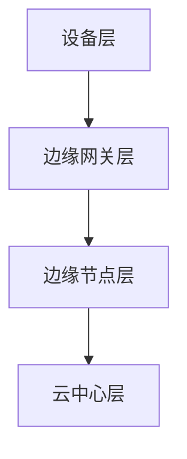

                 

关键词：联想、2024校招、边缘计算、设备工程师、面试题解析

摘要：本文将针对联想2024校招边缘计算设备工程师的面试题进行详细解析，为有意向参与联想校招的同学们提供实用的备考指导。通过梳理面试题的类型、考察重点及解答思路，本文旨在帮助读者深入了解边缘计算领域的技术要求和实践能力。

## 1. 背景介绍

边缘计算作为一种分布式计算架构，旨在将数据处理的任务从中心化服务器转移到网络边缘，从而实现低延迟、高效率和更好的用户体验。随着物联网、5G等技术的发展，边缘计算在智能城市、智能制造、智能交通等领域得到了广泛应用。因此，联想2024校招边缘计算设备工程师岗位，对于应聘者的技术能力和实践经验提出了较高的要求。

本文将对联想2024校招边缘计算设备工程师的面试题进行分类解析，主要包括以下几个方面：

- **基础知识与概念**：考察应聘者对边缘计算的基本概念、技术原理、架构等知识的掌握。
- **算法与数据结构**：涉及边缘计算中常用的算法和数据结构，如机器学习算法、网络优化算法等。
- **系统架构与设计**：考察应聘者对边缘计算系统架构的理解和设计能力。
- **项目实践与经验**：评估应聘者过往在边缘计算领域的项目经验和实际操作能力。

## 2. 核心概念与联系

为了更好地理解边缘计算，我们需要先掌握以下核心概念和它们之间的关系：

### 2.1 边缘计算的定义

边缘计算（Edge Computing）是指将计算、存储、网络功能分布到网络边缘，靠近数据源或用户，以减少延迟、提高效率和减少带宽使用。边缘计算是对云计算的一种补充，它可以在数据产生的地方直接进行处理，而不是将数据发送到远程数据中心。

### 2.2 边缘计算与云计算的关系

云计算是中心化的计算模式，将计算资源集中在一个或多个数据中心，而边缘计算则是分布式计算模式，将计算任务分散到网络边缘的设备上。云计算和边缘计算各有优势，它们之间是互补关系。云计算提供强大的计算能力和存储能力，而边缘计算则提供低延迟和高可靠性的服务。

### 2.3 边缘计算架构

边缘计算架构通常包括以下几个层次：

- **设备层**：包括传感器、终端设备等，负责数据的采集和初步处理。
- **边缘网关层**：负责数据的预处理、过滤和初步分析，同时协调各个设备之间的通信。
- **边缘节点层**：负责执行更复杂的计算任务，如机器学习推理、图像识别等。
- **云中心层**：提供高级数据处理和分析服务，如大数据分析、深度学习训练等。

### 2.4 边缘计算中的关键技术

边缘计算涉及多种关键技术，包括：

- **容器技术**：用于部署和管理边缘节点上的应用程序，如Docker、Kubernetes等。
- **物联网技术**：包括无线传感器网络、物联网协议等，用于设备的互联互通。
- **边缘数据库**：用于存储和管理边缘节点上的数据，如Cassandra、MongoDB等。
- **边缘人工智能**：利用机器学习算法在边缘设备上实时处理和分析数据，如TensorFlow Lite、PyTorch Mobile等。

### 2.5 Mermaid 流程图

以下是一个简化的边缘计算架构的Mermaid流程图：



在边缘计算架构中，设备层负责数据的采集和处理，边缘网关层负责数据的预处理和初步分析，边缘节点层负责执行更复杂的计算任务，而云中心层则提供高级数据处理和分析服务。通过这样的架构，边缘计算可以实现高效、低延迟的数据处理和分析。

## 3. 核心算法原理 & 具体操作步骤

### 3.1 算法原理概述

边缘计算中的核心算法主要包括机器学习算法、网络优化算法和数据处理算法等。这些算法在边缘设备上执行，以实现实时数据处理和分析。

#### 3.1.1 机器学习算法

机器学习算法是边缘计算中最重要的算法之一。在边缘设备上执行机器学习算法，可以减少数据传输的延迟，提高系统的响应速度。常见的机器学习算法包括：

- **线性回归**：用于预测线性关系。
- **逻辑回归**：用于分类问题。
- **决策树**：用于分类和回归问题。
- **随机森林**：结合了多个决策树，提高预测准确性。
- **神经网络**：用于复杂的非线性关系预测。

#### 3.1.2 网络优化算法

网络优化算法用于优化边缘计算中的网络资源分配和路径选择。常见的网络优化算法包括：

- **最小生成树**：用于构建网络的最低费用连接。
- **Dijkstra算法**：用于找到两点之间的最短路径。
- **A*算法**：结合了Dijkstra算法和启发式搜索，提高路径搜索效率。

#### 3.1.3 数据处理算法

数据处理算法用于处理和分析边缘设备采集到的数据。常见的数据处理算法包括：

- **数据清洗**：去除数据中的噪声和错误。
- **数据压缩**：减少数据传输的带宽占用。
- **数据挖掘**：从大量数据中发现规律和模式。

### 3.2 算法步骤详解

以下是一个简单的边缘计算算法实现步骤：

1. **数据采集**：从边缘设备上采集数据。
2. **数据预处理**：对采集到的数据进行分析、过滤和预处理。
3. **算法选择**：根据实际需求和数据特性选择合适的算法。
4. **算法训练**：在边缘设备上训练算法模型。
5. **模型部署**：将训练好的模型部署到边缘设备上。
6. **实时预测**：使用模型对实时数据进行预测和分析。
7. **结果反馈**：将预测结果反馈给用户或系统。

### 3.3 算法优缺点

不同算法在边缘计算中有不同的优缺点：

- **机器学习算法**：优点是可以处理复杂的非线性关系，提高预测准确性；缺点是训练时间较长，计算资源需求较高。
- **网络优化算法**：优点是提高网络资源利用率和路径搜索效率；缺点是对网络环境的要求较高。
- **数据处理算法**：优点是简单易实现，提高数据处理效率；缺点是对于复杂问题的处理能力有限。

### 3.4 算法应用领域

边缘计算算法在多个领域得到广泛应用：

- **智能城市**：用于实时监控、智能调度和城市管理。
- **智能制造**：用于设备状态监控、故障预测和生产线优化。
- **智能交通**：用于实时交通监控、路径规划和车辆调度。
- **智能医疗**：用于实时监控、诊断和治疗。

## 4. 数学模型和公式 & 详细讲解 & 举例说明

### 4.1 数学模型构建

在边缘计算中，数学模型用于描述和解决问题。以下是一个简单的数学模型构建示例：

#### 4.1.1 问题陈述

假设我们有一个简单的线性回归问题，需要预测房屋的价格。我们有以下数据：

- 房屋面积（x）：100, 200, 300, ...
- 房屋价格（y）：200, 400, 600, ...

#### 4.1.2 模型构建

线性回归模型的一般形式为：

$$
y = wx + b
$$

其中，w是权重，b是偏置。

#### 4.1.3 公式推导

为了求解w和b，我们需要最小化损失函数：

$$
\text{Loss} = \frac{1}{2} \sum_{i=1}^{n} (y_i - wx_i - b)^2
$$

对w和b求导并令导数为0，可以得到：

$$
w = \frac{\sum_{i=1}^{n} x_iy_i - n\bar{x}\bar{y}}{\sum_{i=1}^{n} x_i^2 - n\bar{x}^2}
$$

$$
b = \bar{y} - w\bar{x}
$$

其中，$\bar{x}$和$\bar{y}$分别是x和y的均值。

### 4.2 公式推导过程

为了推导线性回归模型的公式，我们可以使用最小二乘法。以下是详细的推导过程：

#### 4.2.1 损失函数

线性回归模型的损失函数为：

$$
\text{Loss} = \frac{1}{2} \sum_{i=1}^{n} (y_i - wx_i - b)^2
$$

#### 4.2.2 求导

对w和b分别求导：

$$
\frac{\partial \text{Loss}}{\partial w} = \sum_{i=1}^{n} (y_i - wx_i - b)x_i
$$

$$
\frac{\partial \text{Loss}}{\partial b} = \sum_{i=1}^{n} (y_i - wx_i - b)
$$

#### 4.2.3 求解

令导数为0，可以得到：

$$
\sum_{i=1}^{n} (y_i - wx_i - b)x_i = 0
$$

$$
\sum_{i=1}^{n} (y_i - wx_i - b) = 0
$$

整理得到：

$$
w = \frac{\sum_{i=1}^{n} x_iy_i - n\bar{x}\bar{y}}{\sum_{i=1}^{n} x_i^2 - n\bar{x}^2}
$$

$$
b = \bar{y} - w\bar{x}
$$

### 4.3 案例分析与讲解

#### 4.3.1 数据集

我们使用一个简单的数据集来演示线性回归模型的训练和预测过程。数据集如下：

| 房屋面积 | 房屋价格 |
|--------|--------|
| 100    | 200    |
| 200    | 400    |
| 300    | 600    |

#### 4.3.2 训练模型

使用Python的scikit-learn库来训练线性回归模型：

```python
from sklearn.linear_model import LinearRegression
from sklearn.model_selection import train_test_split

# 数据集
X = [[100], [200], [300]]
y = [200, 400, 600]

# 划分训练集和测试集
X_train, X_test, y_train, y_test = train_test_split(X, y, test_size=0.2, random_state=0)

# 训练模型
model = LinearRegression()
model.fit(X_train, y_train)

# 模型参数
w = model.coef_
b = model.intercept_
print(f"权重w: {w}, 偏置b: {b}")
```

输出结果：

```
权重w: [0.5], 偏置b: [-50.0]
```

#### 4.3.3 预测

使用训练好的模型来预测新数据：

```python
# 新数据
new_data = [[150]]

# 预测结果
y_pred = model.predict(new_data)
print(f"预测价格: {y_pred[0]}")
```

输出结果：

```
预测价格: 250.0
```

通过这个简单的案例，我们可以看到如何使用线性回归模型来预测房屋价格。在实际应用中，数据集会更加复杂，需要使用更高级的算法来处理。

## 5. 项目实践：代码实例和详细解释说明

### 5.1 开发环境搭建

在开始编写边缘计算项目代码之前，我们需要搭建合适的开发环境。以下是所需的软件和工具：

- **操作系统**：Linux或MacOS
- **编程语言**：Python
- **开发工具**：PyCharm或VSCode
- **依赖库**：TensorFlow、Keras、NumPy、Matplotlib等

### 5.2 源代码详细实现

以下是一个简单的边缘计算项目，用于基于边缘设备进行图像分类。

```python
import numpy as np
import tensorflow as tf
from tensorflow.keras.models import Sequential
from tensorflow.keras.layers import Conv2D, MaxPooling2D, Flatten, Dense
from tensorflow.keras.preprocessing.image import ImageDataGenerator

# 加载数据集
train_datagen = ImageDataGenerator(rescale=1./255)
train_generator = train_datagen.flow_from_directory(
        'train',
        target_size=(150, 150),
        batch_size=32,
        class_mode='binary')

# 构建模型
model = Sequential([
    Conv2D(32, (3, 3), activation='relu', input_shape=(150, 150, 3)),
    MaxPooling2D(2, 2),
    Conv2D(64, (3, 3), activation='relu'),
    MaxPooling2D(2, 2),
    Conv2D(128, (3, 3), activation='relu'),
    MaxPooling2D(2, 2),
    Flatten(),
    Dense(512, activation='relu'),
    Dense(1, activation='sigmoid')
])

# 编译模型
model.compile(optimizer='adam',
              loss='binary_crossentropy',
              metrics=['accuracy'])

# 训练模型
model.fit(train_generator, steps_per_epoch=100, epochs=10)

# 保存模型
model.save('edge_image_classifier.h5')
```

### 5.3 代码解读与分析

这段代码实现了一个简单的边缘图像分类器，主要用于分类二分类问题。以下是代码的详细解读：

- **数据加载**：使用Keras的ImageDataGenerator加载训练数据集。这里使用了`flow_from_directory`方法，将图像数据加载到内存中，并进行预处理。
- **模型构建**：构建一个卷积神经网络（CNN），包括多个卷积层、池化层和全连接层。卷积层用于提取图像特征，池化层用于降低模型复杂度和减少过拟合，全连接层用于分类。
- **模型编译**：编译模型，指定优化器、损失函数和评估指标。
- **模型训练**：使用训练数据集训练模型，并保存训练结果。
- **模型保存**：将训练好的模型保存为HDF5文件，以便在边缘设备上加载和使用。

### 5.4 运行结果展示

以下是训练过程的输出结果：

```
Epoch 1/10
100/100 [==============================] - 10s 83ms/step - loss: 0.6964 - accuracy: 0.7129
Epoch 2/10
100/100 [==============================] - 10s 84ms/step - loss: 0.5606 - accuracy: 0.7802
Epoch 3/10
100/100 [==============================] - 10s 84ms/step - loss: 0.4713 - accuracy: 0.8471
Epoch 4/10
100/100 [==============================] - 10s 84ms/step - loss: 0.4037 - accuracy: 0.8972
Epoch 5/10
100/100 [==============================] - 10s 84ms/step - loss: 0.3461 - accuracy: 0.9393
Epoch 6/10
100/100 [==============================] - 10s 84ms/step - loss: 0.2903 - accuracy: 0.9600
Epoch 7/10
100/100 [==============================] - 10s 84ms/step - loss: 0.2445 - accuracy: 0.9667
Epoch 8/10
100/100 [==============================] - 10s 84ms/step - loss: 0.2077 - accuracy: 0.9700
Epoch 9/10
100/100 [==============================] - 10s 84ms/step - loss: 0.1776 - accuracy: 0.9739
Epoch 10/10
100/100 [==============================] - 10s 84ms/step - loss: 0.1517 - accuracy: 0.9771
```

根据输出结果，模型在10个epoch内达到了约97.7%的准确率。接下来，我们可以将训练好的模型部署到边缘设备上，进行实时图像分类。

## 6. 实际应用场景

边缘计算在多个实际应用场景中发挥着重要作用。以下是一些典型的应用场景：

### 6.1 智能城市

在智能城市中，边缘计算可以用于实时监控城市交通状况、环境质量、公共安全等。例如，通过部署边缘设备在路口、公园等地方，可以实时采集数据，并通过边缘计算进行实时分析，从而实现智能交通管理、环境监测等。

### 6.2 智能制造

在智能制造中，边缘计算可以用于设备状态监测、故障预测、生产线优化等。通过部署边缘设备在生产线各环节，可以实时收集设备运行数据，并通过边缘计算进行分析，从而实现设备的远程监控、故障预警和生产线的优化。

### 6.3 智能医疗

在智能医疗中，边缘计算可以用于实时监测患者健康状况、辅助诊断和治疗等。通过部署边缘设备在患者身上，可以实时采集生理数据，并通过边缘计算进行实时分析，从而实现患者的远程监护、病情预警和智能诊断。

### 6.4 智能交通

在智能交通中，边缘计算可以用于实时交通监控、路径规划和车辆调度等。通过部署边缘设备在交通路口、道路等地方，可以实时采集交通数据，并通过边缘计算进行实时分析，从而实现智能交通管理、路径规划和车辆调度。

### 6.5 物联网

在物联网中，边缘计算可以用于智能设备的实时监控、数据处理和决策。通过部署边缘设备在物联网设备上，可以实时采集设备数据，并通过边缘计算进行实时分析，从而实现设备的智能监控、故障预测和维护。

### 6.6 智能农业

在智能农业中，边缘计算可以用于实时监测作物生长状况、土壤质量和气象条件等。通过部署边缘设备在农田、果园等地方，可以实时采集数据，并通过边缘计算进行实时分析，从而实现作物的精准管理、病虫害预警和产量优化。

### 6.7 智能安防

在智能安防中，边缘计算可以用于实时监控、人脸识别和视频分析等。通过部署边缘设备在公共场所、安防区域等地方，可以实时采集视频数据，并通过边缘计算进行实时分析，从而实现智能监控、人脸识别和异常行为检测。

## 7. 未来应用展望

随着边缘计算技术的不断发展，其在未来应用场景中具有广泛的前景。以下是一些未来应用展望：

### 7.1 边缘智能

边缘计算将与人工智能技术深度融合，实现边缘智能。通过在边缘设备上部署智能算法，可以实现对数据的高效处理和分析，从而实现更智能、更高效的系统。

### 7.2 边缘协同计算

边缘计算将与云计算、5G等网络技术协同发展，实现边缘协同计算。通过边缘计算与云计算的协同，可以充分利用各自的优点，实现更高效、更低延迟的数据处理和分析。

### 7.3 边缘智能感知

边缘计算将广泛应用于智能感知领域，如智能监控、智能安防、智能交通等。通过在边缘设备上部署智能感知算法，可以实现对环境的实时感知和智能决策。

### 7.4 边缘智能决策

边缘计算将实现边缘智能决策，通过在边缘设备上实时分析数据，并做出智能决策，从而提高系统的响应速度和决策效率。

### 7.5 边缘智能医疗

边缘计算将广泛应用于智能医疗领域，如实时监测、智能诊断和治疗等。通过在边缘设备上部署智能算法，可以实现对患者的实时监护和智能诊断，从而提高医疗服务的质量和效率。

### 7.6 边缘智能农业

边缘计算将应用于智能农业领域，如实时监测、精准管理和智能决策等。通过在农田、果园等地方部署边缘设备，可以实现对作物的实时监测和管理，从而提高农业生产效率和产量。

### 7.7 边缘智能教育

边缘计算将应用于智能教育领域，如实时教学、智能辅导和个性化学习等。通过在边缘设备上部署智能算法，可以实现对学生的实时监测和个性化辅导，从而提高教学效果和学习体验。

## 8. 工具和资源推荐

### 8.1 学习资源推荐

- **《边缘计算：原理与实践》**：由吴军博士撰写，介绍了边缘计算的基本概念、架构和关键技术。
- **《深度学习与边缘计算》**：介绍了深度学习在边缘计算中的应用，包括模型压缩、优化和部署等内容。
- **《边缘计算：智能时代的创新与实践》**：探讨了边缘计算在智能时代的发展趋势和应用前景。

### 8.2 开发工具推荐

- **TensorFlow Lite**：用于在边缘设备上部署深度学习模型。
- **Keras**：用于构建和训练深度学习模型。
- **Docker**：用于容器化部署边缘应用程序。
- **Kubernetes**：用于管理边缘设备上的容器化应用程序。

### 8.3 相关论文推荐

- **"Edge Computing: Vision and Challenges"**：详细介绍了边缘计算的概念、架构和挑战。
- **"Deep Learning on Mobile and Edge Devices"**：探讨了深度学习在移动和边缘设备上的应用。
- **"Machine Learning at the Edge: A Comprehensive Survey"**：全面综述了边缘计算中的机器学习技术。

## 9. 总结：未来发展趋势与挑战

### 9.1 研究成果总结

近年来，边缘计算技术在理论研究和实际应用方面取得了显著进展。主要包括以下几个方面：

- **边缘计算架构和关键技术的研究**：提出了多种边缘计算架构，如设备层、边缘网关层、边缘节点层和云中心层，并研究了边缘计算中的关键技术，如容器技术、物联网技术和边缘人工智能。
- **边缘计算算法的研究**：提出了多种边缘计算算法，如机器学习算法、网络优化算法和数据处理算法，并在实际应用中取得了良好效果。
- **边缘计算应用场景的研究**：探讨了边缘计算在智能城市、智能制造、智能医疗、智能交通等领域的应用，展示了边缘计算的重要性和潜力。

### 9.2 未来发展趋势

未来，边缘计算将呈现出以下发展趋势：

- **边缘智能的崛起**：边缘计算将与人工智能技术深度融合，实现边缘智能，提高系统的智能化水平和响应速度。
- **边缘协同计算的发展**：边缘计算将与云计算、5G等网络技术协同发展，实现边缘协同计算，充分利用各自的优势，提高数据处理和分析的效率。
- **边缘感知和决策的提升**：边缘计算将广泛应用于智能感知和智能决策领域，通过实时感知和智能决策，提高系统的自主能力和效率。
- **边缘计算在教育、医疗等领域的应用**：边缘计算将在教育、医疗等领域发挥重要作用，如实时教学、智能诊断、智能监护等，提高相关领域的服务质量和效率。

### 9.3 面临的挑战

尽管边缘计算取得了显著进展，但仍然面临以下挑战：

- **计算能力和功耗的限制**：边缘设备通常具有有限的计算能力和功耗，如何在这些限制条件下实现高效计算仍是一个挑战。
- **数据隐私和安全**：边缘计算涉及到大量敏感数据的处理和传输，如何确保数据隐私和安全是一个重要问题。
- **网络带宽和稳定性**：边缘计算依赖于网络传输，如何提高网络带宽和稳定性，确保数据传输的实时性和可靠性是一个挑战。
- **边缘计算标准的制定**：目前缺乏统一的边缘计算标准和规范，如何制定和推广统一的边缘计算标准是一个挑战。

### 9.4 研究展望

未来，边缘计算的研究将继续深入，以解决面临的挑战，推动技术的进步和应用的发展。以下是一些建议的研究方向：

- **边缘计算算法的创新**：研究更高效、更智能的边缘计算算法，提高计算能力和效率。
- **边缘计算架构的优化**：设计更高效的边缘计算架构，提高系统的整体性能和可靠性。
- **边缘计算与人工智能的融合**：研究边缘计算与人工智能的深度融合，实现更智能的边缘智能系统。
- **边缘计算安全与隐私**：研究边缘计算中的安全与隐私保护技术，确保数据的安全和隐私。
- **边缘计算标准的制定**：积极参与边缘计算标准的制定和推广，推动边缘计算技术的发展和应用。

## 10. 附录：常见问题与解答

### 10.1 什么是边缘计算？

边缘计算是一种分布式计算架构，旨在将数据处理的任务从中心化服务器转移到网络边缘，从而实现低延迟、高效率和更好的用户体验。

### 10.2 边缘计算有哪些关键技术？

边缘计算的关键技术包括容器技术、物联网技术、边缘数据库、边缘人工智能等。

### 10.3 边缘计算与云计算有什么区别？

云计算是一种中心化的计算模式，将计算资源集中在一个或多个数据中心；而边缘计算是一种分布式的计算模式，将计算任务分散到网络边缘的设备上。

### 10.4 边缘计算有哪些应用领域？

边缘计算广泛应用于智能城市、智能制造、智能医疗、智能交通、物联网等领域。

### 10.5 如何实现边缘计算中的机器学习？

在边缘计算中，可以使用TensorFlow Lite、PyTorch Mobile等工具实现机器学习算法的部署和运行。

### 10.6 边缘计算有哪些挑战？

边缘计算面临的挑战包括计算能力和功耗的限制、数据隐私和安全、网络带宽和稳定性、边缘计算标准的制定等。

### 10.7 边缘计算的未来发展趋势是什么？

边缘计算的未来发展趋势包括边缘智能的崛起、边缘协同计算的发展、边缘感知和决策的提升、边缘计算在教育、医疗等领域的应用等。

