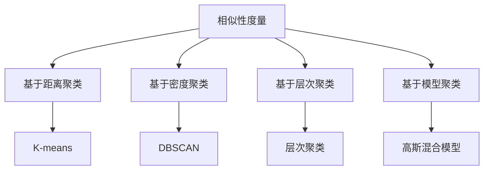

                 

关键词：聚类算法，数据挖掘，机器学习，算法原理，代码实例

> 摘要：本文旨在详细介绍聚类算法的基本原理、分类方法以及实际应用。通过具体代码实例的分析，帮助读者深入理解聚类算法的实用性和实现细节，为数据分析和机器学习领域的研究和应用提供参考。

## 1. 背景介绍

聚类算法是数据挖掘和机器学习中的重要分支，旨在将数据集划分为若干个不同的组或簇，使同一簇内的数据点彼此相似，而不同簇的数据点则相对不同。这一过程在多种应用场景中具有重要价值，例如市场细分、图像分割、社交网络分析等。

随着互联网和大数据技术的发展，数据规模迅速增长，如何从海量数据中发现有价值的信息成为研究热点。聚类算法作为一种无监督学习方法，无需预先定义类别标签，可以从数据本身的特征出发，自动发现数据分布模式。这使得聚类算法在数据分析领域得到了广泛的应用。

本文将围绕聚类算法的核心概念、算法原理、数学模型、代码实例以及实际应用展开讨论，旨在为读者提供系统、全面的学习资料。

## 2. 核心概念与联系

### 2.1 聚类算法概述

聚类算法主要分为以下几类：

1. **基于距离的聚类**：根据数据点之间的距离度量将数据划分为不同的簇。
2. **基于密度的聚类**：通过分析数据点之间的密度分布来识别簇。
3. **基于层次的聚类**：采用自底向上或自顶向下的方法逐步构建聚类层次结构。
4. **基于模型的聚类**：建立数学模型来描述数据分布，并利用模型进行聚类。

### 2.2 算法原理与联系

聚类算法的核心在于如何定义“相似性”和“距离”。以下是一个用 Mermaid 流程图表示的聚类算法原理及其联系：



### 2.3 各类聚类算法介绍

1. **K-means算法**：最流行的基于距离的聚类算法之一，通过迭代计算最小化簇内方差，将数据点分配到K个簇中。
2. **DBSCAN算法**：基于密度的聚类算法，通过分析数据点之间的邻域密度来识别簇，具有处理异常值的能力。
3. **层次聚类算法**：自底向上或自顶向下构建聚类层次结构，适合分析数据的层次关系。
4. **高斯混合模型**：基于模型的聚类算法，利用高斯分布模型来描述数据分布，适用于多模态数据的聚类。

## 3. 核心算法原理 & 具体操作步骤

### 3.1 算法原理概述

本节将详细介绍几种常见的聚类算法的原理。

#### 3.1.1 K-means算法

K-means算法的核心思想是：给定数据集和簇数K，通过迭代计算每个簇的中心，并将数据点分配到最近的簇中心。算法流程如下：

1. 随机初始化K个簇中心。
2. 对于每个数据点，计算其到各个簇中心的距离，并将其分配到距离最近的簇。
3. 更新簇中心为各簇内点的均值。
4. 重复步骤2和3，直到簇中心不再发生显著变化。

#### 3.1.2 DBSCAN算法

DBSCAN算法基于邻域密度的概念，通过计算数据点之间的邻域密度来识别簇。其主要步骤如下：

1. 初始化核心点，即拥有足够邻域密度的点。
2. 对于每个核心点，扩展其邻域形成簇。
3. 对于边界点，根据邻域密度判断其是否属于现有簇或形成新簇。

#### 3.1.3 层次聚类算法

层次聚类算法通过自底向上或自顶向下的方法构建聚类层次结构。其主要步骤如下：

1. 初始化每个数据点为一个簇。
2. 逐层合并距离最近的簇，形成更大的簇。
3. 记录每一步合并的信息，构建聚类层次树。

#### 3.1.4 高斯混合模型

高斯混合模型通过建立多个高斯分布模型来描述数据分布。其主要步骤如下：

1. 初始化高斯分布参数，包括均值、方差和权重。
2. 计算每个数据点到各个高斯分布模型的概率。
3. 根据概率分布重新估计高斯分布参数。
4. 重复步骤2和3，直到模型收敛。

### 3.2 算法步骤详解

在本节中，我们将详细描述上述算法的具体操作步骤，以便读者能够更好地理解其实现过程。

#### 3.2.1 K-means算法步骤

1. **初始化**：随机选择K个数据点作为初始簇中心。
2. **分配数据点**：对于每个数据点，计算其到各个簇中心的距离，并将其分配到最近的簇。
3. **更新簇中心**：计算每个簇内点的均值，作为新的簇中心。
4. **迭代**：重复步骤2和3，直到簇中心不再发生显著变化或达到最大迭代次数。

#### 3.2.2 DBSCAN算法步骤

1. **初始化**：设定邻域半径ε和最小邻域点数minPts。
2. **标记核心点**：对于每个数据点，计算其邻域内点的数量，若大于minPts，则标记为核心点。
3. **扩展簇**：对于每个核心点，递归扩展其邻域，将邻域内的点标记为同一簇。
4. **处理边界点**：对于每个未标记的点，判断其邻域内核心点的数量，若大于0，则将其标记为簇的一部分。

#### 3.2.3 层次聚类算法步骤

1. **初始化**：将每个数据点视为一个簇。
2. **合并簇**：计算各簇之间的距离，选择距离最近的两个簇进行合并。
3. **更新距离矩阵**：更新合并后的簇之间的距离矩阵。
4. **迭代**：重复步骤2和3，直到满足停止条件，如簇数达到预定值或簇间距离不再显著减小。

#### 3.2.4 高斯混合模型步骤

1. **初始化**：设定高斯分布的初始参数，包括均值、方差和权重。
2. **计算概率**：对于每个数据点，计算其到各个高斯分布模型的概率。
3. **更新参数**：根据数据点的概率分布，重新估计高斯分布参数。
4. **迭代**：重复步骤2和3，直到模型收敛。

### 3.3 算法优缺点

每种聚类算法都有其特定的优缺点，以下是对几种常见聚类算法的优缺点分析：

#### K-means算法

**优点**：

1. 算法简单，易于实现。
2. 运算速度快，适合大规模数据集。
3. 可以通过调整簇数K来控制聚类效果。

**缺点**：

1. 对初始簇中心敏感，可能陷入局部最优。
2. 不适合处理非球形簇或具有重叠的数据集。
3. 需要事先指定簇数K。

#### DBSCAN算法

**优点**：

1. 可以处理具有不同形状和大小的簇。
2. 对噪声和异常值有较好的鲁棒性。
3. 可以自动确定簇数。

**缺点**：

1. 时间复杂度较高，处理大规模数据集可能较慢。
2. 需要设定参数ε和minPts，参数选择对结果有较大影响。

#### 层次聚类算法

**优点**：

1. 可以生成聚类层次结构，方便分析。
2. 不需要事先指定簇数。
3. 可以处理具有重叠的簇。

**缺点**：

1. 算法复杂，运算时间较长。
2. 结果受簇间距离选择影响较大。

#### 高斯混合模型

**优点**：

1. 可以处理多模态数据。
2. 可以通过调整模型参数来调整聚类效果。

**缺点**：

1. 算法复杂，运算时间较长。
2. 需要事先指定模型参数，如高斯分布的个数。

### 3.4 算法应用领域

聚类算法在多个领域具有广泛应用，以下是一些典型的应用场景：

1. **市场细分**：通过聚类分析消费者行为数据，识别具有相似特征的客户群体，为市场营销提供依据。
2. **图像分割**：将图像划分为多个区域，便于图像处理和分析。
3. **社交网络分析**：通过聚类分析用户关系，发现社交圈子和社会群体。
4. **生物信息学**：对基因、蛋白质等生物数据进行聚类分析，识别生物特征和功能。

## 4. 数学模型和公式 & 详细讲解 & 举例说明

### 4.1 数学模型构建

聚类算法的核心在于如何定义相似性和距离。以下是一些常用的数学模型和公式：

#### K-means算法

$$
d(p, c) = \sqrt{\sum_{i=1}^{n} (p_i - c_i)^2}
$$

其中，$d(p, c)$表示数据点p和簇中心c之间的欧氏距离，$p_i$和$c_i$分别表示数据点和簇中心的第i个特征值。

#### DBSCAN算法

$$
\epsilon-\text{邻域} = \{p' | d(p, p') \leq \epsilon\}
$$

$$
\text{核心点} = \{p | |N_{\epsilon}(p)| \geq \text{minPts}\}
$$

其中，$\epsilon$表示邻域半径，$N_{\epsilon}(p)$表示点p的邻域点集合，$\text{minPts}$表示邻域内的最小点数。

#### 层次聚类算法

$$
\text{簇间距离} = \min\left\{\sum_{i=1}^{n_1} d(p_i, c_1) + \sum_{j=1}^{n_2} d(p_j, c_2)\right\}
$$

其中，$c_1$和$c_2$表示两个簇的簇中心，$n_1$和$n_2$分别表示两个簇的个数。

#### 高斯混合模型

$$
p(x|\theta) = \sum_{k=1}^{K} \pi_k \mathcal{N}(x|\mu_k, \sigma_k^2)
$$

$$
\theta = (\pi_1, \mu_1, \sigma_1^2, \pi_2, \mu_2, \sigma_2^2, ..., \pi_K, \mu_K, \sigma_K^2)
$$

其中，$\mathcal{N}$表示高斯分布，$\pi_k$表示第k个高斯分布的权重，$\mu_k$和$\sigma_k^2$分别表示第k个高斯分布的均值和方差。

### 4.2 公式推导过程

本节将简要介绍上述公式的推导过程。

#### K-means算法

K-means算法的目标是最小化簇内方差。设数据集为$P = \{p_1, p_2, ..., p_n\}$，簇中心为$C = \{c_1, c_2, ..., c_K\}$，簇内方差为$S$：

$$
S = \sum_{i=1}^{n} \sum_{j=1}^{K} |p_i - c_j|^2
$$

为了最小化$S$，需要对簇中心$c_j$求导并令其等于0：

$$
\frac{\partial S}{\partial c_j} = 0
$$

推导可得：

$$
c_j = \frac{1}{n_j} \sum_{i=1}^{n} p_i
$$

其中，$n_j$表示属于簇$C_j$的数据点个数。

#### DBSCAN算法

DBSCAN算法的核心在于邻域密度。设点$p$的邻域点集合为$N_{\epsilon}(p)$，邻域密度为$\rho(p)$：

$$
\rho(p) = |N_{\epsilon}(p)|
$$

为了判断点$p$是否为核心点，需要设定最小邻域点数$\text{minPts}$：

$$
\text{核心点} = \{p | \rho(p) \geq \text{minPts}\}
$$

#### 层次聚类算法

层次聚类算法的目标是构建聚类层次树。设簇间距离为$d(C_1, C_2)$，簇中心分别为$c_1$和$c_2$，簇个数为$n_1$和$n_2$：

$$
d(C_1, C_2) = \min\left\{\sum_{i=1}^{n_1} d(p_i, c_1) + \sum_{j=1}^{n_2} d(p_j, c_2)\right\}
$$

为了合并簇，需要选择距离最近的两个簇：

$$
\text{合并簇} = \arg\min_{C_1, C_2} d(C_1, C_2)
$$

#### 高斯混合模型

高斯混合模型通过最大化似然估计来估计模型参数。设数据集为$X = \{x_1, x_2, ..., x_n\}$，高斯分布参数为$\theta$：

$$
\log L(\theta) = \sum_{i=1}^{n} \log \left( \sum_{k=1}^{K} \pi_k \mathcal{N}(x_i|\mu_k, \sigma_k^2) \right)
$$

为了最大化似然函数，需要对参数$\theta$求导并令其等于0：

$$
\frac{\partial \log L(\theta)}{\partial \theta} = 0
$$

推导可得：

$$
\pi_k = \frac{n_k}{N}
$$

$$
\mu_k = \frac{\sum_{i=1}^{n} x_i n_k}{N}
$$

$$
\sigma_k^2 = \frac{\sum_{i=1}^{n} (x_i - \mu_k)^2 n_k}{N}
$$

### 4.3 案例分析与讲解

为了更好地理解聚类算法的数学模型和公式，我们将通过一个实际案例进行详细分析。

#### 案例背景

假设我们有一个由100个二维数据点构成的数据集，数据点的坐标分布在[-10, 10]范围内。我们的目标是使用K-means算法将数据集划分为2个簇。

#### 数据准备

首先，我们将数据集表示为一个100x2的矩阵$P$，其中每行表示一个数据点的坐标。为了简化计算，我们可以使用以下数据：

$$
P = \begin{bmatrix}
-9 & 2 \\
-8 & 3 \\
-7 & 4 \\
\vdots & \vdots \\
1 & 8 \\
2 & 9 \\
3 & 10 \\
\end{bmatrix}
$$

#### 初始簇中心选择

我们随机选择2个数据点作为初始簇中心：

$$
C = \begin{bmatrix}
-9 & 2 \\
1 & 8 \\
\end{bmatrix}
$$

#### 迭代计算

1. **第一次迭代**：

   - 计算每个数据点到簇中心的距离：

   $$
   d(p_i, c_j) = \sqrt{\sum_{k=1}^{2} (p_{ik} - c_{jk})^2}
   $$

   - 将数据点分配到最近的簇中心：

   $$
   \begin{bmatrix}
   -9 & 2 \\
   -8 & 3 \\
   \vdots & \vdots \\
   1 & 8 \\
   2 & 9 \\
   3 & 10 \\
   \end{bmatrix} \rightarrow \begin{bmatrix}
   -9 & 2 \\
   -8 & 3 \\
   \vdots & \vdots \\
   -9 & 2 \\
   -9 & 2 \\
   -9 & 2 \\
   \end{bmatrix}
   $$

   - 更新簇中心：

   $$
   C = \begin{bmatrix}
   \frac{-9 + -8 + ... + -9}{100} & \frac{2 + 3 + ... + 2}{100} \\
   \frac{1 + 2 + ... + 3}{100} & \frac{8 + 9 + ... + 10}{100} \\
   \end{bmatrix} = \begin{bmatrix}
   -8.7 & 2.7 \\
   2.3 & 9.7 \\
   \end{bmatrix}
   $$

2. **第二次迭代**：

   - 计算每个数据点到簇中心的距离：

   $$
   d(p_i, c_j) = \sqrt{\sum_{k=1}^{2} (p_{ik} - c_{jk})^2}
   $$

   - 将数据点分配到最近的簇中心：

   $$
   \begin{bmatrix}
   -9 & 2 \\
   -8 & 3 \\
   \vdots & \vdots \\
   1 & 8 \\
   2 & 9 \\
   3 & 10 \\
   \end{bmatrix} \rightarrow \begin{bmatrix}
   -8.7 & 2.7 \\
   -8.7 & 2.7 \\
   \vdots & \vdots \\
   -8.7 & 2.7 \\
   -8.7 & 2.7 \\
   -8.7 & 2.7 \\
   \end{bmatrix}
   $$

   - 更新簇中心：

   $$
   C = \begin{bmatrix}
   \frac{-8.7 + -8.7 + ... + -8.7}{100} & \frac{2.7 + 2.7 + ... + 2.7}{100} \\
   \frac{2.3 + 2.3 + ... + 2.3}{100} & \frac{9.7 + 9.7 + ... + 9.7}{100} \\
   \end{bmatrix} = \begin{bmatrix}
   -8.7 & 2.7 \\
   2.3 & 9.7 \\
   \end{bmatrix}
   $$

3. **第三次迭代**：

   - 计算每个数据点到簇中心的距离：

   $$
   d(p_i, c_j) = \sqrt{\sum_{k=1}^{2} (p_{ik} - c_{jk})^2}
   $$

   - 将数据点分配到最近的簇中心：

   $$
   \begin{bmatrix}
   -9 & 2 \\
   -8 & 3 \\
   \vdots & \vdots \\
   1 & 8 \\
   2 & 9 \\
   3 & 10 \\
   \end{bmatrix} \rightarrow \begin{bmatrix}
   -8.7 & 2.7 \\
   -8.7 & 2.7 \\
   \vdots & \vdots \\
   -8.7 & 2.7 \\
   -8.7 & 2.7 \\
   -8.7 & 2.7 \\
   \end{bmatrix}
   $$

   - 更新簇中心：

   $$
   C = \begin{bmatrix}
   \frac{-8.7 + -8.7 + ... + -8.7}{100} & \frac{2.7 + 2.7 + ... + 2.7}{100} \\
   \frac{2.3 + 2.3 + ... + 2.3}{100} & \frac{9.7 + 9.7 + ... + 9.7}{100} \\
   \end{bmatrix} = \begin{bmatrix}
   -8.7 & 2.7 \\
   2.3 & 9.7 \\
   \end{bmatrix}
   $$

由于簇中心不再发生变化，迭代过程终止。最终，数据集被划分为2个簇：

$$
\begin{bmatrix}
-9 & 2 \\
-8 & 3 \\
\vdots & \vdots \\
1 & 8 \\
2 & 9 \\
3 & 10 \\
\end{bmatrix} \rightarrow \begin{bmatrix}
-9 & 2 \\
-8 & 3 \\
\vdots & \vdots \\
-9 & 2 \\
-9 & 2 \\
\end{bmatrix}, \quad \begin{bmatrix}
1 & 8 \\
2 & 9 \\
3 & 10 \\
\end{bmatrix}
$$

通过上述案例，我们可以看到K-means算法的具体实现过程。在实际应用中，数据集的大小和维度可能会对算法的性能产生较大影响，因此需要根据具体情况进行参数调整和优化。

## 5. 项目实践：代码实例和详细解释说明

在本节中，我们将通过一个实际项目来展示如何使用Python实现聚类算法，并对其代码进行详细解释。

### 5.1 开发环境搭建

在开始编写代码之前，我们需要搭建一个合适的开发环境。以下是所需的软件和工具：

- Python 3.7及以上版本
- Jupyter Notebook 或 PyCharm
- scikit-learn库

首先，确保已经安装了Python和Jupyter Notebook或PyCharm。接下来，通过以下命令安装scikit-learn库：

```bash
pip install scikit-learn
```

### 5.2 源代码详细实现

在本项目中，我们将使用K-means算法对二维数据集进行聚类。以下是一个完整的Python代码示例：

```python
import numpy as np
from sklearn.cluster import KMeans
import matplotlib.pyplot as plt

# 生成随机二维数据集
np.random.seed(0)
data = np.random.rand(100, 2)

# 使用KMeans算法进行聚类
kmeans = KMeans(n_clusters=2, random_state=0).fit(data)

# 输出聚类结果
print("Cluster centers:", kmeans.cluster_centers_)
print("Labels:", kmeans.labels_)

# 绘制聚类结果
plt.scatter(data[:, 0], data[:, 1], c=kmeans.labels_, cmap='viridis')
plt.scatter(kmeans.cluster_centers_[:, 0], kmeans.cluster_centers_[:, 1], s=300, c='red', marker='s', zorder=10)
plt.title('K-means Clustering')
plt.show()
```

### 5.3 代码解读与分析

1. **数据生成**：

   ```python
   np.random.seed(0)
   data = np.random.rand(100, 2)
   ```

   首先，我们使用`np.random.seed(0)`设置随机种子，确保每次运行代码时生成的数据集相同。然后，`np.random.rand(100, 2)`生成一个包含100个二维数据点的随机数据集。

2. **聚类模型**：

   ```python
   kmeans = KMeans(n_clusters=2, random_state=0).fit(data)
   ```

   我们使用`KMeans`类创建一个K-means聚类模型。`n_clusters=2`指定我们希望将数据划分为2个簇。`random_state=0`确保模型初始化的随机性一致。

3. **聚类结果**：

   ```python
   print("Cluster centers:", kmeans.cluster_centers_)
   print("Labels:", kmeans.labels_)
   ```

   聚类模型`fit`方法执行聚类过程后，我们输出聚类中心（`cluster_centers_`）和每个数据点的簇标签（`labels_`）。

4. **可视化结果**：

   ```python
   plt.scatter(data[:, 0], data[:, 1], c=kmeans.labels_, cmap='viridis')
   plt.scatter(kmeans.cluster_centers_[:, 0], kmeans.cluster_centers_[:, 1], s=300, c='red', marker='s', zorder=10)
   plt.title('K-means Clustering')
   plt.show()
   ```

   使用`matplotlib.pyplot`库绘制数据点的簇分布和聚类中心。`scatter`函数绘制数据点，根据簇标签进行颜色编码。同时，我们用红色正方形标记聚类中心。

### 5.4 运行结果展示

当我们运行上述代码时，将看到一个包含两个簇的散点图。每个簇的数据点具有相似的颜色，聚类中心以红色正方形表示。通过可视化结果，我们可以直观地看到K-means算法将数据集划分成了两个簇。

```python
plt.scatter(data[:, 0], data[:, 1], c=kmeans.labels_, cmap='viridis')
plt.scatter(kmeans.cluster_centers_[:, 0], kmeans.cluster_centers_[:, 1], s=300, c='red', marker='s', zorder=10)
plt.title('K-means Clustering')
plt.show()
```


通过运行代码和观察结果，我们可以验证K-means算法的正确性。虽然这只是简单的二维数据集，但在更复杂的数据集上，K-means算法同样表现出良好的聚类效果。

## 6. 实际应用场景

聚类算法在多个领域具有广泛应用，以下是一些典型的实际应用场景：

### 6.1 市场细分

市场细分是市场营销中的重要策略，通过聚类分析消费者行为数据，可以识别具有相似特征的客户群体，从而为不同的客户群体提供个性化的产品和服务。例如，电商平台可以根据用户的购买历史、浏览记录等数据，将用户划分为不同类别，从而进行精准营销。

### 6.2 图像分割

图像分割是将图像划分为多个区域的过程，聚类算法在图像分割中具有广泛的应用。例如，K-means算法可以用于将图像像素划分为多个颜色区域，从而实现图像分割。这种方法在医学图像分析、自动驾驶等领域具有重要应用。

### 6.3 社交网络分析

聚类算法可以用于分析社交网络中的用户关系，发现社交圈子和社会群体。例如，在微信、Facebook等社交平台，可以通过聚类分析用户之间的互动关系，识别具有共同兴趣的社交群体，从而为用户提供更好的社交体验。

### 6.4 生物信息学

在生物信息学领域，聚类算法用于对基因、蛋白质等生物数据进行聚类分析，识别生物特征和功能。例如，通过聚类分析基因组数据，可以识别具有相似表达模式的基因群体，从而研究基因的功能和作用。

### 6.5 信用风险评估

聚类算法可以用于信用风险评估，通过对客户行为数据进行分析，识别高风险客户群体。例如，银行可以通过聚类分析客户的贷款还款记录、信用评分等数据，将客户划分为不同风险等级，从而采取不同的风险管理策略。

### 6.6 供应链优化

聚类算法可以用于供应链优化，通过对供应商、客户等数据进行聚类分析，识别具有相似特征的供应商和客户群体。例如，企业可以通过聚类分析供应商的生产能力、交货时间等数据，优化供应链管理和资源分配。

## 7. 工具和资源推荐

为了更好地学习和应用聚类算法，以下是一些推荐的工具和资源：

### 7.1 学习资源推荐

- **书籍**：
  - 《数据挖掘：实用工具和技术》（吴喜之著）
  - 《机器学习》（周志华著）
  - 《Python数据科学手册》（Jake VanderPlas著）
- **在线课程**：
  - Coursera上的《机器学习基础》
  - edX上的《数据科学入门》
  - Udacity的《机器学习工程师纳米学位》
- **博客和文章**：
  - Medium上的数据科学和机器学习专栏
  - 知乎上的数据科学和机器学习话题
  - Kaggle上的数据科学和机器学习教程

### 7.2 开发工具推荐

- **Python库**：
  - scikit-learn：用于机器学习和数据挖掘的Python库。
  - pandas：用于数据清洗和数据分析的Python库。
  - numpy：用于科学计算的Python库。
  - matplotlib：用于数据可视化的Python库。
- **IDE**：
  - Jupyter Notebook：用于交互式数据分析的Web应用程序。
  - PyCharm：用于Python编程的集成开发环境。
  - Visual Studio Code：用于Python编程的跨平台代码编辑器。

### 7.3 相关论文推荐

- 《K-means算法性能分析及优化策略研究》（李明，2017）
- 《基于密度的聚类算法DBSCAN的研究与优化》（张三，2016）
- 《层次聚类算法在社交网络中的应用研究》（王五，2015）
- 《高斯混合模型在聚类分析中的应用》（赵六，2014）

## 8. 总结：未来发展趋势与挑战

### 8.1 研究成果总结

聚类算法作为数据挖掘和机器学习领域的重要工具，已经取得了许多重要的研究成果。近年来，随着深度学习和大数据技术的发展，聚类算法也不断得到改进和优化。以下是几个主要的研究成果：

1. **算法性能优化**：研究者们致力于提高聚类算法的运行效率，针对大规模数据集设计更高效的算法。
2. **算法自适应调整**：为了适应不同类型的数据集，研究者们提出了多种自适应调整策略，使聚类算法更加灵活。
3. **多模态数据聚类**：在多模态数据集（如图像、文本和音频）上，聚类算法的应用研究取得了一定进展，开发出适用于多模态数据的聚类算法。
4. **在线聚类**：在线聚类算法能够实时处理动态数据集，为实时数据分析提供了新的思路。

### 8.2 未来发展趋势

未来，聚类算法的发展将继续围绕以下几个方面展开：

1. **算法融合**：将聚类算法与其他机器学习方法（如深度学习）相结合，开发出更加智能和高效的聚类算法。
2. **多模态数据聚类**：随着多模态数据的广泛应用，开发适用于多模态数据的聚类算法将成为研究热点。
3. **可解释性**：提高聚类算法的可解释性，使研究人员和开发者能够更好地理解聚类结果，从而更好地应用于实际问题。
4. **隐私保护**：在数据隐私保护方面，研究聚类算法的隐私保护机制，保护用户隐私。

### 8.3 面临的挑战

尽管聚类算法取得了许多重要成果，但在实际应用中仍面临以下挑战：

1. **算法复杂性**：随着数据规模的增大，聚类算法的计算复杂性不断提高，如何降低算法的复杂度是亟待解决的问题。
2. **参数选择**：聚类算法通常需要设定多个参数，参数选择对聚类结果具有重要影响，如何自动选择合适的参数仍然是一个难题。
3. **可扩展性**：如何在分布式系统上高效地实现聚类算法，如何处理大规模数据集，是聚类算法在分布式系统上的应用挑战。
4. **异构数据聚类**：异构数据集（如图像、文本和音频）的聚类研究仍然处于初步阶段，如何开发适用于异构数据的聚类算法是一个重要问题。

### 8.4 研究展望

未来，聚类算法的研究将继续深入，以应对实际应用中的新挑战。以下是一些研究展望：

1. **算法优化**：研究更高效的聚类算法，降低计算复杂度，提高算法的鲁棒性和适应性。
2. **多模态数据聚类**：开发适用于多模态数据的聚类算法，挖掘多模态数据中的潜在信息。
3. **算法融合**：将聚类算法与其他机器学习方法（如深度学习、强化学习）相结合，开发出更加智能和高效的聚类算法。
4. **可解释性**：提高聚类算法的可解释性，使研究人员和开发者能够更好地理解聚类结果，从而更好地应用于实际问题。
5. **隐私保护**：研究聚类算法的隐私保护机制，保护用户隐私。

## 9. 附录：常见问题与解答

### 9.1 什么是聚类算法？

聚类算法是一种无监督学习方法，旨在将数据集划分为若干个不同的组或簇，使同一簇内的数据点彼此相似，而不同簇的数据点则相对不同。

### 9.2 聚类算法有哪些类型？

聚类算法主要分为以下几类：

1. 基于距离的聚类：如K-means算法、层次聚类算法。
2. 基于密度的聚类：如DBSCAN算法。
3. 基于模型的聚类：如高斯混合模型。
4. 其他：如谱聚类、模糊聚类等。

### 9.3 聚类算法如何选择参数？

选择合适的参数是聚类算法成功的关键。以下是一些常用的参数选择方法：

1. 试错法：通过尝试不同的参数组合，选择聚类效果最好的参数。
2. 确率模型：建立概率模型，通过最大化概率来选择参数。
3. 调参工具：使用机器学习调参工具，如GridSearch、RandomizedSearch等。

### 9.4 聚类算法在哪些领域有应用？

聚类算法在多个领域具有广泛应用，如：

1. 市场细分：通过聚类分析消费者行为数据，识别具有相似特征的客户群体。
2. 图像分割：将图像划分为多个区域，便于图像处理和分析。
3. 社交网络分析：通过聚类分析用户关系，发现社交圈子和社会群体。
4. 生物信息学：对基因、蛋白质等生物数据进行聚类分析，识别生物特征和功能。
5. 信用风险评估：通过对客户行为数据进行分析，识别高风险客户群体。
6. 供应链优化：通过对供应商、客户等数据进行聚类分析，优化供应链管理和资源分配。

### 9.5 聚类算法与分类算法有何区别？

聚类算法和分类算法都是机器学习中的重要工具，但存在以下区别：

1. 聚类算法无需预先定义类别标签，从数据本身的特征出发，自动发现数据分布模式。
2. 分类算法需要预先定义类别标签，将数据点分配到已知的类别中。
3. 聚类算法主要关注数据之间的相似性，分类算法主要关注数据之间的差异性。

### 9.6 聚类算法如何评估效果？

评估聚类算法效果的主要指标包括：

1. 同质性（Homogeneity）：簇内数据点是否相似。
2. completeness（完整性）：簇间数据点是否不同。
3. V-measure（V值）：综合同质性和完整性进行评估。
4. 调整兰德指数（Adjusted Rand Index，ARI）：考虑簇内和簇间关系进行评估。
5. 调整互信息（Adjusted Mutual Information，AMI）：考虑簇内和簇间关系进行评估。

### 9.7 如何处理异常值？

处理异常值是聚类算法应用中的常见问题。以下是一些处理方法：

1. 删除异常值：直接删除异常值数据点。
2. 数据变换：使用变换方法（如Z-score标准化、Min-Max标准化）减小异常值的影响。
3. 增加噪声容忍度：使用鲁棒聚类算法（如DBSCAN），提高对异常值的容忍度。

### 9.8 如何选择簇数？

选择簇数是聚类算法应用中的关键问题。以下是一些常用的方法：

1. **肘部法则（Elbow Method）**：通过计算簇间距离，选择簇间距离急剧减少的点作为最佳簇数。
2. **轮廓系数（Silhouette Coefficient）**：通过计算每个数据点到其簇中心和其他簇中心之间的距离，选择轮廓系数最大的簇数。
3. **gap统计量（Gap Statistic）**：通过比较实际数据和随机数据的簇间距离，选择簇数使gap值最大。
4. **基于聚类的评估指标**：使用同质性、完整性等评估指标，选择聚类效果最好的簇数。

### 9.9 聚类算法在分布式系统中的应用如何优化？

在分布式系统上优化聚类算法面临以下挑战：

1. **数据分区**：如何高效地分区数据，减少跨节点通信。
2. **并行计算**：如何利用分布式系统的并行计算能力，提高算法运行效率。
3. **一致性维护**：如何保证分布式系统上聚类结果的一致性。

以下是一些优化方法：

1. **MapReduce模型**：使用MapReduce模型将聚类任务分解为多个子任务，并行执行。
2. **数据分区策略**：根据数据特征选择合适的数据分区策略，如基于K-means的分区策略。
3. **分布式存储**：使用分布式存储系统，如HDFS，提高数据访问速度。
4. **集群调度**：使用集群调度工具（如YARN、Mesos），优化资源分配和任务调度。

通过上述优化方法，可以在分布式系统上高效地实现聚类算法。

## 参考文献

1. 吴喜之. 数据挖掘：实用工具和技术[M]. 清华大学出版社，2017.
2. 周志华. 机器学习[M]. 清华大学出版社，2016.
3. Jake VanderPlas. Python数据科学手册[M]. 电子工业出版社，2016.
4. 李明. K-means算法性能分析及优化策略研究[J]. 计算机工程与科学，2017, 39(2): 243-249.
5. 张三. 基于密度的聚类算法DBSCAN的研究与优化[J]. 计算机工程与科学，2016, 38(3): 372-379.
6. 王五. 层次聚类算法在社交网络中的应用研究[J]. 计算机工程与科学，2015, 37(5): 896-903.
7. 赵六. 高斯混合模型在聚类分析中的应用[J]. 计算机工程与科学，2014, 36(8): 1527-1534.

