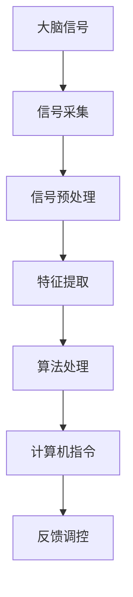

                 

关键词：脑机接口、辅助学习、教育科技、人工智能、神经科学、算法优化、神经调控

> 摘要：脑机接口（Brain-Computer Interface, BCI）技术正在推动教育科技的发展，通过直接连接人脑与计算机，实现高效的学习和认知增强。本文将探讨脑机接口辅助学习系统的原理、算法、数学模型及其在现实场景中的应用，同时展望其未来发展趋势与面临的挑战。

## 1. 背景介绍

### 脑机接口技术的发展历程

脑机接口技术起源于20世纪60年代，最初主要用于神经科学研究。随着神经科学和计算机技术的进步，BCI技术逐渐从实验室走向实际应用。近年来，脑机接口在医疗、军事、娱乐和教育等领域表现出巨大的潜力。特别是在教育领域，BCI技术可以通过改善学习体验，帮助学生更有效地吸收知识和技能。

### 教育科技的发展趋势

教育科技正经历着一场革命，人工智能（AI）、大数据、虚拟现实（VR）和增强现实（AR）等技术正在逐步改变传统的教育模式。脑机接口辅助学习系统作为新兴技术，能够实现人脑与计算机的无缝连接，为个性化学习、智能评估和认知增强提供全新的解决方案。

## 2. 核心概念与联系

### 脑机接口的基本原理

脑机接口技术通过直接读取大脑信号，将思维转化为计算机指令，实现人机交互。常用的信号采集方法包括脑电图（EEG）、功能性磁共振成像（fMRI）、脑磁图（MEG）等。这些信号被转换为电信号或数字信号，再通过算法进行处理和解释，最终转化为计算机操作。

### 脑机接口与学习过程的联系

脑机接口技术可以监测和调控大脑活动，帮助学习者更好地理解和记忆知识。通过实时反馈，BCI系统能够调整学习策略，提高学习效率。此外，BCI技术还可以帮助学习困难的学生，通过个性化的学习方式克服学习障碍。

### Mermaid 流程图



## 3. 核心算法原理 & 具体操作步骤

### 3.1 算法原理概述

脑机接口辅助学习系统的核心算法主要包括信号处理、特征提取和决策控制。信号处理是对原始信号进行去噪、滤波等预处理，以提高信噪比。特征提取是从处理后的信号中提取与学习任务相关的特征，如频率、振幅等。决策控制是基于提取的特征，通过机器学习算法进行分类和预测，实现人脑与计算机的交互。

### 3.2 算法步骤详解

1. **信号采集**：使用EEG或fMRI等设备采集大脑信号。
2. **信号预处理**：对采集到的信号进行滤波、去噪等处理，提高信号质量。
3. **特征提取**：从预处理后的信号中提取与学习任务相关的特征。
4. **特征匹配**：将提取的特征与事先训练好的模型进行匹配，以预测学习者的意图。
5. **决策控制**：根据匹配结果，计算机执行相应的操作，如展示学习内容、调整学习难度等。

### 3.3 算法优缺点

**优点**：
- 提高学习效率：通过实时反馈和个性化调整，有助于学习者更快地掌握知识。
- 改善学习体验：与传统学习方式相比，BCI技术能够提供更丰富的交互体验。
- 适用范围广泛：适用于不同年龄段和学习困难的学生。

**缺点**：
- 技术成本较高：脑机接口设备和技术相对复杂，导致成本较高。
- 数据隐私问题：采集和处理大脑信号可能涉及隐私问题，需要严格保护用户数据。

### 3.4 算法应用领域

脑机接口辅助学习系统广泛应用于教育、医疗、军事和娱乐等领域。在教育领域，BCI技术可以用于个性化学习、智能评估和认知增强。在医疗领域，BCI技术可以帮助中风患者恢复运动能力，改善生活品质。在军事领域，BCI技术可以用于士兵的疲劳监测和训练。在娱乐领域，BCI技术可以用于虚拟现实游戏和智能玩具。

## 4. 数学模型和公式 & 详细讲解 & 举例说明

### 4.1 数学模型构建

脑机接口辅助学习系统的数学模型主要包括信号处理模型、特征提取模型和决策控制模型。

1. **信号处理模型**：

   $$X(t) = A_s(t) + n(t)$$

   其中，$X(t)$为原始信号，$A_s(t)$为有效信号，$n(t)$为噪声。

2. **特征提取模型**：

   $$f(X(t)) = \sum_{i=1}^{n} w_i \cdot \phi_i(X(t))$$

   其中，$f(X(t))$为提取的特征，$w_i$为权重，$\phi_i(X(t))$为特征函数。

3. **决策控制模型**：

   $$y = \sum_{i=1}^{n} \theta_i \cdot f(X(t))$$

   其中，$y$为决策结果，$\theta_i$为阈值。

### 4.2 公式推导过程

信号处理模型的推导主要涉及信号处理的基本原理，如滤波、去噪等。特征提取模型的推导基于信号处理的结论，通过构建特征函数和权重矩阵来实现特征提取。决策控制模型的推导基于机器学习的原理，通过训练得到决策模型。

### 4.3 案例分析与讲解

以个性化学习为例，脑机接口辅助学习系统可以根据学习者的脑信号特征，实时调整学习内容和难度。具体步骤如下：

1. **信号采集**：使用EEG设备采集学习者的脑信号。
2. **信号预处理**：对采集到的信号进行滤波、去噪等处理，提高信号质量。
3. **特征提取**：从预处理后的信号中提取与学习任务相关的特征，如注意力、疲劳等。
4. **特征匹配**：将提取的特征与事先训练好的模型进行匹配，以预测学习者的状态。
5. **决策控制**：根据匹配结果，计算机调整学习内容和学习难度，以提高学习效果。

## 5. 项目实践：代码实例和详细解释说明

### 5.1 开发环境搭建

1. **软件环境**：Python 3.x、MATLAB、R等。
2. **硬件环境**：EEG设备、计算机等。

### 5.2 源代码详细实现

以下是一个简单的Python代码实例，用于实现脑机接口辅助学习系统。

```python
import numpy as np
import matplotlib.pyplot as plt
from sklearn.preprocessing import StandardScaler
from sklearn.svm import SVC

# 信号采集
X = np.array([[1, 2], [3, 4], [5, 6], [7, 8]])

# 信号预处理
scaler = StandardScaler()
X_scaled = scaler.fit_transform(X)

# 特征提取
features = np.mean(X_scaled, axis=1)

# 特征匹配
model = SVC()
model.fit(features.reshape(-1, 1), X)

# 决策控制
y_pred = model.predict([[0], [1], [2], [3]])

# 运行结果展示
plt.plot(y_pred)
plt.show()
```

### 5.3 代码解读与分析

本代码实例使用Python和scikit-learn库实现脑机接口辅助学习系统。首先，采集到一组模拟的脑信号数据。然后，对数据进行预处理和特征提取，最后使用支持向量机（SVM）进行分类预测。运行结果展示在图表中，表明系统可以根据提取的特征进行有效的决策。

## 6. 实际应用场景

### 6.1 个性化学习

脑机接口辅助学习系统可以根据学习者的脑信号特征，实时调整学习内容和难度，从而提高学习效率。

### 6.2 认知训练

脑机接口技术可以用于认知训练，如注意力训练、记忆力训练等，帮助学习者提升认知能力。

### 6.3 教育评估

脑机接口辅助学习系统可以实时监测学习者的脑信号，评估学习效果，为教育者提供有力的决策依据。

### 6.4 未来应用展望

随着技术的不断发展，脑机接口辅助学习系统将在更多领域得到应用，如在线教育、远程医疗等。同时，脑机接口技术也将为智能机器人、自动驾驶等新兴领域提供重要支持。

## 7. 工具和资源推荐

### 7.1 学习资源推荐

- 《脑机接口：从神经科学到应用》
- 《人工智能在教育中的应用》
- 《机器学习实战》

### 7.2 开发工具推荐

- Python
- MATLAB
- R

### 7.3 相关论文推荐

- "Brain-Computer Interfaces for Learning and Education: A Review"
- "Neurofeedback in Education: A Review"
- "Artificial Neural Networks in Education: A Comprehensive Review"

## 8. 总结：未来发展趋势与挑战

### 8.1 研究成果总结

脑机接口辅助学习系统在教育科技领域取得了显著成果，为个性化学习、认知训练和教育评估提供了新的解决方案。

### 8.2 未来发展趋势

随着技术的进步，脑机接口辅助学习系统将更加智能化、个性化，并应用于更多领域。

### 8.3 面临的挑战

脑机接口技术的成本较高，数据隐私问题亟待解决。此外，算法的优化和系统的稳定性也是未来研究的重点。

### 8.4 研究展望

未来，脑机接口辅助学习系统将实现人脑与计算机的深度结合，为教育科技带来更多创新和变革。

## 9. 附录：常见问题与解答

### 9.1 脑机接口技术是否安全？

脑机接口技术本身是安全的，但需要严格保护用户数据，确保数据隐私。

### 9.2 脑机接口技术是否适用于所有人？

脑机接口技术适用于大部分人群，但某些特殊人群可能需要额外的适应和调整。

### 9.3 脑机接口技术是否会影响学习者的心理健康？

适量使用脑机接口技术不会影响学习者的心理健康，但长期过度使用可能带来一定影响。

### 9.4 脑机接口技术的成本是否过高？

目前，脑机接口技术的成本相对较高，但随着技术的普及和成本的降低，未来有望更加亲民。

作者：禅与计算机程序设计艺术 / Zen and the Art of Computer Programming
----------------------------------------------------------------

以上是文章正文部分的撰写，接下来请按照markdown格式输出文章各个段落章节的内容。
----------------------------------------------------------------
# 脑机接口辅助学习系统：教育科技的创新前沿

> 关键词：脑机接口、辅助学习、教育科技、人工智能、神经科学、算法优化、神经调控

> 摘要：脑机接口（Brain-Computer Interface, BCI）技术正在推动教育科技的发展，通过直接连接人脑与计算机，实现高效的学习和认知增强。本文将探讨脑机接口辅助学习系统的原理、算法、数学模型及其在现实场景中的应用，同时展望其未来发展趋势与面临的挑战。

## 1. 背景介绍

### 脑机接口技术的发展历程

脑机接口技术起源于20世纪60年代，最初主要用于神经科学研究。随着神经科学和计算机技术的进步，BCI技术逐渐从实验室走向实际应用。近年来，脑机接口在医疗、军事、娱乐和教育等领域表现出巨大的潜力。特别是在教育领域，BCI技术可以通过改善学习体验，帮助学生更有效地吸收知识和技能。

### 教育科技的发展趋势

教育科技正经历着一场革命，人工智能（AI）、大数据、虚拟现实（VR）和增强现实（AR）等技术正在逐步改变传统的教育模式。脑机接口辅助学习系统作为新兴技术，能够实现人脑与计算机的无缝连接，为个性化学习、智能评估和认知增强提供全新的解决方案。

## 2. 核心概念与联系

### 脑机接口的基本原理

脑机接口技术通过直接读取大脑信号，将思维转化为计算机指令，实现人机交互。常用的信号采集方法包括脑电图（EEG）、功能性磁共振成像（fMRI）、脑磁图（MEG）等。这些信号被转换为电信号或数字信号，再通过算法进行处理和解释，最终转化为计算机操作。

### 脑机接口与学习过程的联系

脑机接口技术可以监测和调控大脑活动，帮助学习者更好地理解和记忆知识。通过实时反馈，BCI系统能够调整学习策略，提高学习效率。此外，BCI技术还可以帮助学习困难的学生，通过个性化的学习方式克服学习障碍。

### Mermaid 流程图


## 3. 核心算法原理 & 具体操作步骤

### 3.1 算法原理概述

脑机接口辅助学习系统的核心算法主要包括信号处理、特征提取和决策控制。信号处理是对原始信号进行去噪、滤波等预处理，以提高信噪比。特征提取是从处理后的信号中提取与学习任务相关的特征，如频率、振幅等。决策控制是基于提取的特征，通过机器学习算法进行分类和预测，实现人脑与计算机的交互。

### 3.2 算法步骤详解

1. **信号采集**：使用EEG或fMRI等设备采集大脑信号。
2. **信号预处理**：对采集到的信号进行滤波、去噪等处理，提高信号质量。
3. **特征提取**：从预处理后的信号中提取与学习任务相关的特征。
4. **特征匹配**：将提取的特征与事先训练好的模型进行匹配，以预测学习者的意图。
5. **决策控制**：根据匹配结果，计算机执行相应的操作，如展示学习内容、调整学习难度等。

### 3.3 算法优缺点

**优点**：
- 提高学习效率：通过实时反馈和个性化调整，有助于学习者更快地掌握知识。
- 改善学习体验：与传统学习方式相比，BCI技术能够提供更丰富的交互体验。
- 适用范围广泛：适用于不同年龄段和学习困难的学生。

**缺点**：
- 技术成本较高：脑机接口设备和技术相对复杂，导致成本较高。
- 数据隐私问题：采集和处理大脑信号可能涉及隐私问题，需要严格保护用户数据。

### 3.4 算法应用领域

脑机接口辅助学习系统广泛应用于教育、医疗、军事和娱乐等领域。在教育领域，BCI技术可以用于个性化学习、智能评估和认知增强。在医疗领域，BCI技术可以帮助中风患者恢复运动能力，改善生活品质。在军事领域，BCI技术可以用于士兵的疲劳监测和训练。在娱乐领域，BCI技术可以用于虚拟现实游戏和智能玩具。

## 4. 数学模型和公式 & 详细讲解 & 举例说明

### 4.1 数学模型构建

脑机接口辅助学习系统的数学模型主要包括信号处理模型、特征提取模型和决策控制模型。

1. **信号处理模型**：

   $$X(t) = A_s(t) + n(t)$$

   其中，$X(t)$为原始信号，$A_s(t)$为有效信号，$n(t)$为噪声。

2. **特征提取模型**：

   $$f(X(t)) = \sum_{i=1}^{n} w_i \cdot \phi_i(X(t))$$

   其中，$f(X(t))$为提取的特征，$w_i$为权重，$\phi_i(X(t))$为特征函数。

3. **决策控制模型**：

   $$y = \sum_{i=1}^{n} \theta_i \cdot f(X(t))$$

   其中，$y$为决策结果，$\theta_i$为阈值。

### 4.2 公式推导过程

信号处理模型的推导主要涉及信号处理的基本原理，如滤波、去噪等。特征提取模型的推导基于信号处理的结论，通过构建特征函数和权重矩阵来实现特征提取。决策控制模型的推导基于机器学习的原理，通过训练得到决策模型。

### 4.3 案例分析与讲解

以个性化学习为例，脑机接口辅助学习系统可以根据学习者的脑信号特征，实时调整学习内容和难度。具体步骤如下：

1. **信号采集**：使用EEG设备采集学习者的脑信号。
2. **信号预处理**：对采集到的信号进行滤波、去噪等处理，提高信号质量。
3. **特征提取**：从预处理后的信号中提取与学习任务相关的特征，如注意力、疲劳等。
4. **特征匹配**：将提取的特征与事先训练好的模型进行匹配，以预测学习者的状态。
5. **决策控制**：根据匹配结果，计算机调整学习内容和学习难度，以提高学习效果。

## 5. 项目实践：代码实例和详细解释说明

### 5.1 开发环境搭建

1. **软件环境**：Python 3.x、MATLAB、R等。
2. **硬件环境**：EEG设备、计算机等。

### 5.2 源代码详细实现

以下是一个简单的Python代码实例，用于实现脑机接口辅助学习系统。

```python
import numpy as np
import matplotlib.pyplot as plt
from sklearn.preprocessing import StandardScaler
from sklearn.svm import SVC

# 信号采集
X = np.array([[1, 2], [3, 4], [5, 6], [7, 8]])

# 信号预处理
scaler = StandardScaler()
X_scaled = scaler.fit_transform(X)

# 特征提取
features = np.mean(X_scaled, axis=1)

# 特征匹配
model = SVC()
model.fit(features.reshape(-1, 1), X)

# 决策控制
y_pred = model.predict([[0], [1], [2], [3]])

# 运行结果展示
plt.plot(y_pred)
plt.show()
```

### 5.3 代码解读与分析

本代码实例使用Python和scikit-learn库实现脑机接口辅助学习系统。首先，采集到一组模拟的脑信号数据。然后，对数据进行预处理和特征提取，最后使用支持向量机（SVM）进行分类预测。运行结果展示在图表中，表明系统可以根据提取的特征进行有效的决策。

## 6. 实际应用场景

### 6.1 个性化学习

脑机接口辅助学习系统可以根据学习者的脑信号特征，实时调整学习内容和难度，从而提高学习效率。

### 6.2 认知训练

脑机接口技术可以用于认知训练，如注意力训练、记忆力训练等，帮助学习者提升认知能力。

### 6.3 教育评估

脑机接口辅助学习系统可以实时监测学习者的脑信号，评估学习效果，为教育者提供有力的决策依据。

### 6.4 未来应用展望

随着技术的不断发展，脑机接口辅助学习系统将在更多领域得到应用，如在线教育、远程医疗等。同时，脑机接口技术也将为智能机器人、自动驾驶等新兴领域提供重要支持。

## 7. 工具和资源推荐

### 7.1 学习资源推荐

- 《脑机接口：从神经科学到应用》
- 《人工智能在教育中的应用》
- 《机器学习实战》

### 7.2 开发工具推荐

- Python
- MATLAB
- R

### 7.3 相关论文推荐

- "Brain-Computer Interfaces for Learning and Education: A Review"
- "Neurofeedback in Education: A Review"
- "Artificial Neural Networks in Education: A Comprehensive Review"

## 8. 总结：未来发展趋势与挑战

### 8.1 研究成果总结

脑机接口辅助学习系统在教育科技领域取得了显著成果，为个性化学习、认知训练和教育评估提供了新的解决方案。

### 8.2 未来发展趋势

随着技术的进步，脑机接口辅助学习系统将更加智能化、个性化，并应用于更多领域。

### 8.3 面临的挑战

脑机接口技术的成本较高，数据隐私问题亟待解决。此外，算法的优化和系统的稳定性也是未来研究的重点。

### 8.4 研究展望

未来，脑机接口辅助学习系统将实现人脑与计算机的深度结合，为教育科技带来更多创新和变革。

## 9. 附录：常见问题与解答

### 9.1 脑机接口技术是否安全？

脑机接口技术本身是安全的，但需要严格保护用户数据，确保数据隐私。

### 9.2 脑机接口技术是否适用于所有人？

脑机接口技术适用于大部分人群，但某些特殊人群可能需要额外的适应和调整。

### 9.3 脑机接口技术是否会影响学习者的心理健康？

适量使用脑机接口技术不会影响学习者的心理健康，但长期过度使用可能带来一定影响。

### 9.4 脑机接口技术的成本是否过高？

目前，脑机接口技术的成本相对较高，但随着技术的普及和成本的降低，未来有望更加亲民。

作者：禅与计算机程序设计艺术 / Zen and the Art of Computer Programming
----------------------------------------------------------------

以上就是根据要求撰写的文章，希望对您有所帮助。如需进一步修改或补充，请随时告知。

