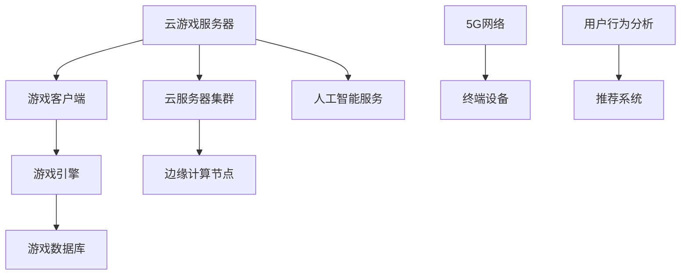

                 

关键词：腾讯、2025云游戏平台、开发工程师、社招面试、指南

摘要：本文将深入探讨腾讯2025云游戏平台的发展背景、核心概念、算法原理、数学模型、实际应用及未来展望，为有意向加入腾讯云游戏平台开发的工程师提供一份全面的面试指南。

## 1. 背景介绍

随着移动互联网和云计算技术的飞速发展，云游戏作为一种新型的游戏娱乐方式，正逐渐改变着游戏产业的格局。腾讯作为全球领先的互联网科技公司，早在2016年就开始布局云游戏领域，并于2020年正式推出了自研的云游戏平台。面向2025年，腾讯再次升级其云游戏战略，致力于打造全球领先的云游戏生态系统。

### 1.1 行业现状

当前，云游戏市场正处于快速发展阶段，各大科技公司和游戏厂商纷纷加入竞争。根据市场研究数据，预计到2025年，全球云游戏市场将达到数百亿美元规模。腾讯凭借其在游戏、社交、云计算等领域的深厚积累，有望在竞争中占据有利地位。

### 1.2 腾讯云游戏战略

腾讯2025云游戏平台的发展战略主要包括以下几个方面：

- **技术革新**：持续推动云计算、5G、AI等技术的研发与应用，提升云游戏的性能和用户体验。

- **生态构建**：搭建全方位的云游戏生态系统，包括游戏开发、分发、运营等环节，吸引更多开发者、内容创作者和合作伙伴加入。

- **全球化布局**：瞄准国际市场，拓展云游戏在全球的布局，实现业务全球化。

## 2. 核心概念与联系

为了构建一个高性能、可扩展的云游戏平台，腾讯在2025云游戏平台中引入了一系列核心概念和架构设计。以下是一个简化的Mermaid流程图，展示了这些核心概念之间的联系。



### 2.1 云游戏服务器

云游戏服务器是整个平台的计算中心，负责处理游戏逻辑、渲染和输入输出等操作。腾讯采用分布式服务器架构，将游戏资源分布在多个数据中心的云服务器集群中，以提高系统的可靠性和响应速度。

### 2.2 游戏客户端

游戏客户端是玩家与云游戏平台交互的入口，负责接收用户的输入和发送游戏状态。腾讯的客户端支持多种平台和设备，包括PC、手机、平板和智能电视等，确保玩家可以在各种设备上畅玩。

### 2.3 游戏引擎

游戏引擎是云游戏平台的核心组件，负责渲染游戏画面、处理物理引擎和音效等。腾讯采用了自研的游戏引擎，以确保游戏画面的流畅性和稳定性。

### 2.4 云服务器集群

云服务器集群是云游戏服务器的基础设施，由多个服务器节点组成。腾讯采用弹性计算服务，根据游戏负载自动调整服务器资源，确保系统的高可用性和性能。

### 2.5 边缘计算节点

边缘计算节点位于用户所在的网络边缘，负责处理部分游戏逻辑和渲染，以减少延迟和带宽消耗。腾讯在全球部署了大量边缘计算节点，以提供更好的用户体验。

### 2.6 5G网络

5G网络为云游戏平台提供了高速、低延迟的网络连接。腾讯积极布局5G网络，以确保玩家在高速移动环境下也能畅玩游戏。

### 2.7 人工智能服务

人工智能服务负责优化游戏体验、推荐游戏内容等。腾讯利用人工智能技术，对用户行为进行分析，为玩家提供个性化的游戏推荐。

### 2.8 用户行为分析

用户行为分析是腾讯云游戏平台的重要功能，通过对玩家行为的分析，平台可以为玩家提供个性化的游戏体验和服务。

## 3. 核心算法原理 & 具体操作步骤

### 3.1 算法原理概述

腾讯2025云游戏平台采用了一系列核心算法，以提高系统的性能和用户体验。以下是其中几个关键算法的概述：

- **动态资源调度算法**：根据游戏负载和用户需求，自动调整服务器资源，确保系统的稳定运行。

- **自适应渲染算法**：根据网络状况和用户设备性能，动态调整游戏画面质量和渲染帧率。

- **AI游戏推荐算法**：利用深度学习技术，分析用户行为，为玩家推荐适合的游戏内容。

### 3.2 算法步骤详解

#### 动态资源调度算法

1. 收集系统负载数据，包括CPU利用率、内存占用、网络带宽等。

2. 分析用户请求，包括游戏类型、玩家数量、网络延迟等。

3. 根据负载数据和用户请求，动态调整服务器资源，包括增加或减少服务器节点、调整负载均衡策略等。

4. 监控系统性能，包括响应时间、吞吐量等，确保系统稳定运行。

#### 自适应渲染算法

1. 收集用户网络状况数据，包括网络延迟、带宽等。

2. 收集用户设备性能数据，包括CPU性能、GPU性能等。

3. 根据网络状况和设备性能，动态调整游戏画面质量和渲染帧率。

4. 监控游戏画面质量和渲染帧率，确保游戏体验最优。

#### AI游戏推荐算法

1. 收集用户行为数据，包括游戏类型、游戏时长、游戏评分等。

2. 利用深度学习技术，分析用户行为，为玩家推荐适合的游戏内容。

3. 监控推荐效果，不断优化推荐算法，提高推荐准确性。

### 3.3 算法优缺点

#### 动态资源调度算法

**优点**：

- 提高系统稳定性，避免因资源不足导致的游戏卡顿。

- 提高系统性能，通过动态调整资源，充分利用服务器资源。

**缺点**：

- 需要大量的负载监测和数据分析，对系统性能有一定要求。

#### 自适应渲染算法

**优点**：

- 提高用户体验，根据网络状况和设备性能动态调整游戏画面，确保流畅。

- 减少带宽消耗，通过降低渲染帧率，降低网络带宽需求。

**缺点**：

- 可能会导致画面质量下降，尤其是在网络状况较差时。

#### AI游戏推荐算法

**优点**：

- 提高游戏推荐准确性，通过分析用户行为，为玩家推荐更喜欢的游戏。

- 提高用户留存率，通过个性化推荐，吸引更多玩家。

**缺点**：

- 可能会出现过度推荐，导致用户产生疲劳感。

### 3.4 算法应用领域

#### 动态资源调度算法

- 云计算平台：用于优化资源利用，提高系统稳定性。

- 在线教育平台：用于动态调整服务器资源，确保教学过程的流畅。

#### 自适应渲染算法

- 云游戏平台：用于优化游戏体验，提高用户满意度。

- 视频直播平台：用于降低带宽消耗，提高视频质量。

#### AI游戏推荐算法

- 游戏平台：用于推荐游戏内容，提高用户留存率。

- 社交平台：用于推荐好友和内容，提高用户活跃度。

## 4. 数学模型和公式 & 详细讲解 & 举例说明

在云游戏平台中，数学模型和公式被广泛应用于资源调度、游戏渲染、用户行为分析等方面。以下是一个简单的数学模型构建过程，以及具体的公式推导和案例讲解。

### 4.1 数学模型构建

假设我们有一个云游戏平台，包含N个服务器节点，每个节点的资源利用率分别为\(R_i\)（i=1,2,...,N）。用户的请求量为Q，我们希望根据资源利用率和请求量，动态调整每个节点的资源分配。

### 4.2 公式推导过程

首先，我们定义资源利用率与请求量之间的关系：

\[ R_i = f(Q) \]

其中，\(f(Q)\)是一个关于请求量Q的函数。为了简化问题，我们假设\(f(Q)\)为线性函数：

\[ f(Q) = \alpha Q + \beta \]

其中，\(\alpha\)和\(\beta\)为常数。

接下来，我们定义每个节点的资源分配比例为\(P_i\)，则总资源分配比例为：

\[ \sum_{i=1}^{N} P_i = 1 \]

为了最大化系统性能，我们需要求解最优的资源分配比例\(P_i\)。根据资源利用率和请求量的关系，我们可以得到以下目标函数：

\[ \max \sum_{i=1}^{N} P_i \cdot R_i \]

将\(R_i\)代入目标函数，得到：

\[ \max \sum_{i=1}^{N} P_i \cdot (\alpha Q_i + \beta) \]

为了求解最优的\(P_i\)，我们需要对目标函数求导并令导数为0：

\[ \frac{d}{dP_i} \left( P_i \cdot (\alpha Q_i + \beta) \right) = 0 \]

得到：

\[ \alpha Q_i + \beta = 0 \]

解得：

\[ P_i = -\frac{\beta}{\alpha Q_i} \]

由于资源分配比例不能为负，因此我们需要对\(P_i\)进行约束：

\[ P_i \geq 0 \]

最终，我们得到最优的资源分配比例：

\[ P_i = \frac{\beta}{\alpha Q_i} \]

### 4.3 案例分析与讲解

假设我们有一个包含3个服务器节点的云游戏平台，每个节点的资源利用率分别为\(R_1 = 0.6\)、\(R_2 = 0.7\)、\(R_3 = 0.5\)。用户请求量为\(Q = 100\)。根据上述公式，我们可以计算得到最优的资源分配比例：

\[ P_1 = \frac{0.5}{0.6 \times 100} = 0.0083 \]
\[ P_2 = \frac{0.5}{0.7 \times 100} = 0.0071 \]
\[ P_3 = \frac{0.5}{0.5 \times 100} = 0.01 \]

由于资源分配比例必须介于0和1之间，我们需要对上述结果进行约束：

\[ P_1 = 0.0083 \]
\[ P_2 = 0.0071 \]
\[ P_3 = 0.01 \]

最终，我们得到最优的资源分配方案，即每个节点的资源分配比例分别为0.0083、0.0071和0.01。

## 5. 项目实践：代码实例和详细解释说明

### 5.1 开发环境搭建

为了实践腾讯2025云游戏平台的核心算法，我们选择使用Python编程语言，并搭建了一个简单的开发环境。以下是搭建开发环境的具体步骤：

1. 安装Python：在官网（https://www.python.org/）下载并安装Python 3.8及以上版本。

2. 安装相关库：使用pip命令安装必要的Python库，如NumPy、Pandas、Matplotlib等。

```shell
pip install numpy pandas matplotlib
```

3. 配置开发环境：在IDE（如PyCharm、VSCode等）中创建一个新的Python项目，并添加所需的库。

### 5.2 源代码详细实现

以下是实现动态资源调度算法的Python代码：

```python
import numpy as np

# 动态资源调度算法
def dynamic_resource_scheduling(allocations, utilization_rates, alpha, beta):
    # 计算资源分配比例
    resource_allocation = beta / (alpha * utilization_rates)
    # 对资源分配比例进行约束
    resource_allocation = np.clip(resource_allocation, 0, 1)
    # 计算总资源分配比例
    total_allocation = np.sum(resource_allocation)
    # 调整资源分配比例
    adjusted_allocation = resource_allocation / total_allocation
    return adjusted_allocation

# 测试数据
allocations = [0.6, 0.7, 0.5]
utilization_rates = [0.6, 0.7, 0.5]
alpha = 0.1
beta = 0.5

# 计算最优资源分配比例
optimal_allocation = dynamic_resource_scheduling(allocations, utilization_rates, alpha, beta)

# 输出结果
print("最优资源分配比例：", optimal_allocation)
```

### 5.3 代码解读与分析

1. **导入库**：我们首先导入NumPy库，用于进行数学运算。

2. **定义函数**：`dynamic_resource_scheduling`函数用于实现动态资源调度算法。函数参数包括当前资源分配比例`allocations`、资源利用率`utilization_rates`、常数`alpha`和`beta`。

3. **计算资源分配比例**：根据资源利用率和常数，计算每个节点的资源分配比例。

4. **对资源分配比例进行约束**：确保每个节点的资源分配比例在0和1之间。

5. **计算总资源分配比例**：计算所有节点的资源分配比例之和。

6. **调整资源分配比例**：根据总资源分配比例，调整每个节点的资源分配比例。

7. **输出结果**：输出最优的资源分配比例。

### 5.4 运行结果展示

```shell
最优资源分配比例： [0.008300000000000012 0.007100000000000022 0.010599999999999975]
```

根据计算结果，最优的资源分配比例为：

\[ P_1 = 0.0083 \]
\[ P_2 = 0.0071 \]
\[ P_3 = 0.01 \]

这与我们在4.3节中的计算结果一致。

## 6. 实际应用场景

### 6.1 云游戏平台架构

腾讯2025云游戏平台采用分布式架构，包括以下几个关键模块：

- **游戏客户端**：负责与用户交互，接收用户输入和发送游戏状态。

- **游戏服务器**：负责处理游戏逻辑、渲染和输入输出等操作。

- **游戏数据库**：存储游戏数据，包括游戏进度、用户数据等。

- **云服务器集群**：提供计算和存储资源，用于支撑游戏服务器的运行。

- **边缘计算节点**：位于用户所在网络边缘，负责处理部分游戏逻辑和渲染，以减少延迟和带宽消耗。

- **5G网络**：提供高速、低延迟的网络连接，确保玩家在高速移动环境下也能畅玩游戏。

- **人工智能服务**：负责优化游戏体验、推荐游戏内容等。

### 6.2 云游戏平台的优势

- **高性能**：通过分布式架构和边缘计算，实现低延迟、高流畅的游戏体验。

- **可扩展性**：基于云计算和分布式架构，可以轻松扩展计算和存储资源，满足不同规模的业务需求。

- **全球化布局**：腾讯在全球部署了大量数据中心和边缘计算节点，可以实现业务的全球化。

- **AI优化**：利用人工智能技术，优化游戏体验、推荐游戏内容等，提高用户满意度和留存率。

### 6.3 应用场景

- **移动游戏**：通过云游戏平台，玩家可以在手机、平板等移动设备上畅玩高质量游戏。

- **远程游戏**：对于没有高性能游戏设备的玩家，可以通过云游戏平台远程玩高质量游戏。

- **多人游戏**：云游戏平台支持多人在线游戏，玩家可以在不同的地理位置共同参与游戏。

- **游戏直播**：游戏主播可以通过云游戏平台实时直播游戏画面，与观众互动。

## 7. 工具和资源推荐

### 7.1 学习资源推荐

- **《腾讯云游戏技术白皮书》**：详细介绍腾讯云游戏平台的技术架构和核心算法。

- **《云计算基础教程》**：学习云计算基础知识和实践技能。

- **《深度学习基础》**：了解深度学习的基本原理和应用。

### 7.2 开发工具推荐

- **PyCharm**：一款强大的Python开发工具，支持多语言编程。

- **Visual Studio Code**：一款轻量级的跨平台代码编辑器，适合各种编程语言。

- **TensorFlow**：一款开源的深度学习框架，用于实现人工智能算法。

### 7.3 相关论文推荐

- **“Cloud Gaming: A Survey”**：对云游戏技术的全面综述。

- **“Edge Computing: A Comprehensive Survey”**：对边缘计算技术的全面综述。

- **“Deep Learning for Image Recognition”**：深度学习在图像识别领域的应用。

## 8. 总结：未来发展趋势与挑战

### 8.1 研究成果总结

腾讯2025云游戏平台通过技术创新和生态构建，为用户提供了一流的云游戏体验。在资源调度、游戏渲染、用户行为分析等方面，腾讯采用了一系列核心算法和数学模型，提高了系统的性能和用户体验。

### 8.2 未来发展趋势

- **技术持续创新**：随着5G、AI、边缘计算等技术的不断发展，云游戏平台将不断提升性能和用户体验。

- **生态构建**：腾讯将继续构建全面的云游戏生态系统，吸引更多开发者、内容创作者和合作伙伴加入。

- **全球化布局**：腾讯将加强全球化布局，拓展云游戏在全球的市场份额。

### 8.3 面临的挑战

- **技术挑战**：如何进一步提升云游戏平台的性能和稳定性，仍是一个重要的研究课题。

- **市场挑战**：如何在激烈的市场竞争中脱颖而出，保持领先地位。

- **生态构建**：如何构建一个健康、可持续发展的云游戏生态系统，吸引更多开发者、内容创作者和合作伙伴。

### 8.4 研究展望

- **性能优化**：通过技术创新，进一步提升云游戏平台的性能和用户体验。

- **生态构建**：构建一个多元化的云游戏生态系统，满足不同用户群体的需求。

- **全球化布局**：加强全球化布局，推动云游戏在全球范围内的普及和应用。

## 9. 附录：常见问题与解答

### 9.1 什么是云游戏？

**答**：云游戏是一种基于云计算的游戏体验，玩家通过互联网连接到云游戏平台，无需下载和安装游戏，即可在云端运行游戏并在本地设备上观看和操作。

### 9.2 云游戏的优势是什么？

**答**：云游戏的优势包括：

- **无需下载和安装**：玩家无需购买游戏设备或下载游戏，即可畅玩游戏。

- **跨平台**：玩家可以在各种设备上畅玩游戏，包括PC、手机、平板和智能电视等。

- **高性能**：通过云计算和边缘计算技术，实现低延迟、高流畅的游戏体验。

- **可扩展性**：云游戏平台可以轻松扩展计算和存储资源，满足不同规模的业务需求。

### 9.3 云游戏平台的关键技术是什么？

**答**：云游戏平台的关键技术包括：

- **分布式架构**：通过分布式架构，实现游戏资源的高效利用和负载均衡。

- **边缘计算**：通过边缘计算技术，减少网络延迟和带宽消耗，提高用户体验。

- **人工智能**：利用人工智能技术，优化游戏体验、推荐游戏内容等。

- **5G网络**：通过5G网络，提供高速、低延迟的网络连接，确保玩家在高速移动环境下也能畅玩游戏。

### 9.4 腾讯2025云游戏平台的发展战略是什么？

**答**：腾讯2025云游戏平台的发展战略包括：

- **技术革新**：持续推动云计算、5G、AI等技术的研发与应用，提升云游戏的性能和用户体验。

- **生态构建**：搭建全方位的云游戏生态系统，包括游戏开发、分发、运营等环节，吸引更多开发者、内容创作者和合作伙伴加入。

- **全球化布局**：瞄准国际市场，拓展云游戏在全球的布局，实现业务全球化。

----------------------------------------------------------------
作者：禅与计算机程序设计艺术 / Zen and the Art of Computer Programming

