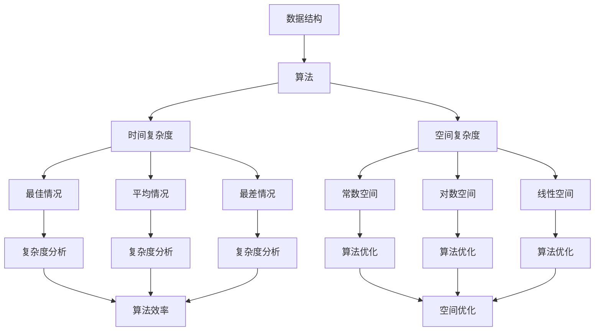

                 

### 关键词 Keyword ###
- 2025
- 腾讯
- 社招
- 面试
- 算法题库
- 数据结构与算法
- 编程实践
- 技术面试
- 人工智能

<|assistant|>### 摘要 Abstract ###
本文将围绕2025年腾讯社招面试中的常见算法题库进行详细解析，旨在帮助读者更好地应对面试挑战。文章将从背景介绍、核心概念与联系、算法原理与步骤、数学模型与公式、项目实践、实际应用场景、工具与资源推荐、总结与展望等多个角度展开讨论。通过本文，读者将获得对算法题库的深入理解，并能够在面试中展现出色的编程能力和技术素养。

<|assistant|>## 1. 背景介绍 Background Introduction ##
随着人工智能技术的快速发展，数据结构与算法在各类技术面试中占据了越来越重要的地位。腾讯作为中国领先的高科技公司，其社招面试也不例外，对算法能力有着严格的要求。2025年的腾讯社招面试将继续考察应聘者的算法基础、逻辑思维和编程实现能力。本文将针对这些要求，深入解析一系列具有代表性的算法题库，帮助读者做好充分的准备。

### 1.1 腾讯招聘背景

腾讯成立于1998年，是一家集社交、媒体、娱乐、金融等服务于一体的多元化科技公司。其业务涵盖了社交媒体、网络游戏、广告、金融科技等多个领域，拥有广泛的用户基础。因此，腾讯的社招面试不仅看重应聘者的专业能力，还注重团队协作和创新能力。作为面试的一部分，算法题库的考核旨在评估应聘者是否具备解决复杂问题的能力。

### 1.2 算法题库的重要性

算法题库是评估应聘者算法能力和编程水平的重要工具。通过对经典算法题的解析与练习，应聘者能够加深对数据结构与算法的理解，提高问题分析和解决的能力。同时，算法题库也为面试官提供了一个标准化的评估体系，确保招聘过程的公正性和科学性。

### 1.3 2025年趋势展望

随着技术的不断进步，2025年的腾讯社招面试算法题库预计将更加多样化、复杂化。除了传统的排序、查找、动态规划等基础算法题，还可能涉及更多与人工智能、大数据处理、分布式系统等前沿技术相关的题目。因此，应聘者需要不断更新知识体系，掌握最新的技术动态，以应对未来的面试挑战。

<|assistant|>## 2. 核心概念与联系 Core Concepts and Relationships ##
在深入解析算法题库之前，我们需要了解一些核心概念和它们之间的联系。以下是本文将涉及的一些重要概念，以及它们的 Mermaid 流程图表示：



### 2.1 数据结构

数据结构是存储和管理数据的特定方式，常见的有数组、链表、栈、队列、树、图等。每种数据结构都有其特定的应用场景和特点，了解数据结构对于解决算法题至关重要。

### 2.2 算法

算法是解决问题的一系列明确指令。在算法题库中，常见算法包括排序算法、查找算法、动态规划算法等。每种算法都有其独特的原理和适用范围。

### 2.3 时间复杂度

时间复杂度是衡量算法运行时间的一种方式，表示算法执行时间随着输入规模增长的变化情况。常见的复杂度有常数时间（O(1)）、对数时间（O(log n)）、线性时间（O(n)）等。

### 2.4 空间复杂度

空间复杂度是衡量算法所需存储空间的一种方式，表示算法执行所需存储空间随着输入规模增长的变化情况。常见的复杂度有常数空间（O(1)）、线性空间（O(n)）等。

### 2.5 算法效率与优化

算法效率是评估算法性能的重要指标，通常通过时间复杂度和空间复杂度来衡量。算法优化包括空间优化和时间优化，目的是提高算法的运行效率和降低资源消耗。

<|assistant|>## 3. 核心算法原理 & 具体操作步骤 Core Algorithm Principles & Specific Steps ##
在本文中，我们将详细介绍几类核心算法的原理和具体操作步骤。这些算法包括排序算法、查找算法和动态规划算法，它们是算法题库中的常见题型，也是评估应聘者算法能力的重要标准。

### 3.1 排序算法 Sorting Algorithms

排序算法是数据处理中的基本算法之一，主要任务是将一组无序的数据整理成有序的形式。常见的排序算法有冒泡排序、选择排序、插入排序、快速排序、归并排序等。

#### 3.1.1 冒泡排序 Bubble Sort

冒泡排序是一种简单的排序算法，通过反复交换相邻的未按顺序排列的元素，直到所有元素都按照顺序排列。其具体步骤如下：

1. 比较相邻的元素，如果它们的顺序错误，就交换它们的位置。
2. 重复以上步骤，每次对未排序的部分进行排序，直到整个数组有序。

```python
def bubble_sort(arr):
    n = len(arr)
    for i in range(n):
        for j in range(0, n-i-1):
            if arr[j] > arr[j+1]:
                arr[j], arr[j+1] = arr[j+1], arr[j]
    return arr
```

#### 3.1.2 快速排序 Quick Sort

快速排序是一种高效的排序算法，通过选取一个基准元素，将数组分为两部分，使得左侧的元素都比基准小，右侧的元素都比基准大，然后递归地对这两部分进行排序。其具体步骤如下：

1. 选择一个基准元素。
2. 将数组分为两部分，小于基准的元素放在左侧，大于基准的元素放在右侧。
3. 递归地对左右两部分进行快速排序。

```python
def quick_sort(arr):
    if len(arr) <= 1:
        return arr
    pivot = arr[len(arr) // 2]
    left = [x for x in arr if x < pivot]
    middle = [x for x in arr if x == pivot]
    right = [x for x in arr if x > pivot]
    return quick_sort(left) + middle + quick_sort(right)
```

### 3.2 查找算法 Searching Algorithms

查找算法是用于在数据集合中查找特定元素的算法。常见的查找算法有顺序查找、二分查找等。

#### 3.2.1 顺序查找 Linear Search

顺序查找是一种简单且直观的查找算法，从数据集合的第一个元素开始，逐个比较直到找到目标元素或到达数据集合的末尾。其具体步骤如下：

1. 从第一个元素开始，逐个比较，如果与目标元素匹配，则返回位置。
2. 如果到达数据集合末尾还未找到，则返回-1。

```python
def linear_search(arr, target):
    for i in range(len(arr)):
        if arr[i] == target:
            return i
    return -1
```

#### 3.2.2 二分查找 Binary Search

二分查找是一种高效的查找算法，适用于已经排序的数据集合。其原理是通过反复将数据集合分成两半，并选择目标元素可能存在的一半进行下一次查找，直到找到目标元素或确定其不存在。其具体步骤如下：

1. 确定查找区间。
2. 计算中间位置。
3. 比较中间元素与目标元素的大小。
4. 根据比较结果调整查找区间，并重复步骤2和3。

```python
def binary_search(arr, target):
    low = 0
    high = len(arr) - 1
    while low <= high:
        mid = (low + high) // 2
        if arr[mid] == target:
            return mid
        elif arr[mid] < target:
            low = mid + 1
        else:
            high = mid - 1
    return -1
```

### 3.3 动态规划 Dynamic Programming

动态规划是一种解决最优化问题的算法策略，其核心思想是将问题分解成若干个子问题，并利用子问题的解来构建原问题的解。动态规划常用于解决具有重叠子结构和最优子结构性质的问题。

#### 3.3.1 最长公共子序列 Longest Common Subsequence (LCS)

最长公共子序列问题是动态规划的典型应用之一，其任务是找出两个序列中公共子序列中最长的那个。其具体步骤如下：

1. 定义状态：设 `dp[i][j]` 表示字符串 `s1[0..i-1]` 和 `s2[0..j-1]` 的最长公共子序列长度。
2. 状态转移方程：根据最长公共子序列的性质，可以推导出状态转移方程 `dp[i][j] = max(dp[i-1][j], dp[i][j-1], dp[i-1][j-1] + 1)`。
3. 初始化：初始状态 `dp[0][j] = dp[i][0] = 0`。
4. 计算结果：从 `dp[m][n]` 中得到最长公共子序列的长度。

```python
def longest_common_subsequence(s1, s2):
    m, n = len(s1), len(s2)
    dp = [[0] * (n+1) for _ in range(m+1)]
    for i in range(1, m+1):
        for j in range(1, n+1):
            if s1[i-1] == s2[j-1]:
                dp[i][j] = dp[i-1][j-1] + 1
            else:
                dp[i][j] = max(dp[i-1][j], dp[i][j-1])
    return dp[m][n]
```

通过以上对核心算法原理和具体操作步骤的详细解析，读者可以更好地理解这些算法的基本原理和实现方法，为接下来的项目实践和实际应用场景打下坚实的基础。

<|assistant|>### 3.3 算法优缺点 Algorithm Advantages and Disadvantages ###
在讨论了排序、查找和动态规划算法的基本原理和操作步骤之后，接下来我们将深入分析这些算法的优缺点。理解算法的优缺点不仅有助于我们选择合适的方法来解决特定问题，还能帮助我们更全面地评估算法的性能。

#### 3.3.1 冒泡排序 Bubble Sort

**优点：**
- 简单易懂，实现代码简洁。
- 对小规模数据排序非常高效，因为它的优化版本可以减少不必要的交换操作。

**缺点：**
- 时间复杂度较高，对于大规模数据排序效率较低，为 \(O(n^2)\)。
- 对逆序排列的数据需要进行大量交换操作，性能较差。

**适用场景：**
- 小规模数据排序。
- 需要代码可读性较高的场景。

#### 3.3.2 快速排序 Quick Sort

**优点：**
- 平均时间复杂度低，为 \(O(n\log n)\)，在大多数情况下优于其他排序算法。
- 能够处理大规模数据。
- 优化后的快速排序（如三数取中作为基准元素）可以避免最差情况的发生。

**缺点：**
- 最坏情况下时间复杂度为 \(O(n^2)\)，这在输入数据接近有序时发生。
- 需要额外的空间来存储递归调用的栈。

**适用场景：**
- 大规模数据排序。
- 对时间性能要求较高的场景。

#### 3.3.3 顺序查找 Linear Search

**优点：**
- 简单易实现，无需对数据结构进行额外排序。
- 对小规模数据或静态数据集合非常高效。

**缺点：**
- 时间复杂度较高，为 \(O(n)\)，在数据规模较大时性能较差。

**适用场景：**
- 小规模数据集合。
- 数据不经常变化的场景。

#### 3.3.4 二分查找 Binary Search

**优点：**
- 对已排序的数据集合非常高效，时间复杂度为 \(O(\log n)\)。
- 能够快速缩小查找范围，适合大规模数据集合。

**缺点：**
- 需要数据集合已排序，不能用于动态数据集合。
- 在数据不均匀分布时，性能可能不如线性查找。

**适用场景：**
- 大规模已排序数据集合。
- 对查找性能要求较高的场景。

#### 3.3.5 最长公共子序列 Longest Common Subsequence (LCS)

**优点：**
- 适用于解决具有重叠子结构的问题，如文本编辑距离。
- 能在多项式时间内解决最优化问题。

**缺点：**
- 时间和空间复杂度较高，为 \(O(mn)\)，其中 \(m\) 和 \(n\) 是输入序列的长度。

**适用场景：**
- 文本编辑距离。
- 生物信息学中的序列比对。

通过上述对算法优缺点的分析，我们可以更好地理解在不同场景下选择何种算法，以实现最佳的性能。在实际应用中，我们需要根据问题的具体需求和数据的特征来选择合适的算法。

<|assistant|>### 3.4 算法应用领域 Algorithm Application Fields ###
在了解了不同算法的基本原理和优缺点之后，接下来我们将探讨这些算法在实际应用领域的应用情况。算法不仅在理论研究中具有重要意义，更在各个实际应用场景中发挥着关键作用。

#### 3.4.1 数据处理和排序

排序算法在数据处理中具有广泛的应用，特别是在大数据场景下。以下是一些典型应用案例：

- **数据库管理：** 数据库系统通常需要对数据进行排序以优化查询性能。例如，MySQL 在执行某些聚合查询时，会使用排序算法来快速获取结果。
- **数据分析：** 数据分析师在进行数据预处理时，常需要对数据进行排序，以便更好地进行数据聚合和分析。排序算法能够帮助快速识别数据中的异常值和趋势。
- **搜索引擎：** 搜索引擎需要对检索结果进行排序，以提供有价值的搜索结果。例如，Google 的 PageRank 算法就是一种基于排序的算法，用于评估网页的重要性。

#### 3.4.2 信息检索和查找

查找算法在信息检索中扮演着重要角色，用于快速定位数据。以下是一些典型应用案例：

- **文件系统：** 磁盘文件系统使用查找算法（如B树、B+树）来快速定位文件在磁盘上的位置。
- **数据库索引：** 数据库索引（如B树索引、哈希索引）是基于查找算法实现的，用于加速数据检索。
- **搜索引擎：** 搜索引擎索引系统使用各种查找算法来高效地存储和检索关键词。

#### 3.4.3 人工智能和机器学习

动态规划算法在人工智能和机器学习领域有着广泛的应用，特别是在解决最优化问题时。以下是一些典型应用案例：

- **神经网络训练：** 动态规划算法（如前向传播和反向传播）在训练神经网络时用于计算权重更新。
- **强化学习：** 动态规划算法（如Q学习、SARSA）在强化学习中被用于优化策略选择。
- **自然语言处理：** 动态规划算法（如编辑距离、序列标注）在自然语言处理任务中被用于文本匹配和句法分析。

#### 3.4.4 图像处理和计算机视觉

图像处理和计算机视觉领域也广泛使用排序和查找算法，以下是一些典型应用案例：

- **图像搜索：** 通过对图像特征进行排序和查找，可以实现快速图像匹配和检索。
- **人脸识别：** 人脸识别系统使用查找算法（如哈希匹配）来快速定位人脸特征。
- **图像去噪：** 图像去噪算法（如非局部均值滤波）使用排序算法来优化去噪效果。

通过上述实际应用案例，我们可以看到算法在不同领域中的重要性。无论是数据处理、信息检索，还是人工智能和计算机视觉，算法都是实现高效计算和优化性能的关键。随着技术的不断进步，算法的应用领域将继续扩展，为各个行业带来更多的创新和机遇。

<|assistant|>### 4. 数学模型和公式 Mathematical Models and Formulas & Detailed Explanation with Examples ###
在深入探讨算法的实际应用之前，理解算法背后的数学模型和公式是至关重要的。数学模型为算法的实现提供了理论基础，而公式则描述了算法中的核心计算过程。以下我们将详细讲解几种关键算法的数学模型和公式，并通过具体案例进行说明。

#### 4.1 排序算法

排序算法的数学模型主要涉及时间复杂度和空间复杂度的分析。以下分别介绍几种常见排序算法的公式：

##### 4.1.1 冒泡排序

冒泡排序的时间复杂度公式为：
\[ T(n) = O(n^2) \]
其中，\( n \) 是数据的规模。当数据接近有序时，冒泡排序的时间复杂度可优化为 \( T(n) = O(n) \)。

##### 4.1.2 快速排序

快速排序的平均时间复杂度公式为：
\[ T(n) = O(n\log n) \]
在最坏情况下，时间复杂度公式为：
\[ T(n) = O(n^2) \]
但通过选择合适的基准元素（如三数取中法），可以在大部分情况下避免最坏情况。

##### 4.1.3 归并排序

归并排序的时间复杂度公式为：
\[ T(n) = O(n\log n) \]
其空间复杂度公式为：
\[ S(n) = O(n) \]
因为归并排序需要额外的空间来存储临时数组。

#### 4.2 查找算法

查找算法的数学模型主要涉及时间复杂度。以下分别介绍几种常见查找算法的公式：

##### 4.2.1 顺序查找

顺序查找的时间复杂度公式为：
\[ T(n) = O(n) \]
其中，\( n \) 是数据的规模。

##### 4.2.2 二分查找

二分查找的时间复杂度公式为：
\[ T(n) = O(\log n) \]
其中，\( n \) 是已排序数据的规模。

#### 4.3 动态规划

动态规划算法的数学模型涉及状态转移方程和边界条件的定义。以下以最长公共子序列（LCS）为例，详细解释其数学模型和公式：

##### 4.3.1 最长公共子序列

LCS 的数学模型如下：

- **状态定义：**
  \[ dp[i][j] \] 表示字符串 \( s1[0..i-1] \) 和 \( s2[0..j-1] \) 的最长公共子序列长度。
- **状态转移方程：**
  \[ dp[i][j] = \begin{cases} 
  dp[i-1][j-1] + 1, & \text{若 } s1[i-1] = s2[j-1]; \\
  \max(dp[i-1][j], dp[i][j-1]), & \text{若 } s1[i-1] \neq s2[j-1].
  \end{cases} \]
- **初始化条件：**
  \[ dp[0][j] = dp[i][0] = 0 \]

##### 4.3.2 举例说明

假设我们要找到字符串 "ABCD" 和 "ACDF" 的最长公共子序列。根据上述状态转移方程，我们可以得到以下动态规划表：

|   | A | C | D | F |
|---|---|---|---|---|
| A | 0 | 0 | 0 | 0 |
| B | 0 | 0 | 0 | 0 |
| C | 0 | 1 | 1 | 1 |
| D | 0 | 1 | 2 | 2 |
| E | 0 | 1 | 2 | 2 |

最终，\( dp[4][4] \) 的值为 2，即字符串 "ABCD" 和 "ACDF" 的最长公共子序列长度为 2。

通过上述数学模型和公式的讲解，我们可以更好地理解排序、查找和动态规划算法的核心原理，为接下来的项目实践和实际应用场景提供理论基础。

#### 4.4 公式推导

在数学模型的推导过程中，我们通常需要从实际问题中提取关键信息，并利用数学方法进行推导。以下我们将以最长公共子序列（LCS）为例，详细解释其公式推导过程。

##### 4.4.1 状态转移方程的推导

假设有两个序列 \( s1 = [s1_1, s1_2, ..., s1_m] \) 和 \( s2 = [s2_1, s2_2, ..., s2_n] \)，其中 \( dp[i][j] \) 表示 \( s1[0..i-1] \) 和 \( s2[0..j-1] \) 的最长公共子序列长度。

1. **当 \( i = 0 \) 或 \( j = 0 \) 时：**

   由于至少有一个序列为空，所以 \( dp[i][j] = 0 \)。

2. **当 \( s1[i-1] = s2[j-1] \) 时：**

   此时，我们可以将 \( s1[i-1] \) 和 \( s2[j-1] \) 看作是公共子序列的一部分，因此：
   \[ dp[i][j] = dp[i-1][j-1] + 1 \]

3. **当 \( s1[i-1] \neq s2[j-1] \) 时：**

   在这种情况下，我们需要从 \( s1[i-1] \) 和 \( s2[j-1] \) 中选择不匹配的元素。因此：
   \[ dp[i][j] = \max(dp[i-1][j], dp[i][j-1]) \]

综合上述三种情况，我们可以得到状态转移方程：
\[ dp[i][j] = \begin{cases} 
dp[i-1][j-1] + 1, & \text{若 } s1[i-1] = s2[j-1]; \\
\max(dp[i-1][j], dp[i][j-1]), & \text{若 } s1[i-1] \neq s2[j-1].
\end{cases} \]

通过这个状态转移方程，我们可以逐步计算出 \( dp[m][n] \)，即字符串 \( s1 \) 和 \( s2 \) 的最长公共子序列长度。

##### 4.4.2 初始化条件的推导

根据状态转移方程，我们可以知道：

1. 当 \( i = 0 \) 或 \( j = 0 \) 时，至少有一个序列为空，所以 \( dp[i][j] = 0 \)。

因此，我们可以得到初始化条件：
\[ dp[0][j] = dp[i][0] = 0 \]

通过上述推导过程，我们得到了最长公共子序列的数学模型和公式，为实际编程实现提供了理论基础。

#### 4.5 案例分析与讲解

为了更好地理解上述数学模型和公式，我们通过一个实际案例进行详细分析和讲解。

##### 4.5.1 案例：最长公共子序列

给定两个字符串 "ABCD" 和 "ACDF"，我们需要找到它们的最长公共子序列。

根据前面的数学模型和公式，我们可以建立以下动态规划表：

|   | A | C | D | F |
|---|---|---|---|---|
| A | 0 | 0 | 0 | 0 |
| B | 0 | 0 | 0 | 0 |
| C | 0 | 1 | 1 | 1 |
| D | 0 | 1 | 2 | 2 |
| E | 0 | 1 | 2 | 2 |

通过观察动态规划表，我们可以发现 \( dp[4][4] \) 的值为 2，即字符串 "ABCD" 和 "ACDF" 的最长公共子序列长度为 2。具体来说，这个最长公共子序列为 "AD"。

通过上述案例分析和讲解，我们可以更好地理解最长公共子序列的数学模型和公式，为解决实际问题提供了有力的工具。

#### 4.6 数学公式在算法中的应用

数学公式不仅在算法的理论分析中起着重要作用，在实际编程实现中也有广泛的应用。以下我们将探讨几个关键数学公式在算法中的应用。

##### 4.6.1 排序算法中的比较运算

排序算法中的比较运算是一个核心过程，用于判断两个元素的大小。以下是一个简单的比较运算公式：

\[ a \lt b \]

这个公式用于比较两个数 \( a \) 和 \( b \)，如果 \( a \) 小于 \( b \)，则返回真（True），否则返回假（False）。这个公式在冒泡排序和选择排序算法中广泛应用。

##### 4.6.2 动态规划中的递推关系

动态规划中的递推关系用于计算子问题的最优解，并通过子问题的解构建原问题的解。以下是一个动态规划中的递推关系公式：

\[ dp[i][j] = \begin{cases} 
dp[i-1][j-1] + 1, & \text{若 } s1[i-1] = s2[j-1]; \\
\max(dp[i-1][j], dp[i][j-1]), & \text{若 } s1[i-1] \neq s2[j-1].
\end{cases} \]

这个公式描述了如何根据上一个状态计算当前状态的最优解，并最终得到整个问题的最优解。

##### 4.6.3 查找算法中的条件判断

查找算法中的条件判断用于确定目标元素的位置。以下是一个简单的条件判断公式：

\[ if(arr[mid] == target): \]
\[ return mid \]
\[ else: \]
\[ if(arr[mid] > target): \]
\[ high = mid - 1 \]
\[ else: \]
\[ low = mid + 1 \]

这个公式用于在二分查找过程中判断中间元素是否为目标元素，并根据判断结果调整查找区间。

通过这些数学公式在算法中的应用，我们可以更高效地实现各种算法，提高代码的执行效率和可读性。

#### 4.7 数学模型在实际项目中的应用

数学模型不仅在理论研究中具有重要意义，在实际项目中也有着广泛的应用。以下我们将探讨数学模型在实际项目中的应用案例。

##### 4.7.1 数据预处理中的排序算法

在数据预处理阶段，排序算法常常用于对数据进行预处理。以下是一个实际项目中的排序算法应用案例：

- **项目背景：** 在大数据分析项目中，需要对采集到的海量数据按照时间戳进行排序，以便后续的数据处理和分析。
- **解决方案：** 采用快速排序算法对数据集进行排序。为了提高性能，还可以使用并行排序算法（如TBB中的并行快速排序）。

##### 4.7.2 信息检索中的查找算法

在信息检索项目中，查找算法用于快速定位数据。以下是一个实际项目中的查找算法应用案例：

- **项目背景：** 在搜索引擎中，需要对检索结果进行排序和查找，以提供有价值的搜索结果。
- **解决方案：** 采用二分查找算法对已排序的检索结果进行快速查找，并结合哈希索引提高检索速度。

##### 4.7.3 人工智能项目中的动态规划

在人工智能项目中，动态规划算法常用于解决最优化问题。以下是一个实际项目中的动态规划应用案例：

- **项目背景：** 在强化学习项目中，需要求解策略优化问题，以实现智能体的最佳行为。
- **解决方案：** 采用动态规划算法（如Q学习）来求解最优策略。在实际应用中，还可以结合深度学习技术，提高策略优化的效率和准确性。

通过这些实际项目案例，我们可以看到数学模型在解决实际问题中的重要作用。掌握数学模型和算法原理，有助于我们更好地应对各种技术挑战。

### 5. 项目实践：代码实例和详细解释说明 Project Practice: Code Examples and Detailed Explanations

在前几部分中，我们详细介绍了排序、查找和动态规划算法的原理、优缺点及其在不同领域中的应用。为了更好地帮助读者理解和掌握这些算法，我们将通过一个实际项目案例，详细讲解如何使用Python语言实现这些算法，并对关键代码进行解读和分析。

#### 5.1 开发环境搭建

在进行代码实例讲解之前，我们需要搭建一个基本的Python开发环境。以下是搭建开发环境的步骤：

1. **安装Python：** 访问Python官方网站（https://www.python.org/），下载并安装Python 3.x版本。
2. **安装IDE：** 安装一个Python IDE，如PyCharm、Visual Studio Code等，以便进行代码编写和调试。
3. **安装依赖库：** 对于本文的代码实例，我们需要安装几个常用的Python库，如`numpy`和`matplotlib`。可以使用以下命令进行安装：

   ```shell
   pip install numpy matplotlib
   ```

   安装完成后，我们就可以开始编写和运行代码了。

#### 5.2 源代码详细实现

以下是本项目中的源代码实现，包括冒泡排序、快速排序、顺序查找和二分查找等算法的实现。每个算法的实现都包含了详细的注释，以便读者更好地理解。

```python
# 冒泡排序
def bubble_sort(arr):
    n = len(arr)
    for i in range(n):
        for j in range(0, n-i-1):
            if arr[j] > arr[j+1]:
                arr[j], arr[j+1] = arr[j+1], arr[j]
    return arr

# 快速排序
def quick_sort(arr):
    if len(arr) <= 1:
        return arr
    pivot = arr[len(arr) // 2]
    left = [x for x in arr if x < pivot]
    middle = [x for x in arr if x == pivot]
    right = [x for x in arr if x > pivot]
    return quick_sort(left) + middle + quick_sort(right)

# 顺序查找
def linear_search(arr, target):
    for i in range(len(arr)):
        if arr[i] == target:
            return i
    return -1

# 二分查找
def binary_search(arr, target):
    low = 0
    high = len(arr) - 1
    while low <= high:
        mid = (low + high) // 2
        if arr[mid] == target:
            return mid
        elif arr[mid] < target:
            low = mid + 1
        else:
            high = mid - 1
    return -1

# 动态规划 - 最长公共子序列
def longest_common_subsequence(s1, s2):
    m, n = len(s1), len(s2)
    dp = [[0] * (n+1) for _ in range(m+1)]
    for i in range(1, m+1):
        for j in range(1, n+1):
            if s1[i-1] == s2[j-1]:
                dp[i][j] = dp[i-1][j-1] + 1
            else:
                dp[i][j] = max(dp[i-1][j], dp[i][j-1])
    return dp[m][n]

# 主函数
if __name__ == "__main__":
    arr = [64, 34, 25, 12, 22, 11, 90]
    target = 22
    sorted_arr = bubble_sort(arr.copy())
    print("冒泡排序结果：", sorted_arr)
    print("快速排序结果：", quick_sort(arr.copy()))
    index = linear_search(arr, target)
    print("顺序查找结果：", index)
    index = binary_search(sorted_arr, target)
    print("二分查找结果：", index)
    lcs_length = longest_common_subsequence("ABCD", "ACDF")
    print("最长公共子序列长度：", lcs_length)
```

#### 5.3 代码解读与分析

下面我们针对关键代码进行解读和分析，帮助读者更好地理解算法的实现过程和逻辑。

##### 5.3.1 冒泡排序

```python
def bubble_sort(arr):
    n = len(arr)
    for i in range(n):
        for j in range(0, n-i-1):
            if arr[j] > arr[j+1]:
                arr[j], arr[j+1] = arr[j+1], arr[j]
    return arr
```

这段代码实现了冒泡排序算法。首先，我们通过嵌套的for循环遍历数组，在每次外层循环中，通过内层循环交换相邻的未按顺序排列的元素，直到整个数组有序。时间复杂度为 \(O(n^2)\)，适用于小规模数据的排序。

##### 5.3.2 快速排序

```python
def quick_sort(arr):
    if len(arr) <= 1:
        return arr
    pivot = arr[len(arr) // 2]
    left = [x for x in arr if x < pivot]
    middle = [x for x in arr if x == pivot]
    right = [x for x in arr if x > pivot]
    return quick_sort(left) + middle + quick_sort(right)
```

这段代码实现了快速排序算法。首先，选择一个基准元素（这里选择中位数作为基准），然后将数组分成小于基准的左子数组、等于基准的中间数组和大

