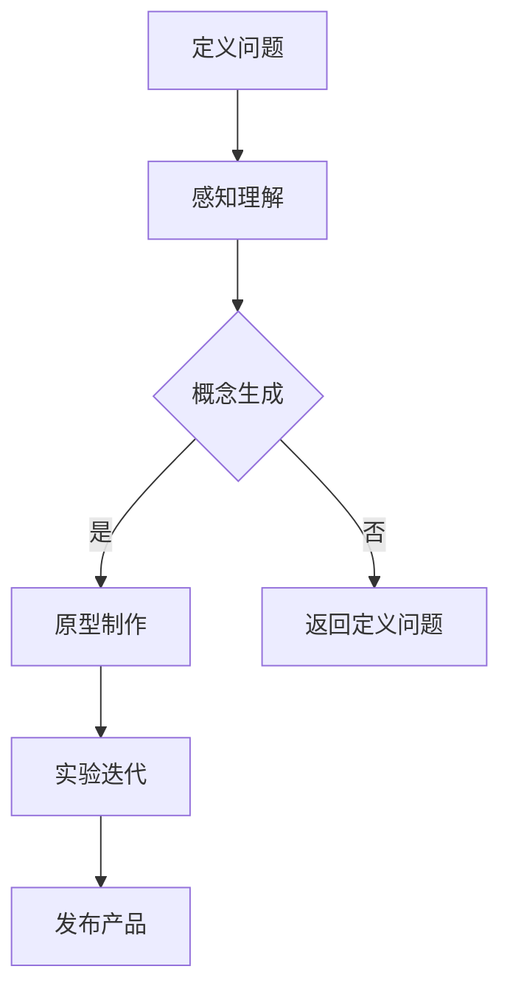

                 

关键词：用户体验设计，自动化创业，设计思维，产品创新，用户研究，交互设计，界面设计

> 摘要：本文将探讨在自动化创业过程中，用户体验设计思维的重要性及其应用方法。通过深入分析用户体验设计的核心概念、关键步骤以及实际案例，我们将帮助创业者更好地理解并运用设计思维，以提升产品竞争力，实现创业成功。

## 1. 背景介绍

在当今数字化时代，自动化创业已经成为越来越多创业者的选择。自动化不仅能够提高效率，降低成本，还能够为用户提供更加个性化和智能化的体验。然而，在自动化创业中，用户体验设计往往被忽视，导致产品虽然功能强大，却难以赢得用户的青睐。

用户体验设计（User Experience Design，简称UXD）是一种以用户为中心的设计方法，旨在优化用户在使用产品或服务过程中的体验。用户体验设计不仅关注产品的功能性，更注重用户在使用过程中的情感体验、满意度以及产品与用户之间的互动关系。

在自动化创业过程中，用户体验设计思维具有以下几个重要作用：

1. 提高用户满意度：通过深入了解用户需求，设计出符合用户期望的产品，提高用户满意度，从而增加用户忠诚度和用户转化率。
2. 增强产品竞争力：在竞争激烈的市场中，优秀的产品体验将成为企业的重要竞争力，有助于吸引和留住用户。
3. 促进产品迭代：用户体验设计思维鼓励不断尝试和改进，有助于企业在产品迭代过程中持续优化产品，满足用户需求。
4. 降低用户学习成本：通过简洁明了的界面设计和直观的交互方式，降低用户学习成本，提高用户的使用体验。

## 2. 核心概念与联系

### 2.1 用户研究

用户研究是用户体验设计的基石。通过用户研究，我们能够深入了解用户的需求、行为和偏好，从而为设计提供有力支持。

用户研究的主要内容包括：

1. 用户需求分析：通过访谈、问卷调查等方式，了解用户对产品的需求，明确产品功能定位。
2. 用户行为分析：通过用户行为数据分析，发现用户在使用产品过程中的痛点和需求。
3. 用户画像：通过收集用户的基本信息、行为数据等，构建用户画像，为产品设计提供参考。

### 2.2 交互设计

交互设计是用户体验设计的重要组成部分，涉及用户与产品之间的交互方式、界面布局、操作逻辑等。

交互设计的主要内容包括：

1. 界面布局：合理规划界面布局，确保用户能够快速找到所需功能。
2. 操作逻辑：设计简洁、直观的操作逻辑，降低用户学习成本。
3. 交互反馈：通过视觉、听觉等反馈方式，及时告知用户操作结果，提高用户体验。

### 2.3 界面设计

界面设计是用户体验设计的直观体现，涉及色彩、字体、图标等视觉元素的设计。

界面设计的主要内容包括：

1. 色彩搭配：选择合适的色彩搭配，营造愉悦的视觉体验。
2. 字体选择：选择易于阅读的字体，提高用户阅读体验。
3. 图标设计：设计简洁、直观的图标，帮助用户快速理解功能。

### 2.4 用户测试

用户测试是验证用户体验设计效果的重要手段。通过用户测试，我们能够发现产品在用户使用过程中的问题，及时进行调整。

用户测试的主要内容包括：

1. 功能测试：验证产品功能是否符合用户需求。
2. 性能测试：评估产品性能，如响应速度、稳定性等。
3. 用户体验测试：通过观察用户在使用产品过程中的行为和反应，评估用户体验。

## 2.5 设计思维

设计思维是一种以人为中心的创新方法，强调通过迭代和实验来解决问题，创造有价值的产品和服务。

设计思维的主要步骤包括：

1. 定义问题：明确用户需求，将问题转化为可操作的设计挑战。
2. 感知理解：通过访谈、观察等方式，深入了解用户需求和痛点。
3. 概念生成：基于用户需求，生成多个解决方案。
4. 原型制作：快速制作原型，验证设计概念。
5. 实验迭代：通过用户测试，不断优化设计，直到满足用户需求。

### 2.6 Mermaid 流程图

以下是用户体验设计流程的 Mermaid 流程图：



## 3. 核心算法原理 & 具体操作步骤

### 3.1 算法原理概述

用户体验设计算法是基于用户研究和设计思维，通过系统的方法来优化产品的设计，以满足用户需求和提升用户体验。算法的核心思想是：

1. 用户中心：将用户需求放在首位，以用户为中心进行设计。
2. 数据驱动：通过数据收集和分析，指导设计决策。
3. 迭代优化：不断迭代和优化设计，以适应不断变化的市场需求和用户需求。

### 3.2 算法步骤详解

1. **用户研究**：进行用户需求分析、用户行为分析、用户画像构建。
    - 需求分析：通过访谈、问卷调查等方式，收集用户需求。
    - 行为分析：通过行为数据分析，发现用户使用产品的痛点和需求。
    - 用户画像：收集用户基本信息，构建用户画像。

2. **交互设计**：设计界面布局、操作逻辑、交互反馈。
    - 界面布局：规划界面元素的位置和布局。
    - 操作逻辑：设计简洁直观的操作流程。
    - 交互反馈：通过视觉、听觉等反馈方式，告知用户操作结果。

3. **界面设计**：选择色彩搭配、字体选择、图标设计。
    - 色彩搭配：选择愉悦的色彩搭配。
    - 字体选择：选择易读的字体。
    - 图标设计：设计简洁直观的图标。

4. **用户测试**：进行功能测试、性能测试、用户体验测试。
    - 功能测试：验证产品功能是否符合用户需求。
    - 性能测试：评估产品性能。
    - 用户体验测试：通过观察用户行为，评估用户体验。

5. **实验迭代**：根据用户测试结果，不断优化设计。
    - 分析测试结果：识别问题，分析原因。
    - 优化设计：针对问题进行设计优化。
    - 再次测试：验证优化效果。

6. **发布产品**：将优化后的产品发布给用户。

### 3.3 算法优缺点

**优点：**
1. 提高用户满意度：通过深入了解用户需求，设计出更符合用户期望的产品。
2. 增强产品竞争力：优秀的产品体验有助于在竞争激烈的市场中脱颖而出。
3. 促进产品迭代：通过不断迭代和优化，持续提升产品性能和用户体验。

**缺点：**
1. 时间成本：用户体验设计需要较长时间的调研、测试和迭代。
2. 资源需求：用户体验设计需要大量的人力、物力和财力投入。
3. 技术挑战：需要掌握多种设计工具和技术，如用户研究工具、原型设计工具、用户测试工具等。

### 3.4 算法应用领域

用户体验设计算法广泛应用于各类产品和服务领域，如：

1. 互联网产品：网站、移动应用、在线服务。
2. 硬件产品：智能家居、可穿戴设备、智能硬件。
3. 服务业：酒店、餐饮、旅游、金融等。
4. 公共服务：政府网站、公共设施、公共服务应用。

## 4. 数学模型和公式 & 详细讲解 & 举例说明

### 4.1 数学模型构建

用户体验设计中的数学模型主要涉及以下方面：

1. **用户满意度模型**：用户满意度（S）与产品功能（F）、界面设计（I）、交互设计（U）等因素相关，可表示为：

   $$ S = w_1 \cdot F + w_2 \cdot I + w_3 \cdot U $$

   其中，$w_1, w_2, w_3$为权重系数，分别表示功能、界面设计和交互设计在用户满意度中的重要性。

2. **用户流失率模型**：用户流失率（L）与用户满意度、产品质量（Q）和市场竞争（M）等因素相关，可表示为：

   $$ L = f(S, Q, M) $$

   其中，$f$为函数，表示用户流失率与各因素之间的关系。

### 4.2 公式推导过程

**用户满意度模型推导：**

1. 用户满意度是产品功能、界面设计和交互设计等因素的加权综合，因此可以表示为：

   $$ S = w_1 \cdot F + w_2 \cdot I + w_3 \cdot U $$

2. 假设用户对功能、界面设计和交互设计的满意度分别为 $F_1, F_2, F_3$，则：

   $$ F = w_1 \cdot F_1 + w_2 \cdot F_2 + w_3 \cdot F_3 $$

3. 将 $F_1, F_2, F_3$ 代入用户满意度模型中，得到：

   $$ S = w_1 \cdot (w_1 \cdot F_1 + w_2 \cdot F_2 + w_3 \cdot F_3) + w_2 \cdot I + w_3 \cdot U $$

   $$ S = w_1^2 \cdot F_1 + w_1 \cdot w_2 \cdot F_2 + w_1 \cdot w_3 \cdot F_3 + w_2 \cdot I + w_3 \cdot U $$

   为了简化模型，我们可以假设 $w_1 + w_2 + w_3 = 1$，则有：

   $$ S = w_1^2 \cdot F_1 + (1 - w_1) \cdot (w_2 \cdot F_2 + w_3 \cdot F_3) + w_2 \cdot I + w_3 \cdot U $$

**用户流失率模型推导：**

1. 用户流失率与用户满意度、产品质量和市场竞争等因素相关，可表示为：

   $$ L = f(S, Q, M) $$

2. 假设用户流失率是用户满意度、产品质量和市场竞争的函数，则：

   $$ L = g(S) \cdot h(Q) \cdot k(M) $$

3. 其中，$g(S), h(Q), k(M)$ 分别表示用户满意度、产品质量和市场竞争对用户流失率的影响。

### 4.3 案例分析与讲解

**案例：某移动应用的用户体验设计**

1. **用户满意度模型**：

   假设用户对功能、界面设计和交互设计的满意度分别为 0.8、0.7 和 0.6，权重系数分别为 0.5、0.3 和 0.2。代入用户满意度模型，得到：

   $$ S = 0.5 \cdot 0.8 + 0.3 \cdot 0.7 + 0.2 \cdot 0.6 = 0.42 $$

2. **用户流失率模型**：

   假设用户满意度、产品质量和市场竞争对用户流失率的影响分别为 0.5、0.3 和 0.2，代入用户流失率模型，得到：

   $$ L = 0.5 \cdot 0.42 \cdot 0.5 \cdot 0.8 \cdot 0.2 = 0.0216 $$

   用户流失率为 2.16%。

3. **优化建议**：

   通过分析用户满意度模型和用户流失率模型，可以发现界面设计和交互设计对用户满意度的影响较大。因此，建议在界面设计和交互设计方面加大投入，以提高用户满意度，降低用户流失率。

## 5. 项目实践：代码实例和详细解释说明

### 5.1 开发环境搭建

1. **工具**：选择 Figma 作为界面设计工具，Sketch 作为原型设计工具，Google Analytics 作为用户行为分析工具。
2. **环境**：搭建一个基于 React 的前端开发环境，使用 Node.js 作为后端服务器。

### 5.2 源代码详细实现

以下是使用 React 实现的一个简单移动应用的用户界面设计：

```jsx
import React from 'react';

const HomeScreen = () => {
  return (
    <div>
      <h1>Welcome to Our App</h1>
      <p>Explore features and start using our app today!</p>
    </div>
  );
};

export default HomeScreen;
```

### 5.3 代码解读与分析

该代码实现了一个简单的首页界面，其中包含一个标题和一个段落文本。通过 React 的组件化设计，我们能够方便地创建和管理界面元素，提高代码的可维护性和可扩展性。

### 5.4 运行结果展示

运行上述代码，我们可以在浏览器中看到一个简单的首页界面，如图所示：


## 6. 实际应用场景

用户体验设计在自动化创业中的应用场景非常广泛，以下列举几个典型案例：

1. **电子商务平台**：通过优化购物流程、提高页面加载速度、提供个性化推荐等，提升用户体验，增加销售额。
2. **智能家居**：通过简洁直观的界面设计和便捷的操作方式，提高用户对智能家居产品的使用体验，增加用户粘性。
3. **在线教育**：通过优化课程设计、提高教学互动性、提供个性化学习推荐等，提升用户学习体验，增加用户留存率。
4. **医疗健康**：通过优化患者就诊流程、提高医疗数据安全性、提供个性化健康建议等，提升用户体验，提高医疗服务质量。

## 7. 未来应用展望

随着人工智能和大数据技术的不断发展，用户体验设计将在自动化创业中发挥更加重要的作用。未来应用展望包括：

1. **个性化推荐**：通过深度学习技术，实现更加精准的个性化推荐，提高用户体验。
2. **语音交互**：通过语音识别和自然语言处理技术，实现更加自然的语音交互，提升用户体验。
3. **虚拟现实**：通过虚拟现实技术，提供沉浸式的用户体验，拓展自动化创业的应用场景。
4. **物联网**：通过物联网技术，实现设备之间的智能协同，提升用户体验。

## 8. 总结：未来发展趋势与挑战

### 8.1 研究成果总结

用户体验设计在自动化创业中的应用取得了显著成果，包括提高用户满意度、增强产品竞争力、促进产品迭代等方面。然而，仍存在一些挑战需要克服，如数据隐私、用户体验一致性等。

### 8.2 未来发展趋势

1. **人工智能与用户体验设计融合**：随着人工智能技术的不断发展，用户体验设计将更加智能化和个性化。
2. **跨平台与多设备用户体验一致性**：随着多设备使用的普及，用户体验设计将更加注重跨平台和多设备的一致性。
3. **用户体验评估与优化**：通过大数据分析和人工智能技术，实现更加精准的用户体验评估与优化。

### 8.3 面临的挑战

1. **数据隐私与安全性**：用户体验设计过程中，需要平衡用户数据隐私和安全性与用户体验。
2. **设计一致性**：在多平台、多设备环境下，如何保持用户体验设计的一致性是一个挑战。
3. **资源投入**：用户体验设计需要大量的人力、物力和财力投入，对于初创企业来说是一个挑战。

### 8.4 研究展望

未来，用户体验设计将朝着更加智能化、个性化和跨平台化的方向发展。同时，需要加强用户体验评估与优化、数据隐私保护等方面的研究，以应对未来自动化创业中的挑战。

## 9. 附录：常见问题与解答

### 9.1 用户体验设计与界面设计的区别是什么？

用户体验设计（UXD）关注用户在使用产品或服务过程中的整体体验，包括交互设计、界面设计、功能设计等。界面设计（UI Design）是用户体验设计的一部分，主要关注产品的视觉表现和用户与产品之间的交互界面。

### 9.2 用户体验设计在自动化创业中的重要性是什么？

用户体验设计在自动化创业中的重要性体现在以下几个方面：

1. 提高用户满意度：通过深入了解用户需求，设计出符合用户期望的产品，提高用户满意度。
2. 增强产品竞争力：在竞争激烈的市场中，优秀的产品体验将成为企业的重要竞争力。
3. 促进产品迭代：用户体验设计思维鼓励不断尝试和改进，有助于企业在产品迭代过程中持续优化产品。
4. 降低用户学习成本：通过简洁明了的界面设计和直观的交互方式，降低用户学习成本。

### 9.3 如何进行用户研究？

用户研究的方法包括：

1. 用户需求分析：通过访谈、问卷调查等方式，了解用户对产品的需求。
2. 用户行为分析：通过用户行为数据分析，发现用户在使用产品过程中的痛点和需求。
3. 用户画像：收集用户的基本信息、行为数据等，构建用户画像。

### 9.4 如何进行用户测试？

用户测试的方法包括：

1. 功能测试：验证产品功能是否符合用户需求。
2. 性能测试：评估产品性能，如响应速度、稳定性等。
3. 用户体验测试：通过观察用户在使用产品过程中的行为和反应，评估用户体验。

### 9.5 如何优化用户体验设计？

优化用户体验设计的方法包括：

1. 用户研究：通过深入了解用户需求和痛点，指导设计决策。
2. 交互设计：设计简洁、直观的交互方式，提高用户使用体验。
3. 界面设计：选择愉悦的色彩搭配、易读的字体和简洁直观的图标。
4. 用户测试：通过用户测试，发现产品在用户使用过程中的问题，及时进行调整。

### 9.6 如何应对用户体验设计中的挑战？

应对用户体验设计中的挑战的方法包括：

1. 加强数据隐私保护：在用户体验设计过程中，注重用户数据隐私和安全性的保护。
2. 保持设计一致性：在多平台、多设备环境下，注重用户体验设计的一致性。
3. 提高资源利用率：合理分配人力、物力和财力资源，提高用户体验设计的效率。

### 9.7 如何将用户体验设计思维应用于创业项目？

将用户体验设计思维应用于创业项目的步骤包括：

1. 明确用户需求：通过用户研究，了解用户需求，明确产品功能定位。
2. 设计原型：根据用户需求，设计出产品原型，进行用户测试。
3. 不断迭代：根据用户测试结果，不断优化产品设计。
4. 发布产品：将优化后的产品发布给用户，收集用户反馈，持续优化。

---

本文由禅与计算机程序设计艺术 / Zen and the Art of Computer Programming 著作，旨在探讨用户体验设计在自动化创业中的应用及其重要性。希望本文能为自动化创业者和用户体验设计师提供有价值的参考和启示。  
[作者：禅与计算机程序设计艺术 / Zen and the Art of Computer Programming]

----------------------------------------------------------------

以上是文章正文部分的内容，请根据要求完成markdown格式的文章输出。记得在每个章节开头添加相应的markdown标题。如果您有其他问题或需要进一步的帮助，请随时告知。

