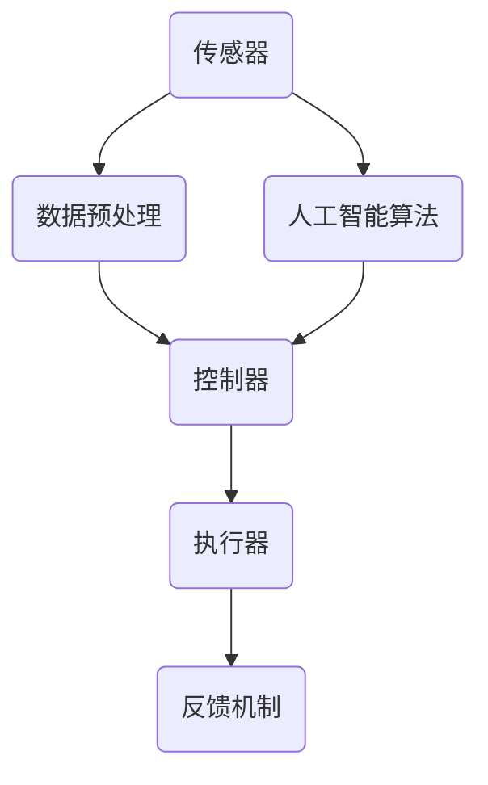

                 

关键词：自动化技术，人工智能，流程优化，工业自动化，智能机器人，软件自动化，云计算，边缘计算，物联网，5G，未来趋势

## 摘要

随着信息技术的飞速发展，自动化技术已经成为现代工业、服务业和日常生活中不可或缺的一部分。本文将深入探讨自动化技术的最新应用与发展方向，分析其在工业、医疗、交通等领域的实际应用案例，并展望其未来发展趋势和面临的挑战。通过本文的阅读，读者可以全面了解自动化技术的发展历程、核心概念、关键算法以及未来的创新机会。

## 1. 背景介绍

自动化技术的历史可以追溯到20世纪初期，随着工业革命的发展，自动机械逐渐取代了传统的人工劳动。从最初的流水线生产到现代的智能工厂，自动化技术在不断演进中，成为推动社会进步的重要力量。随着计算机技术和人工智能的崛起，自动化技术进入了全新的发展阶段，其应用范围和深度不断拓展。

近年来，自动化技术呈现出以下几个显著趋势：

- **人工智能的融合**：人工智能技术，尤其是机器学习和深度学习，为自动化技术注入了新的活力，使得自动化系统能够更智能地处理复杂任务。
- **边缘计算的兴起**：随着物联网设备的激增，边缘计算逐渐成为自动化技术的重要组成部分，能够在靠近数据源的地方进行实时处理，降低延迟。
- **云计算的普及**：云计算技术为自动化系统提供了强大的计算和存储能力，使得分布式计算和协同工作成为可能。
- **5G技术的助力**：5G网络的低延迟和高带宽特性，为自动化技术的实时通信和高效数据传输提供了基础。

## 2. 核心概念与联系

### 2.1 自动化技术的核心概念

自动化技术涉及多个核心概念，包括传感器、控制器、执行器、人工智能算法等。这些概念相互作用，共同构成了自动化系统的基本架构。

- **传感器**：用于感知环境信息的装置，如温度传感器、压力传感器等。
- **控制器**：接收传感器数据，根据预设程序或算法做出决策，并通过执行器来控制物理系统。
- **执行器**：根据控制器的指令，实现物理动作的装置，如电机、液压缸等。
- **人工智能算法**：用于优化控制器决策过程，提高自动化系统的自适应能力和智能水平。

### 2.2 自动化系统的架构图

以下是一个自动化系统的简化架构图，使用Mermaid流程图来表示：



在这个架构图中，传感器收集环境数据，经过预处理后发送给控制器。控制器根据数据和分析结果，通过执行器对物理系统进行操作，并通过反馈机制调整控制策略。人工智能算法则对控制器提供智能化的辅助决策。

## 3. 核心算法原理 & 具体操作步骤

### 3.1 算法原理概述

自动化技术的核心算法主要包括机器学习算法、深度学习算法和强化学习算法。这些算法在不同场景下有着广泛的应用。

- **机器学习算法**：通过训练模型来识别数据模式，常见的算法包括线性回归、决策树、支持向量机等。
- **深度学习算法**：基于多层神经网络，通过大量数据训练模型，能够实现图像识别、语音识别等复杂任务，常用的算法包括卷积神经网络（CNN）和循环神经网络（RNN）。
- **强化学习算法**：通过奖励机制来引导算法学习，不断优化决策过程，常见的算法包括Q学习、深度确定性策略梯度（DDPG）等。

### 3.2 算法步骤详解

以深度学习算法为例，其基本步骤如下：

1. **数据收集与预处理**：收集大量相关数据，并进行数据清洗、归一化等预处理操作。
2. **模型设计**：设计深度神经网络结构，包括输入层、隐藏层和输出层。
3. **训练模型**：使用预处理后的数据对模型进行训练，通过反向传播算法不断调整模型参数。
4. **评估模型**：使用验证集和测试集对模型进行评估，确保其性能满足要求。
5. **部署模型**：将训练好的模型部署到自动化系统中，实现实际应用。

### 3.3 算法优缺点

- **机器学习算法**：优点在于模型简单，易于理解和实现；缺点在于对于复杂任务性能有限，且需要大量数据支持。
- **深度学习算法**：优点在于能够处理复杂任务，性能优越；缺点在于模型复杂，训练时间长，对计算资源要求高。
- **强化学习算法**：优点在于能够通过奖励机制不断优化决策过程；缺点在于训练过程复杂，收敛速度慢。

### 3.4 算法应用领域

不同算法在不同领域有着不同的应用：

- **机器学习算法**：广泛应用于图像识别、自然语言处理等领域，如人脸识别、文本分类等。
- **深度学习算法**：广泛应用于图像识别、语音识别、推荐系统等领域，如自动驾驶、智能音箱等。
- **强化学习算法**：广泛应用于游戏、机器人控制等领域，如电子游戏、无人机导航等。

## 4. 数学模型和公式 & 详细讲解 & 举例说明

### 4.1 数学模型构建

自动化技术中的数学模型通常包括输入层、隐藏层和输出层。以下是一个简单的线性回归模型的数学表示：

$$
y = \beta_0 + \beta_1 \cdot x
$$

其中，$y$ 是输出变量，$x$ 是输入变量，$\beta_0$ 和 $\beta_1$ 是模型参数。

### 4.2 公式推导过程

以线性回归模型为例，其推导过程如下：

1. **假设**：假设数据集 $D = \{ (x_1, y_1), (x_2, y_2), \ldots, (x_n, y_n) \}$ 满足线性关系 $y = \beta_0 + \beta_1 \cdot x$。
2. **最小化平方误差**：为了最小化预测值与实际值之间的误差，我们定义平方误差函数：
   $$
   J(\beta_0, \beta_1) = \sum_{i=1}^{n} (y_i - (\beta_0 + \beta_1 \cdot x_i))^2
   $$
3. **求导**：对 $J(\beta_0, \beta_1)$ 分别对 $\beta_0$ 和 $\beta_1$ 求导，并令导数等于0，得到：
   $$
   \frac{\partial J}{\partial \beta_0} = -2 \sum_{i=1}^{n} (y_i - (\beta_0 + \beta_1 \cdot x_i)) = 0
   $$
   $$
   \frac{\partial J}{\partial \beta_1} = -2 \sum_{i=1}^{n} (y_i - (\beta_0 + \beta_1 \cdot x_i)) \cdot x_i = 0
   $$
4. **解方程**：解上述方程，得到 $\beta_0$ 和 $\beta_1$ 的最优值。

### 4.3 案例分析与讲解

以一个简单的线性回归模型为例，假设我们有一个数据集，包含以下数据点：

| $x$ | $y$ |
| --- | --- |
| 1   | 2   |
| 2   | 4   |
| 3   | 6   |

根据线性回归模型，我们希望找到一条直线，使得这条直线与数据点尽可能接近。根据前面的推导过程，我们可以计算出最优的 $\beta_0$ 和 $\beta_1$：

$$
\beta_0 = \frac{\sum_{i=1}^{n} y_i - \beta_1 \cdot \sum_{i=1}^{n} x_i}{n} = \frac{2 + 4 + 6 - 3 \cdot 3}{3} = 1
$$

$$
\beta_1 = \frac{\sum_{i=1}^{n} (y_i - \beta_0) \cdot x_i}{\sum_{i=1}^{n} x_i^2 - n \cdot \bar{x}^2} = \frac{(2 - 1) \cdot 1 + (4 - 1) \cdot 2 + (6 - 1) \cdot 3}{1^2 + 2^2 + 3^2 - 3 \cdot (2)^2} = 1
$$

因此，我们得到线性回归模型：

$$
y = 1 + 1 \cdot x
$$

这条直线与数据点几乎完全重合，说明我们的模型很好地拟合了数据。

## 5. 项目实践：代码实例和详细解释说明

### 5.1 开发环境搭建

为了实现自动化技术的应用，我们需要搭建一个合适的开发环境。以下是一个基本的开发环境搭建步骤：

1. **安装Python**：Python是一种广泛应用于自动化技术开发的编程语言，首先需要安装Python环境。
2. **安装TensorFlow**：TensorFlow是一个开源的深度学习框架，用于实现深度学习算法。
3. **安装NumPy和Pandas**：NumPy和Pandas是Python的常用数据处理库，用于数据处理和统计分析。

### 5.2 源代码详细实现

以下是一个简单的线性回归模型实现代码，使用Python和TensorFlow：

```python
import tensorflow as tf
import numpy as np
import pandas as pd

# 数据集
data = pd.DataFrame({
    'x': [1, 2, 3],
    'y': [2, 4, 6]
})

# 特征和标签
X = data[['x']]
y = data['y']

# 模型参数
W = tf.Variable(0.0, name='weights')
b = tf.Variable(0.0, name='bias')

# 前向传播
y_pred = W * X + b

# 反向传播
loss = tf.reduce_mean(tf.square(y - y_pred))

# 优化器
optimizer = tf.train.GradientDescentOptimizer(learning_rate=0.5)
train_op = optimizer.minimize(loss)

# 训练模型
with tf.Session() as sess:
    sess.run(tf.global_variables_initializer())
    for _ in range(1000):
        _, loss_val = sess.run([train_op, loss])
        if _ % 100 == 0:
            print(f"Step {_}, Loss: {loss_val}")
    
    # 输出模型参数
    W_val, b_val = sess.run([W, b])
    print(f"W: {W_val}, b: {b_val}")

# 预测
X_new = np.array([4])
y_pred_new = W_val * X_new + b_val
print(f"Predicted y: {y_pred_new}")
```

### 5.3 代码解读与分析

上述代码实现了一个简单的线性回归模型，主要包括以下几个部分：

- **数据集**：使用Pandas创建了一个简单的数据集，包含两个特征$x$和$y$。
- **特征和标签**：将数据集拆分为特征矩阵$X$和标签向量$y$。
- **模型参数**：定义了模型参数$W$和$b$，并初始化为0。
- **前向传播**：实现了一个简单的线性模型，通过参数$W$和$b$计算预测值$y_pred$。
- **反向传播**：定义了损失函数$loss$，并使用梯度下降优化器$optimizer$进行反向传播。
- **训练模型**：使用TensorFlow的会话$Session$进行模型训练，并在每个步骤输出损失值。
- **预测**：使用训练好的模型进行预测，输入新的特征$X_new$，输出预测的标签$y_pred$。

### 5.4 运行结果展示

运行上述代码，我们可以看到模型在每次迭代后输出当前的损失值，并在训练完成后输出模型参数$W$和$b$的值。最后，我们可以使用训练好的模型对新的数据点进行预测。

## 6. 实际应用场景

### 6.1 工业自动化

工业自动化是自动化技术的重要应用领域之一，通过引入自动化设备和技术，可以显著提高生产效率、降低成本和提升产品质量。以下是一些工业自动化的实际应用案例：

- **汽车制造**：汽车制造过程中，焊接、涂装、组装等环节大量采用自动化设备，如机器人、自动化流水线等。
- **电子制造**：电子制造业中，自动化设备广泛应用于焊接、装配、检测等环节，如自动贴片机、自动检测机等。
- **食品加工**：食品加工行业中，自动化设备用于加工、包装、检测等环节，如自动化生产线、自动化包装机等。

### 6.2 医疗自动化

医疗自动化技术正在迅速发展，通过引入自动化设备和人工智能技术，可以提高医疗诊断和治疗的准确性，提升医疗服务的效率。以下是一些医疗自动化的实际应用案例：

- **医疗影像分析**：利用深度学习算法，对医疗影像进行自动分析和诊断，如肺癌检测、乳腺癌检测等。
- **手术机器人**：手术机器人可以协助医生进行微创手术，提高手术的精度和安全性。
- **药物配送**：自动化仓库和配送系统可以高效地管理药品库存和配送，确保药品的安全性和准确性。

### 6.3 交通自动化

交通自动化技术旨在提高交通系统的运行效率、降低交通事故率和环境污染。以下是一些交通自动化的实际应用案例：

- **自动驾驶**：自动驾驶技术已经在部分地区得到应用，如自动驾驶出租车、自动驾驶卡车等。
- **智能交通信号控制系统**：通过引入自动化交通信号控制系统，可以优化交通流，减少拥堵和排放。
- **无人机配送**：无人机配送系统可以在短时间内快速配送物品，适用于紧急配送和偏远地区的物流服务。

### 6.4 未来应用展望

未来，自动化技术将在更广泛的领域得到应用，为人类社会带来更多的便利和效率。以下是一些未来自动化技术的应用展望：

- **智能家居**：智能家居系统将更加智能化，实现家电的自动控制和远程监控，提升生活质量。
- **智能农业**：智能农业技术将利用传感器、无人机和自动化设备，实现精准农业，提高农作物产量和质量。
- **智慧城市**：智慧城市将整合各种自动化技术，实现城市管理的智能化和高效化，提高居民的生活质量。

## 7. 工具和资源推荐

### 7.1 学习资源推荐

- **《深度学习》**：由Ian Goodfellow、Yoshua Bengio和Aaron Courville合著，是深度学习的经典教材。
- **《Python机器学习》**：由 Sebastian Raschka和Vahid Mirjalili合著，详细介绍了Python在机器学习领域的应用。
- **《人工智能：一种现代方法》**：由 Stuart Russell和Peter Norvig合著，全面介绍了人工智能的基础理论和应用。

### 7.2 开发工具推荐

- **TensorFlow**：谷歌开发的开源深度学习框架，适用于各种深度学习应用。
- **PyTorch**：Facebook开发的开源深度学习框架，具有良好的灵活性和易用性。
- **Keras**：基于TensorFlow和Theano的开源深度学习库，简化了深度学习模型的构建和训练。

### 7.3 相关论文推荐

- **"Deep Learning for Autonomous Driving"**：介绍了深度学习在自动驾驶中的应用。
- **"Reinforcement Learning: An Introduction"**：介绍了强化学习的基本理论和应用。
- **"Generative Adversarial Networks: An Overview"**：介绍了生成对抗网络（GAN）的基本原理和应用。

## 8. 总结：未来发展趋势与挑战

### 8.1 研究成果总结

自动化技术在过去几十年取得了显著的进展，从简单的机械自动化到复杂的智能自动化，应用范围不断扩大。人工智能技术的融入，使得自动化系统更加智能和高效。在工业、医疗、交通等领域，自动化技术已经展现出巨大的潜力。

### 8.2 未来发展趋势

未来，自动化技术将继续向以下几个方向发展：

- **人工智能的深度融合**：随着人工智能技术的不断进步，自动化系统将更加智能，能够自主学习和适应环境。
- **边缘计算的应用**：随着物联网设备的普及，边缘计算将成为自动化技术的重要支撑，实现实时数据处理和决策。
- **5G技术的助力**：5G网络的低延迟和高带宽特性，将为自动化系统的实时通信和高效数据传输提供保障。
- **智能制造的发展**：智能制造将推动自动化技术在工业领域的广泛应用，实现生产过程的智能化和高效化。

### 8.3 面临的挑战

尽管自动化技术取得了显著进展，但仍面临以下挑战：

- **数据安全和隐私**：自动化系统需要处理大量的敏感数据，如何确保数据安全和用户隐私成为一个重要问题。
- **技术标准和规范**：自动化技术的发展需要制定统一的技术标准和规范，以确保系统的兼容性和互操作性。
- **人才短缺**：自动化技术的快速发展需要大量专业人才，但现有人才储备不足，人才培养和引进成为关键挑战。
- **伦理和社会问题**：自动化技术的广泛应用可能会引发伦理和社会问题，如失业、隐私泄露等，需要引起重视。

### 8.4 研究展望

未来，自动化技术将在更多领域得到应用，为人类社会带来更多便利和效率。同时，也需要关注其带来的挑战，通过技术创新和制度保障，实现自动化技术的可持续发展。

## 9. 附录：常见问题与解答

### 9.1 什么是自动化技术？

自动化技术是指利用计算机技术、人工智能等技术，实现机器对环境的自动感知、自动决策和自动执行的技术。

### 9.2 自动化技术有哪些应用领域？

自动化技术的应用领域广泛，包括工业自动化、医疗自动化、交通自动化、智能家居等。

### 9.3 自动化技术与人工智能有什么关系？

自动化技术是人工智能在工业、交通、医疗等领域的具体应用，而人工智能则为自动化技术提供了更智能的决策和支持。

### 9.4 未来自动化技术有哪些发展趋势？

未来自动化技术将向人工智能的深度融合、边缘计算的应用、5G技术的助力、智能制造的发展等方向发展。

### 9.5 自动化技术面临哪些挑战？

自动化技术面临数据安全和隐私、技术标准和规范、人才短缺、伦理和社会问题等挑战。

## 参考文献

- Goodfellow, I., Bengio, Y., & Courville, A. (2016). *Deep Learning*. MIT Press.
- Raschka, S., & Mirjalili, V. (2018). *Python Machine Learning*. Packt Publishing.
- Russell, S., & Norvig, P. (2020). *Artificial Intelligence: A Modern Approach*. Pearson Education.

### 附录二：相关链接

- [TensorFlow官网](https://www.tensorflow.org/)
- [PyTorch官网](https://pytorch.org/)
- [Keras官网](https://keras.io/)
- [《深度学习》在线资源](https://www.deeplearningbook.org/)
- [《人工智能：一种现代方法》在线资源](https://www.ai-decisionmaking.com/)

