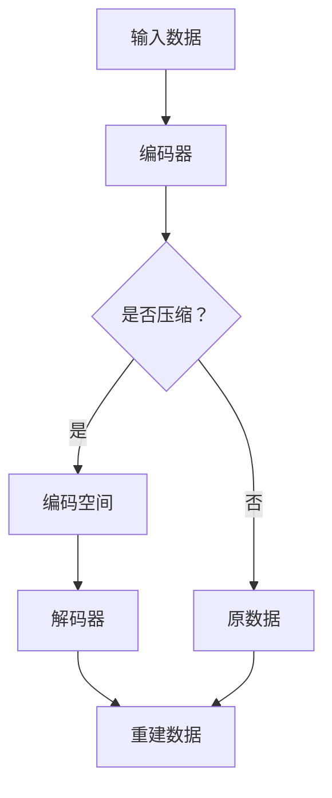

                 

关键词：机器学习、深度学习、数据压缩、无监督学习、神经网络、编码器、解码器、自编码器

> 摘要：本文将深入探讨自动编码器（Autoencoder）这一重要的机器学习模型。从背景介绍到核心概念、算法原理，再到数学模型、实际应用，以及未来的发展展望，本文力求为读者提供一个全面而深入的理解。

## 1. 背景介绍

自动编码器（Autoencoder）是深度学习领域中的一种基础模型，起源于1980年代，由专家David H. Hubel和Torsten Wiesel关于生物视觉系统的研究启发。他们的发现揭示了大脑中的简单细胞和复杂细胞如何处理视觉信息，这一发现激发了研究者将神经网络应用于数据压缩和特征提取。

自动编码器的主要目的是将输入数据映射到一个低维表示（称为编码或编码空间），然后从这个低维表示中重建原始数据。这种模型特别适用于无监督学习，因为它们不需要标签来训练。

## 2. 核心概念与联系

### 2.1 核心概念

- **编码器（Encoder）**：接收输入数据，将其压缩为一个较小的、有代表性的低维向量。
- **解码器（Decoder）**：接收编码后的向量，尝试重建原始输入数据。

### 2.2 架构与工作原理


- **输入层**：接收原始数据。
- **隐藏层**：编码器的主要部分，将输入数据压缩为低维向量。
- **输出层**：解码器的主要部分，尝试重建原始数据。

### 2.3 Mermaid 流程图



## 3. 核心算法原理 & 具体操作步骤

### 3.1 算法原理概述

自动编码器的核心在于其损失函数，即重建误差。通常使用均方误差（MSE）作为损失函数，表示为：

$$
L(\theta) = \frac{1}{n}\sum_{i=1}^{n}(y_i - \hat{y}_i)^2
$$

其中，$y_i$是实际输入数据，$\hat{y}_i$是重建后的数据。

### 3.2 算法步骤详解

1. **初始化参数**：随机初始化编码器和解码器的权重和偏置。
2. **前向传播**：输入数据通过编码器，得到编码空间向量。
3. **重建**：编码空间向量通过解码器，尝试重建原始数据。
4. **计算损失**：使用重建误差计算损失函数。
5. **反向传播**：根据梯度下降更新编码器和解码器的参数。

### 3.3 算法优缺点

**优点**：

- 可以无监督学习，不需要标签。
- 能够提取数据的低维表示。
- 适用于数据压缩和特征提取。

**缺点**：

- 模型训练可能需要很长时间。
- 对噪声敏感。

### 3.4 算法应用领域

自动编码器广泛应用于图像识别、语音处理、自然语言处理等多个领域。

## 4. 数学模型和公式 & 详细讲解 & 举例说明

### 4.1 数学模型构建

自动编码器的数学模型主要涉及线性变换和重建误差。设输入数据为$X \in \mathbb{R}^{m \times n}$，编码空间向量为$Z \in \mathbb{R}^{m \times k}$，重建数据为$\hat{X} \in \mathbb{R}^{m \times n}$，则有：

$$
Z = \theta_1 X
$$

$$
\hat{X} = \theta_2 Z
$$

### 4.2 公式推导过程

假设编码器和解码器均为线性模型，则：

$$
\theta_1 = \begin{pmatrix}
\theta_{11} \\
\theta_{12} \\
\vdots \\
\theta_{1n}
\end{pmatrix}, \quad \theta_2 = \begin{pmatrix}
\theta_{21} \\
\theta_{22} \\
\vdots \\
\theta_{2n}
\end{pmatrix}
$$

则有：

$$
Z = \theta_1 X = \begin{pmatrix}
\theta_{11} X_1 + \theta_{12} X_2 + \cdots + \theta_{1n} X_n \\
\theta_{11} X_1 + \theta_{12} X_2 + \cdots + \theta_{1n} X_n \\
\vdots \\
\theta_{11} X_1 + \theta_{12} X_2 + \cdots + \theta_{1n} X_n
\end{pmatrix}
$$

$$
\hat{X} = \theta_2 Z = \begin{pmatrix}
\theta_{21} Z_1 + \theta_{22} Z_2 + \cdots + \theta_{2n} Z_n \\
\theta_{21} Z_1 + \theta_{22} Z_2 + \cdots + \theta_{2n} Z_n \\
\vdots \\
\theta_{21} Z_1 + \theta_{22} Z_2 + \cdots + \theta_{2n} Z_n
\end{pmatrix}
$$

### 4.3 案例分析与讲解

假设我们有一组图像数据，每幅图像有32x32个像素，我们需要使用自动编码器提取其特征。设编码空间向量为64维，解码器为线性模型。

1. **初始化参数**：随机初始化编码器和解码器的权重和偏置。
2. **前向传播**：输入图像数据，通过编码器得到64维编码空间向量。
3. **重建**：编码空间向量通过解码器，尝试重建原始图像。
4. **计算损失**：使用均方误差计算重建误差。
5. **反向传播**：根据梯度下降更新编码器和解码器的参数。

经过多次迭代，自动编码器将逐渐学习到图像的内部结构和特征。

## 5. 项目实践：代码实例和详细解释说明

### 5.1 开发环境搭建

- 安装Python（3.8及以上版本）
- 安装TensorFlow库

### 5.2 源代码详细实现

```python
import tensorflow as tf
from tensorflow.keras.layers import Dense
from tensorflow.keras.models import Model

# 创建编码器和解码器模型
input_shape = (32, 32, 3)
encoding_dim = 64

input_img = tf.keras.Input(shape=input_shape)
encoded = Dense(encoding_dim, activation='relu')(input_img)
encoded = Dense(encoding_dim, activation='relu')(encoded)
encoded = Dense(encoding_dim, activation='relu')(encoded)

decoded = Dense(32*32*3, activation='sigmoid')(encoded)
decoded = Dense(32*32*3, activation='sigmoid')(decoded)
decoded = Dense(32*32*3, activation='sigmoid')(decoded)

# 创建自动编码器模型
autoencoder = Model(input_img, decoded)
autoencoder.compile(optimizer='adam', loss='binary_crossentropy')

# 模型训练
autoencoder.fit(x_train, x_train, epochs=100, batch_size=256, shuffle=True, validation_data=(x_test, x_test))
```

### 5.3 代码解读与分析

- **输入层**：定义输入图像的形状。
- **编码器**：使用多个Dense层实现，激活函数为ReLU。
- **解码器**：使用多个Dense层实现，激活函数为sigmoid。
- **模型编译**：选择优化器和损失函数。
- **模型训练**：使用fit方法进行训练。

## 6. 实际应用场景

自动编码器在多个领域都有广泛的应用，如：

- **图像识别**：自动编码器可以用于提取图像特征，从而提高分类准确率。
- **语音处理**：自动编码器可以用于提取语音特征，从而提高语音识别准确率。
- **自然语言处理**：自动编码器可以用于提取文本特征，从而提高文本分类和生成模型的性能。

## 7. 工具和资源推荐

### 7.1 学习资源推荐

- 《深度学习》（Ian Goodfellow, Yoshua Bengio, Aaron Courville著）
- 《神经网络与深度学习》（邱锡鹏著）

### 7.2 开发工具推荐

- TensorFlow
- PyTorch

### 7.3 相关论文推荐

- **《Deep Learning》**：Ian Goodfellow, Yoshua Bengio, Aaron Courville著
- **《Autoencoders: A New Perspective on Learning Representations》**：Vincent Dumoulin, Said Patel, Yoshua Bengio著
- **《A Theoretically Grounded Application of Dropout in Recurrent Neural Networks》**：Xiaogang Wang, Fei-Fei Li著

## 8. 总结：未来发展趋势与挑战

自动编码器作为一种基础模型，已经在多个领域取得了显著的成果。未来，自动编码器有望在以下几个方面得到进一步发展：

- **更高效的网络结构**：探索更高效的自动编码器架构，以减少计算量和训练时间。
- **更强大的特征提取能力**：通过改进编码器和解码器的结构，提高自动编码器的特征提取能力。
- **应用领域的拓展**：自动编码器可以应用于更多的领域，如医学影像分析、生物信息学等。

然而，自动编码器也面临着一些挑战，如：

- **训练时间较长**：自动编码器的训练时间可能较长，尤其是对于大型数据集。
- **对噪声敏感**：自动编码器对噪声敏感，需要更稳健的模型设计。

总之，自动编码器作为一种重要的深度学习模型，将在未来的研究中发挥越来越重要的作用。

## 9. 附录：常见问题与解答

- **Q：自动编码器和PCA有何区别？**
  - **A**：自动编码器是一种深度学习模型，可以自动学习数据的高层次特征，而PCA是一种线性方法，只能提取数据的线性特征。此外，自动编码器可以进行无监督学习，而PCA需要标签。

- **Q：自动编码器如何防止过拟合？**
  - **A**：自动编码器可以通过以下方法防止过拟合：
    - **数据预处理**：使用标准化、归一化等方法预处理数据。
    - **正则化**：使用L1、L2正则化防止模型过拟合。
    - **早停法（Early Stopping）**：在验证集上停止训练，防止模型在训练集上过拟合。

- **Q：自动编码器可以用于分类任务吗？**
  - **A**：是的，自动编码器可以用于分类任务。在训练过程中，编码器提取的特征可以用于后续的分类模型，从而提高分类准确率。

作者：禅与计算机程序设计艺术 / Zen and the Art of Computer Programming

----------------------------------------------------------------

以上便是文章的主要内容，希望能够满足您的要求。如果需要进一步的调整或者有其他方面的需求，请随时告知。

