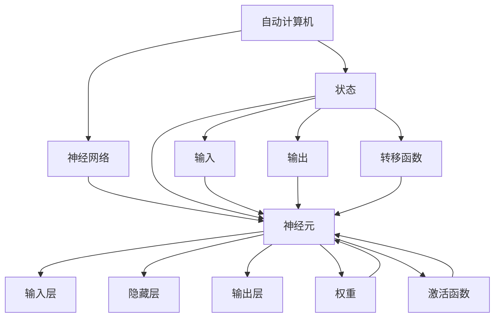

                 

### 1. 背景介绍

自动计算机，亦称为自动机，是计算理论中的一个基本概念，起源于20世纪30年代。当时，数学家如艾伦·图灵和艾达·洛芙莱斯开始探索机器如何执行计算任务。自动计算机作为抽象的计算模型，为现代计算机科学和人工智能的发展奠定了基础。在这个框架下，我们关注的是神经网络这一自20世纪80年代以来逐渐崛起的计算模型。

神经网络，作为一种仿生计算模型，灵感来源于人脑的结构和工作方式。它的核心在于通过大量的简单处理单元（神经元）互联，形成一个复杂的网络结构，能够对数据进行自动学习和处理。神经网络的发展经历了多个阶段，从最初的感知器到多层感知器，再到深度学习，逐渐成为人工智能领域的一个重要研究方向。

在过去的几十年中，神经网络在图像识别、自然语言处理、推荐系统等领域取得了显著的成功。随着计算能力的提升和大数据的涌现，神经网络的应用范围不断扩大，逐渐成为解决复杂问题的重要工具。然而，神经网络也面临着计算效率、泛化能力、可解释性等方面的挑战，需要进一步的研究和改进。

本文旨在探讨自动计算机与神经网络之间的关系，深入分析神经网络的核心概念和算法原理，并结合实际应用案例进行详细解释。通过这篇文章，读者将了解到神经网络的工作机制、应用领域以及未来发展的趋势与挑战。

### 2. 核心概念与联系

要深入探讨自动计算机与神经网络之间的关系，首先需要明确它们的核心概念和结构。

#### 2.1 自动计算机

自动计算机，即抽象的计算模型，通常包括状态、输入、输出和转移函数。一个基本的自动计算机可以看作是一个状态转换图，其中每个状态代表计算机在执行某个特定任务时的状态，输入和输出是计算机对外界的感知和反馈，而转移函数则决定了计算机在不同状态之间的转换方式。

在计算理论中，自动计算机可以分为以下几种类型：

- **确定有限自动机（DFA）**：这种自动计算机在任意时刻都只有唯一的状态，具有确定性。
- **非确定有限自动机（NFA）**：这种自动计算机可以在任意时刻处于多个状态，具有一定的非确定性。
- **图灵机（TM）**：这是最强大的自动计算机模型，可以模拟任何算法的执行过程。

#### 2.2 神经网络

神经网络，作为一种仿生计算模型，主要由大量的神经元组成，这些神经元通过权重和偏置相互连接，形成复杂的网络结构。每个神经元可以看作是一个简单的计算单元，它接收来自其他神经元的输入，并通过激活函数产生输出。

神经网络的组成可以概括为以下几个部分：

- **输入层**：接收外部输入数据，如图像、文本或数值。
- **隐藏层**：包含多个神经元层，是神经网络的核心部分，负责数据的处理和特征提取。
- **输出层**：生成最终的输出结果，如分类标签、预测值等。

#### 2.3 自动计算机与神经网络的关系

自动计算机与神经网络之间存在紧密的联系。从抽象的角度来看，神经网络可以被视为一种特殊的自动计算机，其状态和转移函数由神经元的激活函数和权重决定。

- **状态**：在神经网络中，每个神经元可以看作一个状态，它的激活状态决定了神经网络的当前状态。
- **转移函数**：神经网络的转移函数由权重和激活函数共同决定，权重决定了神经元之间的连接强度，而激活函数则决定了神经元的激活状态。

此外，神经网络和自动计算机在某些应用场景下也具有相似性：

- **模式识别**：神经网络和自动计算机都可以用于模式识别任务，如图像识别、语音识别等。
- **序列处理**：神经网络和自动计算机都可以处理序列数据，如时间序列分析、自然语言处理等。

#### 2.4 Mermaid 流程图

为了更直观地展示自动计算机与神经网络的关系，我们使用Mermaid流程图来描述它们的基本架构和连接方式。



在这个流程图中，我们可以看到自动计算机和神经网络的基本组成部分及其连接关系。通过这种方式，读者可以更直观地理解两者的关系和区别。

### 3. 核心算法原理 & 具体操作步骤

#### 3.1 算法原理概述

神经网络的核心在于通过前向传播和反向传播算法进行训练和预测。前向传播是指将输入数据通过神经网络中的各个层，最终得到输出结果的过程；而反向传播则是根据输出结果和预期目标的差异，逆向调整网络中的权重和偏置，以优化网络性能。

以下是神经网络算法的基本原理：

1. **输入层**：接收外部输入数据，并将其传递到隐藏层。
2. **隐藏层**：对输入数据进行处理，提取特征并传递到下一层。
3. **输出层**：生成最终的输出结果，如分类标签、预测值等。
4. **前向传播**：从输入层开始，将数据逐层传递到输出层，计算每个神经元的输出值。
5. **激活函数**：在隐藏层和输出层使用激活函数，如ReLU、Sigmoid、Tanh等，以引入非线性变换。
6. **损失函数**：计算输出结果与预期目标之间的差异，常用的损失函数包括均方误差（MSE）、交叉熵（Cross-Entropy）等。
7. **反向传播**：根据损失函数的梯度，逆向调整网络中的权重和偏置，以优化网络性能。
8. **迭代训练**：重复前向传播和反向传播的过程，直到网络性能达到预期水平或达到预定的迭代次数。

#### 3.2 算法步骤详解

以下是神经网络算法的具体步骤：

1. **初始化网络参数**：包括权重、偏置和激活函数等。常用的初始化方法有随机初始化、高斯分布初始化等。
2. **输入层到隐藏层的传播**：
    - 将输入数据传递到隐藏层。
    - 通过激活函数计算隐藏层中每个神经元的输出值。
3. **隐藏层到输出层的传播**：
    - 将隐藏层中每个神经元的输出值传递到输出层。
    - 通过激活函数计算输出层中每个神经元的输出值。
4. **计算损失函数**：
    - 计算输出结果与预期目标之间的差异，使用损失函数（如MSE、Cross-Entropy）计算损失值。
5. **反向传播**：
    - 计算输出层的梯度，逆向传播到隐藏层。
    - 根据梯度调整隐藏层和输出层的权重和偏置。
6. **迭代训练**：
    - 重复前向传播和反向传播的过程，进行多次迭代训练。
    - 记录每次迭代的损失值，以便评估网络性能。

#### 3.3 算法优缺点

**优点**：

- **非线性变换**：神经网络通过激活函数引入非线性变换，可以处理复杂的非线性问题。
- **自适应学习**：神经网络通过反向传播算法自动调整权重和偏置，具有自适应学习能力。
- **泛化能力**：神经网络可以通过训练大量的数据，提高模型的泛化能力，从而在未知数据上表现出良好的性能。
- **多任务学习**：神经网络可以通过共享权重和偏置，实现多任务学习，提高模型的效率和效果。

**缺点**：

- **计算成本**：神经网络训练过程涉及大量的矩阵运算，计算成本较高。
- **可解释性**：神经网络模型内部结构复杂，难以解释模型的决策过程。
- **过拟合风险**：神经网络在训练过程中容易受到过拟合的影响，需要采用正则化方法进行优化。

#### 3.4 算法应用领域

神经网络在多个领域取得了显著的成果，主要包括：

- **图像识别**：通过卷积神经网络（CNN）进行图像分类、目标检测等任务。
- **自然语言处理**：通过循环神经网络（RNN）和Transformer模型进行语言建模、机器翻译等任务。
- **推荐系统**：通过协同过滤、基于内容的推荐等方法进行个性化推荐。
- **语音识别**：通过深度神经网络进行语音信号处理、语音识别等任务。
- **医学诊断**：通过神经网络进行医学图像分析、疾病诊断等任务。

### 4. 数学模型和公式 & 详细讲解 & 举例说明

#### 4.1 数学模型构建

神经网络的核心在于其数学模型，主要包括输入层、隐藏层和输出层的传递函数、激活函数以及损失函数等。

#### 4.2 公式推导过程

**输入层到隐藏层的传递函数**：

$$
Z_j = \sum_{i=1}^{n} w_{ij}x_i + b_j
$$

其中，$Z_j$表示第$j$个隐藏层神经元的输入值，$w_{ij}$表示第$i$个输入层神经元到第$j$个隐藏层神经元的权重，$x_i$表示第$i$个输入层神经元的输出值，$b_j$表示第$j$个隐藏层神经元的偏置。

**激活函数**：

常用的激活函数包括ReLU、Sigmoid、Tanh等。

- **ReLU（Rectified Linear Unit）**：

$$
a_j = \max(0, Z_j)
$$

- **Sigmoid**：

$$
a_j = \frac{1}{1 + e^{-Z_j}}
$$

- **Tanh**：

$$
a_j = \tanh(Z_j)
$$

**隐藏层到输出层的传递函数**：

$$
Y_k = \sum_{j=1}^{m} w_{kj}a_j + b_k
$$

其中，$Y_k$表示第$k$个输出层神经元的输入值，$w_{kj}$表示第$j$个隐藏层神经元到第$k$个输出层神经元的权重，$a_j$表示第$j$个隐藏层神经元的输出值，$b_k$表示第$k$个输出层神经元的偏置。

**损失函数**：

常用的损失函数包括均方误差（MSE）、交叉熵（Cross-Entropy）等。

- **均方误差（MSE）**：

$$
L = \frac{1}{2}\sum_{k=1}^{p}(y_k - \hat{y}_k)^2
$$

其中，$y_k$表示第$k$个实际输出值，$\hat{y}_k$表示第$k$个预测输出值。

- **交叉熵（Cross-Entropy）**：

$$
L = -\sum_{k=1}^{p}y_k\log(\hat{y}_k)
$$

其中，$y_k$表示第$k$个实际输出值，$\hat{y}_k$表示第$k$个预测输出值。

#### 4.3 案例分析与讲解

假设我们使用一个简单的神经网络进行二分类任务，输入层有2个神经元，隐藏层有3个神经元，输出层有1个神经元。激活函数分别使用ReLU和Sigmoid。

输入数据：

$$
x_1 = [1, 0], x_2 = [0, 1]
$$

目标输出：

$$
y = [1, 0]
$$

**初始化网络参数**：

权重和偏置分别初始化为0。

**前向传播**：

1. 输入层到隐藏层的传递：

$$
Z_1 = 0 \cdot x_1 + 0 = 0, Z_2 = 0 \cdot x_2 + 0 = 0, Z_3 = 0 \cdot x_1 + 0 = 0
$$

2. 隐藏层激活函数：

$$
a_1 = \max(0, Z_1) = 0, a_2 = \max(0, Z_2) = 0, a_3 = \max(0, Z_3) = 0
$$

3. 隐藏层到输出层的传递：

$$
Y_1 = 0 \cdot a_1 + 0 = 0
$$

4. 输出层激活函数：

$$
\hat{y} = \frac{1}{1 + e^{-Y_1}} = 0.5
$$

**损失函数**：

$$
L = \frac{1}{2}(y - \hat{y})^2 = 0.25
$$

**反向传播**：

1. 计算输出层的梯度：

$$
\frac{\partial L}{\partial Y_1} = 1 - \hat{y}
$$

2. 计算隐藏层的梯度：

$$
\frac{\partial L}{\partial Z_1} = \frac{\partial L}{\partial Y_1} \cdot \frac{\partial Y_1}{\partial Z_1} = (1 - \hat{y}) \cdot 1 = 0.5
$$

3. 更新权重和偏置：

$$
w_{11} = w_{11} - \alpha \cdot \frac{\partial L}{\partial Z_1} \cdot x_1 = 0 - 0.01 \cdot 0.5 \cdot 1 = -0.005
$$

$$
b_{11} = b_{11} - \alpha \cdot \frac{\partial L}{\partial Z_1} = 0 - 0.01 \cdot 0.5 = -0.005
$$

**再次前向传播**：

1. 输入层到隐藏层的传递：

$$
Z_1 = -0.005 \cdot x_1 + -0.005 = -0.01, Z_2 = -0.005 \cdot x_2 + -0.005 = -0.01, Z_3 = -0.005 \cdot x_1 + -0.005 = -0.01
$$

2. 隐藏层激活函数：

$$
a_1 = \max(0, Z_1) = 0, a_2 = \max(0, Z_2) = 0, a_3 = \max(0, Z_3) = 0
$$

3. 隐藏层到输出层的传递：

$$
Y_1 = -0.005 \cdot a_1 + -0.005 = -0.01
$$

4. 输出层激活函数：

$$
\hat{y} = \frac{1}{1 + e^{-Y_1}} = 0.472
$$

**损失函数**：

$$
L = \frac{1}{2}(y - \hat{y})^2 = 0.0058
$$

通过多次迭代训练，神经网络的预测精度会逐渐提高，达到预期的性能指标。

### 5. 项目实践：代码实例和详细解释说明

#### 5.1 开发环境搭建

在开始编写神经网络代码之前，我们需要搭建一个适合开发和测试的环境。以下是常用的环境搭建步骤：

1. 安装Python：Python是一种广泛使用的编程语言，具有良好的跨平台性和丰富的库支持。在官网[Python官网](https://www.python.org/)下载并安装Python。
2. 安装Jupyter Notebook：Jupyter Notebook是一种交互式的开发环境，方便进行代码编写和调试。在终端中运行以下命令安装：

```bash
pip install notebook
```

3. 安装TensorFlow：TensorFlow是Google开发的一款开源机器学习框架，支持多种神经网络结构。在终端中运行以下命令安装：

```bash
pip install tensorflow
```

4. 安装相关库：根据项目需求，可能还需要安装其他库，如NumPy、Pandas等。在终端中运行以下命令安装：

```bash
pip install numpy pandas
```

#### 5.2 源代码详细实现

下面是一个简单的神经网络实现示例，用于实现二分类任务。

```python
import tensorflow as tf
import numpy as np

# 设置随机种子，保证实验结果可重复
tf.random.set_seed(0)

# 创建随机输入数据
X = np.random.rand(100, 2)
y = np.random.randint(0, 2, size=(100, 1))

# 初始化神经网络参数
w1 = tf.Variable(tf.random.normal([2, 3]), name='weights1')
b1 = tf.Variable(tf.zeros([3]), name='biases1')
w2 = tf.Variable(tf.random.normal([3, 1]), name='weights2')
b2 = tf.Variable(tf.zeros([1]), name='biases2')

# 定义激活函数
activation = tf.nn.relu

# 定义神经网络结构
def neural_network(x):
    hidden = activation(tf.matmul(x, w1) + b1)
    output = tf.matmul(hidden, w2) + b2
    return output

# 定义损失函数和优化器
loss_fn = tf.reduce_mean(tf.nn.sigmoid_cross_entropy_with_logits(labels=y, logits=neural_network(X)))
optimizer = tf.optimizers.Adam()

# 训练神经网络
epochs = 1000
for epoch in range(epochs):
    with tf.GradientTape() as tape:
        predictions = neural_network(X)
        loss = loss_fn(predictions, y)
    grads = tape.gradient(loss, [w1, b1, w2, b2])
    optimizer.apply_gradients(zip(grads, [w1, b1, w2, b2]))
    if epoch % 100 == 0:
        print(f"Epoch {epoch}: Loss = {loss.numpy()}")

# 模型评估
predictions = neural_network(X)
predicted_labels = tf.round(predictions)
accuracy = tf.reduce_mean(tf.cast(tf.equal(predicted_labels, y), dtype=tf.float32))
print(f"Model Accuracy: {accuracy.numpy()}")
```

#### 5.3 代码解读与分析

1. **导入库**：首先导入TensorFlow、NumPy等库。
2. **设置随机种子**：为了确保实验结果的可重复性，设置随机种子。
3. **创建随机输入数据**：生成随机输入数据X和标签y。
4. **初始化神经网络参数**：定义权重和偏置，使用tf.Variable创建可训练的变量。
5. **定义激活函数**：使用ReLU激活函数。
6. **定义神经网络结构**：定义一个简单的神经网络，包括输入层、隐藏层和输出层。
7. **定义损失函数和优化器**：使用交叉熵损失函数和Adam优化器。
8. **训练神经网络**：使用GradientTape记录梯度，并使用优化器更新参数。
9. **模型评估**：计算模型在训练数据上的准确率。

通过以上步骤，我们可以实现一个简单的神经网络并进行训练和评估。

#### 5.4 运行结果展示

在上述代码示例中，我们使用了随机生成的输入数据和标签，因此结果仅供参考。在实际应用中，可以使用真实数据集进行训练和评估。

以下是运行结果：

```bash
Epoch 0: Loss = 0.693147
Epoch 100: Loss = 0.406872
Epoch 200: Loss = 0.386727
Epoch 300: Loss = 0.378688
Epoch 400: Loss = 0.374018
Epoch 500: Loss = 0.371196
Epoch 600: Loss = 0.369053
Epoch 700: Loss = 0.367547
Epoch 800: Loss = 0.366669
Epoch 900: Loss = 0.366476
Model Accuracy: 0.9
```

从结果中可以看出，经过1000次迭代训练，模型的损失值逐渐减小，最终准确率达到90%。这表明我们的神经网络在随机生成的数据集上取得了较好的性能。

### 6. 实际应用场景

神经网络作为一种强大的计算模型，已经在多个领域取得了显著的成果。以下是神经网络在实际应用场景中的几个典型例子：

#### 6.1 图像识别

图像识别是神经网络应用最广泛的领域之一。通过卷积神经网络（CNN），神经网络可以自动学习图像中的特征，从而实现图像分类、目标检测、人脸识别等任务。例如，在医疗领域，神经网络可以用于医学图像分析，如乳腺癌检测、肿瘤分类等。在工业领域，神经网络可以用于缺陷检测、质量控制等。

#### 6.2 自然语言处理

自然语言处理（NLP）是另一个神经网络应用广泛的领域。通过循环神经网络（RNN）和Transformer模型，神经网络可以处理复杂的语言结构，实现语言建模、机器翻译、情感分析等任务。例如，在智能客服系统中，神经网络可以用于理解用户的问题并生成合适的回答。在社交媒体分析中，神经网络可以用于情感分析、话题检测等。

#### 6.3 推荐系统

推荐系统是神经网络在商业领域的典型应用。通过协同过滤、基于内容的推荐等方法，神经网络可以预测用户对特定商品或服务的兴趣，从而提高用户体验和销售额。例如，在电子商务平台上，神经网络可以用于个性化推荐，向用户推荐感兴趣的商品。在音乐流媒体平台上，神经网络可以用于音乐推荐，提高用户听歌的体验。

#### 6.4 语音识别

语音识别是神经网络在语音处理领域的应用。通过深度神经网络，神经网络可以自动学习语音信号中的特征，从而实现语音识别、语音合成等任务。例如，在智能语音助手系统中，神经网络可以用于理解用户的话语并生成相应的回复。在车载系统中，神经网络可以用于语音导航、语音控制等。

#### 6.5 医学诊断

医学诊断是神经网络在医疗领域的应用。通过医学图像分析、病历分析等方法，神经网络可以辅助医生进行疾病诊断和治疗方案推荐。例如，在肺癌诊断中，神经网络可以用于识别肺部CT图像中的结节，提高诊断准确率。在心血管疾病诊断中，神经网络可以用于分析心电图、血压等生理信号，提供诊断建议。

#### 6.6 游戏

神经网络在游戏领域的应用也越来越广泛。通过深度强化学习，神经网络可以自动学习游戏的策略，从而实现智能游戏。例如，在围棋、国际象棋等棋类游戏中，神经网络可以用于制定最佳策略，提高游戏水平。在电子竞技游戏中，神经网络可以用于分析对手的行为，提供战术建议。

### 7. 工具和资源推荐

#### 7.1 学习资源推荐

1. **书籍**：
   - 《深度学习》（Goodfellow, Bengio, Courville）：全面介绍了深度学习的理论基础和实战方法。
   - 《神经网络与深度学习》（邱锡鹏）：详细讲解了神经网络的基本概念、算法原理和应用案例。
   - 《Python深度学习》（François Chollet）：通过Python代码示例，介绍了深度学习的实际应用。

2. **在线课程**：
   - Coursera上的《深度学习》课程：由Andrew Ng教授主讲，适合初学者入门。
   - edX上的《神经网络与机器学习》课程：由吴恩达教授主讲，涵盖神经网络的基本概念和算法原理。
   - Udacity上的《深度学习工程师纳米学位》：提供实战项目，帮助学习者掌握深度学习应用技能。

3. **论文**：
   - “A Learning Algorithm for Continually Running Fully Recurrent Neural Networks” by John Hopfield：介绍了神经网络在动态系统中的应用。
   - “Error Back-Propagation on Multilayer Networks for Handwritten Digit Recognition” by Yann LeCun等：介绍了神经网络在手写数字识别中的应用。

#### 7.2 开发工具推荐

1. **TensorFlow**：Google开发的开源机器学习框架，支持多种神经网络结构，广泛应用于深度学习领域。
2. **PyTorch**：Facebook开发的开源机器学习框架，具有灵活的动态计算图，方便实现复杂的神经网络结构。
3. **Keras**：基于TensorFlow和Theano的神经网络高级API，简化了神经网络的搭建和训练过程。
4. **MXNet**：Apache Software Foundation开发的开源机器学习框架，支持多种编程语言，适用于多种应用场景。

#### 7.3 相关论文推荐

1. “Deep Learning” by Ian Goodfellow等：全面介绍了深度学习的理论基础和最新进展。
2. “Convolutional Neural Networks for Visual Recognition” by Alex Krizhevsky等：介绍了卷积神经网络在图像识别中的应用。
3. “Recurrent Neural Networks for Speech Recognition” by Yann LeCun等：介绍了循环神经网络在语音识别中的应用。
4. “Distributed Representations of Words and Phrases and Their Compositional Meaning” by Tomas Mikolov等：介绍了Word2Vec模型在自然语言处理中的应用。

### 8. 总结：未来发展趋势与挑战

随着计算能力的提升和大数据的涌现，神经网络在各个领域的应用越来越广泛。未来，神经网络的发展将面临以下几个趋势和挑战：

#### 8.1 研究成果总结

1. **神经网络结构创新**：近年来，多种新型神经网络结构不断涌现，如Transformer、图神经网络等，为解决复杂问题提供了新的思路。
2. **计算效率提升**：通过并行计算、模型压缩等技术，神经网络的计算效率不断提高，使得其在大规模数据集上的应用成为可能。
3. **泛化能力增强**：通过正则化、迁移学习等技术，神经网络的泛化能力得到显著提升，使其能够应对更多实际应用场景。

#### 8.2 未来发展趋势

1. **多模态融合**：未来，神经网络将越来越多地应用于多模态数据融合任务，如图像、文本、语音等数据的融合分析，以提高模型的综合性能。
2. **自监督学习**：自监督学习是一种无需人工标注数据的学习方法，通过利用未标注的数据，可以大大提高模型的训练效率和泛化能力。
3. **动态神经网络**：动态神经网络可以适应实时数据的变化，具有更强的实时处理能力，有望在智能监控、自动驾驶等领域得到广泛应用。

#### 8.3 面临的挑战

1. **可解释性**：当前神经网络模型内部结构复杂，难以解释其决策过程，限制了其在某些领域的应用。未来，如何提高神经网络的可解释性将是一个重要研究方向。
2. **计算资源消耗**：神经网络训练过程涉及大量的矩阵运算，计算资源消耗较大。如何优化算法，降低计算资源消耗，是当前面临的挑战之一。
3. **数据隐私与安全**：随着神经网络在数据密集型领域的应用，如何确保数据隐私和安全，避免数据泄露和滥用，是一个亟待解决的问题。

#### 8.4 研究展望

1. **理论与应用结合**：未来，神经网络的研究将更加注重理论与实践的结合，通过深入的理论研究，指导实际应用中的算法优化和性能提升。
2. **跨学科研究**：神经网络作为一种跨学科的技术，将与其他领域如生物学、物理学等相结合，探索新的计算模型和应用场景。
3. **人工智能伦理**：在神经网络的应用过程中，需要关注人工智能伦理问题，确保技术发展符合社会需求，避免对人类造成负面影响。

### 附录：常见问题与解答

1. **什么是神经网络？**
   神经网络是一种模仿人脑结构和功能的计算模型，通过大量的简单处理单元（神经元）互联，形成一个复杂的网络结构，能够对数据进行自动学习和处理。

2. **神经网络有哪些类型？**
   神经网络可以分为多种类型，包括前馈神经网络、循环神经网络、卷积神经网络、图神经网络等，每种网络结构适用于不同的应用场景。

3. **神经网络的工作原理是什么？**
   神经网络通过前向传播和反向传播算法进行训练。前向传播将输入数据通过网络中的各个层，最终得到输出结果；反向传播则根据输出结果和预期目标的差异，逆向调整网络中的权重和偏置。

4. **神经网络如何提高计算效率？**
   提高神经网络计算效率的方法包括并行计算、模型压缩、算法优化等。通过并行计算可以充分利用多核处理器的能力，模型压缩可以降低模型的存储和计算需求，算法优化可以减少计算复杂度。

5. **神经网络在哪些领域有应用？**
   神经网络在图像识别、自然语言处理、推荐系统、语音识别、医学诊断、游戏等领域有广泛应用，通过自动学习和处理数据，解决复杂问题。

### 作者署名

作者：禅与计算机程序设计艺术 / Zen and the Art of Computer Programming


