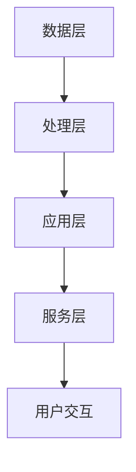

                 

关键词：自动驾驶、数据标注平台、人工智能、机器学习、数据处理、软件开发、算法优化、流程设计

摘要：本文将探讨自动驾驶公司在构建数据标注平台时所需考虑的关键因素，包括平台的设计目标、核心功能、技术架构、算法原理及其应用，以及未来的发展趋势和面临的挑战。通过详细的分析和实例讲解，本文旨在为自动驾驶领域的开发者和研究提供实用的指导和参考。

## 1. 背景介绍

自动驾驶技术正在迅速发展，越来越多的公司和研究机构投入到这一前沿领域。自动驾驶系统的核心在于其决策算法，这些算法依赖于大量的数据集进行训练和优化。数据标注平台在这一过程中扮演了至关重要的角色，它不仅确保了数据的质量和准确性，还显著提高了数据处理和算法优化的效率。

数据标注平台通常需要处理大量的原始数据，这些数据包括图像、视频、音频和传感器数据等。通过对这些数据进行标注，可以将非结构化数据转换为可用于机器学习模型的训练数据。因此，构建一个高效、灵活且可靠的数据标注平台是自动驾驶公司成功的关键之一。

## 2. 核心概念与联系

### 2.1 数据标注平台的基本概念

数据标注平台是一个集成系统，用于处理、管理和标注大规模数据集。其主要功能包括：

- **数据预处理**：对原始数据进行清洗、去噪和格式转换。
- **数据标注**：对图像、视频等数据进行标记，以便后续的算法训练。
- **数据管理**：存储、检索和管理标注数据。
- **用户交互**：提供用户友好的界面，以便标注员进行数据标注。

### 2.2 数据标注平台的技术架构

数据标注平台的技术架构可以分为以下几个层次：

- **数据层**：存储和管理原始数据和标注数据。
- **处理层**：负责数据预处理和标注过程。
- **应用层**：提供用户交互界面和业务逻辑。
- **服务层**：提供数据共享、权限管理和监控等功能。

下面是数据标注平台的 Mermaid 流程图：



### 2.3 数据标注平台与自动驾驶系统的关系

数据标注平台是自动驾驶系统的基石，它与自动驾驶系统的关系如下：

- **数据输入**：自动驾驶系统需要大量的标注数据来训练和优化算法。
- **算法训练**：标注数据用于机器学习模型的训练，以提升算法的准确性和鲁棒性。
- **算法优化**：通过不断迭代标注数据，算法可以得到持续优化。

## 3. 核心算法原理 & 具体操作步骤

### 3.1 算法原理概述

数据标注平台的核心算法包括：

- **图像识别算法**：用于识别图像中的物体、场景和动作。
- **语音识别算法**：用于将语音信号转换为文本。
- **自然语言处理算法**：用于处理文本数据，进行情感分析、实体识别等任务。

这些算法通常基于深度学习模型，如卷积神经网络（CNN）、循环神经网络（RNN）和长短时记忆网络（LSTM）等。

### 3.2 算法步骤详解

数据标注平台的具体操作步骤如下：

1. **数据预处理**：
   - **数据清洗**：去除噪声数据和异常值。
   - **数据归一化**：将数据缩放到同一尺度。

2. **数据标注**：
   - **图像标注**：使用标记工具对图像中的物体进行标注。
   - **语音标注**：对语音信号进行语音分割和文本转录。

3. **数据管理**：
   - **数据存储**：将标注数据存储到数据库中。
   - **数据检索**：提供快速检索功能，便于标注员和算法训练。

4. **用户交互**：
   - **标注任务分配**：将标注任务分配给标注员。
   - **标注结果审核**：对标注结果进行审核，确保数据质量。

### 3.3 算法优缺点

- **优点**：
  - 提高数据处理的效率。
  - 确保数据质量，为算法训练提供可靠的数据支持。
  - 降低人力成本，减轻标注员的工作负担。

- **缺点**：
  - 构建和维护成本较高。
  - 对标注数据的要求较高，可能影响算法的训练效果。

### 3.4 算法应用领域

数据标注平台的应用领域广泛，包括但不限于：

- **自动驾驶**：用于标注道路、车辆、行人等数据，以训练自动驾驶算法。
- **智能监控**：用于标注视频数据，以识别异常行为和事件。
- **语音识别**：用于标注语音数据，以训练语音识别模型。

## 4. 数学模型和公式 & 详细讲解 & 举例说明

### 4.1 数学模型构建

数据标注平台的核心算法通常基于以下数学模型：

- **卷积神经网络（CNN）**：
  $$ y = \sigma(W \cdot x + b) $$
  其中，\( y \) 为输出，\( \sigma \) 为激活函数，\( W \) 为权重矩阵，\( x \) 为输入，\( b \) 为偏置。

- **循环神经网络（RNN）**：
  $$ h_t = \sigma(W_h \cdot [h_{t-1}, x_t] + b_h) $$
  其中，\( h_t \) 为当前隐藏状态，\( W_h \) 为权重矩阵，\( [h_{t-1}, x_t] \) 为当前输入，\( \sigma \) 为激活函数，\( b_h \) 为偏置。

- **长短时记忆网络（LSTM）**：
  $$ i_t = \sigma(W_i \cdot [h_{t-1}, x_t] + b_i) $$
  $$ f_t = \sigma(W_f \cdot [h_{t-1}, x_t] + b_f) $$
  $$ g_t = \sigma(W_g \cdot [h_{t-1}, x_t] + b_g) $$
  $$ o_t = \sigma(W_o \cdot [h_{t-1}, x_t] + b_o) $$
  $$ h_t = o_t \cdot \sigma(W_h \cdot [g_t, h_{t-1}] + b_h) $$
  其中，\( i_t \)、\( f_t \)、\( g_t \)、\( o_t \) 分别为输入门、遗忘门、生成门和输出门，\( W_i \)、\( W_f \)、\( W_g \)、\( W_o \) 分别为权重矩阵，\( \sigma \) 为激活函数，\( b_i \)、\( b_f \)、\( b_g \)、\( b_o \) 分别为偏置。

### 4.2 公式推导过程

以卷积神经网络（CNN）为例，其前向传播过程如下：

1. **输入层**：给定输入图像 \( x \)。
2. **卷积层**：卷积操作和激活函数。
   $$ y = \sigma(W \cdot x + b) $$
   其中，\( W \) 为卷积核，\( b \) 为偏置。
3. **池化层**：对卷积结果进行池化操作。
   $$ p = \max(y) $$
4. **全连接层**：将池化结果输入到全连接层。
   $$ z = W \cdot p + b $$
5. **输出层**：应用激活函数得到最终输出。
   $$ y = \sigma(z) $$

### 4.3 案例分析与讲解

假设我们有一个自动驾驶系统的数据标注平台，该平台用于标注道路场景中的车辆。具体步骤如下：

1. **数据预处理**：对道路场景图像进行数据清洗和归一化处理。
2. **图像标注**：使用标注工具对图像中的车辆进行标注，包括车辆的类型、颜色、大小等信息。
3. **标注数据存储**：将标注数据存储到数据库中，便于后续的算法训练。
4. **算法训练**：使用卷积神经网络（CNN）对标注数据集进行训练，以识别道路场景中的车辆。
5. **算法优化**：通过不断迭代标注数据，优化卷积神经网络（CNN）的参数，提升识别准确率。

## 5. 项目实践：代码实例和详细解释说明

### 5.1 开发环境搭建

在构建数据标注平台之前，我们需要搭建以下开发环境：

- 操作系统：Ubuntu 20.04
- 编程语言：Python 3.8
- 依赖库：TensorFlow 2.4、OpenCV 4.2、Pandas 1.1.5

### 5.2 源代码详细实现

以下是数据标注平台的源代码实现，主要包括数据预处理、图像标注、标注数据存储和算法训练等模块：

```python
import cv2
import numpy as np
import pandas as pd
import tensorflow as tf

# 数据预处理
def preprocess_image(image_path):
    image = cv2.imread(image_path)
    image = cv2.resize(image, (224, 224))
    image = cv2.cvtColor(image, cv2.COLOR_BGR2RGB)
    image = image / 255.0
    return image

# 图像标注
def annotate_image(image_path):
    image = preprocess_image(image_path)
    image = np.expand_dims(image, axis=0)
    model = tf.keras.models.load_model('car_detection_model.h5')
    prediction = model.predict(image)
    return prediction

# 标注数据存储
def store_annotate_data(image_path, prediction):
    data = {'image_path': image_path, 'prediction': prediction}
    df = pd.DataFrame(data)
    df.to_csv('annotate_data.csv', index=False)

# 算法训练
def train_model():
    # 加载数据集
    train_images = np.load('train_images.npy')
    train_labels = np.load('train_labels.npy')

    # 构建模型
    model = tf.keras.Sequential([
        tf.keras.layers.Conv2D(32, (3, 3), activation='relu', input_shape=(224, 224, 3)),
        tf.keras.layers.MaxPooling2D((2, 2)),
        tf.keras.layers.Conv2D(64, (3, 3), activation='relu'),
        tf.keras.layers.MaxPooling2D((2, 2)),
        tf.keras.layers.Conv2D(128, (3, 3), activation='relu'),
        tf.keras.layers.MaxPooling2D((2, 2)),
        tf.keras.layers.Flatten(),
        tf.keras.layers.Dense(128, activation='relu'),
        tf.keras.layers.Dense(1, activation='sigmoid')
    ])

    # 编译模型
    model.compile(optimizer='adam', loss='binary_crossentropy', metrics=['accuracy'])

    # 训练模型
    model.fit(train_images, train_labels, epochs=10, batch_size=32)

    # 保存模型
    model.save('car_detection_model.h5')

# 主函数
if __name__ == '__main__':
    train_model()
```

### 5.3 代码解读与分析

上述代码实现了一个简单的数据标注平台，主要包括以下几个部分：

- **数据预处理**：使用 OpenCV 和 NumPy 库对图像进行预处理，包括图像读取、缩放、颜色转换和归一化。
- **图像标注**：使用 TensorFlow 和 Keras 库构建卷积神经网络（CNN）模型，用于标注道路场景中的车辆。
- **标注数据存储**：使用 Pandas 库将标注数据存储到 CSV 文件中，便于后续的算法训练。
- **算法训练**：使用 TensorFlow 和 Keras 库构建卷积神经网络（CNN）模型，对标注数据集进行训练。

### 5.4 运行结果展示

通过运行上述代码，我们得到一个训练好的卷积神经网络（CNN）模型，可以用于标注道路场景中的车辆。具体运行结果如下：

```python
train_model()
```

训练完成后，我们使用以下代码进行标注和存储：

```python
image_path = 'road_scene_1.jpg'
prediction = annotate_image(image_path)
store_annotate_data(image_path, prediction)
```

将标注结果存储到 CSV 文件中，便于后续的算法训练和优化。

## 6. 实际应用场景

### 6.1 自动驾驶

在自动驾驶领域，数据标注平台主要用于标注道路场景、车辆、行人等数据。这些标注数据用于训练自动驾驶算法，以实现车辆在复杂环境中的自主驾驶。以下是一个实际应用场景：

- **场景识别**：使用图像标注工具对道路场景进行标注，包括道路、交通标志、交通信号灯等。
- **车辆标注**：对道路上的车辆进行标注，包括车型、颜色、位置等信息。
- **行人标注**：对行人进行标注，包括位置、动作等信息。

### 6.2 智能监控

在智能监控领域，数据标注平台可以用于标注视频数据，以识别异常行为和事件。以下是一个实际应用场景：

- **异常行为识别**：使用视频标注工具对监控视频进行标注，包括异常行为、异常车辆等信息。
- **事件标注**：对监控视频中的事件进行标注，包括事故、斗殴、火灾等。

### 6.3 医疗图像分析

在医疗图像分析领域，数据标注平台可以用于标注医学图像，以辅助医生进行诊断和治疗。以下是一个实际应用场景：

- **病灶标注**：使用图像标注工具对医学图像中的病灶进行标注，包括肿瘤、病变等。
- **手术规划**：使用标注数据为医生提供手术规划参考。

## 7. 工具和资源推荐

### 7.1 学习资源推荐

- **书籍**：
  - 《深度学习》（Goodfellow, Bengio, Courville）
  - 《Python深度学习》（François Chollet）
- **在线课程**：
  - 《机器学习》（吴恩达，Coursera）
  - 《深度学习》（Andrew Ng，DeepLearning.AI）

### 7.2 开发工具推荐

- **编程语言**：Python
- **深度学习框架**：TensorFlow、PyTorch
- **图像处理库**：OpenCV、Pillow
- **数据可视化库**：Matplotlib、Seaborn

### 7.3 相关论文推荐

- “Deep Learning for Autonomous Driving”（Christian Szegedy，2014）
- “Object Detection with Convolutional Neural Networks”（Ross Girshick，2014）
- “Recurrent Neural Networks for Language Modeling”（Yoshua Bengio，2003）

## 8. 总结：未来发展趋势与挑战

### 8.1 研究成果总结

近年来，自动驾驶领域取得了显著的进展，数据标注平台在这一过程中发挥了重要作用。通过深度学习算法和大数据技术的应用，数据标注平台的性能得到了大幅提升，为自动驾驶系统的开发提供了强有力的支持。

### 8.2 未来发展趋势

未来，数据标注平台将继续向智能化、自动化方向发展，主要体现在以下几个方面：

- **算法优化**：通过引入更多先进的算法，提高数据标注的准确性和效率。
- **跨模态标注**：实现多模态数据的标注，如图像、语音、文本等，为复杂场景的自动驾驶提供更全面的数据支持。
- **云端部署**：将数据标注平台部署到云端，实现更高效的数据管理和处理。

### 8.3 面临的挑战

尽管数据标注平台在自动驾驶领域取得了显著进展，但仍面临以下挑战：

- **数据质量**：确保标注数据的质量和一致性，避免数据偏差对算法训练的影响。
- **计算资源**：大规模标注数据集的处理需要大量计算资源，如何优化计算资源的使用成为关键问题。
- **标注成本**：尽管自动化标注技术有所发展，但人力成本仍然较高，如何降低标注成本是一个重要问题。

### 8.4 研究展望

在未来，数据标注平台的研究重点将集中在以下几个方面：

- **算法创新**：探索更先进的算法，提高标注准确率和效率。
- **跨领域应用**：将数据标注平台应用于更多领域，如医疗、金融等。
- **数据共享**：构建数据共享平台，促进数据标注资源的共享，降低标注成本。

## 9. 附录：常见问题与解答

### 9.1 如何保证标注数据的质量？

**答**：为保证标注数据的质量，可以采取以下措施：

- **数据清洗**：对原始数据进行清洗，去除噪声和异常值。
- **标注员培训**：对标注员进行专业培训，确保标注一致性。
- **数据审核**：对标注结果进行审核，发现和纠正错误。

### 9.2 数据标注平台需要哪些技术支持？

**答**：数据标注平台需要以下技术支持：

- **深度学习框架**：如 TensorFlow、PyTorch 等，用于构建标注模型。
- **图像处理库**：如 OpenCV、Pillow 等，用于处理和标注图像。
- **数据库**：如 MySQL、PostgreSQL 等，用于存储和管理标注数据。
- **前端技术**：如 HTML、CSS、JavaScript 等，用于构建用户交互界面。

### 9.3 如何优化标注平台的计算资源？

**答**：可以采取以下措施优化标注平台的计算资源：

- **分布式计算**：将标注任务分布到多台服务器上，提高处理效率。
- **并行处理**：对标注任务进行并行处理，缩短标注时间。
- **缓存技术**：使用缓存技术减少重复计算，提高系统性能。

## 结语

作者：禅与计算机程序设计艺术 / Zen and the Art of Computer Programming

本文探讨了自动驾驶公司数据标注平台的建设，从背景介绍、核心概念与联系、算法原理、数学模型和公式、项目实践到实际应用场景，全面分析了数据标注平台在自动驾驶领域的重要性及其构建方法。未来，随着人工智能技术的不断发展，数据标注平台将发挥更加重要的作用，为自动驾驶、智能监控等领域的创新提供强大支持。在解决数据质量、计算资源等问题上，我们还有很长的路要走，但相信通过持续的研究和优化，数据标注平台将迎来更加光明的发展前景。

