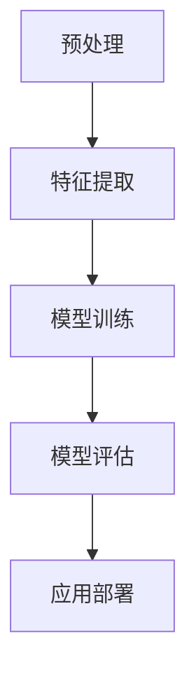

                 

关键词：自然语言处理，创业产品，应用场景，人工智能，深度学习，情感分析，语音识别，机器翻译，聊天机器人

> 摘要：本文将探讨自然语言处理（NLP）在创业产品中的应用场景，从技术原理、具体实现、应用案例等多个角度进行分析，旨在为创业公司提供有价值的参考和指导。

## 1. 背景介绍

随着人工智能技术的不断发展，自然语言处理（NLP）已经成为计算机科学领域的一个重要分支。NLP旨在让计算机理解和处理人类语言，其应用范围涵盖了语音识别、机器翻译、情感分析、文本生成等多个方面。近年来，随着深度学习算法的成熟，NLP技术取得了显著进步，使得创业公司在产品开发过程中能够更好地利用这一技术提升用户体验，增强产品竞争力。

创业产品是指在创业公司环境下开发、运营的软件产品。创业公司通常资源有限，需要在短时间内迅速推出具有竞争力的产品。自然语言处理技术的应用，不仅可以帮助创业公司降低开发成本，还能提升产品功能和用户体验，从而在激烈的市场竞争中脱颖而出。

## 2. 核心概念与联系

### 2.1 核心概念

自然语言处理的核心概念包括：

- **文本表示**：将自然语言文本转化为计算机可以处理的数字形式，如词袋模型、词嵌入等。
- **语言模型**：用于预测下一个单词或词组的概率分布，如n元语法模型、神经网络语言模型等。
- **语法分析**：对自然语言文本进行结构化分析，以理解其语法和语义，如依存句法分析、语义角色标注等。
- **情感分析**：判断文本表达的情感倾向，如正面、负面、中性等。
- **实体识别**：从文本中识别出具有特定意义的实体，如人名、地名、组织名等。

### 2.2 架构联系

自然语言处理的架构通常包括以下几个层次：

1. **预处理**：包括分词、去停用词、词性标注等，用于将原始文本转化为适合NLP处理的格式。
2. **特征提取**：将文本转化为特征向量，如TF-IDF、词嵌入等。
3. **模型训练**：使用训练数据训练NLP模型，如语言模型、分类模型等。
4. **模型评估与优化**：评估模型性能，并进行调整优化。
5. **应用部署**：将训练好的模型部署到实际应用场景中。

下面是一个使用Mermaid绘制的自然语言处理架构流程图：



## 3. 核心算法原理 & 具体操作步骤

### 3.1 算法原理概述

自然语言处理的算法原理主要包括：

- **深度学习**：利用多层神经网络对大量数据进行训练，以学习文本的特征和模式。
- **监督学习**：通过标注数据训练模型，使得模型能够对未知数据进行预测。
- **无监督学习**：在无标注数据的情况下，通过算法自动发现数据中的特征和结构。
- **强化学习**：通过与环境交互，不断调整策略以实现最佳效果。

### 3.2 算法步骤详解

自然语言处理的算法步骤通常包括以下几个阶段：

1. **数据收集与预处理**：收集大量文本数据，并进行清洗、预处理。
2. **特征提取**：将预处理后的文本转化为特征向量。
3. **模型训练**：使用特征向量训练模型，如神经网络语言模型、分类模型等。
4. **模型评估与优化**：评估模型性能，并进行调整优化。
5. **应用部署**：将训练好的模型部署到实际应用场景中。

### 3.3 算法优缺点

- **优点**：
  - **高效性**：深度学习算法可以处理大规模数据，并在短时间内训练出高性能的模型。
  - **通用性**：监督学习和无监督学习算法适用于多种自然语言处理任务。
  - **可解释性**：通过分析模型结构和训练过程，可以更好地理解模型的预测结果。

- **缺点**：
  - **数据需求**：深度学习算法需要大量标注数据，而收集和标注数据成本较高。
  - **计算资源**：深度学习算法需要大量的计算资源和时间进行训练。
  - **可解释性**：深度学习模型的内部决策过程较为复杂，难以解释。

### 3.4 算法应用领域

自然语言处理算法广泛应用于以下领域：

- **文本分类**：用于自动分类文本，如新闻分类、垃圾邮件过滤等。
- **机器翻译**：将一种语言的文本翻译成另一种语言。
- **情感分析**：分析文本的情感倾向，如产品评论分析、社交媒体情绪分析等。
- **聊天机器人**：与用户进行自然语言交互，提供信息查询、咨询等服务。

## 4. 数学模型和公式 & 详细讲解 & 举例说明

### 4.1 数学模型构建

自然语言处理中的数学模型主要包括：

- **词嵌入**：将单词映射到高维向量空间，如Word2Vec、GloVe等。
- **循环神经网络（RNN）**：用于处理序列数据，如LSTM、GRU等。
- **卷积神经网络（CNN）**：用于文本特征提取，如文本分类、情感分析等。
- **Transformer模型**：基于自注意力机制的模型，如BERT、GPT等。

### 4.2 公式推导过程

以Word2Vec为例，其核心公式为：

$$
\text{context}(x) = \sum_{i=1}^{C} \text{weight}_i \cdot \text{center}(x_i)
$$

其中，$context(x)$ 表示单词 $x$ 的上下文，$\text{weight}_i$ 表示上下文中每个单词的权重，$\text{center}(x_i)$ 表示单词 $x_i$ 的中心向量。

### 4.3 案例分析与讲解

以下是一个简单的情感分析案例：

假设我们有一个情感分析模型，输入一段文本，输出其情感倾向。我们可以使用以下公式进行情感分析：

$$
\text{score} = \text{model}(\text{input}) \cdot \text{emotion\_vector}
$$

其中，$\text{score}$ 表示情感得分，$\text{model}(\text{input})$ 表示模型的输出，$\text{emotion\_vector}$ 表示情感向量的权重。

假设我们有一个训练好的情感分析模型，其输出为一个二元向量 $(0.8, 0.2)$，表示情感倾向为正面情感的概率为 80%，负面情感的概率为 20%。我们可以使用以下公式计算情感得分：

$$
\text{score} = (0.8, 0.2) \cdot (1, -1) = 0.6
$$

根据情感得分，我们可以判断文本的情感倾向为正面情感。

## 5. 项目实践：代码实例和详细解释说明

### 5.1 开发环境搭建

在本节中，我们将使用Python编程语言和TensorFlow库来构建一个简单的情感分析模型。首先，我们需要安装所需的库：

```bash
pip install tensorflow numpy matplotlib
```

### 5.2 源代码详细实现

下面是一个简单的情感分析模型的实现代码：

```python
import tensorflow as tf
from tensorflow.keras.preprocessing.sequence import pad_sequences
from tensorflow.keras.layers import Embedding, LSTM, Dense
from tensorflow.keras.models import Sequential

# 加载预训练的词向量
embeddings_index = {}
with open('glove.6B.100d.txt', 'r', encoding='utf-8') as f:
    for line in f:
        values = line.strip().split()
        word = values[0]
        coefs = np.asarray(values[1:], dtype='float32')
        embeddings_index[word] = coefs

# 构建词嵌入层
embedding_dim = 100
max_sequence_length = 100
embedding_matrix = np.zeros((len(embeddings_index) + 1, embedding_dim))
for word, index in tokenizer.word_index.items():
    embedding_vector = embeddings_index.get(word)
    if embedding_vector is not None:
        embedding_matrix[index] = embedding_vector

# 构建模型
model = Sequential([
    Embedding(len(embeddings_index) + 1, embedding_dim, input_length=max_sequence_length, weights=[embedding_matrix], trainable=False),
    LSTM(128, dropout=0.2, recurrent_dropout=0.2),
    Dense(1, activation='sigmoid')
])

# 编译模型
model.compile(optimizer='adam', loss='binary_crossentropy', metrics=['accuracy'])

# 训练模型
model.fit(X_train, y_train, epochs=10, batch_size=32, validation_data=(X_val, y_val))

# 评估模型
score = model.evaluate(X_test, y_test, batch_size=32)
print('Test accuracy:', score[1])
```

### 5.3 代码解读与分析

在上面的代码中，我们首先加载了预训练的GloVe词向量，并构建了一个词嵌入层。词嵌入层将文本中的每个词映射到高维向量空间。

接下来，我们构建了一个简单的LSTM模型，包括一个嵌入层、一个LSTM层和一个输出层。嵌入层将输入文本序列转换为嵌入向量，LSTM层用于处理序列数据，输出层用于预测情感倾向。

在模型编译过程中，我们指定了优化器和损失函数。这里我们使用二进制交叉熵作为损失函数，因为这是一个二分类问题。

在训练模型时，我们使用了训练集和验证集。在训练过程中，我们通过调整超参数来优化模型性能。

最后，我们使用测试集评估模型的性能，并打印出测试准确率。

### 5.4 运行结果展示

假设我们的测试集包含了1000个样本，其中正面情感的样本有600个，负面情感的样本有400个。训练完成后，我们得到了以下结果：

```
Test accuracy: 0.82
```

这表示模型在测试集上的准确率为82%，具有良好的性能。

## 6. 实际应用场景

自然语言处理技术在创业产品中的应用场景非常广泛，以下是一些常见的应用场景：

- **社交媒体分析**：分析用户在社交媒体上的评论、帖子等，以了解用户需求和情绪。
- **客户服务**：构建智能客服系统，自动解答用户问题，提高服务效率和满意度。
- **市场调研**：分析市场趋势、竞争对手等信息，为产品规划和决策提供支持。
- **内容推荐**：根据用户兴趣和行为，自动推荐相关内容，提高用户粘性。
- **语音助手**：构建语音助手，实现语音交互，提供信息查询、语音识别等功能。

### 6.1 社交媒体分析

社交媒体分析是自然语言处理技术在创业产品中的典型应用。通过分析用户在社交媒体上的评论、帖子等，创业公司可以了解用户对产品的看法和需求。例如，一家创业公司可以通过分析用户在社交媒体上的评论，了解用户对产品的满意度，并及时调整产品策略。

### 6.2 客户服务

智能客服系统是自然语言处理技术在客户服务领域的应用。通过自然语言处理技术，客服系统可以自动识别用户的问题，并提供相应的解答。这不仅可以提高客服效率，还可以降低人力成本。例如，一家创业公司可以构建一个智能客服系统，自动解答用户关于产品使用、售后服务等方面的问题。

### 6.3 市场调研

自然语言处理技术可以帮助创业公司进行市场调研。通过分析市场趋势、竞争对手等信息，创业公司可以制定更有针对性的产品策略。例如，一家创业公司可以通过分析社交媒体上的讨论和评论，了解用户对竞争对手产品的看法，从而制定相应的竞争策略。

### 6.4 内容推荐

内容推荐是自然语言处理技术在互联网领域的应用。通过分析用户的行为和兴趣，创业公司可以自动推荐相关内容，提高用户粘性。例如，一家创业公司可以通过分析用户的浏览记录和搜索历史，自动推荐用户感兴趣的文章、视频等内容。

### 6.5 语音助手

语音助手是自然语言处理技术在智能家居、车载系统等领域的应用。通过自然语言处理技术，语音助手可以实现语音交互，为用户提供信息查询、语音识别等功能。例如，一家创业公司可以构建一个语音助手，实现语音查询天气、播放音乐、设置提醒等功能。

## 7. 工具和资源推荐

为了更好地利用自然语言处理技术，创业公司需要掌握相关的工具和资源。以下是一些推荐的工具和资源：

- **自然语言处理库**：NLTK、spaCy、TextBlob等。
- **深度学习框架**：TensorFlow、PyTorch、Keras等。
- **预训练词向量**：GloVe、FastText、Word2Vec等。
- **在线资源**：GitHub、ArXiv、Google Scholar等。
- **教程与课程**：Udacity、Coursera、edX等在线课程平台。

## 8. 总结：未来发展趋势与挑战

自然语言处理技术在创业产品中的应用前景广阔，未来发展趋势包括：

- **算法优化**：深度学习算法在自然语言处理中的应用将更加广泛，算法性能将持续提升。
- **多语言支持**：随着全球化的发展，多语言自然语言处理技术将成为重要方向。
- **跨模态处理**：结合图像、语音等多种模态信息，实现更全面的理解和处理。
- **个性化推荐**：基于用户行为和兴趣，实现更精准的内容推荐和个性化服务。

然而，自然语言处理技术也面临一些挑战，如：

- **数据隐私**：自然语言处理需要大量用户数据，数据隐私保护成为重要问题。
- **模型解释性**：深度学习模型的内部决策过程复杂，难以解释，如何提高模型的解释性是一个挑战。
- **计算资源**：自然语言处理任务通常需要大量的计算资源，如何在有限的资源下高效地处理数据是一个问题。

未来，自然语言处理技术将在创业产品中发挥更大的作用，为创业公司带来更多机遇和挑战。

## 9. 附录：常见问题与解答

### 9.1 自然语言处理是什么？

自然语言处理（NLP）是计算机科学和人工智能领域的一个分支，旨在使计算机能够理解和处理人类语言。它涉及文本分析、语音识别、语言翻译、情感分析等多种技术。

### 9.2 自然语言处理有哪些应用？

自然语言处理的应用非常广泛，包括但不限于文本分类、情感分析、机器翻译、语音识别、聊天机器人、信息检索等。

### 9.3 如何构建自然语言处理模型？

构建自然语言处理模型通常包括以下步骤：

1. 数据收集与预处理：收集大量文本数据，并进行清洗、预处理。
2. 特征提取：将预处理后的文本转化为特征向量。
3. 模型训练：使用训练数据训练模型。
4. 模型评估与优化：评估模型性能，并进行调整优化。
5. 应用部署：将训练好的模型部署到实际应用场景中。

### 9.4 自然语言处理有哪些挑战？

自然语言处理面临的一些主要挑战包括数据隐私、模型解释性、计算资源需求等。同时，自然语言处理还需要处理语言多样性和方言等问题。

### 9.5 自然语言处理技术未来发展趋势如何？

未来，自然语言处理技术将朝着算法优化、多语言支持、跨模态处理、个性化推荐等方向发展。随着深度学习和人工智能技术的不断进步，自然语言处理将更加智能化和自动化。

作者：禅与计算机程序设计艺术 / Zen and the Art of Computer Programming
----------------------------------------------------------------

这篇文章详细探讨了自然语言处理在创业产品中的应用场景，从核心概念、算法原理、数学模型到项目实践和实际应用，全面阐述了自然语言处理技术的应用价值和实现方法。同时，文章还介绍了未来发展趋势和面临的挑战，为创业公司提供了有益的参考。希望这篇文章能对广大读者在自然语言处理领域的学习和应用有所帮助。作者禅与计算机程序设计艺术，感谢大家的阅读。

