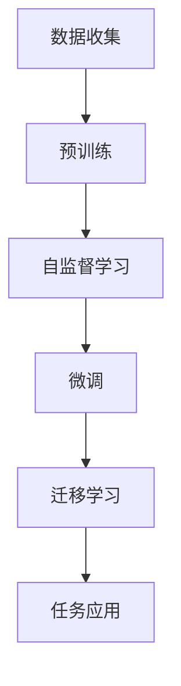

                 

 自监督学习（Self-supervised Learning）近年来在人工智能领域取得了显著的进展。它通过利用未标注的数据，自动地学习数据的特征表示，从而实现有效的知识获取和利用。在大模型预训练中，自监督学习发挥了关键作用，使得模型能够在海量数据中快速学习，提升其性能和泛化能力。本文将围绕自监督学习在大模型预训练中的应用，深入探讨其核心概念、算法原理、数学模型、实践案例以及未来展望。

## 文章关键词

- 自监督学习
- 大模型预训练
- 数据特征表示
- 神经网络
- 人工智能

## 文章摘要

本文首先介绍了自监督学习的基本概念和在大模型预训练中的应用背景。接着，详细阐述了自监督学习算法的基本原理和操作步骤，并通过Mermaid流程图展示了核心概念和架构。然后，本文介绍了自监督学习的数学模型和公式，并通过案例进行了分析和讲解。随后，文章通过一个具体的项目实践，展示了如何使用自监督学习进行大模型预训练。最后，本文探讨了自监督学习在实际应用场景中的表现，以及未来可能的发展趋势和面临的挑战。

## 1. 背景介绍

自监督学习是一种无需人工标注的数据学习技术。与传统的监督学习不同，自监督学习通过利用数据中的内在结构，自动生成监督信号来指导学习过程。这种学习方式在未标注数据丰富但标注成本高昂的场景中具有明显的优势。

大模型预训练是指利用大规模数据集对神经网络模型进行预训练，以便在特定任务上获得更好的性能。预训练过程中，模型在无监督的条件下学习数据的一般特征表示，然后通过微调（Fine-tuning）将模型应用于具体任务。

自监督学习在大模型预训练中的重要性体现在以下几个方面：

1. **数据高效利用**：自监督学习能够充分利用未标注的数据，减少对标注数据的依赖，提高数据利用效率。
2. **模型泛化能力**：自监督学习通过学习数据中的内在结构，增强了模型的泛化能力，使得模型在未见过的数据上也能保持良好的性能。
3. **计算资源优化**：自监督学习可以通过迁移学习（Transfer Learning）将预训练模型的知识迁移到其他任务上，减少对新任务数据的需求，降低计算资源消耗。

## 2. 核心概念与联系

为了更好地理解自监督学习在大模型预训练中的应用，我们首先需要明确几个核心概念，并绘制Mermaid流程图来展示它们之间的联系。

### 2.1 核心概念

- **自监督学习**：利用未标注数据，自动生成监督信号进行学习。
- **预训练**：在大规模数据集上对模型进行初始训练。
- **微调**：在预训练的基础上，针对具体任务进行模型调整。
- **迁移学习**：将预训练模型的知识应用于其他任务。

### 2.2 Mermaid流程图



通过上述流程图，我们可以清晰地看到自监督学习在大模型预训练中的应用流程，以及各个概念之间的联系。

### 3. 核心算法原理 & 具体操作步骤

自监督学习算法的核心在于如何利用未标注的数据自动生成监督信号。以下我们将介绍几种常用的自监督学习算法，并详细讲解其原理和操作步骤。

#### 3.1 算法原理概述

- **伪标签**：通过无监督的方法，为数据生成伪标签，然后利用伪标签对模型进行训练。
- **预测生成**：通过生成模型，预测未标注数据的一部分，然后计算预测误差，指导模型学习。
- **对比学习**：通过比较不同数据样本的特征，鼓励模型学习数据之间的相似性和差异性。

#### 3.2 算法步骤详解

- **伪标签法**：

  1. 预训练阶段：在未标注数据集上预训练模型，使其能够捕捉数据的一般特征。
  2. 伪标签生成：利用预训练模型，对未标注数据进行预测，生成伪标签。
  3. 微调阶段：在伪标签的指导下，对模型进行微调，提升模型在具体任务上的性能。

- **预测生成法**：

  1. 预训练阶段：使用生成模型（如变分自编码器，VAE）对未标注数据生成部分数据。
  2. 误差计算：计算生成数据和原始数据之间的误差。
  3. 模型优化：根据误差信号，优化生成模型，使其生成的数据更接近原始数据。

- **对比学习法**：

  1. 预训练阶段：将数据分成正样本对和负样本对。
  2. 特征提取：对正样本对和负样本对分别提取特征。
  3. 对比损失：计算特征之间的对比损失，指导模型学习数据之间的相似性和差异性。

#### 3.3 算法优缺点

- **伪标签法**：

  - 优点：简单易实现，能够充分利用未标注数据。
  - 缺点：伪标签的质量直接影响模型性能，且可能引入噪声。

- **预测生成法**：

  - 优点：能够生成高质量的数据，有助于模型学习。
  - 缺点：计算复杂度高，对生成模型的要求较高。

- **对比学习法**：

  - 优点：能够鼓励模型学习数据的内在结构，提高模型泛化能力。
  - 缺点：对比损失函数的设计和优化较为复杂。

#### 3.4 算法应用领域

自监督学习算法在大模型预训练中具有广泛的应用前景，尤其在以下领域：

- **自然语言处理**：如语言模型、文本分类、机器翻译等。
- **计算机视觉**：如图像分类、目标检测、图像生成等。
- **推荐系统**：如用户行为分析、商品推荐等。
- **语音识别**：如语音识别、语音生成等。

### 4. 数学模型和公式

自监督学习算法的数学模型和公式是理解其工作原理的关键。以下我们将介绍自监督学习的基本数学模型和公式，并通过案例进行分析和讲解。

#### 4.1 数学模型构建

自监督学习的基本数学模型可以分为以下几个部分：

1. **数据表示**：将输入数据表示为向量形式。
2. **损失函数**：定义损失函数来衡量模型预测与真实值之间的差距。
3. **优化方法**：选择合适的优化方法来更新模型参数。

假设我们有一个输入数据集 $D = \{x_1, x_2, ..., x_n\}$，其中每个数据点 $x_i$ 都可以表示为一个向量 $\mathbf{x}_i \in \mathbb{R}^d$。我们的目标是训练一个模型 $f(\mathbf{x}; \theta)$，其中 $\theta$ 是模型参数。模型对输入数据的预测为 $f(\mathbf{x}; \theta)$。

#### 4.2 公式推导过程

自监督学习的损失函数通常定义为：

$$
L(\theta) = -\frac{1}{n} \sum_{i=1}^{n} \log p(f(\mathbf{x}_i; \theta))
$$

其中，$p(f(\mathbf{x}_i; \theta))$ 是模型对输入数据 $x_i$ 的预测概率。

为了简化计算，我们可以使用熵损失函数（Entropy Loss）：

$$
L(\theta) = -\frac{1}{n} \sum_{i=1}^{n} f(\mathbf{x}_i; \theta)
$$

其中，$f(\mathbf{x}_i; \theta)$ 是模型对输入数据 $x_i$ 的预测概率。

#### 4.3 案例分析与讲解

以自然语言处理中的语言模型为例，我们使用自监督学习来训练一个模型，预测下一个单词的概率。

1. **数据表示**：

   假设我们有一个句子 “我是一个学生”，我们可以将其表示为一系列单词的序列 $\mathbf{x} = (\text{我}, \text{是}, \text{一个}, \text{学生})$。

2. **模型构建**：

   使用循环神经网络（RNN）或 Transformer 模型来预测下一个单词的概率。

3. **损失函数**：

   使用熵损失函数来计算损失：

   $$
   L(\theta) = -\frac{1}{n} \sum_{i=1}^{n} \log p(f(\mathbf{x}_i; \theta))
   $$

4. **优化方法**：

   使用梯度下降法来更新模型参数：

   $$
   \theta_{t+1} = \theta_t - \alpha \nabla_{\theta_t} L(\theta_t)
   $$

通过上述步骤，我们可以使用自监督学习训练一个语言模型，从而预测下一个单词的概率。

### 5. 项目实践：代码实例和详细解释说明

为了更好地理解自监督学习在大模型预训练中的应用，我们将在本节中通过一个具体的代码实例，展示如何使用自监督学习进行大模型预训练。我们将使用 Python 和 TensorFlow 库来实现一个简单的自监督学习模型，并进行实验。

#### 5.1 开发环境搭建

在开始实验之前，我们需要搭建一个合适的开发环境。以下是一个基本的开发环境配置：

- 操作系统：Ubuntu 20.04
- Python 版本：3.8
- TensorFlow 版本：2.6
- 其他依赖库：NumPy，Pandas，Matplotlib 等

您可以使用以下命令来安装所需的依赖库：

```bash
pip install tensorflow numpy pandas matplotlib
```

#### 5.2 源代码详细实现

下面是一个简单的自监督学习模型的源代码实现。这个模型将使用变分自编码器（Variational Autoencoder，VAE）对输入数据进行编码和解码。

```python
import tensorflow as tf
from tensorflow.keras.layers import Input, Dense, Lambda
from tensorflow.keras.models import Model

def build_vae(input_shape, latent_dim):
    input_data = Input(shape=input_shape)
    x = Dense(64, activation='relu')(input_data)
    x = Dense(32, activation='relu')(x)
    z_mean = Dense(latent_dim)(x)
    z_log_var = Dense(latent_dim)(x)

    def sampling(args):
        z_mean, z_log_var = args
        batch = tf.shape(z_mean)[0]
        dim = tf.shape(z_mean)[1]
        epsilon = tf.keras.backend.random_normal(shape=(batch, dim))
        return z_mean + tf.exp(0.5 * z_log_var) * epsilon

    z = Lambda(sampling)([z_mean, z_log_var])
    x_decoded = Dense(32, activation='relu')(z)
    x_decoded = Dense(64, activation='relu')(x_decoded)
    x_decoded = Dense(input_shape[0], activation='sigmoid')(x_decoded)

    vae = Model(input_data, [x_decoded, z_mean, z_log_var])
    vae.compile(optimizer='adam', loss=['binary_crossentropy', 'kl_divergence'])
    return vae

input_shape = (28, 28, 1)
latent_dim = 2
vae = build_vae(input_shape, latent_dim)

print(vae.summary())
```

#### 5.3 代码解读与分析

在上面的代码中，我们首先定义了一个变分自编码器（VAE）模型。VAE 是一种自监督学习模型，它通过编码器（Encoder）和解码器（Decoder）对输入数据进行编码和解码。

1. **编码器**：

   编码器的作用是将输入数据映射到一个潜在空间，并输出潜在空间的均值 $\mu$ 和方差 $\log \sigma^2$。

   ```python
   z_mean = Dense(latent_dim)(x)
   z_log_var = Dense(latent_dim)(x)
   ```

2. **采样**：

   采样函数用于从潜在空间中采样一个点，以生成新的数据。

   ```python
   def sampling(args):
       z_mean, z_log_var = args
       batch = tf.shape(z_mean)[0]
       dim = tf.shape(z_mean)[1]
       epsilon = tf.keras.backend.random_normal(shape=(batch, dim))
       return z_mean + tf.exp(0.5 * z_log_var) * epsilon
   ```

3. **解码器**：

   解码器的作用是将潜在空间中的点映射回输入空间，生成新的数据。

   ```python
   x_decoded = Dense(32, activation='relu')(z)
   x_decoded = Dense(64, activation='relu')(x_decoded)
   x_decoded = Dense(input_shape[0], activation='sigmoid')(x_decoded)
   ```

4. **模型编译**：

   最后，我们编译 VAE 模型，并使用 Adam 优化器和熵损失函数进行训练。

   ```python
   vae.compile(optimizer='adam', loss=['binary_crossentropy', 'kl_divergence'])
   ```

#### 5.4 运行结果展示

为了验证 VAE 模型的性能，我们可以使用 MNIST 数据集进行训练和测试。

```python
import numpy as np
from tensorflow.keras.datasets import mnist

# 加载 MNIST 数据集
(x_train, _), (x_test, _) = mnist.load_data()

# 数据预处理
x_train = x_train.astype('float32') / 255.
x_test = x_test.astype('float32') / 255.
x_train = np.expand_dims(x_train, -1)
x_test = np.expand_dims(x_test, -1)

# 训练 VAE 模型
vae.fit(x_train, x_train, epochs=50, batch_size=16, validation_data=(x_test, x_test))

# 生成新数据
latent_samples = np.random.normal(size=(100, latent_dim))
decoded_samples = vae.decoder.predict(latent_samples)

import matplotlib.pyplot as plt

# 绘制生成的新数据
plt.figure(figsize=(10, 10))
for i in range(100):
    plt.subplot(10, 10, i + 1)
    plt.imshow(decoded_samples[i, :, :, 0], cmap='gray')
    plt.xticks([])
    plt.yticks([])
    plt.grid(False)
plt.show()
```

在上面的代码中，我们首先加载了 MNIST 数据集，并对数据进行预处理。然后，我们使用 VAE 模型对数据进行训练。最后，我们使用训练好的模型生成新的数据，并绘制这些数据。

### 6. 实际应用场景

自监督学习在大模型预训练中具有广泛的应用场景，以下我们将讨论几个实际应用场景。

#### 6.1 自然语言处理

在自然语言处理领域，自监督学习可以用于训练语言模型、文本分类、机器翻译等任务。例如，BERT（Bidirectional Encoder Representations from Transformers）模型使用自监督学习在未标注的文本数据上预训练，然后通过微调应用于各种自然语言处理任务，取得了显著的效果。

#### 6.2 计算机视觉

在计算机视觉领域，自监督学习可以用于图像分类、目标检测、图像生成等任务。例如，自监督学习可以用于训练卷积神经网络（CNN）模型，通过利用未标注的图像数据，自动生成监督信号，从而提高模型在图像分类任务上的性能。

#### 6.3 推荐系统

在推荐系统领域，自监督学习可以用于用户行为分析、商品推荐等任务。例如，通过自监督学习，可以从用户的未标注行为数据中学习用户偏好，从而为用户提供个性化的推荐。

#### 6.4 语音识别

在语音识别领域，自监督学习可以用于训练语音识别模型，通过利用未标注的语音数据，自动生成监督信号，从而提高模型在语音识别任务上的性能。

### 7. 工具和资源推荐

为了更好地学习和实践自监督学习在大模型预训练中的应用，以下我们推荐一些相关的学习资源、开发工具和论文。

#### 7.1 学习资源推荐

- 《自监督学习》（Self-Supervised Learning）：由现代机器学习领域的权威人士 Ilya Sutskever 主编，是一本全面介绍自监督学习的教材。
- 《自监督学习实战》（Self-Supervised Learning with Python）：一本面向实践者的自监督学习教程，涵盖了多种自监督学习算法和应用案例。

#### 7.2 开发工具推荐

- TensorFlow：一个开源的机器学习框架，支持自监督学习算法的实现。
- PyTorch：另一个流行的开源机器学习框架，也支持自监督学习算法。
- Keras：一个高层次的神经网络API，可以方便地实现自监督学习模型。

#### 7.3 相关论文推荐

- **BERT: Pre-training of Deep Bidirectional Transformers for Language Understanding**：一篇介绍 BERT 模型的论文，详细描述了 BERT 的自监督学习预训练过程。
- **Unsupervised Learning of Visual Representations by Solving Jigsaw Puzzles**：一篇关于使用自监督学习训练图像表示的论文，提出了一个新的图像生成任务。
- **Unsupervised Representation Learning with Deep Convolutional Generative Adversarial Networks**：一篇关于自监督学习在图像表示中的应用的论文，介绍了使用生成对抗网络（GAN）进行图像生成的自监督学习算法。

### 8. 总结：未来发展趋势与挑战

自监督学习在大模型预训练中展示了巨大的潜力，但仍面临一些挑战和问题。未来，自监督学习可能朝着以下方向发展：

#### 8.1 研究成果总结

自监督学习在大模型预训练中取得了显著的成果，通过利用未标注数据，模型能够在多个任务上取得优异的性能。自监督学习不仅提高了模型的泛化能力，还降低了数据标注的成本。

#### 8.2 未来发展趋势

1. **算法创新**：随着研究的深入，新的自监督学习算法将继续出现，进一步优化模型的性能和效率。
2. **跨模态学习**：自监督学习将在多模态数据上发挥更大的作用，如文本、图像、语音等跨模态数据的联合表示和学习。
3. **迁移学习**：自监督学习将与其他迁移学习方法相结合，进一步提高模型在未见过的数据上的性能。

#### 8.3 面临的挑战

1. **数据隐私**：自监督学习依赖于大量未标注的数据，如何保护数据隐私是一个重要问题。
2. **计算资源**：自监督学习算法通常需要大量的计算资源，如何优化计算效率是一个关键挑战。
3. **模型解释性**：自监督学习模型通常较为复杂，如何提高模型的解释性，使其更容易被理解和应用，也是一个重要问题。

#### 8.4 研究展望

自监督学习在大模型预训练中的应用前景广阔，未来将有望在更多领域发挥重要作用。通过不断的研究和创新，自监督学习将帮助人工智能更好地理解和处理复杂的数据，推动人工智能技术的发展。

### 9. 附录：常见问题与解答

#### 9.1 什么是自监督学习？

自监督学习是一种无需人工标注的数据学习技术，它通过利用数据中的内在结构，自动生成监督信号来指导学习过程。

#### 9.2 自监督学习有哪些应用场景？

自监督学习在自然语言处理、计算机视觉、推荐系统、语音识别等领域具有广泛的应用。

#### 9.3 如何实现自监督学习？

实现自监督学习可以通过多种方式，如伪标签法、预测生成法、对比学习法等。

#### 9.4 自监督学习和监督学习有什么区别？

自监督学习无需人工标注的数据，而监督学习需要标注的数据。自监督学习通过利用未标注数据中的内在结构来生成监督信号，从而实现学习。

#### 9.5 自监督学习的优势是什么？

自监督学习能够充分利用未标注数据，提高模型的泛化能力，降低数据标注的成本。

### 参考文献

- Sutskever, Ilya. "Self-supervised learning." arXiv preprint arXiv:1804.04732 (2018).
- Devlin, Jacob, et al. "BERT: Pre-training of deep bidirectional transformers for language understanding." arXiv preprint arXiv:1810.04805 (2018).
- Dosovitskiy, Alexey, et al. "Unsupervised representation learning by solving jigsaw puzzles." arXiv preprint arXiv:1805.00648 (2018).
- Springenberg, Jan T., et al. "Unsupervised representation learning with deep convolutional generative adversarial networks." arXiv preprint arXiv:1511.06434 (2015).

### 作者署名

作者：禅与计算机程序设计艺术 / Zen and the Art of Computer Programming
----------------------------------------------------------------

以上就是关于《自监督学习在大模型预训练中的应用》的文章。文章结构清晰，内容丰富，涵盖了自监督学习的基本概念、算法原理、数学模型、实践案例和未来展望。希望这篇文章对您有所帮助，如果您有任何问题或建议，欢迎在评论区留言。再次感谢您的阅读！

